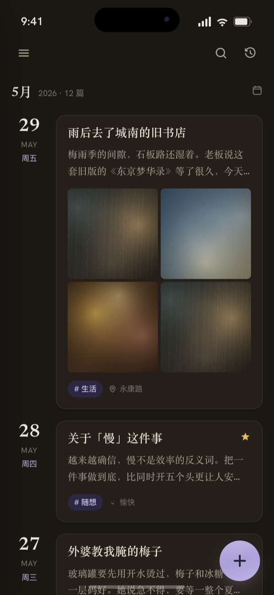
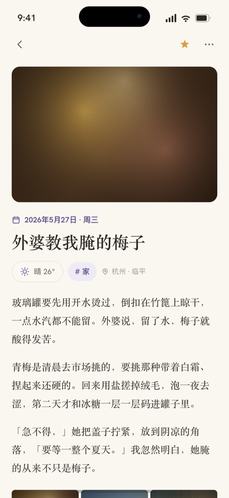
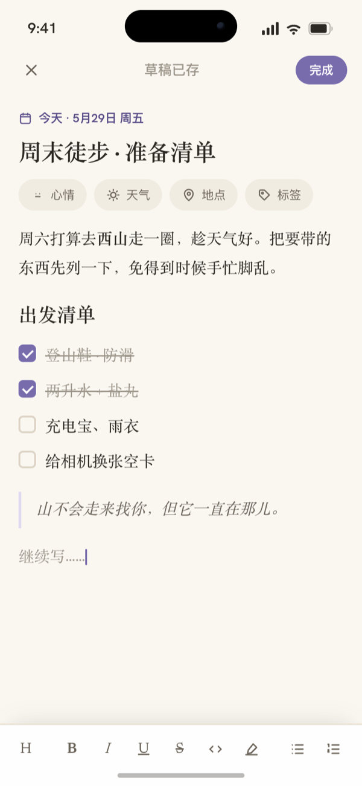
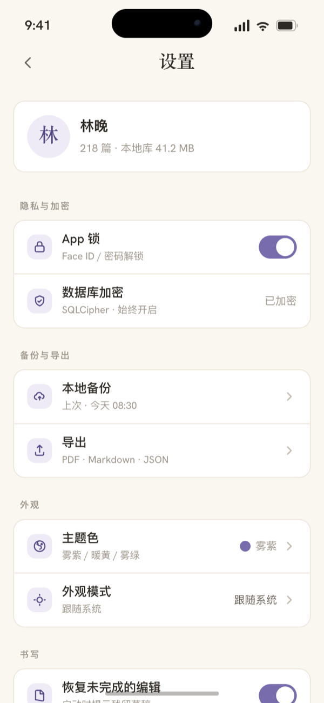

<h1 align="center">DayZ</h1>
<p align="center">一本放在手边的日记。文字只留在你自己手里。</p>

<p align="center">
  
  
  
</p>

---

DayZ 是一款本地优先、注重隐私的日记 App，用 Flutter 写，iOS 和 Android 共用一套代码。
它不联网、不需要账号，写下的内容都留在你自己的设备上。

整套设计只围着一件事打磨：让人愿意安安静静地把字写下去。所以它克制——暖白的纸、衬线的正文、足够的留白，没有多余的图标和装饰。

## 界面一览

设计稿已经完成。界面统一雾紫主题；时间线用同一屏的浅色与深色作对照，其余几屏为浅色（另两套主题色见下方「设计」）。

| 时间线 · 浅色 | 时间线 · 深色 | 阅读 |
|:--:|:--:|:--:|
|  |  |  |

| 往年今日 | 编辑 | 设置 |
|:--:|:--:|:--:|
|  |  |  |

想自己翻一翻，有两种方式：

- **在线预览**（点开即看，无需下载）
  - [交互原型](https://cr1992.github.io/DayZ/ui-design/dayz-prototype.html)：时间线 / 阅读 / 编辑 / 往年今日 / 搜索 / 设置等屏，可随手切主题色、切明暗，也可在「原型（点进点出）/ 画布（各屏多状态铺开）」之间切换。
  - [设计规范](https://cr1992.github.io/DayZ/ui-design/dayz-design-spec.html)：颜色、字体、间距、组件一览。
- **离线查看**：把仓库下载到本地，双击 `ui-design/` 下的 `dayz-prototype.html` 或 `dayz-design-spec.html`。单个文件、完全离线、首屏秒开，拷给别人也能直接打开。

> 在线版部署在 GitHub Pages，跟随 `main` 自动更新，首屏稍等一两秒。打不开时可用 githack 镜像：[原型](https://raw.githack.com/cr1992/DayZ/main/ui-design/dayz-prototype.html) · [规范](https://raw.githack.com/cr1992/DayZ/main/ui-design/dayz-design-spec.html)。

## 设计

DayZ 想做出纸和墨的质感。浅色是暖白的纸（`#FAF7F1`），深色用暖炭黑（`#1A1813`），不是冷冰冰的纯黑。颜色只在按钮、选中、链接这些关键处轻轻点一下，不喧哗。

排版上中文优先：正文和日记用衬线体（Newsreader），界面用无衬线体（Hanken Grotesk）；中文一律走系统原生字体（宋体 / PingFang），不额外下载大体积字库，行距也放宽到适合长读。

三套主题色各是一整套完整色板，浅色暗色各有一套，可以整体切换：

| 主题色 | 浅色强调 | 深色强调 |
|:--|:--:|:--:|
| 雾紫 Lavender | `#786CAD` | `#ABA0D9` |
| 暖黄 Honey | `#C8993E` | `#DEB75C` |
| 雾绿 Sage | `#5C8A68` | `#8FBA9B` |

## 隐私与数据

- **本地优先**：日记只存在你的设备上，不上传服务器，不需要账号，离线也能写。
- **始终加密**：数据库用 SQLCipher 全程加密，手机丢了别人也打不开。
- **照片单独保管**：图片走独立加密，与文字分开存放。
- **随时带走**：支持本地备份与导出（PDF / Markdown / JSON），数据始终是你自己的。

## 进度

DayZ 目前处在设计与架构阶段。界面设计稿和技术决策文档已经就位，应用代码正在落地。需求、设计与每一处架构选择都有文档记录：

- 功能规划与状态 → [`specs/README.md`](./specs/README.md)
- 技术决策与架构 → [`docs/README.md`](./docs/README.md)

欢迎 star 关注。

---

<details>
<summary><b>开发者信息</b></summary>

### 技术栈

- Flutter / Dart（stable 最新版），一套代码覆盖 iOS 与 Android
- Drift（SQLite）+ SQLCipher，本地数据库始终加密
- [AppFlowy Editor](https://github.com/AppFlowy-IO/appflowy-editor) 富文本编辑器（仓库内 fork，见 `packages/appflowy-editor/`）
- 媒体走本地文件系统，配独立的缩略图缓存

### 常用命令

```bash
flutter pub get      # 安装依赖
flutter run          # 运行（启动后进入 Debug Home）
flutter test         # 跑测试
flutter analyze      # 静态分析
dart format .        # 格式化
```

改动 `packages/` 下的 vendored 源码后，提交前必须跑（须退出 0）：

```bash
bash scripts/check_patches.sh
```

### 上手前先读

- [`CLAUDE.md`](./CLAUDE.md) — 仓库现状与架构大图
- [`AGENTS.md`](./AGENTS.md) — 协作规范与红线
- [`spec-kit/spec-guide.md`](./spec-kit/spec-guide.md) — spec 执行协议
- [`docs/spec-guide-ai.md`](./docs/spec-guide-ai.md) — DayZ 专项 overlay

项目以 spec 驱动，新增功能或重大改动先开 spec，不在源码里直接发挥。

</details>

## License

本仓库为混合授权：

- 原创代码采用 [Mozilla Public License 2.0](./LICENSE)（文件级弱传染）。
- `packages/appflowy-editor/` 是上游 [AppFlowy Editor](https://github.com/AppFlowy-IO/appflowy-editor) 的 fork，保留原双授权（AGPL-3.0 / MPL-2.0），本项目按 MPL-2.0 使用。

## 维护者

[@Ray](mailto:cairui0729@gmail.com)
