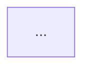
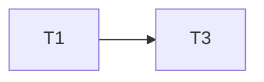
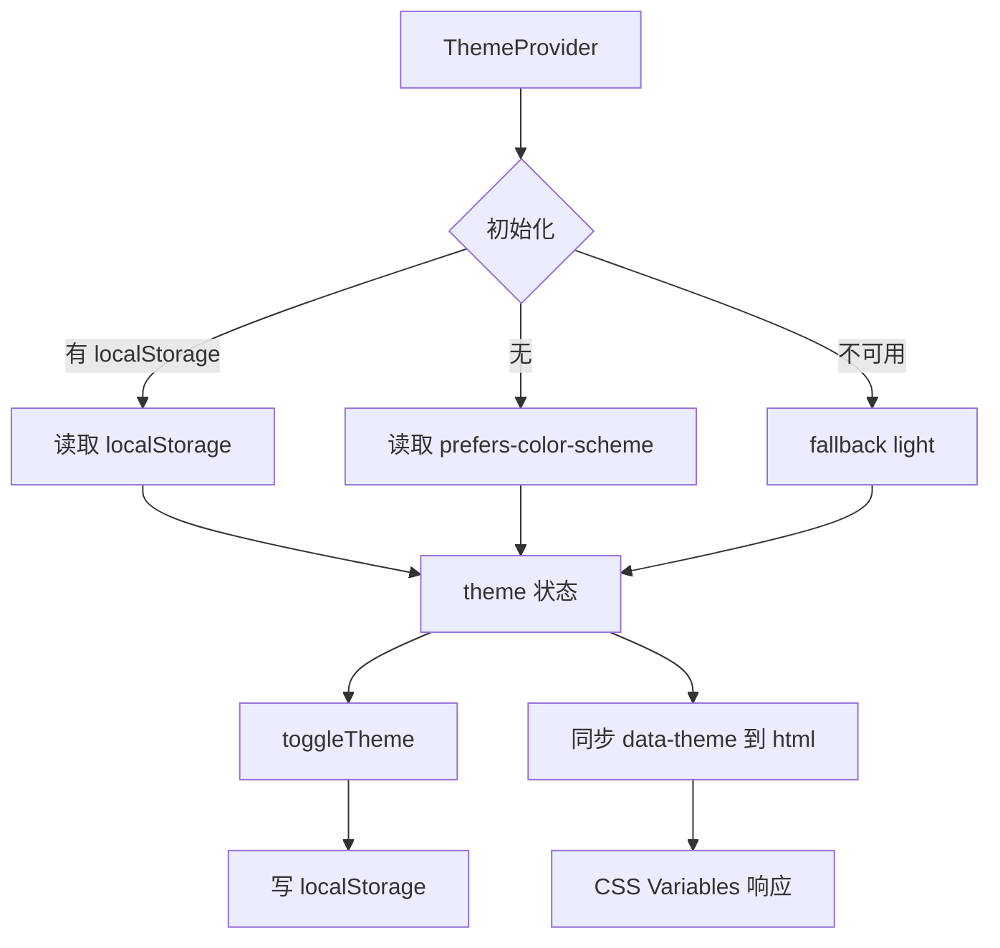
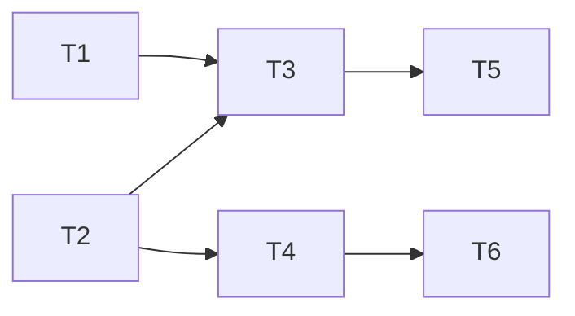

# Spec 规范（AI 执行版）

面向「人类编写、AI 执行」的功能规格规范。先按第 0 节选档，再按对应档位编写与执行。所有任务执行须遵守第 5 节「执行协议」。

-----

## 0 · 选档

默认精简档；命中下表任一右列条件，升级标准档。

| 维度 | 精简档 | 标准档 |
|------|--------|--------|
| 任务数 | ≤ ~8 | > ~8 |
| 涉及安全 / 权限 / 无障碍 / 性能 / 多端兼容 | 否 | 是（任一） |
| 跨多个模块 | 否 | 是 |

两档共享：`R`/`NF` 编号、`D` 决策编号、任务双向引用、执行协议、任务边界、自动/人工两段验收。
标准档额外含：`NF` 非功能需求、verification.md、文件头文档状态、README 索引、里程碑。

升级（精简 → 标准）只做加法：补文件头 `文档状态`；requirement 补 `## 非功能需求`；新建 verification.md 并把跨任务校验移入；建/更新 README 索引。

-----

# 第一部分 · 精简档

目录：`specs/{功能名}/` 下放 `requirement.md`、`design.md`、`tasks.md`。文件夹名 kebab-case。

## P1 · requirement.md

```markdown
---
作者：@yourname
创建日期：YYYY-MM-DD
---

# {功能名}

## 背景
{为什么需要}

## 范围外
- {明确不做什么}

## 需求

### R1 · {需求名}
{用 SHALL / MUST / SHOULD / MAY 描述系统行为}
- 前提：{初始状态}
- 操作：{触发动作}
- 结果：{预期可观测结果}
```

规则：
- 描述外部可观测行为，不描述内部实现。
- 出现可度量硬约束（对比度、性能阈值）就地用 `NF1` 编号补一节。
- 该 NF 若只需单任务内验证，留精简档；若需跨任务/全站校验，升级标准档并启用 verification.md，不得塞进单任务人工项。

关键词：MUST/SHALL = 绝对要求；SHOULD = 推荐，可有理由例外；MAY = 可选。

## P2 · design.md

```markdown
---
作者：@yourname
创建日期：YYYY-MM-DD
---

# 设计：{功能名}

## 技术决策

### D1 · {决策点}
- **背景：** {问题或约束}
- **选择：** {最终选择}
- **理由：** {为什么}
- **代价：** {缺点或局限，是否可接受}

## 文件变更
- `{路径}`  新建 / 修改 / 删除

## 已知风险
- {当前不处理的问题或后续需关注点}
```

规则：决策必须用 `D` 编号且必须写「代价」。文件变更清单是任务「可改文件」的来源。架构图按需添加。

## P3 · tasks.md

```markdown
---
作者：@yourname
创建日期：YYYY-MM-DD
---

# 任务列表：{功能名}

## 依赖速览
> 以各任务 inline「依赖」字段为准。
T1, T2（并行）→ T3 → T4

-----

- [ ] T1 · {任务名}

**依赖：** 无 ｜ **关联需求：** R1 ｜ **依据设计：** D1 ｜ **可改文件：** `path/to/file`

### 背景
{上下文。若与并行任务有归属歧义，点明哪部分逻辑归本任务。}

### 实施
1. {步骤一}
2. {步骤二}

### 验收标准（做完即止）
- {可独立验证的完成条件}（自动 / 人工）

### 禁止（可选）
- {易越界时才填}

### 验收方式
- 自动：
  ```bash
  {自动化命令}
  ```
- 人工（仅当无法自动化时）：
  - {目视/操作核查项，注明核查人}

### 验收记录
```
日期：—
自动：—
人工：—（核查人 @）
```
```

任务状态：`- [ ]` 未开始 ｜ `- [-]` 进行中（含「自动已过、待人工确认」）｜ `- [x]` 已完成。

任务完成规则：自动命令全部通过 + 人工核查项全部经核查人确认 + 验收记录填写完毕，方可置 `[x]`。

字段规则：
- `关联需求`（目标）+ `依据设计`（约束）+ `可改文件`（空间边界）三者必填。
- 验收标准只放本任务可独立验证的条件；跨任务校验属 verification（精简档无 verification，则该功能应升级标准档）。
- 每条验收标准标注自动或人工；人工项注明核查人。
- 并行任务间有归属歧义的逻辑，必须在其中一个任务背景里点明归属。

-----

# 第二部分 · 标准档

目录：
```
specs/
├── README.md
├── active/{功能名}/{requirement,design,tasks}.md + verification.md
└── archive/{YYYY-MM-DD}-{功能名}/ 或 cancelled-{YYYY-MM-DD}-{功能名}/
```

## 状态与元数据

两种状态各有唯一来源，不互相复制：
- **功能生命周期**（草稿/进行中/已完成/已废弃）：唯一来源是 `README.md`，由 tasks 完成情况驱动。
- **文档成熟度**（草稿/定稿）：唯一来源是各文件元数据头。

文件头：
```markdown
---
作者：@yourname
创建日期：YYYY-MM-DD
最后更新：YYYY-MM-DD
文档状态：草稿 / 定稿
---
```

功能完成判定（置「已完成」的充要条件，三者全满足才可归档）：
1. tasks.md 所有任务 `[x]`，每个任务验收记录已填。
2. 若存在 verification.md，所有检查项已勾选、验证命令通过；含人工成分的检查项以人工确认为勾选前提（自动过但人工未复核则不算勾选）。
3. README.md 中该功能状态更新为「已完成」。

归档后返工：「已完成」是终态，归档目录只读、不复活、不追加任务。返工一律新建 spec：小修建精简档（README 交叉引用「修复自」），大改建标准档（交叉引用「衍生自/被取代」）。够不上立 spec 的改动直接改，不走流程。

## README.md（功能生命周期唯一来源）

```markdown
# Specs 索引

## 进行中
| 功能 | 优先级 | 状态 | 负责人 | 创建 |
|------|--------|------|--------|------|
| [add-dark-mode](active/add-dark-mode/) | P1 | 进行中 | @yourname | 2026-05-23 |

## 已归档
| 功能 | 结果 | 归档日期 |
|------|------|----------|
| [add-search](archive/2026-04-10-add-search/) | 已完成 | 2026-04-10 |
```

列说明：
- **优先级**（P0/P1/P2…）：跨 spec 的横向排序，规划时定，是「先做哪个」的依据。其家在 README（属性是相对其他功能而言的，不归任何单个 spec）。
- **状态**：功能生命周期，本表为唯一来源。

不设「进度」列：精确进度派生自 tasks.md，静态表格无法动态计算，手动维护必漂移。欲知进度直接看对应 `tasks.md` 的勾选情况。README 只对「状态」负责。

执行选取规则：在「未开始 / 进行中」的 spec 中，挑**优先级最高**的执行；同级则按创建顺序。

> 就绪状态（就绪 / 被阻塞）暂不设列：它派生自 spec 间依赖，而当前规范未建模跨 spec 依赖，无依赖时该列恒为「就绪」、无信息量。待引入 spec 间依赖后再启用——届时选取规则相应改为「优先级最高且就绪（无未完成前置）者」。

## requirement.md（标准档）

在精简档 P1 基础上，必含 `## 非功能需求` 段，每条用 `NF` 编号且可度量：

```markdown
## 非功能需求

### NF1 · {约束名}
{可度量指标。例：正文文本对比度 MUST ≥ WCAG AA（4.5:1）}
```

## design.md（标准档）

在精简档 P2 基础上，决策可写完整 ADR（背景/选项/选择/理由/代价），并补架构图：

```markdown
### D1 · {决策点}
- **背景：** {问题或约束}
- **选项：** {方案A} / {方案B} / {方案C}
- **选择：** {最终选择}
- **理由：** {对比其他方案的优劣}
- **代价：** {缺点或局限，是否可接受}

## 架构

```

## tasks.md（标准档）

模板同精简档 P3，外加：

```markdown
## 任务依赖图
> 由各任务 inline「依赖」字段汇总，仅供速览；以 inline 为准。


并行组：
- Group A：T1, T2
- Group B：T3, T4

里程碑（仅当存在可独立交付/演示的切点时标，与任务数无关）：
- M1 …（T1-T4）：{可独立交付的子集}
```

验收边界（tasks 与 verification 划清）：
- tasks 验收 = 单任务自身可独立验证的条件。
- verification 验收 = 跨多个任务才成立的集成/端到端/专项检查。
- 同一检查不在两处重复；需多任务都完成才能跑的，归 verification。

## verification.md（标准档默认含，纯逻辑型功能可省）

触发条件（命中任一即写）：安全/权限、无障碍、跨多模块、性能要求、多端/多浏览器兼容。
覆盖跨任务质量，不重复任务内已验证内容。每个检查项标注自动/人工，人工项注核查人。

```markdown
---
作者：@yourname
创建日期：YYYY-MM-DD
最后更新：YYYY-MM-DD
文档状态：草稿
---

# 验证：{功能名}

## 功能验证（端到端）
| 场景 | 操作 | 预期结果 | 关联需求 | 方式 |
|------|------|----------|----------|------|
| {场景} | {操作} | {预期} | R1 | 自动 / 人工(@核查人) |

## 专项检查
> 对应 requirement 的 NF 编号。

### 无障碍（NF?）
- [ ] {检查项} — 自动：`{命令}`
- [ ] {检查项} — 人工（@核查人）

### 性能（NF?）
- [ ] {检查项} — 自动：`{命令}`

### 兼容性（NF?）
- [ ] {检查项} — 人工（@核查人）

## 回归检查
- [ ] {模块/页面无异常} — 自动：`{命令}` / 人工（@核查人）

## 验证命令（汇总自动项）
```bash
{自动化命令}
```
```

归档（原子动作，三步必须一次性全部完成，不可只做其一）：

1. **移目录**：
   ```bash
   mv specs/active/{功能名} specs/archive/{YYYY-MM-DD}-{功能名}            # 已完成
   mv specs/active/{功能名} specs/archive/cancelled-{YYYY-MM-DD}-{功能名}  # 已废弃
   ```
2. **移表行**：将该行从 README「进行中」表剪切到「已归档」表，填入结果与归档日期。
3. **改链接**：更新该行链接，从 `active/{功能名}` 改为新的归档路径 `archive/{YYYY-MM-DD}-{功能名}`（否则产生死链）。

> 三步跨「终端命令 + 文件编辑」两种操作，最易漏掉第 3 步导致死链。完成 `mv` 后必须立即改 README 的行与链接，作为同一次提交，不留时差。

-----

# 第三部分 · 执行协议（两档通用，每个任务必须遵守）

1. **先复述后执行**：动手前复述本任务「关联需求 / 依据设计 / 可改文件」，确认无误再开始。
2. **文件白名单**：只改「可改文件」内的文件；需动清单外文件，停下说明原因并请求确认。任务对应的测试/spec 文件视为「可改文件」的隐含延伸，可直接创建，无需单独声明。
3. **验收标准即终点**：做完验收标准列出的项即停。衍生想法记入「已知风险」或新任务，不在本任务内顺手扩展。
4. **验收方式为准**：有自动命令的以命令通过为准；无法自动化的以显式标注的人工核查项（注核查人）为准。两者都不接受「我觉得做完了」式自评。
5. **失败处理**：验收未通过时，同一改动方向最多重试 2 次 → 仍失败则停止并回退本任务改动 → 升级给人，附失败现象与已尝试的修法。不反复试错、不带病推进到下一任务。
6. **人工项交接**：任务含人工核查项时，AI 完成自动部分后置 `[-]`（待确认），交接核查人，不得自行确认人工项。**核查人给出明确确认后，AI 可代填验收记录的人工行并将状态置 `[x]`**；未获确认不得置 `[x]`。
7. **同步 README 状态**：功能生命周期发生**跨阶段变化**时，立即更新 README 的「状态」列——开始第一个任务时「草稿 → 进行中」；满足完成判定时「进行中 → 已完成」并按归档 checklist 移行；废弃时「→ 已废弃」。这是「何时该碰 README」的明确触发点，不依赖 AI 自行想起。README 不含进度数字，无逐任务同步负担。

-----

# 完整示例（深色模式，标准档）

## requirement.md
```markdown
---
作者：@yourname
创建日期：2026-05-23
最后更新：2026-05-23
文档状态：定稿
---

# 深色模式

## 背景
夜间使用亮度刺眼，需深色模式，并支持跟随系统主题。

## 范围外
- 自定义颜色主题
- 分页面单独覆盖主题

## 功能需求

### R1 · 手动切换主题
用户 SHALL 能在设置页手动切换亮色/深色主题。
- 前提：用户在设置页
- 操作：点击主题切换开关
- 结果：页面立即切换，无需刷新

### R2 · 偏好持久化
系统 SHALL 记住主题偏好，下次打开自动应用。
- 前提：上次选了深色
- 操作：重新打开应用
- 结果：自动应用深色

### R3 · 跟随系统主题
系统 SHOULD 在首次访问时跟随系统主题偏好。
- 前提：首次访问、无偏好、系统为深色
- 操作：打开应用
- 结果：默认深色

## 非功能需求

### NF1 · 对比度
两套主题下正文文本与背景对比度 MUST ≥ WCAG AA（4.5:1）。

### NF2 · 无障碍可操作
切换控件 MUST 有 aria-label，可被屏幕阅读器识别。

### NF3 · 兼容性
SHALL 在最新版 Chrome/Safari/Firefox 及 mobile/desktop 下正常工作。
```

## design.md
```markdown
---
作者：@yourname
创建日期：2026-05-23
最后更新：2026-05-23
文档状态：定稿
---

# 设计：深色模式

## 技术决策

### D1 · 状态管理方案
- **背景：** 跨组件共享主题状态
- **选项：** React Context / Redux / Zustand
- **选择：** React Context
- **理由：** 二值状态，Context 足够，无需额外依赖
- **代价：** 深层嵌套性能略差，当前规模可接受

### D2 · 样式切换方案
- **背景：** 运行时动态切换全局样式
- **选项：** CSS Custom Properties / CSS-in-JS / class 切换
- **选择：** CSS Custom Properties，经 `data-theme` attribute 切换
- **理由：** 无运行时开销，兼容现有样式体系，浏览器原生支持
- **代价：** IE11 不支持，项目已不兼容 IE，可接受

### D3 · 持久化方案
- **背景：** 跨会话记住偏好
- **选项：** localStorage / cookie / 服务端
- **选择：** localStorage，key = `theme-preference`
- **理由：** 无需后端；优先级 localStorage → 系统偏好 → light
- **代价：** 引入 SSR 后需改造 hydration，当前 CSR 暂不处理

## 架构


## 文件变更
- `src/contexts/ThemeContext.tsx`   新建
- `src/components/ThemeToggle.tsx`   新建
- `src/styles/globals.css`           修改
- `src/app/layout.tsx`               修改
- `src/app/settings/page.tsx`        修改

## 已知风险
- 引入 SSR 后 localStorage 需改造（hydration mismatch），暂不处理
- 不监听系统主题变化事件，用户切换系统主题后需手动同步
```

## tasks.md
```markdown
---
作者：@yourname
创建日期：2026-05-23
最后更新：2026-05-23
文档状态：定稿
---

# 任务列表：深色模式

## 任务依赖图
> 由各任务 inline「依赖」字段汇总，以 inline 为准。


并行组：
- Group A：T1, T2
- Group B：T3, T4
- Group C：T5, T6

（6 个任务、无独立交付切点，不设里程碑。）

-----

- [x] T1 · 定义 CSS 变量

**依赖：** 无 ｜ **关联需求：** R1, R3 ｜ **依据设计：** D2 ｜ **可改文件：** `src/styles/globals.css`

### 背景
在 globals.css 定义 light/dark 两套 CSS 变量，经 `<html data-theme>` 切换。

### 实施
1. 添加 `:root[data-theme="light"]` 变量组
2. 添加 `:root[data-theme="dark"]` 变量组
3. 覆盖 `--bg`、`--text`、`--border`、`--surface`

### 验收标准（做完即止）
- 两套变量均已定义（自动）
- 切换 data-theme 后 CSS 变量即时响应（人工目视）

### 验收方式
- 自动：
  ```bash
  grep -q ':root\[data-theme="light"\]' src/styles/globals.css \
    && grep -q ':root\[data-theme="dark"\]' src/styles/globals.css \
    && grep -q -- '--bg' src/styles/globals.css
  ```
- 人工：
  - DevTools 切换 data-theme 后 `--bg` 等实时变化

### 验收记录
```
日期：2026-05-23
自动：断言全部通过（exit 0）
人工：DevTools 切换后 --bg 正确变化（核查人 @yourname）
```

-----

- [-] T2 · 创建 ThemeContext

**依赖：** 无 ｜ **关联需求：** R2, R3 ｜ **依据设计：** D1, D3 ｜ **可改文件：** `src/contexts/ThemeContext.tsx`

### 背景
管理 light/dark 状态，初始化优先级 localStorage → 系统偏好 → light。
职责边界：本任务只管状态与 toggle，不操作 DOM；同步 data-theme 归 T3。

### 实施
1. 创建 ThemeContext 与 ThemeProvider
2. 初始化优先级逻辑
3. toggleTheme() 同步写 localStorage
4. localStorage 不可用时静默 fallback

### 验收标准（做完即止）
- toggleTheme() 后状态正确切换（自动）
- localStorage 有值时优先（自动）
- localStorage 抛错不崩溃（自动）

### 验收方式
- 自动：
  ```bash
  npx jest ThemeContext --coverage
  ```

### 验收记录
```
日期：—
自动：—
人工：—（无）
```

-----

- [ ] T3 · 挂载 Provider，同步 data-theme

**依赖：** T1, T2 ｜ **关联需求：** R1 ｜ **依据设计：** D2 ｜ **可改文件：** `src/app/layout.tsx`

### 背景
根布局挂载 ThemeProvider。职责边界：同步 `document.documentElement.dataset.theme` 归本任务（T2 不碰 DOM）。

### 实施
1. 根布局包裹 ThemeProvider
2. useEffect 监听 theme，同步 data-theme

### 验收标准（做完即止）
- 加载后 `<html>` 有正确 data-theme（自动）
- 切换后 data-theme 即时更新（自动）

### 验收方式
- 自动：
  ```bash
  npx playwright test theme-mount.spec.ts
  ```

### 验收记录
```
日期：—
自动：—
人工：—（无）
```

-----

- [ ] T4 · 创建 ThemeToggle 组件

**依赖：** T2 ｜ **关联需求：** R1, NF2 ｜ **依据设计：** D1 ｜ **可改文件：** `src/components/ThemeToggle.tsx`

### 背景
消费 ThemeContext，显示主题图标，点击切换。

### 实施
1. 按 theme 显示图标
2. 点击调用 toggleTheme()
3. 支持 className，添加 aria-label

### 验收标准（做完即止）
- 点击后主题切换（自动）
- aria-label 存在（自动，满足 NF2）
- className 透传（自动）

### 禁止
- 不预留多主题接口（范围外）；不做动画（归 T5）

### 验收方式
- 自动：
  ```bash
  npx jest ThemeToggle --coverage
  ```

### 验收记录
```
日期：—
自动：—
人工：—（无）
```

-----

- [ ] T5 · 切换过渡动画

**依赖：** T3 ｜ **关联需求：** R1 ｜ **依据设计：** D2 ｜ **可改文件：** `src/styles/globals.css`

### 背景
body 加 transition，切换时颜色平滑过渡。

### 实施
- body 添加 color/background-color 的 transition

### 验收标准（做完即止）
- transition 属性已生效（自动）
- 切换平滑无突变（人工目视）

### 验收方式
- 自动：
  ```bash
  npx playwright test theme-transition.spec.ts
  ```
- 人工：
  - 切换时颜色渐变自然，无闪烁或硬切

### 验收记录
```
日期：—
自动：—
人工：—（核查人 @）
```

-----

- [ ] T6 · 集成到 Settings 页

**依赖：** T4 ｜ **关联需求：** R1 ｜ **依据设计：** D2 ｜ **可改文件：** `src/app/settings/page.tsx`

### 背景
Settings 页「外观」区块顶部放 ThemeToggle。

### 实施
1. 外观区块引入 ThemeToggle
2. 加「主题」文字标签

### 验收标准（做完即止）
- 可见 ThemeToggle（自动）
- 点击全局切换（自动）

### 禁止
- 不重构现有「外观」区块既有布局与其他设置项

### 验收方式
- 自动：
  ```bash
  npx playwright test settings-theme.spec.ts
  ```

### 验收记录
```
日期：—
自动：—
人工：—（无）
```
```
（全站对比度、多端兼容、视觉回归属跨任务校验，归 verification.md，不作为单任务。）

## verification.md
```markdown
---
作者：@yourname
创建日期：2026-05-23
最后更新：2026-05-23
文档状态：定稿
---

# 验证：深色模式

## 功能验证（端到端）
| 场景 | 操作 | 预期结果 | 关联需求 | 方式 |
|------|------|----------|----------|------|
| 手动切换 | 点击 ThemeToggle | 即时切换，无刷新 | R1 | 自动 |
| 偏好持久化 | 切换后刷新 | 保持上次选择 | R2 | 自动 |
| 首次访问（系统深色）| 清空 localStorage 后访问 | 默认深色 | R3 | 自动 |
| 首次访问（系统浅色）| 清空 localStorage 后访问 | 默认浅色 | R3 | 自动 |
| localStorage 禁用 | 禁用后切换 | 不报错，当次生效 | R2 | 自动 |

## 专项检查

### 无障碍（NF1, NF2）
- [ ] ThemeToggle 有 aria-label — 自动：`npx axe-cli .../settings`
- [ ] light 对比度 ≥ 4.5:1 — 自动：`npx axe-cli`
- [ ] dark 对比度 ≥ 4.5:1 — 自动：`npx axe-cli`

### 兼容性（NF3）
- [ ] Chrome/Safari/Firefox 正常 — 人工（@yourname）
- [ ] mobile/desktop 布局无错位 — 人工（@yourname）

## 回归检查
- [ ] 首页样式无破坏 — 自动：`visual-regression.spec.ts` + 人工复核（@yourname）
- [ ] 详情页样式无破坏 — 自动：`visual-regression.spec.ts` + 人工复核（@yourname）
- [ ] Settings 页样式无破坏 — 自动：`visual-regression.spec.ts` + 人工复核（@yourname）

## 验证命令（汇总自动项）
```bash
npx axe-cli http://localhost:3000 --include main
npx playwright test visual-regression.spec.ts
```
```
