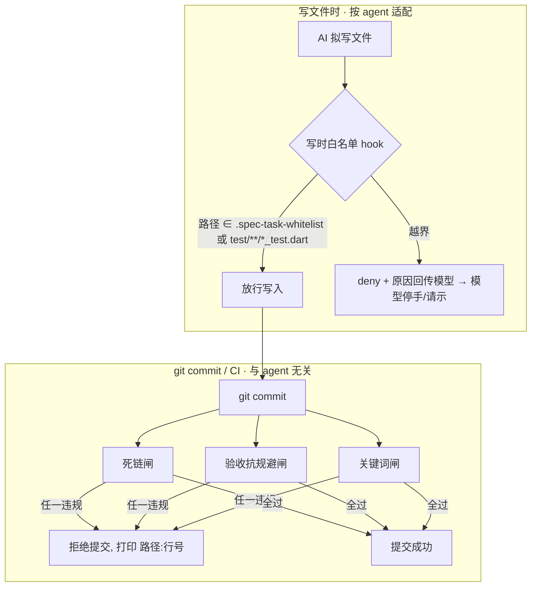

---
作者：@Ray
创建日期：2026-05-29
最后更新：2026-05-29
文档状态：草稿
---

# spec-kit 设计与决策记录（Design & Rationale）

> 这份文档回答三个问题：**spec-kit 整体怎么设计的、每个关键决策为什么这么定、一次实操审计发现并修掉了哪些问题。**
> 目的是把「为什么」沉淀下来——让后来者（人、或别的 agent）不必重新踩坑，也为「可选接入多 agent」提供依据。
> 慢变量（命令、用法）以 [`../README.md`](../README.md) 为准；写 spec 的规范以 [`../spec-guide.md`](../spec-guide.md) 为准；本文只记**设计与缘由**。

---

## 0 · 一句话定位

spec-kit 是一套**零依赖、跨平台（macOS/Linux）**的 spec 护栏：把「写 spec 的纪律」从荣誉制升级成**机械硬闸**——在**写文件时**（agent 写时 hook）和**提交时**（git pre-commit / CI）拦住机械可检的违规，让人审只盯真正需要判断力的事。

---

## 1 · 核心论点（why spec-kit 存在）

整套设计建立在两条关于「AI 执行开发」的判断上：

1. **荣誉制对人不可靠，对 LLM 更不成立。** 「请复述任务」「请自查」「请别越界」——对人是有成本的承诺，对 LLM 极廉价且可被绕过：模型不会因为文档里写了「必须」就真遵守。
   → **推论 A**：凡能机械校验的规则，一律做成脚本 / hook / pre-commit / CI，违规**直接 fail**，不靠 AI 记得。

2. **「让检查通过」是可被反向优化的目标。** AI 会朝「最省力满足检查」收敛，而非朝需求。验收命令若写成 `grep '某串' 源文件`，AI 把那串字面量写进文件就过——这是「我觉得做完了」换层皮。
   → **推论 B**：验收命令是整个体系的**信任根**，必须验**行为**、且**不可被字面满足糊弄**（断言须来自独立于被改文件的来源：跑测试 / 查询 / 构建产物）。

这两条是后面所有决策的母体。

---

## 2 · 整体架构

### 2.1 两类执行点（关键分层）

spec-kit 的闸落在**两个不同的执行时机**，这是理解全局的钥匙：

| 执行点 | 时机 | 拦什么 | 与 agent 的关系 |
|---|---|---|---|
| **git pre-commit / CI** | 提交时 | 死链 / 验收抗规避 / RFC2119 关键词 | **与 agent 无关**——谁写的代码、用哪个 AI，都拦在提交关口 |
| **写时 hook**（如 Claude PreToolUse） | AI 写文件前 | 越界写（写到「本任务可改文件」之外） | **与 agent 绑定**——依赖该 agent 的 hook 协议 |

**为什么分两层**：死链/验收/关键词是「文档内容」属性，提交时一次性校验最省、最通用，且对所有 agent 自动生效。而「别越界写文件」必须在**写之前**拦才有意义（提交时才发现已经写了一堆越界文件，纠偏成本高）——这只能靠各 agent 自己的写时 hook，因而是唯一需要按 agent 适配的部分（见 §5）。

### 2.2 组件清单

```
spec-kit/
├── spec-guide.md                       # 方法论：怎么写/执行 spec（P1/P2/P3 条款，闸引用其编号）
├── scripts/
│   ├── check_dead_links.sh             # 死链闸          —— pre-commit/CI
│   ├── lint_acceptance_commands.sh     # 验收抗规避闸(P3) —— pre-commit/CI
│   ├── lint_keywords.sh                # RFC2119 关键词闸 —— pre-commit/CI
│   └── archive_spec.sh                 # 归档：移目录+改README索引+全仓库改引用+查死链
├── hooks/
│   ├── pre-commit                      # git 提交闸：对暂存的 specs/**/*.md 跑三道 lint
│   └── claude-pretooluse-whitelist.sh  # 写时白名单闸（Claude PreToolUse）
├── install.sh                          # 一键安装（幂等、不覆盖既有 hook、--with-claude 可选）
└── docs/DESIGN.md                      # 本文件
```

### 2.3 数据流



---

## 3 · 关键设计决策（D#，含 why 与代价）

> 体例同项目 `docs/design/`：每条决策记背景 / 选择 / 理由 / 代价。已采纳的决策不就地改，要变就新开一条并标「被 D# 取代」。

### D1 · 硬闸 vs 荣誉制
- **背景**：§1 推论 A。
- **选择**：凡机械可检的规则做成 fail-closed 的闸；判断力相关的（SHALL/SHOULD 分级、断言质量）留人审。
- **理由**：对 LLM，唯一可靠的是「过不了就别想提交/别想写」。
- **代价**：闸是启发式，有误报/漏报风险；用「从严避免误伤、宁可少报」+ 应急旁路（`SKIP_SPEC_LINT=1`）平衡。

### D2 · 验收命令抗规避（信任根）
- **背景**：§1 推论 B。
- **选择**：禁止「正向 grep 被改源文件」当验收；断言须来自独立来源（测试/查询/构建产物）。由 `lint_acceptance_commands.sh` 硬闸强制。
- **理由**：把「可糊弄面」从命令层堵掉。但注意——把 grep 换成 test 只是把可糊弄面搬了家：**测试是否真断言了需求（而非 `assert(true)` 空壳）lint 抓不了，仍须人审**。这是信任根的另一半。
- **代价**：启发式只认「grep + 源码扩展名」，存在边界（见 §6）。

### D3 · pre-commit 校验「暂存内容」而非工作树
- **背景**：早期实现用 `git diff --cached` 检测改动，却 lint 工作树（`$ROOT/specs`）。
- **选择**：关键词/验收闸把**暂存 blob** 物化到临时镜像再扫；死链闸仍查工作树（链接目标常在未改动文件或 specs 外，镜像里没有）。pre-commit 只查本次改动文件，**全量扫描交给 CI**。
- **理由**：一个号称「硬闸」的工具，必须校验**真正要提交的内容**。否则 `git add -p` 部分暂存、或「改了没 add」会让校验对象 ≠ 提交内容——既可能误拒（暂存干净、工作树脏）也可能误放（暂存脏、工作树已修好）。这是健全性硬伤。
- **代价**：pre-commit 多一步物化暂存 blob；与 CI 形成「本地查改动、CI 兜全量」的分工（有意为之）。

### D4 · 写时白名单闸默认 deny，而非 warn
- **背景**：白名单闸最初默认 `warn`（只提示、放行），靠 `systemMessage` 提示。
- **选择**：默认 `DECISION=deny`，越界写被**拦下**，原因经 `permissionDecisionReason`/`additionalContext` **反馈给模型**；warn 模式也改为额外用 `additionalContext` 注入模型上下文。
- **理由（实证）**：查 Claude Code 官方文档证实——**PreToolUse 的 `systemMessage` 只给用户看、模型不可见**。warn 模式下模型根本看不到提示、写入照常放行，**对「让模型不跑偏」零作用**。唯有 `permissionDecision=deny` 的 reason/additionalContext 进模型上下文，模型才会停手/改道/请示。要让模型不跑偏，必须 deny。
- **代价**：deny 会真拦——若白名单不全，正当写入也被挡（但模型收到原因，会停下请确认，正是期望行为）。`test/**/*_test.dart` 自动放行 + `验收基建`预批例外降低误拦面；可切回 warn。

### D5 · 「可改文件 ⊆ design 文件变更」升为硬不变式
- **背景**：审计发现 6 个任务的「可改文件」越出了各自 design 的 `## 文件变更` 清单。
- **选择**：spec-guide P2 把它从软描述升为**硬不变式**：任一 task 的可改文件 MUST ⊆ 本 spec 的 `## 文件变更`。
- **理由**：这是 **AI 跑偏的头号结构根因**。白名单是从「可改文件」建的——白名单一旦越出设计声明，**deny 闸也只会照单放行那次越界写**（闸只认白名单、不认设计）。典型违例：顺手改 `pubspec.lock`/`Podfile`/`build.gradle`（清单只写 `pubspec.yaml`）；或在 A 模块的 spec 里写 B 模块文件（跨模块越界 + 跨 spec 撞归属）。
- **代价**：目前靠 P2 硬规则 + 人审兜；可另建一道 lint 机械校验（见 §6 未决）。

### D6 · 共享核心 + 薄适配器（多 agent）
- **背景**：写时白名单逻辑（读 `.spec-task-whitelist` → 路径归一化 → glob 匹配 → 自动放行测试文件）与具体 agent 无关；不同的只有「输入 JSON 怎么取路径 / 输出怎么表达 deny / 注册在哪」。
- **选择**：把匹配逻辑抽成与 agent 无关的核心；每个 agent 一个**薄适配器**，只翻译自家 I/O 信封后调用核心。
- **理由**：避免把同一套 glob/归一化逻辑在每个 agent 各写一遍（N 份易 drift）。核心改一处，全 agent 受益。
- **代价**：多一层间接；契约（核心↔适配器）需稳定（见 §5）。

### D7 · 能力分档 + git 兜底闸（通用 backstop）
- **背景**：不是每个 agent 都保证有「写前拦截 + deny + 回传模型」；且即便有，也共享盲区（shell 重定向绕过、崩溃 fail-open）。
- **选择**：有写时 deny hook 的 → 写适配器（D6）；另提供一道**与 agent 无关的 git pre-commit「暂存源码文件 ⊆ 白名单」兜底闸**作纵深底线（可选启用）。
- **理由**：**优雅降级 + 纵深防御**——写时 hook 拦不住的（shell 写、hook 崩溃、无 hook 的 agent），提交关口再拦一道；「不跑偏进主干」对所有 agent 都守得住。
- **实测**：Codex/Kiro/Gemini **都有**写时 hook（见 §5），故当前四家都落「适配器」档，兜底闸是纵深而非唯一防线；但它对 shell 绕过 / Codex fail-open 仍是必要补强。
- **代价**：兜底闸是事后拦（越界文件已落盘，需回退）；体感不如写时拦即时。

### D8 · 可选接入、默认关闭、幂等不覆盖
- **背景**：多 agent 接入不应强加给所有人。
- **选择**：`install.sh --with-claude / --with-gemini / --with-codex / --with-kiro` 各自 opt-in；无 `.spec-task-whitelist` 时写时闸是 no-op（零打扰）；安装幂等、不覆盖既有 hook（备份后插入；非 shell 既有 hook 拒绝改写不损坏）。
- **理由**：护栏要能「先沉淀试验、发现问题再改」，不能一上来就绑死。
- **代价**：每个 agent 接入需各自跑一次安装；git pre-commit 钩子在 `.git/hooks` 不随仓库走，clone 后须重跑 install。

---

## 4 · 实操审计发现的问题（problems discovered，含 why）

> 这些不是纸面 review，而是**真跑出来的**：在隔离 worktree 里真执行了两个真实 spec 任务（`editor-json-contract` T1/T2，`flutter analyze` + `flutter test` 全绿）、用临时 git 仓库端到端模拟 install/commit/archive、用 workflow 并行审计了 8 个 active spec / 65 个任务。下面记录发现，作为设计依据与回归基线。

### 4.1 spec-kit 工具自身的 11 个 bug（均已修 + 回归验证）

| # | 组件 | 现象（why bad） | 修法 |
|---|---|---|---|
| 1 | 死链闸 | 扫进代码围栏/行内 code → 文档里的**示例链接被误报** | 跳过围栏与行内 code（与另两道 lint 一致） |
| 2 | 验收闸 | 扫全篇 tasks.md → 背景/概述里提到 `grep` 被**误报**；与文档自称的「验收区」不符 | 收窄到「验收/验证」小节；verification.md 整篇 |
| 3 | 关键词闸 | 文档承诺查「存在性」却**没实现** | 补：零大写 RFC2119 关键词即违规 |
| 4 | pre-commit | 检测暂存却 lint 工作树 → 部分暂存**误判**（见 D3） | 校验暂存内容镜像 |
| 5 | install.sh | 追加到既有 hook 的**早 `exit 0` 之后** → 闸**永不执行**，却报安装成功（假安全感） | 插到 shebang 之后，先于既有逻辑跑 |
| 6 | install.sh | 把 bash 追加进**非 shell（python）**既有 hook → 损坏成 SyntaxError，此后每次提交都炸 | 识别 shebang，非 shell 拒绝改写、保留原文件 |
| 7 | install/hook | **symlink 路径**下（macOS /tmp）把绝对路径烤进 hook，违背「安装位置无关」 | `pwd -P` 统一物理化 |
| 8 | 白名单 hook | 写**父目录尚不存在的新文件**时归一化失败 → deny 模式**误拦白名单内的新建** | 物理化「最近已存在祖先」再接回尾段 |
| 9 | install.sh | **worktree** 下 hook 装进 `--git-dir`(per-worktree)，git 却从 `--git-common-dir` 执行 → **worktree 里闸完全失效**（违规提交照过，实证 commit `4e27968`） | 改用 `--git-common-dir` |
| 10 | 白名单 hook | warn 用 `systemMessage`，**模型不可见** → warn 拦不住模型（见 D4） | 默认 deny；warn 也注入 `additionalContext` |
| 11 | install.sh | matcher `Write\|Edit` 漏 `MultiEdit`/`NotebookEdit` | 扩为 `Edit\|MultiEdit\|Write\|NotebookEdit` + 取 `notebook_path` |

其中 **#5/#6/#9 最关键**：它们让一个号称「硬闸」的工具在常见场景（既有 hook 早退出、非 shell hook、git worktree）下**静默失效或损坏仓库**，而用户以为装好了——假阳性比没有闸更危险。

### 4.2 关键实证事实（影响决策）

- **`systemMessage` 模型不可见** → 直接定了 D4（deny 优先）。
- **worktree hook 装错目录 → 闸失效**（实证违规提交成功）→ 定了 #9 修法。
- **可改文件越出 design 文件变更 = 跑偏头号源**（6 个任务命中）→ 定了 D5。
- **真实任务能干净落地**：T1/T2 真跑 `flutter test` 全绿，且我试的每种偏离（越界写、grep 偷换验收、死链回填）都被对应闸抓住——「按设计落则不跑偏」有实据。

### 4.3 spec 内容层面的发现（归项目维护者，非 spec-kit bug）

- **6 个任务可改文件越出 design 文件变更**：`data-layer T1`(pubspec.lock/Podfile/gradle)、`editor-json-contract T6/T7`(renderer/registry/export)、`auto-save-draft T5`(main.dart)、`thumbnail-cache T1`(pubspec.lock)。
- **跨 spec 归属未定**：`media-storage T2` 与 `key-management` 都计划写 `lib/security/key_provider.dart`+`hkdf.dart`，而 key-mgmt D7 标「待拍板」——不定归属，执行者拿卡即跨模块越界。
- **2 个孤儿需求**：`key-management R2`（确定性）、`data-layer R3`（UUID v7）在 verification 缺独立校验项。

### 4.4 方法论自省：trust but verify

审计 workflow **误报了 2 处**（`auto-save-draft T7` / `backup-full-snapshot T10` 报「验收测试不在白名单」）——实为误报：`test/**/*_test.dart` 由执行协议「测试隐含延伸」自动放行，执行者写得出来。**子 agent 的结论必须自己复核**：我逐条核对后纠正了这 2 处。这条经验本身也是设计的一部分——闸/审计的输出是线索，不是判决。

---

## 5 · 多-agent 适配设计（Codex / Kiro / Gemini，可选接入）

> 目标：让 Codex / Kiro / Gemini 也能走「这一套」。按 §2.1，三道 lint + 归档 + 方法论本就与 agent 无关，**唯一要适配的是写时白名单闸**。本节据实测能力给每家定策略；**实现级展开（core 契约、各适配器逐条 I/O、apply_patch 解析、install 接入、必验清单）见 [`multi-agent-adapters.md`](./multi-agent-adapters.md)**。

### 5.1 各 agent 写时拦截能力对比（已查实，confidence=high）

**结论：四家都有「写前可编程拦截 + deny + 把原因回传模型」的能力 → 都走薄适配器，无需任何一家退到兜底。** 但取路径的难度差很多（Gemini 最干净、Codex 最坑）。

| 能力 | Claude（基线，已实现） | Codex CLI | Kiro | Gemini CLI |
|---|---|---|---|---|
| 写前可编程拦截 | 是（PreToolUse） | 是（PreToolUse，Claude 同款引擎） | 是（preToolUse） | 是（BeforeTool） |
| deny + 原因回传模型 | 是（须 deny；systemMessage 模型不可见） | 是 | 是 | 是 |
| 配置文件 | `.claude/settings.json` | `~/.codex/config.toml` 的 `[[hooks.PreToolUse]]`（org 可用 `requirements.toml` 强制） | CLI `.kiro/agents/<name>.json` 的 `hooks`；IDE `.kiro/hooks/<name>.kiro.hook` | `.gemini/settings.json`（matcher 正则） |
| 写/编辑工具名 | `Edit\|MultiEdit\|Write\|NotebookEdit` | `apply_patch`（主）`\|Edit\|Write` | `fs_write` | `write_file\|replace` |
| shell 工具名 | （Bash 不在 matcher） | `Bash` | `execute_bash` | `run_shell_command` |
| **取被写路径** | `tool_input.file_path`（干净） | **坑**：埋在 `tool_input.command` 字符串里，须解析 `*** Add/Update/Delete File:` / `*** Move to:` 行（相对 cwd） | `tool_input.operations[].path`（fs_write schema 文档未逐字给出，按 fs_read 推断，**须实测核** ） | `tool_input.file_path`（write_file 与 replace 同字段，已对源码核实） |
| deny 输出 | `permissionDecision:"deny"` + reason | 同 Claude：`{"hookSpecificOutput":{...,"permissionDecision":"deny","permissionDecisionReason":…}}` 退出 0；或 exit 2+stderr | **exit 2 + STDERR = 阻断 + 原因给模型**；exit 0=放行（无结构化 JSON deny） | exit 0 + `{"decision":"deny","reason":…}`；或 exit 2+stderr |
| 上下文规则文件 | `CLAUDE.md` | `AGENTS.md` | `.kiro/steering/*.md`（也认 AGENTS.md） | `GEMINI.md` |
| 接入策略 | 适配器（已实现） | 适配器 | 适配器 | 适配器 |

**各家落地要点 / 坑（写适配器时必须处理）：**

- **Gemini —— 最干净**。`tool_input.file_path` 直接取；deny 用 `{"decision":"deny","reason":…}` exit 0。几乎是 Claude 适配器的镜像，工作量最小。
- **Codex —— 最坑，但能力最强（Claude 同款 PreToolUse）**。三个必须处理的点：① **路径要解析**——主写工具是 `apply_patch`，路径不在独立字段，而埋在 `tool_input.command` 的 `*** (Add|Update|Delete) File: <path>` / `*** Move to:` 头行里，相对 cwd，需逐行抠出（一次 apply_patch 可能含多个文件，**全部**要过白名单）；② **崩溃 fail-OPEN**——非 2 的非零退出会被当作 hook 失败但**放行**，所以适配器必须健壮、宁可显式 deny；③ **信任摩擦**——hook 按定义哈希信任，新/改的 hook 默认「待 review、跳过」，CI/非交互需 `requirements.toml`(managed=trusted) 或 `--dangerously-bypass-hook-trust` 预信任。
- **Kiro —— 中等**。① 用 **exit 2 + STDERR** 表达 deny（不是 JSON）；② 路径在 `tool_input.operations[].path`（fs_write 的精确 schema 文档没逐字给，按 fs_read 例子推断，**首次接入须用真实 fs_write 事件核一次**）；③ CLI（`.kiro/agents/*.json`）与 IDE（`*.kiro.hook`）两套配置位置，接入脚本要分别处理。
- **Claude —— 已实现**，见 `hooks/claude-pretooluse-whitelist.sh`。

### 5.2 共享核心契约（D6 落地）

把现有 `claude-pretooluse-whitelist.sh` 的判定逻辑抽成 `hooks/whitelist_core.sh`：

- **输入**：一个「相对仓库根」的路径（适配器已从各家输入 JSON 取出并归一化）。
- **输出**：`allow` 或 `deny` + 人读原因（核心只判定，不关心怎么 deny）。
- **职责**：读 `.spec-task-whitelist`、`glob_match`、自动放行 `test/**/*_test.dart`、无白名单文件则一律 allow。

各 agent 适配器只做三件事：① 解析自家 stdin JSON、取被写文件路径；② 调 `whitelist_core.sh` 得 allow/deny；③ 按自家格式吐决策。

### 5.3 通用 backstop：与 agent 无关的 git 兜底闸（D7 落地）

调研结论是四家都有写时 hook，所以兜底闸**不是某家的退路，而是补所有写时 hook 的共同盲区**：① 经各家 shell 工具（`Bash` / `run_shell_command` / `execute_bash`）的重定向写（`echo > x`、`sed -i`）会绕过「写工具」matcher；② Codex 的 hook 崩溃 fail-open；③ 将来接入的、没有写时 hook 的 agent。

机制：一道 pre-commit 检查——**暂存的「源码」文件必须 ⊆ `.spec-task-whitelist`**（测试文件豁免），越界即拒绝提交。它不认 agent、只认 git，是所有 agent 的统一底线，可选启用。

### 5.4 可选接入（D8 落地）

`install.sh` 增 `--with-gemini / --with-codex / --with-kiro`，各自把对应适配器片段合并进该 agent 的配置文件（Gemini→`.gemini/settings.json`、Codex→`~/.codex/config.toml`、Kiro→`.kiro/agents/*.json` 或 `*.kiro.hook`）；可选 `--with-backstop` 启用 git 兜底闸；并可选把 spec-guide 指针写进各 agent 的上下文规则文件（`GEMINI.md` / `AGENTS.md` / `.kiro/steering/`）。全部 opt-in、幂等、不覆盖。

### 5.5 来源（各家能力均据官方文档查实，confidence=high）

- **Codex**：[hooks](https://developers.openai.com/codex/hooks)、[config-reference](https://developers.openai.com/codex/config-reference)、[sandboxing](https://developers.openai.com/codex/concepts/sandboxing)
- **Kiro**：[CLI hooks](https://kiro.dev/docs/cli/hooks/)、[custom-agents 配置](https://kiro.dev/docs/cli/custom-agents/configuration-reference/)、[hooks 类型](https://kiro.dev/docs/hooks/types/)
- **Gemini**：[hooks reference](https://raw.githubusercontent.com/google-gemini/gemini-cli/main/docs/hooks/reference.md)、[writing-hooks](https://raw.githubusercontent.com/google-gemini/gemini-cli/main/docs/hooks/writing-hooks.md)、[file-system tools](https://raw.githubusercontent.com/google-gemini/gemini-cli/main/docs/tools/file-system.md)

---

## 6 · 已知局限与未决项

- **shell 重定向绕过**：写时闸只 match 写/编辑工具；经 shell（`echo > x`、`sed -i`）的写入默认绕过。要拦得另 match shell 工具并解析命令（脆弱）。git 兜底闸（D7）不受此影响——它在提交时认文件、不认写入方式。
- **可改文件 ⊆ design 文件变更 尚未机械化**（D5 目前靠人审）：可建 `lint_whitelist_scope.sh` 在提交时校验，把头号跑偏源从「人审」变「提交即拦」。**留待实战暴露真需求后再建**。
- **死链闸不解析引用式链接** `[文字][ref]`；**验收闸标题含「验收/验证」子串即开作用域**（如「## 不要用 grep 做验收」会误开）——均已在 README 标为已知局限。
- **Codex 取路径需解析 apply_patch 信封 + fail-open + 信任摩擦**：路径埋在 `tool_input.command`（`*** Add/Update/Delete File:` 行），非独立字段；hook 崩溃会放行（须健壮）；CI 需预信任。见 §5.1。
- **Kiro `fs_write` 的 tool_input schema 文档未逐字给出**：路径按 fs_read 的 `operations[].path` 推断，首次接入须用真实 fs_write 事件核一次再硬编码。
- **空壳测试 lint 抓不了**（D2 代价）：断言质量是信任根的另一半，须人审。

---

## 7 · 文件变更（若实施 §5 多-agent 适配）

- `hooks/whitelist_core.sh`                 新建（与 agent 无关的判定核心）
- `hooks/claude-pretooluse-whitelist.sh`    修改（瘦身为薄适配器，调 core）
- `hooks/gemini-beforetool-whitelist.sh`    新建（Gemini 适配器：`tool_input.file_path` 直取，最简）
- `hooks/codex-pretooluse-whitelist.sh`     新建（Codex 适配器：解析 apply_patch 信封取路径、健壮防 fail-open）
- `hooks/kiro-pretooluse-whitelist.sh`      新建（Kiro 适配器：exit 2+stderr 表达 deny；路径 operations[].path 须实测核）
- `scripts/lint_whitelist_scope.sh`         新建（可选，D5/D7 的 git 兜底闸：暂存源码文件 ⊆ 白名单）
- `install.sh`                              修改（`--with-gemini/--with-codex/--with-kiro` 接入）
- `README.md`                               修改（多-agent 接入说明）

> 本节为**设计意图**，非已落地清单；落地时按 spec 流程开任务卡执行。
