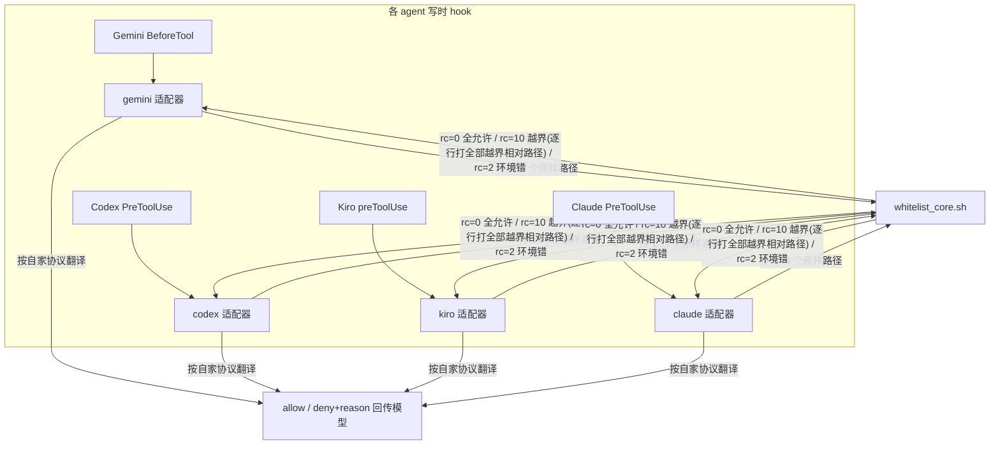

---
作者：@Ray
创建日期：2026-05-29
最后更新：2026-05-29
文档状态：草稿
---

# spec-kit 多-agent 写时白名单适配 · 详细设计

> 本文是 [`DESIGN.md`](./DESIGN.md) §5 的**实现级展开**：只设计「写时白名单闸」如何接入 Codex / Kiro / Gemini（Claude 已实现）。其余闸（死链/验收/关键词/归档）与 agent 无关，不在此列。
> **状态：设计稿，未实现。** 落地须先按 §7「落地前必验清单」用真实 agent 核对若干 confidence=medium 的契约点。
>
> **修订记录（v2，2026-05-29）**：经一次外部多-agent 事实核查 + 5 维对抗式 review（逐条查 Codex/Kiro/Gemini 官方文档 + 复核 29 条发现，8 条 major 成立）修订。本版已并入 **3 处事实订正**（Codex 改项目级 config、Gemini allow 改 exit 0、Kiro IDE hook 结构不同）+ **8 个 major 修订**（见各节标注 `[修v2]`）。核查同时确认：四家「写前拦截 + deny + 回传模型」前提全部 high；架构（共享 core + 薄适配器）成立。

---

## 0 · 一句话

四家（Claude/Codex/Kiro/Gemini）都有「写文件前可编程拦截 + deny + 把原因回传模型」的能力（已逐条查官方文档确认），所以**都走薄适配器**，无一需要退到兜底。差异只在「怎么从输入取被写路径 / 怎么表达 deny / 注册在哪」。把判定逻辑抽成与 agent 无关的 `whitelist_core.sh`，每家一个薄适配器翻译 I/O。

---

## 1 · 架构：共享核心 + 薄适配器



**核心做**：定位 repo root → 把每个「agent 原样路径」归一化为相对仓库根（含相对路径按 cwd 锚定，见 §2）→ 逐个 glob 匹配 `.spec-task-whitelist` → 自动放行 `test/**/*_test.dart` → 无白名单文件则全放行。另提供 `json_escape` 工具函数（见 §2）。
**适配器做**：① 从自家 stdin JSON 取被写路径（可能多个，**用 while-read 累积数组**，见 §3）；② 调 core；③ 按 core 退出码翻成自家 agent 的 allow/deny。

> **配套重构（重要）**：现有 `claude-pretooluse-whitelist.sh` 是**内联**判定（自带 `resolve_rel`+`glob_match`，未调 core）。抽 core 时**必须把 Claude 也切到 core**，否则双源真理。`[修v2 arch-4]` 切 core 不只是搬 `glob_match`——要搬**五件事**：① repo root 定位；② `resolve_rel` 路径归一化（含 bug#8：写「父目录尚不存在的白名单内新文件」的归一化）；③ `test/**/*_test.dart` 自动放行；④ 无白名单全放行；⑤ glob 匹配。漏搬任一件都会让四家行为分叉（尤其漏 bug#8 → 误 deny 白名单内新文件）。

---

## 2 · `whitelist_core.sh` 契约（落地前必须锁死）

```
用法: whitelist_core.sh <path> [<path> ...]
  每个 <path> = agent 给出的原样路径（绝对 / ./相对 / 仓库相对 / 相对 cwd 皆可）。
退出码:
  0  = 全部允许
  10 = 至少一个越界；把【全部越界的「相对仓库根」路径】逐行打到 stdout（每行一个）
  2  = 用法/环境错误（仅指：未给路径参数、git/路径解析真失败等），错误信息走 stderr
行为: 不读 stdin、不输出任何决策 JSON、不组 reason（只给路径）。
      归一化 + glob 匹配 + test 自动放行 + 「无白名单=全允许」全在 core。
附带工具（与决策无关，仅字符串处理）:
  json_escape <s>  -> 把字符串安全转义进 JSON 双引号串（反斜杠、双引号、控制字符、换行均处理）。
```

`[修v2 arch-1]` rc=10 **逐行打印全部越界路径**（不止第一个）：apply_patch/fs_write/MultiEdit 天生多文件，一次回全部可省去 N 轮 deny 往返，也方便兜底闸复用。适配器组 reason 时取首行即可、或列全部。

`[修v2 gap-cwd-1] 相对路径锚点（必须定义）`：core 收到**相对路径**时，先**按 hook 进程的 cwd 拼成绝对路径**，再走 `resolve_rel` 同一通道剥仓库根前缀；**不要**把 `./foo` 直接当「相对仓库根」。否则在子目录启动 / linked worktree 下、Codex apply_patch 的「相对 cwd」路径会被错锚 → 误拦或漏放。

`[修v2 arch-2] json_escape 收归 core`：Claude/Gemini/Codex 三家 deny 都吐 JSON，都要把 core 给的越界路径（可含 `"`、`\`、控制字符、换行）转义进字符串。**这段易错且必须三家一致**——各写一遍必分叉到不同程度（现有 Claude 的转义只处理 `\` 和 `"`、漏控制字符），分叉会让 deny JSON 损坏 → Gemini/Codex 把无效输出 fail-open 漏放（**这套护栏最严重的失效模式**）。故由 core 提供 `json_escape`（纯 sed/tr，不碰 reason 语义、不违反「core 只给路径」）。Kiro 走 stderr 不需要 JSON，但要把路径里的换行压成单行（保「首行自足」）。

### ★ 必须锁死的一点（rc=2 语义，sec-8）

**「仓库根无 `.spec-task-whitelist` ⇒ rc=0 全允许」，绝不用 rc=2 表达「功能未启用」。**

为什么：Gemini 与 Codex 适配器都把 `rc=2` 翻成 **deny（保守拦截）**。若 core 在「无白名单」时返回 rc=2，那么在一个**根本没启用白名单**的仓库里，每次写文件都会被 deny —— **全局级 DoS**，直接摧毁 spec-kit「无白名单文件＝零打扰」的产品语义。

`[修v2 sec-8]` 这条目前只在文档里警示 = 荣誉制，违背 spec-kit 自己的 D1（机械校验、不靠记得）。**升级为机械保证**：把对称回归断言列入 §7 P0 必跑，并由 **core 自带一个 `--selftest` 子命令**（或 install 安装后自动跑一次）验证：「空仓无 `.spec-task-whitelist` → rc=0 放行」**且**「有白名单+越界路径 → rc=10」。这条断言失败则 install 报错、不让装。

---

## 3 · 适配器通用骨架

```bash
#!/usr/bin/env bash
# 注意：各家 fail-open/closed 默认不同（见各节），异常一律「显式表态」，
# 绝不靠裸非零退出隐式阻断/放行。Codex 尤其不能用 set -e / pipefail。
set -u
CORE="$(cd "$(dirname "$0")" && pwd)/whitelist_core.sh"
INPUT="$(cat || true)"

# 1) 取 tool_name + 被写路径（可能多个）—— 各家不同，见 §4。
#    [修v2 impl-3] 必须用 while-read 累积数组，禁止 paths=($(...))（IFS 拆词会把含空格路径拆碎）：
paths=(); while IFS= read -r p || [ -n "$p" ]; do [ -n "$p" ] && paths+=("$p"); done <<EOF
$(extract_paths_from "$INPUT")     # 各家实现：见 §4
EOF

# 2) 调 core：分开捕获 stdout（越界路径）/ stderr（环境错）/ 退出码。
#    [修v2 sec-9] 不要 2>/dev/null 一律吞掉 core 的 stderr——rc=2 的真环境错要可观测。
err="$(mktemp)"; offenders="$("$CORE" "${paths[@]}" 2>"$err")"; rc=$?

# 3) 翻译：deny/warn 只是「适配器对 rc=10 的呈现策略」，core 不感知（见各节）。
case "$rc" in
  0)  emit_allow ;;                 # 各家不同
  10) emit_deny "$offenders" ;;     # 各家不同；reason 用 core 的 json_escape
  *)  emit_fail "$rc" "$(cat "$err")" ;;  # 各家 fail 策略（见各节 failHandling）
esac
```

三家**唯一能共用**的是 core（归一化/glob/test 放行/无白名单全允许/json_escape）。`extractPaths`、`emit`、`failHandling` 因各家 schema 与默认行为不同，**必须各写**。

---

## 4 · 各适配器详细设计

### 4.1 Gemini —— `hooks/gemini-beforetool-whitelist.sh`（最简，confidence high）

| 项 | 设计 |
|---|---|
| matcher | `^(write_file\|replace)$`（精确锚两个写工具；不带 shell——shell 写归 §5 兜底） |
| 取路径 | `jq -r '[.tool_input.file_path,.tool_input.path,.tool_input.absolute_path]\|map(select(.!=null))\|.[]'`（write_file/replace 同字段 `file_path`，已核源码；多别名兜底防漂移） |
| allow | **`[修v2 事实订正] exit 0 且 stdout 空`**。**不要**用 `{"continue": true}`——Gemini 的 `continue:false` 语义是「终止整个 agent loop」，`continue:true` 不是「放行此工具」；放行的真正语义是「不给 deny 决策」。现状是「行为碰巧对、理由是错的」，Gemini 改 continue 语义就踩坑。 |
| deny | `exit 0` + stdout：`{"decision":"deny","reason":"<带越界相对路径的中文提示>","systemMessage":"<同文案>"}`（`reason` 进**模型**、`systemMessage` 给**用户**；`block` 是 `deny` 别名）。reason 里的路径用 core 的 `json_escape`。 |
| failHandling | **`[修v2 sec-2] 写工具 matcher 命中但 paths 为空 → deny（fail-closed）`**：matcher 已精确锚 `^(write_file\|replace)$`，进到适配器就意味着是写工具，此时取不到路径只可能是 schema 漂移/解析 bug，按 core 缺失同等标准 fail-closed。**只有空 stdin 才放行**（hook 未真正触发）。无 jq → 复用现有 Claude 适配器 L41-45 的 grep/sed 降级（字段换成 `file_path`/`path`/`absolute_path`）。core 缺失 / rc=2 / 未知 rc → 显式 deny（Gemini「其它非零=warning+继续」≈ fail-open，异常必须显式 deny）。 |
| 注册 | 合并进 `.gemini/settings.json` 的 `hooks.BeforeTool`（`{matcher, hooks:[{type:"command",command,name,timeout}]}`；jq 幂等合并）。**注意：项目级 hook 要求该目录被信任，否则静默不加载**（与 Codex 同，§5.5 来源已核）。 |
| 上下文 | `GEMINI.md`（可选追加 spec-guide 指针，标记块包裹保幂等） |
| 待验(live) | ① `decision:"deny"` 是否真被识别（若只认 `"block"` 会静默 fail-open）；② 首跑 dump stdin 确认路径确在 `tool_input.file_path`；③ §2 的 rc=2 路径：在无白名单目录跑一次，确认不被误 deny；④ 项目 `.gemini/` 信任后 hook 才加载 |

### 4.2 Codex —— `hooks/codex-pretooluse-whitelist.sh`（最坑但能力最强，confidence medium）

Codex 是 Claude 同款 PreToolUse 引擎，但有几个必须处理的坑：

- **路径要从 apply_patch 信封解析**（无独立字段；`[修v2 impl-3]` 务必把结果喂进 §3 的 while-read 数组，**不要** `paths="$(...)"` 标量后无引号传参）：
  ```bash
  cmd="$(printf '%s' "$INPUT" | jq -r '.tool_input.command // empty' 2>/dev/null)"
  extract_paths_from(){
    printf '%s\n' "$cmd" \
      | grep -E '^\*\*\* (Add|Update|Delete) File:|^\*\*\* Move to:' \
      | sed -E 's/^\*\*\* (Add File|Update File|Delete File|Move to):[[:space:]]*//' \
      | sed -E 's/[[:space:]]+$//' | grep -v '^$'
    # 防御性并入 Edit/Write 变体的独立字段：
    printf '%s' "$INPUT" | jq -r '.tool_input.file_path // .tool_input.path // empty' 2>/dev/null
  }
  # 头行四字面与官方 V4A 文法一字不差（已核）；一次可多文件；
  # 重命名形态 = "*** Update File: <src>" 紧跟 "*** Move to: <dst>"，src 由 Update 行纳入、dst 由 Move 行纳入，双路径都判。
  ```
- **deny**：`exit 0` + stdout `{"hookSpecificOutput":{"hookEventName":"PreToolUse","permissionDecision":"deny","permissionDecisionReason":"<reason>"}}`（stdin 入参字段是 `hook_event_name` snake、输出回 `hookEventName` camel；reason 路径用 core `json_escape`，复用 Claude L155 思路）。
- **fail-OPEN 防护（致命）**：Codex「非 2 的非零退出 = hook 失败但**放行**」。所以：① **不用 `set -e`/`pipefail`**；② 每种异常一律翻成**显式 deny**（exit 0 + deny JSON）；③ JSON 转义只用 `sed`/`tr` **不用 awk**；④ 脚本本体须纯净 UTF-8（`0x01` 控制字节会让 bash 3.2 报 unbound→exit 1→fail-OPEN；落盘后 `file <脚本>` 应显示 ASCII/UTF-8）。

| 项 | 设计 |
|---|---|
| matcher | `^(apply_patch\|Edit\|Write\|MultiEdit)$`（**不**匹配 Bash） |
| allow | `exit 0`，stdout 静默（**不**输出 `{"continue":true}`，Codex 不识别） |
| 注册 | **`[修v2 事实订正] 项目级 .codex/config.toml`**（不是全局 `~/.codex/config.toml`）：`[features] hooks=true`（`codex_hooks` 是已弃用别名，别用）+ `[[hooks.PreToolUse]]`（matcher）+ `[[hooks.PreToolUse.hooks]]`（type="command", 绝对路径 command）。项目级一举消解全局副作用/跨仓串味，符合 D8「每仓 opt-in」。**前提：项目 `.codex/` 层被信任**（`project-local hooks load only when the project .codex/ layer is trusted`）。**CI/非交互需预信任**：`requirements.toml`(managed=trusted) 或 `--dangerously-bypass-hook-trust`，否则 hook 不生效＝静默放行 |
| 兜底联动 | **`[修v2 sec-1] --with-codex 强提示联动 --with-backstop`**：Codex 是 fail-open + apply_patch 主写工具 + 「升级后可能静默不触发 PreToolUse」（DESIGN bug#5/#9 同型），故不让 Codex 单独作唯一防线；README 登记「Codex 升级后须重验触发」 |
| 上下文 | `AGENTS.md` |
| 待验(live) | ① `tool_name` 文件编辑取 `apply_patch` 还是 `Edit/Write`；② **`features.hooks=true` 后 PreToolUse 是否真对 apply_patch 触发**（喂合成 JSON 只验脚本逻辑、验不到引擎是否派发 → 只能 live + backstop 兜底）；③ 重命名场景 src+dst 双路径都被判（sec-10）；④ 项目 `.codex/` 信任配置 |

### 4.3 Kiro —— `hooks/kiro-pretooluse-whitelist.sh`（exit2+stderr 协议，confidence medium）

> `[修v2 impl-1]` 文件名统一为 `kiro-pretooluse-whitelist.sh`（与 DESIGN §7 及 `<agent>-<event>-whitelist.sh` 命名一致）。

| 项 | 设计 |
|---|---|
| matcher | `fs_write`（内部工具名；Kiro matcher **不支持正则**，用字面 `fs_write` 是对的；不用别名 `write`；不匹配 `execute_bash`） |
| 取路径 | `jq -r '(.tool_input.operations[]?.path // empty),(.tool_input.path // empty)'`（`operations[].path` 为主、顶层 `path` 兜底；多文件天然支持；喂进 §3 while-read 数组） |
| allow | `exit 0`，stdout/stderr 干净 |
| deny | **STDERR 写原因 + `exit 2`**（Kiro：exit2 = 阻断且 stderr 原文回传模型）。`[修v2 arch-2]` **越界路径 + 「加入 `.spec-task-whitelist`」指引压进第一行、换行压成单行**（多行 stderr 若被截断，第一行须自足） |
| failHandling | Kiro「其它非零=warning+放行」是 fail-open 陷阱 → **一切异常（无 jq / 坏 JSON / 取不到路径 / core 异常）一律 `exit 2` fail-closed** |
| 注册（CLI） | **`[修v2 impl-6] 枚举并合并进所有现有 `.kiro/agents/*.json` 的 `hooks.preToolUse`**（`{matcher,command,timeout_ms}`），**不要新建臆造名 agent json**——Kiro hook 只在「那个 agent 被激活时」生效，新建 `spec-kit.json` 而用户日常用别的 agent → hook 永不激活 = 静默假安全感（bug#5/#9 同型）。目录为空才新建。command 用 `git rev-parse --show-toplevel` 兜绝对路径 |
| 注册（IDE） | **`[修v2 事实订正] IDE `.kiro.hook` 与 CLI 结构完全不同**：IDE 是 `name/description/version/when/then` 的 GUI 结构（基于文件 create/save/delete 事件），**可能根本不支持 tool 调用拦截语义**。**install 不能用同一份 jq 套两种文件**；IDE 侧写时白名单闸**可能不可行**，§6 显式区分、本闸优先走 CLI agent json |
| 上下文 | `.kiro/steering/*.md`（也认 `AGENTS.md`） |
| 待验(live) | ① **fs_write 精确 schema**（官方未逐字给，须 dump 真实事件）：单文件是否仍包 `operations[]`、多文件是多 operations 还是拆多次调用、`append/str_replace` 等 mode 是否用别的字段名（用别的字段会 fail-closed 误拦——安全侧但打扰）；② **装进未激活 agent = 失效**：装完用真实 Kiro run 确认 hook 真触发；③ exit2 多行 stderr 是否被完整回传；④ hook 进程 cwd / `timeout_ms` 字段名 |

> `[修v2 gap-dangling-ref]` 参考实现：照**现有 Claude 适配器的 while-read 模式**（bash 3.2 兼容、不用 `mapfile`）；落地时连同 core 一起补。

### 4.4 Claude —— `hooks/claude-pretooluse-whitelist.sh`（已实现，需切 core）

已实现且默认 deny（见 `DESIGN.md` D4）。当前内联判定，**core 抽取时一并切到 core**（§1 配套重构，搬五件事，含 bug#8 归一化）。I/O：输入 `tool_input.file_path`/`notebook_path`；deny 用 `{"hookSpecificOutput":{...,"permissionDecision":"deny","permissionDecisionReason":...,"additionalContext":...}}`。`[修v2 arch-5]` 现有 `DECISION=warn` 双模式在切 core 后仍归适配器：**deny/warn 是适配器对 rc=10 的呈现策略，core 不感知**。

---

## 5 · 通用 git 兜底闸（D7，可选）

写时闸有共同盲区：① 经各家 shell 工具（`Bash`/`run_shell_command`/`execute_bash`）的重定向写（`echo > x`、`sed -i`）绕过「写工具」matcher；② Codex hook 崩溃 fail-open / 升级后不触发；③ 将来无写时 hook 的 agent。

兜底：一道 pre-commit 检查——越界即拒绝提交。`[修v2 sec-4] 「源码文件」定义收成单一真相`：**直接用「所有暂存文件（除 `test/**/*_test.dart` 豁免）必须 ⊆ `.spec-task-whitelist`」，不按扩展名预筛**。理由：① DESIGN §4.3 点名的头号越界恰是 `pubspec.lock` / `Podfile`（无扩展名）/ `build.gradle`——`lint_acceptance_commands.sh:55` 的扩展名清单**不含** `.lock`、不含无扩展名 `Podfile`，照搬 = 兜底闸对其存在的全部理由失效；② 另立一套扩展名清单 = 第三处「什么算源码」双源真理（spec-kit 最痛恨的 drift）。白名单本就声明了「可改文件全集」，按扩展名预筛只会引入漏放。

`[修v2 arch-1]` 职责澄清：**core 只做 glob_match**；「枚举暂存文件 + test 过滤 + 逐个判」是**兜底闸自身职责**，它**直接 `source` core 的 `glob_match` 函数**复用匹配逻辑，**不走 rc 接口**（不要含糊说「复用 core」）。

> 区分两道「scope」检查：本兜底闸是**运行期**「写了什么 ⊆ 白名单」；`DESIGN.md` D5 的 `可改文件 ⊆ design 文件变更` 是**spec 编写期**的另一道（tasks.md vs design.md），两者不同、互补。

---

## 6 · `install.sh` 接入（可选、幂等、不覆盖）

新增 opt-in flag，各自把适配器片段合并进对应配置文件：

| flag | 写入 | 合并方式 |
|---|---|---|
| `--with-claude`（已有） | `.claude/settings.json` | jq 幂等合并 PreToolUse |
| `--with-gemini` | `.gemini/settings.json` | jq 幂等合并 BeforeTool（提示项目目录需被信任） |
| `--with-codex` | **`.codex/config.toml`（项目级，`[修v2]`）** | toml 无 jq，按标记块幂等追加；提示 `.codex/` 需信任、CI 需 `requirements.toml`/`--dangerously-bypass-hook-trust`；**强提示同时 `--with-backstop`** |
| `--with-kiro` | **枚举现有 `.kiro/agents/*.json` 合并（`[修v2]`，非新建孤儿）** | jq 幂等合并 `preToolUse`；目录空才新建；**IDE `.kiro.hook` 结构不同、本闸不走 IDE** |
| `--with-backstop` | `.git/hooks/pre-commit`（公共 dir） | 追加「暂存文件（除 test）⊆ 白名单」检查 |

共性：先备份、标记块包裹、幂等、不覆盖；可选把 spec-guide 指针写进各 agent 的上下文文件（`GEMINI.md`/`AGENTS.md`/`.kiro/steering/`，标记块幂等）。所有 agent 接入默认关闭，须显式 flag。

---

## 7 · 落地前必验清单（P0 阻塞项在前）

**P0 — core 自身（阻塞全部三家）**
1. **`[修v2 sec-8]` 对称回归断言（机械化，非文档警示）**：`core --selftest`（或 install 自检）须验「空仓无 `.spec-task-whitelist` → **四家全 rc=0 放行**」**且**「同一越界路径 → **四家全 rc=10 拦**」；断言失败则 install 报错不让装。锁死「无白名单=rc=0，绝不 rc=2」。
2. rc=10 确实**逐行打印全部越界**的「相对仓库根」路径。
3. core 的 glob 与现有 Claude 内联实现对齐，并**把 Claude 切到 core**（搬五件事，含 bug#8）；补 **bug#8 回归用例**：写「父目录尚不存在的白名单内新文件」不被误 deny。
4. **`[修v2 gap-cwd-1]` 相对路径锚点**：core 收相对路径先按进程 cwd 拼绝对再剥根；四家各 **dump 一次 cwd 与真实锚点**，**Codex 必实测**（其路径相对 cwd）。
5. **`[修v2 impl-3]` 含空格路径端到端**：构造含空格的白名单条目 + 写入路径，验四家**不被拆成两条**（while-read 数组 + `"${paths[@]}"`，core 内部不再二次拆词）。

**Gemini**：`decision:"deny"` 真被识别（否则静默 fail-open）；路径确在 `tool_input.file_path`；无白名单目录不被误 deny；写工具命中但无路径 → 确实 deny（sec-2）。
**Codex**：`tool_name`/apply_patch 头行格式实测；**`features.hooks=true` 后是否真对 apply_patch 触发**；重命名 src+dst 双判；项目 `.codex/` 信任；落盘脚本 `file` 确认纯 UTF-8。
**Kiro**：fs_write 精确 schema；matcher `fs_write` 生效；**装进的 agent 是否会被激活（real run 确认触发）**；exit2 多行 stderr 完整性。
**`[修v2 impl-5]` step5 兜底闸**：shell 重定向越界写真被拒、test 豁免、与非 shell 既有 hook 共存。
**`[修v2 impl-5]` step6 install**：各 `--with-*` 重复跑幂等、TOML 追加后可加载、Kiro 合并进现有 agent 不破坏既有键。

**`[修v2 impl-6/7]` 核验矩阵（PASS 判据 + 版本锁定）**：每个 live 待验项写明「怎样算验过」（PASS 判据）；记录核验时各 agent 的**版本号 + 核验日期**；`DESIGN.md §5.5` 的官方来源应**固定到 commit hash 快照**（勿指向滚动 main raw，三家 API 会漂移）。

---

## 8 · 已知风险 / 设计取舍

- **rc=2 语义**（§2★）：最会咬人的点，已升级为机械自检（§7 P0-1）。
- **JSON 转义分叉**（§2 `[修v2 arch-2]`）：护栏最严重失效模式（损坏 deny JSON → fail-open 漏放），已收归 core `json_escape`。
- **glob 双源真理**：Claude 不切 core 就两套 glob，必切（§1，搬五件事）。
- **Codex 触发可靠性 + fail-open**：apply_patch 是否触发 PreToolUse 需按目标版本实测；强提示联动 `--with-backstop` 兜（§4.2）。
- **Kiro 装进未激活 agent = 静默失效**（§4.3 `[修v2 impl-6]`）：枚举现有 agent 合并、real run 确认触发。
- **Kiro IDE hook 结构不同、可能不支持拦截**（§4.3 事实订正）：写时闸优先 CLI。
- **shell 重定向绕过**：写时闸不管 shell 写，靠 §5 兜底闸在提交关口兜。
- **Kiro schema 未逐字定**：fail-closed 方向正确（最坏误拦不漏放），需 live 校准 jq 路径。
- **文件系统边角**（`[修v2 gap-fs]`，低优先）：symlink 目标、macOS 大小写不敏感、submodule/linked worktree 的 root 定位未评估（bug#9 已证明 worktree 是雷区）——落地后留意，勿当 bug。
- **reason 文案 DRY 取舍**：转义已收归 core；中文 reason 文案仍三家各写（轻微重复，换取 core 职责单一——core 只给路径 + json_escape 工具，不组 reason 语义）。

---

## 9 · 建议实现顺序

1. **抽 `whitelist_core.sh`（含 `json_escape`、`--selftest`、rc=10 多路径、相对路径 cwd 锚定）+ 把 Claude 切到 core（搬五件事）**——不引入新 agent，先稳基线 + 过 §7 P0 自检与 bug#8 回归。
2. **Gemini 适配器**（最简，先验证「薄适配器」模式跑通）。
3. **Codex 适配器**（apply_patch 解析 + fail-open 防护 + 项目级 config，按 §7 实测触发）。
4. **Kiro 适配器**（按 §7 实测 fs_write schema + agent 激活）。
5. **git 兜底闸**（`--with-backstop`，所有暂存文件 ⊆ 白名单）。
6. **install.sh `--with-*` 接入** + 各 agent 上下文文件指针。

> 每步按 spec 流程开任务卡、纯 shell、离线用例 + 真实 agent 各验一次（按 §7 PASS 判据）再并入。
