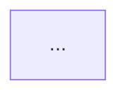
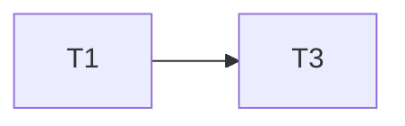
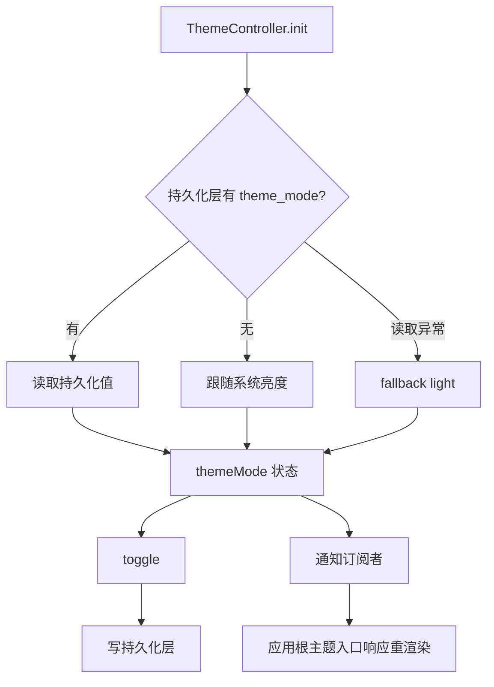
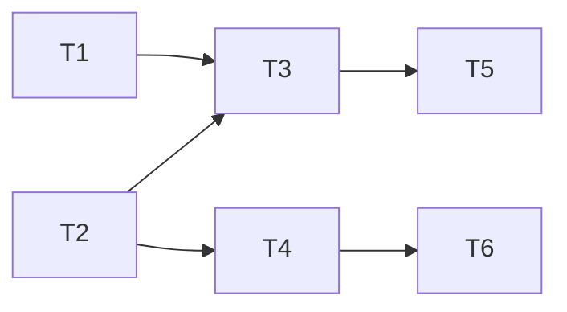

# Spec 规范（AI 执行版）

面向「人类编写、AI 执行」的功能规格规范。先按第 0 节选档，再按对应档位编写与执行。所有任务执行须遵守第三部分「执行协议」。本规范技术栈中立——示例中的命令、路径、技术名均为占位，按你团队的技术栈替换即可。

> **设计前提（读规范前先理解）：** 本规范服务于「AI 执行」，而 LLM 与人类有两点关键差异，全文据此设计：
> 1. **荣誉制对 LLM 不成立**——「请复述」「请自查」「请别越界」对人是强制投入，对 LLM 极廉价且可被绕过。凡能机械校验的，做成**硬闸**（脚本 / hook / pre-commit），别靠 AI 自觉（见第三部分「硬执行闸」）。
> 2. **「让命令通过」是可被反向优化的目标**——AI 会朝最省力满足检查的方向收敛，而非朝需求。故验收命令必须验**行为**、且**不可被糊弄**（见 P3「验收命令的抗规避规则」）。

-----

## 0 · 选档

默认精简档。命中下列**硬触发维度任一** → 升级标准档。这些维度在 requirement 定稿时即可判定。

| 硬触发维度 | 精简档 | 标准档 |
|------|--------|--------|
| 涉及 安全 / 权限 / 无障碍 / 性能 / 多端兼容（任一） | 否 | 是 |
| 跨多个模块 | 否 | 是 |

**任务数 = 建议信号，不作硬触发：** 任务数多（经验上 > 8）通常意味着复杂度高，是「考虑升标准档、或把 spec 拆小」的**提示**，但**本身不强制升档**。理由：任务数是复杂度的弱代理，且可被拆/并任务来卡线规避，不适合当硬闸。是否升档只由上面两条硬触发维度决定。

**「模块」定义（消歧）：** 模块 = 顶层包 / 独立部署单元——一个独立发布的包算一个模块；前端、后端、数据库（DB）各算一个模块。「跨多个模块」= 文件变更清单（design 的 `## 文件变更`）落在 ≥2 个模块。
- 正例（跨多模块 → 标准档）：改 `packages/a/` 又改 `packages/b/`；既改后端 API 又改 DB schema。
- 反例（同包内多目录，**不**算跨模块）：只在同一个包内同时改 `src/x/` 与 `src/y/`。

边界仲裁：两条硬触发维度均为「否」（无专项维度、单模块）→ 取精简档（任务数无论多少都不改变这一结论）。

**专项维度逐维表态（防静默漏判）：** 上表「专项维度」一行实含 5 个判断题，AI 不得用「这应该不算」一句带过。requirement 定稿时须对每维显式表态一次（写在 requirement 末尾或 design 选档说明处），任一为「是」即升标准档：

| 专项维度 | 命中？ | 依据（一句话） |
|---|---|---|
| 安全 | 是/否 | … |
| 权限 | 是/否 | … |
| 无障碍 | 是/否 | … |
| 性能 | 是/否 | … |
| 多端兼容 | 是/否 | … |

逐维表态强制把每维过一遍，杜绝「没提及 = 默认否」的静默漏判。（「跨多模块」维已由 design `## 文件变更` 客观判定，不在此表。）

两档共享：`R`/`NF` 编号、`D` 决策编号、任务双向引用、执行协议、任务边界、自动/人工两段验收。
标准档额外**必含**：`NF` 非功能需求、verification.md、文件头文档状态、README 索引。（里程碑为**可选**，缺失不影响合规，见标准档 tasks.md。）

升级（精简 → 标准）只做加法：补文件头 `文档状态`；requirement 补 `## 非功能需求`；新建 verification.md 并把跨任务校验移入；建/更新 README 索引。

**选档锁定与重评估（棘轮，只升不降）：** 档位分两步定，且**只升不降**（棘轮，避免反复横跳）：
1. **requirement 定稿时初定**：此时 5 个专项维度（安全/权限/无障碍/性能/多端兼容）已可判定，据上面「逐维表态」初定档位。
2. **design 定稿时复核**：「跨多模块」依赖 design 的 `## 文件变更` 清单（见 §0「模块」定义），到此才完整可判；命中则升标准档。

执行阶段若再命中下列任一条件，继续按「只做加法」升档 → 更新 README → 再继续：① 新命中任一硬触发维度（如新增改了第二个模块、新增一条性能 NF）；② 精简档下出现「跨任务校验」（定义见 P1）。任务数变化（拆/并任务）**不**触发升档。档位一旦升起，不再降回。

-----

# 第一部分 · 精简档

目录：`specs/{功能名}/` 下放 `requirement.md`、`design.md`、`tasks.md`。文件夹名 kebab-case。

## P1 · requirement.md

```markdown
---
作者：@yourname
创建日期：YYYY-MM-DD
---

# {功能名}

## 背景
{为什么需要}

## 范围外
- {明确不做什么}

## 需求

### R1 · {需求名}
{用 SHALL / MUST / SHOULD / MAY 描述系统行为}
- 前提：{初始状态}
- 操作：{触发动作}
- 结果：{预期可观测结果}
```

规则：
- 描述外部可观测行为，不描述内部实现。
- 出现可度量硬约束（对比度、性能阈值）就地用 `NF1` 编号补一节。
- 该 NF 若只需单任务内验证，留精简档；若需**跨任务校验**，升级标准档并启用 verification.md，不得塞进单任务人工项（「跨任务校验」定义见下）。

**EARS 句式（按需求类型选模板，别都写成 When/Then）：** 上面「前提/操作/结果」是事件驱动型的展开，并非唯一句式。按下表选：

| EARS 类 | 形态 | 示例骨架 |
|---------|------|----------|
| 普遍（恒常） | The {系统} SHALL {行为} | 「系统 SHALL 始终对密码加密存储」 |
| 事件驱动 | When {触发}, the {系统} SHALL {行为} | 用「前提/操作/结果」展开 |
| 状态驱动 | While {状态}, the {系统} SHALL {行为} | 「While 离线，系统 SHALL 缓存写入」 |
| 可选特性 | Where {特性启用}, the {系统} SHALL {行为} | 「Where 启用多端同步，系统 SHALL…」 |
| 不期望行为 | If {异常条件}, then the {系统} SHALL {行为} | 「If 上传中断, then 系统 SHALL 回滚」 |

恒常类（普遍）与异常类（不期望行为）不要硬套 When/Then，按对应类写。

关键词（RFC 2119）：
- MUST / SHALL = 绝对要求；MUST NOT / SHALL NOT = 绝对禁止。
- SHOULD = 推荐，可有充分理由例外；SHOULD NOT = 不推荐，可有充分理由例外。
- MAY = 可选。
- 「范围外 / 禁止」段落须用否定词规范化表述：明确禁止的写 MUST NOT / SHALL NOT；不推荐但非硬禁的写 SHOULD NOT。
- 这些关键词由 lint 做**存在性 / 规范化**校验（见第三部分「硬执行闸」）：查是否用了合法的 RFC2119 词、大小写是否规范。**但 lint 判不了语义对错**——「本该用 SHOULD 处写成 SHALL」这类分级错误机器看不出，仍属人审。而分级（SHALL vs SHOULD）直接决定「是否需人工放行」，故人审时须重点核对。

**SHOULD 例外的处理权（收归人工）：** 执行阶段**不得擅自跳过** SHOULD 需求。确需例外，须**停下**，把例外理由记入 design.md 的 `## 已知风险`，并请求人工确认；获确认后方可继续。禁止在任务内静默放弃 SHOULD 需求。

**跨任务校验（可判定定义）：** 满足以下任一即属「跨任务校验」——
1. 该验收命令依赖 **≥2 个任务的产物同时存在**才能跑通（如端到端串联 T1 的状态容器与 T3 的挂载）；或
2. 该检查涉及的可改文件来自 **≥2 个任务**的可改文件清单。

仅满足单任务内可独立验证的，不属跨任务校验，放任务内验收。

## P2 · design.md

```markdown
---
作者：@yourname
创建日期：YYYY-MM-DD
---

# 设计：{功能名}

## 技术决策

### D1 · {决策点}
- **背景：** {问题或约束}
- **选择：** {最终选择}
- **理由：** {为什么}
- **代价：** {缺点或局限，是否可接受}

## 文件变更
- `{路径}`  新建 / 修改 / 删除

## 已知风险
- {当前不处理的问题或后续需关注点}
```

规则：决策必须用 `D` 编号且必须写「代价」。架构图按需添加。

**`## 文件变更` 是任务「可改文件」的唯一来源与上界（防跑偏的结构性根基）：** 任一 task 的「可改文件」**MUST ⊆ 本清单**——清单未列的文件**不得**进任何任务的白名单。这是「AI 跑偏」的头号来源：白名单一旦超出设计声明，下游 deny 闸也只会照单放行那次越界写（闸只认白名单，不认设计）。两类典型违例：① 任务顺手改了 `pubspec.lock`/`Podfile`/`build.gradle` 等构建副产物而清单只写了 `pubspec.yaml`；② 任务把另一个**模块**的文件（如在 A 模块的 spec 里写 B 模块 `lib/x/`）列入可改文件——这等于跨模块越界，且常与别的 spec 撞归属。需要动清单外文件时：**先回填 `## 文件变更`**（连带触发 §0「跨多模块」复核是否升档），再列入可改文件；归属未定的跨 spec 文件，先在 README/对应 spec 拍板归属，不要在两个 spec 各写一遍。

## P3 · tasks.md

```markdown
---
作者：@yourname
创建日期：YYYY-MM-DD
---

# 任务列表：{功能名}

## 依赖速览
> 以各任务 inline「同 spec 依赖」字段为准；跨 spec 依赖以 README「依赖」列为准。
T1, T2（并行）→ T3 → T4

-----

- [ ] T1 · {任务名}

**同 spec 依赖：** 无（或 T 编号列表）｜ **跨 spec 依赖：** 无（或「前置 spec ID + 交付物名」）｜ **关联需求：** R1 ｜ **依据设计：** D1 ｜ **可改文件：** `path/to/file`

### 背景
{上下文。若与并行任务有归属歧义，点明哪部分逻辑归本任务。}

### 实施
1. {步骤一}
2. {步骤二}

### 验收标准（做完即止）
- {可独立验证的完成条件}（自动 / 人工）

### 禁止（可选）
- {易越界时才填}

### 验收方式
- 自动：
  ```bash
  {自动化命令——必须验行为，不得 grep 被改文件自身，见下「抗规避规则」}
  ```
- 人工（仅当无法自动化时）：
  - {目视/操作核查项，注明核查人}

### 验收记录
```
日期：—
自动：—
人工：N/A           # 无人工项写「N/A」；有人工项未确认写「待确认（核查人 @xxx）」
```
```

任务状态：`- [ ]` 未开始 ｜ `- [-]` 进行中（含「自动已过、待人工确认」）｜ `- [x]` 已完成。

任务完成规则：自动命令全部通过 + 人工核查项全部经核查人确认 + 验收记录填写完毕，方可置 `[x]`。

### 验收命令的抗规避规则（信任根）

验收命令是整个体系的**信任根**：命令的质量 = 体系的上限。对 LLM 而言「让命令通过」是可被反向优化的目标，故命令必须验**行为**、且不可被字面满足糊弄。

- **禁止 grep 被改文件自身的内容**当验收。`grep 'class Foo' src/foo.{ext}` 只检查字符串在不在——AI 把那串字面量写进文件就 exit 0，这正是「我觉得做完了」换层皮。此规则由 `lint_acceptance_commands` 硬闸强制（见第三部分），违反则 pre-commit / CI fail。
- **断言须来自独立于被改文件的来源**：运行测试（测试目录下的测试文件）、golden / 快照基线、构建产物、查询结果——而非被改文件本身的文本。
- **优先「运行 → 断言可观测结果」**：跑代码 / 查询 / 构建，断言其**输出或状态**符合需求，而非断言「源码里有某行」。
- 反例（禁止）：`grep -q 'DARK_THEME' src/theme/app_themes.{ext}`。
  正例（推荐）：`{测试运行器} {测试文件}`（断言 `darkTheme.brightness == dark` 等**值/行为**）。
  > `{测试运行器} {测试文件}` 为占位，替换为你栈的命令：`jest test/...` / `pytest tests/...` / `go test ./...` / `flutter test test/...` / `cargo test` / `vitest run ...` 等。
- 确实无法自动化的（视觉、真机兼容、人因判断），走人工核查项并注明核查人，不要用「假装能测的 grep」凑数。
- **测试必须真断言需求，不可空壳：** 测试跑过 ≠ 验到了需求——`assert(true)` 也 exit 0。每个验收测试必须断言对应 `R`/`NF` 的**具体可观测结果**（直接对应该需求的「结果」行 / NF 的度量值），并在验收标准里点明断言了什么。**这条靠人审，lint 抓不了空壳测试**——把 grep 换成 test 只是把可糊弄面搬了家、没关掉；断言质量是信任根的另一半。

**验收记录「人工」行约定（消歧完成判定）：**
- 本任务**无**人工核查项 → 写「人工：N/A」。完成判定只看自动行通过。
- 本任务**有**人工核查项但尚未确认 → 写「人工：待确认（核查人 @xxx）」，状态保持 `[-]`，不得置 `[x]`。
- 已确认 → 写「人工：{确认结论}（核查人 @xxx）」，方可置 `[x]`。

字段规则：
- `关联需求`（目标）+ `依据设计`（约束）+ `可改文件`（空间边界）三者必填。
- `同 spec 依赖`：仅填本 spec 内的 T 编号（可白名单校验，须存在于本 tasks.md）；无则填「无」。
- `跨 spec 依赖`：填「前置 spec ID + 交付物名」（如 `feature-a：StorageAdapter 接口`）；前置 spec ID 必须同时登记在 README「依赖」列（README 是跨 spec 依赖的唯一来源）；无则填「无」。
- `验收基建`（可选）：当本任务的验收**必须**新增/修改文件白名单外的**共享测试基建**（fixture、测试目录下共享 helper、golden / 快照基线、测试用配置）时，在此预先列出允许触碰的共享测试文件。列入的，AI 在执行时可直接改，无需逐次停下请求确认（这是文件白名单的**预批例外**，见执行协议第 2 条）。未列出的共享基建仍须停下声明。
- 验收标准只放本任务可独立验证的条件；**跨任务校验**（定义见 P1）属 verification。**升档触发收紧（破循环）：** 仅当出现跨任务校验**且当前为精简档**时，才据此升级标准档并把该校验移入 verification；已是标准档则直接移入 verification，不再二次升档。不得用主观措辞反复触发整档升级。
- 每条验收标准标注自动或人工；人工项注明核查人。
- 并行任务间有归属歧义的逻辑，必须在其中一个任务背景里点明归属。

-----

# 第二部分 · 标准档

目录：
```
specs/
├── README.md
├── contracts/{契约名}/contract.md          # 第四部分·契约/不变式 spec
├── active/{功能名}/{requirement,design,tasks}.md + verification.md
└── archive/{YYYY-MM-DD}-{功能名}/ 或 cancelled-{YYYY-MM-DD}-{功能名}/
```

## spec ID 与依赖登记

**spec ID（稳定标识）：** 每个 spec 有唯一稳定 ID = 其**功能名**（kebab-case 目录名，如 `feature-a`、`feature-b`）。
- 用功能名作稳定 spec ID；**禁用临时编号当跨 spec 标识**——里程碑用的 `M1/M2` 只在单个 tasks.md 内有效，不作为跨 spec 引用标识。任何跨 spec 引用一律用功能名。

**跨 spec 依赖的唯一来源 = README「依赖」列：** 一个 spec 依赖哪些前置 spec，只在 README 表的「依赖」列登记（值 = 前置 spec ID 列表），不在别处重复声明。tasks 内 `跨 spec 依赖` 字段只是该列在任务粒度的落地，前置 spec ID 必须能在 README「依赖」列找到。

## 状态与元数据

两种状态各有唯一来源，不互相复制：
- **功能生命周期**（草稿/进行中/已完成/已废弃）：唯一来源是 `README.md`，由 tasks 完成情况驱动。
- **文档成熟度**（草稿/定稿）：唯一来源是各文件元数据头。

文件头：
```markdown
---
作者：@yourname
创建日期：YYYY-MM-DD
最后更新：YYYY-MM-DD
文档状态：草稿 / 定稿
---
```

功能完成判定（置「已完成」的充要条件，三者全满足才可归档）：
1. tasks.md 所有任务 `[x]`，每个任务验收记录已填。
2. 若存在 verification.md，所有检查项已勾选、验证命令通过；含人工成分的检查项以人工确认为勾选前提（自动过但人工未复核则不算勾选）。
3. README.md 中该功能状态更新为「已完成」。

归档后返工：「已完成」是终态，归档目录只读、不复活、不追加任务。返工一律新建 spec：小修建精简档（README 交叉引用「修复自」），大改建标准档（交叉引用「衍生自/被取代」）。够不上立 spec 的改动直接改，不走流程。

## README.md（功能生命周期唯一来源）

```markdown
# Specs 索引

## 进行中
| 功能 | 优先级 | 依赖 | 状态 | 负责人 | 创建 |
|------|--------|------|------|--------|------|
| [feature-a](active/feature-a/) | P1 | 无 | 进行中 | @yourname | YYYY-MM-DD |
| [feature-b](active/feature-b/) | P1 | feature-a | 草稿 | @yourname | YYYY-MM-DD |

## 已归档
| 功能 | 结果 | 归档日期 |
|------|------|----------|
| [add-search](archive/YYYY-MM-DD-add-search/) | 已完成 | YYYY-MM-DD |
```

列说明：
- **优先级**（P0/P1/P2…）：跨 spec 的横向排序，规划时定，是「先做哪个」的依据。其家在 README（属性是相对其他功能而言的，不归任何单个 spec）。
- **依赖**：该 spec 的前置 spec ID 列表（无则填「无」），是**跨 spec 依赖的唯一来源**。被列出的前置必须是表内或已归档的有效 spec ID（功能名）；**亦可为契约 ID**（见第四部分·契约/不变式 spec）。
- **状态**：功能生命周期，本表为唯一来源。

就绪/被阻塞（派生，不另设列）：一个 spec **就绪** = 其「依赖」列所有前置 spec 状态均为「已完成」；否则**被阻塞**。该状态由「依赖」列与各前置「状态」派生，无需手填。

不设「进度」列：精确进度派生自 tasks.md，静态表格无法动态计算，手动维护必漂移。欲知进度直接看对应 `tasks.md` 的勾选情况。README 只对「状态」负责。

执行选取规则：在「未开始 / 进行中」**且就绪**（依赖列前置全部已完成）的 spec 中，挑**优先级最高**的执行；同级则按创建顺序。被阻塞的 spec 不参与选取，直到其前置全部完成。

**排序维护纪律（新增 / 归档 spec 必做，治「全同档」退化）：** 上面的选取规则只在优先级**有区分度**时有效——若所有 spec 同档，「挑优先级最高的就绪 spec」退化为纯创建序、形同虚设。**优先级与依赖的家都在 README 表**，下列复核结论 MUST 落到 README 对应列、不是口头复核：
- **新增 spec**：在 README「进行中」表**新增行的同时**即 ① 把该行「依赖」列填全（列出全部前置 spec ID，构成就绪门，不留空想当然——这是「先把依赖关系想清楚」的硬落点）；② 给该行「优先级」列一个**相对现有所有 spec 评估过**的值，而非无脑沿用同一档；若它的加入改变了某些既有行的相对重要性，**一并改那些行的优先级**。
- **归档 spec**：执行归档三步（移目录 / 移表行 / 改链接）的**同时**复核就绪集变化——被它解锁的下游是否应在 README **提高优先级**以反映其已成关键路径头；有变化就改 README 对应行（这是归档动作的一部分，连同「状态」列一起改）。
- **区分度是选取规则可用的前提，不是可选项**：规划时即在 README 拉开档位，别让一档堆满所有 spec。

## requirement.md（标准档）

在精简档 P1 基础上，必含 `## 非功能需求` 段，每条用 `NF` 编号且可度量：

```markdown
## 非功能需求

### NF1 · {约束名}
{可度量指标。例：正文文本对比度 MUST ≥ WCAG AA（4.5:1）}
```

## design.md（标准档）

在精简档 P2 基础上，决策可写完整 ADR（状态/背景/选项/选择/理由/代价），并补架构图：

```markdown
### D1 · {决策点}
- **状态：** 提议 / 采纳 / 被取代（被取代时注明「被 D{n} 取代」）
- **背景：** {问题或约束}
- **选项：** {方案A} / {方案B} / {方案C}
- **选择：** {最终选择}
- **理由：** {对比其他方案的优劣}
- **代价：** {缺点或局限，是否可接受}

## 架构

```

ADR 演进（MADR 习惯）：**已采纳的决策不可变**。需改变决策时，不就地编辑旧 `D`，而是**新建一条 D**承载新决策，并把旧 D 的状态改为「被取代（被 D{n} 取代）」，形成 superseded 链。这样决策史可追溯，避免「悄悄改了又没人知道」。

**需求（R）变更（比照 ADR）：** 执行中若发现 `R` 本身需改（如 R2 写错了），不就地静默改；须**停下**，记入 design `## 已知风险` 或新增/修订 `R`，并**标记引用该 R 的 task 与 verification 项需重验**。`R` 是 task / verification 的上游目标，改 R 不回传，会留下「按错误目标通过」的验证。

## tasks.md（标准档）

模板同精简档 P3，外加：

```markdown
## 任务依赖图
> 由各任务 inline「同 spec 依赖」字段汇总，仅供速览；以 inline 为准。


并行组：
- Group A：T1, T2
- Group B：T3, T4

里程碑（**可选，缺失不影响合规**；仅当存在可独立交付/演示的切点时标，与任务数无关）：
- M1 …（T1-T4）：{可独立交付的子集}
```

里程碑「切点」客观判据：一个任务子集构成里程碑，当且仅当**该子集完成后即可独立部署/演示、并对用户产生可见价值**（而非纯内部中间态）。不满足此判据就不要硬凑——里程碑可选，缺失不影响合规。

验收边界（tasks 与 verification 划清）：
- tasks 验收 = 单任务自身可独立验证的条件。
- verification 验收 = 跨多个任务才成立的集成/端到端/专项检查。
- 同一检查不在两处重复；需多任务都完成才能跑的，归 verification。

## verification.md（标准档必含）

触发条件 = §0 两条硬触发维度 ∪「精简档出现跨任务校验而升档」。换言之，**凡升为标准档的 spec 必有 verification 内容**：命中硬触发维度的必产出专项检查；因跨任务校验升档的，按 §0 / P3 把该校验移入 verification。故标准档**必含 verification.md，无「可省」**。每个检查项标注自动/人工，人工项注核查人，覆盖跨任务质量、不重复任务内已验证内容。

```markdown
---
作者：@yourname
创建日期：YYYY-MM-DD
最后更新：YYYY-MM-DD
文档状态：草稿
---

# 验证：{功能名}

## 功能验证（端到端）
| 场景 | 操作 | 预期结果 | 关联需求 | 方式 |
|------|------|----------|----------|------|
| {场景} | {操作} | {预期} | R1 | 自动 / 人工(@核查人) |

## 专项检查
> 对应 requirement 的 NF 编号。

### 无障碍（NF?）
- [ ] {检查项} — 自动：`{命令}`
- [ ] {检查项} — 人工（@核查人）

### 性能（NF?）
- [ ] {检查项} — 自动：`{命令}`

### 兼容性（NF?）
- [ ] {检查项} — 人工（@核查人）

### 数据迁移 / 回滚（仅当涉及持久化 schema 变更或数据格式演进时必填）
- [ ] 迁移步骤可正向执行 — 自动：`{迁移命令}`
- [ ] **故障注入**：迁移中途注入失败，回滚后数据与迁移前**逐字节/逐行原样一致**（回滚不变式）— 自动：`{注入失败并校验回滚的命令}`

## 回归检查
- [ ] {模块/页面无异常} — 自动：`{命令}` / 人工（@核查人）

## 需求↔验证覆盖核验（双向闭环）
> 闭环检查，确保无遗漏。任一项不通过则 verification 未定稿。
- [ ] 正向：每条 `R`/`NF` 至少被一个场景或专项检查覆盖（无**孤儿需求**——有需求却无验证）。
- [ ] 反向：每个验证项的「关联需求」都指向真实存在的 `R`/`NF`（无**孤儿测试**——有验证却无对应需求；纯回归项除外，须显式标「回归」）。

## 验证命令（汇总自动项）
```bash
{自动化命令}
```
```

**数据迁移 / 回滚要素（可触发段，命中即必写）：** 当 spec 涉及**持久化 schema 变更或数据格式演进**时，design.md 必须写明迁移步骤与回滚不变式，verification.md 必须含上面「数据迁移 / 回滚」专项检查，且其中至少一项以**故障注入**方式验收——注入迁移中途失败，验证回滚后数据原样。无此类变更则整段省略。
> 注：故障注入/回滚校验常需共享测试基建（fixture / helper），它们在文件白名单外——用任务 inline 的 `验收基建` 字段预批，避免「最该严格验证的检查撞白名单墙而停滞」（见执行协议第 2 条）。

归档（原子动作，三步必须一次性全部完成，不可只做其一）：

> 这是横跨「终端 mv + 多文件编辑」的多步事务，是 LLM 最典型的漏步失败模式。**优先用脚本 `spec-kit/scripts/archive_spec.sh <功能名>` 一次完成三步并自动校验无死链**（安装后用法见第三部分「硬执行闸」）；手工执行时三步缺一不可：

1. **移目录**：
   ```bash
   mv specs/active/{功能名} specs/archive/{YYYY-MM-DD}-{功能名}            # 已完成
   mv specs/active/{功能名} specs/archive/cancelled-{YYYY-MM-DD}-{功能名}  # 已废弃
   ```
2. **移表行**：将该行从 README「进行中」表剪切到「已归档」表，填入结果与归档日期。
3. **改链接**：更新该行链接，从 `active/{功能名}` 改为新的归档路径（否则产生死链）；并检查全仓库（含 CHANGELOG 等）是否还有指向旧 `active/{功能名}` 的链接，一并改。

-----

# 第三部分 · 执行协议（两档通用，每个任务必须遵守）

1. **先复述后执行**：动手前复述本任务「关联需求 / 依据设计 / 可改文件」，确认无误再开始。
2. **文件白名单**：只改「可改文件」内的文件；需动清单外文件，停下说明原因并请求确认。两类**预批例外**可直接动、无需逐次确认：
   - **测试文件（隐含延伸）**：测试目录下、按你栈测试命名约定（如 `*_test.{ext}` / `*.test.{ext}` / `*.spec.{ext}` / `test_*.{ext}`）、且针对某个可改文件的测试文件，自动放行（**镜像与否不限**——一个源文件天然可有多个按功能命名的测试）。例：可改 `src/app.{ext}` → 可直接创建 `test/app_theme_mount_test.{ext}`、`test/widgets/theme_transition_test.{ext}` 等。hook 只机检「在测试目录下且符合测试命名约定」。
   - **验收基建（显式预批）**：任务 inline `验收基建` 字段列出的共享测试文件（fixture / 测试目录下共享 helper / golden / 快照基线 / 测试用配置）。
   - 除这两类外的共享文件（lint / 静态分析配置、CI 配置、源码目录下他人代码、mock 等）仍属清单外，须停下声明并请求确认。
   - （此条「不靠自觉」：文件白名单由 PreToolUse hook **默认 deny** 校验写入路径——越界写被拦下、原因反馈模型，模型据此停下请确认，见「硬执行闸」。）
3. **验收标准即终点**：做完验收标准列出的项即停。衍生想法记入「已知风险」或新任务，不在本任务内顺手扩展。
4. **验收方式为准**：有自动命令的以命令通过为准；无法自动化的以显式标注的人工核查项（注核查人）为准。两者都不接受「我觉得做完了」式自评。命令本身须满足 P3「验收命令的抗规避规则」（验行为、不 grep 被改文件自身）。
5. **失败处理**：
   - **任务起手 checkpoint**：动手前记录本任务「可改文件」的起始态（`git stash create` 得到快照引用，或等价地记下当前内容），作为回退基线——不产生 commit，符合「未经许可不提交」。
   - **「一次尝试」的定义** = 针对同一条失败的验收命令的一轮「改动 → 重跑该命令」。以该命令为锚点，最多 **2 次尝试**。
   - **第 3 次仍失败即停止**：把「可改文件」**恢复到起手 checkpoint**（丢弃本任务改动）→ 升级给人，附失败现象与已尝试的修法。不反复试错、不带病推进到下一任务。
6. **人工项交接**：任务含人工核查项时，AI 完成自动部分后置 `[-]`（待确认），交接核查人，不得自行确认人工项。**核查人给出明确确认后，AI 可代填验收记录的人工行并将状态置 `[x]`**；未获确认不得置 `[x]`。
7. **同步 README 状态**：功能生命周期发生**跨阶段变化**时，立即更新 README 的「状态」列——开始第一个任务时「草稿 → 进行中」；满足完成判定时「进行中 → 已完成」并按归档 checklist 移行（优先用 `archive_spec.sh`）；废弃时「→ 已废弃」。这是「何时该碰 README」的明确触发点。README 不含进度数字，无逐任务同步负担。

## 硬执行闸（靠机制，不靠自觉）

凡能机械校验的规则，做成脚本 / hook / pre-commit，让违规**直接 fail**，而不是靠 AI 记得遵守。你项目里任一已有的 CI 校验脚本（如检查代码风格、依赖留痕、生成物同步等的脚本）即此模式的范例——把「靠人记得」的规则机器化、违规即 fail。下列闸由本 kit 提供，安装后落地（脚本在 `spec-kit/scripts/` + `.git/hooks/pre-commit` + Claude Code `PreToolUse` hook）：

| 闸 | 形式 | 治哪条规则 |
|----|------|-----------|
| `archive_spec.sh <功能名>` | 脚本 | 归档三步原子完成 + 校验无死链（治「最易漏第 3 步」） |
| `check_dead_links.sh` 死链检查 | pre-commit / CI | `specs/`（及引用 specs 的文件）内所有相对链接可解析 |
| `lint_acceptance_commands.sh` | pre-commit / CI | 验收命令不得 `grep` 被改文件自身（治「可糊弄命令」） |
| `lint_keywords.sh` 关键词 lint | pre-commit / CI | requirement 内 RFC2119 关键词的**存在性/拼写/大小写**（**仅此**；SHALL↔SHOULD 分级是否正确属语义，lint 判不了，仍须人审） |
| 文件白名单 hook | PreToolUse | 任务把「可改文件 + 预批例外」写到 `.spec-task-whitelist`，hook 对越界写入**默认 deny 阻断**并把原因反馈模型（matcher 覆盖 Edit/MultiEdit/Write/NotebookEdit；无白名单文件则关闭） |

**安装与用法：** 在目标 repo 根运行 `./spec-kit/install.sh` 安装四闸（pre-commit hook + 可选 `--with-claude` 注册 PreToolUse hook）。脚本可独立调用：`spec-kit/scripts/check_dead_links.sh [SPECS_DIR]`、`spec-kit/scripts/lint_acceptance_commands.sh [SPECS_DIR]`、`spec-kit/scripts/lint_keywords.sh [SPECS_DIR]`（默认作用于当前工作目录的 `specs/`，可由 `$1` 或 `SPECS_DIR` 覆盖；退出码 0=通过、1=有违规、2=用法/环境错误）。归档用 `spec-kit/scripts/archive_spec.sh <功能名> [--cancelled]`。pre-commit 紧急放行用 `SKIP_SPEC_LINT=1`。接 CI 时在流水线里直接调上述脚本即可。

> 文件白名单 hook 依赖「当前任务上下文」：任务执行时把白名单写到 `.spec-task-whitelist`（无此文件＝功能关闭、零打扰）。**默认 deny**——实测（Claude Code 官方文档）PreToolUse 的 `systemMessage` 只给**用户**看、**模型不可见**，warn 模式拦不住模型跑偏；只有 `permissionDecision=deny` 的 `permissionDecisionReason`/`additionalContext` 才进**模型**上下文，模型据此停手/改道/请示。**要让模型「不跑偏」，必须 deny。** 其余四闸（死链/验收/关键词/归档）与栈无关、可 100% 自动化。
>
> **闸只认白名单、不认设计**：白名单本身正确（⊆ design `## 文件变更`，见 P2）是前提——deny 只能保证「不写白名单外」，保证不了「白名单没越出设计」。后者靠 P2 硬规则 + 人审（可另加一道 lint 校验 `可改文件 ⊆ 文件变更`）。

-----

# 第四部分 · 契约/不变式 spec

适用对象：**不属于任何单一功能、被多个 spec 共享的契约与不变式**——如跨包/跨服务接口约定、数据格式契约、必须始终成立的系统不变式（例：跨服务的 ID 生成契约——所有服务生成的实体 ID 必须全局唯一、单调、可解析出来源）。这类内容若塞进某个功能 spec 会让其他依赖方找不到、改了也没人通知；故单列一种形态。

目录：`specs/contracts/{契约名}/contract.md`（契约名 kebab-case，作为该契约的稳定 ID）。

最小结构：
```markdown
---
作者：@yourname
创建日期：YYYY-MM-DD
最后更新：YYYY-MM-DD
文档状态：草稿 / 定稿
版本：v1（破坏性变更须升版本号）
---

# 契约：{契约名}

## 契约定义
{接口签名 / 数据格式 / 协议的精确描述，可判定、可校验}

## 不变式
- INV1 · {任何时刻都必须成立的断言}
- INV2 · …

## 影响的 spec
> 下游依赖方列表（spec ID）。改契约必须逐一通知。
- {spec ID}：{依赖了本契约的哪部分}

## 验证
- [ ] {契约/不变式的自动校验} — 自动：`{命令}`
```

规则：
- **改契约须通知下游：** 修改「契约定义」或「不变式」前，必须按「影响的 spec」列逐一通知（或在对应 spec 登记被取代/需适配）；破坏性变更须升「版本」号，并在受影响 spec 的 README「依赖」列体现对契约的依赖。
- 契约 spec 不含 tasks（它定义约束，不定义实施）；具体落地由各功能 spec 引用其 ID 完成。
- 依赖某契约的功能 spec，在 README「依赖」列登记该契约 ID（与依赖普通 spec 同一来源、同一机制）。
- 契约的「验证」命令同样受 P3「验收命令的抗规避规则」约束（验行为、不 grep 被改文件自身）。

-----

# 完整示例（深色模式，标准档，栈中立）

> 本示例展示一个标准档 spec 的完整骨架（R/NF/D/tasks/verification、双向闭环、N/A 约定、抗规避验收），其结构价值与技术栈无关。示例中：状态由一个**状态容器**管理（对应你栈的 store / controller / context / signal …），主题通过**应用根的主题入口** + 两套主题数据切换，偏好写入**持久化层**（对应你栈的本地存储 / 偏好键值库 / 文件），测试用 `{测试运行器} {测试文件}`（**替换为你栈的命令：`jest` / `pytest` / `go test` / `flutter test` / `vitest` / `cargo test` …**）。注意所有验收命令**都跑测试断言行为，无一 grep 源文件**。文件路径用中性 `src/…`、`test/…`，按你栈实际目录替换。

## requirement.md
```markdown
---
作者：@yourname
创建日期：YYYY-MM-DD
最后更新：YYYY-MM-DD
文档状态：定稿
---

# 深色模式

## 背景
夜间使用亮度刺眼，需深色模式，并支持跟随系统主题。

## 范围外
- 自定义颜色主题
- 分页面单独覆盖主题

## 功能需求

### R1 · 手动切换主题
用户 SHALL 能在设置页手动切换亮色/深色主题。
- 前提：用户在设置页
- 操作：点击主题切换控件
- 结果：界面立即切换，无需重启

### R2 · 偏好持久化
系统 SHALL 记住主题偏好，下次启动自动应用。
- 前提：上次选了深色
- 操作：重新启动应用
- 结果：自动应用深色

### R3 · 跟随系统主题
系统 SHOULD 在首次启动时跟随系统主题偏好。
- 前提：首次启动、无偏好、系统为深色
- 操作：启动应用
- 结果：默认深色

## 非功能需求

### NF1 · 对比度
两套主题下正文文本与背景对比度 MUST ≥ WCAG AA（4.5:1）。

### NF2 · 无障碍可操作
切换控件 MUST 提供无障碍标签（accessible label），可被屏幕阅读器识别。

### NF3 · 多端兼容
SHALL 在目标平台的最低支持版本上正常工作（按你产品的支持矩阵填写具体版本）。
```

## design.md
```markdown
---
作者：@yourname
创建日期：YYYY-MM-DD
最后更新：YYYY-MM-DD
文档状态：定稿
---

# 设计：深色模式

## 技术决策

### D1 · 状态管理方案
- **状态：** 采纳
- **背景：** 跨组件共享主题状态并通知重渲染
- **选项：** 局部状态提升 / 共享状态容器（订阅-通知）/ 引入新的状态管理库
- **选择：** 共享状态容器（订阅-通知模型）
- **理由：** 二值状态，订阅-通知足够；优先复用项目既有状态方案，无需引入新库
- **代价：** 顶层通知触发的重渲染范围略大，二值低频切换可接受

### D2 · 主题切换方案
- **状态：** 采纳
- **背景：** 运行时动态切换全局主题
- **选项：** 手搓主题传递 / 框架原生主题入口 + 两套主题数据 / 第三方主题包
- **选择：** 框架原生主题入口 + light/dark 两套主题数据
- **理由：** 框架原生支持，「跟随系统」模式直接满足 R3，无额外运行时开销
- **代价：** 不走框架主题体系的自定义绘制组件不会自动响应，需显式读主题；当前组件均走原生主题，可接受

### D3 · 持久化方案
- **状态：** 采纳
- **背景：** 跨会话记住偏好
- **选项：** 偏好键值库 / 文件 / 安全存储
- **选择：** 偏好键值库，key = `theme_mode`
- **理由：** 轻量键值；初始化优先级 持久化层 → 跟随系统 → light
- **代价：** 持久化层异步加载，首帧可能短暂显示默认主题再切换，规模可接受

## 架构


## 文件变更
- `src/theme/app_themes.{ext}`         新建
- `src/theme/theme_controller.{ext}`   新建
- `src/widgets/theme_toggle.{ext}`     新建
- `src/app.{ext}`                      修改
- `src/ui/settings_page.{ext}`         修改

## 已知风险
- 不监听系统亮度实时变化，用户在「跟随系统」模式下改系统主题后需重进页面，暂不处理
- 持久化层异步加载期间首帧可能闪一下默认主题，规模可接受
```

## tasks.md
```markdown
---
作者：@yourname
创建日期：YYYY-MM-DD
最后更新：YYYY-MM-DD
文档状态：定稿
---

# 任务列表：深色模式

## 任务依赖图
> 由各任务 inline「同 spec 依赖」字段汇总，以 inline 为准。


并行组：
- Group A：T1, T2
- Group B：T3, T4
- Group C：T5, T6

（6 个任务、无独立交付切点，不设里程碑。）

-----

- [x] T1 · 定义 light/dark 两套主题数据

**同 spec 依赖：** 无 ｜ **跨 spec 依赖：** 无 ｜ **关联需求：** R1, R3 ｜ **依据设计：** D2 ｜ **可改文件：** `src/theme/app_themes.{ext}`

### 背景
定义 `lightTheme` / `darkTheme` 两套主题数据，供应用根主题入口切换。

### 实施
1. 定义 `lightTheme`（brightness = light + 配色）
2. 定义 `darkTheme`（brightness = dark + 配色）
3. 覆盖正文文本色 / 背景色 / 表面色，确保两套对比度达标

### 验收标准（做完即止）
- `lightTheme.brightness == light`、`darkTheme.brightness == dark`（自动）
- 两套均定义了正文文本色与背景色（自动）

### 验收方式
- 自动：
  ```bash
  {测试运行器} test/theme/app_themes_test
  ```
  （测试断言 brightness 与关键色取值，**不** grep 源文件）

### 验收记录
```
日期：YYYY-MM-DD
自动：app_themes 测试全部通过（exit 0）
人工：N/A
```

-----

- [-] T2 · ThemeController（状态 + 持久化）

**同 spec 依赖：** 无 ｜ **跨 spec 依赖：** 无 ｜ **关联需求：** R2, R3 ｜ **依据设计：** D1, D3 ｜ **可改文件：** `src/theme/theme_controller.{ext}`

### 背景
状态容器管理 themeMode，初始化优先级 持久化层 → 跟随系统 → light。
职责边界：本任务只管状态与持久化，不挂载到组件树（挂载归 T3）。

### 实施
1. 创建 `ThemeController`（订阅-通知），持有 `themeMode`
2. `init()` 按优先级加载（持久化层有值用之，否则跟随系统）
3. `toggle()` 在 light/dark 间切换并写持久化层、通知订阅者
4. 持久化层读写异常时回落、不抛

### 验收标准（做完即止）
- `toggle()` 后 themeMode 在 light/dark 间正确切换（自动）
- 持久化层有值时 `init()` 优先采用（自动）
- 持久化层抛错时 `init()` 不崩溃、回落到 跟随系统/light（自动）

### 验收方式
- 自动：
  ```bash
  {测试运行器} test/theme/theme_controller_test
  ```
  （用内存 mock 持久化层，断言状态转移与异常回落行为）

### 验收记录
```
日期：—
自动：—
人工：N/A
```

-----

- [ ] T3 · 挂载状态容器，接线应用根主题入口

**同 spec 依赖：** T1, T2 ｜ **跨 spec 依赖：** 无 ｜ **关联需求：** R1 ｜ **依据设计：** D2 ｜ **可改文件：** `src/app.{ext}`

### 背景
应用根提供 ThemeController，并把根主题入口的 themeMode 接到 controller、light/dark 接到 T1 两套主题数据。

### 实施
1. 应用根注入/提供 ThemeController
2. 根主题入口 themeMode = controller.themeMode，light = lightTheme，dark = darkTheme

### 验收标准（做完即止）
- 启动后根主题入口 themeMode 等于 controller 当前值（自动，组件测试）
- toggle 后重渲染，根主题入口 themeMode 同步更新（自动，组件测试）

### 验收方式
- 自动：
  ```bash
  {测试运行器} test/app_theme_mount_test
  ```
  （渲染应用根后读取根主题入口的 themeMode 断言）

### 验收记录
```
日期：—
自动：—
人工：N/A
```

-----

- [ ] T4 · ThemeToggle 组件

**同 spec 依赖：** T2 ｜ **跨 spec 依赖：** 无 ｜ **关联需求：** R1, NF2 ｜ **依据设计：** D1 ｜ **可改文件：** `src/widgets/theme_toggle.{ext}`

### 背景
消费 ThemeController，显示主题图标，点击调用 toggle。

### 实施
1. 按 themeMode 显示对应图标
2. 点击调用 `controller.toggle()`
3. 提供无障碍标签「切换主题」，满足 NF2

### 验收标准（做完即止）
- 点击后 controller.toggle 被调用、themeMode 切换（自动，组件测试）
- 按无障碍标签「切换主题」可定位到该控件（自动，满足 NF2）

### 禁止
- 不预留多主题接口（范围外）；不做过渡动画（归 T5）

### 验收方式
- 自动：
  ```bash
  {测试运行器} test/widgets/theme_toggle_test
  ```

### 验收记录
```
日期：—
自动：—
人工：N/A
```

-----

- [ ] T5 · 切换过渡动画

**同 spec 依赖：** T3 ｜ **跨 spec 依赖：** 无 ｜ **关联需求：** R1 ｜ **依据设计：** D2 ｜ **可改文件：** `src/app.{ext}`

### 背景
让切换时颜色平滑过渡（补间动画或主题切换 duration），避免硬切。

### 实施
- 在主题切换处加补间动画 / 设置切换 duration，避免硬切

### 验收标准（做完即止）
- 切换时存在补间动画（duration > 0）（自动，组件测试推进帧断言中间态）
- 切换平滑无突变（人工目视）

### 验收方式
- 自动：
  ```bash
  {测试运行器} test/widgets/theme_transition_test
  ```
- 人工：
  - 真机/模拟器/浏览器切换时颜色渐变自然，无闪烁或硬切

### 验收记录
```
日期：—
自动：—
人工：待确认（核查人 @yourname）
```

-----

- [ ] T6 · 集成到 Settings 页

**同 spec 依赖：** T4 ｜ **跨 spec 依赖：** 无 ｜ **关联需求：** R1 ｜ **依据设计：** D2 ｜ **可改文件：** `src/ui/settings_page.{ext}`

### 背景
Settings 页「外观」区块顶部放 ThemeToggle。

### 实施
1. 外观区块引入 ThemeToggle
2. 加「主题」文字标签

### 验收标准（做完即止）
- SettingsPage 中可找到 ThemeToggle（自动，组件测试按类型/角色定位）
- 点击后全局 themeMode 切换（自动，组件测试）

### 禁止
- 不重构现有「外观」区块既有布局与其他设置项

### 验收方式
- 自动：
  ```bash
  {测试运行器} test/ui/settings_page_test
  ```

### 验收记录
```
日期：—
自动：—
人工：N/A
```
```
（全站对比度、多端兼容、视觉回归属跨任务校验，归 verification.md，不作为单任务。）

## verification.md
```markdown
---
作者：@yourname
创建日期：YYYY-MM-DD
最后更新：YYYY-MM-DD
文档状态：定稿
---

# 验证：深色模式

## 功能验证（端到端）
| 场景 | 操作 | 预期结果 | 关联需求 | 方式 |
|------|------|----------|----------|------|
| 手动切换 | 点击 ThemeToggle | 即时切换，无重启 | R1 | 自动 |
| 偏好持久化 | 切换后重启（重读持久化层） | 保持上次选择 | R2 | 自动 |
| 首次启动（系统深色）| 清空持久化层 + 系统亮度=dark | 默认深色 | R3 | 自动 |
| 首次启动（系统浅色）| 清空持久化层 + 系统亮度=light | 默认浅色 | R3 | 自动 |
| 持久化层不可用 | mock 持久化层抛错 | 不崩溃，当次可用 | R2 | 自动 |

## 专项检查

### 无障碍（NF1, NF2）
- [ ] ThemeToggle 有无障碍标签 — 自动：`{测试运行器} test/a11y/semantics_test`（按无障碍标签定位）
- [ ] light 正文对比度 ≥ 4.5:1 — 自动：`{测试运行器} test/a11y/contrast_test`（按主题文本/背景色算相对亮度比）
- [ ] dark 正文对比度 ≥ 4.5:1 — 自动：`{测试运行器} test/a11y/contrast_test`

### 兼容性（NF3）
- [ ] 目标平台最低版本（A）正常 — 人工（@yourname）
- [ ] 目标平台最低版本（B）正常 — 人工（@yourname）

## 回归检查
- [ ] 首页 golden/快照 无破坏 — 自动：`{测试运行器} test/golden/` + 人工复核（@yourname）
- [ ] 详情页 golden/快照 无破坏 — 自动：`{测试运行器} test/golden/` + 人工复核（@yourname）
- [ ] Settings 页 golden/快照 无破坏 — 自动：`{测试运行器} test/golden/` + 人工复核（@yourname）

## 需求↔验证覆盖核验（双向闭环）
- [ ] 正向：R1、R2、R3（功能验证）、NF1、NF2（无障碍专项）、NF3（兼容性专项）均有验证，无孤儿需求。
- [ ] 反向：各验证项「关联需求」均指向真实 R/NF；回归检查已显式标「回归」，无孤儿测试。

## 验证命令（汇总自动项）
```bash
{测试运行器}            # 含 a11y 专项与功能/组件测试
{测试运行器} test/golden/
```
```

> 共享测试基建说明：上面无障碍专项与 golden/快照 回归用到的 `test/a11y/`、`test/golden/` 基线、以及 mock 持久化层的 helper，属共享测试文件（文件白名单外）。应在对应任务的 inline `验收基建` 字段预批，避免执行时撞白名单墙停滞（见执行协议第 2 条）。
