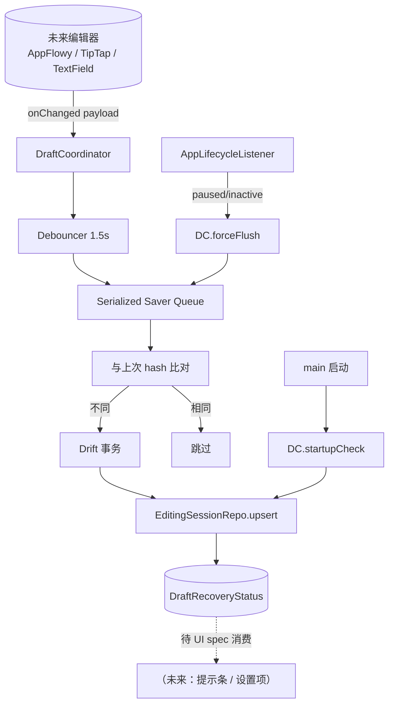

---
作者：@Ray
创建日期：2026-05-23
最后更新：2026-05-23
文档状态：草稿
---

# 设计：auto-save-draft

## 技术决策

### D1 · Debouncer 实现形式
- **背景：** 1.5s 防抖必备，且需 forceFlush 立即触发。
- **选项：** 引入 `stream_transform` 等第三方 / Dart `Timer` 自实现 / RxDart。
- **选择：** **自实现一个轻量 `Debouncer { fire(payload), flushNow(), cancel() }`**，基于 Dart `Timer`。
- **理由：** 行为可控；零依赖；测试用 fakeAsync 即可。
- **代价：** 自维代码量低（< 60 行）。

### D2 · 生命周期监听
- **背景：** 需要监 `AppLifecycleState.paused/inactive`。
- **选项：** `WidgetsBindingObserver` / `AppLifecycleListener`（Flutter 3.13+） / 第三方包。
- **选择：** **`AppLifecycleListener`**（Flutter stable 内置，3.13+ 推荐替代 WidgetsBindingObserver）。
- **理由：** 新 API 设计明确，专为生命周期观察；本项目 Flutter 跟随 stable 最新，可用。
- **代价：** 若 Flutter 版本回退到 3.12 以前会失效——同步在 D2 注明依赖最低 Flutter 3.13。

### D3 · DraftCoordinator 状态与并发
- **背景：** 单行模型不允许两个 onChanged 对不同 targetId 同时未 flush。
- **选项：** 锁 / 单事件循环串行 / 弃量。
- **选择：** **内部串行队列**（一个 `_pendingFuture` 链表）。任何 onChanged / forceFlush 都通过该队列；切换 targetId 时若内部待写的是别的 targetId，先 flush 旧的再处理新的。
- **理由：** Dart 单线程，串行队列足以保证顺序。
- **代价：** 串行偶尔会让一次 onChanged 等前一个写完——< 100ms 量级，体感无感。

### D4 · 写盘事务边界
- **背景：** R4 要求原子化。
- **选项：** Drift 事务 / 临时文件替换。
- **选择：** **Drift 事务**——`db.transaction { editing_session.upsert(...) }`。Drift / SQLite 本身保证。
- **理由：** 数据已在 db 中，不引入新机制。
- **代价：** 无。

### D5 · 内容 hash 算法
- **背景：** R6 跳过相同内容；需要快速 hash。
- **选项：** SHA-256 / xxHash / Dart 自带 `hashAll` / 直接字符串比较。
- **选择：** **SHA-256 of draftJson bytes**，缓存上次 hash 在协调器内存。
- **理由：** 简单可靠；JSON 串可能很大（数百 KB），SHA-256 也足够快。
- **代价：** 计算成本略高于 xxHash；可接受。

### D6 · 失败重试策略
- **背景：** R5 静默重试 ≤ 3。
- **选项：** 立即重试 / 指数退避 / 固定间隔。
- **选择：** **指数退避**：100ms、300ms、900ms（共 4 次尝试 = 第 0 + 3 次重试）。
- **理由：** 第一次失败常因瞬时 db 锁；指数退避避开重试风暴。
- **代价：** 总耗时上限约 1.3s；用户在此期间继续编辑会触发新的防抖窗口、新一次保存（不冲突）。

### D7 · 编辑器中立接口
- **背景：** R8 解耦编辑器。
- **选项：** 暴露具体编辑器类型 / 暴露抽象接口 / 协调器只接受 plain payload。
- **选择：** **协调器只接受 plain payload**（`targetId, draftJson, isNew, cursorPos`）。编辑器侧由后续接入 spec 负责把 onChanged 翻译成 plain payload。
- **理由：** 接口稳定，编辑器选型变更不影响协调器。
- **代价：** 编辑器接入需要薄一层 adapter；后续 spec 承担。

## 架构

## 文件变更

- `lib/drafts/debouncer.dart`            新建
- `lib/drafts/draft_coordinator.dart`    新建（核心）
- `lib/drafts/draft_recovery_status.dart` 新建（数据类）
- `lib/drafts/lifecycle_bridge.dart`     新建（AppLifecycleListener → forceFlush 桥接）
- `lib/drafts/demo.dart`                 新建（Debug Home demo）
- `lib/app.dart`                         修改（在根 Widget 挂 LifecycleBridge + startupCheck）
- `lib/demo/demo_entry.dart`             修改（追加注册）
- `test/drafts/`                         新建

## 已知风险

- **app.dart 修改影响 M0 文件白名单**：M0 已经写了 app.dart，本里程碑会再改它一次（挂 LifecycleBridge）——任务白名单已包含。
- **`AppLifecycleListener` 最低 Flutter 3.13**：Flutter 跟随 stable 最新；写明依赖。
- **paused 异步保存可能在系统冻结前完成不了**：R2 要求同步；Dart 同步写 db 是阻塞操作，paused 钩子需 `await db.transaction(...)`，可能延迟系统挂起；这是已知 tradeoff，可接受（同步 vs 数据丢失，选数据完整）。
- **多 isolate 写 editing_session**：协调器假设主 isolate 唯一持有；若未来其他 isolate 也写 db 需重新审视。
