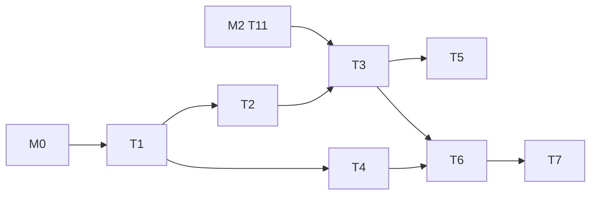

---
作者：@Ray
创建日期：2026-05-23
最后更新：2026-05-29
文档状态：草稿
---

# 任务列表：auto-save-draft

## 任务依赖图
> M# ↔ spec 映射（只列本 spec 用到的别名）：M0 = app-scaffold，M2 = data-layer。
>
> 整体依赖 **M0（app-scaffold）完成** + **M2（data-layer）T11 EditingSessionRepo 可用**。


并行组：
- Group A：T2, T4
- Group B：T5, T6（T5 依赖 T3，T6 依赖 T3+T4）

里程碑：
- **M4-done**：T1-T7 完成；Debug Home「Drafts demo」演示输入 → 1.5s 自动保存 → 杀进程 → 重启检测残留草稿。

-----

- [x] T1 · Debouncer 工具

**同 spec 依赖：** 无 ｜ **跨 spec 依赖：** app-scaffold（M0：壳/pubspec/平台配置/Debug Home 框架就绪） ｜ **关联需求：** R1, NF2 ｜ **依据设计：** D1 ｜ **可改文件：** `lib/drafts/debouncer.dart`, `test/drafts/debouncer_test.dart`

### 背景
轻量 Debouncer，含 `fire(payload)`、`flushNow()`、`cancel()`。

### 实施
1. 实现 Debouncer<T>：内部 `Timer? _timer`、`T? _pending`、`callback`
2. `fire` 取消现有 timer、记录 payload、起新 timer
3. `flushNow` 立即触发并清空
4. `cancel` 取消但不触发
5. 测试用 `fakeAsync` 验证：连续 fire 仅一次触发；flushNow 立即触发

### 验收标准（做完即止）
- 单测覆盖所有路径（自动）
- 防抖窗口准确性测试通过（误差 < 50ms）（自动）

### 验收方式
- 自动：
  ```bash
  flutter test test/drafts/debouncer_test.dart
  ```

### 验收记录
```
日期：2026-05-30
自动：flutter test test/drafts/debouncer_test.dart 通过（5/5）；dart analyze lib/drafts/debouncer.dart test/drafts/debouncer_test.dart 无问题。
人工：N/A
```

-----

- [x] T2 · DraftRecoveryStatus 数据类 + Saver 接口（编辑器中立）

**同 spec 依赖：** T1 ｜ **跨 spec 依赖：** 无 ｜ **关联需求：** R3, R7, R8 ｜ **依据设计：** D7 ｜ **可改文件：** `lib/drafts/draft_recovery_status.dart`, `lib/drafts/draft_coordinator.dart`（接口骨架）, `test/drafts/draft_contract_test.dart`

### 背景
先把外露接口与数据类钉死，后续 T3 填实现。本任务承接 R8「编辑器中立接口」：`onChanged` 只接受 plain payload `(targetId, draftJson, isNew, cursorPos)`，**签名中不出现任何编辑器类型**（AppFlowy / TipTap / TextField）；来源无关——AppFlowy onChanged 与任意其他来源（含 R9 远期 WebView 桥）一视同仁。R9 在方案 A 下不适用，其「来源无关」实质已被本接口覆盖，无需额外接口。

### 实施
1. `class DraftRecoveryStatus { bool hasResidual; String? targetId; bool isNew; DateTime? lastUpdated; }`
2. `class DraftCoordinator { onChanged({required String? targetId, required String draftJson, required bool isNew, int? cursorPos}); forceFlush(); clear(); startupCheck(); }` 骨架
3. 接口注释覆盖语义边界（单行模型、串行队列、失败静默重试、编辑器中立/来源无关）

### 验收标准（做完即止）
- `DraftRecoveryStatus` 可构造，四字段 `hasResidual / targetId / isNew / lastUpdated` 取值如实回读（断言行为：用具名实参构造一个实例，`expect` 各字段等于传入值），满足 R3/R7 的状态契约（自动 · 测试）
- `DraftCoordinator.onChanged` 以 plain payload `(targetId, draftJson, isNew, cursorPos)` 调用可编译通过且接受任意来源构造的实参（断言行为：测试直接用具名实参调用 onChanged 骨架不抛 ArgumentError / 编译错），满足 R8 编辑器中立（自动 · 测试）
- 签名与实现中不出现编辑器类型名（AppFlowy / TipTap / WebView）—— **解耦守卫，非行为断言**（自动 grep）

### 验收方式
- 自动：
  ```bash
  flutter test test/drafts/draft_contract_test.dart \
    && ! grep -Eq 'AppFlowy|TipTap|WebView' lib/drafts/draft_coordinator.dart
  ```
  （前半 `flutter test` 断言 DraftRecoveryStatus 字段回读与 onChanged 接受 plain payload 的**行为/值**；后半 `! grep` 是 R8 解耦不变式守卫——断言协调器文件里**不出现**编辑器类型名，属缺失守卫而非正向存在性 grep，故保留）

### 验收记录
```
日期：2026-05-30
自动：flutter test test/drafts/draft_contract_test.dart 通过（6/6）；dart analyze lib/drafts/draft_recovery_status.dart lib/drafts/draft_coordinator.dart test/drafts/draft_contract_test.dart 无问题；! grep -Eq 'AppFlowy|TipTap|WebView' lib/drafts/draft_coordinator.dart 通过。
人工：N/A
```

-----

- [ ] T3 · DraftCoordinator 实现（防抖 + 串行队列 + hash + 重试）

**同 spec 依赖：** T1, T2 ｜ **跨 spec 依赖：** data-layer（EditingSessionRepo，对应其 T11） ｜ **关联需求：** R1, R3, R4, R5, R6, NF1 ｜ **依据设计：** D3, D4, D5, D6 ｜ **可改文件：** `lib/drafts/draft_coordinator.dart`, `test/drafts/draft_coordinator_test.dart`

### 背景
核心实现：
- onChanged → Debouncer.fire(payload)
- Debouncer 到时 → 推入串行队列
- 串行队列出队 → hash 比对 → 不同则 Drift 事务 upsert → 失败指数退避重试

### 实施
1. `_pendingFuture` 链表（每次操作 await 上一个）
2. `_lastSavedHash` 缓存
3. `_saveOnce(payload)`：hash 比对 + 事务 upsert + 失败计数器 + 指数退避
4. `forceFlush`：Debouncer.flushNow + 等串行队列空
5. `clear`：EditingSessionRepo.clear + 清 hash
6. `startupCheck`：EditingSessionRepo.current() → 包装为 status
7. 测试：
   - 连续 onChanged 仅一次写盘
   - 相同 payload 跳过 db 写
   - 模拟 db 失败 → 重试 3 次后异常入队
   - 切换 targetId 触发先 flush 旧
   - 串行队列乱序输入 → 仍按入队顺序

### 验收标准（做完即止）
- 全部测试通过（自动）
- 不存在并发竞态（fakeAsync 模拟 100 次并发 onChanged 输出确定）（自动）

### 验收方式
- 自动：
  ```bash
  flutter test test/drafts/draft_coordinator_test.dart
  ```

### 验收记录
```
日期：—
自动：—
人工：—（无）
```

-----

- [ ] T4 · LifecycleBridge

**同 spec 依赖：** T1 ｜ **跨 spec 依赖：** 无 ｜ **关联需求：** R2, NF3 ｜ **依据设计：** D2 ｜ **可改文件：** `lib/drafts/lifecycle_bridge.dart`, `test/drafts/lifecycle_bridge_test.dart`

### 背景
封装 `AppLifecycleListener` 监听 paused / inactive；持有 DraftCoordinator 引用，在事件中 `await coordinator.forceFlush()`。

### 实施
1. `class LifecycleBridge` 接 DraftCoordinator
2. `start()` 注册 AppLifecycleListener；`stop()` dispose
3. paused / inactive → forceFlush
4. 测试：用 `binding.handleAppLifecycleStateChanged` 触发，断言 forceFlush 被调用

### 验收标准（做完即止）
- 单测通过（自动）
- paused 同步等待 forceFlush 完成才返回（自动）

### 验收方式
- 自动：
  ```bash
  flutter test test/drafts/lifecycle_bridge_test.dart
  ```

### 验收记录
```
日期：—
自动：—
人工：—（无）
```

-----

- [ ] T5 · main / app.dart 集成 startupCheck

**同 spec 依赖：** T3 ｜ **跨 spec 依赖：** 无 ｜ **关联需求：** R7, NF4 ｜ **依据设计：** D2, D3 ｜ **可改文件：** `lib/app.dart`, `lib/main.dart`, `test/drafts/startup_check_test.dart`

### 背景
启动时调用 `DraftCoordinator.startupCheck`，状态保存到全局可访问位置（不引入状态库，先存 `static late final` 或 service locator）。UI 提示条由后续 spec 消费。NF4 的 50ms 性能落点亦由本任务承接（startupCheck 同步段计时断言）。

### 实施
1. main 中 await `coordinator.startupCheck()`，结果存入 `DraftRecoveryHolder.lastStatus`（简单单例）
2. app.dart 起 LifecycleBridge.start
3. 单测：mock EditingSessionRepo 返回有残留行，验证 startupCheck 返回 hasResidual=true，且 `DraftRecoveryHolder.lastStatus` 被写入该结果
4. 性能单测（NF4）：mock 残留单行场景，用 `Stopwatch` 包裹 startupCheck 同步段，断言 `elapsedMilliseconds < 50`

### 验收标准（做完即止）
- 启动流程跑过后 `DraftRecoveryHolder.lastStatus` 等于 startupCheck 的返回值，且残留场景下 `hasResidual == true`（断言行为：mock repo 返回残留行，pump 启动后读 holder 值，`expect(holder.lastStatus.hasResidual, isTrue)`）（自动 · 测试，覆盖 R7）
- LifecycleBridge 在根 widget 挂载后处于「已启动」状态（断言行为：pump 根 widget 后触发 paused 生命周期事件，`expect` 协调器 forceFlush 被调用一次，证明桥已 start）（自动 · 测试）
- startupCheck 同步段 `Stopwatch.elapsedMilliseconds < 50`（断言 NF4 度量值）（自动 · 测试）

### 验收方式
- 自动：
  ```bash
  flutter test test/drafts/startup_check_test.dart
  ```
  （测试断言：① 残留场景 holder.lastStatus.hasResidual==true 即 startupCheck 已在启动流程被调用并落地，覆盖 R7；② pump 后触发 paused 致 forceFlush 被调用，证明 LifecycleBridge 已 start；③ startupCheck 同步段 Stopwatch elapsed < 50ms，覆盖 NF4——全部断言**行为/值**，不 grep 被改文件自身）

### 验收记录
```
日期：—
自动：—
人工：—（无）
```

-----

- [ ] T6 · 集成测试：崩溃恢复路径

**同 spec 依赖：** T3, T4 ｜ **跨 spec 依赖：** 无 ｜ **关联需求：** R2, R4, R7, NF1 ｜ **依据设计：** D3, D4 ｜ **可改文件：** `test/drafts/crash_recovery_test.dart`

### 背景
模拟「写到一半 kill」与「paused 后 kill」两种场景；验证：
- editing_session 表中或为完整 JSON、或为空，不出现部分 JSON
- 重启后 startupCheck 检测到残留

### 实施
1. 直接构造一份完整 draft 写入 → kill 进程模拟 → 重启 → startupCheck → hasResidual=true
2. 测试用 in-memory db 模拟「写到一半异常」：注入故障的 EditingSessionRepo，触发保存 → 检查表内不含半截 JSON
3. paused 路径：先 onChanged 再触发 paused → 表中已是完整最新 JSON

### 验收标准（做完即止）
- 三种集成场景通过（自动）

### 禁止
- 不让任何场景下 editing_session 出现 JSON 解析失败的内容

### 验收方式
- 自动：
  ```bash
  flutter test test/drafts/crash_recovery_test.dart
  ```

### 验收记录
```
日期：—
自动：—
人工：—（无）
```

-----

- [ ] T7 · 接入 Debug Home：Drafts demo

**同 spec 依赖：** T6 ｜ **跨 spec 依赖：** 无 ｜ **关联需求：** R1, R2, R3, R7 ｜ **依据设计：** D7 ｜ **可改文件：** `lib/drafts/demo.dart`, `lib/demo/demo_entry.dart`

### 背景
做一个简陋编辑模拟（不接真编辑器，用 Flutter `TextField` 作 onChanged 来源）演示自动保存与恢复：
- 进入 demo 时：显示 startupCheck 结果（有无残留草稿）
- TextField 输入：onChanged → DraftCoordinator.onChanged → 1.5s 后保存
- 「模拟切后台」按钮：手动调 LifecycleBridge 的 paused 钩子触发 forceFlush
- 「提交并清空」按钮：写 EntryRepo.create（content_plain = TextField 文本）+ coordinator.clear
- 「弃稿不清」按钮：什么都不做，直接退出（模拟崩溃保留草稿）
- 文本块展示当前 editing_session 表内容

### 实施
1. `class DraftsDemo extends StatefulWidget`
2. 上述四按钮 + TextField
3. 注册到 demos 列表
4. iOS + Android 真机各跑一次

### 验收标准（做完即止）
- 输入 → 1.5s 后底部「上次保存时间」更新（人工 @Ray）
- 「弃稿不清」后杀进程 → 重启进 demo → 顶部显示「检测到残留草稿」（人工 @Ray）
- 「提交并清空」后 editing_session 表内容显示为空（人工 @Ray）

### 验收方式
- 自动：
  ```bash
  flutter test test/drafts/demo_test.dart
  ```
- 人工（@Ray）：iOS + Android 真机各跑一次完整流程

### 验收记录
```
日期：—
自动：—
人工：—（核查人 @Ray）
```
