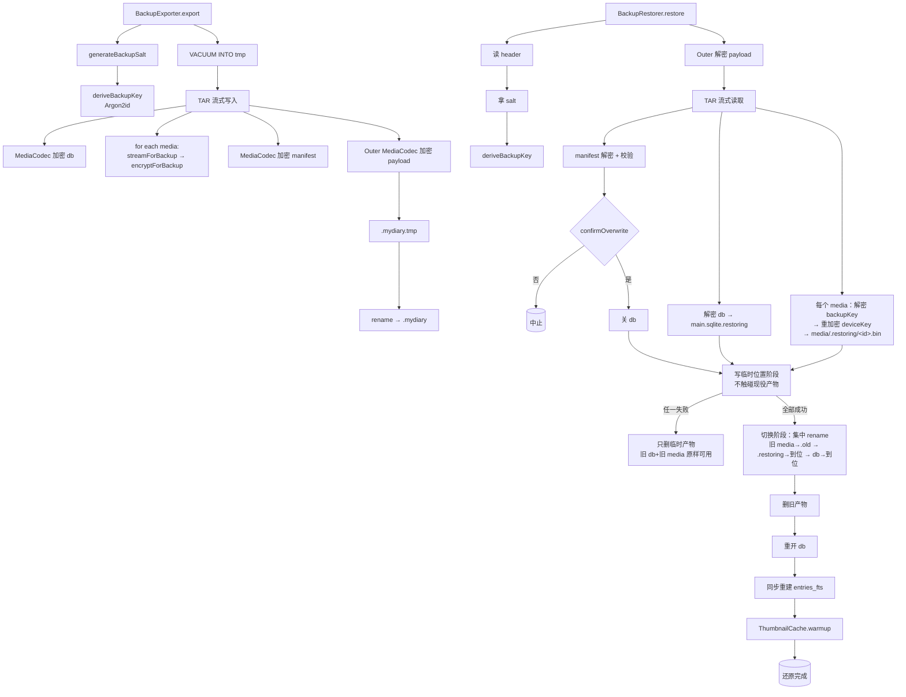

---
作者：@Ray
创建日期：2026-05-23
最后更新：2026-05-23
文档状态：草稿
---

# 设计：backup-full-snapshot

## 技术决策

### D1 · 容器格式 - 自定义二进制头 + 内嵌加密 TAR
- **背景：** 需要一个流式可写、流式可读、能放进单个文件、可在 iOS/Android 通用解析的格式。
- **选项：** ZIP（带压缩对密文无意义） / TAR（无压缩，流式友好）/ 自定义。
- **选择：** **外层自定义头（magic + version + salt + payload size） + 内嵌 TAR**（payload 整体再被 MediaCodec 加密一次）。
- **理由：** 头部明文存 salt 必要（无 salt 无法派生密钥读其余内容）；TAR 流式天然；MediaCodec 复用 M3 已实现的 AEAD。
- **代价：** TAR 不带索引，遍历 media 需从头读——MVP 整库覆盖式还原是顺序读，可接受；阶段二 media 增量需要重新设计。

### D2 · 嵌套加密 vs 单层加密
- **背景：** R1 要求 media 在 TAR 内**仍为 MediaCodec 加密格式**；外层 payload 也加密；即两层加密。
- **选项：** 仅外层加密（TAR 内文件明文）/ 仅内层加密（每文件加密但外不加密）/ 双层。
- **选择：** **双层**：内层 media/db/manifest 各自 MediaCodec 加密；外层 payload 再 MediaCodec 加密一次。
- **理由：** ① 内层加密让 media 在 TAR 流中**永不出现明文** —— 满足 R9（与 v6 8.6 / 9.1 注一致）；② 外层再加密使整包结构 / 文件大小 / 文件名也不暴露（防元数据泄露）。
- **代价：** 加解密两次；性能影响 < 20%（AEAD 是 CPU 廉价操作）；通过 NF1/NF2 验证可接受。

### D3 · VACUUM INTO 临时 db
- **背景：** v6 8.3 明确导出用 `VACUUM INTO` 产干净紧凑副本，正确处理 WAL。
- **选项：** 直接拷 `.sqlite` 文件 / `VACUUM INTO` / 用 SQLCipher export 函数。
- **选择：** **`VACUUM INTO 'tmp/full_<ts>.db'`**，临时 db 用同一 SQLCipher 密钥（一开始就加密）。
- **理由：** 官方推荐；处理 WAL；产生紧凑 db。
- **代价：** 临时占用磁盘空间约一倍 db 大小；T1 + T9（NF5）保证清理。

### D4 · 媒体重加密管道
- **背景：** R9 / v6 9.1 注，明文不落临时文件。
- **选项：** decrypt 到 ByteList → encrypt（内存可能爆）/ 流式管道 / 临时文件中转。
- **选择：** **Dart Stream 管道：`MediaStore.streamForBackup(relPath) → MediaStore.encryptForBackup(stream, backupKey) → TAR.addEntry(stream)`**。
- **理由：** Dart Stream backpressure 自然；M3 T6 已提供这两个 API；TAR 包支持流式 entry。
- **代价：** 需 TAR 包支持 streaming entry（`archive` 包的 `TarFileEncoder` 接 `InputStream`，可行）；若包不支持流，需自实现 TAR writer（约 200 行）。

### D5 · 还原原子化（写临时位置 + 全成功后原子切换）
- **背景：** R8 / v6 8.4 第 6 步；遵守 `docs/design/09`「约定二·覆盖式还原」。
- **选项：**
  - ①「先清空旧 media → 逐个写回 → 失败用 `main.sqlite.bak` 回滚 db」——**已否决**：media 写回中途失败、回滚到旧 db 后，旧 db 引用的 media 已被清空 → 「db 在、图全丢」的数据丢失。
  - ②「新 db + 新 media 全部先写临时位置，全部成功后才原子切换（rename），失败只删临时产物」。
- **选择：** **方案②**。关 db → 新 db 写 `main.sqlite.restoring`、每个新 media 写 `media/.restoring/<id>.bin`（写临时位置阶段绝不触碰现役产物）→ 全部成功后进入切换阶段（集中 rename：旧 media 移到 `media/.old/` → `media/.restoring/*` rename 到位 → `main.sqlite.restoring` rename 到位）→ 删旧产物 → 重开 db。任一步失败只删临时产物，旧 db + 旧 media 原样不动。
- **理由：** 满足「要么全旧、要么全新」不变式，无数据丢失窗口；rename 原子；写临时位置阶段失败时现役产物从未被破坏，无需「回滚 db」这一危险动作。
- **代价：** 还原峰值磁盘约 ×2（旧产物 + 临时新产物并存到切换完成）；可接受（v6 已默认还原期磁盘翻倍）。临时产物清理由 NF5 / T9 承接。

### D6 · 重建 FTS 同步策略
- **背景：** R6 + v6 8.4 第 5 步。
- **选项：** 同步 / 异步 / 懒（首次搜索时）。
- **选择：** **同步**——在 db 重启后 + 用户看到时间线前完成。
- **理由：** FTS 是「日记都在但搜不到」的差体验，必须先把 FTS 重建当成 db 重启的一部分。
- **代价：** restore 总耗时延长（数秒级），可接受。

### D7 · 缩略图懒生成 + 后台预热
- **背景：** R6 + v6 8.4 第 5 步「**禁止**还原时同步全量重建」。
- **选项：** restore 同步重建 / 让 UI 滚到哪生成到哪 / restore 末尾启动 warmup。
- **选择：** **restore 末尾启动 ThumbnailCache.warmup(allIds) low 优先级**；不 await。UI 滚动时高优先级 request 会抢占。
- **理由：** 满足「还原后立即可用」+ 自动逐步补齐。
- **代价：** 用户回到时间线后看到一段时间的占位；UI spec 处理（灰块 / blurhash）。

### D8 · UI 解耦
- **背景：** v6 8.4 第 7 步「整库覆盖前必须二次确认」是 UI 概念。
- **选项：** 在 lib 内弹 dialog / 暴露 callback / 默认禁止覆盖。
- **选择：** **`restore` 入参含 `confirmOverwrite: Future<bool> Function()`** 回调；调用方（未来 UI）实现。返回 false 抛 `BackupCancelledException`。
- **理由：** lib 不依赖 UI；测试可注入 fake callback。
- **代价：** 无。

### D9 · 进度上报粒度
- **背景：** R4 四阶段；media 阶段按数量上报。
- **选项：** 字节级 / entry 级 / 阶段级。
- **选择：** 阶段级 + media 数量计数（`(processed_media, total_media)`）。
- **理由：** UI 渲染足够；过细 callback 频率太高拖累性能。
- **代价：** 无。

## 架构

## 文件变更

- `pubspec.yaml`                                  修改（添加 `archive` 包提供 TAR 流式支持，或自实现 TAR）
- `lib/backup/backup_format.dart`                 新建（外层 header 解析/写入）
- `lib/backup/manifest.dart`                      新建（manifest 数据类 + JSON 序列化）
- `lib/backup/tar_stream.dart`                    新建（流式 TAR 读写薄封装，如 archive 包不够用则自实现）
- `lib/backup/backup_exporter.dart`               新建
- `lib/backup/backup_restorer.dart`               新建
- `lib/backup/exceptions.dart`                    新建
- `lib/backup/demo.dart`                          新建
- `lib/demo/demo_entry.dart`                      修改
- `test/backup/`                                  新建（包括往返集成测试）

## 已知风险

- **archive 包流式 TAR 支持**：需验证 TAR encoder/decoder 支持 stream entry；不支持则自实现 ~200 行。
- **iOS Pod / Android NDK 影响**：archive 是纯 Dart，无原生依赖；放心。
- **磁盘空间瞬时翻倍**：导出时 VACUUM 临时 db + .mydiary 中间文件；还原时旧产物（db + media）与临时新产物（`main.sqlite.restoring` + `media/.restoring/`）并存到切换完成，峰值约 ×2；T1 提前校验空间，空间不足按 R8 失败保留旧态。
- **VACUUM INTO 加密 db 行为**：SQLCipher 的 VACUUM INTO 应仍保持加密；测试覆盖。
- **schema_version 跨大版本还原**：v0 起步只支持 schema=1；后续版本需补 migration 路径，本期文档化。
- **NF1 / NF2 3-4 分钟基线**：基于估算；T8 真机基准验证；不达标在已知风险更新。
