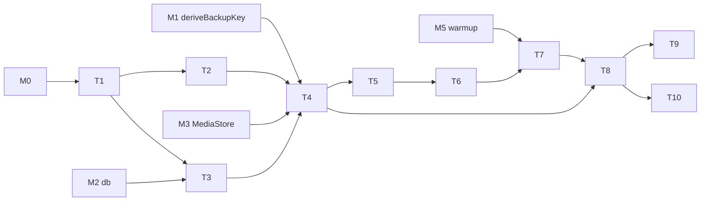

---
作者：@Ray
创建日期：2026-05-23
最后更新：2026-05-23
文档状态：草稿
---

# 任务列表：backup-full-snapshot

## 任务依赖图
> 整体依赖 **M0**、**M1（备份口令派生）**、**M2（db / Repo）**、**M3（MediaStore + streamForBackup）**、**M5（ThumbnailCache.warmup）**。


并行组：
- Group A：T2, T3
- Group B：T6（依赖 T5）

里程碑：
- **M6-done**：T1-T10 完成；Debug Home「Backup demo」可演示完整 export → 还原回原数据 → 时间线、FTS 搜索、缩略图均工作。

-----

- [ ] T1 · 添加 archive 依赖 + 路径定义

**依赖：** M0 ｜ **关联需求：** R1 ｜ **依据设计：** D1 ｜ **可改文件：** `pubspec.yaml`, `lib/backup/paths.dart`

### 实施
1. 添加 `archive` 包；验证 stream entry API 是否够用，不够则记入 T3 自实现 TAR
2. 定义临时目录、备份输出目录路径工具

### 验收标准（做完即止）
- `flutter pub get` 成功拉到 `archive` 包（自动）
- `lib/backup/paths.dart` 暴露临时目录与备份输出目录路径工具（自动）
- `flutter analyze` 无错误（自动）

### 验收方式
- 自动：`flutter pub get && flutter analyze`

### 验收记录
```
日期：—
自动：—
人工：—（无）
```

-----

- [ ] T2 · BackupFormat（外层 header 读写）

**依赖：** T1 ｜ **关联需求：** R1 ｜ **依据设计：** D1 ｜ **可改文件：** `lib/backup/backup_format.dart`, `test/backup/backup_format_test.dart`

### 实施
1. `BackupHeader { magic, version, salt }`
2. `writeHeader(IOSink, header)`、`readHeader(RandomAccessFile)`
3. magic 校验、version 校验
4. 单测：写后读相同、坏 magic 抛错、版本不匹配抛错

### 验收标准（做完即止）
- 写后读 header 字段（magic / version / salt）一致（自动）
- 坏 magic 抛错（自动）
- version 不匹配抛错（自动）

### 验收方式
- 自动：`flutter test test/backup/backup_format_test.dart`

### 验收记录
```
日期：—
自动：—
人工：—（无）
```

-----

- [ ] T3 · TAR 流式封装 + Manifest 数据类

**依赖：** T1 ｜ **关联需求：** R1, R2 ｜ **依据设计：** D1, D2 ｜ **可改文件：** `lib/backup/tar_stream.dart`, `lib/backup/manifest.dart`, `test/backup/tar_stream_test.dart`

### 实施
1. `TarStreamWriter` / `TarStreamReader`：基于 `archive` 包或自实现；接 stream entry
2. `Manifest` 类 + JSON 序列化（按 R2 字段）
3. 测试：往返一个 Manifest 字节级一致；TAR 写入 3 个 entry + 读出来一致

### 验收标准（做完即止）
- `Manifest` 含 R2 全部字段，序列化往返字节级一致（自动）
- `TarStreamWriter` 写入 3 个 stream entry，`TarStreamReader` 读回内容与原一致（自动）

### 验收方式
- 自动：`flutter test test/backup/tar_stream_test.dart`

### 验收记录
```
日期：—
自动：—
人工：—（无）
```

-----

- [ ] T4 · BackupExporter（核心导出）

**依赖：** T2, T3, M1, M3 ｜ **关联需求：** R3, R4, R9, NF1, NF3, NF4, NF5 ｜ **依据设计：** D2, D3, D4, D9 ｜ **可改文件：** `lib/backup/backup_exporter.dart`, `lib/backup/exceptions.dart`, `test/backup/exporter_test.dart`

### 实施
1. `export({password, outputPath, onProgress, cancelToken})`
2. 步骤按 R3 流程；isolate 内执行
3. 进度回调四阶段（D9）
4. 失败 / 取消清理 `.tmp` + 临时 db
5. 测试：
   - 小型库（3 entries + 2 media）导出 + hexdump 检查无明文
   - cancel 触发后清理临时文件
   - VACUUM 失败 / 加密失败的回滚路径

### 验收标准（做完即止）
- 全部测试通过（自动）
- 输出 `.mydiary` hexdump 中不可见明文 manifest / db / media 字节（自动）
- 中间产物清理有测试覆盖（自动）

### 禁止
- 不允许 plain bytes 写入临时文件
- 不允许在主 isolate 做加密 / 文件 I/O 主循环

### 验收方式
- 自动：`flutter test test/backup/exporter_test.dart`

### 验收记录
```
日期：—
自动：—
人工：—（无）
```

-----

- [ ] T5 · BackupRestorer 解析 + manifest 校验 + 确认回调

**依赖：** T4 ｜ **关联需求：** R5（前 4 步）, R7, R10, R11 ｜ **依据设计：** D5, D8 ｜ **可改文件：** `lib/backup/backup_restorer.dart`（骨架）, `test/backup/restorer_parse_test.dart`

### 背景
本任务覆盖 restore 流程的「读 + 校验 + 确认」部分（R5 步骤 1-4）；T6 做剩余的整库替换 + media 重加密 + FTS 重建 + warmup 步骤。这样把高复杂度任务拆开降低单测复杂度。

### 实施
1. `BackupRestorer.parseAndConfirm(inputPath, password, confirmOverwrite)`：
   - 读 header → salt
   - deriveBackupKey
   - 解密 payload → TAR reader
   - 读 manifest → 校验 schema_version（R7）
   - 调 confirmOverwrite() → false 抛 BackupCancelledException
2. 抛错路径定义：BadPassword / SchemaIncompatible / ManifestCorrupted
3. 测试：
   - 错密码：抛 BadPassword
   - schema 太高：抛 SchemaIncompatible（不兼容）
   - schema 较低：返回需要 migration 的标记
   - manifest 损坏：抛 ManifestCorrupted
   - confirmOverwrite false：抛 BackupCancelledException

### 验收标准（做完即止）
- 错密码抛 BadPassword（自动）
- schema_version 高于当前 App 抛 SchemaIncompatible（自动）
- schema_version 低于当前 App 返回需要 migration 的标记（自动）
- manifest 损坏抛 ManifestCorrupted（自动，满足 R11）
- confirmOverwrite 返 false 抛 BackupCancelledException（自动）

### 验收方式
- 自动：`flutter test test/backup/restorer_parse_test.dart`

### 验收记录
```
日期：—
自动：—
人工：—（无）
```

-----

- [ ] T6 · BackupRestorer 整库替换 + media 重加密

**依赖：** T5 ｜ **关联需求：** R5（步骤 5-9）, R8, R9 ｜ **依据设计：** D5 ｜ **可改文件：** `lib/backup/backup_restorer.dart`（追加）, `test/backup/restorer_apply_test.dart`

### 实施
> 遵守 `docs/design/09`「约定二·覆盖式还原」：新产物全部先写临时位置，全成功后才原子切换；任一步失败只删临时产物，旧 db + 旧 media 原样不动。**严禁先清空旧 media 再写回**（会造成「db 在、图全丢」）。
1. `BackupRestorer.apply(parsedSession)`：
   - 关 db
   - **写临时位置阶段**（绝不触碰现役 `main.sqlite` 与 `media/`）：
     - 解密备份 db → 写 `<documents>/db/main.sqlite.restoring`
     - 逐个 media entry：流式解密 backupKey → 重加密 deviceKey → 写 `<documents>/media/.restoring/<id>.bin`
   - **切换阶段**（仅在上一步全部成功后进入，集中 rename）：
     - 旧 `media/` 下现役文件移到 `media/.old/`
     - `media/.restoring/*` rename 到 `media/`
     - `main.sqlite.restoring` rename 到 `main.sqlite`
   - 删旧产物（`media/.old/`、旧 db）
   - 删除 `<documents>/thumbs/`（派生数据，删旧即可）
   - 重开 db
   - 写临时位置阶段或切换前任一步失败：只删临时产物，旧 db + 旧 media 完整保留
2. 测试：
   - 正常 apply 后 db 与 media 全部就位
   - 写临时位置阶段注入故障（解密 db / 重加密 media 失败）→ 旧 db + 旧 media **完整可用**，旧 db 引用的每个 media 仍存在且可解密；仅临时产物被清（验证无数据丢失、满足「全旧或全新」不变式）
   - 媒体重加密管道无临时 plain 文件

### 验收标准（做完即止）
- 正常 apply 后新 db 与全部 media 就位、`thumbs/` 已删（自动）
- 写临时位置阶段注入故障后旧 db + 旧 media 完整可用，旧 db 引用的每个 media 仍可解密，仅临时产物被清（自动，满足 R8）
- 媒体重加密全程磁盘无明文临时文件（自动，满足 R9）

### 验收方式
- 自动：`flutter test test/backup/restorer_apply_test.dart`

### 验收记录
```
日期：—
自动：—
人工：—（无）
```

-----

- [ ] T7 · 重建 FTS + 启动 warmup

**依赖：** T6, M5 ｜ **关联需求：** R5（步骤 10-11）, R6 ｜ **依据设计：** D6, D7 ｜ **可改文件：** `lib/backup/backup_restorer.dart`（追加方法）, `test/backup/restorer_fts_test.dart`

### 实施
1. `rebuildFts()`：在 db 上跑 `DELETE FROM entries_fts; INSERT INTO entries_fts SELECT id, content_plain FROM entries WHERE deleted_at IS NULL;` —— 同步等待完成
2. `kickoffThumbnailWarmup()`：`ThumbnailCache.warmup(allLivingMediaIds)`，**不 await**
3. 测试：
   - restore 完成后 FTS 表行数 = 存活 entries 数
   - warmup 调用立即返回（< 50ms）
   - 不存在「restore 流程内同步生成缩略图」的代码路径（grep 检查）

### 验收标准（做完即止）
- restore 完成后 `entries_fts` 行数 = 存活 entries 数（自动，满足 R6）
- `kickoffThumbnailWarmup()` 不 await，调用立即返回（< 50ms）（自动）
- restore 代码路径不含「同步全量生成缩略图」调用（自动 grep）

### 禁止
- restore 不得调用任何「同步全量生成缩略图」函数（grep `await.*Thumbnail.*for` 或类似）

### 验收方式
- 自动：`flutter test test/backup/restorer_fts_test.dart`

### 验收记录
```
日期：—
自动：—
人工：—（无）
```

-----

- [ ] T8 · 端到端往返集成测试

**依赖：** T4, T7 ｜ **关联需求：** R3, R5, R8, NF1, NF2, NF3, NF4 ｜ **依据设计：** D1-D7 ｜ **可改文件：** `test/backup/roundtrip_test.dart`

### 实施
1. 准备测试库：N entries + M media（小尺寸方便 CI 跑）
2. export → 在新 isolate / 新临时目录 restore → 比对：
   - entries 全部一致（id / content_plain / entry_dt_utc）
   - media 文件存在且解密后字节与原 media 一致（用 sha256）
   - FTS 搜索仍能返回原结果
3. 真机基准（NF1 / NF2）：10000 entries + 500 media（1.5 GiB）→ 真机跑一次记录耗时

### 验收标准（做完即止）
- CI 小规模往返测试全过（自动）
- 真机基准 NF1 < 3 分钟、NF2 < 4 分钟（人工）

### 验收方式
- 自动：`flutter test test/backup/roundtrip_test.dart`
- 人工（@Ray）：真机基准

### 验收记录
```
日期：—
自动：—
真机 NF1 / NF2：—
核查人：@Ray
```

-----

- [ ] T9 · 中间产物清理保证

**依赖：** T4 ｜ **关联需求：** NF5 ｜ **依据设计：** D3, D5 ｜ **可改文件：** `lib/backup/backup_exporter.dart` / `backup_restorer.dart`（finally 块完善）, `test/backup/cleanup_test.dart`

### 实施
1. exporter 与 restorer 顶层 try/finally 中清理：`<tmp>/full_*.db`、`<output>.tmp`、`<db>/main.sqlite.restoring`、`<documents>/media/.restoring/`、`<documents>/media/.old/`、`<documents>/media/.tmp` 残留
2. 测试：
   - 正常路径完成后临时目录干净
   - 异常路径完成后临时目录干净
   - cancel 路径完成后干净

### 验收标准（做完即止）
- 正常路径结束后无 `<tmp>/full_*.db` / `<output>.tmp` / `.restoring` / `media/.old` 残留（自动，满足 NF5）
- 异常路径结束后同样无上述残留（自动）
- cancel 路径结束后同样无上述残留（自动）

### 验收方式
- 自动：`flutter test test/backup/cleanup_test.dart`

### 验收记录
```
日期：—
自动：—
人工：—（无）
```

-----

- [ ] T10 · 接入 Debug Home：Backup demo

**依赖：** T8 ｜ **关联需求：** R3, R5, R10 ｜ **依据设计：** D8 ｜ **可改文件：** `lib/backup/demo.dart`, `lib/demo/demo_entry.dart`

### 背景
做一个 Debug Home 入口演示完整往返：
- 「填充测试数据」按钮：建 3 entries + 2 media
- 「导出 .mydiary」按钮：让用户输入备份口令（demo 内用 TextField 不走系统弹窗）→ 进度条 → 输出到 `<documents>/exports/test.mydiary`
- 「清空当前数据」按钮（带强提示）：drop all
- 「还原」按钮：选 test.mydiary + 输入口令 → 显示 confirmOverwrite 确认 dialog（demo 内用 AlertDialog）→ 还原 → 验证 entries / media / FTS 搜索 / 缩略图都恢复

### 实施
1. `class BackupDemo extends StatefulWidget`
2. 上述按钮 + 进度条 + 文本展示
3. 演示进度回调
4. 注册到 demos 列表
5. iOS + Android 真机各跑一次

### 验收标准（做完即止）
- 完整往返路径可演示（人工 @Ray）
- 还原后 FTS 搜索能用、缩略图先占位再逐步出（人工 @Ray）

### 禁止
- 不在 UI 上展示备份口令明文（输入后立即清空显示）

### 验收方式
- 自动：`flutter test test/backup/demo_test.dart`
- 人工（@Ray）：真机演示

### 验收记录
```
日期：—
自动：—
人工：—（核查人 @Ray）
```
