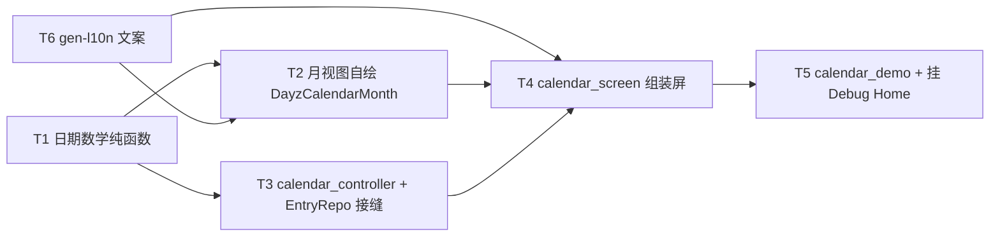

---
作者：@Ray
创建日期：2026-05-29
最后更新：2026-05-29
文档状态：草稿
---

# 任务列表：calendar-screen

## 任务依赖图
> 由各任务 inline「同 spec 依赖」字段汇总，仅供速览；以 inline 为准。



并行组：
- Group A：T1, T6（无前置，可并行）
- Group B：T2（依赖 T1, T6）、T3（依赖 T1）
- Group C：T4（依赖 T2, T3, T6）
- Group D：T5（依赖 T4）

（整屏一体、无可独立部署/演示的中间切点 → 不设里程碑。）

-----

- [ ] T1 · calendar_date_math.dart（日期数学纯函数）

**同 spec 依赖：** 无 ｜ **跨 spec 依赖：** 无 ｜ **关联需求：** R1, R2, R3 ｜ **依据设计：** D1 ｜ **可改文件：** `lib/ui/calendar/calendar_date_math.dart` ｜ **验收基建：** `test/ui/calendar/calendar_date_math_test.dart`

### 背景
把月视图的日期数学抽成纯函数（无 widget、无 IO），供 `DayzCalendarMonth`（T2）与控制器（T3）调用。对应原型 `dim`/`firstWD` 与月份 ±1 进退位逻辑。

### 实施
1. `daysInMonth(year, month)`：该月天数（含闰年），用 `DateTime`。
2. `firstWeekdayMondayStart(year, month)`：当月 1 号是周几（**周一=0 … 周日=6**，对应原型 `(getDay()+6)%7`）。
3. `leadingPadCount(year, month)` = `firstWeekdayMondayStart`（前导占位格数）。
4. `prevMonth(year, month)` / `nextMonth(year, month)`：返回 `(year, month)`，跨年进位/退位（12→1 进年、1→12 退年）。
5. 新文件加 MPL-2.0 头注。

### 验收标准（做完即止）
- 已知月份天数/闰年（如 2026-2=28、2024-2=29、2026-5=31）正确（自动）。
- 周一起始首日换算正确（构造已知周几的月份断言，如某月 1 号周日 → 返回 6）（自动）。
- 月份 ±1 跨年进退位正确（2026-12 next → 2027-1；2026-1 prev → 2025-12）（自动）。

### 验收方式
- 自动：
  ```bash
  flutter test test/ui/calendar/calendar_date_math_test.dart
  ```
  （unit test 断言各纯函数**返回值**与已知日历事实一致；**不** grep 被测文件自身）

### 验收记录
```
日期：—
自动：—
人工：N/A
```

-----

- [ ] T2 · DayzCalendarMonth 月视图自绘（三态日格 + 周一起始 + 命中区 + Semantics）

**同 spec 依赖：** T1, T6 ｜ **跨 spec 依赖：** `design-tokens-theme`：`context.dayz.*` / `DayzSpacing` / `DayzRadii` / 排版角色；`ui-kit-components`：`dayzMotionDuration`（reduce-motion 门）｜ **关联需求：** R1, NF1, NF3, NF4, NF6 ｜ **依据设计：** D1 ｜ **可改文件：** `lib/ui/calendar/calendar_month_grid.dart` ｜ **验收基建：** `test/ui/calendar/calendar_month_grid_test.dart`、`test/ui/calendar/goldens/`（month grid golden 基线）

### 背景
自绘月视图：`GridView.count(crossAxisCount: 7)` + 周一起始前导占位（用 T1）+ 每格 `_CalendarDayCell` 三态。入参 = `year/month/selectedDay?/today` + `Map<int,int>`（日→篇数）+ `onDaySelected(day)` 回调。本任务只做**纯展示 + 选日回调**，不取数（取数归 T3）、不组装顶栏（归 T4）。
归属：日格三态视觉、命中区、Semantics 全在本任务；月标题/导航钮在屏壳（T4）。

### 实施
1. 周一表头（一二三四五六日，文案经 `AppLocalizations`，T6 提供）。
2. 占位格（`leadingPadCount`）不可见不可点（对应 `.cm-day.pad`）。
3. 日格三态（全走 token，NF1）：`has`（有条目）→ 可点 + 底部 accent 圆点（`context.dayz.accent`）；`today` → accent 环（`BoxShadow`/`Border` 模拟 inset ring，色 `accent`）；`sel`（选中且有条目）→ accent 实底 + `on-accent` 文字；无条目日 → 不可点 + `ink-4`。
4. 命中区 ≥ 44（NF3）：日格虽 `aspect-ratio:1/1` 视觉小，用 padding / `Semantics` 包裹保证可点格命中盒 ≥ 44×44。
5. Semantics（NF4）：每个可点日格 `Semantics(label: l10n.calendarDaySemantics(...))`，含「日期 + 有/无条目 + 今日/选中」信息。
6. 过渡（选中切换）经 `dayzMotionDuration(context, base)` 取时长，reduce-motion 下为瞬时（NF6）。
7. 新文件加 MPL-2.0 头注。

### 验收标准（做完即止）
- 给定某月 + 月计数 map，渲染出正确天数日格 + 正确前导占位数；有条目日为可点态、无条目日不可点（自动，widget test 用 `tester` 数日格 / 点击断言回调）。
- 三态样式参数：`has` 圆点色 == `context.dayz.accent`、`today` 环色 == accent、`sel` 底色 == accent 且文字 == on-accent（自动，解析渲染后装饰属性断言**值**，六套主题抽查）（NF1）。
- 可点日格命中盒 ≥ 44×44（自动，`tester.getSize`）（NF3）。
- 可点日格有非空 Semantics 标签且含日期/状态信息（自动，`SemanticsNode`/`find.bySemanticsLabel`）（NF4）。
- 注入 `disableAnimations: true` 时选中切换过渡时长经 `dayzMotionDuration` 为 0（自动）（NF6）。
- month grid golden 基线（六套主题其一兜栅格）（自动 + 人工复核）（NF1 观感）。

### 验收方式
- 自动：
  ```bash
  flutter test test/ui/calendar/calendar_month_grid_test.dart
  ```
  （pump `DayzCalendarMonth`，断言日格数/可点性/三态装饰值/命中盒/Semantics/动效时长；golden 兜栅格；**不** grep 被改文件自身）
- 人工：
  - golden 首次基线由 @Ray 目视确认月视图三态对照 `calendar.html` 无偏差。

### 验收记录
```
日期：—
自动：—
人工：待确认（核查人 @Ray）
```

-----

- [ ] T3 · calendar_controller.dart（状态 + EntryRepo 取数接缝，不写 SQL）

**同 spec 依赖：** T1 ｜ **跨 spec 依赖：** `data-layer`：`EntryRepo`（约定 `monthEntryCounts(year,month)→Map<int,int>`、`entriesForLocalDay(y,m,d)→List<EntrySummary>`，签名以 data-layer 交付为准）｜ **关联需求：** R2, R3, R4, R5, R6, NF5 ｜ **依据设计：** D3, D4 ｜ **可改文件：** `lib/ui/calendar/calendar_controller.dart` ｜ **验收基建：** `test/ui/calendar/calendar_controller_test.dart`、`test/ui/calendar/fakes/fake_entry_repo.dart`（内存 fake `EntryRepo`，供本任务与 T4/T5 共用）

### 背景
`ChangeNotifier` 控制器：持 `view{y,m}` / `sel{y,m,d}` / 当月日→篇数 map / 当日条目列表 / loading-error 态；经**注入的** `EntryRepo` 抽象取数（NF5：不持 Drift、不写 SQL）。月份 ±1 / 回到今天用 T1 的纯函数。
归属：取数与状态转移全在本任务；屏 widget（T4）只消费控制器、发事件。`fake_entry_repo.dart` 在此建（与原型 `monthData`/`entriesFor` 同形），T4/T5 复用。

### 实施
1. 注入 `EntryRepo`（或其只读子接口）+ `today`（可注入便于测试）。
2. `init()`：view=sel=今日，发起当月计数 + 当日条目查询，态走 loading→data/error（D4）。
3. `prevMonth()`/`nextMonth()`（用 T1）：更新 view、重查当月计数（选中日不变，R2）。
4. `goToday()`：view=sel=今日、重查（R3）。
5. `selectDay(day)`：更新 sel、查该日条目（R4）；无条目日 → 空列表态（R5）。
6. 查询失败 → error 态 + `retry()` 重新发起（R6）；不抛、不崩。
7. **NF5**：不 import `lib/data/`、不持 Drift 句柄、不写 SQL；取数全部经注入 `EntryRepo`。
8. 新文件加 MPL-2.0 头注。

### 验收标准（做完即止）
- `init` 后 view/sel = 今日、月计数与当日条目来自注入 fake repo（自动）。
- `prevMonth/nextMonth` 跨年进退位正确、重查当月计数、选中日不变（自动）（R2）。
- `goToday` 归位今日并重查（自动）（R3）。
- `selectDay(有条目日)` → 当日条目非空；`selectDay(无条目日)` → 空列表态、不报错（自动）（R4/R5）。
- fake repo 抛错时控制器进 error 态、不崩；`retry` 再次发起查询（自动）（R6）。
- 控制器不依赖 `lib/data`/Drift——以注入 fake 即可驱动全部状态（自动，构造时只注入 `EntryRepo` 抽象，无 Drift 句柄）（NF5）。

### 禁止
- 不在控制器内写任何 SQL / Drift / `package:dayz/data` import（NF5）。

### 验收方式
- 自动：
  ```bash
  flutter test test/ui/calendar/calendar_controller_test.dart
  ```
  （注入内存 fake `EntryRepo`，断言状态转移 / 跨年 / 空态 / 错误回退 / 重试**行为**；**不** grep 控制器源码自身）

### 验收记录
```
日期：—
自动：—
人工：N/A
```

-----

- [ ] T4 · calendar_screen.dart（组装屏：顶栏 + 月视图 + 选中日区 + 加载/失败态）

**同 spec 依赖：** T2, T3, T6 ｜ **跨 spec 依赖：** `ui-kit-components`：`DayzEntryCard`（约定支持紧凑/隐藏日期列变体，待确认，退路本屏私有简版行）、`DayzEmptyState`、`DayzFavoriteStar`、`DayzGlassAppBar`（顶栏壳，未就绪用占位）；`ui-shell-navigation`：`Routes.reader`（条目点击携 entryId 导航）、`Routes.calendar`（自身标识）｜ **关联需求：** R1, R2, R3, R4, R5, R6, NF1, NF2, NF3, NF4, NF6, NF7 ｜ **依据设计：** D2, D4, D5, D6 ｜ **可改文件：** `lib/ui/calendar/calendar_screen.dart` ｜ **验收基建：** `test/ui/calendar/calendar_screen_test.dart`、`test/ui/calendar/goldens/`（屏 golden 基线，与 T2 共用目录）

### 背景
组装屏 widget：顶栏（返回钮 `Navigator.pop` + 标题「日历」+ 「回到今天」action）+ 月标题与上/下月导航钮（`intl` 月标题）+ `DayzCalendarMonth`（T2）+ 选中日区（日期头 + `DayzEntryCard` 列表 / 空态 / 加载占位 / 错误重试）。消费 `calendar_controller`（T3），把控制器事件接到 widget。
归属：月标题/导航钮/顶栏/选中日区组装在本任务（日格本体在 T2）；条目点击导航 `Routes.reader` 在本任务。

### 实施
1. 顶栏：复用 `DayzGlassAppBar`（未就绪用 token 占位顶栏）：leading 返回（`Navigator.pop`）、title 标题、actions 「回到今天」钮（调 `controller.goToday`）；全部钮命中区 ≥44 + Semantics（NF3/NF4，文案 T6）。
2. 月头：上个月/下个月钮（调 `controller.prevMonth/nextMonth`）+ 月标题（`intl` 格式化 view.y/m，NF1 禁自拼，R2）。
3. 月视图：放 `DayzCalendarMonth`，`onDaySelected` → `controller.selectDay`（R1/R4）。
4. 选中日区：日期头「M 月 D 日」+「周X · N 篇」（`intl`+`AppLocalizations`，R4）；有条目 → `DayzEntryCard` 列表（紧凑变体；退路私有简版行），点项 → `Routes.reader(entryId)` 导航（R4）；无条目 → 空态文案 / `DayzEmptyState`（R5）。
5. 加载/失败态（D4/R6）：pending → 区域占位（导航不冻结）；error → 错误文案 + 重试钮（`controller.retry`）。
6. 视觉全走 token（NF1）；窄屏 360dp 月视图 7 列不溢出（NF7）；动效经 `dayzMotionDuration`（NF6）。
7. 新文件加 MPL-2.0 头注。

### 验收标准（做完即止）
- 默认进屏：月标题 = 今日所在月（`find.text(l10n / intl 格式化串)`）、月视图 + 今日选中区渲染（自动）（R1）。
- 点上/下月 → 月标题与月视图刷新、选中日不变（自动）（R2）。
- 点「回到今天」→ 归位今日月 + 今日选中区（自动）（R3）。
- 点有条目日 → 选中日区出现 `DayzEntryCard` 列表；点某条目 → 触发 `Routes.reader` 导航并携 entryId（自动，用 mock router/observer 断言导航目标与参数）（R4）。
- 选中无条目日 → 显示空态文案、无条目卡片、不崩（自动）（R5）。
- 注入 pending/error 数据态 → 分别显示加载占位 / 错误+重试钮，点重试再次查询（自动）（R6）。
- 顶栏/导航钮命中盒 ≥44（自动，`tester.getSize`）（NF3）；关键控件有 Semantics 标签（自动）（NF4）。
- 360dp 宽下月视图无水平溢出（自动，几何断言无 overflow）（NF7）。
- 屏 golden 基线（自动 + 人工复核）。

### 禁止
- 不实现年视图（范围外）；不在屏内写 SQL/Drift（NF5，取数经 T3 控制器）；不自建路由表（D5，归 shell）；不在本屏提供条目编辑/收藏切换（范围外，收藏星仅展示）。

### 验收方式
- 自动：
  ```bash
  flutter test test/ui/calendar/calendar_screen_test.dart
  ```
  （pump 屏 + 注入 fake repo/控制器 + mock 导航 observer，断言月切换/回今天/选日/导航目标/空态/加载失败/命中盒/Semantics/不溢出**行为**；golden 兜栅格；**不** grep 被改文件自身）
- 人工：
  - 屏 golden 首次基线由 @Ray 目视对照 `calendar.html` 默认态确认（条目项采用 `DayzEntryCard` 与简版差异属 advisory，记 design.md D2）。

### 验收记录
```
日期：—
自动：—
人工：待确认（核查人 @Ray）
```

-----

- [ ] T5 · calendar_demo.dart + 挂 Debug Home

**同 spec 依赖：** T4 ｜ **跨 spec 依赖：** 无 ｜ **关联需求：** R1, R6 ｜ **依据设计：** D7 ｜ **可改文件：** `lib/demo/calendar_demo.dart`、`lib/demo/demo_entry.dart` ｜ **验收基建：** `test/ui/calendar/fakes/fake_entry_repo.dart`（复用 T3 所建）

### 背景
Debug Home 入口：用内存 fake `EntryRepo`（T3 所建，覆盖有条目月 / 空月 / 选中无条目日 / pending / error）渲染 `CalendarScreen`，真机走查月切换/选日/回到今天/六套主题。
归属：demo 装配 + Debug Home 追加行在本任务；屏本体（T4）不改。

### 实施
1. `calendar_demo.dart`：在模拟设备框内注入 fake `EntryRepo`，渲染 `CalendarScreen`；可切 theme×mode 看六套；提供切换到「空月 / pending / error」数据态的开关便于走查。
2. `demo_entry.dart` 的 `demos` 列表**末尾追加一行**指向 `calendar_demo`（不插中间、不改 `DemoEntry` 字段、不动既有 demo）。
3. 新文件加 MPL-2.0 头注。

### 禁止
- 不改 `DemoEntry` 字段定义；不在 `demos` 中间插入；不动既有 demo。

### 验收标准（做完即止）
- `demos` 末尾新增项指向 `calendar_demo`，Debug Home 可进入（自动，widget test：构建 demo 列表 `find` 到该项并可 pump 进入）。
- demo 内 `CalendarScreen` 用 fake repo 正常渲染月视图与当日条目，可切数据态看 pending/error（自动，widget test 抽查）（R1/R6）。
- 六套主题切换后取色随主题变化（自动，抽查 accent 关联元素）。
- 真机走查月切换/选日/回到今天/六套主题观感（人工，@Ray）。

### 验收方式
- 自动：
  ```bash
  flutter test test/demo/calendar_demo_test.dart
  ```
- 人工：
  - 真机/模拟器进日历 demo，走查月份导航、选日加载当日条目、回到今天、六套主题，@Ray 确认对照 `calendar.html` 无明显偏差。

### 验收记录
```
日期：—
自动：—
人工：待确认（核查人 @Ray）
```

-----

- [ ] T6 · gen-l10n 补本屏文案 + Semantics 标签

**同 spec 依赖：** 无 ｜ **跨 spec 依赖：** `i18n-localization`：gen-l10n 基础设施 ｜ **关联需求：** R2, R4, R5, R6, NF4 ｜ **依据设计：** D6 ｜ **可改文件：** `lib/l10n/arb/app_zh.arb`、`lib/l10n/arb/app_en.arb`、`lib/l10n/gen/app_localizations.dart`、`lib/l10n/gen/app_localizations_zh.dart`、`lib/l10n/gen/app_localizations_en.dart` ｜ **验收基建：** `test/ui/calendar/app_localizations_calendar_test.dart`

### 背景
补本屏用到的 zh/en 文案与 Semantics 标签，屏内禁裸中文。日期/篇数等动态串走 `intl` 或 ARB ICU；运行期通过 `AppLocalizations.of(context)` 取用。

### 实施
1. 在 `app_zh.arb` / `app_en.arb` 补静态文案：屏标题、回到今天/上个月/下个月/返回的语义标签、空态、加载/错误/重试文案、周一起始表头。
2. 补可参数化语义 key：`calendarDaySemantics(...)`（日期 + 有/无条目 + 今日/选中状态，必要时用 ICU `select`）。
3. 两份 ARB key 集合保持一致，跑 `flutter gen-l10n` 更新 `lib/l10n/gen/`。
4. 不新增或追加屏内 strings 类或静态文案常量。

### 验收标准（做完即止）
- 本屏所需文案条目存在且 zh/en 均可经 `AppLocalizations` 取值（自动，widget test 经 `find.text(l10n.calendarXxx)` 在 T2/T4 渲染中命中）。
- `calendarDaySemantics` 对给定入参产出含日期 + 状态信息的非空标签（自动）（NF4）。

### 验收方式
- 自动：
  ```bash
  flutter test test/ui/calendar/app_localizations_calendar_test.dart
  ```
  （断言追加的常量非空 + 语义生成器对样例入参输出符合预期**值**；**不** grep 被改文件自身——断言运行时返回值而非源码文本）

### 验收记录
```
日期：—
自动：—
人工：N/A
```
