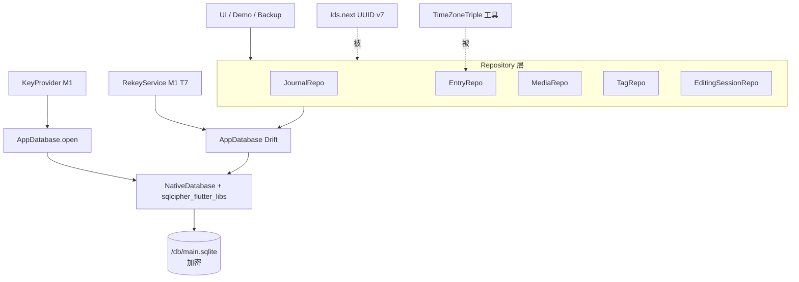

---
作者：@Ray
创建日期：2026-05-23
最后更新：2026-05-23
文档状态：草稿
---

# 设计：data-layer

## 技术决策

### D1 · ORM 选型 - Drift
- **背景：** 招牌功能（游标分页、往年今日、标签 join）全是关系型查询；需要类型安全 + migration 机制；远期可与 PowerSync 对接。
- **选项：** Drift / Floor / sqflite 原生 / Isar / Hive。
- **选择：** Drift（已在 v6 第 3 节定稿）。
- **理由：** 类型安全 + Dart 风格查询 API + 迁移机制完善 + 与 SQLCipher 集成成熟（`sqlcipher_flutter_libs`）+ 远期与 PowerSync 配合可平滑同步。
- **代价：** 引入 codegen（build_runner），首次构建慢。

### D2 · SQLCipher 集成方式
- **背景：** 需以 KeyProvider 提供的密钥打开加密数据库。
- **选项：** Drift `NativeDatabase` + `sqlcipher_flutter_libs` / 自实现 platform channel。
- **选择：** `sqlcipher_flutter_libs` + Drift `NativeDatabase.opened(...)`，开库时调用 `PRAGMA key`（或等价 `cipher_key`）注入密钥。
- **理由：** 官方推荐路径；对 Drift 几乎透明。
- **代价：** 需要在 iOS / Android 各自打包正确的原生 lib（Pod / NDK 配置）；T1 解决。

### D3 · 密钥获取流程
- **背景：** db 打开瞬间需要明文密钥；KeyProvider 提供之（M1）。
- **选项：** db 句柄持久持有密钥 / 每次打开重新取 / 用 OnceLock。
- **选择：** db 实例化时从 `KeyProvider.getAppDbKey()` 取一次，注入 SQLCipher；密钥变量随 `_open` 结束作用域而失效。
- **理由：** 简单可控；密钥不被多处保留。
- **代价：** 主密码模式下，密钥派生耗时（Argon2）会阻塞首次打开——需在 UI 上显示「解锁中」（UI 由后续 spec 接入）。

### D4 · UUID v7 实现
- **背景：** 需要时间有序的 UUID；Dart 生态目前活跃 v7 实现少。
- **选项：** 引入活跃维护的包（如 `uuid` 包的 v7 实现）/ 自实现。
- **选择：** 优先用 `uuid` 包的 v7（若该包版本支持）；不支持时按 RFC draft 自实现（核心 48-bit ms 时间戳 + 12-bit rand + 62-bit rand）。
- **理由：** RFC draft 已稳定；自实现可控。
- **代价：** 自实现要补 CSPRNG 与位拼接的单测。

### D5 · 时区三件套写入封装
- **背景：** v6 明确「编辑 entry_dt_utc 或 entry_tz 时 local_year/month/day 必须重算」。
- **选项：** 在 EntryRepo 的 insert/update 入口统一计算 / 让调用方自己算。
- **选择：** EntryRepo 入口统一封装：入参为 `entry_dt_utc` + `entry_tz` 时自动算出三冗余字段，写入；调用方拿不到「跳过三字段」的入口。
- **理由：** 让正确的事自然发生；不留可错的口子。
- **代价：** EntryRepo API 设计需小心，所有 update 路径都过封装；性能影响微（一次时区换算）。

### D6 · Repository 边界与组织
- **背景：** v6 第 3.1 节末段定调「所有数据库操作集中封装在 Repository 层，页面代码只调用 `repo.onThisDay(5, 23)` 这样的方法」。
- **选项：** 单大 Repo / 按聚合根分多 Repo / DAO + Repo 双层。
- **选择：** 按聚合根分：`JournalRepo`、`EntryRepo`、`MediaRepo`（仅元数据）、`TagRepo`、`EditingSessionRepo`。Drift DAO 作为内部实现，不向上暴露。
- **理由：** 单大 Repo 维护成本高；DAO + Repo 双层在本期是过度抽象；按聚合根足够清晰。
- **代价：** 跨表查询（如「entry + 关联媒体 + 关联标签」）需要在某个 Repo 内做组合查询；让 EntryRepo 承担。

### D7 · 软删除统一封装
- **背景：** 所有删除走 `deleted_at`；查询默认过滤；备份合并时需要 hardDelete。
- **选项：** 全表手动 where deleted_at IS NULL / Drift 自定义 `SoftDeletableTable` mixin / View。
- **选择：** Repository 层公共方法（如 `EntryRepo.softDelete(id)`、`hardDelete(id)`），内部直接 Drift 操作；查询入口默认过滤 deleted_at。
- **理由：** mixin 在 Drift 中较繁琐；View 影响 migration；公共方法简单可控。
- **代价：** 每个 Repo 重复实现 softDelete / hardDelete；可接受。

### D8 · FTS5 虚拟表占位（不接 ICU）
- **背景：** v6 第 5 节末段明确「默认 tokenizer 对中文几乎不可用」；真做搜索时改用 ICU/trigram，归远期。
- **选项：** 本期建表 / 不建表 / 建表并接 ICU。
- **选择：** 本期**建 entries_fts 虚拟表，使用默认 tokenizer**；不接 ICU；Repository 不暴露 FTS 查询 API（避免误用）。
- **理由：** 让 backup / restore 路径里 schema_version 稳定；中文搜索能力归远期 spec。
- **代价：** 虚拟表占少量空间；可接受。

### D9 · Migration 框架占位
- **背景：** schema_version=1 起步；本期不需要实际迁移，但框架要起。
- **选项：** 不设 migration / 设空 migration / 完整版本路由。
- **选择：** 启用 Drift `MigrationStrategy`，`onCreate` 用 Drift 默认建所有表，`onUpgrade` 为空实现（带 TODO 注释）。
- **理由：** 后续加 schema 时直接补 case，不需要回头改框架。
- **代价：** 几行代码；无代价。

### D10 · key-management rekey 桩接入
- **背景：** M1 T7 留了 stub，本期对接。
- **选项：** db 暴露 `rekey(newKey)` / 让 RekeyService 直接持 db 句柄。
- **选择：** `AppDatabase.rekey(Uint8List newKey) async`：调 `PRAGMA rekey`；RekeyService 通过 ServiceLocator / 入参拿到 db 句柄。
- **理由：** db 实例集中管理；rekey 入口在 db 层最合理。
- **代价：** 引入对 db 单例的依赖；可接受。

### D11 · 静态资源管理选型决策
- **背景：** 避免字符串硬编码，规范化资源目录。
- **选择：** 使用 `flutter_gen` 自动生成资产引用类，物理目录统一按 `assets/images/`, `assets/icons/`, `assets/fonts/` 组织。
- **理由：** `flutter_gen` 与 `build_runner` 集成好，无需引入额外工作流。
- **代价：** 需要配置 `flutter_gen.yaml` 并运行代码生成。

## 架构

## 文件变更

- `pubspec.yaml`                                    修改（添加 drift、drift_flutter、sqlcipher_flutter_libs、uuid、timezone、build_runner、drift_dev）
- `lib/data/database.dart`                          新建（AppDatabase + 表 + DAO）
- `lib/data/tables/journals.dart`                   新建
- `lib/data/tables/entries.dart`                    新建
- `lib/data/tables/media.dart`                      新建
- `lib/data/tables/tags.dart`                       新建
- `lib/data/tables/entry_tags.dart`                 新建
- `lib/data/tables/editing_session.dart`            新建
- `lib/data/ids.dart`                               新建（UUID v7）
- `lib/data/time_zone_triple.dart`                  新建
- `lib/data/repositories/journal_repo.dart`         新建
- `lib/data/repositories/entry_repo.dart`           新建
- `lib/data/repositories/media_repo.dart`           新建
- `lib/data/repositories/tag_repo.dart`             新建
- `lib/data/repositories/editing_session_repo.dart` 新建
- `lib/data/demo.dart`                              新建（Debug Home demo）
- `lib/demo/demo_entry.dart`                        修改（追加注册）
- `lib/security/rekey_service.dart`                 修改（补 stub）
- `test/data/`                                      新建（测试目录）

## 已知风险

- **build_runner 首次构建慢**：开发者第一次跑可能等数分钟，文档化即可。
- **SQLCipher 链接失败**：iOS Pod 或 Android NDK ABI 缺失会导致打开 db 时崩溃；T3 做最小冒烟测试。
- **UUID v7 自实现风险**：若选择自实现，需 RFC 测试向量覆盖；优先用维护包。
- **时区数据**：`timezone` 包需要在 main 中初始化时区数据库；T5 处理初始化。
- **FTS5 虚拟表与 migration**：现阶段建表无成本；远期接 ICU 时若改 tokenizer，需走 migration 重建。
- **NF3 性能基线**：仅在中端真机上验证；CI / 模拟器不强求。
