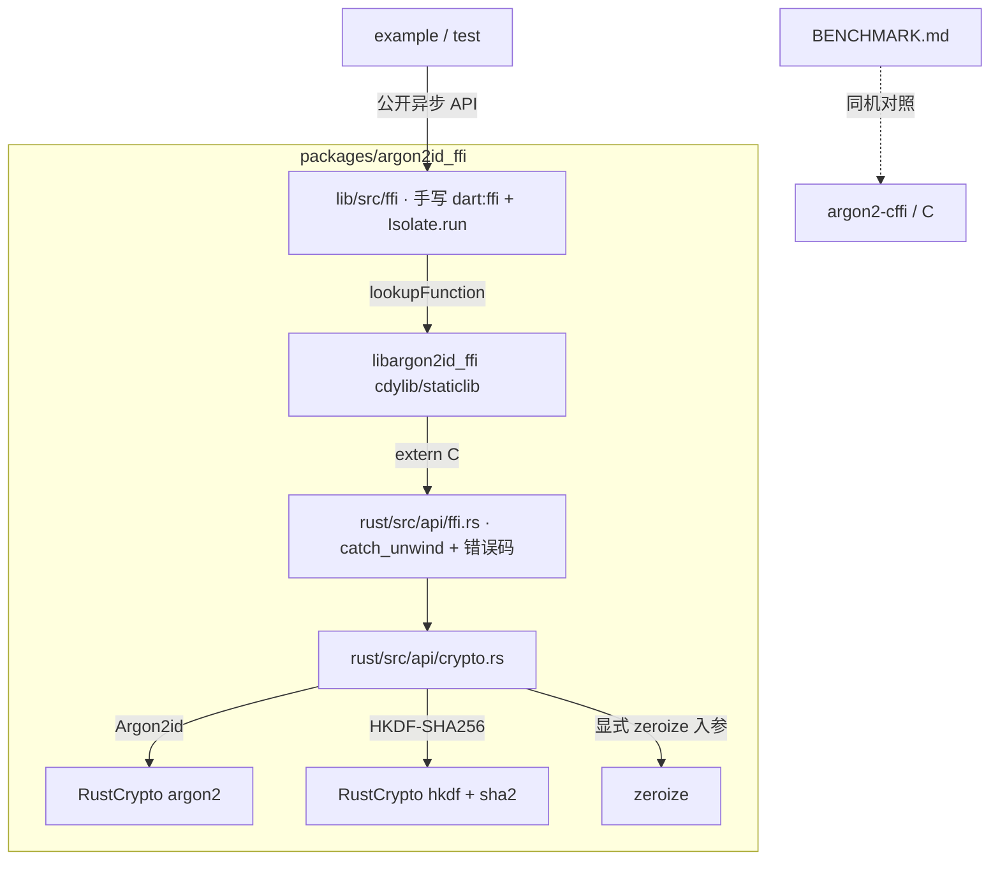

---
作者：@Ray
创建日期：2026-05-30
最后更新：2026-05-30
文档状态：草稿
---

# 设计：argon2id_ffi（自研 Argon2id / HKDF 库）

> **定位**：生产可用、可发布到 pub 的最小 native KDF 库——RustCrypto(argon2/hkdf) +
> `extern "C"` C-ABI + 手写 `dart:ffi`（`Isolate.run` 异步），cargokit 做 iOS/Android 交叉编译，
> 不引入 flutter_rust_bridge。验证：Rust `cargo test` 7/7、Dart ffi 端到端 6/6、`flutter analyze` 干净。
> **不替换 DayZ 生产路径**（不删 dargon2、不碰 `lib/security/`、不动 `ios/Podfile`）——
> 待真机 release 闸门（符号留存/耗时）通过再议（见 D6 / verification）。

## 方案选型：为什么自研 Rust 库

DayZ 需要在 iOS+Android 上跑 Argon2id（主密码 KDF）。备选与取舍：

| 方案 | 评价 |
|---|---|
| 纯 Dart argon2（`argon2`/`cryptography`） | 移动端慢到秒级，违反 NF1，排除 |
| `dargon2_flutter`（C FFI，现状） | 快，但 ~2 年失维 + iOS 插件漏 `ffiPlugin:true` 致符号剥离、需 Podfile hack 兜底 |
| fork dargon2 修 `ffiPlugin:true` | 最省，但维护死库、不可发布——DayZ 若只想最快修生产，可走此路（另起 spec） |
| 复用 sqlcipher 自带 crypto | 不可行：SQLCipher 只有 PBKDF2、无 Argon2、不暴露通用 KDF |
| **自研 Rust（argon2/hkdf）+ 手写 dart:ffi（本 spec）** | RustCrypto 活跃可信；手写 ffi 依赖面最小、可发布；性能/体积/正确性均已实测达标 |

**结论**：自研一个最小、可发布的 native Argon2id/HKDF 库，既满足 DayZ 自身需求，也填补 pub 生态
（现有 argon2 库非慢即失维）。桥接不用 FRB——见 D2。

## 技术决策

### D1 · 本地 FFI 插件包结构
- **选择**：标准 Flutter FFI 插件包（cargokit 交叉编译接线），落在 `packages/argon2id_ffi`，
  主工程如需以 `path` 依赖；面向独立发布到 pub。
- **理由**：插件模板自带 android/ios cargokit 接线（T4/T5 最难的部分），与业务解耦、可独立回归与发布。
- **代价**：维护独立 Cargo 工具链。

### D2 · 桥接方式：手写 dart:ffi（cargokit 做交叉编译）
- **选项**：`flutter_rust_bridge`(FRB) / 手写 `dart:ffi`。
- **选择**：**手写 `dart:ffi`**。本库只暴露 2 个函数（argon2id + hkdf），FRB 的自动序列化 /
  isolate 池 / codegen 对其是重型过度工程，且会引入 tokio/allo-isolate 整条依赖树、绑定单一
  维护者的 codegen 节奏——与"最小依赖、可发布"目标相悖。手写后依赖面：**87 crate（无 FRB/tokio）、
  host cdylib 0.32MB、导出符号仅 2**。
- **构成**：① `rust/src/api/ffi.rs` 把 `crypto.rs` 纯函数包成 `#[no_mangle] extern "C"` C-ABI；
  ② Dart 侧 `lib/src/ffi/`（bindings/errors + 异步 API），重活用 `Isolate.run` 丢到一次性子 isolate；
  ③ **cargokit** 做 iOS/Android 交叉编译（不依赖 FRB）。
- **符号解析按平台分流**（`bindings.dart` 的 `resolveFns()`，关键）：
  * **iOS/macOS**：Rust 静态链接进 app 主二进制，运行期 `dlsym` 按名查找在 release/archive 下会因
    符号被 strip 失败（已实测：`flutter build ios --release` 二进制动态导出表无该符号）→ 用
    **`@Native(symbol:)`**（编译期静态引用，保留符号且不按名查找，抗 strip；已验证 macOS profile/AOT)。
  * **Android/Linux/Windows**：native 是独立动态库(`.so`/`.dll`)，导出符号 release strip 后仍在 →
    `DynamicLibrary.open + lookupFunction`（Android `@Native` 会回退进程查找，而 `.so` 是 RTLD_LOCAL
    载入、符号不在进程全局，找不到——故 Android **不能**用 @Native；已实测 Android profile/AOT 跑通）。
  * **绝不给 Argon2 标 `isLeaf`**（会冻结 GC）。
- **异步**：`Isolate.run` 内 `resolveFns()` + 调用 + marshalling + free。
- **cargokit gradle 兼容**：新版 Gradle(8/9) 移除了 `Project.exec(Closure)`，已把 cargokit 的
  `cargokit/gradle/plugin.gradle` 改用注入的 `ExecOperations`（这是本包对 vendored cargokit 的唯一改动）。
- **代价**：marshaling（ptr+len）/ 异步 / C-ABI 内存归属 / panic 处理需**手写并自验**。
  设备侧（iOS 静态符号解析、Android `.so` 打包、并发 OOM）需真机验。

### D3 · RustCrypto crate 选型（argon2 / hkdf / sha2 / zeroize）
- **选择**：RustCrypto 官方 `argon2`(0.5.3, `default-features=false, features=["alloc","zeroize"]`) /
  `hkdf`(0.12.4) / `sha2`(0.10.9) / `zeroize`(1.8.2)。
- **理由**：RustCrypto 权威、活跃、经审计；`argon2` 的 `zeroize` feature 擦内部块；关掉
  `password-hash`(PHC/base64) 压体积。
- **性能定位（修正，勿当卖点）**：`argon2` 是 ref.c 的纯 Rust 翻译、**无 SIMD**（优化 issue #104 长期未合并）。
  在 **x86** 上慢于带 AVX 的 C；但在 **ARM**（我们的真实目标）上 P-H-C 的 SIMD 不适用、退回标量，
  RustCrypto 拿到 LLVM NEON 自动向量化，**同机实测反而快 ~1.29×**（见 `BENCHMARK.md`）。选它是因
  **审计可信 + zeroize + 维护活跃**，性能"达标即可"而非提升。

### D4 · C-ABI 错误码契约
- **签名**（`rust/src/api/ffi.rs`，`#[no_mangle] extern "C"`，返回 `i32` 错误码）：
  `argon2id_ffi_derive(pwd_ptr,pwd_len, salt_ptr,salt_len, m,t,p, out_ptr,out_len) -> i32`、
  `hkdf_sha256_ffi_derive(ikm_ptr,ikm_len, salt_ptr,salt_len, info_ptr,info_len, out_ptr,out_len) -> i32`。
- **内存归属**：**调用方(Dart)分配 `out` 缓冲（`out_len` 字节）、传 ptr+len，Rust 只写入不分配/不释放**
  → 零跨分配器 free（dlmalloc vs system allocator 不匹配是 FFI 经典 UB 源），无需 free 回调。入参
  `*const u8` Rust 只读借用、不取所有权；password/ikm 由 `crypto.rs` 收 `Vec` 后内部 zeroize。
- **错误码**：0=OK；-1 空指针；-2 长度非法；-3 参数非法（crypto.rs 的 `Err` 折叠，字符串不过 FFI）；
  -4 内部；-100 panic。Dart `errors.dart` 映射成 `Argon2idFfiException`。
- **panic 红线**：每个 `extern "C"` 包装整体 `std::panic::catch_unwind`，panic 转 -100，**绝不跨 FFI 边界**（UB）。
  故发布 profile **必须保留 `panic="unwind"`**；`release-min`(panic=abort) 仅供体积测量、禁止发布。
- **salt 三态**（hkdf）：`salt_ptr==null && salt_len==0` → None；`!=null && >0` → Some；其余非法。

### D5 · 自研包 vs vendored 三件套纪律的边界
- **背景**：`packages/` 既有 vendored fork（appflowy-editor，走 DAYZ-PATCH 三件套 + `check_patches.sh`）。
- **选择**：`argon2id_ffi` 是**全新自研、无 upstream**，故：
  1. **不适用** DAYZ-PATCH 成对标记与 `check_patches.sh` 对账（该脚本只治 fork 漂移，`SCAN_DIR`
     硬编码 `packages/appflowy-editor/lib`，本包不在其扫描内、也无需进入）。
  2. **适用** AGENTS.md「独立 git commit」纪律：本包（Rust 源 / Cargo.toml / Cargo.lock / 生成的
     Dart 绑定 / pubspec / CHANGELOG）作为**独立 commit**，不与 `lib/` 业务混提。
  3. `packages/CHANGELOG.md` 为自研包**另起一节**（区别于「Patch 台账」），避免污染 `check_patches.sh` 语义。
- **无 codegen 产物**：手写 `dart:ffi` 绑定即普通源码（`lib/src/ffi/**`），无生成物、无 drift 风险。
  `pub get` 不触发 native build，native 仅 `flutter build` 时编译——故纯 Dart `analyze` 不需 Rust 工具链；
  发布前应配预编译二进制（GitHub Releases），让消费者也不必装 Rust。

### D6 · DayZ 生产接入（已落地 2026-05-30）
- **已做**：`lib/security/argon2_kdf.dart` 后端切到 argon2id_ffi（接口不变）；主 `pubspec` 移除
  `dargon2_flutter`；`ios/Podfile` 删除 force-load hack；删 `argon2_probe.dart`；key-management D2→D2'。
- **安全性**：底层同算法/version/参数 → 派生密钥逐字节相同（Argon2Kdf KAT 守护），无 rekey 风险。
- **验证**：Argon2Kdf KAT 6/6；iOS 模拟器(debug) + Android profile/AOT 真实 app 跑通；macOS profile/AOT
  作 iOS @Native 抗 strip 的强代理。**唯一待补**：iOS 真机 archive/TestFlight 符号留存最终确认。

---

## 架构

---

## 文件变更（白名单上界；可改文件 MUST ⊆ 本清单）

> 本里程碑**不触碰**主工程 `lib/security/`、`ios/Podfile`（归 key-management，保留对照组）。

- `packages/argon2id_ffi/`（整包，Flutter FFI 插件 + cargokit）  [NEW]
  - `pubspec.yaml` / `pubspec.lock`  [NEW] 本地包声明（依赖 `ffi`）
  - `rust/Cargo.toml` / `rust/Cargo.lock`  [NEW] crate + 依赖 + release/release-min profile + `[[bench]]`
  - `rust/src/lib.rs` / `rust/src/api/mod.rs`  [NEW] 模块挂载（crypto + ffi）
  - `rust/src/api/crypto.rs`  [NEW] 纯算法：Argon2id + HKDF + 显式 zeroize + `#[cfg(test)]` KAT/RFC 测试
  - `rust/src/api/ffi.rs`  [NEW] `extern "C"` C-ABI：catch_unwind + 错误码 + `#[used]` 锚点
  - `rust/benches/kdf_bench.rs`  [NEW] criterion 基准
  - `rust/examples/timing.rs`  [NEW] N 次取中位计时（与 C 侧配对）
  - `lib/argon2id_ffi.dart` + `lib/src/ffi/{bindings,errors,crypto_ffi}.dart`  [NEW] 手写 dart:ffi 绑定 + 异步 API
  - `android/` / `ios/`（cargokit 接线：`ios/argon2id_ffi.podspec` 的 `-force_load` + `script_phase` + `ios/Classes/dummy_file.c`）  [NEW]
  - `test/crypto_ffi_test.dart`  [NEW] 手写 ffi 端到端测试
  - `example/`（`example/lib/main.dart` Argon2id demo + `example/integration_test/` 真机验证）  [NEW]
  - `scripts/bench_compare.py`  [NEW] C 侧（argon2-cffi）对照基准
  - `BENCHMARK.md` / `README.md` / `LICENSE`(MIT) / `CHANGELOG.md`  [NEW] 发布与对比文档
- `packages/CHANGELOG.md`  修改（自研包新起一节，见 D5）

---

## 已知风险

- **设备级闸门（host 验不了）**：iOS release/archive/TestFlight 符号剥离（靠 podspec `-force_load`
  + Rust `#[used]` 防住，但**必须真机 archive 实测**）；Android `.so` 打包（`extractNativeLibs`）；
  Argon2 64MiB × 并发 isolate 的 RSS 峰值 OOM（建议并发限 2）。详见 verification 兼容性专项。
- **手写 ffi 自担风险**：panic 跨 C-ABI 是 UB——靠 `catch_unwind` 收口（发布禁 `panic=abort`）；
  内存归属"调用方分配 out、Rust 只写"，越界/泄漏靠单测 + finally free 守。
- **pre-1.0 crate**：argon2 0.5.x / hkdf 0.12.x 小版本可能带破坏性变更——已有 RFC/KAT 测试守护回归。
- **消费者工具链**：当前 `flutter build` 需 rustup（cargokit 现编 Rust）；发布前应配预编译二进制。
- **R4 非端到端**：见 requirement R4；Dart 侧 `Uint8List` 擦不到，不承诺端到端。
- **iOS 模拟器 universal**：需 `aarch64-apple-ios-sim` + `x86_64-apple-ios` 合 lipo（cargokit 处理）。
