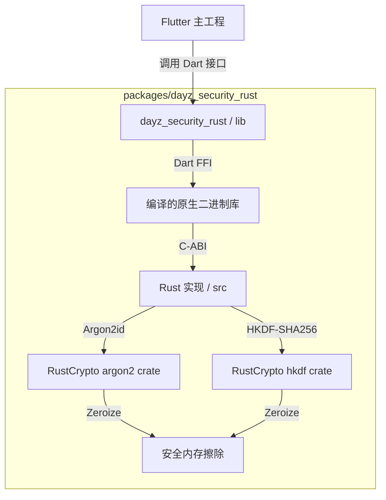

---
作者：@Ray
创建日期：2026-05-30
最后更新：2026-05-30
文档状态：草稿
---

# 设计：dayz-security-rust

## 技术决策

### D1 · 本地 Package 设计与集成方案
- **背景：** 我们需要在一个独立的模块中管理 Rust 代码、Cargo 依赖以及生成的 Dart 绑定代码，防止其干扰主工程的纯 Dart 结构。
- **选择：** 在 `packages/dayz_security_rust` 创建一个本地 Package。主工程通过 `path: packages/dayz_security_rust` 依赖它。
- **理由：** 
  * 与业务代码完全解耦，方便作为独立的包进行维护、升级和回归测试。
  * 符合 `AGENTS.md` 对本地 Package 修改的独立 Commit 规范。
- **代价：** 
  * 需要维护一套独立的 `pubspec.yaml` 和 Cargo 构建工具链。

### D2 · FFI 桥接工具选型：flutter_rust_bridge (FRB) v2
- **背景：** 手写 Dart FFI bindings（`dart:ffi`）对于复杂的 `Uint8List` 传递和内存管理需要大量繁琐且容易出错的指针开销。
- **选项：** 手写 C-ABI FFI 接口 / 使用 `flutter_rust_bridge` v2。
- **选择：** 使用 `flutter_rust_bridge` v2。
- **理由：** 
  * FRB v2 是目前社区最成熟的 Flutter-Rust 桥接框架，能全自动处理 `Vec<u8>` 到 `Uint8List` 的内存通道映射。
  * FRB v2 极大地简化了 iOS/Android 的链接配置，减少了手动配置 Xcode Build Settings 的工作量，且完美解决符号剥离（Xcode 会将 Rust 静态库作为一个整体进行强链接）。
- **代价：** 
  * 引入了 codegen 代码生成步骤，每次修改 Rust 接口后需要运行 `flutter_rust_bridge_codegen` 生成胶水代码。
  * 依赖 FRB v2 的 Dart 和 Rust 库版本同步。

### D3 · Rust 密码学库选型（argon2 & hkdf & zeroize）
- **背景：** Rust 侧需要选择高性能、安全且易于做内存擦除的密码学组件。
- **选项：** 
  * 密码哈希：RustCrypto 官方维护的 `argon2` crate。
  * 密钥扩展：RustCrypto 官方维护的 `hkdf` 和 `sha2` crate。
  * 内存清理：`zeroize` crate。
- **选择：** 全部选择 RustCrypto 官方 crate。
- **理由：**
  * RustCrypto 是 Rust 社区最权威、活跃的密码学组织，库质量经过多次安全审计。
  * `argon2` 默认支持 `zeroize` 功能，能在计算结束后自动对内存中敏感的运算缓冲区进行重写填零（符合 R4/NF1 需求）。

---

## 架构

---

## 文件变更

- `pubspec.yaml`                               修改（添加对本地包 `dayz_security_rust` 的依赖）
- `pubspec.lock`                               修改（锁定版本）
- `packages/`                                  [NEW] 新建 `dayz_security_rust` 目录
- `packages/dayz_security_rust/pubspec.yaml`   [NEW] 新建本地包配置文件
- `packages/dayz_security_rust/Cargo.toml`     [NEW] 新建 Rust Cargo 依赖文件
- `packages/dayz_security_rust/rust/`          [NEW] 新建 Rust 代码目录（包含 src/api.rs 等）
- `packages/dayz_security_rust/lib/`           [NEW] 新建 Dart 绑定生成的代码目录
- `packages/CHANGELOG.md`                      修改（登记本地 Package 变更台账）

---

## 已知风险

- **环境搭建成本**：团队中未安装 Rust 工具链的开发机需要首先运行 `rustup` 安装环境，否则无法修改 Rust 代码或重新跑 codegen。由于该库平时为编译好的静态产物，普通运行不受影响，但依然构成了环境依赖。
- **iOS 模拟器架构支持**：FRB 需要确保交叉编译出支持 iOS Simulator（`x86_64` 和 `aarch64`）的脂胖静态库（Universal static library），否则在 Intel/Apple Silicon 混合环境的模拟器中会报错。我们将在 tasks 任务中通过脚本自动化处理此流程。
