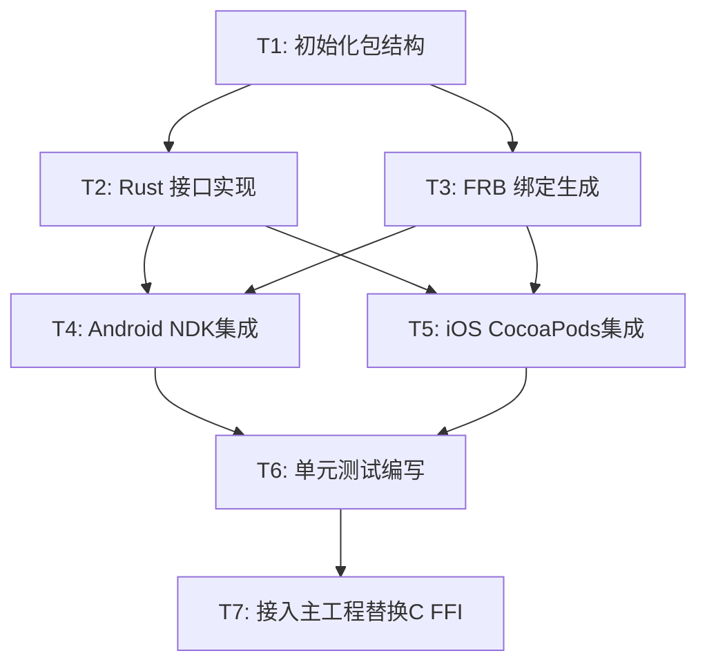

---
作者：@Ray
创建日期：2026-05-30
最后更新：2026-05-30
文档状态：草稿
---

# 任务列表：dayz-security-rust

## 任务依赖图



-----

- [ ] T1 · 初始化 dayz_security_rust 本地包结构与 Cargo 依赖

**同 spec 依赖：** 无 ｜ **跨 spec 依赖：** 无 ｜ **关联需求：** R1, R2 ｜ **依据设计：** D1 ｜ **可改文件：** `packages/dayz_security_rust/pubspec.yaml`, `packages/dayz_security_rust/Cargo.toml`, `packages/CHANGELOG.md`

### 背景
创建本地包 `packages/dayz_security_rust`，并在其中配置好 Rust Cargo 项目及核心依赖。

### 实施
1. 创建目录 `packages/dayz_security_rust`。
2. 编写 `pubspec.yaml` 声明本地包，依赖 `flutter_rust_bridge: ^2.0.0`。
3. 创建 `Cargo.toml`，配置 `[dependencies]` 引入 `argon2`、`hkdf`、`sha2`、`zeroize` 与 `flutter_rust_bridge`。
4. 在 `packages/CHANGELOG.md` 中增加变更台账记录。

### 验收标准
- 本地包 `pubspec.yaml` 存在且格式正确（自动）
- Cargo.toml 依赖解析正常且编译配置正确（自动）

### 验收方式
- 自动：
  ```bash
  cd packages/dayz_security_rust && flutter pub get && cargo check
  ```

---

- [ ] T2 · 实现 Rust 侧密码学接口 (api.rs)

**同 spec 依赖：** T1 ｜ **跨 spec 依赖：** 无 ｜ **关联需求：** R1, R2, R4 ｜ **依据设计：** D3, D4 ｜ **可改文件：** `packages/dayz_security_rust/rust/src/api.rs`

### 背景
在 Rust 侧实现核心的哈希和密钥派生接口，提供安全的内存清理支持。

### 实施
1. 在 `packages/dayz_security_rust/rust/src/api.rs` 暴露：
   * `pub fn argon2id_derive_key(password: Vec<u8>, salt: Vec<u8>, m_cost: u32, t_cost: u32, parallelism: u32, output_len: u32) -> Result<Vec<u8>, String>`
   * `pub fn hkdf_sha256_derive_key(ikm: Vec<u8>, salt: Option<Vec<u8>>, info: Vec<u8>, output_len: u32) -> Result<Vec<u8>, String>`
2. 内部使用 RustCrypto 库进行算法计算，并通过 `zeroize` 对敏感的 password/ikm 内存进行主动清除。

### 验收标准
- Rust 接口编译成功无警告（自动）

### 验收方式
- 自动：
  ```bash
  cd packages/dayz_security_rust/rust && cargo check
  ```

---

- [ ] T3 · 运行 flutter_rust_bridge_codegen 生成 Dart 绑定

**同 spec 依赖：** T2 ｜ **跨 spec 依赖：** 无 ｜ **关联需求：** R1, R2 ｜ **依据设计：** D2 ｜ **可改文件：** `packages/dayz_security_rust/lib/`（生成文件）

### 背景
运行 FRB 代码生成器，产生 Dart 端的胶水绑定文件。

### 实施
1. 全局或本地安装 `flutter_rust_bridge_codegen`。
2. 运行 `flutter_rust_bridge_codegen generate` 产生 Dart 胶水绑定层。

### 验收标准
- Dart 胶水文件成功生成，包含 `argon2idDeriveKey` 等绑定接口（自动）

### 验收方式
- 自动：
  ```bash
  test -f packages/dayz_security_rust/lib/src/rust/api.dart
  ```

---

- [ ] T4 · 配置 Android NDK 与 Gradle 编译集成

**同 spec 依赖：** T3 ｜ **跨 spec 依赖：** 无 ｜ **关联需求：** R3 ｜ **依据设计：** D2 ｜ **可改文件：** `packages/dayz_security_rust/android/build.gradle`

### 背景
配置 Android 端构建链，使其能在执行 `flutter build` 时自动交叉编译 Rust 代码。

### 实施
1. 配置 `packages/dayz_security_rust/android/build.gradle`，引入 `cargo-ndk` 编译支持。
2. 确保在 Android 构建时能自动生成对应 ABI (arm64-v8a, armeabi-v7a, x86_64) 的 `.so`。

### 验收标准
- Android 端 native library 编译成功（自动）

### 验收方式
- 自动：
  ```bash
  flutter build apk --debug
  ```

---

- [ ] T5 · 配置 iOS Xcode 与 CocoaPods 编译集成

**同 spec 依赖：** T3 ｜ **跨 spec 依赖：** 无 ｜ **关联需求：** R3 ｜ **依据设计：** D2 ｜ **可改文件：** `packages/dayz_security_rust/ios/dayz_security_rust.podspec`, `packages/dayz_security_rust/ios/Classes/`

### 背景
配置 iOS 构建链，把 Rust 静态库正确注入 Cocoapods，解决符号剥离和架构链接问题。

### 实施
1. 配置 `dayz_security_rust.podspec`，在构建时自动通过 `cargo lipo` 或直接通过 rustup 编译 iOS 的 universal 静态二进制库，并配置其链接参数。

### 验收标准
- iOS 构建打通且链接无报错（自动）

### 验收方式
- 自动：
  ```bash
  flutter build ios --debug --no-codesign
  ```

---

- [ ] T6 · 编写单元测试与验证

**同 spec 依赖：** T4, T5 ｜ **跨 spec 依赖：** 无 ｜ **关联需求：** R1, R2, R4 ｜ **依据设计：** D3 ｜ **可改文件：** `packages/dayz_security_rust/test/dayz_security_rust_test.dart`

### 背景
测试我们的 Rust 算法绑定层。

### 实施
1. 编写 Dart 单元测试验证：
   * 传入已知 RFC 9106 测试向量，断言 Rust 返回的 Argon2id 派生密钥逐字节一致。
   * 测试 HKDF-SHA256 测试向量一致性。
   * 测试极常值及边界条件输入。

### 验收标准
- 单元测试全部通过（自动）

### 验收方式
- 自动：
  ```bash
  cd packages/dayz_security_rust && flutter test
  ```

---

- [ ] T7 · 接入主工程并替换 C FFI

**同 spec 依赖：** T6 ｜ **跨 spec 依赖：** 无 ｜ **关联需求：** R1, R2 ｜ **依据设计：** D1 ｜ **可改文件：** `pubspec.yaml`, `pubspec.lock`, `lib/security/argon2_kdf.dart`

### 背景
把我们的 C 语言的 `dargon2_flutter` 替换为自研的 `dayz_security_rust`，并在 Kdf 模块中完成接口重写。

### 实施
1. 修改主工程 `pubspec.yaml`：移除 `dargon2_flutter`，引入对 `dayz_security_rust` 的本地引用。
2. 重写 `lib/security/argon2_kdf.dart`，调用 `Argon2SecurityRust.argon2idDeriveKey(...)` 来实现 KDF 逻辑。
3. 清理 [ios/Podfile](file:///Users/xiaji/dev/DayZ/ios/Podfile) 中的 C FFI 临时修补，重新执行构建测试。
4. 执行打包体积与运行性能的实测对比，并将数据记录到最终的验证记录或 walkthrough.md 中。

### 验收标准
- 主工程编译和原 `key-management` 测试顺利跑通（自动）
- 完成自研 Rust 方案与原 C FFI 方案在包体积和运算耗时上的双向对比并留痕（人工）

### 验收方式
- 自动：
  ```bash
  flutter test test/security/
  ```
- 人工（核查人 @Ray）：
  - 验收记录中需要包含对比数据：原 C 方案 vs 新 Rust 方案的 APK/IPA 增量体积、相同参数下的中位数耗时。

### 验收记录
```
日期：—
自动：—
人工：—（核查人 @Ray）
```
