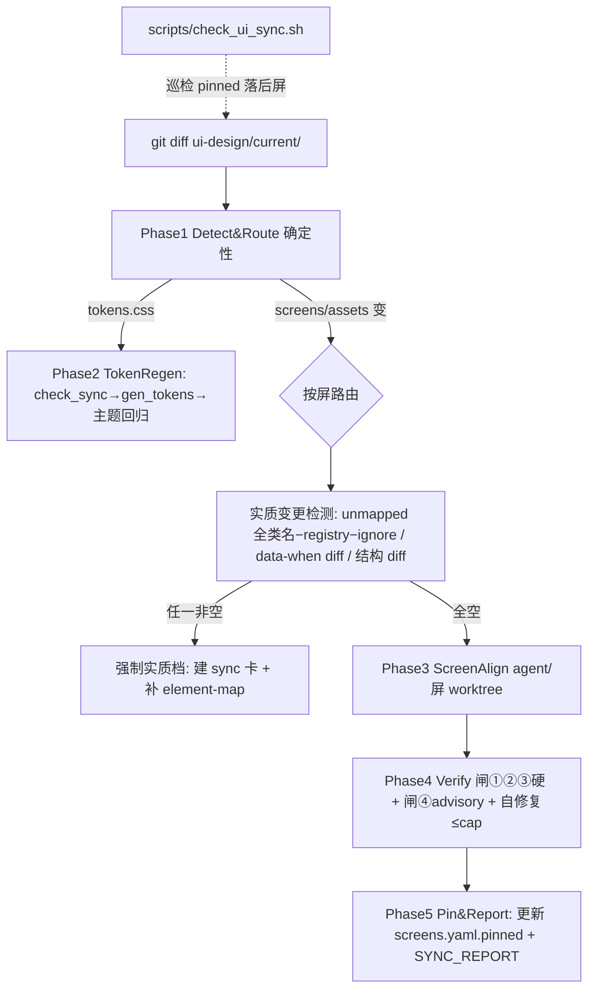

---
作者：@Ray
创建日期：2026-05-29
最后更新：2026-05-29
文档状态：草稿
---

# 设计：design-sync-automation

> 总纲：[`docs/design/10-ui-restore-and-design-sync.md`](../../../docs/design/10-ui-restore-and-design-sync.md) §4（四层闸）/§6（5 Phase + 路由表）/§7（生命周期）/§8（三档）/§9（spec 拆分）。本 spec 把其中的同步 SOP 工件化，并把 ③ 映射格式、Phase 4 退出逻辑等**实现级决策**钉死。

## 技术决策

### D1 · 还原 = 同步 = 同一「屏对齐工作流」
- **状态：** 采纳
- **背景：** 初次还原与迭代同步本质相同——把某屏 Flutter 驱动到与 HTML 源一致。
- **选择：** 单一「屏对齐工作流」，两种入口共用：还原（种子=空 widget，触发=手动）/ 同步（种子=已有 widget + diff，触发=`git diff` 非空）。
- **理由：** 避免两套逻辑漂移；同一验证四层闸、同一 `element-map`、同一 Phase 3–5。
- **代价：** 工作流需处理「空种子」与「增量种子」两条输入路径，分支少、可接受。

### D2 · 五 Phase 流水（确定性前置、agent 居中、确定性收尾）
- **状态：** 采纳
- **选择：**
  ```
  Phase 1 Detect&Route  确定性，无 agent —— 解析 git diff → 受影响屏/组件清单（R1）
  Phase 2 TokenRegen    确定性 —— check_tokens_sync → gen_tokens → 主题回归（R2）
  Phase 3 ScreenAlign   agent/屏，worktree 隔离 —— 读新HTML+§6+现widget → 改 widget
  Phase 4 Verify        四层闸 + 自修复循环（D6）
  Phase 5 Pin&Report    更新 screens.yaml.pinned + SYNC_REPORT.md
  ```
- **理由：** 把确定性的路由/生成/钉账与模糊的对齐/视觉隔开，最大化可复算面（NF2）。
- **代价：** Phase 3 并行改多屏需 worktree（doc 10：worktree 隔离避免并行文件冲突），有 setup 开销，仅在多屏受影响时付。

### D3 · 元素映射 + geometry 登记：per-screen `element-map.yaml`〔watch 1〕
- **状态：** 采纳
- **背景：** ③ 布局几何闸要把 HTML 类名 ↔ Flutter widget 对应起来比框；映射粒度是人工选定的维护面（DOM 与 widget 树不同构），属重 churn 数据。
- **选项：** (A) 塞进全局 `screens.yaml`；(B) per-screen `test/ui/<feature>/element-map.yaml`；(C) 散在测试代码里。
- **选择：** B。`screens.yaml` 只放轻量全局（`pinned`/`lane`/指针，D5）；映射这种随设计高频 churn 的重数据落各屏测试树。
- **schema（最小集）：**
  ```yaml
  # test/ui/timeline/element-map.yaml
  - class: ".entry"          # DESIGN-REF §3 稳定类名
    key:   "entryCard"       # Flutter widget key（Key('entryCard')）
    geometry: content        # fixed | content（必填）
    asserts: [order, contains, no-overflow]   # content 默认三项；fixed 追加 size, pos
  ```
- **理由：** churn 数据塞全局表会撑肿、与 `pinned` 这种轻量状态混在一起难维护；per-screen 与 param fixture/golden 同处一屏测试树，同生同灭。
- **代价：** 工作流需按屏读多份 yaml；但路由本就按屏，天然对齐。

### D4 · 「实质变更」的确定性检测器集〔watch 1 续〕
- **状态：** 采纳
- **背景：** §8 的实质变更触发含「未映射类 / 新 data-when / 结构重排」；若只给 unmapped 一个机制、其余靠判断，NF2「分流确定性」就站不住。且若 `extracted` 限在「§3 已登记类」，未登记的全新元素根本不进集合差、逃过检测。
- **选择：** 三个确定性检测器（对 `pinned..HEAD`，无 agent）：
  1. **未映射类** `unmapped = extracted − registry − ignore`：`extracted` = 源屏渲染 DOM **全部在场类名**（**非仅 §3**）；`registry` = `element-map.yaml` 已映射类；`ignore` = 显式装饰/wrapper 白名单；**缺 `geometry` 标签 ⊂ unmapped**。
  2. **新状态**：`data-when` 值集 diff 非空。
  3. **结构重排**：归一化 DOM 子序 diff 非空（粗粒度、宁过判——安全侧）。
  任一非空 → 强制「实质档」（建 sync 卡 + 补映射），不许闸③当「全过」。
- **理由：** 三种漏各有确定性检测器，NF2 才立得住；`extracted` 取全类名才能抓未登记新元素。`extracted`（检测，全类名）与验证扫描（闸②/③ 只对已映射类取 computed/rect）是同一遍 gstack 抽取的两个产物——未映射新元素无法验证、必须先触发实质档补映射。
- **代价：** `ignore` 白名单需维护（纯装饰类）；DOM 子序 diff 会过判某些无害重排，但安全侧、可接受。

### D5 · `screens.yaml` 全局轻量登记 + pinned-hash 巡检
- **状态：** 采纳
- **选择：** `screens.yaml` 每屏 `{id, pinned, lane, map}`。`pinned` = 该屏上次对齐的 `ui-design` commit，是工作流**输入锚**：增量 = `git diff <pinned>..HEAD -- pages/screens/<id>.html` + 参数清单重抽 diff。`scripts/check_ui_sync.sh` 反向巡检落后屏。
- **理由：** 把 doc 10 §8「hash 烂成死数字」的隐患解掉——hash 是工作流每次跑的活参数、有巡检脚本盯，不是文档摆设。
- **代价：** 需在每屏 v1 对齐时写入 `pinned`；由 Phase 5 自动维护。

### D6 · Phase 4 退出条件 + 轮次预算〔watch 2〕
- **状态：** 采纳
- **背景：** doc 10 §6 两级闸（①②③ 硬 / ④ advisory）+ 自修复循环需明确退出，否则被文本回流噪声逼到 cap、把真问题淹掉。
- **选择：**
  ```
  循环退出 ⟺ 闸①②③ 全绿 AND ( 闸④ 各区 SSIM ≥ 阈 OR 轮次 ≥ cap )
  cap = min(3, budget 允许轮数)        # 1 初翻 + 2 修复
  闸①②③ 红 + 轮次耗尽 → 该屏 build fail，SYNC_REPORT 标红，不自动合并
  闸④ 低分 + 轮次耗尽 → SYNC_REPORT 标红，advisory，不阻塞
  ```
- **护栏（必须，写进退出逻辑）：** 闸③ 对 `content-driven` 块只断 order/contains/no-overflow、**不断块高** → 合法的 minik 换行高度差永不触发 闸③ 失败、不烧修复轮。
- **理由：** ①②③ 是字段级确定性失败，agent 拿到精确断言（「borderRadius 期望 r-md=14 实得 12」）1–2 轮该收敛；3 轮不收敛多半是结构性问题，应升 ②/人工而非烧 token 空转。
- **代价：** cap 偏紧可能让个别本可第 4 轮收敛的屏升 ②；但「3 轮不收敛=结构性」的先验成立率高，且升 ② 不丢工作（进 sync 卡），可接受。

### D7 · 期一 / 期二切分
- **状态：** 采纳
- **选择：** 期一交付确定性骨架（Phase 1 路由、Phase 2 token 集成、`screens.yaml`、`check_ui_sync.sh`、维护态泳道/三档规则）+ D3/D4/D6 的**设计定稿**；期二（实现）随首个页面级 spec + `ui-shell-navigation` 落地——因为 Phase 3/4 须有可对齐的真 widget 与 `element-map` 内容才能跑通。
- **理由：** 期一不依赖任何屏存在，可与 `design-tokens-theme` 并行先行；期二的 harness 没有 widget 就无对象，强行先写是空壳。
- **代价：** 本 spec 跨两期、生命周期较长；用 tasks 的期一/期二标注 + README 状态管理。

### D8 · 维护态泳道 = override 通用「终态→归档」不变式（落 DayZ-own，不碰 vendored spec-kit）
- **状态：** 采纳（修订：spec-kit 是 vendored-from-railkit，本地改会被同步冲掉）
- **背景：** 通用源 `spec-kit/spec-guide.md` 把「已完成=终态→归档」写成不变式；「已交付·随设计维护」**故意违反**它——是 override 一条通用不变式。**但自查发现 `spec-kit/` 从上游 railkit（`cr1992/railkit`）vendored/同步**（README:48/57 + commit「同步 railkit」）→ 直接改本地 `spec-kit/spec-guide.md` 会被下次同步覆盖。
- **选择（修订）：** override 只落 **DayZ-own、不被 railkit 同步冲**的文件：
  1. `docs/spec-guide-ai.md`（overlay，DayZ-own）：定义「已交付·随设计维护」泳道，措辞「**override 终态→归档（限屏幕 spec）**」+ 指向通用源不变式；落三档分流（R7）+ 视觉验收默认修订（视觉项默认走 闸①②③ 确定性 + 闸④ golden/SSIM 自动验、人工仅标红终审不阻塞；禁止假 grep 不变）。
  2. `AGENTS.md`（DayZ「唯一规范源」、非 vendored）：加一行指针「屏幕 spec 终态→归档被 overlay override，见 `docs/spec-guide-ai.md`」——DayZ 读者按 CLAUDE.md 以 AGENTS.md 为规范源，这条指针化解静默分叉（而非靠改 vendored 副本）。
  3. `specs/README.md`：加该泳道分区。
  - **MUST NOT 改 `spec-kit/spec-guide.md`**（vendored，会被冲）。
- **上游（可选，@Ray 定）：** 若要把「项目可 override 终态」做成共享能力，extension hook 应加到 **railkit canonical 上游**（`cr1992/railkit` 的 spec-guide.md），惠及所有消费方——独立仓动作，不在本仓做。
- **代价：** override 是 DayZ-own 局部约定，vendored 通用源仍按原不变式；但 DayZ 读者经 AGENTS.md 指针被正确导向、不静默错。

### D9 · 工作流形态：确定性逻辑落 Dart CLI，design-sync.js 仅薄编排
- **状态：** 采纳（修订：Workflow 沙箱无 fs/Node/子进程，确定性逻辑不能住在 .js 里）
- **背景：** Workflow 脚本沙箱「No filesystem or Node.js API access」——`design-sync.js` 跑不了 `git diff` / `check_tokens_sync.sh` / `gen_tokens.dart` / gstack（无子进程、读不了文件）。IO 只能由带 Bash 的 agent 做。
- **选择：** 确定性逻辑（Phase 1 路由 / R5 三检测器 / cap / 巡检解析）住 **`bin/sync/*.dart`**（CLI，`flutter test` 可测、与 `gen_tokens.dart` 同套路）；`design-sync.js` 退成**薄编排层**——`agent()`（带 Bash）调这些 Dart CLI + 跑 `*.sh`/gstack + 纯控制流（fan-out / 自修复循环 / worktree）。Phase 3 `agent()` per 屏（`isolation:'worktree'`）；Phase 4 闸②/闸③ 走 widget test、**闸④ = 区域化 SSIM/pixelmatch 确定性计算 + 视觉模型仅判残余边界**（与 NF1 一致）。
- **理由：** 沙箱约束硬性排除「纯 JS 持逻辑」；Dart CLI 既能被 agent 经 Bash 调、又能 `flutter test` 直测——D9 ↔ verification 的 `flutter test test/sync/*.dart` 由此归一。
- **代价：** 多一层 Dart CLI（但确定性逻辑本就该可独立测）；`design-sync.js` 只编排、逻辑不在它里头。

## 架构



## 文件变更

**期一（本 spec 主交付）**
- `bin/sync/route.dart` + `bin/sync/detectors.dart` 新建（Phase 1 路由 + R5 三检测器，Dart CLI，可 flutter test）
- `bin/sync/phase2_token.dart`                      新建（token 重生编排判定 + 对比度 xfail 分流）
- `.claude/workflows/design-sync.js`               新建（**薄编排层**：agent 经 Bash 调上述 Dart CLI + `*.sh`/gstack + 控制流；不持确定性逻辑）
- `scripts/check_ui_sync.sh`                        新建（pinned-hash 落后巡检）
- `specs/active/design-sync-automation/screens.yaml` 新建（6 屏登记骨架）
- `docs/spec-guide-ai.md`                           修改（DayZ overlay：定义「已交付·随设计维护」泳道 = **override 终态→归档（限屏幕 spec）** + 三档分流 + 视觉验收默认修订）
- `AGENTS.md`                                       修改（加一行指针：屏幕 spec 终态→归档被 overlay override；DayZ-own，不被 railkit 同步冲）
- `specs/README.md`                                 修改（加维护态泳道分区 + 本 spec 立项行）
- （**不改** `spec-kit/spec-guide.md`——vendored from railkit，本地改会被同步冲；共享 extension hook 须加 railkit 上游，@Ray 定夺）

**期二（设计在此定稿，实现随首屏 + ui-shell 落）**
- `.claude/workflows/design-sync.js`               充实 Phase 3（屏对齐 agent prompt）+ Phase 4（参数闸/几何闸 widget test 调用、④ SSIM 区域化判定、自修复循环 D6）
- `test/ui/<feature>/element-map.yaml`             随各页面级 spec（格式见 D3）
- `test/ui/<feature>/{params/*.json, goldens/*.png}` 随各页面级 spec（验证基建）

## 已知风险

- **期二依赖未就绪**：Phase 3/4 实现须等 `timeline-screen` 等 + `ui-shell-navigation`；期一先落骨架与可单测的纯函数（路由、集合差、cap 逻辑），期二补 agent/harness。本 spec 长期处「进行中」直到期二随首屏完成。
- **④ SSIM 阈值是最软启发式**（doc 10 §4）：区域化降噪后仍需调阈；初值保守（高阈→多标红、少漏），advisory 不阻塞，迭代收敛。
- **`extracted_classes` 抽取依赖 headless 浏览器（gstack）跑源屏**（doc 10 §4 step1，取源屏非 assembled prototype）；CI 环境需可跑 headless 浏览器，否则 ③/`unmapped` 退化——期二落实时确认 CI 具备。
- **vendored 边界（D8 修订后）**：override 落 `docs/spec-guide-ai.md` + `AGENTS.md`（DayZ-own）；**不碰 vendored `spec-kit/spec-guide.md`**（railkit 同步会冲）。共享 extension hook 若要做须加 railkit 上游（@Ray 定）。
- **（期二调，非 blocker）ignore 白名单是新软肋**：`extracted` 取全类名后，漏判面从「漏新元素」转移到「ignore 误放行」——类一旦进 ignore 永久豁免，误把有意义新元素当装饰加入则照样逃过。期二：ignore 增项要审，且每轮把**本次被 ignore 的类名写进 `SYNC_REPORT`**，让「静默豁免」可见。
- **（期二调，非 blocker）检测器 3「宁过判」侵蚀微调档**：任何结构变动都进实质档；若归一化不够（没吸收 ignore 类 / 空白 / 属性序噪声），大量无害改动也进实质档 → 微调档几乎不触发、自动化价值缩水。期二：检测器 3 归一化**必须复用 ignore 白名单 + 剥 cosmetic 噪声**。
- 无持久化 schema 变更 → 无数据迁移/回滚要素。
