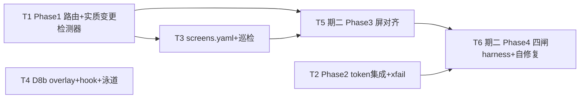

---
作者：@Ray
创建日期：2026-05-29
最后更新：2026-05-29
文档状态：草稿
---

# 任务列表：design-sync-automation

## 任务依赖图
> 由各任务 inline「同 spec 依赖」字段汇总，以 inline 为准。



并行组：
- Group A（期一，可即跑）：T1、T2、T4（互不依赖）
- Group B（期一）：T1 → T3
- Group C（期二，blocked 首屏）：T5、T6

## 里程碑
- **M1 = 期一（T1–T4）**：可独立交付/演示——`check_ui_sync.sh` 巡检落后屏 + Phase 1 路由/实质变更检测纯函数 + token 重生集成 + 维护态泳道落档，**不依赖任何屏存在**即可跑、对开发者有现实价值（即便零屏也能报「哪屏待同步」）。给这个长命 spec 一个干净的「期一已交付」锚点。
- 期二（T5–T6）随首个页面级 spec + `ui-shell-navigation` 落地，无独立里程碑（须有真 widget 才可演示）。

-----

- [x] T1 · Phase 1 diff 路由 + 实质变更检测器（纯函数）〔期一·M1〕

**同 spec 依赖：** 无 ｜ **跨 spec 依赖：** 无 ｜ **关联需求：** R1, R5, NF2 ｜ **依据设计：** D2, D4 ｜ **可改文件：** `bin/sync/route.dart`、`bin/sync/detectors.dart`（路由 + R5 三检测器，Dart CLI）、`.claude/workflows/design-sync.js`（薄编排：agent 经 Bash 调上述 CLI）｜ **验收基建：** `test/sync/route_detect_test.dart`、`test/sync/fixtures/`（diff/DOM/类名样例）

### 背景
实现确定性段（**住 `bin/sync/*.dart`，`flutter test` 可测；沙箱无 fs/子进程 → `design-sync.js` 不持逻辑、仅 agent 经 Bash 调，见 D9**）：① diff → 受影响屏/组件清单（R1 路由表）；② R5 三检测器（`unmapped = extracted − registry − ignore`、`data-when` 值集 diff、归一化 DOM 子序 diff）。`element-map.yaml` 内容随屏（期二），本任务用 fixture 驱动检测器逻辑。

### 实施
1. Phase 1 路由纯函数：变更文件集 → 路由（`tokens.css`→P2、`screens/<id>.html`→该屏、`screen.{css,js}`→6 屏扇出、`timeline.{css,js}`→仅 timeline、`DESIGN-REF §3`→ui-kit）。
2. 三检测器：`extracted` 取**全在场类名**（非仅 §3），减 `registry`、减 `ignore`；缺 `geometry` 标签并入 `unmapped`；`data-when` 值集 diff；DOM 子序 diff。
3. 任一检测器非空 → 标「实质档」；全空 → 放行至 Phase 3（期二）。

### 验收标准（做完即止）
- 路由对 fixture 的各变更类型输出正确清单、同输入同输出（自动，NF2）。
- `unmapped`：新类名 / 缺 geometry 标签 → 命中；纯 ignore 类 → 不命中（自动）。
- `data-when` 新值、DOM 子序变更 → 各自命中（自动）。

### 验收方式
- 自动：
  ```bash
  flutter test test/sync/route_detect_test.dart
  ```
  （喂 `fixtures/` 的 diff/DOM/类名样例，断言路由清单与检测器布尔**输出**；不 grep 实现源）

### 验收记录
```
日期：2026-05-30
自动：`flutter test test/sync/route_detect_test.dart` 通过
人工：N/A
```

-----

- [x] T2 · Phase 2 token 重生集成 + 对比度 xfail 区分〔期一·M1〕

**同 spec 依赖：** 无 ｜ **跨 spec 依赖：** `design-tokens-theme`：`bin/gen_tokens.dart` + `scripts/check_tokens_sync.sh` + `contrast_test.dart` + `test/ui/theme/contrast_xfail.yaml`（xfail allowlist 机器真源）｜ **关联需求：** R2 ｜ **依据设计：** D2 ｜ **可改文件：** `bin/sync/phase2_token.dart`（重生编排判定 + xfail 分流）、`.claude/workflows/design-sync.js`（薄编排）｜ **验收基建：** `test/sync/phase2_token_test.dart`、`test/sync/fixtures/`

### 背景
`tokens.css` 变 → check_tokens_sync（同源）→ gen_tokens → 主题回归；**对比度回归区分** xfail allowlist（`design-tokens-theme` 的 `test/ui/theme/contrast_xfail.yaml`，机器真源，advisory 不 wedge）vs allowlist 外新回归（block）。逻辑住 `bin/sync/phase2_token.dart`（D9）。

### 实施
1. 串 check_tokens_sync → gen_tokens → 主题层测试。
2. 对比度结果按 xfail allowlist 分流：allowlist 命中 → advisory（写 SYNC_REPORT、报 @Ray、不中止）；allowlist 外失败 → block。
3. allowlist 单一来源 = `test/ui/theme/contrast_xfail.yaml`（design-tokens-theme 拥有的机器可读 yaml；勿在 sync 侧另开第二处）。

### 验收标准（做完即止）
- 同源分叉 / gen 漂移 → 中止（自动）。
- xfail 三条命中 → advisory、管线不 wedge（自动，用 fixture 模拟红）。
- allowlist 外新对比度回归 → block（自动）。

### 验收方式
- 自动：
  ```bash
  flutter test test/sync/phase2_token_test.dart
  ```

### 验收记录
```
日期：2026-05-30
自动：`flutter test test/sync/phase2_token_test.dart` 通过
人工：N/A
```

-----

- [x] T3 · screens.yaml 登记 + check_ui_sync.sh 巡检〔期一·M1〕

**同 spec 依赖：** T1 ｜ **跨 spec 依赖：** 无 ｜ **关联需求：** R3, R8 ｜ **依据设计：** D5 ｜ **可改文件：** `specs/active/design-sync-automation/screens.yaml`、`scripts/check_ui_sync.sh` ｜ **验收基建：** `test/sync/check_ui_sync_test.sh`

### 背景
`screens.yaml` 每屏 `{id, pinned, lane, map}`（6 屏骨架，pinned 占位）；`check_ui_sync.sh` 反向巡检：`pinned` 落后于 HEAD 且源屏 `pinned..HEAD` diff 非空 → 报「待同步」。

### 实施
1. `screens.yaml` 6 屏骨架。
2. `check_ui_sync.sh`：读各屏 `pinned`，对源屏算 `pinned..HEAD` diff，非空且落后 → 列「待同步」清单、退出码标识。

### 验收标准（做完即止）
- 造「pinned 落后 + 源屏 diff 非空」夹具 → 报该屏待同步（自动）。
- 造「pinned=HEAD」夹具 → 不报（自动）。

### 验收方式
- 自动：
  ```bash
  bash test/sync/check_ui_sync_test.sh
  ```
  （夹具构造两种 pinned 状态，断言巡检输出与退出码）

### 验收记录
```
日期：2026-05-30
自动：`bash test/sync/check_ui_sync_test.sh` 通过
人工：N/A
```

-----

- [-] T4 · 维护态泳道 override（DayZ-own）+ AGENTS 指针 + 三档/视觉默认（D8 修订）〔期一·M1〕

**同 spec 依赖：** 无 ｜ **跨 spec 依赖：** 无 ｜ **关联需求：** R7, R8 ｜ **依据设计：** D8 ｜ **可改文件：** `docs/spec-guide-ai.md`、`AGENTS.md`、`specs/README.md` ｜ **验收基建：** 无（走死链 hook + `git diff --quiet` + 人工核措辞）

### 背景
D8（修订）：override 落 DayZ-own——overlay 定义「已交付·随设计维护」泳道（override 终态→归档，限屏幕 spec）+ 三档分流 + 视觉默认；`AGENTS.md` 加指针；README 加泳道分区。**不碰 vendored `spec-kit/spec-guide.md`**（railkit 同步会冲）。

### 实施
1. `docs/spec-guide-ai.md`（overlay）：泳道措辞「override 终态→归档（限屏幕 spec）」+ 指向通用源不变式 + 三档分流（R7）+ 视觉默认（闸①②③ 确定性 + 闸④ golden/SSIM 自动验、人工仅标红终审不阻塞；禁止假 grep 不变）。
2. `AGENTS.md` 加一行指针：屏幕 spec 终态→归档被 overlay override，见 `docs/spec-guide-ai.md`。
3. `specs/README.md` 加「已交付·随设计维护」分区。

### 禁止
- **MUST NOT 改 `spec-kit/spec-guide.md`**（vendored from railkit，本地改会被同步冲；共享 extension hook 须加 railkit 上游、@Ray 定）。

### 验收标准（做完即止）
- `specs/` 死链检查通过（自动）。
- 未改动 vendored `spec-kit/spec-guide.md`（自动：`git diff --quiet spec-kit/spec-guide.md`）。
- overlay 措辞为「override」+ AGENTS 指针就位（人工，@Ray）。

### 验收方式
- 自动：
  ```bash
  bash spec-kit/scripts/check_dead_links.sh && git diff --quiet spec-kit/spec-guide.md
  ```
- 人工：
  - @Ray 核 overlay「override 终态→归档」措辞 + AGENTS 指针就位。

### 验收记录
```
日期：2026-05-30
自动：`bash spec-kit/scripts/check_dead_links.sh && git diff --quiet spec-kit/spec-guide.md` 通过
人工：待确认（核查人 @Ray）
```

-----

## 期二（设计已定 D6/D9，实现随首个页面级 spec + ui-shell-navigation 落地）

> 须有真 widget 与 `element-map.yaml` 内容才可对齐/验证，故 blocked，不在 M1 内。届时作为该屏 spec 的 sync 任务补入或在本 spec 落地。

- [ ] T5 · Phase 3 屏对齐 agent（worktree 隔离）〔期二〕

**同 spec 依赖：** T1, T3 ｜ **跨 spec 依赖：** `timeline-screen`（待立）：首个可对齐屏 + `element-map.yaml` 内容 ｜ **关联需求：** R6 ｜ **依据设计：** D2, D9

### 背景（设计指针）
`agent()` per 屏（`isolation:'worktree'`），输入 = 新 HTML + §6 映射 + 现 widget + ui-kit + tokens → patch。实现待首屏存在。

-----

- [ ] T6 · Phase 4 四闸 harness + 自修复循环〔期二〕

**同 spec 依赖：** T2, T5 ｜ **跨 spec 依赖：** `timeline-screen`（待立）：`element-map.yaml` + param fixture + golden ｜ **关联需求：** R6, NF1, NF3 ｜ **依据设计：** D6, D9

### 背景（设计指针）
闸②/闸③ 确定性 widget test 调用；闸④ 区域化 SSIM 确定性计算 + 视觉模型残余；自修复循环退出按 D6（闸①②③ 全绿 ∧ (闸④≥阈 ∨ 轮次≥cap=min(3,budget))；闸③ content-driven 不断块高护栏）。实现待首屏 + harness 基建存在。
