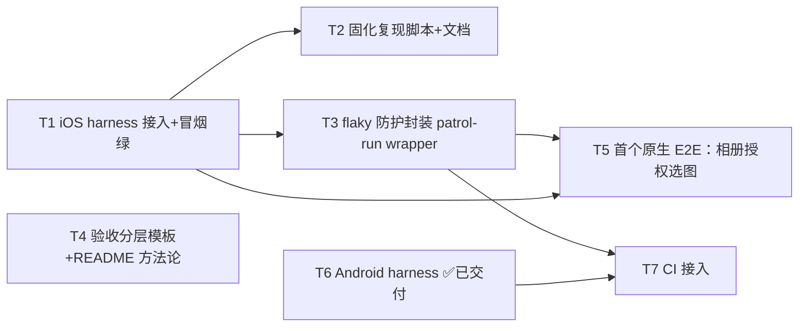

---
作者：@Ray
创建日期：2026-06-04
最后更新：2026-06-04
文档状态：进行中（T1 已交付）
---

# 任务列表：e2e-harness

## 任务依赖图
> 由各任务 inline「同 spec 依赖」字段汇总，以 inline 为准。

并行组：
- Group A（即跑）：T2、T3、T4（互不依赖，均承接已交付的 T1）
- Group B（后置·依赖屏 spec）：T5（dependsOn `editor-integration-screen` + `media-storage`）
- Group C（后置）：T6 Android harness ✅ 已交付（Rust android 交叉编译实测过）；T7 CI（dependsOn T3 + T6）待办

## 里程碑
- **M1 = iOS + Android 冒烟管线（T1、T6）**：✅ 已交付。`patrol test` 在 iPhone 模拟器与 Android 模拟器**双端**跑通真 app 冷启动 + `$` finder，各 1 用例绿。给本 spec 一个干净的「已落地」锚点。
- **M2 = 可复现 + 防 flaky（T2、T3、T4）**：别人/CI 能照脚本一把搭起来、不被两类 flaky 卡死，且验收分层契约可被各屏 spec 引用。
- **M3 = 首个真原生 E2E（T5）**：相册授权选图链路在真机跑通，证明 harness 的独占价值（widget test 做不到的那部分）。

---

## T1 · iOS harness 接入 + 冒烟跑通
**状态：✅ 已完成（实测）**
- 同 spec 依赖：无
- 内容：加 `patrol` 依赖 + pubspec `patrol:` 配置块（app_name=DayZ, bundle_id/package=com.dayz）；SPM→CocoaPods 回落生成 Podfile；`scripts/setup_patrol_ios.rb` 建 `RunnerUITests` target + 桥接 `.m` + 挂 scheme；Podfile 嵌套 UITest target + `pod install`；写 `patrol_test/patrol_smoke_test.dart`。
- 验收：见 [`verification.md`](./verification.md) V2（冒烟绿，证据 `build/ios_results_*.xcresult`）。

## T2 · 固化复现脚本 + 文档
- 同 spec 依赖：T1
- 内容：`scripts/setup_patrol_ios.rb` 已入仓（幂等）；在 `AGENTS.md` 或 `docs/` 补一页「Patrol iOS 一次性接入 SOP」——列出依赖、SPM 回落、建 target、Podfile、跑法、`xcodeproj` 的 GEM_HOME 调用法。
- 验收：在干净 checkout 上照文档可把 iOS harness 从零搭到冒烟绿。

## T3 · flaky 防护封装（patrol-run wrapper）
- 同 spec 依赖：T1
- 内容：提供一个运行入口（如 `scripts/patrol_test.sh`）封装 R4/R7——禁 analytics（写盘 + env）、对 native-asset 下载失败 retry、解析 `Total: N` 校验非零。
- 验收：见 V4。连续 3 次调用不因 handshake / dylib 下载失败而假崩；零执行被挡下。

## T4 · 验收分层模板 + README 方法论
- 同 spec 依赖：无（承接 T1 的能力认知）
- 内容：在 `specs/README.md` 写「验收分层」方法论段（自动化可覆盖 vs 必须人工 / 不可逆终验，R1/R5/R6）；给屏 spec 的 `verification.md` 一个可复制的两栏骨架。
- 验收：见 V1。新屏 spec 的 verification 能据此把验收项无歧义分类。

## T5 · 首个真原生 E2E：相册授权选图（后置）
- 同 spec 依赖：T3；**跨 spec 依赖**：`editor-integration-screen`、`media-storage`
- 内容：写 `patrol_test/` 下一条 E2E——进编辑器 → 插图 → Patrol 驱动 iOS 相册授权弹窗 + 选图 → 断言图片落库。这是 widget test 碰不到、Patrol 独占的场景。
- 验收：见 V5。真机/模拟器跑通，原生授权弹窗被 Patrol 处理。

## T6 · Android harness 接入
**状态：✅ 已完成（实测）**
- 同 spec 依赖：无（与 iOS 并列）；**外部前置**：`argon2id_ffi` 的 Rust Android 交叉编译（rustup 接管 + android target + NDK，[[reference_rust_cross_compile]]）——实测通过
- 内容：`android/app/build.gradle.kts` 加 `PatrolJUnitRunner` + `testOptions ANDROIDX_TEST_ORCHESTRATOR` + `androidTestUtil orchestrator`；新增 `android/app/src/androidTest/java/com/dayz/MainActivityTest.java`。
- 验收：见 [`verification.md`](./verification.md)「Android（T6）」行（Total:1 / Successful:1）。

## T7 · CI 接入（后置）
- 同 spec 依赖：T3、T6
- 内容：CI 接 `patrol test`（iOS + Android），带 T3 的 flaky 防护与 R7 零执行守卫。
- 验收：见 [`verification.md`](./verification.md)「CI（T7）」行。CI 绿且非零执行。
