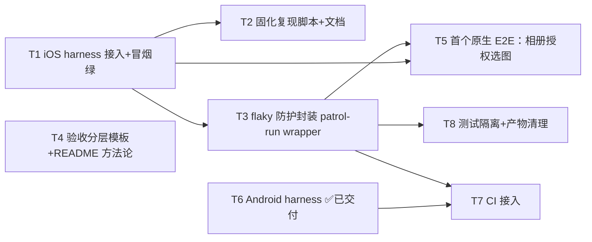

---
作者：@Ray
创建日期：2026-06-04
最后更新：2026-06-04
文档状态：进行中（M1 双端冒烟绿；M2 T2/T3/T4/T8 工件已交付，live 连跑 / 干净 checkout 走查 / 骨架评审留 @Ray 人闸；T5/T7 后置）
---

# 任务列表：e2e-harness

## 任务依赖图
> 由各任务 inline「同 spec 依赖」字段汇总，以 inline 为准。



并行组：
- Group A（即跑）：T2、T3、T4（互不依赖，均承接已交付的 T1）；T8 承接 T3
- Group B（后置·依赖屏 spec）：T5（dependsOn `editor-integration-screen` + `media-storage`）
- Group C（后置）：T6 Android ✅ 已交付；T7 CI（dependsOn T3 + T6）待办

## 里程碑
- **M1 = iOS + Android 冒烟管线（T1、T6）**：✅ 已交付。`patrol test` 在 iPhone 与 Android 模拟器**双端**跑通真 app 冷启动 + `$` finder，各 1 用例绿。
- **M2 = 可复现 + 防 flaky + 测试隔离（T2、T3、T4、T8）**：**工件层 ✅，收口待人闸 ⏳**。runbook（`docs/patrol-e2e-onboarding.md`）+ flaky wrapper（`scripts/patrol_test.sh`，逻辑已静态自验）+ 验收分层骨架（`verification-skeleton.md`）+ R8 测试隔离/产物清理已交付；干净 checkout 实走查、wrapper live 连跑、骨架评审留 @Ray，未收口前 M2 不算完成。
- **M3 = 首个真原生 E2E（T5）**：相册授权选图链路真机跑通，证明 harness 独占价值。

-----

- [x] T1 · iOS harness 接入 + 冒烟跑通〔M1〕

**同 spec 依赖：** 无 ｜ **跨 spec 依赖：** 无 ｜ **关联需求：** R2, R3, NF3 ｜ **依据设计：** D2, D3, D4 ｜ **可改文件：** `pubspec.yaml`、`pubspec.lock`、`ios/Podfile`、`ios/Podfile.lock`、`ios/RunnerUITests/RunnerUITests.m`、`ios/Runner.xcodeproj/project.pbxproj`、`ios/Runner.xcodeproj/xcshareddata/xcschemes/Runner.xcscheme`、`ios/Flutter/Debug.xcconfig`、`ios/Flutter/Release.xcconfig`、`scripts/setup_patrol_ios.rb`、`patrol_test/patrol_smoke_test.dart`、`.gitignore` ｜ **验收基建：** `patrol_test/patrol_smoke_test.dart`

### 背景
iOS 是既有 `integration_test` 的验证目标、构建已证可行，故先趟通 iOS。难点：项目跑在 Flutter SPM 模式无 Podfile（D2），且需建 RunnerUITests target（D3）。

### 实施
1. `flutter pub add dev:patrol`，pubspec 加 `patrol:` 配置块（app_name=DayZ、bundle_id/package=com.dayz）。
2. `flutter build ios --config-only` 触发 SPM→CocoaPods 回落生成 Podfile；Podfile `target 'Runner'` 内嵌套 `target 'RunnerUITests' do inherit! :complete end` + `use_modular_headers!`。
3. 跑 `scripts/setup_patrol_ios.rb`（xcodeproj gem）建 RunnerUITests target + 挂 scheme；写桥接 `ios/RunnerUITests/RunnerUITests.m`。
4. `pod install`；写 `patrol_test/patrol_smoke_test.dart`（`app.main()` + `$(MaterialApp).waitUntilVisible()`）。

### 验收标准（做完即止）
- iOS 模拟器经 wrapper 跑冒烟，`Total:1 / Successful:1 / Failed:0`（自动）。
- 真 app 冷启动经真实 SQLCipher 初始化（NF3），非 mock（自动，落盘真 DB 即证）。

### 验收方式
- 自动：
  ```bash
  bash scripts/patrol_test.sh -t patrol_test/patrol_smoke_test.dart -d <ios-sim-id>
  ```

### 验收记录
```
日期：2026-06-04
自动：iOS（iPhone 17 sim）冒烟绿 Total:1/Successful:1/Failed:0，证据 build/ios_results_*.xcresult
人工：N/A
```

-----

- [-] T2 · 固化复现脚本 + 一次性接入文档

**同 spec 依赖：** T1 ｜ **跨 spec 依赖：** 无 ｜ **关联需求：** R2 ｜ **依据设计：** D3 ｜ **可改文件：** `scripts/setup_patrol_ios.rb`、`docs/patrol-e2e-onboarding.md`、`AGENTS.md` ｜ **验收基建：** 无

### 背景
建 UITest target 的过程必须可复现，否则 harness 是一次性的；其他 agent 也需要发现「怎么接、怎么跑」。

### 实施
1. `scripts/setup_patrol_ios.rb` 入仓（幂等、头注 GEM_HOME 调用法）。
2. 写 `docs/patrol-e2e-onboarding.md` step-by-step runbook：前置 / 目录约定 / iOS SPM 回落 / setup 脚本 / Podfile 嵌套 / Android 接法 / 经 wrapper 跑法 / flaky 防护 / footprint。
3. AGENTS.md 上下文索引指过去。

### 验收标准（做完即止）
- 干净 checkout 照 runbook 可把 iOS harness 从零搭到冒烟绿（人工）。

### 验收方式
- 人工（@Ray）：在干净 checkout 上照 `docs/patrol-e2e-onboarding.md` 走一遍至冒烟绿。

### 验收记录
```
日期：—
自动：N/A（一次性 onboarding 走查无法自动化）
人工：待确认（核查人 @Ray）—— 干净 checkout 实走查
```

-----

- [-] T3 · flaky 防护封装（patrol-run wrapper）

**同 spec 依赖：** T1 ｜ **跨 spec 依赖：** 无 ｜ **关联需求：** R4, R7, NF2 ｜ **依据设计：** D5 ｜ **可改文件：** `scripts/patrol_test.sh` ｜ **验收基建：** `scripts/patrol_test.sh`（自带 `--selftest`）

### 背景
裸调 `patrol test` 会因启动 handshake、native-asset/Maven 下载中断、Android 首跑 `Total:0` 等假崩/假阴（R4/R7）。需一层确定性 wrapper。

### 实施
1. `scripts/patrol_test.sh`：禁 analytics（写 `~/.config/patrol_cli/analytics.json` `{"enabled":false}` + 导出 `PATROL_ANALYTICS_ENABLED=false`）。
2. 对可重试模式 retry（`PATROL_MAX_RETRIES` 默认 3）；真实断言失败**不**重试。
3. 解析 `Total: N`，零执行 → 非零退出（R7）。
4. `--selftest`：不跑真机，对 stub patrol 验解析 + 守卫四类控制流。

### 验收标准（做完即止）
- `Total:0` → 非零退出；可重试模式 retry ≤3；真失败不重试（自动，NF2）。
- `bash -n` 语法过（自动）。

### 验收方式
- 自动：
  ```bash
  bash -n scripts/patrol_test.sh && bash scripts/patrol_test.sh --selftest
  ```
- 人工（@Ray）：连续 3 次 live（真机/模拟器）调用 0 次假崩。

### 验收记录
```
日期：2026-06-04
自动：`bash -n` 过；`--selftest` 对 stub 四类控制流（pass/假绿/真失败/flaky）行为符合预期
人工：待确认（核查人 @Ray）—— live 连跑 3 次
```

-----

- [-] T4 · 验收分层模板 + README 方法论

**同 spec 依赖：** 无 ｜ **跨 spec 依赖：** 无 ｜ **关联需求：** R1, R5, R6 ｜ **依据设计：** D1 ｜ **可改文件：** `specs/README.md`、`specs/active/e2e-harness/verification-skeleton.md`、`AGENTS.md`、`spec-kit/spec-guide.md` ｜ **验收基建：** 无

### 背景
验收分层（自动化可覆盖 vs 必须人工/不可逆终验）要能被后续屏 spec 无歧义套用，否则方法论停在纸面。

### 实施
1. `specs/README.md` 写「验收分层」方法论段（R1/R5/R6）。
2. 交付可复制两栏骨架 `verification-skeleton.md`（端到端表两栏 + 专项 `—自动:`/`—人工(@Ray)` 约定 + R5/R6 套用要点）。
3. AGENTS.md 规则段 + spec-guide 验收段指过去。

### 验收标准（做完即止）
- 新屏 spec 的 verification 能据骨架把验收项无歧义分类（人工·评审）。

### 验收方式
- 人工（@Ray）：评审 `verification-skeleton.md` 是否「AI 能否无歧义执行」。

### 验收记录
```
日期：—
自动：N/A（方法论可执行性属人因判断）
人工：待确认（核查人 @Ray）—— 骨架评审
```

-----

- [ ] T5 · 首个真原生 E2E：相册授权选图（后置）

**同 spec 依赖：** T3 ｜ **跨 spec 依赖：** `editor-integration-screen`：编辑器插图入口；`media-storage`：图片落库 ｜ **关联需求：** R2, NF3 ｜ **依据设计：** D1, D4 ｜ **可改文件：** `patrol_test/editor_image_pick_e2e.dart` ｜ **验收基建：** `patrol_test/editor_image_pick_e2e.dart`

### 背景
patrol 唯一独占、widget test 碰不到的场景＝驱动 iOS 原生相册授权弹窗 + 选图。是证明 harness 价值的关键用例，待编辑器插图链路就绪。

### 实施
1. 写 `patrol_test/` 下 E2E：进编辑器 → 插图 → `$.native` 处理相册授权弹窗 + 选图。
2. 断言图片落库（MediaRepo）。

### 验收标准（做完即止）
- 真机/模拟器跑通，原生授权弹窗被 Patrol 处理、图片落库（自动）。

### 验收方式
- 自动：
  ```bash
  bash scripts/patrol_test.sh -t patrol_test/editor_image_pick_e2e.dart -d <sim-id>
  ```

### 验收记录
```
日期：—
自动：—
人工：N/A
```

-----

- [x] T6 · Android harness 接入〔M1〕

**同 spec 依赖：** 无（与 iOS 并列）｜ **跨 spec 依赖：** `argon2id_ffi`：Rust Android 交叉编译（aarch64-linux-android）｜ **关联需求：** R2, R3, NF1 ｜ **依据设计：** D6 ｜ **可改文件：** `android/app/build.gradle.kts`、`android/app/src/androidTest/java/com/dayz/MainActivityTest.java` ｜ **验收基建：** `android/app/src/androidTest/java/com/dayz/MainActivityTest.java`

### 背景
补齐 Android 端，验证 `argon2id_ffi` 的 Rust 交叉编译在 patrol 构建链能过（前提：rustup 接管 + android target + NDK，见 [[reference_rust_cross_compile]]）。

### 实施
1. `android/app/build.gradle.kts` 加 `testInstrumentationRunner = PatrolJUnitRunner` + `testInstrumentationRunnerArguments["clearPackageData"]="true"` + `testOptions { execution = "ANDROIDX_TEST_ORCHESTRATOR" }` + `androidTestUtil orchestrator`。
2. 写 `android/app/src/androidTest/java/com/dayz/MainActivityTest.java`（`PatrolJUnitRunner` 枚举 Dart 用例）。

### 验收标准（做完即止）
- Android 模拟器经 wrapper 跑冒烟，`Total:1 / Successful:1`（自动，NF1）。

### 验收方式
- 自动：
  ```bash
  bash scripts/patrol_test.sh -t patrol_test/patrol_smoke_test.dart -d emulator-5554
  ```

### 验收记录
```
日期：2026-06-04
自动：Android（Medium_Phone_API_36.1）冒烟绿 Total:1/Successful:1；argon2id Rust 交叉编译过；首跑 Total:0 重跑即绿（实证 R7）
人工：N/A
```

-----

- [-] T8 · 测试隔离 + 产物清理〔M2〕

**同 spec 依赖：** T3 ｜ **跨 spec 依赖：** 无 ｜ **关联需求：** R8, NF2 ｜ **依据设计：** D7 ｜ **可改文件：** `scripts/patrol_test.sh`、`docs/patrol-e2e-onboarding.md`、`specs/active/e2e-harness/requirement.md`、`specs/active/e2e-harness/design.md`、`specs/active/e2e-harness/verification.md`、`specs/active/e2e-harness/verification-skeleton.md` ｜ **验收基建：** `scripts/patrol_test.sh`（`--selftest` + R8 清理函数 + `PATROL_FORCE_IOS_SIM`/`PATROL_RESULTS_GLOB` 注入缝）

### 背景
iOS 无 Android 的 `clearPackageData`，patrol 跑 `main()` 把真加密 DB/媒体留在模拟器容器、跨次污染（顺序依赖型 flaky + 隐私卫生，D7）。须在 wrapper 收口测试隔离 + 产物清理；**不**碰加密数据路径。

### 实施
1. `scripts/patrol_test.sh` 加 R8：检测目标为 iOS 模拟器时，跑前（及绿后）清 app **数据容器**（`get_app_container ... data` 后清内容、**保留安装**，对齐 Android `clearPackageData`，带严格 rm 护栏）；修剪旧 `build/ios_results_*.xcresult`（保留最近 `PATROL_KEEP_XCRESULTS`，默认 3）；`PATROL_NO_RESET=1` 可关；非 iOS / Android / 真机目标全程 no-op。
2. runbook 补「测试产物不入库 / 清理」；`verification-skeleton.md` DoD 补「有状态 E2E 须起始态干净 / teardown」。

### 验收标准（做完即止）
- 清理仅在 iOS 模拟器目标触发，Android / 非真机目标 no-op（自动）。
- 旧 xcresult 修剪保留最近 N、删更旧（自动）。
- patrol 生成的 `test_bundle.dart` 不入库（自动）。
- `bash -n` 过、`--selftest` 仍过（自动）。

### 禁止
- 不在生产 `AppDatabase` / 路径解析里加测试专用数据目录缝（D7：不碰加密数据面）。

### 验收方式
- 自动：
  ```bash
  bash -n scripts/patrol_test.sh && bash scripts/patrol_test.sh --selftest
  git check-ignore patrol_test/test_bundle.dart    # 退 0 = 已忽略、不入库
  ```
- 人工（@Ray）：真机/模拟器跑后确认容器已清（无残留真加密 DB）、机器无旧 xcresult 堆积——与 T3 live 连跑合并走查。

### 验收记录
```
日期：2026-06-05
自动：`bash -n` 过；`--selftest` 过；stub 驱动——`-d fake`→R8 全程 no-op；stub `xcrun` 指向临时数据容器→清内容但**保留容器目录**（app 不卸）、非 `*/Containers/Data/Application/*` 路径**拒删**（rm 护栏生效）；`PATROL_RESULTS_GLOB` 注入 5 假 xcresult/keep=3→修剪剩最新 3；真 booted UDID 命中 `simctl list`（检测正向）、`fake` 不命中（负向）；`git check-ignore patrol_test/test_bundle.dart` 退 0
人工：待确认（核查人 @Ray）—— 真机跑后 app 仍在、其数据已清
```

-----

- [ ] T7 · CI 接入（后置）

**同 spec 依赖：** T3, T6 ｜ **跨 spec 依赖：** 无 ｜ **关联需求：** R4, R7 ｜ **依据设计：** D5, D6 ｜ **可改文件：** `.github/workflows/e2e.yml` ｜ **验收基建：** `.github/workflows/e2e.yml`

### 背景
CI 接入是 flaky 防护 + 零执行守卫跑稳后的收尾，把双端 E2E 纳入持续验证。

### 实施
1. CI 经 `scripts/patrol_test.sh` 跑 iOS + Android 冒烟。
2. 校验非零执行（R7），失败不掩盖。

### 验收标准（做完即止）
- CI 双端绿且 `Total` 非零（自动）。

### 验收方式
- 自动：
  ```bash
  bash scripts/patrol_test.sh -t patrol_test/patrol_smoke_test.dart -d <ci-device>
  ```

### 验收记录
```
日期：—
自动：—
人工：N/A
```
