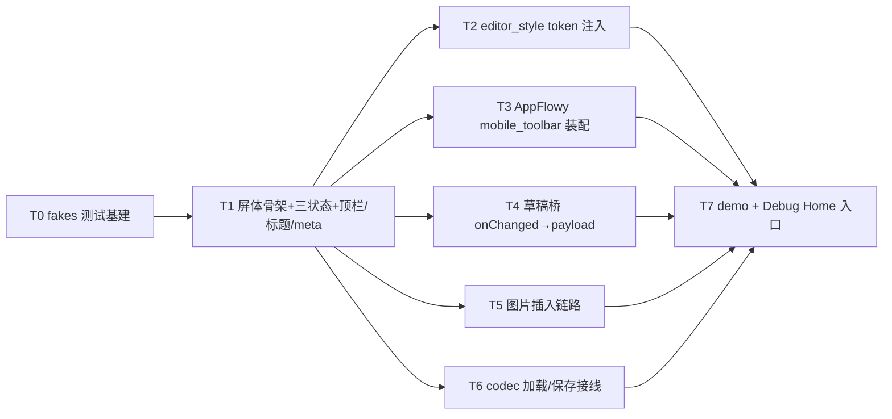

---
作者：@Ray
创建日期：2026-05-29
最后更新：2026-06-06
文档状态：定稿
---

# 任务列表：editor-integration-screen

## 任务依赖图
> 由各任务 inline「同 spec 依赖」字段汇总，以 inline 为准。



并行组：
- Group A：T0 →（gate）T1
- Group B：T1 → {T2, T3, T4, T5, T6}（并行）
- Group C：{T2..T6} → T7

（整屏一体、无可独立部署/演示的中间切点 → 不设里程碑。`compose-meta` 选择器录入流、草稿恢复提示条、undo/redo 工具按钮均范围外，不在此拆任务。）

> **设计维护卡（2026-06-06，已交付 v1.0 后）：** T0–T7 全 `[x]` 后，设计稿实质变更新增 S1（图片选择器改写）/S2（工具栏重排），见文末「## 设计维护卡（实质档）」段，与 T 系任务图独立（各自改写既有交付物，可并行）。

-----

- [x] T0 · 跨 spec 依赖的测试 fake（验收基建）

**同 spec 依赖：** 无 ｜ **跨 spec 依赖：** `editor-json-contract：EditorDocCodec/extractPlainText 接口形态`、`media-storage：MediaStore 接口形态`、`auto-save-draft：DraftCoordinator plain payload 接口`、`data-layer：Repository 接口形态` ｜ **关联需求：** （支撑 R3/R7/R8/NF1 的可测性）｜ **依据设计：** D9 ｜ **可改文件：** `test/ui/editor/fakes/`（codec/MediaStore/DraftCoordinator/Repository 的内存 fake）

### 背景
本屏处波次 W2、前置多未定稿（D9）。建一组内存 fake，让屏体/桥/插入器能被 widget test 独立验证、demo 可 pump，**不在生产路径引入 stub 分支**（生产只 import 交付物接口）。fakes 属共享测试基建（`test/` 下非 `_test.dart`），本任务预批。
归属：fake 的接口形态对齐各前置 spec 当前 design 的交付物名；交付物若改名，fake 随之改（属测试基建，不影响生产）。

### 实施
1. `fake_editor_doc_codec.dart`：round-trip 假 codec（encode/decode/extractPlainText，docVersion=1）。
2. `fake_media_store.dart`：内存 `put`/`openRead`，返回稳定 `media.id`/`rel_path`。
3. `fake_draft_coordinator.dart`：记录每次 `onChanged(payload)`/`forceFlush` 调用，暴露调用历史供断言。
4. `fake_repos.dart`：`EntryRepo`/`MediaRepo` 等最小内存实现（供 chip 取数/元数据）。

### 验收标准（做完即止）
- fakes 可被一个最小 `_test.dart` 实例化并跑通 round-trip（自动）。

### 验收方式
- 自动：
  ```bash
  flutter test test/ui/editor/fakes_smoke_test.dart
  ```
  （实例化各 fake、断言 codec round-trip 与 DraftCoordinator fake 记录调用；**不** grep fake 源码自身）

### 验收记录
```
日期：2026-05-31
自动：`flutter test test/ui/editor/fakes_smoke_test.dart` 通过（00:00 +1: All tests passed!）
人工：N/A
```

-----

- [x] T1 · 屏体骨架 + 三状态 + 顶栏 / 无边框标题 / compose-meta chip

**同 spec 依赖：** T0 ｜ **跨 spec 依赖：** `design-tokens-theme：context.dayz/DayzFonts/DayzTextTheme/六套ThemeData`、`ui-kit-components：DayzGlassAppBar/DayzButton/DayzTextField/DayzTag/dayz_icons`、`ui-shell-navigation：Routes.editor/PlaceholderScreen`、`i18n-localization：gen-l10n` ｜ **关联需求：** R2, R9, R10, NF3, NF4 ｜ **依据设计：** D2, D4, D8, D10 ｜ **可改文件：** `lib/ui/editor/editor_screen.dart`、`lib/ui/editor/editor_meta_bar.dart`、`lib/l10n/arb/app_zh.arb`、`lib/l10n/arb/app_en.arb`、`lib/l10n/gen/app_localizations.dart`、`lib/l10n/gen/app_localizations_zh.dart`、`lib/l10n/gen/app_localizations_en.dart` ｜ **验收基建：** `test/ui/editor/fakes/`（T0 产出，复用）

### 背景
搭 `EditorScreen({entryId?, initialDraft?, createIntent?})` 骨架：`DayzGlassAppBar` 壳（关闭钮 + 顶栏标题派生 + 完成钮 `DayzButton.primary` small）、无边框标题 `DayzTextField`（不支持 borderless 则裸 `TextField`+`InputDecoration.collapsed` 走 token，见 D2 已知风险）、日期 kicker（`intl` 格式化）、`compose-meta` 四 chip 触发钮（`editor_meta_bar.dart`，已选态 `.on` 回显，触发占位 sheet）。正文区**先放占位**（AppFlowyEditor 接入归后续任务，本任务用占位容器保留布局）。三状态由入参/数据态派生（empty/writing/rich，D4）。文案补入 zh/en ARB 并通过 `AppLocalizations.of(context)` 取用（D10）。
归属：本任务只补编辑页 ARB key 与生成产物；正文编辑器装配归 T2/T3，本任务不接 AppFlowy。

### 实施
1. `EditorScreen` 布局：顶栏（关闭/标题/完成）+ 日期 kicker + 标题输入 + meta chip 行 + 正文占位 + 底部 has-dock 留白。
2. 顶栏标题派生：empty→`l10n.editorTitleNew`、有草稿→`l10n.editorTitleDraftSaved`。
3. 标题无边框：聚焦也不显描边（用 token 着色，禁硬编码）。
4. `editor_meta_bar.dart`：四 chip（心情/天气/地点/标签）经 `DayzTag`/`DayzButton` 外形 + Semantics 标签 + 已选 `.on` 态；取数经入参（Repository，NF1）；点击打开占位 `DayzSheet`。
5. 日期 kicker 走 `DateFormat`（中文 locale），禁裸拼接。

### 验收标准（做完即止）
- 三状态各 pump：empty 显标题占位「标题」+ 正文占位文案 + 顶栏「新日记」；writing/rich 顶栏「草稿已存」（自动，`find.text(l10n.xxx)`，R9）。
- 标题控件无可见边框：聚焦前后均无 border 描边（自动，断言 `InputDecoration` border 为 none/collapsed，R2）。
- 顶栏关闭钮/完成钮/四 chip 均可 `find.bySemanticsLabel(l10n.xxx)` 定位（自动，NF3）。
- 关闭钮、完成钮、每个 chip 命中区 ≥ 44×44（自动，`tester.getSize` ≥ Size(44,44)，NF3）。
- 屏内无裸中文：可见文案全经 `AppLocalizations`（自动，测试只用 `find.text(l10n.xxx)` 命中，裸中文测试不命中即证；R9/D10）。

### 验收方式
- 自动：
  ```bash
  flutter test test/ui/editor/editor_screen_test.dart
  ```
  （pump 三状态、断言顶栏/占位文案==AppLocalizations、标题无边框、Semantics 标签可定位、命中区几何 ≥44；**不** grep 屏源）

### 验收记录
```
日期：2026-05-31
自动：`flutter test test/ui/editor/editor_screen_test.dart` 通过（00:01 +5: All tests passed!）；`flutter test test/ui/editor/fakes_smoke_test.dart test/ui/editor/editor_screen_test.dart` 回归通过（00:00 +6: All tests passed!）
人工：N/A
```

-----

- [x] T2 · editor_style：AppFlowy EditorStyle 从 token 注入

**同 spec 依赖：** T1 ｜ **跨 spec 依赖：** `design-tokens-theme：context.dayz/DayzFonts/DayzTextTheme（t-diary/t-h*/行高）` ｜ **关联需求：** R1, NF4 ｜ **依据设计：** D7 ｜ **可改文件：** `lib/ui/editor/editor_style.dart`、`lib/ui/editor/editor_screen.dart`（接入 AppFlowyEditor + 注入 style）｜ **验收基建：** 无（用 `test/ui/editor/fakes/`，T0）

### 背景
把 `AppFlowyEditor` 接进正文区（取代 T1 占位），并构造 `dayzEditorStyle(context)`：正文 `t-diary` 衬线 1.85、标题块 `t-h*`、选区/光标 = `context.dayz.accent`、code/quote/divider/待办块色取 token（D7/NF4）。
归属：编辑器视觉与正文渲染本任务负责；工具栏归 T3、草稿桥归 T4、图片归 T5、codec 加载归 T6，本任务不碰这些接线（正文先用空/假 Document 渲染）。

### 实施
1. `editor_screen.dart` 正文区替换为 `AppFlowyEditor(editorState: ...)`（用 fake/空 Document 起步）。
2. `dayzEditorStyle(BuildContext)`：从 `context.dayz.*` + `DayzTextTheme`/`DayzFonts` 取色与排版，构造 AppFlowy `EditorStyle`（精确可配项读 `packages/appflowy-editor` 源码对齐）。
3. 注入：`AppFlowyEditor(..., editorStyle: dayzEditorStyle(context))`。

### 验收标准（做完即止）
- 正文区由 `AppFlowyEditor` 渲染（自动，`find.byType(AppFlowyEditor)` 命中；非 `TextField` 当正文，R1）。
- 注入的 `EditorStyle` 文本样式取自 token：正文 height==1.85、字族==`DayzFonts.serif`、选区/光标色==`context.dayz.accent`（自动，断言 style 字段值 == token 值，NF4）。
- 切换六套主题之一，编辑器选区色随 `context.dayz.accent` 变（自动，pump 两套主题断言取值不同且各等于对应 token，NF4）。

### 验收方式
- 自动：
  ```bash
  flutter test test/ui/editor/editor_style_test.dart
  ```
  （pump 含 AppFlowyEditor 的屏，断言 EditorStyle 字段值 == token；**不** grep style 源码）

### 验收记录
```
日期：2026-06-01
自动：`flutter test test/ui/editor/editor_style_test.dart` 通过
人工：N/A
```

-----

- [x] T3 · 底部工具栏：AppFlowy mobile_toolbar 装配（停靠/选区高亮交给 AppFlowy）

**同 spec 依赖：** T1, T2 ｜ **跨 spec 依赖：** `packages/appflowy-editor：MobileToolbar(V2)/MobileToolbarStyle/toolbar items（vendored 包，已存在）`、`design-tokens-theme：token（工具栏配色）`、`ui-kit-components：dayzMotionDuration`、`i18n-localization：gen-l10n` ｜ **关联需求：** R4, R5, R6, NF3, NF4 ｜ **依据设计：** D3 ｜ **可改文件：** `lib/ui/editor/editor_toolbar.dart`、`lib/ui/editor/editor_screen.dart`（装配工具栏）、`lib/l10n/arb/app_zh.arb`、`lib/l10n/arb/app_en.arb`、`lib/l10n/gen/app_localizations.dart`、`lib/l10n/gen/app_localizations_zh.dart`、`lib/l10n/gen/app_localizations_en.dart`

### 背景
用 AppFlowy 原生 `MobileToolbar`/`MobileToolbarV2` + toolbar items 落 editor-dock 能力集（H/B/I/U/S/行内代码/颜色高亮/无序·有序·待办列表/引用/链接/分隔线/图片）；用 `MobileToolbarStyle` + token 调外观还原 editor-dock 观感。**停靠随键盘、选区高亮、命令执行全部由 AppFlowy 体系负责**（R5：本屏 MUST NOT 监听 `viewInsets.bottom` 手动顶起；R6：高亮态派生自选区、不自管布尔）。能力对应须读 `packages/appflowy-editor` 源码核实；缺失能力写 AppFlowy 自定义 toolbar item（仍在其体系内）。「插入图片」item 的点击回调接 T5 的 inserter。
归属：工具栏装配与命令对接本任务；图片插入业务链路归 T5（本任务只把图片 item 的 onTap 接到 T5 的入口）。

### 实施
1. 读 `packages/appflowy-editor/lib/src/editor/toolbar/mobile/` 源码，列出可用 mobile toolbar items 与 editor-dock 能力的映射，缺失项补自定义 item。
2. `editor_toolbar.dart`：装配 `MobileToolbar(V2)`（绑定 `EditorState`），`MobileToolbarStyle` 配色/分隔/激活态取 token。
3. 各 item 的 Semantics/aria-label 经 `AppLocalizations`（对齐 editor.html `aria-label`，NF3）。
4. **不写任何 `MediaQuery.viewInsets.bottom` 顶起逻辑**（R5）；动效经 `dayzMotionDuration`（NF3 reduce-motion）。

### 验收标准（做完即止）
- 工具栏由 AppFlowy mobile toolbar 体系渲染、绑定 `EditorState`（自动，命中 AppFlowy mobile toolbar widget，R4）。
- 选区设为粗体文本 → B item 呈激活态；移出粗体区 → B 灭（自动，构造带 bold 的选区断言 toggled 态，R6——高亮派生自选区）。
- 本屏代码不含 `viewInsets.bottom` 手动顶起：以行为验——注入不同 `MediaQueryData(viewInsets)` 时本屏不额外平移工具栏（停靠由 AppFlowy 管）（自动，断言屏布局不随本屏代码对 viewInsets 的读取而变；R5）。
- editor-dock 能力集 item 齐备（H/B/I/U/S/code/color/list×3/quote/link/divider/image 各可 `find.bySemanticsLabel(l10n.xxx)` 定位）（自动，R4/NF3）。
- 每个 item 命中区 ≥ 44×44（自动，NF3）。

### 禁止
- MUST NOT 用 `DayzToolbar` 复刻工具栏逻辑（它纯外形、不接命令）；MUST NOT 自监听 viewInsets；MUST NOT 自管按钮高亮布尔（R5/R6）。
- 若需改 `packages/appflowy-editor` vendored 源码才能落某能力 → **停下声明**（走 appflowy-patch-tracking 三件套 + 独立 commit，不在本 spec 白名单）。

### 验收方式
- 自动：
  ```bash
  flutter test test/ui/editor/editor_toolbar_test.dart
  ```
  （pump 编辑器+工具栏，断言：item 齐备、bold 选区下 B 激活、注入 viewInsets 屏不自行平移、命中区≥44；**不** grep 工具栏源码）

### 验收记录
```
日期：2026-06-01
自动：`flutter test test/ui/editor/editor_toolbar_test.dart` 通过
人工：N/A
```

-----

- [x] T4 · 草稿桥：onChanged → plain payload → DraftCoordinator，退出 forceFlush

**同 spec 依赖：** T1, T2 ｜ **跨 spec 依赖：** `auto-save-draft：DraftCoordinator(plain payload: targetId/draftJson/isNew/cursorPos)/forceFlush/DraftRecoveryStatus`、`editor-json-contract：EditorDocCodec.encode` ｜ **关联需求：** R8, D4 顶栏「草稿已存」联动 ｜ **依据设计：** D6, D4 ｜ **可改文件：** `lib/ui/editor/editor_draft_bridge.dart`、`lib/ui/editor/editor_screen.dart`（接桥 + 顶栏标题联动 forceFlush 退出）｜ **验收基建：** `test/ui/editor/fakes/`（fake DraftCoordinator/codec，T0）

### 背景
装 `EditorDraftBridge`：监听 AppFlowy `EditorState`/`Document` 变更 → `draftJson=EditorDocCodec.encode(doc)` → 组 `(targetId, draftJson, isNew, cursorPos)` 喂 `DraftCoordinator.onChanged`；进入时按恢复状态决定加载哪份草稿（恢复提示条 UI 范围外）；点「完成」或页面退出触发 `forceFlush`。首次成功 flush 后顶栏标题切「草稿已存」（D4 联动）。**本屏 MUST NOT 实现防抖/事务/重试**（归 auto-save-draft）。cursorPos 由 AppFlowy `Selection` 映射。
归属：桥与 forceFlush 接线本任务；codec 本体归 editor-json-contract（本任务只调 encode）。

### 实施
1. `editor_draft_bridge.dart`：订阅编辑器变更 → encode → payload → `coordinator.onChanged(payload)`。
2. `Selection` → cursorPos 映射。
3. 「完成」/退出（`Navigator` pop 前）调 `coordinator.forceFlush()`。
4. 顶栏标题：首次 flush 成功回调 → 切 `l10n.editorTitleDraftSaved`。

### 验收标准（做完即止）
- 编辑触发变更 → fake coordinator 收到一次 `onChanged`，payload 的 `draftJson` 是 `codec.encode(doc)` 的结果、`targetId`/`isNew`/`cursorPos` 正确（自动，R8）。
- 点「完成」或 pop → fake coordinator 收到 `forceFlush`（自动，R8）。
- 首次 flush 成功后顶栏标题变「草稿已存」（自动，`find.text(l10n.editorTitleDraftSaved)`，D4）。
- 本屏不含防抖/Timer 自管逻辑：变更直达 coordinator（由 coordinator 负责防抖）（自动，断言每次变更即 onChanged 调用、本屏不延迟；R8/范围外护栏）。

### 验收方式
- 自动：
  ```bash
  flutter test test/ui/editor/editor_draft_bridge_test.dart
  ```
  （用 fake coordinator/codec，断言 onChanged payload 字段 + forceFlush 调用 + 标题联动；**不** grep 桥源码）

### 验收记录
```
日期：2026-06-01
自动：`flutter test test/ui/editor/editor_draft_bridge_test.dart` 通过
人工：N/A
```

-----

- [x] T5 · 图片插入链路：image_picker → MediaStore.put → MediaRepo.addMeta → image node

**同 spec 依赖：** T1, T2, T3 ｜ **跨 spec 依赖：** `media-storage：MediaStore.put(stream,kind)/DMED 容器/独立媒体key`、`data-layer：MediaRepo.addMeta`、`editor-json-contract：image 节点构造(media.id 落点 D2)/editor_block_registry/ImageUrlResolver` ｜ **关联需求：** R7, NF1, NF2, NF5 ｜ **依据设计：** D5 ｜ **可改文件：** `lib/ui/editor/editor_image_inserter.dart`、`lib/ui/editor/editor_screen.dart`（接 inserter）、`pubspec.yaml`（加 `image_picker`）、`pubspec.lock`（pub get 锁定）｜ **验收基建：** `test/ui/editor/fakes/`（fake MediaStore/MediaRepo，T0）

### 背景
`EditorImageInserter` 编排：`image_picker.pickImage` 取字节流 → `MediaStore.put(stream, kind: image)` 得 `media.id`/`rel_path`（媒体加密容器 `DMED`、串独立设备媒体 key，**不随主密码/rekey**，NF2）→ `MediaRepo.addMeta` → 用 `editor-json-contract` 的 image 节点构造插入文档，引用 `media.id`（**落点以 editor-json-contract D2 为准**），`content_json` MUST NOT 含真实路径（R7）。**本屏 MUST NOT 同步触发缩略图重建**（红线，warmup 归 thumbnail-cache）；MUST NOT 直连 Drift（NF1，元数据只经 MediaRepo）。T3 的图片 item onTap 接到本入口。
归属：插入链路本任务；缩略图/相册系统 UI 范围外。`pubspec.yaml`+`pubspec.lock` 触碰仅本任务（加 image_picker）。

### 实施
1. `pubspec.yaml` 加 `image_picker`（活跃维护包）；`flutter pub get` 锁 `pubspec.lock`。
2. `editor_image_inserter.dart`：串 picker→`MediaStore.put`→`MediaRepo.addMeta`→插 image 块（引用 media.id）。
3. `MediaStore.put` 成功后清理 picker 临时明文文件（见 design 已知风险）。
4. 不触发缩略图、不写真实路径进文档。

### 验收标准（做完即止）
- 选图（fake picker 喂字节）→ fake `MediaStore.put` 被调用、返回的 `media.id` 出现在插入的 image 块；`MediaRepo.addMeta` 被调用一次（自动，R7）。
- 插入后文档序列化（经 fake codec）中 **不含**真实文件路径、只含 `media.id`（自动，断言 content_json 无路径字面、含 media.id；R7/NF2）。
- 插入链路不直连 Drift：本屏只调 `MediaStore`/`MediaRepo`，无 `lib/data` Drift import（自动，见 verification NF1 静态核验；本任务测试侧断言只经 fake repo）。
- 插入过程未触发任何缩略图生成调用（自动，fake 无缩略图入口被调；红线护栏）。

### 验收方式
- 自动：
  ```bash
  flutter test test/ui/editor/editor_image_inserter_test.dart && flutter pub get
  ```
  （fake picker/MediaStore/MediaRepo，断言链路调用顺序 + image 块引用 media.id + 文档无路径 + 未触发缩略图；**不** grep inserter 源码）

### 验收记录
```
日期：2026-06-02
自动：`flutter test test/ui/editor/editor_image_inserter_test.dart` 通过（断言链路只命中 MediaStore/MediaRepo、image 块引用 media.id、content_json 无明文路径、未触发缩略图）；`flutter pub get` 锁定 image_picker
人工：N/A
```

-----

- [x] T6 · 加载/保存接线：EditorDocCodec.decode/encode + extractPlainText（解 docVersion）

**同 spec 依赖：** T1, T2, T4 ｜ **跨 spec 依赖：** `editor-json-contract：EditorDocCodec.encode/decode(+docVersion)/extractPlainText`、`data-layer：EntryRepo（条目读写，时区三件套封装）` ｜ **关联需求：** R3, NF1 ｜ **依据设计：** D1, D2, D4 ｜ **可改文件：** `lib/ui/editor/editor_screen.dart`（加载/保存接线）、`lib/ui/editor/editor_draft_bridge.dart`（保存时产 content_plain）｜ **验收基建：** `test/ui/editor/fakes/`（fake codec/EntryRepo，T0）

### 背景
加载既有条目：`EditorDocCodec.decode(content_json)` → `(docVersion, Document)` 喂编辑器（按 docVersion 路由，当前 v1）。保存（点「完成」）：`EditorDocCodec.encode(Document)` → `content_json`、`extractPlainText(Document)` → `content_plain`（首行=标题，与 D2 标题协调），经 `EntryRepo` 写（**本屏 MUST NOT 自拼/解 JSON、MUST NOT 直连 Drift**，NF1/R3）。
归属：加载/保存的 codec 接线本任务；codec/抽取器本体归 editor-json-contract（只调）；EntryRepo 时区三件套封装归 data-layer（只调其 API）。

### 实施
1. 加载：`decode(content_json)` → 喂编辑器；docVersion 路由（v1 直用，未知版本走契约层迁移占位）。
2. 保存：`encode(doc)` → content_json；`extractPlainText(doc)` → content_plain；标题与首行协调（D2）。
3. 经 `EntryRepo` 写条目（不写 SQL/Drift，NF1）。

### 验收标准（做完即止）
- 喂一份带 docVersion=1 的 content_json → 解码出的 Document 渲染进编辑器（自动，R3）。
- 保存 → fake codec 的 `encode` 与 `extractPlainText` 各被调用一次；写出的 payload 含 content_json（带 docVersion 封装）与 content_plain（首行==标题）（自动，R3）。
- 本屏不出现裸 JSON 解析（`jsonDecode`/手拼 map）：加载/保存只经 codec（自动，行为验——喂畸形非 codec 结构时本屏不自行解析而是交 codec；R3 护栏）。
- 写条目只经 `EntryRepo`（自动，本任务测试用 fake EntryRepo 断言被调；NF1）。

### 验收方式
- 自动：
  ```bash
  flutter test test/ui/editor/editor_codec_wiring_test.dart
  ```
  （fake codec/EntryRepo，断言 decode 喂入 + encode/extractPlainText 调用 + content_plain 首行==标题 + 只经 EntryRepo 写；**不** grep 接线源码）

### 验收记录
```
日期：2026-06-01
自动：`flutter test test/ui/editor/editor_codec_wiring_test.dart` 通过
人工：N/A
```

-----

- [x] T7 · Debug Home demo + 挂入口 + 真机走查

**同 spec 依赖：** T2, T3, T4, T5, T6 ｜ **跨 spec 依赖：** `ui-shell-navigation：Routes.editor/PlaceholderScreen（替换 builder）`、`design-tokens-theme：六套主题（demo 切主题）` ｜ **关联需求：** R1-R10, NF3, NF5 ｜ **依据设计：** D9 ｜ **可改文件：** `lib/demo/editor_screen_demo.dart`、`lib/demo/demo_entry.dart`、`lib/ui/shell/app_router.dart`（**归属 ui-shell，仅把 Routes.editor 的 builder 从 PlaceholderScreen 替换为 EditorScreen 一行**）

### 背景
Debug Home 入口（真 UI 外壳就绪前/后均可走查）：`editor_screen_demo.dart` 用 T0 fakes pump 编辑页三状态，可切六套主题、可走查工具栏/插图/草稿/标题；`demo_entry.dart` 的 `demos` 列表**末尾追加一行**（不插中间、不改 `DemoEntry` 字段）。并把 `app_router.dart` 的 `Routes.editor` builder 从 `PlaceholderScreen` 替换为 `EditorScreen`（仅一行，归属 ui-shell；若该 spec 已预留 hook 则按其约定接入）。真机走查覆盖 NF5（键盘停靠/取图）与 NF3 视觉（人工）。
归属：demo 与入口本任务；不动其他 demo、不改路由表其余项。

### 实施
1. `editor_screen_demo.dart`：fakes 注入 + 三状态切换 + 主题切换。
2. `demo_entry.dart` `demos` 末尾追加一行。
3. `app_router.dart`：`Routes.editor` → `EditorScreen`（一行替换）。

### 禁止
- 不改 `DemoEntry` 字段定义；不在 `demos` 中间插入；不动既有 demo；不改 `app_router.dart` 路由表其余行。

### 验收标准（做完即止）
- `demos` 末尾新增项指向编辑页 demo，Debug Home 可进入（自动，widget test：构建 demo 列表 `find` 到该项并 pump 进入）。
- demo 内切六套主题，编辑器选区色/顶栏色随 `context.dayz` 变（自动，抽查取值）。
- `Routes.editor` 解析到 `EditorScreen`（自动，路由测试：`go(Routes.editor)` 命中 `EditorScreen`，不再是 `PlaceholderScreen`）。
- 真机走查：iOS/Android 各一次——软键盘弹出工具栏停靠正确、`image_picker` 取图、编辑滚动不被键盘遮挡；六套主题×明暗编辑页观感对照 editor.html 三状态无偏差（人工，@Ray，NF5/NF3）。

### 验收方式
- 自动：
  ```bash
  flutter test test/demo/editor_screen_demo_test.dart && flutter test test/ui/editor/editor_route_test.dart
  ```
- 人工：
  - 真机/模拟器进编辑页 demo（或经 `Routes.editor`），iOS 13+ 与 Android 8+ 各走查键盘停靠/取图/滚动遮挡 + 六套主题观感，@Ray 确认（NF5/NF3）。

### 验收记录
```
日期：2026-06-01
自动：`flutter test test/demo/editor_screen_demo_test.dart && flutter test test/ui/editor/editor_route_test.dart` 通过
人工：待确认（核查人 @Ray）
```

-----

## 设计维护卡（实质档）

> 本屏处「已交付·随设计维护」lane（v1.0 已交付，T0–T7 全 `[x]`）。2026-06-06 设计稿实质变更（design-sync R7「substantial」），按 spec-guide「需求/设计变更比照 ADR」补两张维护卡 S1/S2，并已回填 requirement（R7 扩多图、新增 R11）、design（新增 D11/D12、扩 `## 文件变更`/`## 已知风险`）、verification（新增功能验证行 + 专项检查项）。S1/S2 沿用 P3 骨架、可改文件 ⊆ design `## 文件变更`。
>
> 依赖速览（S1/S2 inline 为准）：S1（图片选择器改写）、S2（工具栏改写）互不依赖、可并行；S1 的 Patrol E2E 与 S2 的 Patrol 视觉用例均 `dependsOn e2e-harness`（跨 spec，README「依赖」列为准）；S2 的 callout 入口 `dependsOn editor-rich-blocks`。

-----

- [ ] S1 · 微信式全屏图片选择器（单图 → 多选）

**同 spec 依赖：** T5（改写其产物 `editor_image_inserter.dart`）｜ **跨 spec 依赖：** `media-storage：MediaStore.put(stream,kind)/DMED/独立媒体key`、`data-layer：MediaRepo.addMeta`、`editor-json-contract：image 节点构造(media.id 落点 D2)`、`e2e-harness：Patrol harness（patrol_test/ + scripts/patrol_test.sh，原生相册授权 E2E）` ｜ **关联需求：** R7（多图）, NF1, NF2, NF5 ｜ **依据设计：** D5, D11 ｜ **可改文件：** `lib/ui/editor/editor_image_inserter.dart`、`pubspec.yaml`、`pubspec.lock`、`lib/l10n/arb/app_zh.arb`、`lib/l10n/arb/app_en.arb`、`lib/l10n/gen/app_localizations.dart`、`lib/l10n/gen/app_localizations_zh.dart`、`lib/l10n/gen/app_localizations_en.dart`、`patrol_test/editor_image_picker_test.dart` ｜ **验收基建：** `test/ui/editor/fakes/`（fake MediaStore/MediaRepo，T0 产出复用）

### 背景
设计稿把图片插入从「单图」定档为「微信式全屏多图选择器」（handoff §5a / DESIGN-REF §3c，D11/R7-多图）。旧 `editor_image_inserter.dart:24-26` 是 `ImagePicker().pickImage(source: ImageSource.gallery)`（单图）+ 旧「相册/拍照」二级 sheet。本卡改写**取图头段**（D5 的 put→addMeta→插块三段不变，对每张资产循环）。
归属：取图与多图插入链路本卡；callout/工具栏重排归 S2；缩略图/大图查看器（lightbox）范围外。`wechat_assets_picker` 依赖加入与 `pubspec.lock` 锁定仅本卡触碰。

### 实施
1. `pubspec.yaml` 加 `wechat_assets_picker`（活跃维护；传递依赖 `photo_manager`）；`flutter pub get` 锁 `pubspec.lock`；视相机路径取舍决定 `image_picker` 保留/移除（首步读两包 API 拍板）。
2. `editor_image_inserter.dart`：取图头段改为 `AssetPicker.pickAssets(maxAssets: 9, ...)`，`AssetPickerConfig.themeColor = context.dayz.accent`，首格相机 → `ImageSource.camera`；保留 `pickImageOp` 注入缝的同形态（改为可注入「返回多资产」的 fake op）。
3. 对返回的每张资产取字节流，**循环** D5 三段（`MediaStore.put` → `MediaRepo.addMeta` → 插 image node），按选择顺序插入多个 image 块；逐张 put 成功后清理明文中转字节/临时文件。
4. 删旧「相册/拍照」二级 sheet；0 张返回（取消）直接 return、不插块、不触发缩略图（红线）。
5. 选择器内文案/aria-label（取消/相册名/预览/原图/完成）补入 zh/en ARB（D10），经 `AppLocalizations` 取用。

### 验收标准（做完即止）
- 注入 fake op 返回 N（如 3）张资产 → 调用 `AssetPicker` 的配置满足 `maxAssets==9`、`themeColor==context.dayz.accent`；文档中按序插入 **N 个** image 块，每块引用各自 fake `MediaStore.put` 返回的 `media.id`；`MediaRepo.addMeta` 被调用 N 次（自动，R7-多图/D11）。
- 插入后文档序列化（经 fake codec）**不含**真实文件路径、只含各 `media.id`（自动，断言无路径分隔/绝对路径、含 N 个 media.id；R7/NF2）。
- 插入链路只命中注入的 `MediaStore`/`MediaRepo` fake，无缩略图入口被调（自动，红线 + NF1 护栏）。
- 取消（fake op 返回空列表）→ 不插任何块、不调 put/addMeta（自动，R7 边界）。
- 原生相册授权 → 微信式全屏选择器 → 加密 MediaStore → N 个 image node 的端到端链路在真机/模拟器跑通（自动，Patrol E2E，权限/NF5；`$.native` 处理相册授权弹窗）。

### 禁止
- MUST NOT 自绘系统相册 UI（范围外，由 `wechat_assets_picker` 承担）；MUST NOT 把真实路径写进 `content_json`（R7/NF2）；MUST NOT 同步触发缩略图重建（红线，warmup 归 thumbnail-cache）；MUST NOT 直连 Drift（NF1，元数据只经 MediaRepo）。
- 若需改 `packages/appflowy-editor` vendored 源码才能插多块 → **停下声明**（走 appflowy-patch-tracking，不在本 spec 白名单）。

### 验收方式
- 自动：
  ```bash
  flutter test test/ui/editor/editor_image_inserter_test.dart && flutter pub get
  bash scripts/patrol_test.sh -d <ios-sim-id> --target patrol_test/editor_image_picker_test.dart
  ```
  （widget test：fake 多资产 op，断言 maxAssets/themeColor/插 N 块/各 media.id/addMeta×N/无路径/未触发缩略图/取消不插块——**不** grep inserter 源码。Patrol E2E：真机相册授权弹窗被 `$.native` 处理 + N 张落库 + N 个 image node；**校验输出 `Total:` 非零**（零执行守卫，spec-guide 第 209 行），真实信号 = 用例绿 + 截图/落库工件，非「测试跑过」。）
- 人工（仅当无法自动化时）：
  - N/A（原生相册授权链路由 Patrol E2E 覆盖，无残留人工项）。

### 验收记录
```
日期：—
自动：—
人工：N/A
```

-----

- [ ] S2 · 工具栏 14→8 重排 + 三段格式面板 + 链接下沉

**同 spec 依赖：** T3（改写其产物 `editor_toolbar.dart`）｜ **跨 spec 依赖：** `packages/appflowy-editor：MobileToolbarItem.withMenu/formatNodeToType/MobileLinkMenu/toggleAttribute（vendored 包，读源码对齐 API）`、`editor-rich-blocks：callout 块类型（block_types+builder 注册）`、`e2e-harness：Patrol harness（patrol_test/ + scripts/patrol_test.sh，工具栏视觉截图）` ｜ **关联需求：** R11（在 R4/R5/R6 之上）, NF3, NF4 ｜ **依据设计：** D3, D12 ｜ **可改文件：** `lib/ui/editor/editor_toolbar.dart`、`lib/l10n/arb/app_zh.arb`、`lib/l10n/arb/app_en.arb`、`lib/l10n/gen/app_localizations.dart`、`lib/l10n/gen/app_localizations_zh.dart`、`lib/l10n/gen/app_localizations_en.dart`、`patrol_test/editor_toolbar_test.dart`

### 背景
设计稿把工具栏从「一排 14 件」重排为「8 件高频停靠 + 全集进 `Aa·格式` 三段面板 + 链接下沉」（handoff §8a/§8b，D12/R11）。本卡改写 `editor_toolbar.dart` 的 item 装配与面板。**激活态机制（光标处生效样式）已在 HEAD `155d53d` 提交（`_isAttributeActive` + `ListenableBuilder(editorState.toggledStyleNotifier)`），本卡在其上建 B/I 双向同步，不重做该工作。**
归属：工具栏重排/面板/双向同步/链接面板本卡；图片选择器改写归 S1（图片 item 的 onTap 入口接 S1 不变）；callout **块类型注册**归 `editor-rich-blocks`（本卡只调其 type 切换、不注册块）。

### 实施
1. 读 `packages/appflowy-editor` 源码核实 `MobileToolbarItem.withMenu`/`formatNodeToType`/`MobileLinkMenu`/`toggleAttribute` 精确 API（沿用 T3 同款核实纪律）。
2. `buildDayzToolbarItems` 重排为 **8 件停靠**：`Aa·格式`（withMenu）｜B｜I｜颜色｜无序｜有序｜待办｜图片。
3. `Aa` = `MobileToolbarItem.withMenu`，菜单 = `Column` 三段：①段落（复用既有 `_DayzHeadingMenu` 四等分 正文/H1/H2/H3）②列表与块（3 列网格 radio 互斥：无序/有序/待办/引用/标注/分隔线，经 `formatNodeToType`，段落↔块互斥、块内 radio 互斥）③文字样式（B/I/U/S/行内代码 `toggleAttribute`）。
4. 链接 **下沉**进文字样式段，点击拉起 `MobileLinkMenu`（单 URL 字段，无显示文本字段）。
5. 双向同步：停靠 ul/ol/todo ↔ 面板同项；B/I ↔ 面板文字样式段（建在 `155d53d` 的 `_isAttributeActive` + `toggledStyleNotifier` 之上）。
6. 面板高度对齐 `MediaQuery.viewInsets.bottom`（键盘高），最小 288。
7. 新增/调整文案与 aria-label（格式/列表与块/文字样式/链接段标题等）补入 zh/en ARB（D10/NF3）。
8. **本轮省略代码块入口**（延后 `editor-rich-blocks`，handoff §7）；callout 入口接 `editor-rich-blocks` 的 callout type，未就绪先灰/缺。

### 验收标准（做完即止）
- 停靠条恒为 **8 件**（Aa/B/I/颜色/无序/有序/待办/图片），各可 `find.bySemanticsLabel(l10n.xxx)` 定位、命中区 ≥ 44×44（自动，R11/NF3）。
- 打开 `Aa` 面板呈三段：段落四等分、列表与块网格、文字样式行；段落↔块互斥、块内 radio 互斥（自动：选某块项后再选段落项，前者退选；R11）。
- 双向同步：在停靠条切 ul → 面板「无序」呈激活；在面板切 B → 停靠条 B 呈激活（反之亦然）（自动，R11；激活态复用 `155d53d` 机制）。
- 链接项在文字样式段、点击拉起单 URL 字段的 `MobileLinkMenu`（无显示文本字段）（自动，R11）。
- 面板高度 ≥ 288 且随注入的 `MediaQueryData(viewInsets.bottom)` 对齐键盘高（自动，R11）。
- 8 件停靠布局 + 面板贴键盘观感在真机/模拟器出截图工件、对照 editor.html（自动，Patrol 视觉，NF4）。

### 禁止
- MUST NOT 自监听 `viewInsets.bottom` 顶起工具栏（R5，停靠仍交 AppFlowy）；MUST NOT 自管按钮高亮布尔（R6，复用 `155d53d` 选区派生）；MUST NOT 重做 `155d53d` 的光标处生效样式机制。
- MUST NOT 在本卡注册 callout/code 块类型（归 `editor-rich-blocks`）；本轮 MUST NOT 放代码块入口（已知偏差，Patrol 视觉验收须知、不误报）。
- 若需改 `packages/appflowy-editor` vendored 源码 → **停下声明**（走 appflowy-patch-tracking，不在本 spec 白名单）。

### 验收方式
- 自动：
  ```bash
  flutter test test/ui/editor/editor_toolbar_test.dart
  bash scripts/patrol_test.sh -d <ios-sim-id> --target patrol_test/editor_toolbar_test.dart
  ```
  （widget test：断言 8 件停靠、三段面板、段落↔块/块内互斥、ul/ol/todo 与 B/I 双向同步、链接单 URL 面板、面板高度≥288 且随 viewInsets 对齐——**不** grep 工具栏源码。Patrol 视觉：8 件布局 + 面板贴键盘截图对照 editor.html；**校验 `Total:` 非零**，真实信号 = 截图工件，非「测试跑过」。）
- 人工（仅当无法自动化时）：
  - 最终手感终签：六套主题×明暗下 8 件停靠 + 面板贴键盘观感无突兀（@Ray，仅 Patrol 截图无法定夺的手感差时）。

### 验收记录
```
日期：—
自动：—
人工：待确认（核查人 @Ray）
```
