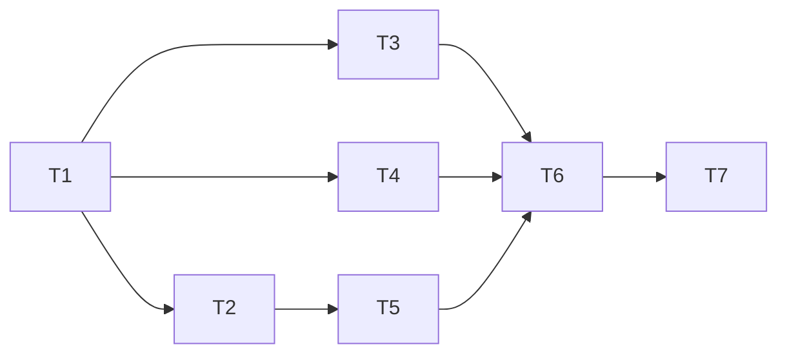

---
作者：@Ray
创建日期：2026-05-29
最后更新：2026-05-29
文档状态：草稿
---

# 任务列表：editor-json-contract（编辑器文档 JSON 契约）

## 任务依赖图
> 由各任务 inline「依赖」字段汇总，仅供速览；以 inline 为准。


并行组：
- Group A：T1（先行：读源码定稿 D2/代码块，落块类型常量）
- Group B：T2, T3, T4（codec / 抽取器 / 自定义块，互不依赖，仅都依赖 T1）
- Group C：T5（图片解析，依赖 T2 的 codec 形态）
- Group D：T6（只读渲染器 + 编辑器接线，集成 T2–T5）
- Group E：T7（导出降级规则，复用抽取器表）

里程碑：
- M1 · 契约可往返（T1–T2）：`content_json` 能 encode/decode、带 docVersion、块类型常量定稿，可供下游引用。
- M2 · 抽取器就绪（T3）：`content_plain` 可生成、标题可取，搜索/预览/标题可对接。
- M3 · 渲染一致（T4, T5, T6）：自定义块（T4）+ 图片引用解析（T5）+ 编辑/只读两端一致渲染（T6）。T6 inline 依赖 T3, T4, T5，其中 T3 已在 M2 交付，T4/T5 同属本里程碑，故三者齐备 M3 方成立。

-----

- [ ] T1 · 确认 AppFlowy 真实结构，定稿块类型常量与 D2/代码块落点

**依赖：** 无 ｜ **关联需求：** R1, R2, R3, R5 ｜ **依据设计：** D1, D2, D3 ｜ **可改文件：** `lib/editor/contract/block_types.dart`、`specs/active/editor-json-contract/design.md`（仅回填【实现时补全】项与块清单表注）

### 背景
契约的事实地基。先读 `packages/appflowy-editor/lib/appflowy_editor.dart` 及 `Document`/`Node`/各 `*BlockKeys`/`image_block_component.dart`/`block_component_service.dart`，确认：① D2 图片落点二选一（自定义 `data.media_id` vs 自定义 url scheme）；② 代码块 `code` 是否内置、是否需插件；③ 自定义 `data` 字段随 `Node.toJson` 透传无损。把结论代码化为块类型/字段常量，并回填 design 的【实现时补全】与块清单表注。
归属说明：design 的回填仅限把「待定」改为「已定」，不改契约决策方向。

### 实施
1. 通读上述源码，记录每种 MVP 块的精确 `type` 与 data key。
2. 拍板 D2 落点（连带确认原生 image builder 对额外字段/非法 url 的容忍度），回填 design D2 与块清单图片行。
3. 拍板代码块归属（MVP 纳入 / 降级移出），回填块清单。
4. 在 `block_types.dart` 定义所有块 type 常量 + 自定义块 location/weather 的 data key 常量（封闭清单 R5 的代码化）。

### 验收标准（做完即止）
- `block_types.dart` 覆盖块清单表每一种块的 type 常量（自动）
- design 中与 D2/代码块相关的【实现时补全】已回填为确定值（人工核查）

### 验收方式
- 自动：
  ```bash
  flutter analyze lib/editor/contract/block_types.dart
  # 断言每种块 type 常量存在（实现时补全断言清单）
  ```
- 人工（@Ray）：
  - 核对 D2 落点结论与原生 image builder 行为一致；代码块归属合理；块清单表注无遗留「待定」

### 验收记录
```
日期：—
自动：—
人工：—（核查人 @Ray）
```

-----

- [ ] T2 · EditorDocCodec 薄封装（encode/decode + docVersion）

**依赖：** T1 ｜ **关联需求：** R1 ｜ **依据设计：** D1 ｜ **可改文件：** `lib/editor/contract/editor_doc_codec.dart`

### 背景
实现 D1 薄封装层：入库结构 `{'docVersion': 1, 'document': {...}}`，`document` 复用 AppFlowy `Document.toJson/fromJson`。提供统一 encode/decode 入口与版本路由（当前仅 v1，迁移表占位）。

### 实施
1. `encode(Document) -> String`：包裹 docVersion + `document`。
2. `decode(String) -> (int version, Document)`：拆版本号、校验、`Document.fromJson` 还原；按 docVersion 路由迁移（v1 直通）。
3. 非法/缺失 docVersion 的容错与显式异常。

### 验收标准（做完即止）
- encode→decode 往返对任意合法文档无损（自动）
- 顶层可读出 docVersion=1（自动）
- 缺 docVersion 字符串走容错而非崩溃（自动）

### 验收方式
- 自动：
  ```bash
  flutter test test/editor/contract/editor_doc_codec_test.dart
  ```

### 验收记录
```
日期：—
自动：—
人工：—（无）
```

-----

- [ ] T3 · content_plain 抽取器（表驱动降级 + 标题取首行）

**依赖：** T1 ｜ **关联需求：** R4, R5, NF1 ｜ **依据设计：** D4 ｜ **可改文件：** `lib/editor/contract/plain_text_extractor.dart`

### 背景
实现 D4 `extractPlainText(Document) -> String`：DFS 遍历，按块清单「content_plain 降级表现」列逐块映射，块间 `\n` 连接；标题取首行；未知块降级取 delta 或跳过；纯同步无 I/O（NF1）。自定义块降级（`📍`/`🌤`）逻辑归本任务（与 T4 自定义块定义解耦：本任务只读 data 产文本，不渲染）。

### 实施
1. 遍历器 + 逐块映射（覆盖清单每种块，含嵌套列表/待办前缀与序号）。
2. 自定义块 location/weather 降级规则（含缺值降级，定稿并回填 design 表注）。
3. 标题取产出文本第一行的 helper。
4. 未知块安全降级。

### 验收标准（做完即止）
- 覆盖块清单每种块类型的降级输出正确（自动，逐块用例）
- 含位置/天气块时产出 `📍 上海` / `🌤 18°C`（自动）
- 标题等于第一行；空文档产出空串（自动）
- 50 块 < 5ms、1000 块 < 50ms（自动 benchmark，满足 NF1）
- 抽取过程无 I/O 调用（自动，mock/断言无文件/DB 访问）

### 验收方式
- 自动：
  ```bash
  flutter test test/editor/contract/plain_text_extractor_test.dart
  flutter test test/editor/contract/plain_text_extractor_bench_test.dart
  ```

### 验收记录
```
日期：—
自动：—
人工：—（无）
```

-----

- [ ] T4 · 位置块 / 天气块自定义节点定义 + BlockComponentBuilder

**依赖：** T1 ｜ **关联需求：** R3 ｜ **依据设计：** D3 ｜ **可改文件：** `lib/editor/contract/blocks/location_block.dart`、`lib/editor/contract/blocks/weather_block.dart`

### 背景
实现 D3 两个自定义块：`location`(`place_name/lat/lng`) 与 `weather`(`weather_code/weather_temp`)，各配编辑态与只读态 BlockComponentBuilder，data 随 `Node.toJson` 无损往返。
职责边界：本任务管块的**定义与渲染 builder**；其 plain 降级文本归 T3，导出降级归 T7，二者只读本任务定义的 data key。

### 实施
1. 定义两块的 node type 与 data key 常量（与 T1 `block_types.dart` 一致，不重复定义）。
2. 编辑态 BlockComponentBuilder（结构化值展示，UI 细节待设计稿，先占位可读样式）。
3. 只读态 builder（供 T6 只读渲染器复用）。
4. data 往返序列化测试。

### 验收标准（做完即止）
- 两块 data 经 `Node.toJson/fromJson` 往返无损（自动）
- 编辑器注册两块后插入/读取不报错（自动 widget test）

### 验收方式
- 自动：
  ```bash
  flutter test test/editor/contract/blocks/custom_blocks_test.dart
  ```

### 验收记录
```
日期：—
自动：—
人工：—（无）
```

-----

- [ ] T5 · 图片节点 media.id 引用解析（ImageUrlResolver）

**依赖：** T2 ｜ **关联需求：** R2 ｜ **依据设计：** D2 ｜ **可改文件：** `lib/editor/contract/image_url_resolver.dart`、`test/editor/contract/image_url_resolver_test.dart`、`test/editor/contract/media_ref_integrity_test.dart`（承接 verification「media.id 引用完整性」的全文路径扫描用例）

### 背景
实现 D2 选定落点：图片节点以 `media.id` 为权威引用键，运行时经 `media.id → media.rel_path → 当前媒体目录` 解析为可读文件（解密流接 media-storage）。`content_json` 中不出现真实路径。
归属说明：本任务只负责「引用键 → 真实文件」解析与自定义 image builder/resolver；media 文件加解密本体归 media-storage，本任务调用其 API。

### 实施
1. 按 T1 定稿的 D2 落点实现解析（自定义 image BlockComponentBuilder 或 url scheme 拦截）。
2. 解析失败（media 不存在）降级占位，不崩溃。
3. 断言序列化后的图片节点 data 不含真实路径。
4. 落 `media_ref_integrity_test.dart`：全文扫描 encode 产物无真实路径串（供 verification「media.id 引用完整性」执行；本任务作者其用例，跨任务断言归 verification）。

### 验收标准（做完即止）
- 图片节点 encode 后不含绝对/相对真实路径，仅含 media.id（自动）
- 给定 media.id 能解析到 mock 文件；缺失时降级占位（自动）

### 验收方式
- 自动：
  ```bash
  flutter test test/editor/contract/image_url_resolver_test.dart
  ```

### 验收记录
```
日期：—
自动：—
人工：—（无）
```

-----

- [ ] T6 · 只读渲染器 + 编辑器接线（共用块清单与解析层）

**依赖：** T3, T4, T5 ｜ **关联需求：** R5, NF2 ｜ **依据设计：** D2, D3 ｜ **可改文件：** `lib/editor/contract/readonly_renderer.dart`、`lib/editor/contract/editor_block_registry.dart`、`test/editor/contract/readonly_renderer_test.dart`、`test/editor/contract/render_consistency_test.dart`（承接 verification NF2 一致性）、`test/editor/contract/block_inventory_consistency_test.dart`（承接 verification 块清单单一来源）

### 背景
把封闭块清单（标准块 + location/weather + image resolver）注册成编辑器与只读渲染器共用的一套 BlockComponentBuilder 集合，确保两端对同一 `content_json` 渲染一致（NF2 的实现侧）。未知块两端均安全降级（R5）。
注：两端「逐块语义一致」与「块清单单一来源」的端到端校验属跨任务，归 verification。本任务作为集成点**作者** `render_consistency_test.dart` / `block_inventory_consistency_test.dart` 的用例骨架（T3–T5 齐备后方可写全），但其作为完成门槛的跨任务断言在 verification 执行，不在本任务验收标准内重复闭环。

### 实施
1. 统一 builder 注册表（标准块 + 两自定义块 + image resolver）。
2. 只读渲染器（editorState 只读模式或等价非编辑组件树）。
3. 未知块降级（跳过/降级段落）。
4. 作者 `render_consistency_test.dart`（编辑/只读两端逐块语义一致）与 `block_inventory_consistency_test.dart`（`block_types.dart` == design 块清单 == 实际识别集合）的用例骨架，供 verification NF2 / 块清单单一来源检查执行。

### 验收标准（做完即止）
- 同一 builder 注册表被编辑器与只读渲染器共同引用（自动，静态断言/单一来源）
- 含未知块的文档只读渲染不崩溃、其余块正常（自动 widget test）

### 验收方式
- 自动：
  ```bash
  flutter test test/editor/contract/readonly_renderer_test.dart
  ```

### 验收记录
```
日期：—
自动：—
人工：—（无）
```

-----

- [ ] T7 · 导出降级规则（复用抽取器降级表）

**依赖：** T6 ｜ **关联需求：** R3, R5 ｜ **依据设计：** D4 ｜ **可改文件：** `lib/editor/contract/export_fallback.dart`

### 背景
把块清单「降级表现」沉淀为导出器可复用的「块 → 文本行」映射，供下游 PDF/HTML 导出 spec 消费；自定义块降级为 `📍`/`🌤` 文本行（与 T3 抽取器同源，不另起一套）。
职责边界：本任务只产出**降级映射 + 自定义块文本行**，不实现 PDF/HTML 排版全流程（归后续 export spec）。

### 实施
1. 抽出 T3 的降级映射为共享表，导出器与抽取器同源引用。
2. 提供 `exportFallbackLine(Node) -> String?`（位置/天气块产文本行，其余块按需）。
3. 一致性测试：同一自定义块，抽取与导出产出同一文本行。

### 验收标准（做完即止）
- 位置/天气块的抽取文本行与导出文本行完全一致（自动）
- 降级映射为单一来源、无重复定义（自动，静态断言）

### 验收方式
- 自动：
  ```bash
  flutter test test/editor/contract/export_fallback_test.dart
  ```

### 验收记录
```
日期：—
自动：—
人工：—（无）
```
