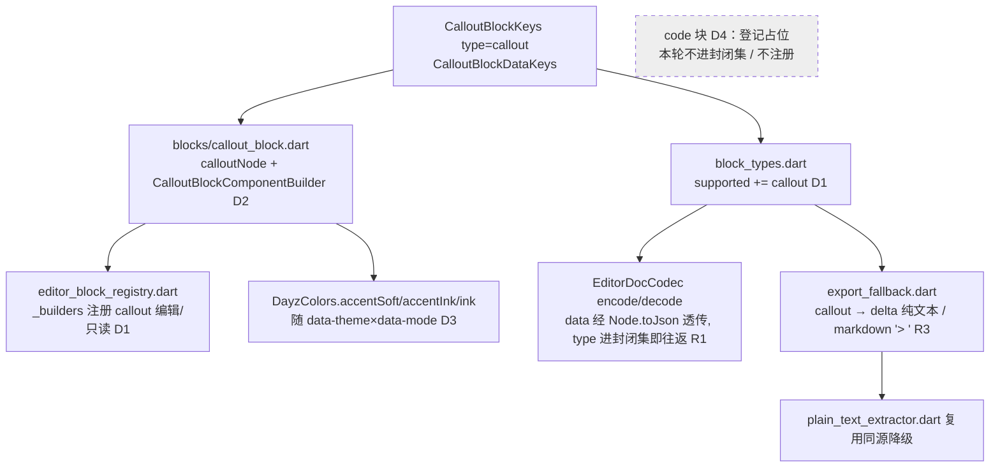

---
作者：@Ray
创建日期：2026-06-06
最后更新：2026-06-06
文档状态：草稿
---

# 设计：editor-rich-blocks（标注块 callout）

> 本 spec 扩展 `editor-json-contract`（已归档）的封闭块清单，新增 DayZ 侧自定义块 callout。所有结构落点对齐既有自定义块 location / weather 的实现路径，不在本文凭空发明字段。

## 已读源码确认的事实基线

- fork 包 `packages/appflowy-editor/lib/src/editor/block_component/` 下**无 callout 目录**，上游**未导出** `CalloutBlockComponentBuilder` / `CalloutBlockKeys`（与 §8c 设计稿「AppFlowy 自带 CalloutBlockKeys」的措辞**不符**——经核实 fork 未 ship，故须 DayZ 侧自建，见 D1）。
- 既有自定义块 location / weather 各由一个 `lib/editor/contract/blocks/<x>_block.dart` 实现：一个 `<x>Node({...})` 工厂 + 一个 `<x>BlockComponentBuilder({readOnly})`（编辑/只读用同一 builder 的 `readOnly` 形参分流）+ 一个带 `SelectableMixin` 的 `BlockComponentStatefulWidget`。
- type 常量收在 `lib/editor/contract/block_types.dart` 的 `EditorBlockTypes`（`location='location'` / `weather='weather'`）+ `supported` 封闭 Set；data key 常量各有 `abstract final class <X>BlockDataKeys`。
- 注册在 `lib/editor/contract/editor_block_registry.dart` 的 `_builders()`：`EditorBlockTypes.location: LocationBlockComponentBuilder(readOnly: readOnly)`。
- codec（`editor_doc_codec.dart`）是薄封装：`encode` = `Document.toJson` 包 `docVersion`；`decode` = 拆包 `Document.fromJson`。自定义块 `data` 由 `Node.toJson/fromJson` 无损透传，**codec 本身无需按 type 改**——往返正确性来自 type 进封闭集 + builder 注册（否则 `decode` 后渲染落 `_UnknownBlockComponentBuilder`）。
- 导出降级在 `export_fallback.dart` 的 `fallbackLineForNode(node)` switch：location → `📍 {place_name}`、weather → `🌤 {temp}°C`；plain 抽取 `plain_text_extractor.dart` 复用该 switch（同源）。
- 主题色：`lib/ui/theme/dayz_colors.dart` 的 `DayzColors`（`ThemeExtension`）有 `accentSoft` / `accentInk` / `ink`，6 套变体（purple/amber/sage × light/dark）经 `DayzTokens.*AccentSoft` 映射自 `tokens.css`；`context.dayz` 取当前主题实例。callout 须经 `Theme.of(context).extension<DayzColors>()` 读取，**随主题切换**。

## 技术决策

### D1 · callout 块的来源：DayZ 侧自建 vs 期待上游 fork 提供
- **状态：** 采纳
- **背景：** §8c 设计稿写「AppFlowy 自带 CalloutBlockKeys，可直接落地」，但核查 fork 包 `block_component/` 下无 callout 目录、未导出 `CalloutBlockComponentBuilder`/`CalloutBlockKeys`。location/weather 是 code/code 块同处境的先例（自建）。
- **选项：**
  - A. 升级 / patch fork 引入上游 callout builder——改 AGPL/MPL 双授权 fork 包、与 `appflowy-patch-tracking` 耦合、上游样式不符设计（左边框那套）。
  - B. **DayZ 侧自建自定义块**，镜像 location/weather 路径：新建 `blocks/callout_block.dart`（`calloutNode` 工厂 + `CalloutBlockComponentBuilder` 编辑/只读 + `CalloutBlockKeys` type='callout' + `CalloutBlockDataKeys`），type 进 `block_types.dart` 封闭集，注册进 registry，降级进 export/plain。
- **选择：** **B**。callout 走与 location/weather 完全一致的自定义块机制。
- **理由：** 不动 fork（不碰双授权包、零上游耦合），样式可直接按 `--accent-soft` 设计稿落地，复用项目已验证的自定义块往返 / 注册 / 降级套路（既有契约测试已覆盖该套路），新增即加法。
- **代价：** callout 不被上游 markdown/html encoder 识别，导出降级须由本契约显式兜底（与 location/weather 同代价，已在 R3 覆盖，可接受）。

### D2 · callout 文本载体：原生 `delta`（一等文本块）vs 自定义 data 字段
- **状态：** 采纳
- **背景：** location/weather 是**无 delta** 的结构化块（值来自 `entries` 字段）。callout 不同——它承载用户自由书写的「一句心得」，需可编辑富文本，且导出降级要取其文字。
- **选项：**
  - A. callout 文字塞进自定义 `data.text` 字符串——丢失行内样式、不可走编辑器原生文本编辑 / 光标 / 选区。
  - B. **callout 用原生 `delta`**（如标准段落 / 引用块），文本与行内样式存 `data.delta`；builder 用文本型块组件（非 location/weather 的 `SelectableMixin` 自绘 selectable），抽取走 `node.delta.toPlainText()`（与段落/引用同路）。
- **选择：** **B**。callout 是**带 `delta` 的文本块**，仅外层容器样式（`--accent-soft` 底 + 图标）自定义。
- **理由：** 复用编辑器原生文本编辑 / 光标 / 选区 / 行内样式，导出降级直接走既有 `_plainText(node)`（`node.delta.toPlainText()`），与段落/引用同源、零新抽取逻辑；对齐原型 `.cb-callout .tx` 是一段可书写文字。`BlockComponentValidate` 取 `node.delta != null`（区别于 location/weather 的 `delta == null`）。
- **代价：** callout builder 不能照抄 location/weather 的 `SelectableMixin` 自绘 selectable（那是无文本块的写法），须以文本型块组件包裹（参考上游 `QuoteBlockComponentWidget` 那类 `delta` 块的容器套法）；多一种 builder 形态，可接受。

### D3 · callout 渲染配色：读 DayzColors 主题扩展 vs 写死色值
- **状态：** 采纳
- **背景：** R2/NF2 要求背景随 data-theme×data-mode 切换、不发明颜色。location/weather 当前用 `Colors.teal/orange.withValues(...)` 写死色——那是 callout **不要**沿用的反例（设计明确要 `--accent-soft` 主题色）。
- **选项：**
  - A. 照抄 location/weather 的 `Colors.<x>.withValues(alpha)` 写死——违 NF2、不随主题。
  - B. **读 `Theme.of(context).extension<DayzColors>()`**：背景 `accentSoft`、图标 `accentInk`、正文 `ink`，圆角用 `--r-md` 对应常量；无左边框。
- **选择：** **B**。callout 容器配色全部经 `DayzColors` 取当前主题色。
- **理由：** 满足 R2（随主题切换）与 NF2（不发明颜色、单一真源）；编辑器在 `MaterialApp` 主题树下，`DayzColors` 扩展必然在 context 可达。
- **代价：** 若编辑器某处脱离 DayZ 主题树渲染（理论极端），`extension<DayzColors>()` 为 null——以非空断言 + 测试覆盖（widget test 在 DayZ 主题下渲染）兜住；正常集成路径不触发。

### D4 · 代码块（code）本轮处置：登记占位 vs 实现
- **状态：** 采纳
- **背景：** handoff §7 把代码块**再定档为「做」**；但 `editor-json-contract` design.md（archive，:91/:139）当初**刻意把 code 移出 MVP**（fork 默认 `standardBlockComponentBuilderMap` 未注册 code builder，会渲染成「[未支持块]」）。@Ray 决定本轮**不实现** code、只在本 spec 登记，避免遗失。
- **选项：** A. 本轮一并实现 code（超出本轮范围）｜ B. **仅立占位卡登记**（再定档结论 + 当初移出 MVP 理由 + 将来落地路径 + 验收 `N/A（后置）`），标记后置。
- **选择：** **B**。code 立占位卡，本轮不写实现、不进封闭集。
- **理由：** code 与 callout 同属「fork 未现成 ship、须 DayZ 侧按自定义块自建」路径（§7 注「AppFlowy 自带 CodeBlockKeys」同样待核实），将来落地沿用本 spec 的 callout 套路即可；登记在案使后置不丢，符合 spec-guide「衍生想法记入新任务、不在本任务顺手扩展」。
- **代价：** 封闭集本轮仍不含 code，`content_json` 里若出现 code 块会落 `_UnknownBlockComponentBuilder`（不崩溃，沿用 `editor-json-contract` 既有未知块兜底）——这是后置的已知现状，可接受。

## 架构

## 文件变更

> 均落在 `lib/editor/contract/`（单模块 = `dayz` app 包；本 spec 不跨模块）。新建 Dart 文件须带 MPL-2.0 文件头（仓库约定，对齐既有 contract 文件）。

- `lib/editor/contract/blocks/callout_block.dart`     新建（D1/D2/D3 `calloutNode` 工厂 + `CalloutBlockComponentBuilder` 编辑/只读 + 文本型块组件读 `DayzColors`；MPL-2.0 头）
- `lib/editor/contract/block_types.dart`              修改（`EditorBlockTypes.callout='callout'` + 进 `supported` 封闭集 + 新增 `CalloutBlockDataKeys`）
- `lib/editor/contract/editor_block_registry.dart`    修改（`_builders()` 注册 `EditorBlockTypes.callout: CalloutBlockComponentBuilder(readOnly: readOnly)`，import callout_block）
- `lib/editor/contract/export_fallback.dart`          修改（`fallbackLineForNode` switch 增 callout 分支：plain = delta 文本、markdown = `> ` 前缀）
- `test/editor/contract/blocks/callout_block_test.dart`        新建（callout 往返 + 渲染 widget test + 主题色断言）
- `test/editor/contract/block_types_test.dart`                 修改（封闭集断言增 callout、新增 data key 断言；既有 location/weather 断言不动）
- `test/editor/contract/export_fallback_test.dart`            修改（callout plain / markdown 降级断言）
- `patrol_test/editor_callout_visual_test.dart`               新建（R2 视觉：真机渲染 callout，截图 + 校验主题 accentSoft 跟随；dependsOn e2e-harness）

## 已知风险

- **扩展的是已归档的封闭契约**：`editor-json-contract` 已归档、终态只读，不能就地改其封闭集。本 spec 按 spec-guide「返工新建 spec」承载扩展，README「依赖」列登记对该契约的依赖；契约文档里的「MVP 块集合 = 封闭集」表述在本 spec 语境下被显式扩了 callout（NF3 保证既有块不回归）。
- **fork 不 ship callout/code builder**：§8c/§7 设计稿措辞「AppFlowy 自带 Callout/CodeBlockKeys」与 fork 实况不符——经核实 `block_component/` 无对应目录，故 D1 走 DayZ 侧自建。若日后升级 fork 引入上游 callout，须评估样式（上游可能带左边框）与本自建实现的取舍。
- **代码块后置**：code 块本轮不实现（D4），封闭集不含 code，`content_json` 出现 code 块会落未知块兜底（不崩溃）；将来落地按本 spec callout 套路另起任务。
- **location/weather 现用写死色（`Colors.teal/orange`）未随主题**：callout 不沿用该反例（D3 读 DayzColors）；location/weather 的主题化改造**不在本 spec 范围**，仅在此记录差异，避免误把 callout 也写死。
- callout 用 `delta`（D2），与无 delta 的 location/weather `BlockComponentValidate` 相反（`delta != null`）；实现时须注意 validate 取反，否则节点被判非法。
