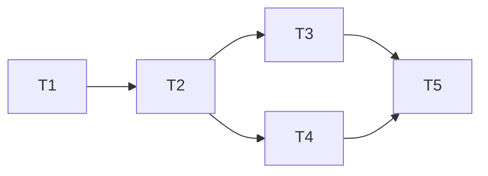

---
作者：@Ray
创建日期：2026-06-06
最后更新：2026-06-06
文档状态：草稿
---

# 任务列表：editor-rich-blocks（标注块 callout）

## 任务依赖图
> 由各任务 inline「同 spec 依赖」字段汇总，仅供速览；以 inline 为准。


并行组：
- Group A：T1
- Group B：T2
- Group C：T3, T4（block 注册 / 导出降级可并行）
- Group D：T5（端到端 + 视觉，归 verification）
- 独立：T6（代码块后置登记，不阻塞、不被阻塞）

（无可独立交付 / 演示的中间切点——callout 需「注册 + codec + 降级」三者齐备才对用户产生价值，故不设里程碑。）

-----

- [ ] T1 · callout type 常量 + data key（进封闭集）

**同 spec 依赖：** 无 ｜ **跨 spec 依赖：** editor-json-contract：EditorBlockTypes 封闭块清单 + supported 集 ｜ **关联需求：** R1 ｜ **依据设计：** D1, D2 ｜ **可改文件：** `lib/editor/contract/block_types.dart`, `test/editor/contract/block_types_test.dart`

### 背景
callout 进封闭契约的第一步：把 `type='callout'` 常量与其 data key 加进 `EditorBlockTypes`。这是 codec 往返正确性的前置——type 不进 `supported`，`decode` 后会落 `_UnknownBlockComponentBuilder`。归属点明：本任务只动常量与封闭集，不写 builder（归 T2）、不动注册表（归 T3）。

### 实施
1. `EditorBlockTypes` 增 `static const String callout = 'callout';`
2. `supported` 封闭 Set 加入 `callout`（保持其余成员不变）
3. 新增 `abstract final class CalloutBlockDataKeys`，定义 callout 的 `delta` 之外若需的 data key（本轮 callout 文本走原生 `delta`，data key 仅在需要时定义，如无额外结构化字段则该类可只占位/省略——以 D2「文本走 delta」为准，不发明多余字段）

### 验收标准（做完即止）
- `EditorBlockTypes.callout == 'callout'`，且 `EditorBlockTypes.supported` 含 `callout`、仍含原 location/weather 等全部既有成员（自动）
- `block_types_test` 既有 location/weather/标准块断言不回归（自动，NF3）

### 验收方式
- 自动：
  ```bash
  flutter test test/editor/contract/block_types_test.dart
  ```
  （测试断言 `supported` 集合的实际成员含 callout 且未丢既有成员，**不** grep 源文件）

### 验收记录
```
日期：—
自动：—
人工：N/A
```

-----

- [ ] T2 · CalloutBlockComponentBuilder（编辑/只读，主题色渲染）

**同 spec 依赖：** T1 ｜ **跨 spec 依赖：** appflowy-editor：BlockComponentBuilder / 文本型块组件基类；editor-json-contract：自定义块 builder 落法（location/weather 先例） ｜ **关联需求：** R2 ｜ **依据设计：** D2, D3 ｜ **可改文件：** `lib/editor/contract/blocks/callout_block.dart`, `test/editor/contract/blocks/callout_block_test.dart`

### 背景
新建 callout 自定义块组件，镜像 location/weather 的文件形态，但按 D2 用原生 `delta` 文本载体、按 D3 读 `DayzColors` 主题色。这是 callout 能被渲染（而非落未知块）的核心件。

### 实施
1. 新建 `blocks/callout_block.dart`（MPL-2.0 文件头），定义 `CalloutBlockKeys`（type='callout'）与 `Node calloutNode({String? text / Delta? delta})` 工厂
2. `CalloutBlockComponentBuilder({readOnly})`：`validate` 取 `node.delta != null`（区别 location/weather 的 `delta == null`，见 D2 代价）
3. 块组件容器：背景 `Theme.of(context).extension<DayzColors>()!.accentSoft`、信息图标色 `accentInk`、正文/delta 文本色 `ink`、圆角对齐 `--r-md`；**不画左边框配色**（D3）
4. 用文本型块组件呈现 `delta`（参考上游 quote/paragraph 那类 delta 块的容器包裹，复用编辑器原生文本编辑/光标/选区）

### 验收标准（做完即止）
- callout 在 amberDark 主题下渲染，容器背景 == `DayzColors.amberDark.accentSoft`、图标 == `accentInk`（自动，widget test 取实际渲染色断言，满足 R2）
- 切到 sageLight 主题重渲染，背景 == `DayzColors.sageLight.accentSoft`（自动，证随主题切换）
- 渲染树中**不存在**左边框装饰（自动，断言容器 decoration 无 `border-left` 等价物，满足 R2「无左边框」）
- callout 的 `delta` 文本在渲染中可见（自动）

### 禁止
- 不写死 `Colors.*` / hex 色（违 NF2）；不沿用 location/weather 的 `Colors.teal/orange.withValues` 写法
- 不实现工具栏/格式面板插入入口（归 editor-integration-screen）

### 验收方式
- 自动：
  ```bash
  flutter test test/editor/contract/blocks/callout_block_test.dart
  ```
  （在 `MaterialApp(theme: DayzThemes.amberDark)` 下渲染 callout，读容器 `BoxDecoration.color` 与图标色断言等于对应 `DayzColors` 取值；切主题重测；**不** grep 源文件）

### 验收记录
```
日期：—
自动：—
人工：N/A
```

-----

- [ ] T3 · 注册 callout 进 EditorBlockRegistry（编辑/只读）+ codec 往返

**同 spec 依赖：** T2 ｜ **跨 spec 依赖：** editor-json-contract：EditorDocCodec 薄封装 + editor_block_registry _builders ｜ **关联需求：** R1 ｜ **依据设计：** D1 ｜ **可改文件：** `lib/editor/contract/editor_block_registry.dart`, `test/editor/contract/blocks/callout_block_test.dart`

### 背景
把 T2 的 builder 注册进 `_builders()`，使 `decode` 后的 callout 走 `CalloutBlockComponentBuilder` 而非 `_UnknownBlockComponentBuilder`。codec 本身无需改（`data`/`delta` 经 `Node.toJson/fromJson` 透传，往返正确性 = type 进封闭集[T1] + builder 注册[本任务]）。归属点明：往返测试断言归本任务（依赖 T2 的 `calloutNode` 工厂 + 注册）。

### 实施
1. `editor_block_registry.dart` import `blocks/callout_block.dart`
2. `_builders()` 加 `EditorBlockTypes.callout: CalloutBlockComponentBuilder(readOnly: readOnly)`（编辑/只读经 `readOnly` 形参分流，对齐 location/weather）
3. 验证 `EditorDocCodec.encode/decode` 对含 callout 的文档无损往返

### 验收标准（做完即止）
- 含 callout（带 `delta` 文本）的 `Document` 经 `EditorDocCodec.encode` → `decode` 后，该节点 `type=='callout'`、`delta` 文本逐字一致（自动，R1）
- `decode` 后用 `EditorBlockRegistry.editableBuilders()` / `readonlyBuilders()` 渲染该文档，callout 走 `CalloutBlockComponentBuilder`、**不**落 `_UnknownBlockComponentBuilder`（自动）

### 验收方式
- 自动：
  ```bash
  flutter test test/editor/contract/blocks/callout_block_test.dart
  ```
  （构造含 callout 的 Document → encode → decode → 断言节点 type/delta 文本相等；渲染 decode 结果断言无「[未支持块]」兜底文案；**不** grep 源文件）

### 验收记录
```
日期：—
自动：—
人工：N/A
```

-----

- [ ] T4 · callout 导出降级（plain / markdown）

**同 spec 依赖：** T1 ｜ **跨 spec 依赖：** editor-json-contract：EditorExportFallback 降级表 + EditorPlainTextExtractor 同源抽取 ｜ **关联需求：** R3 ｜ **依据设计：** D2 ｜ **可改文件：** `lib/editor/contract/export_fallback.dart`, `test/editor/contract/export_fallback_test.dart`

### 背景
callout 须有导出降级，否则导出时落 `_unknownFallback`（语义丢失）。callout 文本走 `delta`（D2），降级直接取 `node.delta.toPlainText()`——与段落/引用同源；markdown 用 `> ` 前缀标注「标注」语义。plain 抽取（`plain_text_extractor.dart`）复用 `fallbackLineForNode` switch，本任务改 switch 即同时覆盖 plain（不另改抽取器文件）。

### 实施
1. `fallbackLineForNode` 的 switch 增 `case EditorBlockTypes.callout:` 分支：返回 `_plainText(node) ?? ''`（plain 形态，与段落一致）
2. markdown 降级：callout 行加 `> ` 前缀（沿用 quote 的 markdown 习惯标注语义）——若 export_fallback 当前只产单一 plain 形态，则按其既有结构以最小改动表达 callout 的 markdown 前缀（不引入新导出文件）
3. callout `delta` 为空时降级为空字符串、整条抽取不抛（NF1 纯同步、不崩溃）

### 验收标准（做完即止）
- callout（`delta`="记得复盘"）经 `EditorExportFallback.fallbackLineForNode` 得含 `记得复盘` 的行；markdown 形态前缀为 `> `（自动，R3）
- 含 callout 的文档经 `EditorPlainTextExtractor.extract` 产出含该文本的一行（证 plain 与降级同源）（自动）
- callout `delta` 为空时降级为空字符串、`extract` 不抛异常（自动，NF1）
- 既有 location/weather/标准块降级断言不回归（自动，NF3）

### 验收方式
- 自动：
  ```bash
  flutter test test/editor/contract/export_fallback_test.dart
  ```
  （构造 callout 节点，断言降级行文本与 markdown 前缀、空 delta 降级为空且不抛；跑既有用例证不回归；**不** grep 源文件）

### 验收记录
```
日期：—
自动：—
人工：N/A
```

-----

- [ ] T5 · callout 端到端串联（插入→渲染→codec→降级）+ 视觉

**同 spec 依赖：** T3, T4 ｜ **跨 spec 依赖：** e2e-harness：patrol_test/ 落点 + scripts/patrol_test.sh 零执行守卫 ｜ **关联需求：** R1, R2, R3 ｜ **依据设计：** D1, D2, D3 ｜ **可改文件：** `patrol_test/editor_callout_visual_test.dart`

### 背景
本任务只承载**跨任务**校验（依赖 T2 builder + T3 注册/codec + T4 降级三者同时存在）——故端到端串联与视觉验收归 verification.md，本卡只交付 Patrol 视觉用例文件。归属点明：T2/T3/T4 的单项断言各自在其卡内验证；本卡是把它们串成「插入→渲染→codec 往返→导出降级」一条链 + 真机视觉（accentSoft 跟随主题），二者不重复。

### 实施
1. 新建 `patrol_test/editor_callout_visual_test.dart`（MPL-2.0 头），在真机/模拟器启动含 callout 的编辑器
2. 截图 callout 渲染态，校验背景为当前主题 `--accent-soft`（视觉信号 = 截图工件，非「测试跑过」）
3. 跑 `bash scripts/patrol_test.sh -d <device> --target patrol_test/editor_callout_visual_test.dart`，校验输出 `Total:` 非零（零执行守卫）

### 验收标准（做完即止）
- Patrol 用例在设备上渲染 callout 并产出截图工件，`Total:` ≥ 1、`Failed:` = 0（自动，R2 视觉）
- 端到端链路（插入 callout → encode/decode 往返 → 导出降级文本）在 verification.md 功能验证表勾选通过（见 verification.md）

### 验收方式
- 自动：
  ```bash
  bash scripts/patrol_test.sh -d <device-id> --target patrol_test/editor_callout_visual_test.dart
  ```
  （真机渲染 + 截图工件 + 零执行守卫校验 `Total:` 非零）
- 人工（仅最终手感签收，Patrol 截图已覆盖主体）：
  - @Ray 复核截图：callout 暖调 `--accent-soft` 底与设计稿质感一致、无左边框俗套

### 验收记录
```
日期：—
自动：—
人工：待确认（核查人 @Ray）
```

-----

- [ ] T6 · 代码块（后置，本轮不实现）

**同 spec 依赖：** 无 ｜ **跨 spec 依赖：** 无 ｜ **关联需求：** R4 ｜ **依据设计：** D4 ｜ **可改文件：** 无（本轮不实现，登记占位）

### 背景
**本轮不实现，仅登记后置。** 记录：
- **设计再定档**：handoff `ui-design/current/docs/handoff/editor.md` §7 把代码块再定档为「做（不删）」，原型侧 2026-06-04 已落地格式面板「列表与块」的代码块按钮（`data-block=code`，radio 互斥）。
- **当初移出 MVP 的理由**：`editor-json-contract` design.md（archive，:91 表注 / :139 已知风险）确认 fork 默认 `standardBlockComponentBuilderMap` 未注册 code builder，code 块会渲染成「[未支持块]」，故**刻意移出 MVP**待定 builder 方案。
- **将来落地路径**：与 callout 同——DayZ 侧按自定义块自建（§7 注「AppFlowy 自带 CodeBlockKeys」同样待核实 fork 是否 ship；若未 ship 则自建 `CodeBlockComponentBuilder`），type='code' 进 `block_types.dart` 封闭集、注册进 `editor_block_registry.dart`、内容样式 mono + `--bg-2` 底 + `--hairline` 边框，导出降级按代码围栏 ` ``` `。落地时另起任务（不在本卡顺手扩展）。
- **入口归属**：格式面板「列表与块」段的代码块入口归 `editor-integration-screen`（与 callout 入口同处）。

### 实施
- 本轮无实施（占位登记）。将来解冻时按上述路径另立任务。

### 验收标准（做完即止）
- 本卡作为后置登记存在，记录再定档结论 + 移出 MVP 理由 + 落地路径 + 入口归属（登记完整即止）

### 禁止
- 本轮 MUST NOT 在 `block_types.dart` 的 `supported` 加 `code`、MUST NOT 在 `editor_block_registry.dart` 注册 code builder、MUST NOT 写 code block 组件（范围外，R4）

### 验收方式
- 自动：N/A（后置，无实现产物可验）
- 人工：
  - N/A（后置）——本卡为登记占位，不参与本轮完成判定的自动/人工核查

### 验收记录
```
日期：—
自动：N/A（后置）
人工：N/A（后置）
```
