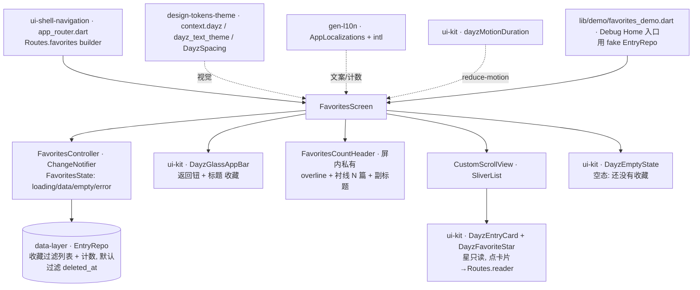

---
作者：@Ray
创建日期：2026-05-29
最后更新：2026-05-29
文档状态：草稿
---

# 设计：favorites-screen

> 视觉与映射依据：屏源 [`ui-design/current/pages/screens/favorites.html`](../../../ui-design/current/pages/screens/favorites.html)（`?state=default|empty`）；方法论 [`docs/design/10-ui-restore-and-design-sync.md`](../../../docs/design/10-ui-restore-and-design-sync.md) §1（分层）/§3（朴素列表、跨屏外壳复用）/§4（四闸）/§9（页面级·W2）/§10（动 lib/ui 红线）/§11（验收口径）；组件类名与最小 HTML 真源 [`ui-design/current/docs/DESIGN-REF.md`](../../../ui-design/current/docs/DESIGN-REF.md) §3（`.entry`/`.timeline`）/§3c（`.empty`/`.pg`/`.app-top` 骨架）/§5（收藏星唯一 path）；HTML→Flutter 机制映射 [`ui-design/current/docs/PROTOTYPE-ARCH.md`](../../../ui-design/current/docs/PROTOTYPE-ARCH.md) §6（`?state=` 多状态 / `.app-top`+`.app-scroll` / 覆盖式毛玻璃顶栏 / `go_router`）。复用契约来自：`ui-kit-components`（`DayzEntryCard` / `DayzFavoriteStar` / `DayzEmptyState` / `DayzGlassAppBar` / `components.dart` barrel / `AppLocalizations` / `dayzMotionDuration`）、`ui-shell-navigation`（`Routes.favorites` / `Routes.reader` / `app_router.dart`）、`data-layer`（`EntryRepo`）、`design-tokens-theme`（`context.dayz.*` / `DayzSpacing` / `dayz_text_theme` / `intl` 约定）。

## 技术决策

### D1 · 列表实现：朴素 `ListView`，不套时间线复杂度
- **状态：** 采纳
- **背景：** 收藏屏与时间线共用卡片 `.entry`，但设计稿 favorites.html 只有一个无吸顶头、无日历、无无限滚动的 `.timeline` 容器（直接平铺 `.entry`）。方法论 §3 与本 spec 范围明确：收藏数据稀疏，刻意保持简单。
- **选项：** (A) 复用时间线屏的 `CustomScrollView` + `SliverPersistentHeader`(月份吸顶) + `scrollable_positioned_list` + 无限滚动；(B) 朴素 `ListView`（或 `CustomScrollView` 仅含 `DayzGlassAppBar` sliver + `SliverList`），计数头作为列表首项，一次性取全部收藏；(C) 自绘滚动。
- **选择：** B。屏体 = `CustomScrollView`，第一个 sliver 是 `DayzGlassAppBar`（与时间线共用同一毛玻璃顶栏壳，得到滚动浮起 + 覆盖状态栏），其后一个 `SliverList`：首项渲染计数头（屏内私有组件 `FavoritesCountHeader`），其余项逐条 `DayzEntryCard`。不引入月份分段头、不引入 `ItemScrollController` 跳转、不做向上分页。
- **理由：** 「收藏 = 过滤变体、别套时间线复杂度」是本 spec 的核心约束；朴素列表既满足设计稿（其只有平铺 `.entry`），又避免把时间线屏的吸顶/跳转/分页风险带进来。计数头放进列表首项随之滚走，符合 favorites.html 里计数头在 `.app-scroll` 内（非吸顶）。
- **代价：** 收藏极多（理论数千）时一次取全量无虚拟分页；但收藏本就稀疏（语义即「值得再读的少数」），可接受；若日后超量，升级为分页是独立小改、不影响本结构。

### D2 · 屏内状态机：default / empty / loading / error 四态，同一 Widget 按 state 渲染
- **状态：** 采纳
- **背景：** PROTOTYPE-ARCH §6 把 `?state=` 映射为「页面入参 + 状态管理：空/有数据/加载 用同一 Widget 按 state 渲染」。favorites.html 给了 `default`/`empty` 两态；真实数据驱动屏还必有 loading 与 error 工程态（R6）。
- **选项：** (A) 只实现 default/empty，loading/error 不画（留白屏风险）；(B) 一个 `FavoritesState`（sealed/enum + 数据）四态，`FavoritesScreen` 按态 switch 渲染同一骨架；(C) 用 `FutureBuilder` 直接吃 `EntryRepo` Future。
- **选择：** B。轻量状态：屏自带一个 `FavoritesController`（`ChangeNotifier`，与 shell `theme_controller` / kit `dayzMotionDuration` 同构的最小本地状态，不引第三方状态库），持 `FavoritesState`（`loading` / `data(entries, count)` / `empty` / `error(message)`）；`FavoritesScreen` 监听并按态渲染：loading→克制占位、data→计数头+列表、empty→`DayzEmptyState`、error→非崩溃错误占位。取数经注入的 `EntryRepo`（构造入参，便于 widget test 注入 fake）。
- **理由：** 显式四态杜绝「未定义态白屏」；`ChangeNotifier` + 注入 Repo 让屏可用 fake repo 独立 widget test（不连真 DB、守 NF1）；`FutureBuilder`(C) 难表达 empty 与 error 的差异化文案且不便注入。
- **代价：** 多一个本地 controller；微小，且换来可测性与四态清晰。

### D3 · 取数接口形态（向 `data-layer` 声明所需，按交付物名引用）
- **状态：** 采纳
- **背景：** 收藏过滤 + 计数归 `EntryRepo`（data-layer D6：EntryRepo 承担跨表组合查询；D7：查询入口默认过滤 `deleted_at`）。本屏只调用，不实现。
- **选项：** (A) 本屏自己写收藏过滤查询（违 NF5/data-layer 边界，否决）；(B) 调 `EntryRepo` 的「收藏列表 + 计数」方法。
- **选择：** B。本屏依赖 `EntryRepo` 暴露**两项能力**（按交付物名引用，签名以 data-layer 定稿为准）：① 取收藏条目列表（未删除、`is_favorite=true`、entry 时间倒序，返回供卡片渲染的 entry + 关联首图缩略图 `ImageProvider` + 标签/地点/心情 meta 的视图模型）；② 收藏总数计数。**若 data-layer 尚未暴露恰好这两个方法名**：本 spec 不擅自在屏里写 Drift，而是在 `EntryRepo` 上以「收藏过滤」语义对齐（具体方法名/DTO 在 data-layer 与本 spec 接线时敲定，记入「已知风险·跨 spec 依赖」与 openQuestions）；data-layer 未就绪期 demo 用内存 fake repo 跑通。
- **理由：** 取数集中过 Repository、本屏纯展示，守 NF1 硬红线，且 fake repo 让屏可独立验收。
- **代价：** 依赖 data-layer 暴露恰当的收藏过滤入口；未就绪期用 fake，落库接线后只接线不返工。

### D4 · 计数头 `FavoritesCountHeader`：屏内私有组件，不进 DESIGN-REF / ui-kit
- **状态：** 采纳
- **背景：** favorites.html 的计数头（overline「★ 收藏」+ 衬线大标题「19 篇值得再读的」+ 副标题）是**收藏屏专属**、DESIGN-REF §3/§3b **未登记为可复用组件**（其样式在 favorites.html 内联 `style=`，属屏内私有值）。方法论 §3 + ui-kit D7 边界：只跨屏复用件进 ui-kit，屏内一次性件留各屏。
- **选项：** (A) 把它升级为 ui-kit 跨屏件（无第二屏复用，过度）；(B) 作为本屏私有 widget `FavoritesCountHeader` 落 `lib/ui/favorites/`，视觉走 token、文案走 `AppLocalizations`、计数走 `intl`。
- **选择：** B。`FavoritesCountHeader(count)`：overline 行（`DayzFavoriteStar`/规范星 path 着 `--favorite` + 「收藏」着 `--accent-ink`）+ 衬线大标题（`dayz_text_theme` 的衬线大字角色 + `intl.NumberFormat` 格式化 count + `AppLocalizations` 模板）+ 副标题（`--ink-2`）。**屏内私有视觉值**（如大标题 25px/600、上下间距）从 favorites.html 的内联 CSS 核定，反查 token；不在 token 里的硬编码值按方法论 §4 标红给设计侧、就近用最接近的排版角色/间距档对齐（记入已知风险）。
- **理由：** 无跨屏复用证据，升 ui-kit 是 scope creep；屏内私有件落本屏符合「屏内一次性件留各屏」。
- **代价：** 若日后另有屏需同款计数头，再升 ui-kit（独立小改）；当前不预造。

### D5 · 接入 shell 路由：替换 `Routes.favorites` 占位 builder（跨 spec 协调文件）
- **状态：** 采纳
- **背景：** `ui-shell-navigation` D1/D2 已为「全部屏」建 `GoRouter` 路由表，`Routes.favorites` 当前指向统一 `PlaceholderScreen`；页面级 spec 就绪后「把 `builder` 换成真实屏……由各屏 spec 在其文件变更里改 `app_router.dart` 的对应行——归属在 README/各屏 spec 协调」（shell D1 原文）。
- **选项：** (A) 不接路由，仅 demo 可见（屏成孤岛）；(B) 由本 spec 改 `app_router.dart` 中 `Routes.favorites` 那一行 builder：`PlaceholderScreen` → `FavoritesScreen`（注入 `EntryRepo`）。
- **选择：** B，且**严格限定改动范围**：只改 `app_router.dart` 内 `Routes.favorites` 对应的那一条路由 `builder`（及必要的 import），不动 `Routes` 常量定义、不动其他屏的 builder、不动 not-found。该文件归属 `ui-shell-navigation`，本 spec 按 shell D1 授权的「页面级 spec 替换自己那一行 builder」改它，列入 `## 文件变更` 并标注「跨 spec 协调·仅改 favorites 那一行 builder」。
- **理由：** 让收藏屏经抽屉「浏览 › 收藏」真正可达（不止 demo），符合 shell D1 预留的替换机制；范围锁到一行 builder，避免越界改外壳。
- **代价：** 触碰 `ui-shell-navigation` 归属的文件——已在 `## 文件变更` 显式声明、范围锁定一行 builder，并在 README 依赖列体现对 shell 的依赖；若 shell 尚未定稿（其 `app_router.dart` 未落地），本 spec 该改动延后到 shell 就绪、demo 入口先行（记已知风险）。

### D6 · 卡片星标只读、取消收藏不在本屏
- **状态：** 采纳
- **背景：** favorites.html 卡片里的 `.star` 是已点亮展示，无就地切换交互；取消收藏的写操作（改 `is_favorite`）属落库行为。
- **选项：** (A) 本屏卡片星标可点切换、乐观从列表移除（需写库 + 撤销 toast，复杂且触 data-layer 写入）；(B) 本屏星标只读，取消收藏在阅读/编辑页完成（本屏只读不写）。
- **选择：** B。`DayzEntryCard` 在本屏以「收藏星点亮、不可点」配置渲染；本屏不持有任何写库能力、不实现取消收藏。
- **理由：** 守「展示屏不写库」、收敛本 spec 范围；取消收藏的乐观更新 + 撤销 + 列表 diff 动画是独立交互，MVP 不做（requirement 范围外）。
- **代价：** 用户在本屏看到一篇想取消收藏，需进阅读页操作；可接受（与设计稿一致）。

## 架构

## 文件变更

> 这是本 spec 任务「可改文件」的**唯一来源与上界**；任一任务可改文件 MUST ⊆ 本清单。新建 Dart 文件 MUST 加 MPL-2.0 头注。本屏文件落 `lib/ui/favorites/` 与 `test/ui/favorites/`；不列入别的模块/别的 spec 文件，**例外**是 D5 授权的 `app_router.dart` 一行 builder 替换，以及本屏 zh/en ARB key + gen-l10n 产物。

**屏体 `lib/ui/favorites/`（本 spec 新建）**
- `lib/ui/favorites/favorites_screen.dart`        新建（屏骨架：`CustomScrollView` + `DayzGlassAppBar` + 计数头 + `SliverList`(`DayzEntryCard`) / `DayzEmptyState`；按 `FavoritesState` 四态渲染；点卡片→`Routes.reader`）
- `lib/ui/favorites/favorites_controller.dart`    新建（`ChangeNotifier` + `FavoritesState`(loading/data/empty/error)；构造注入 `EntryRepo`；调收藏过滤列表 + 计数）
- `lib/ui/favorites/favorites_count_header.dart`   新建（屏内私有 `FavoritesCountHeader`：overline + 衬线大标题(intl 计数) + 副标题，视觉走 token、文案走 `AppLocalizations`，D4）

**跨 spec 协调（按对应 spec 授权机制改，范围锁定）**
- `lib/ui/shell/app_router.dart`                  修改（**仅** `Routes.favorites` 那一条路由的 `builder`：`PlaceholderScreen` → `FavoritesScreen`，加必要 import；不动 `Routes` 常量、不动其他屏 builder、不动 not-found。归属 `ui-shell-navigation`，依 shell D1 授权页面级 spec 替换自己那一行，D5）
- `lib/l10n/arb/app_zh.arb`、`lib/l10n/arb/app_en.arb`               修改（补收藏屏 zh/en 文案 key：顶栏标题、overline、计数头标题模板、副标题、空态标题/说明、加载/错误占位文案、相关 Semantics 标签）
- `lib/l10n/gen/app_localizations*.dart`                            修改（`flutter gen-l10n` 生成产物）

**Debug Home 入口 `lib/demo/`**
- `lib/demo/favorites_demo.dart`                  新建（用内存 fake `EntryRepo` 渲染收藏屏，可切 default/empty/loading/error 四态走查；真机看收藏屏的唯一入口，data-layer/shell 未全就绪时也能跑）
- `lib/demo/demo_entry.dart`                      修改（**仅末尾追加一行**，不插中间、不改 `DemoEntry` 字段）

**测试目录（白名单 hook 对 `test/**/*_test.dart` 自动放行；非 `_test.dart` 的共享基建由任务 `验收基建` 字段预批）**
- `test/ui/favorites/`                            新建（屏 widget test + 控制器 test + 几何/样式参数断言 + golden 基线 + fake repo helper）

> **不列入**：`DayzEntryCard`/`DayzFavoriteStar`/`DayzEmptyState`/`DayzGlassAppBar` 等组件本体（归 `ui-kit-components`）、`EntryRepo`/任何 `lib/data/` 文件（归 `data-layer`）、`Routes` 常量定义本身与其他屏 builder（归 `ui-shell-navigation`）、token/`dayz_text_theme`（归 `design-tokens-theme`）、`pubspec.yaml`（本 spec 不新增依赖——`flutter_svg`/`go_router`/`widgetbook`/`intl` 已由前置 spec 引入；本屏不引入新包）。

## 已知风险

- **跨 spec 依赖（按交付物名引用，可能尚未实现 → 降级/待确认）**：
  - `ui-kit-components`（README 依赖列已登记）：`DayzEntryCard`（星只读配置 + `ImageProvider` 封面 + 点击回调）、`DayzFavoriteStar`、`DayzEmptyState`、`DayzGlassAppBar`（返回钮 + 标题）、`components.dart` barrel、`dayzMotionDuration`。**强依赖**——若未定稿本 spec 阻塞（READY 门）。`DayzEntryCard` 是否暴露「星只读」「点击回调」「meta 可选」恰当入参 **待确认**（与 ui-kit 接线时核对其 API，必要时回填）。
  - `ui-shell-navigation`（README 依赖列已登记）：`Routes.favorites`/`Routes.reader` 常量、`app_router.dart` 占位 builder 与「页面级 spec 替换自己那一行」机制（D5）。**未就绪时降级**：路由替换延后，先经 `lib/demo/favorites_demo.dart` 可达；`Routes.reader` 携 entryId 的导航参数形态 **待确认**（与 shell/reader 对齐）。
  - `data-layer`（README 依赖列已登记）：`EntryRepo` 的「收藏过滤列表（未删 + `is_favorite` + 倒序 + 卡片视图模型含首图 `ImageProvider`/meta）」与「收藏计数」两项能力（D3）。**方法名/DTO 待确认**（与 data-layer 定稿对齐，本 spec MUST NOT 擅自写 Drift 兜底）；**未就绪时降级**：demo + widget test 用内存 fake `EntryRepo`，落库接线后只接线不返工。
  - `design-tokens-theme`（README 依赖列已登记）：`context.dayz.*`、`DayzSpacing`/`DayzRadii`/`DayzMotion`、`dayz_text_theme` 衬线大字角色、`intl` 约定、对比度 NF1 真源。**强依赖**。
  - `design-sync-automation`（**非 README 依赖**，仅验证基建关系）：参数/几何抽取 harness、`screens.yaml` pinned hash、SSIM 兜底。本 spec 的样式参数闸/布局几何闸用 Flutter 原生 `tester.getRect` + 解析 widget 属性**自验**，不依赖 harness 就绪；需「对设计稿源屏比框」的部分留 design-sync 期二，不在本 spec 重造。
- **计数头屏内私有视觉值**（D4）：favorites.html 计数头大标题用内联 `font-size:25px;font-weight:600`、间距用 `var(--sp-*)` 混内联 px——25px 不在标准排版角色档（`.t-h1`/`.t-h2` 之间）。处理：就近取最接近的衬线排版角色 + token 间距对齐，把「设计稿用了不在 token 的硬编码 25px」按方法论 §4 标红给设计侧（进 SYNC_REPORT，不擅自在屏里写死 25px——除非确认该值应进 token）。**待确认**：25px 是否应收编为一个排版角色 token。
- **状态切换/加载占位动效**：必经 `dayzMotionDuration`（NF4 reduce-motion）；本屏不自造动画时长常量。
- **Repository 边界静态核验**：NF1 要求 verification 留一项静态检查（本屏不 `import lib/data/`(除 Repo 接口)、不持 Drift），见 verification「专项检查·Repository 边界」。
- **新文件加 MPL-2.0 头注**：`lib/ui/favorites/*.dart`、`lib/demo/favorites_demo.dart` 全部新建 Dart 文件 MUST 在顶部加 MPL-2.0 头注（模板见 README「License」/ AGENTS.md）。
- **无持久化 schema 变更**：本屏纯展示、不写库、不改 DB schema → 无数据迁移/回滚要素。
