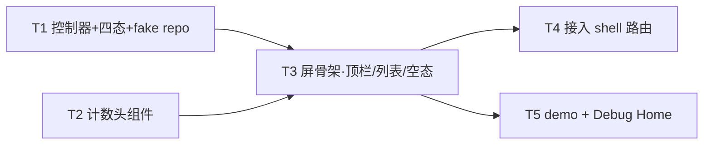

---
作者：@Ray
创建日期：2026-05-29
最后更新：2026-05-29
文档状态：草稿
---

# 任务列表：favorites-screen

## 任务依赖图
> 由各任务 inline「同 spec 依赖」字段汇总，仅供速览；以 inline 为准。



并行组：
- Group A：T1, T2（并行）
- Group B：T3（依赖 T1, T2）
- Group C：T4, T5（并行，均依赖 T3）

（整屏一体、无可独立部署/演示的中间切点 → 不设里程碑。Debug Home 入口屏(T5)虽可单独走查，但不构成对用户可见的产品价值，不单列里程碑。）

-----

- [ ] T1 · FavoritesController（四态状态机 + EntryRepo 注入 + fake repo）

**同 spec 依赖：** 无 ｜ **跨 spec 依赖：** `data-layer：EntryRepo（收藏过滤列表 + 计数）`、`ui-kit-components：dayzMotionDuration（reduce-motion 门，仅状态切换动效时长，可后接）` ｜ **关联需求：** R1, R2, R3, R6 ｜ **依据设计：** D2, D3 ｜ **可改文件：** `lib/ui/favorites/favorites_controller.dart` ｜ **验收基建：** `test/ui/favorites/favorites_controller_test.dart`、`test/ui/favorites/fakes/fake_entry_repo.dart`（内存 fake `EntryRepo`，供本任务与 T3/T5 共用，单一来源）

### 背景
屏的本地状态中枢：`FavoritesController extends ChangeNotifier`，持 `FavoritesState`（`loading` / `data(entries, count)` / `empty` / `error(message)`）。构造注入 `EntryRepo`（接口/交付物名按 data-layer 定稿；未就绪用 fake）。`load()` 调 `EntryRepo` 收藏过滤列表 + 计数：返回非空→`data`、空→`empty`、进行中→`loading`、异常→`error`（不抛出、转 error 态）。
归属：本任务只管状态与取数编排，不渲染任何 widget（渲染归 T3）。fake repo helper 由本任务建、T3/T5 复用（在此点明归属避免重复建）。

### 实施
1. 定义 `FavoritesState`（sealed class 或 enum + 数据载荷，四态）。
2. `FavoritesController(this._repo)`：`load()` 置 `loading` → await `EntryRepo` 列表 + 计数 → 据结果置 `data`/`empty`；`catch` → `error(可读 message)`，notifyListeners。
3. 取数只经 `EntryRepo` 方法（NF1）；本文件 MUST NOT `import 'package:dayz/data/...'` 的 Drift/数据库实现（仅允许 Repo 接口/DTO 类型）。
4. `fakes/fake_entry_repo.dart`：实现 `EntryRepo`（或其本屏所需子集接口）的内存假数据版，可配「有 N 条 / 空 / 抛异常」三种行为，供测试与 demo 注入。

### 验收标准（做完即止）
- 有数据：fake 返回 ≥1 条 → `load()` 后状态为 `data`，`count` 等于 fake 配置数、`entries` 顺序为时间倒序（自动，R1/R2）。
- 空：fake 返回 0 条 → 状态为 `empty`（自动，R3）。
- 失败：fake 抛异常 → 状态为 `error`、不抛出未捕获异常（自动，R6）。
- 加载中：`load()` 进行中（fake 用未完成 Future）→ 可观测到 `loading` 态（自动，R6）。

### 验收方式
- 自动：
  ```bash
  flutter test test/ui/favorites/favorites_controller_test.dart
  ```
  （注入 fake `EntryRepo` 的三种行为，断言状态转移与 count/排序/不抛异常这些**可观测值**；不连真 DB、不 grep 被改文件自身）

### 验收记录
```
日期：—
自动：—
人工：N/A
```

-----

- [ ] T2 · FavoritesCountHeader（计数头屏内私有组件）

**同 spec 依赖：** 无 ｜ **跨 spec 依赖：** `design-tokens-theme：context.dayz / dayz_text_theme 衬线大字角色 / DayzSpacing / intl 约定`、`ui-kit-components：DayzFavoriteStar(或 dayz_icons 收藏星 path)`、`i18n-localization：gen-l10n` ｜ **关联需求：** R2, NF2, NF3, NF4 ｜ **依据设计：** D4 ｜ **可改文件：** `lib/ui/favorites/favorites_count_header.dart`、`lib/l10n/arb/app_zh.arb`、`lib/l10n/arb/app_en.arb`、`lib/l10n/gen/app_localizations.dart`、`lib/l10n/gen/app_localizations_zh.dart`、`lib/l10n/gen/app_localizations_en.dart` ｜ **验收基建：** `test/ui/favorites/favorites_count_header_test.dart`

### 背景
屏内私有计数头：overline 行（收藏星着 `--favorite` + 「收藏」着 `--accent-ink`）+ 衬线大标题「{N} 篇值得再读的」+ 副标题（`--ink-2`）。视觉一律 token（NF2），文案集中 `AppLocalizations`（NF3），N 经 `intl.NumberFormat`（NF3）。
归属：本任务补收藏屏 ARB 文案 key（顶栏标题/overline/计数模板/副标题/空态/占位文案与 Semantics 标签一并加，供 T2/T3 共用），保持 zh/en key 集合一致并跑 `gen-l10n`；不得新增屏内 strings 类或静态文案常量。

### 实施
1. `FavoritesCountHeader(int count)`：`Column`(overline `Row` + 衬线大标题 `Text` + 副标题 `Text`)。
2. overline：`DayzFavoriteStar`(或 `dayz_icons` 收藏星 path) 着 `context.dayz.favorite` + 「收藏」`Text(l10n.favoritesOverline)` 着 `context.dayz.accentInk`，排版用 `.t-overline` 角色。
3. 大标题：`Text(l10n.favoritesCountTitle(NumberFormat.decimalPattern().format(count)))`——`AppLocalizations` 提供模板方法（如 `'$n 篇值得再读的'`），count 先经 `intl` 格式化再代入；衬线大字角色取自 `dayz_text_theme`（D4：25px 取最接近角色，标红给设计侧，见已知风险）。
4. 副标题：`Text(l10n.favoritesSubtitle)` 着 `context.dayz.ink2`。
5. 大标题 `Text` 加 Semantics（朗读完整「N 篇值得再读的」）。

### 验收标准（做完即止）
- count=19 → 渲染出经 `intl` 格式化的「19 篇值得再读的」（用 `find.text(l10n.favoritesCountTitle('19'))`，断言可见；不裸中文）（自动，R2/NF3）。
- overline/大标题/副标题文本颜色解析后 == 对应 token（`favorite`/`accentInk`、`ink`、`ink2`），无硬编码色（自动，样式参数闸，NF2）。
- 大标题字族为衬线（`fontFamily` 来自 `dayz_text_theme` 衬线角色）（自动，NF2）。
- 计数头有可朗读 Semantics（自动，NF4）。

### 验收方式
- 自动：
  ```bash
  flutter test test/ui/favorites/favorites_count_header_test.dart
  ```
  （pump 在某套 ThemeData 下，断言解析后样式 == token 值 + `find.text` 命中格式化串 + `find.bySemanticsLabel` / `Semantics` finder；不 grep 被改文件自身）

### 验收记录
```
日期：—
自动：—
人工：N/A
```

-----

- [ ] T3 · FavoritesScreen 屏骨架（顶栏 + 列表 + 空态 + 四态渲染）

**同 spec 依赖：** T1, T2 ｜ **跨 spec 依赖：** `ui-kit-components：DayzGlassAppBar / DayzEntryCard(星只读+ImageProvider+点击回调) / DayzEmptyState / components.dart barrel / dayzMotionDuration / AppLocalizations`、`ui-shell-navigation：Routes.reader(携 entryId 导航)`、`design-tokens-theme：context.dayz / DayzSpacing` ｜ **关联需求：** R1, R3, R4, R5, R6, NF1, NF2, NF4, NF6 ｜ **依据设计：** D1, D2, D6 ｜ **可改文件：** `lib/ui/favorites/favorites_screen.dart` ｜ **验收基建：** `test/ui/favorites/favorites_screen_test.dart`、`test/ui/favorites/favorites_screen_geometry_test.dart`、`test/ui/favorites/goldens/`（golden 基线，default/empty 两屏 × 代表主题）、`test/ui/favorites/fakes/fake_entry_repo.dart`（T1 建，本任务复用）

### 背景
屏骨架：`CustomScrollView`，sliver 1 = `DayzGlassAppBar`（返回钮 `Navigator.pop`/`context.pop` + 标题 `l10n.favoritesTitle`，无右侧操作），sliver 2 = `SliverList`：首项 `FavoritesCountHeader(count)`，其余逐条 `DayzEntryCard`（星只读、封面 `ImageProvider` 由 controller 的 entry 视图模型给、点击→`Routes.reader` 携 entryId）。按 `FavoritesController` 四态渲染同一骨架：`data`→计数头+列表、`empty`→`DayzEmptyState`、`loading`→克制占位、`error`→非崩溃错误占位（文案 `AppLocalizations`）。朴素列表，**不**引入月份吸顶头/日历/无限滚动（D1）。

### 实施
1. `FavoritesScreen({required EntryRepo repo})`：内建 `FavoritesController(repo)`，`initState` 调 `load()`，`AnimatedBuilder`/监听重建。
2. `CustomScrollView` + `DayzGlassAppBar`(title=`l10n.favoritesTitle`，leading=返回钮带 Semantics「返回」) + 按态 sliver。
3. `data` 态：`SliverList`，首 item `FavoritesCountHeader`，后续 `DayzEntryCard`（`onTap` → 导航 `Routes.reader`(entryId)；星只读）。
4. `empty` 态：`DayzEmptyState`(收藏星空心插画 + `l10n.favoritesEmptyTitle` + `l10n.favoritesEmptyBody`)。
5. `loading`/`error` 态：克制占位，动效经 `dayzMotionDuration`（NF4）；error 文案 `AppLocalizations`。
6. 视觉一律 `context.dayz.*` + `DayzSpacing`（NF2）；本文件 MUST NOT `import lib/data/` 实现 / 持 Drift（NF1）；MUST NOT 触发缩略图生成（NF6，封面只接 `ImageProvider`）。

### 验收标准（做完即止）
- 有数据：fake 返回 N 条 → 可见计数头 + N 张 `DayzEntryCard`，顺序与 controller `entries` 一致（自动，R1）。
- 空：fake 返回 0 → 不可见计数头与 `DayzEntryCard`、可见 `DayzEmptyState`（`find.text(l10n.favoritesEmptyTitle)`）（自动，R3）。
- 失败：fake 抛异常 → 可见错误占位、无异常抛出/无白屏（自动，R6）。
- 顶栏：可见标题 `l10n.favoritesTitle`、返回钮 `find.bySemanticsLabel('返回'/l10n.back)`，点返回触发 pop（自动，R4）。
- 点卡片：点第一张 `DayzEntryCard` → 触发一次 `Routes.reader` 导航并携该 entryId（自动，用 mock router/导航观察者断言目标路由与参数，R5）。
- 几何：返回钮命中盒 ≥44×44、卡片可点命中盒 ≥44×44（`tester.getRect`）；计数头在第一张卡片**之上**（顺序断言）、列表项不溢出视口宽（自动，布局几何闸，NF4/§4 fixed-geometry 用尺寸断言、content-driven 卡片只断顺序/包含/不溢出）。
- golden：default 屏与 empty 屏在代表主题下 golden 通过（自动，栅格观感兜底）。

### 验收方式
- 自动：
  ```bash
  flutter test test/ui/favorites/favorites_screen_test.dart test/ui/favorites/favorites_screen_geometry_test.dart
  ```
  （注入 fake `EntryRepo` 三态 pump 屏；断言可见组件/顺序/导航目标/命中盒尺寸/不溢出 + golden；不连真 DB、不 grep 被改文件自身）

### 禁止
- 不引入年月吸顶头 / 日历跳转 / 向上无限滚动（D1，时间线专属）。
- 不在本屏实现取消收藏 / 星标点击切换（D6，范围外）。
- 不重造 `DayzEntryCard`/`DayzEmptyState`/`DayzGlassAppBar`/收藏星（归 ui-kit）。

### 验收记录
```
日期：—
自动：—
人工：N/A
```

-----

- [ ] T4 · 接入 shell 路由（替换 Routes.favorites 占位 builder）

**同 spec 依赖：** T3 ｜ **跨 spec 依赖：** `ui-shell-navigation：app_router.dart（GoRouter 路由表 + Routes.favorites 占位 builder + 「页面级 spec 替换自己那一行 builder」机制，shell D1 授权）` ｜ **关联需求：** R4, R5 ｜ **依据设计：** D5 ｜ **可改文件：** `lib/ui/shell/app_router.dart`（**仅** `Routes.favorites` 那一条 builder + 必要 import） ｜ **验收基建：** `test/ui/favorites/favorites_route_test.dart`

### 背景
把 `app_router.dart` 中 `Routes.favorites` 对应路由的 `builder` 从 `PlaceholderScreen` 换成 `FavoritesScreen`（注入 `EntryRepo`，取数源由外壳/状态层提供，未就绪用 fake/stub）。该文件归属 `ui-shell-navigation`，本任务依其 D1 授权「页面级 spec 替换自己那一行 builder」改动，**范围锁定一行**。
依赖门：`ui-shell-navigation` 的 `app_router.dart` 须已落地；若未就绪，本任务延后（READY 门），收藏屏先经 T5 demo 可达（记 design 已知风险）。

### 实施
1. 在 `app_router.dart` 找到 `Routes.favorites` 那条 route，`builder` 改为构造 `FavoritesScreen(repo: ...)`（repo 来源依 shell 既有注入约定；无则按 shell 的 Repo 注入入口取 `EntryRepo`）。
2. 仅加构造 `FavoritesScreen` 所需 import；**不动** `Routes` 常量定义、其他屏 builder、not-found。

### 验收标准（做完即止）
- 导航到 `Routes.favorites` → 渲染 `FavoritesScreen`（非 `PlaceholderScreen`）（自动，路由 widget test：以测试 GoRouter 配置 push favorites，`find` 到 `FavoritesScreen`）。
- 其他屏路由 builder 不受影响（自动：抽查另一条已有路由仍指向其原 builder/PlaceholderScreen，回归）。

### 验收方式
- 自动：
  ```bash
  flutter test test/ui/favorites/favorites_route_test.dart
  ```
  （构造 router、导航 favorites 断言落到 `FavoritesScreen`；抽查另一路由未被改动；不 grep 被改文件自身）

### 禁止
- 不改 `Routes` 常量定义、不改其他屏 builder、不动 not-found / 外壳脚手架。

### 验收记录
```
日期：—
自动：—
人工：N/A
```

-----

- [ ] T5 · 收藏屏 demo + 挂 Debug Home

**同 spec 依赖：** T3 ｜ **跨 spec 依赖：** 无（fake `EntryRepo` 由 T1 提供） ｜ **关联需求：** R1, R3, R6 ｜ **依据设计：** D2 ｜ **可改文件：** `lib/demo/favorites_demo.dart`、`lib/demo/demo_entry.dart` ｜ **验收基建：** `test/ui/favorites/favorites_demo_test.dart`、`test/ui/favorites/fakes/fake_entry_repo.dart`（T1 建，复用）

### 背景
Debug Home 入口：在模拟设备框内用内存 fake `EntryRepo` 渲染收藏屏，可在 default/empty/loading/error 四态间切换走查（真机看收藏屏的唯一入口，data-layer/shell 未全就绪时也能跑）。
归属：`demos` 列表**末尾追加一行**，不插中间、不改 `DemoEntry` 字段。

### 实施
1. `favorites_demo.dart`：提供切态控件（按钮/分段）切 fake repo 的「有 N 条 / 空 / 加载 / 失败」，渲染 `FavoritesScreen`。
2. `demo_entry.dart` 的 `demos` 列表末尾追加一行指向 `favorites_demo`。

### 禁止
- 不改 `DemoEntry` 字段定义；不在 `demos` 中间插入；不动既有 demo。

### 验收标准（做完即止）
- `demos` 末尾新增项指向收藏屏 demo，Debug Home 可进入（自动，widget test：构建 demo 列表 `find` 到该项并可 pump 进入）。
- demo 内切「空」态 → 可见 `DayzEmptyState`；切「有数据」→ 可见计数头 + 卡片（自动，抽验两态）。

### 验收方式
- 自动：
  ```bash
  flutter test test/ui/favorites/favorites_demo_test.dart
  ```

### 验收记录
```
日期：—
自动：—
人工：N/A
```
