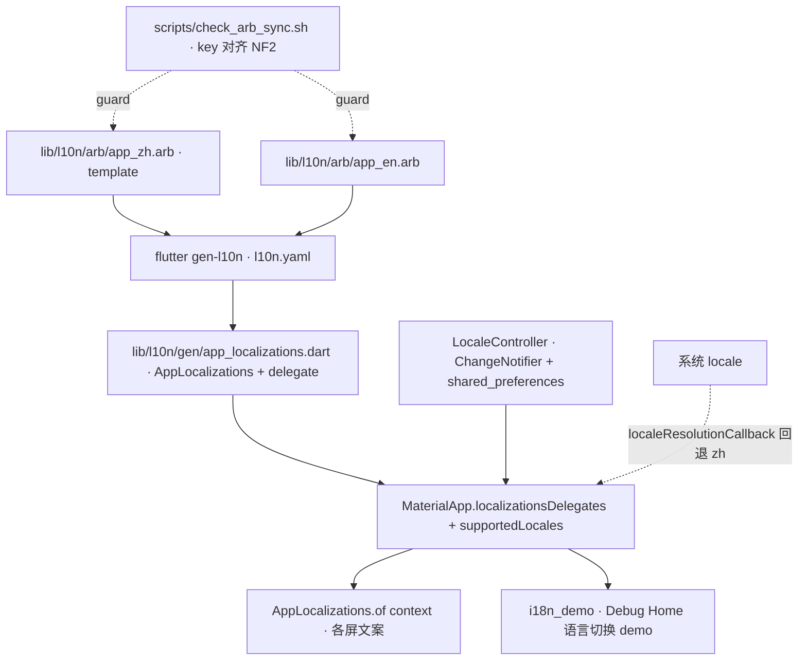

---
作者：@Ray
创建日期：2026-05-30
最后更新：2026-05-30
文档状态：草稿
---

# 设计：i18n-localization

> 取向依据：[`docs/design/11-internationalization-and-localization.md`](../../../docs/design/11-internationalization-and-localization.md)（冻结决策）。

## 技术决策

### D1 · i18n 取向 = gen-l10n + arb
- **状态：** 采纳
- **背景：** MVP 即做多语言（zh + en），需运行期按 locale 切换文案，且"加语言"不返工。
- **选项：** (A) `flutter_localizations` + `gen-l10n` + arb（官方真 i18n）；(B) 文案集中到静态常量类（无运行期切换）；(C) 第三方库（slang / easy_localization）。
- **选择：** A，工具链用 Flutter 官方 `gen-l10n`。
- **理由：** 真多语言、运行期切换、ICU 复数；官方零额外运行期依赖、与 Material/Cupertino 本地化及 `intl` 无缝；"加语言 = 加一份 arb"长期零返工。
- **代价：** 比静态常量重一档（建生成管线 + 维护两份对齐 arb），用 NF2 的 key 对齐硬闸把"漏翻译"变成 fail，成本可控。

### D2 · 生成工具链与产物位置
- **状态：** 采纳
- **背景：** 需确定 gen-l10n 的产物落点与 import 路径，且保证 CI/IDE 可复现。
- **选项：** (A) synthetic package（`package:flutter_gen`，已弃用）；(B) `synthetic-package: false` + 显式 `output-dir` 入库；(C) 第三方生成器。
- **选择：** B。`l10n.yaml`：
  ```yaml
  arb-dir: lib/l10n/arb
  template-arb-file: app_zh.arb
  output-dir: lib/l10n/gen
  output-localization-file: app_localizations.dart
  output-class: AppLocalizations
  synthetic-package: false
  nullable-getter: false
  ```
  import `package:dayz/l10n/gen/app_localizations.dart`；产物纳入版本库（MUST NOT gitignore），与 `assets.gen.dart`（`assets-management`）同策略。`pubspec.yaml` 加 `flutter: generate: true`，使 `flutter pub get` / build 自动触发生成。
- **理由：** synthetic package 路线已被 Flutter 弃用；显式 output-dir 入库 → IDE 无需先跑生成即解析、CI 可"生成后 diff 为空"校验（NF3）；`nullable-getter: false` 使 `AppLocalizations.of(context)` 非空、调用点免空判。
- **代价：** 生成产物入库会进 diff，需确认未被根 `.gitignore` 误伤；gen-l10n 各配置项在不同 Flutter 版本细节略有差异，执行（T1/T2）时按本机 `flutter --version` 核实（见 `## 已知风险`）。

### D3 · arb 组织与 template 语言
- **状态：** 采纳
- **背景：** 需定 template（占位符元数据来源）与两份 arb 的对齐纪律。
- **选择：** `app_zh.arb` 为 template（母语中文，文案先写中文，占位符 `@key` 描述在此）；`app_en.arb` key 与之**完全一致**。复数用 ICU `plural`（如 `onThisDayCount`、`yearsAgo`），占位符用具名参数。
- **理由：** 产品母语中文；template 决定 placeholder schema，集中在中文一份维护，英文只对齐填值。
- **代价：** 加文案要改两份（NF2 用脚本/测试守 key 对齐，缺漏即 fail）。

### D4 · locale 解析与切换
- **状态：** 采纳
- **背景：** 需定运行期 locale 怎么决定、怎么手动切、怎么持久化。
- **选项（解析）：** (A) 仅跟随系统；(B) 跟随系统 + 手动覆盖 + 持久化。
- **选择：** B。`supportedLocales = [Locale('zh'), Locale('en')]`；解析优先级 **持久化覆盖 → 跟随系统（命中 supported）→ 回退 zh**。`LocaleController`（`ChangeNotifier`）持 `Locale? override`（null=跟随系统），`init()` 读持久化、`setLocale()/followSystem()` 写持久化并通知；`MaterialApp.locale` 绑定 controller、`localeResolutionCallback` 兜底回退 zh。持久化用 **`shared_preferences`**（key=`locale_override`，存 `zh`/`en`/空）。
- **理由：** "做多语言"需用户能切且记住；`shared_preferences` 轻量通用，locale 偏好非敏感，无需占用 `flutter_secure_storage`（那是 key-management 的敏感存储）。
- **代价：** 新增 `shared_preferences` 依赖；首帧在持久化异步加载前可能短暂用系统 locale 再切，规模可接受（异常时回落跟随系统、不抛）。
- **边界：** 切换的**设置页 UI 归 `settings-screen`**；本 spec 只交付 controller + 接线 + demo 入口示范。

### D5 · 横切契约的落地与守护
- **状态：** 采纳
- **背景：** "所有文案走 AppLocalizations + 双语对齐"是跨所有屏的不变式，需有可执行的守护点，而非口号。
- **选择：** ① NF2 key 对齐由 `scripts/check_arb_sync.sh`（或 dart test）比对两份 arb 的 key 集合，缺漏/孤儿即非零退出；② 本 spec 自带的 i18n demo + widget 测试示范"切 locale 文案随变"，作为契约的活样例；③ 全量"屏内禁裸字面量"的回归 lint/test 随各屏 spec 落地强制（本 spec 不为尚不存在的屏建空壳 lint）。
- **理由：** 把契约的可机检部分（key 对齐、取值正确）做成硬闸，符合 `spec-guide` "凡能机械校验做成硬闸"；不可机检的"新屏是否裸字面量"留给屏 spec 落地时的 lint。
- **代价：** "屏内禁裸字面量"在本 spec 阶段只对 demo 生效，全站强制依赖后续屏 spec，可接受（本 spec 是基础设施层）。

## 架构



## 文件变更

- `l10n.yaml`                              新建（gen-l10n 配置，仓库根）
- `pubspec.yaml`                           修改（`dependencies` 加 `flutter_localizations: sdk: flutter`、`intl`、`shared_preferences`；`flutter:` 段加 `generate: true`）
- `lib/l10n/arb/app_zh.arb`                新建（template，中文 seed 文案 + 一条 plural）
- `lib/l10n/arb/app_en.arb`                新建（英文，key 与 zh 对齐）
- `lib/l10n/gen/app_localizations.dart`    生成产物（gen-l10n 产出，纳入版本库，MUST NOT gitignore）
- `lib/l10n/gen/app_localizations_zh.dart` 生成产物（同上）
- `lib/l10n/gen/app_localizations_en.dart` 生成产物（同上）
- `lib/l10n/locale_controller.dart`        新建（`LocaleController`：状态 + 持久化）
- `lib/app.dart`                           修改（`MaterialApp` 挂 delegates + supportedLocales + locale/controller + 回退回调）
- `lib/demo/i18n_demo.dart`                新建（语言切换 demo）
- `lib/demo/demo_entry.dart`               修改（**仅末尾追加一行**，不插中间、不改 `DemoEntry` 字段）
- `scripts/check_arb_sync.sh`              新建（两份 arb 的 key 对齐校验，NF2）
- `.gitignore`                             修改（必要时，确保 `lib/l10n/gen/` 不被忽略；仅当现有规则会误伤时才动）

## 已知风险

- **gen-l10n 配置随 Flutter 版本漂移**：`synthetic-package` / `output-dir` / `nullable-getter` 等项在不同 Flutter 版本默认值与支持度不同（本机 Flutter 3.44）。D2 给的 `l10n.yaml` 为目标配置；执行（T1/T2）时按 `flutter --version` 核实并以生成成功 + 取值测试通过为准，**不以配置文本为准**。
- **生成产物入库与 .gitignore**：`lib/l10n/gen/` 须被 git 跟踪；若根 `.gitignore` 有 `**/gen/` 或 `*.g.dart` 类规则会误伤——T2 须核对未被忽略（`git check-ignore`）。
- **屏级 spec 文案统一走 AppLocalizations**：各页面级 spec 落地用户可见文案时一律经 `AppLocalizations.of(context)`（见 `docs/design/11` §4 横切契约）；`intl` 日期/数字部分不变。本 spec 是基础设施层，不为尚未落地的屏建占位。
- **无持久化 schema 变更**：locale 偏好走 `shared_preferences` 键值，非 Drift schema，**无数据迁移/回滚要素**（verification 不含迁移专项）。
- **首帧 locale 抖动**：`shared_preferences` 异步加载，首帧可能短暂用系统 locale 再切到持久化值，规模可接受（与主题层同类取舍）。
