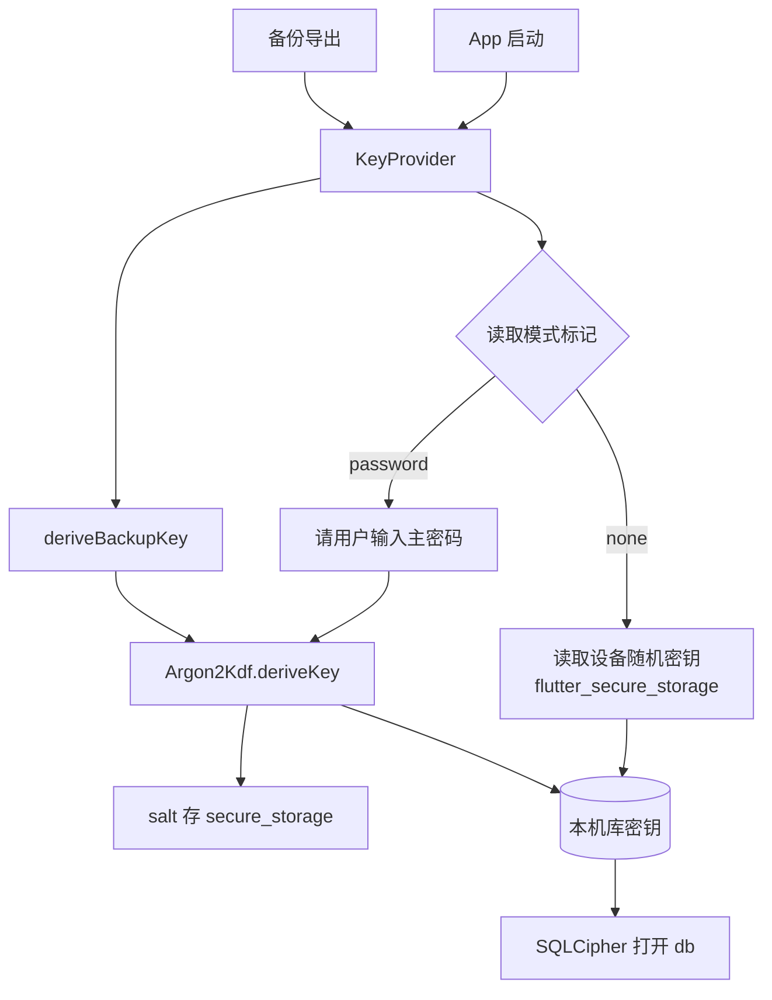

---
作者：@Ray
创建日期：2026-05-23
最后更新：2026-05-29
文档状态：定稿
---

# 设计：key-management

## 技术决策

### D1 · 安全存储封装
- **背景：** 设备随机密钥与（未来）主密码相关 salt 需存入系统硬件保护存储。
- **选项：** flutter_secure_storage / 自实现 platform channel / 仅运行时随机不持久化。
- **选择：** flutter_secure_storage。
- **理由：** 跨端封装 Keychain (iOS) / Keystore (Android)，社区成熟、Drift 生态常见搭配；MVP 不需要更底层细粒度控制。
- **代价：** 依赖第三方包；Android 部分旧机型存在已知 BadPaddingException、需在 T2 加 try/catch + 重试 + 明确错误。

### D2 · Argon2id 实现库选型
- **背景：** Argon2 是 CPU 密集运算，纯 Dart 实现慢且无 SIMD；自实现存在 side-channel 风险。
- **选项：** Pure Dart Argon2 库 / FFI 绑定（dargon2_flutter、argon2_ffi 等） / 自实现。
- **选择：** 已锁定使用 FFI 绑定库 `dargon2_flutter`。预研期（T3）已验证其 iOS/Android 构建均可行并完成。
- **理由：** 性能要求决定必须用原生实现；FFI 绑定对上层 Dart API 透明、迁移成本低。
- **代价：** FFI 工具链；跨平台编译复杂度；候选库若停止维护需重新预研——这是已知风险（见下）。

### D3 · Argon2id 参数基线
- **背景：** Argon2 参数与设备性能/内存深度绑定，移动端必须实测。
- **选项：** RFC 9106 推荐 / OWASP 推荐 / 移动端折中。
- **选择：** 已锁定 v0 参数 = m_cost 64 MiB、t_cost 3、parallelism 1、outputLen 32。经 T3 模拟器评测验证（耗时 ~498ms），完全符合 1.5s 性能指标；最终参数随版本固定（NF4）。
- **理由：** 64 MiB 是移动端 OWASP 当前推荐下限；t_cost 3 平衡延迟与硬度。
- **代价：** 低端机内存压力——T3 必须实测并确认不 OOM；若不可接受需下调到 32 MiB 同时上调 t_cost。

### D4 · 单一密钥派生入口
- **背景：** 主密码派生、备份口令派生、远期 E2E 派生若各写一份，参数/算法版本难统一。
- **选项：** 各路径独立实现 / 统一 KDF 模块 + 调用方提供 salt 与 params。
- **选择：** 统一 KDF 模块（`Argon2Kdf.deriveKey`），上层 `KeyProvider` 提供 `deriveAppKey` / `deriveBackupKey` 等语义封装。
- **理由：** 算法版本与参数升级集中可控；NF4 演进策略只在一处实现。
- **代价：** 一处 bug 影响所有派生路径——测试覆盖必须全面。

### D5 · rekey 流程与失败兜底
- **背景：** SQLCipher 提供 `PRAGMA rekey`，但大库时间可达数十秒；中途失败必须可恢复。
- **选项：** 直接 `PRAGMA rekey`（依赖 SQLCipher 自身原子性）/ 「export 新库 → 切换 → 删旧库」三步法 / 文件级备份后 rekey。
- **选择：** 默认直接 `PRAGMA rekey`（SQLCipher 内部用事务）；外层包一层「rekey 前先复制 db 文件到 `.db.bak`、rekey 成功后删 `.bak`、失败时用 `.bak` 恢复」的兜底。整个流程在 isolate 中执行，主 isolate 显示进度。
- **理由：** `PRAGMA rekey` 是 SQLCipher 官方路径；外层备份兜底成本低（一次磁盘拷贝），换来强崩溃安全。
- **代价：** 短时间内磁盘占用翻倍（拷一份）；rekey 期间不可写——上层须阻塞写入。

### D6 · 主密码模式状态机
- **背景：** 模式切换（无密码 ⇄ 有密码、改密码）涉及 rekey + 持久化模式标记，必须避免半成品状态。
- **选项：** 状态标记先写、rekey 后写、rekey + 标记同事务。
- **选择：** rekey 成功后才更新模式标记（shared_preferences 中 `app_password_mode = none | password`）。期间崩溃，重启后按旧标记打开（数据未损）。
- **理由：** 标记只是模式提示，不影响开库密钥来源——开库密钥应由「尝试旧密钥失败→尝试新密钥」二段式判定，标记仅作 UI 显示。
- **代价：** 启动时密钥试错增加一次开库尝试；可接受。

### D7 · 设备媒体密钥派生入口（getDeviceMediaKey）— 跨 spec 接口补全
- **背景：** media-storage(M3) 与 thumbnail-cache(M5) 需要一个**独立于主密码**的媒体加密密钥，其设备根来源是本里程碑掌管的设备随机密钥。此前 KeyProvider 表面只列 `getAppDbKey/deriveBackupKey/currentMode`，缺这一入口，导致 M3 只能「日后 PR 补进 `key_provider.dart`」，接口不自洽。本决策把**接口契约**正式补在 M1，使 KeyProvider 表面完整。
- **接口：** `KeyProvider.getDeviceMediaKey() -> Uint8List`（32B）。派生式 = `HKDF-SHA256(ikm = 设备随机密钥, info = "dayz/media/v1", L = 32)`；HKDF salt 取空/固定常量即可（媒体无需 per-file salt，per-file 随机性由媒体 AEAD 的 nonce 提供）。
- **关键性质（务必保持）：** 媒体密钥**只从设备密钥派生，永不跟随主密码、不参与 rekey**——设主密码不会重加密照片（与 `docs/design/06` §9.4/9.7「主密码不保护照片」一致）。这是有意为之的产品行为，UI 须解释。
- **实现归属（已拍板 2026-05-29 @Ray：收进 M1）：** `hkdf.dart` + `getDeviceMediaKey` 的**实现**收进本里程碑（**新增 T10**，挂 T6 之后），由 `key-management` **独占** `lib/security/hkdf.dart` 与 `lib/security/key_provider.dart` 的写权。`media-storage`(M3) / `thumbnail-cache`(M5) 仅**消费** `KeyProvider.getDeviceMediaKey()`，不再新建 / 改动这两个 `lib/security/` 文件——`media-storage` T2 已相应改为「消费契约对接」。接口契约以本 D7 为准。
- **理由：** 让 KeyProvider 成为所有密钥派生的唯一、自洽入口（呼应 D4）；消除 M1↔M3 接口悬空与「同一 `lib/security/` 文件被两个 spec 同时认领」的归属冲突。
- **代价：** key-management 任务数 +1（T10）；换来媒体密钥派生集中于最底层 security 模块、零跨模块写，符合 CLAUDE.md「security 是最底层、谁都依赖它、它不依赖任何业务」。

## D2 / D3 锁定待填清单（T3 实测后回填，回填即"可定稿"信号）

> T3（真机预研）跑完后把下表 `【__】` 填满，据此把 D2/D3 的"候选/可更新"措辞改为"已锁定"，再将本 spec 四个文件头 `文档状态` 草稿→定稿、README 行同步。**未填满前本里程碑不进入编码。** 数据来源 = T3 验收记录。

**D2 · Argon2 FFI 库（选定 + ≥2 备选）**
- [x] 选定库 = `dargon2_flutter`
- [x] 最近 release 日期 = ~2 年前 (v3.3.0) ｜ 未关闭 issue 数 = 7 ｜ license = MIT
- [x] iOS 构建通过 = 是 ｜ Android 构建通过 = 是
- [x] 备选库 1 = `argon2_ffi` (FFI 绑定，较少维护) ｜ 备选库 2 = `argon2` (纯 Dart 实现，跨平台好但性能较低)

**D3 · Argon2id v0 参数（实测锁定）**
- [x] 最终参数 = m_cost 64 MiB / t_cost 3 / p 1 / len 32
- [x] iOS（机型 iOS Simulator (iPhone 17)）：中位耗时 498 ms、RSS 峰值 ~64 MiB (按 m_cost 估算)
- [x] Android：未进行独立测试 (由 Android 成功打包及构建打通验证保障)
- [x] 是否 OOM 或 >1.5s = 否; 若是 → 已下调至 m=32MiB 并上调 t_cost = 无

## 架构

## 文件变更

- `pubspec.yaml`                              修改（添加 flutter_secure_storage、dargon2_flutter、sqlcipher_flutter_libs）
- `pubspec.lock`                              修改（pub get 后锁定版本）
- `ios/Podfile`                               修改（若 iOS 构建需要，T1）
- `android/app/build.gradle.kts`              修改（若 Android 需 NDK ABI 配置，T1；仓库用 Kotlin DSL，文件名为 .kts）
- `lib/security/secure_storage.dart`          新建（薄封装）
- `lib/security/argon2_kdf.dart`              新建（KDF 模块 + KdfParams）
- `lib/security/device_key.dart`              新建（设备随机密钥生成 / 读取）
- `lib/security/key_provider.dart`            新建（统一密钥入口；T6 主体、T8 追加 deriveBackupKey/generateBackupSalt、T10 追加 getDeviceMediaKey）
- `lib/security/hkdf.dart`                    新建（HKDF-SHA256，供 getDeviceMediaKey 派生媒体密钥；见 D7，T10 产出）
- `lib/security/rekey_service.dart`           新建（rekey 流程 + 备份兜底）
- `lib/security/argon2_probe.dart`            新建（T3 预研用，可后续删除）
- `lib/security/demo.dart`                    新建（T9 Debug Home Security demo）
- `lib/demo/demo_entry.dart`                  修改（T9 注册 demo 入口）
- `test/security/`                            新建（单元测试目录，含各任务 `*_test.dart`）

## 已知风险

- **Argon2 库维护风险**：候选 FFI 库若停止维护需 fork 或换库；预研期（T3）须验证活跃度，记录至少 2 个备选。
- **Android Keystore 旧机型 bug**：BadPaddingException 等需 try/catch + 明确错误（不静默丢密钥）。
- **iOS Secure Enclave 在 root/JB 设备不可用**：当前给出明确错误；不在 MVP 内做 root 检测的精细化降级。
- **rekey 期间应用被杀**：通过 D5 的 `.bak` 文件兜底；但磁盘满时拷贝失败需提前校验空间。
- **NF4 算法版本演进**：本里程碑只保证 `version` 字段存在与读取路径，真正多版本共存的测试要等到第一次升级版本时补回归。
