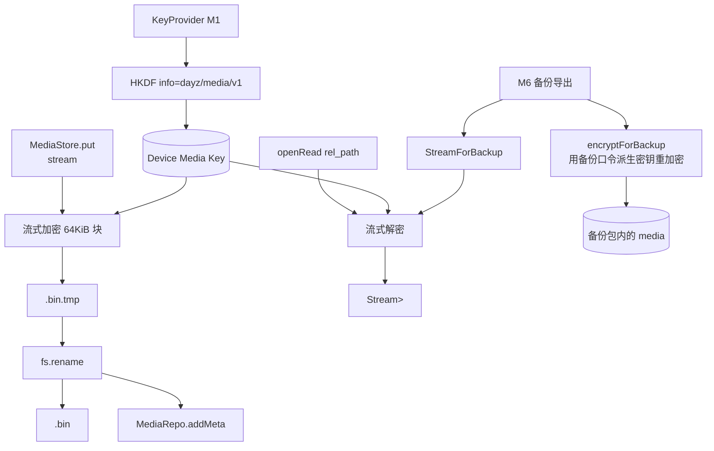

---
作者：@Ray
创建日期：2026-05-23
最后更新：2026-05-29
文档状态：草稿
---

# 设计：media-storage

## 技术决策

### D1 · 对称算法 = AES-256-GCM
- **背景：** 媒体加密需 AEAD（认证 + 加密），防被改写 / 损坏；性能要好。
- **选项：** AES-256-GCM / ChaCha20-Poly1305 / AES-CBC + HMAC。
- **选择：** **AES-256-GCM**。
- **理由：** 移动端硬件加速广泛（ARMv8 AES 指令）；AEAD 一步到位；与 SQLCipher 算法族一致；社区 Dart 包成熟（`cryptography` 或等价）。
- **代价：** GCM nonce 复用是致命错（手抖直接破解）；通过「每文件随机 12 字节 nonce」+「nonce 写在文件头」杜绝复用。

### D2 · 文件格式
- **背景：** 密文文件需自包含 nonce + 密文 + auth tag；读取时按字段定位。
- **选项：** 自定义格式 / 沿用 `age` / 沿用 `libsodium SecretStream`。
- **选择：** **极简自定义格式**：`magic(4)='DMED' | version(1)=1 | algo(1)=1(AES-256-GCM) | reserved(2) | nonce(12) | ciphertext... | tag(16)`。
- **理由：** 简单；调试时 hexdump 易识别；可演进 algo 字段。
- **代价：** 格式自维；改进时需 version 迁移逻辑，但媒体加密本就只对单文件、不影响 db schema。

### D3 · 设备媒体密钥来源
- **背景：** v6 9.4 明确「原图与缩略图始终用设备随机密钥」；M1 T6 暴露的是 db 密钥。
- **选项：** 复用 db 密钥 / 单独再生成一把媒体密钥 / 用 db 密钥派生（HKDF）。
- **选择：** **从 db 设备密钥 HKDF 派生一把媒体专用密钥**（info=`"dayz/media/v1"`）。
- **理由：** 一把根密钥派生多用途，密钥管理简单；HKDF 廉价；当未来引入第三种用途（如附件加密）时复用模式。
- **代价：** 多走一次 HKDF；可接受。M1 KeyProvider 需补 `getDeviceMediaKey()`（在本里程碑 T2 推动 M1 PR）。

### D4 · 流式 API 形态
- **背景：** 大文件不应一次性入内存；备份导出需要重加密链路。
- **选项：** `Stream<List<int>>` / `Sink+Source` 对 / 直接读写 `File`。
- **选择：** Dart `Stream<List<int>>`，put 入参 / 读出输出都是 stream；内部按 64 KiB 块走加密。
- **理由：** Dart 生态原生；与 isolate 配合好；M6 备份导出可直接管道串联。
- **代价：** 加解密块边界需要小心（GCM 是单次加密整文件，不是分段；我们用「一次性 GCM 算 nonce/tag、但按块流式喂入」）。

### D5 · 写盘原子性
- **背景：** 写一半崩溃不能留半截文件。
- **选项：** 直接写目标路径 / 先写 `.tmp` 后 rename。
- **选择：** **先写 `<id>.bin.tmp`，加密完且 tag 写入完后再 rename**。
- **理由：** rename 是 POSIX 原子操作；中途崩溃只留 `.tmp`，启动时可清。
- **代价：** 启动时需扫一次 `media/` 目录清理孤儿 `.tmp`（放到 T8 demo 启动钩子中提示，正式启动钩子归 M6 或后续运维 spec）。

### D6 · 元数据写入时机
- **背景：** 写盘成功后才写 db，避免 db 有行但文件不存在的悬空。
- **选项：** 先 db 后文件 / 先文件后 db / 事务包裹。
- **选择：** **先文件后 db**：文件 rename 完才调 `MediaRepo.addMeta`；db 写失败回退删除文件。
- **理由：** 文件是「真实数据」，db 是「索引」；倒过来更难恢复（db 行无对应文件就是悬空）。
- **代价：** db 写失败时要保证 rollback 删文件成功；T5 写单测。

### D7 · 媒体 kind 通用化但只实现 image
- **背景：** schema 已定义 image/audio/video；MVP 只做 image，但 API 不写死。
- **选项：** 仅接收 image / API 接 kind 参数但 audio/video 抛 UnimplementedError / 完全通用。
- **选择：** API 接 kind，**audio/video 内部直接走同一套加密路径**（只是字节流）；元数据字段如 duration_ms 由调用方传入。MVP demo 只插 image。
- **理由：** 加密本身与媒体类型无关；何苦立人为门槛。
- **代价：** 无；future-proof。

### D8 · 异常与 NF5 路径外泄
- **背景：** 异常 message 容易拼绝对路径。
- **选项：** 严格审核异常文案 / 把路径处理封装为「相对化函数」。
- **选择：** 封装 `relativize(path)` 工具；MediaStore 内任何对外抛出的 message 必须先过它。
- **理由：** 一处把关；测试可断言。
- **代价：** 一段简单工具；无代价。

## 架构

## 文件变更

- `pubspec.yaml`                              修改（添加 `cryptography` 或等价 AEAD 包）
- `lib/security/key_provider.dart`            修改（补 `getDeviceMediaKey()`；返回 HKDF 派生）
- `lib/security/hkdf.dart`                    新建（简易 HKDF-SHA256；若 `cryptography` 包已含可不新建）
- `lib/media/media_store.dart`                新建（核心 MediaStore 类）
- `lib/media/media_codec.dart`                新建（文件格式 + 加解密块逻辑）
- `lib/media/paths.dart`                      新建（路径工具：根目录、relativize）
- `lib/media/exceptions.dart`                 新建（MediaCorruptedException 等）
- `lib/media/demo.dart`                       新建（Debug Home demo）
- `lib/demo/demo_entry.dart`                  修改（追加注册）
- `test/media/`                               新建（测试目录）

## 已知风险

- **KeyProvider.getDeviceMediaKey 实际改动 M1 文件**：跨里程碑改动，需在 M1 spec 中作回滚标注（如需要由 M1 spec 增补任务，或通过 M3 T2 的「跨 spec 改动」明确说明）。本里程碑 tasks 在 T2 明确这一点。
- **AES-GCM 单 nonce 处理大文件**：GCM 限制 2^39 - 256 bits（约 64 GiB）；MVP 单文件远小于此，但 100 MiB+ 视频需注意未来约束（v6 范围本就是图为主）。
- **HKDF 包选择**：`cryptography` 包有现成实现；自实现需测试向量。
- **Dart Stream 链式加密**：实现时注意 backpressure 与 isolate 边界；T4 单测覆盖。
- **iOS Files App 暴露**：Documents 目录可能被用户在 Files App 看到加密 `.bin`，无害但需 UX 文案后续说明（不在本里程碑）。
