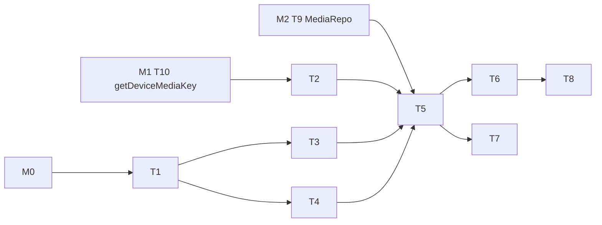

---
作者：@Ray
创建日期：2026-05-23
最后更新：2026-05-29
文档状态：草稿
---

# 任务列表：media-storage

## 任务依赖图
> M# ↔ spec 映射（仅列本 spec 用到的别名）：M0=app-scaffold，M1=key-management，M2=data-layer。
>
> 整体依赖 **M0（app-scaffold）完成** + **M1（key-management）T10 getDeviceMediaKey 可用** + **M2（data-layer）T9 MediaRepo 可用**。


并行组：
- Group A：T2, T3, T4
- Group B：T6, T7（依赖 T5）

里程碑：
- **M3-done**：T1-T8 完成；Debug Home「Media demo」能用 demo 图加密写入 + 读出并对比一致。

-----

- [ ] T1 · 添加 AEAD 加密依赖

**同 spec 依赖：** 无 ｜ **跨 spec 依赖：** app-scaffold（M0：壳/pubspec/平台配置/Debug Home 框架就绪） ｜ **关联需求：** R2, NF1 ｜ **依据设计：** D1 ｜ **可改文件：** `pubspec.yaml`

### 背景
添加 `cryptography` 包（或等价 AEAD 实现，要求支持 AES-256-GCM + HKDF-SHA256）。

### 实施
1. 选定包，锁版本添加到 pubspec.yaml
2. `flutter pub get`
3. 写一个最小调用片段确认 AES-256-GCM 与 HKDF 都能跑（可临时放 test/media/_smoke_test.dart）

### 验收标准（做完即止）
- 依赖解析通过（自动）
- smoke test 通过（自动）

### 验收方式
- 自动：
  ```bash
  flutter pub get && flutter test test/media/_smoke_test.dart
  ```

### 验收记录
```
日期：—
自动：—
人工：—（无）
```

-----

- [ ] T2 · 对接 M1 设备媒体密钥 getDeviceMediaKey（消费契约）

**同 spec 依赖：** 无 ｜ **跨 spec 依赖：** key-management（getDeviceMediaKey，对应其 T10） ｜ **关联需求：** R5 ｜ **依据设计：** D3 ｜ **可改文件：** `test/media/device_media_key_test.dart`

### 背景
按 D7（@Ray 拍板：实现归 M1），设备媒体密钥 `getDeviceMediaKey()` 与 `lib/security/hkdf.dart` 由 key-management（T10）实现并暴露。本任务**只消费** `KeyProvider.getDeviceMediaKey()`，**不**在 `lib/security/` 下新建 / 改动任何文件——消除原先「M3 跨模块写 M1 文件」的归属冲突。写一个消费侧契约测试，确认本里程碑能正确取得 32 字节媒体密钥供后续 codec（T4/T5）使用。

### 实施
1. 经 `KeyProvider.getDeviceMediaKey()` 取媒体密钥（不自实现 HKDF）
2. 消费侧契约测试：用已知设备根密钥（或 mock KeyProvider），断言取到的媒体密钥长度 32、且与 `getAppDbKey()` 派生不同

### 验收标准（做完即止）
- 本里程碑经 `KeyProvider.getDeviceMediaKey()` 取得 32 字节媒体密钥（自动，消费侧契约，断言返回值长度）
- 该媒体密钥与 `getAppDbKey()` 不同（自动，证明确为设备媒体派生而非 db 密钥）

### 验收方式
- 自动：
  ```bash
  flutter test test/media/device_media_key_test.dart
  ```
  （断言：① `getDeviceMediaKey()` 返回 32 字节；② 与 db 密钥不同。均断言运行时取值，不 grep 源码）

### 验收记录
```
日期：—
自动：—
人工：—（无）
```

-----

- [ ] T3 · 媒体路径工具 + relativize

**同 spec 依赖：** T1 ｜ **跨 spec 依赖：** 无 ｜ **关联需求：** R1, NF5 ｜ **依据设计：** D8 ｜ **可改文件：** `lib/media/paths.dart`, `test/media/paths_test.dart`

### 背景
统一管理 `<app_documents>/media/` 根目录获取与「绝对路径 ↔ 相对路径」转换。

### 实施
1. `mediaRootDir() async -> Directory`：用 `path_provider` 拿 documents 目录拼 `/media`，存在性检查 + 创建
2. `relativize(String absPath) -> String`：去掉 documents 前缀，返回 `media/<id>.bin` 形式；若不在 documents 下抛 ArgumentError
3. `resolveRelPath(String rel) -> File`：反向拼接成 File 实例
4. 测试覆盖：iOS / Android 路径差异；越界路径抛错

### 验收标准（做完即止）
- 三个函数有单测覆盖（自动）
- relativize 永远返回相对路径，绝不返回绝对路径（自动）

### 验收方式
- 自动：
  ```bash
  flutter test test/media/paths_test.dart
  ```

### 验收记录
```
日期：—
自动：—
人工：—（无）
```

-----

- [ ] T4 · 媒体 codec（文件格式 + 流式加解密）

**同 spec 依赖：** T1 ｜ **跨 spec 依赖：** 无 ｜ **关联需求：** R2, NF1, NF2 ｜ **依据设计：** D1, D2, D4 ｜ **可改文件：** `lib/media/media_codec.dart`, `lib/media/exceptions.dart`, `test/media/media_codec_test.dart`

### 背景
按 D2 文件格式实现加解密：
- 写：随机 nonce → 写 header → 流式喂入明文块加密 → 写 tag
- 读：读 header → 验证 magic/version/algo → 流式解密 → 校验 tag → 失败抛 MediaCorruptedException

### 实施
1. 定义 `MediaCodec.encrypt(plain: Stream<List<int>>, key: Uint8List) -> Stream<List<int>>`
2. 定义 `MediaCodec.decrypt(cipher: Stream<List<int>>, key: Uint8List) -> Stream<List<int>>`
3. 内部按 64 KiB 块走 GCM update / final
4. `MediaCorruptedException` / 异常类
5. 测试：
   - 1 KiB / 64 KiB 边界 / 100 MiB（大文件流式不爆内存）
   - 篡改 1 字节 ciphertext 必抛 MediaCorruptedException
   - 篡改 tag 必抛
   - 错误密钥必抛

### 验收标准（做完即止）
- 全部测试通过（自动）
- 100 MiB 大文件测试内存峰值 < 200 MiB（自动 / 人工，可选）

### 禁止
- 不复用 nonce
- 不在出错路径回退到「不验证 tag 也返回数据」

### 验收方式
- 自动：
  ```bash
  flutter test test/media/media_codec_test.dart
  ```

### 验收记录
```
日期：—
自动：—
人工：—（无）
```

-----

- [ ] T5 · MediaStore：put / openRead + 元数据集成

**同 spec 依赖：** T2, T3, T4 ｜ **跨 spec 依赖：** data-layer（MediaRepo，对应其 T9） ｜ **关联需求：** R1, R3, R4, R7 ｜ **依据设计：** D5, D6, D7 ｜ **可改文件：** `lib/media/media_store.dart`, `test/media/media_store_test.dart`

### 背景
对外暴露的核心 API：
- `Future<String> put({Stream<List<int>> bytes, String entryId, MediaKind kind, String mime, int? width, int? height, int? durationMs, int? fileSize}) -> rel_path`
- `Stream<List<int>> openRead(String relPath)`
- `Future<void> softDelete(String mediaId)` / `Future<void> hardDelete(String mediaId)`

写盘走 D5 原子化（.tmp → rename），写盘后调 MediaRepo.addMeta；db 失败必须删文件。

### 实施
1. 实现上述四个 API
2. media_id 契约：媒体主键 `media_id` 由 `MediaStore.put` 调用 data-layer 的 `Ids.next()` **生成一次**，同时用于加密文件名 `<media_id>.bin` 与显式传入 `MediaRepo.addMeta(id, ...)`；`MediaRepo.addMeta` MUST 接受调用方传入的 id、**禁止自行再生成**，确保文件名与 db 行 id 严格一致。rename 成功后调 `MediaRepo.addMeta(id, ...)`
3. softDelete：调 `MediaRepo.softDelete(id)` 标 db 行 `deleted_at`，文件保留
4. hardDelete：先 unlink 文件再调 `MediaRepo.hardDelete(id)` 删 db 行；任一步失败不进入「db 已删但文件还在」的反向状态
5. 测试：
   - 正常 put 后能 openRead 还原同样字节
   - put 中模拟 db 失败 → 文件不存在
   - hardDelete 成功后文件与 db 行都消失
   - hardDelete 文件已不存在但 db 行还在的修复路径
   - softDelete 仅写 deleted_at，文件保留

### 验收标准（做完即止）
- 全部测试通过（自动）
- 整流回退场景有测试（自动）

### 验收方式
- 自动：
  ```bash
  flutter test test/media/media_store_test.dart
  ```

### 验收记录
```
日期：—
自动：—
人工：—（无）
```

-----

- [ ] T6 · 备份导出流式中转 API

**同 spec 依赖：** T5 ｜ **跨 spec 依赖：** 无 ｜ **关联需求：** R6 ｜ **依据设计：** D4 ｜ **可改文件：** `lib/media/media_store.dart`（追加方法）, `test/media/backup_stream_test.dart`

### 背景
为 M6 提供：
- `Stream<List<int>> streamForBackup(String relPath)`：用设备媒体密钥解密，返回明文流（与 openRead 相同；起独立别名是为语义清晰）
- `Stream<List<int>> encryptForBackup(Stream<List<int>> plain, Uint8List backupKey)`：用备份口令派生密钥重加密，返回密文流

明文 MUST 不落临时文件——管道串联：解密流 → 备份重加密流 → 写入备份包，全程内存 / 流。

### 实施
1. 追加两个方法
2. 重加密复用 MediaCodec 但传入 backupKey 而非设备密钥
3. 集成测试：streamForBackup → encryptForBackup → 用同一 backupKey 解密 → 与原明文一致

### 验收标准（做完即止）
- 集成测试通过（自动）
- 管道流转过程不创建任何 `.tmp` / 临时文件（自动：测试中监视 media 目录）

### 禁止
- 不在重加密路径上落明文临时文件
- 不让明文数据进入 Dart `String`（避免编码问题与内存驻留）

### 验收方式
- 自动：
  ```bash
  flutter test test/media/backup_stream_test.dart
  ```

### 验收记录
```
日期：—
自动：—
人工：—（无）
```

-----

- [ ] T7 · 性能基线测试

**同 spec 依赖：** T5 ｜ **跨 spec 依赖：** 无 ｜ **关联需求：** NF4 ｜ **依据设计：** D1, D4 ｜ **可改文件：** `test/media/throughput_test.dart`

### 背景
NF4 要求中端真机写 ≥ 30 MiB/s、读 ≥ 50 MiB/s。本任务在真机上跑基准并记录数据；模拟器/CI 不强求达标。

### 实施
1. 写一个 benchmark 用例：100 MiB 数据流式 put + openRead，分别计时
2. 真机 iOS + Android 各跑一次
3. 数据填入本任务验收记录

### 验收标准（做完即止）
- benchmark 用例可重复运行（自动）
- 真机数据已记录（人工 @Ray）

### 禁止
- 不在 CI / 模拟器中做硬性 assert（环境差异大）

### 验收方式
- 自动：
  ```bash
  flutter test test/media/throughput_test.dart
  ```
- 人工（@Ray）：iOS + Android 真机各跑一次

### 验收记录
```
日期：—
iOS 写吞吐：— MiB/s
iOS 读吞吐：— MiB/s
Android 写吞吐：— MiB/s
Android 读吞吐：— MiB/s
核查人：@Ray
```

-----

- [ ] T8 · 接入 Debug Home：Media demo

**同 spec 依赖：** T6 ｜ **跨 spec 依赖：** 无 ｜ **关联需求：** R1, R2, R3, NF5 ｜ **依据设计：** D7 ｜ **可改文件：** `lib/media/demo.dart`, `lib/demo/demo_entry.dart`（追加注册）；demo 图复用既有资产 `assets/editor/demo_image.png`（唯一规范路径，单一来源见 `specs/archive/2026-05-30-assets-management` R4，本任务**只读引用、不新增/改动该资产**）

### 背景
做一个真机可演示入口：
- 「写入 demo 图」按钮：从 assets 拷一张到内存流，调 MediaStore.put 得到 rel_path 展示
- 「读取并校验」按钮：openRead 后算 sha256 与原文件对比
- 显示加密文件大小 vs 原文件大小
- 「重加密为备份」按钮（验证 T6）：调用 streamForBackup → encryptForBackup → 写到临时文件并 hexdump 前 16 字节展示（演示文件格式头）

### 实施
1. 创建 `lib/media/demo.dart`，包含上述四个按钮 + 文本展示
2. 注册到 demos 列表
3. iOS + Android 真机各跑一次

### 验收标准（做完即止）
- demo 入口在 Debug Home 可见：widget test `pumpWidget` 后 `find` 命中「Media demo」条目（自动，断言 widget 树存在该入口而非源码文本）
- 「重加密为备份」产物首部符合 D2 头：widget test 触发该按钮、读回 demo 写出的密文头 16 字节，断言 `magic == 'DMED'`、`version == 1`、`algo == 1`（自动，断言 codec 实际产出的字节值，非源码字面量）
- 「写入 → 读取校验」往返字节一致（人工 @Ray，真机目视 sha256 比对结果）

### 禁止
- 不展示密钥原文字节
- 不直接展示绝对路径（NF5）

### 验收方式
- 自动：
  ```bash
  flutter test test/media/demo_test.dart
  ```
  （断言：① demo 入口在 widget 树可被 `find`；② 「重加密为备份」产物前 16 字节 == D2 头 `magic/version/algo` 期望值）
- 人工（@Ray）：iOS + Android 真机各跑一次（往返一致性目视、UI 不展示绝对路径目视）

### 验收记录
```
日期：—
自动：—
人工：—（核查人 @Ray）
```
