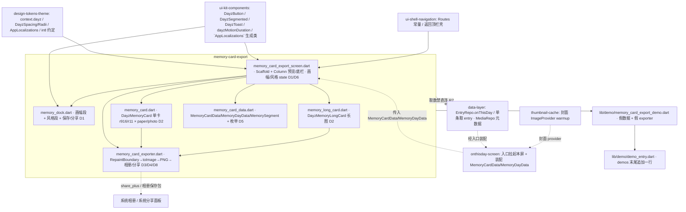

---
作者：@Ray
创建日期：2026-05-29
最后更新：2026-05-29
文档状态：草稿
---

# 设计：memory-card-export

> 视觉与映射依据：源屏 [`ui-design/current/pages/screens/memory.html`](../../../ui-design/current/pages/screens/memory.html)（`.mc`/`.mc.paper`/`.mc.photo`/`.lc`/`.mem-stage`/`.mem-dock` 版式与切换 JS）、[`ui-design/current/docs/DESIGN-REF.md`](../../../ui-design/current/docs/DESIGN-REF.md) §3（`.segmented` / `.btn` / 图标约定）/§3c 末行（`.mc` 标为屏内一次性件，写在该屏 `<style>`）、[`ui-design/current/docs/PROTOTYPE-ARCH.md`](../../../ui-design/current/docs/PROTOTYPE-ARCH.md) §6（`memory.html` → `RepaintBoundary.toImage()` → PNG → `share_plus` / 存相册；画幅 / 风格 = widget 参数）、方法论 [`docs/design/10-ui-restore-and-design-sync.md`](../../../docs/design/10-ui-restore-and-design-sync.md) §3/§4/§9（W3/W4 依附件）/§10/§11；媒体红线 [`docs/design/06`](../../../docs/design/06-encryption-and-security-policy.md)（主密码不保护照片）与缩略图 / 重活红线 [`docs/design/05`](../../../docs/design/05-backup-and-restore-architecture.md)（CLAUDE.md「重活进 isolate / 缩略图只暴露异步 warmup」指针）。token / `context.dayz.*` / `AppLocalizations` / `intl` 约定来自 `design-tokens-theme`（D1/D4）；`DayzButton`/`DayzSegmented`/`DayzToast`/`dayzMotionDuration` 来自 `ui-kit-components`；`Routes` 常量来自 `ui-shell-navigation`。

## 技术决策

### D1 · 屏脚手架：固定底栏 + 居中可滚预览舞台
- **状态：** 采纳
- **背景：** 源屏 `.pg.has-memdock` = 顶栏 + 唯一滚动区（`.app-scroll`，底部留白 206px 让开底栏）+ `.mem-dock`（`position:absolute;bottom:0`，始终可见）；`.mem-stage` 在顶栏与底栏间居中卡片，卡片更高时此区滚动而底栏不动。
- **选项：** (A) `Scaffold(bottomNavigationBar: dock, body: 滚动预览区)`；(B) `Stack` 手摆顶栏 / 滚动区 / 底栏；(C) `Scaffold(body: Column[Expanded(滚动区), dock])`。
- **选择：** C。`MemoryCardExportScreen` = `Scaffold`：`appBar` 用 `ui-shell` / `ui-kit` 的返回顶栏（标题「回忆卡片」），`body` = `Column`[`Expanded`( `SingleChildScrollView` 居中卡片，对应 `.mem-stage` + `.app-scroll`)，`MemoryDock`(底栏，对应 `.mem-dock`)]。底栏不进 `bottomNavigationBar`（它要承载两行分段 + 两个大按钮，非导航语义），而是 `Column` 末位常驻；底栏与 body 间用 `--hairline` 顶分割 + 上投影（`box-shadow:0 -8px...` 等价 `BoxShadow`）。
- **理由：** `Expanded` + 滚动区 + 常驻底栏精确对齐源屏「预览区滚、底栏定」语义，且不误用 `bottomNavigationBar` 的导航语义；`SafeArea` 处理底部留白（对应 dock 的 `calc(var(--sp-4)+14px)` 安全区垫高）。
- **代价：** 底栏高度随画幅行 dim 略变（长图时风格行禁用但仍占位），预览舞台高度随之轻微变化——可接受，舞台本就可滚。

### D2 · 卡片 widget 族：三画幅 × 两风格 + 长图，单组件参数化
- **状态：** 采纳
- **背景：** 源屏 `.mc`（单卡）有 `r916`/`r11` 画幅 × `paper`/`photo` 风格（CSS class 组合），`.lc`（长图）是独立结构（顶 + 逐段 `.lc-item` + 页脚）。§3c 末行明确 `.mc`/`.lc`/`.mem-*` 是**屏内一次性件、不进 `ui-kit`**，故卡片本体归本 spec、不进组件层。
- **选项：** (A) 一个巨 widget 用枚举 switch 全画所有形态；(B) `DayzMemoryCard`（单卡：`ratio` + `style` 两枚举参数）+ 独立 `DayzMemoryLongCard`（长图），共享页脚字标小件；(C) 每形态各一个独立 widget（6 个单卡 + 1 长图）。
- **选择：** B。`MemoryCardRatio{ portrait916, square11, long }` + `MemoryCardStyle{ paper, photo }` 两枚举；`DayzMemoryCard({required ratio, required style, required MemoryCardData data})` 承载单卡两风格两画幅（`aspectRatio` + 版式分支）；`DayzMemoryLongCard({required MemoryDayData data})` 承载长图；页脚字标（`Z` 徽 + `DayZ` + 元信息）抽 `_MemoryCardFooter` 私有件复用。`long` 画幅在屏层路由到 `DayzMemoryLongCard`、不进 `DayzMemoryCard`。
- **理由：** 单卡两风格共享同一数据与页脚、仅版式分支（纸感 = 纵向 photo+body / 大图压字 = `Stack` 满幅图 + 底渐变 + 压字），用枚举参数最贴源屏 class 组合心智；长图结构差异大，独立 widget 更清晰。
- **代价：** 屏层需按 `ratio==long` 在两个 widget 间切；逻辑简单、与源屏 JS 的 `card.hidden/long.hidden` 切换同构，可接受。

### D3 · 离屏栅格化：`RepaintBoundary` → `toImage()` → PNG，长图渲染完整尺寸
- **状态：** 采纳
- **背景：** PROTOTYPE-ARCH §6 指定 `RepaintBoundary.toImage()` → PNG。难点：① 长图（`DayzMemoryLongCard`）在预览里是**可滚动**的，可视区只显示一部分，而导出 MUST 是完整长卡（NF7）；② 像素清晰度依赖 `pixelRatio`（NF7）。
- **选项：** (A) 直接给预览区的卡片包 `RepaintBoundary`，`toImage` 当前可视区（长图会被截断 ✗）；(B) 导出时**离屏**构建一棵「完整尺寸、无滚动约束」的卡片子树（同一 `DayzMemoryCard`/`LongCard` widget，外层不加滚动、给足高度），挂在 `Overlay` / 独立 `View` 外渲染后 `toImage`；(C) 用 `dart:ui` 手画 `Canvas`（重造一套绘制 ✗ 与设计稿易漂移）。
- **选择：** B。导出走一个 `MemoryCardExporter`（util）：用一个带 `GlobalKey` 的 `RepaintBoundary` 包住**导出专用**的卡片子树（与预览同一组 widget、同一 `MemoryCardData`，但不套 `SingleChildScrollView`、用 `MediaQuery` 撑出完整高度），在离屏 `OverlayEntry`（或一帧 off-stage 渲染）里 layout → `boundary.toImage(pixelRatio: exportPixelRatio)` → `toByteData(png)`。`exportPixelRatio` 取 `max(devicePixelRatio, 3.0)`（NF7）。预览区的卡片只负责显示与可滚，**不**作为 `toImage` 源（解耦「看」与「导」，避免长图截断）。
- **理由：** 同一套卡片 widget 既给预览又给导出，零重绘漂移；离屏完整子树是 Flutter 导出超长内容的标准解（不依赖滚动位置）；`pixelRatio` 参数化保清晰。
- **代价：** 导出要多挂一次离屏渲染（一帧），长图很长时内存峰值较高——`DayzMemoryLongCard` 段数受「往年今日聚合」天然约束（个位数段），峰值可控；记已知风险。

### D4 · 保存相册 / 分享：`share_plus` + 相册保存包
- **状态：** 采纳
- **背景：** PROTOTYPE-ARCH §6 指定 `share_plus`；保存到系统相册 Flutter 无 SDK 内置，需第三方包；两者均触 `pubspec.yaml`（白名单外共享依赖，须显式列出）。
- **选项：** (A) 分享 `share_plus`；保存相册用活跃维护的相册保存包（如 `gal` / `image_gallery_saver` 一类，按引入时活跃度择优）；(B) 自写 platform channel 调原生相册；(C) 只做分享、不做保存相册（砍 R5 ✗ 违需求）。
- **选择：** A。分享 = `share_plus`（`SharePlus.instance.share(...)` 传 PNG 临时文件 / `XFile`）；保存相册 = 选一个**活跃维护**的相册保存包（**包名待实现时核活跃度定**，倾向 `gal`：维护活跃、iOS/Android 权限封装完整、API 简洁）。两包都封装在 `MemoryCardExporter` 内部，屏层只调 `exporter.saveToGallery(...)` / `exporter.share(...)`，便于 demo / 测试用假 exporter 注入。
- **理由：** `share_plus` 是 §6 指定且生态主流；相册保存交给成熟包抹平 iOS（Photos 权限）/ Android（MediaStore / 旧版 WRITE_EXTERNAL_STORAGE）差异（NF5），不自写 channel。
- **代价：** 引两个第三方依赖 + 平台权限声明（iOS `Info.plist` 的 `NSPhotoLibraryAddUsageDescription`、Android 清单权限），属白名单外文件须显式列出并确认；包活跃度待核（已知风险）。

### D5 · 导出源模型：纯数据 + image provider，取数经 Repository
- **状态：** 采纳
- **背景：** R7 / NF6：卡片内容经 `EntryRepo`（单条 / `onThisDay(month,day)` 聚合）+ `MediaRepo`（封面元数据）取得；屏 widget 须能用假数据独立 widget test、且不持 Drift。封面图须由上游 provider 给（不在本屏生成缩略图，NF6 缩略图红线）。
- **选项：** (A) 屏 widget 直接收 Repo 句柄、屏内查询；(B) 屏 widget 只收**纯数据模型**（`MemoryCardData` / `MemoryDayData`）+ `ImageProvider?` 封面，取数 / 装配在屏外（外壳 / 往年今日入口 / demo 层）经 Repository 完成；(C) 屏内持 Drift（✗ 违 R7）。
- **选择：** B。本 spec 定义两个**纯展示数据模型**：
  - `MemoryCardData{ overline(往年段文案), title, excerpt, location?, coverImage: ImageProvider? }`（单卡源，封面是 provider 不是路径）。
  - `MemoryDayData{ monthDayLabel, count, segments: List<MemorySegment> }`，`MemorySegment{ yearLabel, agoLabel, title, body, photo: ImageProvider? }`（长图源）。
  屏接收 `MemoryCardData` 或 `MemoryDayData` 作入参；**装配适配器**（把 `EntryRepo`/`MediaRepo` 结果 + 缩略图 provider 映射成上述模型）放屏外——本 spec 不写 Repo 实现、只调用其交付物签名，装配落点在 `onthisday-screen` 入口或 demo 层（data-layer 未就绪期用假数据，记已知风险）。`overline`/`yearLabel`/`agoLabel`/`monthDayLabel`/`count` 文案经 `intl` 在装配处格式化、不在屏内裸拼接。
- **理由：** 屏 widget 纯函数式（数据进、像素出），守 R7（无 Drift import）、NF6（封面是上游 provider），且可假数据独测；与 `ui-kit` 的 `DayzGallery`「只接 ImageProvider 列表」同构。
- **代价：** 多一层装配适配器（不在本 spec 实现，留入口 spec / demo）；data-layer / 往年今日未就绪期屏只能跑假数据，真实链路后接——分层必然，可接受。

### D6 · 画幅 / 风格状态与长图固定纸感联动
- **状态：** 采纳
- **背景：** 源屏 JS：两组 `.segmented` 各自管选中；切「长图」→ `card.hidden=true; long.hidden=false; styleRow.classList.add('dim')`（风格行禁用置灰）；切回非长图 → 恢复并把 `r916/r11` class 套回单卡。风格切换只在单卡上换 `paper/photo`。
- **选项：** (A) 屏内 `StatefulWidget` 持 `(ratio, style)` 两个 `setState` 字段；(B) 引一个状态管理库；(C) 把状态提到外壳。
- **选择：** A。`MemoryCardExportScreen` 为 `StatefulWidget`，持 `MemoryCardRatio _ratio`（默认 `portrait916`）与 `MemoryCardStyle _style`（默认 `paper`）。派生规则：`_isLong = _ratio == long`；`_isLong` 时风格行 `DayzSegmented` 置 `enabled:false`（视觉 dim + 不可点，对应 `.row.dim` 的 `opacity:0.4;pointer-events:none`），长图固定 `paper` 版式；切回非长图恢复风格行可交互并沿用上次 `_style`。切画幅 / 风格后预览舞台滚动位置归零（对应源屏 `stage.parentElement.scrollTop=0`）。
- **理由：** 二值 / 三值低频本地 UI 状态，`setState` 足够（与 tokens-theme 示例「二值低频 setState 足够」同调）；联动规则单点在屏 state 内，易 widget test 断言（切长图后风格段 `enabled==false`）。
- **代价：** 状态在屏内、不跨屏；本屏是叶子导出屏无需跨屏共享，恰当。

### D7 · 文案集中 `AppLocalizations` + 日期 / 数字走 `intl`（落实 docs/design/11）
- **状态：** 采纳
- **背景：** UI 文案唯一来源是 zh/en ARB。本屏文案：标题「回忆卡片」、画幅 / 风格分段项名（竖版 / 方形 / 长图 / 纸感 / 大图压字）、保存 / 分享、各 toast、返回 / 各项 Semantics 标签、字标 `DayZ`。
- **选项：** (A) 屏内裸中文字面量；(B) 在 `lib/l10n/arb/app_zh.arb` 与 `app_en.arb` 补本屏 key（屏内经 `l10n.xxx` 取用）。
- **选择：** B。补 zh/en ARB key 并跑 `gen-l10n`；往年段 / 年份 / 「N 段回忆」/「写过 N 篇」等日期 / 计数文案走 `package:intl` / ARB ICU，且在 D5 的装配处格式化（屏只收成品文案），不在屏内自拼 `'2021年5月'` / `'共 2 段'`。widget 测试用 `find.text(l10n.xxx)` 而非裸中文。
- **理由：** 与全项目文案策略一致、自带「只引常量」回归护栏；日期 / 计数走 intl 把高频散落点收敛。
- **代价：** `app_zh.arb` / `app_en.arb` 是跨 spec 文件，需保持 key 集合一致并跑 `gen-l10n`。

### D8 · 安全 / 权限红线落地（NF6 / R5 / R6）
- **状态：** 采纳
- **背景：** NF6：导出 = 把（可能受主密码语义保护的）日记文字 + 照片以**明文 PNG** 外发到相册 / 系统分享；媒体 key 独立于主密码、主密码本就不保护照片（docs/design/06）。R5/R6：相册写入 / 分享有失败 / 取消路径，MUST NOT 静默吞错。
- **选项：** (A) 不提示、自动导出；(B) 导出仅由显式点击触发，失败 / 拒权有 toast 反馈，UI 不出现「导出物仍受保护 / 加密」字样，必要处一句中性说明导出为明文外发。
- **选择：** B。① **无自动导出**：保存 / 分享只在用户点按时触发；② **失败显形**：相册权限被拒 / 写入失败 / 生成失败 → 失败 toast（`AppLocalizations`，`DayzToast` tone=danger），分享取消属正常、静默回屏；③ **导出进行中防重入**：导出期间按钮 disable（接 NF7「防重复触发」），避免连点生成多份；④ UI 文案 MUST NOT 暗示导出物受保护 / 加密；是否再加一句「图片将以明文保存 / 分享」说明 → **待确认**（@Ray 决定是否需要，避免过度打扰；红线本身是「不误导」，不强制必须有提示）。
- **理由：** 把 docs/design/06 的「主密码锁不住照片、且导出是明文外发」如实落到 UI 行为（显式、不误导、失败显形），不在 UI 写出违反加密策略的暗示。
- **代价：** 失败路径与防重入多写若干分支与状态；安全红线的应有成本，且都可 widget test（注入失败的假 exporter 断言 toast）。

### D9 · Debug Home 入口（本屏 demo）
- **状态：** 采纳
- **背景：** 方法论 §10 第 5 条 / CLAUDE.md「Debug Home demo 入口模式」：每个 UI spec 末尾挂一个 Debug Home 入口，`demos` 列表**末尾追加一行**（不插中间、不改 `DemoEntry` 字段）。
- **选择：** 新建 `lib/demo/memory_card_export_demo.dart`：用假 `MemoryCardData` / `MemoryDayData`（含本地占位图 provider）渲染本屏，可切画幅 / 风格、可点保存 / 分享（demo 注入**假 exporter**，stub 导出、断言被调用即可，不真写相册 / 不真分享）；`lib/demo/demo_entry.dart` 的 `demos` 列表末尾追加一行。
- **理由：** 真外壳 / 往年今日入口未全就绪前，这是本屏在真机被看见与 widget test 独立 pump 的入口；假 exporter 让 demo / 测试不触系统相册 / 分享。
- **代价：** 与真链路略有重复（demo 用假数据 + 假 exporter）；换来独立可测 + 真机走查入口，值。

## 架构

## 文件变更

> 本 spec 任务「可改文件」的**唯一来源与上界**；任一任务可改文件 MUST ⊆ 本清单。全部新建 Dart 文件 MUST 加 MPL-2.0 头注。卡片本体（`.mc`/`.lc`）按 §3c 末行属屏内一次性件、归本 spec，不进 `ui-kit`。

**屏与组件 `lib/ui/memory_card_export/`**
- `lib/ui/memory_card_export/memory_card_export_screen.dart`   新建（屏脚手架：Scaffold + Column 预览舞台 / 底栏 + 画幅 / 风格 state + 长图联动，D1/D6）
- `lib/ui/memory_card_export/memory_dock.dart`                 新建（固定底栏：画幅段 + 风格段 + 保存 / 分享按钮，复用 `DayzSegmented`/`DayzButton`，D1）
- `lib/ui/memory_card_export/memory_card.dart`                 新建（`DayzMemoryCard` 单卡：`r916`/`r11` × `paper`/`photo` + `_MemoryCardFooter`，D2）
- `lib/ui/memory_card_export/memory_long_card.dart`            新建（`DayzMemoryLongCard` 长图：顶 + 逐段 `lc-item` + 页脚，D2）
- `lib/ui/memory_card_export/memory_card_data.dart`            新建（`MemoryCardData`/`MemoryDayData`/`MemorySegment` 纯数据模型 + `MemoryCardRatio`/`MemoryCardStyle` 枚举，D5）
- `lib/ui/memory_card_export/memory_card_exporter.dart`        新建（`MemoryCardExporter`：离屏 `RepaintBoundary`→`toImage(pixelRatio)`→PNG→相册 / 分享；定义可被假实现替换的接口，D3/D4/D8）

**gen-l10n 文案**
- `lib/l10n/arb/app_zh.arb`、`lib/l10n/arb/app_en.arb`                            修改（补本屏 zh/en 文案与 Semantics key，D7）
- `lib/l10n/gen/app_localizations*.dart`                                           修改（`flutter gen-l10n` 生成产物）

**Debug Home 入口 `lib/demo/`**
- `lib/demo/memory_card_export_demo.dart`                      新建（假数据 + 假 exporter 渲染本屏，D9）
- `lib/demo/demo_entry.dart`                                   修改（**仅末尾追加一行**，不插中间、不改 `DemoEntry` 字段，D9）

**共享依赖与平台权限**
- `pubspec.yaml`                                               修改（`dependencies` 加 `share_plus` + 相册保存包〔包名待核活跃度定，倾向 `gal`〕；`intl` 为 SDK 传递依赖不新增）
- `pubspec.lock`                                               修改（`flutter pub get` 后锁定版本，pub get 副产物）
- `ios/Runner/Info.plist`                                      修改（加 `NSPhotoLibraryAddUsageDescription` 文案；相册保存权限说明）
- `android/app/src/main/AndroidManifest.xml`                   修改（按所选保存包要求加相册写入权限 / `maxSdkVersion` 限定，按包文档定）

**测试目录（白名单 hook 对 `test/**/*_test.dart` 自动放行；非 `_test.dart` 共享基建由任务 `验收基建` 字段预批）**
- `test/ui/memory_card_export/`                                新建（屏 / 卡片 / 底栏 / exporter widget test）
- `test/demo/memory_card_export_demo_test.dart`               新建（demo + Debug Home 入口测试）

## 已知风险

- **跨 spec 依赖（按交付物名引用，多数尚未实现 / 未定稿；本屏照实声明、不假装已存在）**：
  - `design-tokens-theme`（README 依赖）：`context.dayz.*`、`DayzSpacing/DayzRadii/DayzMotion`、六套 `ThemeData`、`AppLocalizations`/`intl` 约定、`glassSurface`/`fabGradient`（本屏顶栏沿用外壳，不直接用 glass）。未定稿则本屏被阻塞（READY 门）。
  - `ui-kit-components`（README 依赖）：`DayzButton`/`DayzSegmented`/`DayzToast`/`dayzMotionDuration`。**未就绪降级**：分段 / 按钮 / toast 用最小内联占位（走 token），文案仍走 ARB / `AppLocalizations`，MUST NOT 用屏内 const 或静态文案常量暂存。
  - `ui-shell-navigation`（README 依赖）：返回顶栏壳、`Routes`（本屏作为可被路由到的叶子屏，路由名待 shell 在 `Routes` 加常量；归属在 shell / README 协调）。未就绪降级用最小内联返回顶栏。
  - `onthisday-screen`（README 依赖，**尚未立项**）：本屏的**入口拉起方**与 `MemoryCardData`/`MemoryDayData` 装配方（把 `EntryRepo.onThisDay`/`MediaRepo` 结果 + 封面 provider 经 `intl` 映射成模型）。**待确认**：装配适配器代码归 `onthisday-screen` 还是本屏——倾向归入口 spec（本屏只收纯模型）；若入口 spec 决定不承载，则需回填本 spec `## 文件变更` 增一个装配文件并复核归属。未立项期，本屏只能跑 demo 假数据。
  - `data-layer`（**非依赖、明确禁连**，R7/NF5）：`EntryRepo.onThisDay(month,day)` / 单条取 entry、`MediaRepo` 元数据是装配方的取数入口；本屏 widget MUST NOT import `lib/data` 或持 Drift 句柄，verification 留静态核验。
  - `thumbnail-cache` / `media-storage`（README 依赖含 media-storage）：封面 `ImageProvider` 由 `thumbnail-cache` warmup / `MediaRepo` 原图提供；本屏只**消费** provider，MUST NOT 在预览 / 导出路径同步重建缩略图（NF6 缩略图红线，docs/design/05）。
- **第三方包活跃度（D4）**：相册保存包（倾向 `gal`）与 `share_plus` 版本须在首次 `flutter pub get` 时核对与当前 stable Flutter 兼容；相册保存包若停滞，退路是另选活跃包或自写 platform channel（只动 `memory_card_exporter.dart` + 平台权限文件，不影响屏 / 卡片本体）。**标为待确认**。
- **离屏长图内存峰值（D3）**：`DayzMemoryLongCard` 以高 `pixelRatio` 离屏栅格化完整长卡，段数多 / 配图多时内存峰值较高；段数受往年今日聚合天然约束（个位数），可接受；若实测过大，降级为分段拼接或降 `pixelRatio`（记此处，不在本 spec 预先优化）。
- **大图压字款白字对比度（NF1）**：白字压在照片上，对比度依赖底部渐变遮罩足够暗（设计稿渐变末端 `rgba(20,16,12,0.82)`）；照片本身亮暗不可控，验收按「渐变最暗端区域」对验白字，照片中段的局部低对比属设计取舍（与源屏一致），不强求全图达标——记为已知像素差。
- **平台权限文案 / 清单（D4）**：`ios/Runner/Info.plist` 与 `android/app/src/main/AndroidManifest.xml` 是白名单外共享文件，已在 `## 文件变更` 显式列出并归入引入保存包的任务白名单；改动须经确认。
- **安全：明文导出是有意为之（NF6/D8）**：导出物不受主密码保护是产品行为（docs/design/06），UI 只须「不误导 + 显式触发 + 失败显形」；是否额外加一句明文外发说明 → 待 @Ray 确认。
- **无持久化 schema 变更 → 无数据迁移 / 回滚要素**（本屏不碰 DB schema，取数经 Repository 只读、导出只写相册 / 分享，不改 DB）。
- **新文件加 MPL-2.0 头注**：`lib/ui/memory_card_export/*.dart`、`lib/demo/memory_card_export_demo.dart` 全部新建 Dart 文件 MUST 在文件顶部加 MPL-2.0 头注（模板见 README「License」/ AGENTS.md）。
