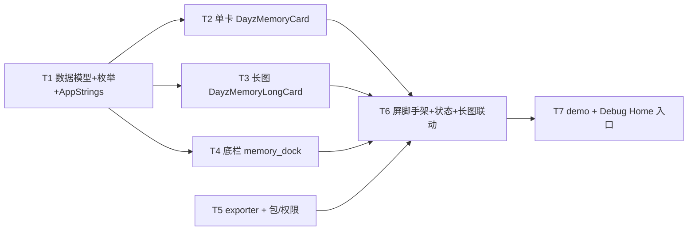

---
作者：@Ray
创建日期：2026-05-29
最后更新：2026-05-29
文档状态：草稿
---

# 任务列表：memory-card-export

## 任务依赖图
> 由各任务 inline「同 spec 依赖」字段汇总，以 inline 为准。



并行组：
- Group A：T1、T5（T5 只动 exporter / 包 / 权限，与 T1 数据模型无依赖，可并行）
- Group B：T2、T3、T4（均依赖 T1，三者并行）
- Group C：T6（依赖 T2/T3/T4/T5）
- Group D：T7（依赖 T6）

（整屏一体、无可独立部署 / 演示的中间切点 → 不设里程碑。）

-----

- [ ] T1 · 导出源数据模型 + 枚举 + AppStrings 文案追加

**同 spec 依赖：** 无 ｜ **跨 spec 依赖：** `ui-kit-components`：`lib/ui/strings/app_strings.dart`（`AppStrings` 单类，本任务向其追加条目，归属见 ui-kit D10）；`design-tokens-theme`：`intl` / `AppStrings` 约定 ｜ **关联需求：** R1, R4, R7 ｜ **依据设计：** D5, D7 ｜ **可改文件：** `lib/ui/memory_card_export/memory_card_data.dart`、`lib/ui/strings/app_strings.dart`（仅追加本屏条目，不改既有） ｜ **验收基建：** `test/ui/memory_card_export/memory_card_data_test.dart`

### 背景
定义屏 / 卡片消费的**纯展示数据模型**与画幅 / 风格枚举（D5），并把本屏中文文案追加进 `ui-kit-components` 已建的 `AppStrings` 单类（D7）。模型不含任何 Drift / Repo 类型（R7）。
归属：`AppStrings` 文件由 `ui-kit-components` 创建、各屏增补（README / ui-kit D10 已拍板）；本任务**只追加**本屏条目、不改既有条目，不重复创建该文件。

### 实施
1. `memory_card_data.dart`：`MemoryCardData{ String overline, String title, String excerpt, String? location, ImageProvider? coverImage }`；`MemoryDayData{ String monthDayLabel, int count, List<MemorySegment> segments }`；`MemorySegment{ String yearLabel, String agoLabel, String title, String body, ImageProvider? photo }`；枚举 `MemoryCardRatio{ portrait916, square11, long }`、`MemoryCardStyle{ paper, photo }`。封面 / 配图字段是 `ImageProvider`（不是路径，NF6）。日期 / 计数文案字段（`overline`/`yearLabel`/`agoLabel`/`monthDayLabel`）是**已格式化成品字符串**（由屏外装配处用 `intl` 生成，模型不自拼）。
2. `app_strings.dart` 追加 `static const`：屏标题、画幅项名（竖版 / 方形 / 长图）、风格项名（纸感 / 大图压字）、保存 / 分享、保存成功 / 长图保存成功 / 分享 / 长图分享 / 失败各 toast、返回及各分段项 / 按钮的 Semantics 标签、`DayZ` 字标。屏内 / 卡片内**禁裸中文**，一律引这些常量。
3. 全部新建 Dart 文件加 MPL-2.0 头注。

### 验收标准（做完即止）
- 构造 `MemoryCardData` / `MemoryDayData` / `MemorySegment`，字段读取与默认 / 可空语义正确（自动）。
- 两枚举值齐全（`portrait916`/`square11`/`long`、`paper`/`photo`）（自动）。
- 新增 `AppStrings` 条目可被引用且为中文非空字面量（自动：断言关键条目值非空且为预期文案）。
- `memory_card_data.dart` 不 import `package:.../data/` 或 Drift（自动，R7：解析 import 断言不含数据层 / Drift 包）。

### 验收方式
- 自动：
  ```bash
  flutter test test/ui/memory_card_export/memory_card_data_test.dart
  ```
  （构造模型断言字段 / 枚举；断言 `AppStrings` 新条目值；用源码 import 解析断言不依赖 data 层——断言行为 / 取值，不 grep 被改文件自身文本）

### 验收记录
```
日期：—
自动：—
人工：N/A
```

-----

- [ ] T2 · 单卡 `DayzMemoryCard`（r916/r11 × paper/photo）

**同 spec 依赖：** T1 ｜ **跨 spec 依赖：** `design-tokens-theme`：`context.dayz.*` / `DayzSpacing`/`DayzRadii`/`DayzFonts` / 排版 `TextStyle`（`.t-*`）；`ui-kit-components`：地点 / 字标等图标走 `dayz_icons`（§5 规范 SVG path，未就绪用内联占位） ｜ **关联需求：** R1, R2, R3 ｜ **依据设计：** D2 ｜ **可改文件：** `lib/ui/memory_card_export/memory_card.dart` ｜ **验收基建：** `test/ui/memory_card_export/memory_card_test.dart`、`test/ui/memory_card_export/fixtures/`（假 `MemoryCardData` + 占位图 provider helper）、`test/ui/memory_card_export/golden/`（栅格观感 golden 基线）

### 背景
实现 `DayzMemoryCard({required MemoryCardRatio ratio, required MemoryCardStyle style, required MemoryCardData data})`（D2）：纸感款 = 表面底 + 照片区(`accent-soft` 占位) + 正文区(往年段 `accent-ink` + 衬线标题 + 摘要 3 行钳制 / 方形 2 行)；大图压字款 = `Stack` 满幅图 + 底部线性渐变遮罩 + 压白字（标题 / 摘要 2 行钳制）；页脚 `_MemoryCardFooter`（`Z` 徽 + `DayZ` 字标 + 地点 meta）。`ratio` 控制 `aspectRatio`（9:16 / 1:1）。视觉全走 token，禁硬编码颜色 / 字号 / 间距（源屏 `<style>` 里的 px 值反查 token：`--r-lg`/`--sp-*`/`--surface`/`--accent-soft`/`--accent-ink`/`--ink`/`--ink-2`/`--ink-3` 等；大图压字款的白字 / 黑底渐变是该款专属设计色，按设计稿固定值）。`long` 不进本 widget（屏层路由到 T3）。

### 实施
1. `paper` 版式：`Column`[照片区 `Expanded`(有图 `Image(coverImage)` cover / 无图 `accent-soft` 占位) , 正文区 `Padding`(往年段 + 衬线标题 + 摘要 `Text(maxLines: ratio==square11?2:3, overflow: ellipsis)` + 页脚)]，外层 `--r-lg` 圆角 + clip + 卡片投影。
2. `photo` 版式：`Stack`[`Image` cover 满幅 , 底部渐变 `DecoratedBox(LinearGradient 透明→rgba(20,16,12,0.82))` , 底部 `Positioned` 正文(往年段 / 白标题 / 白摘要 2 行 / 白页脚)]。
3. `aspectRatio`：`portrait916`→9/16、`square11`→1/1（用 `AspectRatio`）。
4. `_MemoryCardFooter`：`Z` 方徽(accent 底 / on-accent 字，photo 款白底深字) + `DayZ`(`AppStrings`) + 右侧地点 meta(图标 + 文本)。
5. 文案引 `AppStrings`、地点 / 往年段取 `data` 字段；全程 token。

### 验收标准（做完即止）
- `ratio==portrait916` 渲染出 9:16、`square11` 出 1:1（自动：`tester.getRect` 断言宽高比，fixed-geometry 容差 ≤2px）。
- `style==paper` 出正文区与照片区两块、`photo` 出 `Stack` 满幅图 + 渐变 + 压字（自动：按 key / 类型定位断言结构存在）。
- 摘要行钳制：方形 `maxLines==2`、竖版 `maxLines==3`，`overflow==ellipsis`（自动，对应 ②样式参数闸的截断族）。
- 颜色 / 圆角 / 间距取自 `context.dayz.*` / `DayzRadii` / `DayzSpacing`（自动：解析渲染后样式断言 == token 值，如圆角 == `DayzRadii.lg`、纸感底 == `context.dayz.surface`）。
- 标题 / 摘要文案经 `find.text(AppStrings.xxx)` 或 `data` 字段定位，屏内无裸中文（自动）。
- golden 兜栅格（六主题抽查 / 两风格两画幅）（自动，回归锁）。

### 禁止
- 不实现长图（归 T3）；不实现底栏 / 切换 / 导出（归 T4/T5/T6）；不在卡片内取数（R7）。

### 验收方式
- 自动：
  ```bash
  flutter test test/ui/memory_card_export/memory_card_test.dart
  ```
  （pump 各 ratio×style 组合，`getRect` 断宽高比 / 解析样式断 token 值 / `find.text` 断文案 / golden）

### 验收记录
```
日期：—
自动：—
人工：N/A
```

-----

- [ ] T3 · 长图 `DayzMemoryLongCard`（整天多段回忆）

**同 spec 依赖：** T1 ｜ **跨 spec 依赖：** `design-tokens-theme`：`context.dayz.*` / `DayzSpacing`/`DayzRadii` / 排版 ｜ **关联需求：** R2, R4 ｜ **依据设计：** D2 ｜ **可改文件：** `lib/ui/memory_card_export/memory_long_card.dart` ｜ **验收基建：** `test/ui/memory_card_export/memory_long_card_test.dart`、`test/ui/memory_card_export/golden/`

### 背景
实现 `DayzMemoryLongCard({required MemoryDayData data})`（D2，对应源屏 `.lc`）：顶 `lc-top`(`accent-soft` 底 + 往年今日 M月D日 段 + 「这一天，你写过 N 篇」) + 逐段 `lc-item`(年份标 `accent-ink` + 可选 16:10 配图 + 衬线小标题 + 正文) + 页脚 `lc-foot`(`Z` 徽 + `DayZ` + 「M月D日 · 共 N 段回忆」)。段间 `--hairline` 分割。整卡是**内容驱动高度**（不固定高），段数 == `data.segments.length`。文案 / 计数走 `data` 字段（已 intl 格式化）+ `AppStrings`，禁裸中文 / 禁裸拼接。

### 实施
1. `Column`(`mainAxisSize: min`)[`lc-top` , `...segments.map(_segment)` , `lc-foot`]，外层 `--r-lg` 圆角 + clip + 卡片投影 + `surface` 底。
2. `_segment`：年份标 + （有 `photo` 则 16:10 `AspectRatio` cover 图 + `--r-sm` 圆角）+ 衬线标题 + 正文 `Text`（`text-wrap: pretty` 无 Flutter 等价 → 普通换行，不钳制行数：长图正文要看全貌）。
3. 计数 / 日期文案取 `data.count` / `data.monthDayLabel`（成品串）+ `AppStrings` 模板拼装（如「写过 N 篇」的「篇」「这一天，你」固定词走 `AppStrings`、N 是 `data.count`）。
4. 全程 token；新文件加 MPL-2.0 头注。

### 验收标准（做完即止）
- 渲染段数 == `data.segments.length`（自动：按段 key 计数）。
- 顶部「写过 N 篇」与页脚「共 N 段回忆」中的 N == `data.count` / `segments.length`（自动：`find.text` 断言含正确计数的成品文案）。
- 有 `photo` 的段出 16:10 配图、无 `photo` 的段不出图（自动：按段断图存在性 + `getRect` 断 16:10，content 段块高不硬断）。
- 顶 / 段 / 脚的底色 / 圆角 / 分割线取自 `context.dayz.*`（自动：解析样式断 token 值）。
- golden 兜栅格（自动，回归锁）。

### 禁止
- 不实现单卡 / 底栏 / 导出；正文不做行钳制（长图要全貌）。

### 验收方式
- 自动：
  ```bash
  flutter test test/ui/memory_card_export/memory_long_card_test.dart
  ```

### 验收记录
```
日期：—
自动：—
人工：N/A
```

-----

- [ ] T4 · 固定底栏 `MemoryDock`（画幅段 + 风格段 + 保存 / 分享）

**同 spec 依赖：** T1 ｜ **跨 spec 依赖：** `ui-kit-components`：`DayzSegmented`（分段控件，含选中语义 / ≥44 命中区）、`DayzButton`（`.btn-soft`/`.btn-primary` + 图标）、`dayzMotionDuration`；`design-tokens-theme`：`context.dayz.*` / `DayzSpacing` ｜ **关联需求：** R2, R3, R5, R6, NF2, NF3, NF4 ｜ **依据设计：** D1, D6 ｜ **可改文件：** `lib/ui/memory_card_export/memory_dock.dart` ｜ **验收基建：** `test/ui/memory_card_export/memory_dock_test.dart`

### 背景
实现 `MemoryDock`（D1，对应源屏 `.mem-dock`）：纯展示 + 回调，**不持状态**（状态在 T6 屏 state，本件接收当前 `ratio`/`style`/`styleEnabled` + `onRatioChanged`/`onStyleChanged`/`onSave`/`onShare` 回调）。两行：画幅行（`DayzSegmented` 三项：竖版 / 方形 / 长图）、风格行（`DayzSegmented` 两项：纸感 / 大图压字，`enabled` 由入参控制——长图时禁用置灰，对应 `.row.dim`）+ 一行两个大按钮（保存 `btn-soft` + 图标 / 分享 `btn-primary` + 图标，各 `Expanded` 平分）。`surface` 底 + 顶 `--hairline` + 上投影。
归属：长图 ↔ 风格禁用的**联动逻辑**归 T6 屏 state；本件只按 `styleEnabled` 入参渲染禁用态、不自己判 `ratio==long`。

### 实施
1. 画幅 `DayzSegmented`(items=竖版 / 方形 / 长图，selected=ratio，onChanged=onRatioChanged)，标签「画幅」(`AppStrings`)。
2. 风格 `DayzSegmented`(items=纸感 / 大图压字，selected=style，enabled=styleEnabled，onChanged=onStyleChanged)，标签「风格」；`!styleEnabled` 时整行 `Opacity(0.4)` + 忽略点击（对应 `.row.dim`）。
3. 按钮行：`DayzButton.soft`(保存，图标 + `AppStrings.save`，onPressed=onSave) + `DayzButton.primary`(分享，图标 + `AppStrings.share`，onPressed=onShare)，各 `Expanded`；动效经 `dayzMotionDuration`。
4. 全程 token；图标走 `dayz_icons` 或内联规范 SVG（§5）。
5. 新文件加 MPL-2.0 头注。

### 验收标准（做完即止）
- 点画幅每项触发 `onRatioChanged` 对应值；点风格每项触发 `onStyleChanged`（自动）。
- `styleEnabled==false` 时风格行不可点（点击不触发 `onStyleChanged`）且视觉降透（自动，R3）。
- 保存 / 分享按钮点击各触发 `onSave`/`onShare`（自动）。
- 每个分段项 / 两按钮 / 命中区 ≥ 44×44（自动，NF2：`getRect` 断命中盒）。
- 分段项与按钮有 Semantics 标签、选中态经语义暴露（自动，NF3：`find.bySemanticsLabel` + selected 语义）。
- reduce-motion（`MediaQueryData(disableAnimations:true)`）下切换动效时长为 0（自动，NF4）。

### 验收方式
- 自动：
  ```bash
  flutter test test/ui/memory_card_export/memory_dock_test.dart
  ```

### 验收记录
```
日期：—
自动：—
人工：N/A
```

-----

- [ ] T5 · 导出器 `MemoryCardExporter`（离屏栅格化 + 相册 / 分享 + 包 / 权限）

**同 spec 依赖：** 无 ｜ **跨 spec 依赖：** 无（`share_plus` / 相册保存包为本任务自带 pubspec 依赖） ｜ **关联需求：** R5, R6, NF5, NF6, NF7 ｜ **依据设计：** D3, D4, D8 ｜ **可改文件：** `lib/ui/memory_card_export/memory_card_exporter.dart`、`pubspec.yaml`（仅 `dependencies` 加 `share_plus` + 相册保存包）、`pubspec.lock`、`ios/Runner/Info.plist`、`android/app/src/main/AndroidManifest.xml` ｜ **验收基建：** `test/ui/memory_card_export/memory_card_exporter_test.dart`、`test/ui/memory_card_export/fixtures/`（可注入的假 exporter / 假分享 / 假相册 sink）

### 背景
实现 `MemoryCardExporter`（D3/D4/D8）：把传入的卡片 widget 子树在**离屏**带 `GlobalKey` 的 `RepaintBoundary` 里以 `pixelRatio = max(devicePixelRatio, 3.0)` 渲染 → `toImage` → `toByteData(png)` → 写系统相册（相册保存包）/ 调系统分享（`share_plus`）。定义为可被假实现替换的**接口 + 真实现**（屏 / demo 注入假 exporter，T7 / 测试用）。长图导出渲染**完整长卡**（不套滚动、给足高度，NF7）。失败 / 拒权返回可观测结果（成功 / 失败 / 取消），交屏层出 toast（D8）。
归属：本任务自持 `share_plus` + 相册保存包（`dependencies` 段）+ 两端权限文件；T2/T3/T4 不碰 pubspec / 权限。

### 实施
1. 定义接口 `MemoryCardExporter`（`Future<ExportResult> saveToGallery(Widget card)`、`Future<ExportResult> share(Widget card)`，`ExportResult{ success, cancelled, error }`）+ 真实现 `PlatformMemoryCardExporter`。
2. 离屏渲染：用 off-stage `RepaintBoundary`（`GlobalKey`）+ 给定 `MediaQuery` 撑出完整尺寸 → `boundary.toImage(pixelRatio)` → PNG bytes。长图给足高度、不截断（NF7）。
3. 保存相册：相册保存包写 PNG bytes / 临时文件；捕获权限拒绝 / 写入失败 → `ExportResult` 标错（不抛到 UI，R5/D8）。
4. 分享：`share_plus` 分享 PNG（`XFile` / 临时文件）；用户取消 → `cancelled`（正常路径，R6）。
5. `pubspec.yaml` 加 `share_plus` + 相册保存包（包名核活跃度，倾向 `gal`）；`flutter pub get` 锁 `pubspec.lock`。
6. iOS `Info.plist` 加 `NSPhotoLibraryAddUsageDescription`（文案为相册保存说明）；Android `AndroidManifest.xml` 按所选包要求加权限。
7. 新文件加 MPL-2.0 头注。

### 验收标准（做完即止）
- 给定一棵卡片 widget，`saveToGallery` / `share` 产出非空 PNG bytes（自动：在 widget test 里离屏渲染一棵简单 `RepaintBoundary` 子树，断言 `toImage`→PNG bytes 非空且可解码、宽高 == 卡片逻辑尺寸 × pixelRatio，NF7）。
- 长图（高 > 视口）离屏渲染产出的 PNG 高度对应**完整**卡片而非视口（自动：断言导出位图高度 ≈ 完整子树高度 × pixelRatio，NF7）。
- 假相册 sink 注入「拒权 / 写入失败」→ `ExportResult.error` 非空、不抛异常（自动，R5/D8）。
- 假分享注入「取消」→ `ExportResult.cancelled==true`、不报错（自动，R6）。
- `flutter pub get` 通过、`pubspec.yaml` 解析无误（自动）。

### 禁止
- 不在导出路径生成 / 重建缩略图（NF6）；不写任何 DB / SQL（封面 provider 由上游给）；不自动导出（仅由屏层显式调用，D8）。

### 验收方式
- 自动：
  ```bash
  flutter pub get && flutter test test/ui/memory_card_export/memory_card_exporter_test.dart
  ```
  （离屏渲染断 PNG bytes / 尺寸 / 完整长图；假 sink 注入断失败 / 取消结果——断行为，不 grep 被改文件）

### 验收记录
```
日期：—
自动：—
人工：N/A
```

-----

- [ ] T6 · 屏脚手架 `MemoryCardExportScreen`（组装 + 画幅 / 风格 state + 长图联动 + 导出接线）

**同 spec 依赖：** T2, T3, T4, T5 ｜ **跨 spec 依赖：** `ui-shell-navigation`：返回顶栏壳 / `Routes`（未就绪用最小内联返回顶栏）；`ui-kit-components`：`DayzToast`（导出反馈，未就绪用占位）；`design-tokens-theme`：`context.dayz.*` ｜ **关联需求：** R1, R2, R3, R4, R5, R6, R7, NF1, NF4, NF6 ｜ **依据设计：** D1, D5, D6, D8 ｜ **可改文件：** `lib/ui/memory_card_export/memory_card_export_screen.dart` ｜ **验收基建：** `test/ui/memory_card_export/memory_card_export_screen_test.dart`、`test/ui/memory_card_export/fixtures/`

### 背景
组装屏（D1/D6）：`Scaffold`(返回顶栏「回忆卡片」) + `Column`[`Expanded`(`SingleChildScrollView` 居中卡片，对应 `.mem-stage`，按 `_ratio` 显示 `DayzMemoryCard` 或 `DayzMemoryLongCard`) , `MemoryDock`]。持 `_ratio`(默认 `portrait916`)、`_style`(默认 `paper`) state；长图联动：`_isLong = _ratio==long` → 给 `MemoryDock` 传 `styleEnabled:!_isLong`，长图强制 `paper` 版式；切画幅 / 风格后预览滚动归零（D6）。保存 / 分享接线到注入的 `MemoryCardExporter`（默认真实现，demo / 测试注入假 exporter），导出结果 → `DayzToast`（成功 / 失败 / 取消文案区分，长图 / 单卡区分，D8）；导出进行中 disable 按钮防重入（NF7）。屏接收 `MemoryCardData` / `MemoryDayData` 作入参（R7：纯模型，不取数）。
归属：长图 ↔ 风格禁用联动在本任务（屏 state）；`MemoryDock` 只按入参渲染（T4）。

### 实施
1. `StatefulWidget`，持 `_ratio`/`_style`/`_exporting`；入参 `MemoryCardData? card`、`MemoryDayData? day`、`MemoryCardExporter exporter`（默认真实现）。
2. 预览区：`_ratio==long` 且 `day!=null` → `DayzMemoryLongCard(day)`；否则 `DayzMemoryCard(ratio:_ratio, style:_style, data:card)`；外层 `SingleChildScrollView` 居中，切换后 `scrollController.jumpTo(0)`。
3. `MemoryDock`：传 `_ratio`/`_style`/`styleEnabled:!_isLong` + 回调（`onRatioChanged` 改 `_ratio`、`onStyleChanged` 改 `_style`、`onSave`/`onShare` 调 exporter）。
4. 导出：点保存 / 分享 → `setState(_exporting=true)` → `exporter.saveToGallery/share(当前卡片 widget)` → 据 `ExportResult` 出 `DayzToast`（成功 / 失败 tone=danger / 取消静默）→ `_exporting=false`；`_exporting` 时按钮 disable（防重入，NF7）。
5. 返回顶栏：用 shell 顶栏壳（未就绪最小内联：返回钮 + 标题，走 token + `AppStrings` + Semantics）。
6. 全程 token / `AppStrings`；新文件加 MPL-2.0 头注；**不 import `lib/data` / Drift**（R7）。

### 验收标准（做完即止）
- 初始：竖版 + 纸感单卡可见（自动，R1/R2/R3）。
- 切画幅到长图 → 显示 `DayzMemoryLongCard`、单卡隐藏、风格行 `styleEnabled==false`（自动，R2/R3）。
- 切回竖版 / 方形 → 单卡按对应画幅显示、风格行恢复可交互（自动，R2/R3）。
- 切风格 → 单卡在 paper/photo 间切（自动，R3）。
- 点保存 → 注入的假 exporter 的 `saveToGallery` 被调用 1 次、收到当前卡片；成功出成功 toast、失败出失败 toast（自动，R5/D8）。
- 点分享 → `share` 被调用、取消时静默不报错（自动，R6）。
- 导出进行中按钮 disable，连点不二次触发（自动，NF7 防重入）。
- 屏源码 import 不含 `package:.../data/` / Drift（自动，R7）。
- 切换动效在 reduce-motion 下瞬时（自动，NF4）。

### 验收方式
- 自动：
  ```bash
  flutter test test/ui/memory_card_export/memory_card_export_screen_test.dart
  ```
  （pump 屏 + 假 exporter，断切换状态 / 导出回调被调 / toast / 防重入 / import 不依赖 data 层——断行为，不 grep）

### 验收记录
```
日期：—
自动：—
人工：N/A
```

-----

- [ ] T7 · Debug Home 入口 demo + 挂 `demos`

**同 spec 依赖：** T6 ｜ **跨 spec 依赖：** 无 ｜ **关联需求：** R8 ｜ **依据设计：** D9 ｜ **可改文件：** `lib/demo/memory_card_export_demo.dart`、`lib/demo/demo_entry.dart` ｜ **验收基建：** `test/demo/memory_card_export_demo_test.dart`

### 背景
Debug Home 入口（D9）：用假 `MemoryCardData` / `MemoryDayData`（含本地占位图 provider）+ **假 exporter**（stub 导出、记录被调用，不真写相册 / 不真分享）渲染本屏；`demo_entry.dart` 的 `demos` 列表**末尾追加一行**（不插中间、不改 `DemoEntry` 字段）。真外壳 / 往年今日入口未全就绪前，这是本屏在真机被看见与独立 pump 的入口。

### 实施
1. `memory_card_export_demo.dart`：构造假 `MemoryCardData`（含占位图 provider）+ 假 `MemoryDayData`（2~3 段）+ 假 exporter（实现 `MemoryCardExporter` 接口，stub 返回 success / 记录调用），渲染 `MemoryCardExportScreen`。
2. `demo_entry.dart` 的 `demos` 列表**末尾追加一行**指向本 demo。

### 禁止
- 不改 `DemoEntry` 字段定义；不在 `demos` 中间插入；不动既有 demo；demo 不真写相册 / 真分享（用假 exporter）。

### 验收标准（做完即止）
- `demos` 末尾新增项指向回忆卡片导出 demo，Debug Home 可进入（自动，widget test：构建 demo 列表 `find` 到该项并可 pump 进入）。
- demo 内可切画幅 / 风格、点保存 / 分享触发假 exporter（自动：断假 exporter 被调用，不触系统相册 / 分享）。
- 既有 demo 列表未被破坏（自动：Debug Home 回归构建）。

### 验收方式
- 自动：
  ```bash
  flutter test test/demo/memory_card_export_demo_test.dart
  ```

### 验收记录
```
日期：—
自动：—
人工：N/A
```
