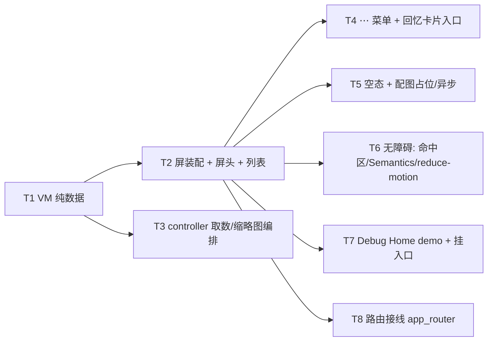

---
作者：@Ray
创建日期：2026-05-29
最后更新：2026-05-29
文档状态：草稿
---

# 任务列表：onthisday-screen

## 任务依赖图
> 由各任务 inline「同 spec 依赖」字段汇总，以 inline 为准。



并行组：
- Group A：T1（VM，无依赖，先行）
- Group B：T2（屏装配）+ T3（controller，与 T2 并行，皆依赖 T1）
- Group C：T4 / T5 / T6 / T7 / T8（皆依赖 T2，可并行）

（本屏一体、无可独立部署/演示的中间切点 → 不设里程碑。屏跑通即整体可演示，由 T7 demo 承载。）

-----

- [ ] T1 · 往年今日数据视图模型（纯数据 VM）

**同 spec 依赖：** 无 ｜ **跨 spec 依赖：** 无 ｜ **关联需求：** R1, R2, R3, R4, R6 ｜ **依据设计：** D3 ｜ **可改文件：** `lib/ui/onthisday/onthisday_view_model.dart` ｜ **验收基建：** `test/ui/onthisday/onthisday_view_model_test.dart`

### 背景
定义屏私有不可变 VM：`OnThisDayData{ totalCount, List<YearGroup> groups }`、`YearGroup{ year, yearsAgo, List<EntryCardVM> entries }`、`EntryCardVM{ entryId, title, excerpt, dayNum, monthAbbr, weekday, tag?, place?, mood?, favorite, coverImage: ImageProvider? }`。**纯数据、无 Drift/Repo 类型**（守 NF5 解耦）。再给一个把 `groups` 展平为 `[YearSeparator, Card, Card, ...]` 扁平项序列的纯函数（供 T2 SliverList 用，年份段从新到旧、段内卡片有序）。
归属：本任务只定义数据形状与展平纯函数，不渲染、不取数。

### 实施
1. 定义上述不可变类（`const` 构造、字段 final）；`coverImage` 为可空 `ImageProvider`（无封面为 null）。
2. 实现 `flatten(OnThisDayData) → List<OnThisDayRow>`（`OnThisDayRow` = sealed/标记联合：`YearSeparatorRow(year, yearsAgo)` | `EntryCardRow(EntryCardVM)`），按年份从新到旧、段前插分隔。
3. 不 import `lib/data`、不引 Drift 类型（VM 与数据层解耦）。

### 验收标准（做完即止）
- 给定多年份段输入，`flatten` 产出顺序为「每段：分隔行在前、其卡片随后；段按 year 降序」（自动）。
- 空 `groups` → `flatten` 产出空列表（自动）。
- VM 类型不引用任何 Drift/Repo 符号（自动：测试构造 VM 只用基础类型 + `ImageProvider`，编译通过即证不依赖 data 层）。

### 验收方式
- 自动：
  ```bash
  flutter test test/ui/onthisday/onthisday_view_model_test.dart
  ```
  （断言 `flatten` 的项类型与顺序、空输入行为；**不** grep VM 源码自身）

### 验收记录
```
日期：—
自动：—
人工：N/A
```

-----

- [ ] T2 · OnThisDayScreen 装配（顶栏 + 屏头 + 非吸顶 SliverList）

**同 spec 依赖：** T1 ｜ **跨 spec 依赖：** `design-tokens-theme`：`context.dayz.*`/`DayzSpacing/Radii/Fonts`/`AppLocalizations` 约定；`ui-kit-components`：`DayzGlassAppBar`/`DayzEntryCard`/`DayzYearSeparator`/`DayzFavoriteStar`；`ui-shell-navigation`：`Routes.reader`；`i18n-localization`：gen-l10n ｜ **关联需求：** R1, R2, R3, R6, R8, NF6 ｜ **依据设计：** D1, D2, D6 ｜ **可改文件：** `lib/ui/onthisday/onthisday_screen.dart`、`lib/l10n/arb/app_zh.arb`、`lib/l10n/arb/app_en.arb`、`lib/l10n/gen/app_localizations.dart`、`lib/l10n/gen/app_localizations_zh.dart`、`lib/l10n/gen/app_localizations_en.dart` ｜ **验收基建：** `test/ui/onthisday/onthisday_screen_test.dart`

### 背景
用 `CustomScrollView` 装配：`DayzGlassAppBar`（标题「往年今日」+ 返回 + 更多 slot）→ 屏头 `SliverToBoxAdapter`（kicker 日期 + 衬线标题「过去的今天，你写过 N 篇」+ 副文案）→ `SliverList`（`flatten` 后的扁平项：`DayzYearSeparator` 普通行 + `DayzEntryCard`，卡片收藏项带 `DayzFavoriteStar`，可点经 `Routes.reader` 携 entryId）。**年份分隔是普通列表项，MUST NOT 包进 `SliverPersistentHeader`/pinned**（D2）。屏头篇数 N、kicker 日期、年份/「N 年前」走 `package:intl`；标题/副文案模板入 `AppLocalizations`。视觉全走 token（NF6）。
归属：本任务装配静态结构 + 屏头 + 列表渲染（吃 T1 的 VM）；⋯ 菜单交互归 T4、空态/配图异步归 T5、无障碍专项断言归 T6、demo 归 T7、路由接线归 T8、取数 controller 归 T3。

### 实施
1. `OnThisDayScreen(OnThisDayData data, {onOpenEntry, onOpenMenu, onBack})`：`CustomScrollView` + slivers（顶栏 / 屏头 / `SliverList`）。
2. 顶栏用 `DayzGlassAppBar`，标题/按钮文案 `AppLocalizations`；更多钮预留回调（接线归 T4）。
3. 屏头：kicker `DateFormat`（中文 locale）、标题 `l10n.onThisDayCount(totalCount)`（内部 `intl` 数字）、副文案 `AppLocalizations`。
4. `SliverList`：消费 `flatten(data)`，按行类型渲染 `DayzYearSeparator`（年份/「N 年前」走 intl）或 `DayzEntryCard`（封面图位接 `coverImage`、收藏星按 `favorite`、点击 `onOpenEntry(entryId)` → 上层经 `Routes.reader` 导航）。
5. 间距/圆角/字体全经 `DayzSpacing/DayzRadii/DayzFonts`、颜色经 `context.dayz.*`；屏内禁裸中文、禁裸数字拼接。
6. 向 `app_zh.arb` / `app_en.arb` 补 onthisday 文案 key，保持 key 集合一致并跑 `flutter gen-l10n`；不得新增屏内 strings 类或静态文案常量。

### 验收标准（做完即止）
- 给定假 `OnThisDayData`（多年份段、含收藏/无封面项），渲染出对应数量的 `DayzYearSeparator` + `DayzEntryCard`，顺序与 `flatten` 一致（自动，widget test `find.byType`）。
- 年份分隔**非吸顶**：滚动后年份分隔随内容离开视口（自动，几何 test：滚动前后 `tester.getRect(分隔)` 顶部位置随滚动改变、未停靠在顶栏下；见 verification 布局几何闸）。
- 屏头篇数 == VM `totalCount`、经 `find.text(l10n.onThisDayCount(n))` 命中（自动），屏内无裸中文（断言用 `AppLocalizations`/`intl` 文本，非裸字面量）。
- 收藏项渲染 `DayzFavoriteStar`、非收藏项不渲染（自动）。

### 验收方式
- 自动：
  ```bash
  flutter test test/ui/onthisday/onthisday_screen_test.dart
  ```
  （pump 屏 + 假 VM，断言组件类型/数量/顺序、屏头篇数文本、年份分隔随滚动离开；**不** grep 屏源码自身）

### 禁止
- 不引入 `SliverPersistentHeader(pinned)`/吸顶逻辑（往年今日年份分隔是普通行，D2）。
- 不自绘卡片/年份分隔/空态（复用 ui-kit 组件）；不在屏内硬编码颜色/字号/间距/裸中文。

### 验收记录
```
日期：—
自动：—
人工：N/A
```

-----

- [ ] T3 · onthisday_controller 取数 + 缩略图编排（屏外，守红线）

**同 spec 依赖：** T1 ｜ **跨 spec 依赖：** `data-layer`：`EntryRepo.onThisDay(month, day)`/`MediaRepo`/`TagRepo`；`media-storage`：`MediaRepo` 封面解密读 + `ImageProvider`；`thumbnail-cache`：`ThumbnailCache.warmup`（异步入队，禁同步重建） ｜ **关联需求：** R1, R3, R4, R5, NF5 ｜ **依据设计：** D3 ｜ **可改文件：** `lib/ui/onthisday/onthisday_controller.dart` ｜ **验收基建：** `test/ui/onthisday/onthisday_controller_test.dart`

### 背景
屏外编排层（`ChangeNotifier` 或等价）：经 `EntryRepo.onThisDay(month, day)` 取条目、经 `MediaRepo` 解析封面元数据/拿异步解密 `ImageProvider`、对带封面项调 `ThumbnailCache.warmup` 异步入队，组装出 T1 的 `OnThisDayData`。**MUST NOT 持 Drift 句柄/写 SQL（NF5）；MUST NOT 调任何同步缩略图重建接口**——只 `warmup` + 异步 provider。依赖经构造注入（便于用 fake repo/cache 测试）。data-layer/media/thumbnail 未就绪期间用内存 stub 实现这些接口（记 design 已知风险）。
归属：本任务只做取数/缩略图编排与 VM 组装（吃 Repo/Cache 接口、产出 VM）；屏渲染归 T2。

### 实施
1. 定义 controller 构造注入 `EntryRepo`/`MediaRepo`/`ThumbnailCache`（接口/抽象，未就绪用 stub）。
2. `load(month, day)`：调 `EntryRepo.onThisDay` → 按 year 分组（从新到旧、算 `yearsAgo`）→ 带封面项调 `ThumbnailCache.warmup` 入队 + 取异步 `ImageProvider` → 产出 `OnThisDayData`；空结果产出 `groups` 为空（驱动 T5 空态）。
3. 滚动可见项可选触发 `warmup`（异步、不阻塞、不同步 decode）。
4. 断言依赖只经 Repo/Cache 抽象，**不** import `lib/data` Drift 类型、不写 SQL。

### 验收标准（做完即止）
- 给 fake `EntryRepo`（返回多年份多条目）+ fake `ThumbnailCache`，`load` 产出年份从新到旧、`yearsAgo` 正确、带封面项 `coverImage` 非空（自动）。
- 带封面项触发 `ThumbnailCache.warmup`（fake cache 记录被调），且**全程未调用任何同步重建接口**（fake cache 只暴露 `warmup`，若 controller 试图同步重建则编译不过/测试可断言无此调用）（自动，NF5 红线行为）。
- fake `EntryRepo` 返回空 → 产出空 `groups`（自动，驱动空态）。

### 验收方式
- 自动：
  ```bash
  flutter test test/ui/onthisday/onthisday_controller_test.dart
  ```
  （注入 fake repo/cache，断言 VM 组装、`warmup` 被异步入队、无同步重建调用；**不** grep controller 源码自身）

### 禁止
- 不 import `lib/data` 的 Drift 句柄、不写 SQL/Drift（NF5）。
- 不调任何同步缩略图重建/全量重建接口（只 `warmup`）。

### 验收记录
```
日期：—
自动：—
人工：N/A
```

-----

- [ ] T4 · ⋯ 菜单 + 「生成回忆卡片」入口

**同 spec 依赖：** T2 ｜ **跨 spec 依赖：** `ui-kit-components`：`DayzSheet.actions`/`DayzSheetItem`/`DayzToast`；`ui-shell-navigation`：`Routes.memory` ｜ **关联需求：** R7 ｜ **依据设计：** D5 ｜ **可改文件：** `lib/ui/onthisday/onthisday_screen.dart`、`lib/l10n/arb/app_zh.arb`、`lib/l10n/arb/app_en.arb`、`lib/l10n/gen/app_localizations*.dart`（补 ⋯ 菜单 zh/en ARB key，运行 gen-l10n 更新生成产物） ｜ **验收基建：** `test/ui/onthisday/onthisday_menu_test.dart`

### 背景
顶栏「更多」钮点击经 `DayzSheet.actions` 弹动作菜单（标题「往年今日」），含「生成回忆卡片」（`onTap` → `context.go(Routes.memory)` 携 month/day 入参）与「分享这一天」（`onTap` → `DayzToast.show`）。文案/Semantics 取自 `AppLocalizations`。
归属：本任务接线顶栏更多钮的 `onOpenMenu` 回调与 sheet 内容（T2 已预留更多钮 slot）。

### 实施
1. 更多钮 `onTap` → `DayzSheet.actions(context, title: l10n.onThisDayMenuTitle, items:[...])`。
2. 「生成回忆卡片」item → `context.go(Routes.memory, extra: {month, day})`（目标屏未就绪落 `PlaceholderScreen`）。
3. 「分享这一天」item → `DayzToast.show(context, l10n.shareThisDayDone)`。
4. 菜单标题/项 label/desc 入 `AppLocalizations`。

### 验收标准（做完即止）
- 点更多钮 → 出现含两项的 sheet，项文案 `find.text(l10n.xxx)` 命中（自动）。
- 点「生成回忆卡片」→ 触发 `Routes.memory` 导航（自动：用测试用 router/mock，断言导航到 `Routes.memory` 且携 month/day）。
- 点「分享这一天」→ 出现 toast（自动：`find.text(l10n.shareThisDayDone)` 或 `ScaffoldMessenger` 断言）。

### 验收方式
- 自动：
  ```bash
  flutter test test/ui/onthisday/onthisday_menu_test.dart
  ```
  （pump 屏 + 测试 router，点更多钮断言 sheet 项、点项断言导航/ toast；**不** grep 屏源码自身）

### 验收记录
```
日期：—
自动：—
人工：N/A
```

-----

- [ ] T5 · 空态 + 卡片配图占位/异步呈现

**同 spec 依赖：** T2 ｜ **跨 spec 依赖：** `ui-kit-components`：`DayzEmptyState`/`DayzEntryCard` 图位 API/`dayzMotionDuration`；`thumbnail-cache`：异步 `ImageProvider`（消费，不触发重建） ｜ **关联需求：** R4, R5, NF4 ｜ **依据设计：** D1, D4 ｜ **可改文件：** `lib/ui/onthisday/onthisday_screen.dart`、`lib/l10n/arb/app_zh.arb`、`lib/l10n/arb/app_en.arb`、`lib/l10n/gen/app_localizations*.dart`（补空态 zh/en ARB key，运行 gen-l10n 更新生成产物） ｜ **验收基建：** `test/ui/onthisday/onthisday_empty_image_test.dart`

### 背景
两件事：① `groups` 为空（VM）→ body 整屏换 `DayzEmptyState`（插画徽 + 标题「今天还没有往事」 + 引导说明，对应 `data-when="empty"`），不渲染年份段/屏头；② 卡片封面 `coverImage` 异步呈现——就绪前占位灰块（中性 `--surface-2`/`accent-soft-2` 走 token）、就绪后经 `dayzMotionDuration` 淡入、失败兜底灰块；`coverImage == null` 不渲染图位。
归属：本任务做空态分支与配图占位/淡入；缩略图入队归 T3、reduce-motion 门由 ui-kit `dayzMotionDuration` 提供（本任务调用、不重造）。

### 实施
1. `OnThisDayData.groups` 空 → 渲 `DayzEmptyState`（标题/说明 `AppLocalizations`，插画走 §5 单色线性 SVG），不进列表。
2. 卡片图位：`coverImage != null` → `Image` + `frameBuilder` 占位灰块（token 色）+ `dayzMotionDuration` 淡入 + `errorBuilder` 兜底；`== null` → 不渲染 `.photo` 位。
3. 空态文案条目入 `AppLocalizations`。

### 验收标准（做完即止）
- VM `groups` 空 → 屏显 `DayzEmptyState`，`find.text(l10n.onThisDayEmptyTitle)` 命中，无 `DayzEntryCard`/`DayzYearSeparator`（自动）。
- 有封面项渲染图位 + 占位；无封面项不渲染图位（自动，`find` 图位 widget 计数）。
- 系统「减弱动态效果」开启（`MediaQueryData(disableAnimations: true)`）时配图淡入时长为 0（自动，经 `dayzMotionDuration` 门）。

### 验收方式
- 自动：
  ```bash
  flutter test test/ui/onthisday/onthisday_empty_image_test.dart
  ```
  （pump 空 VM / 有封面 VM / disableAnimations，断言空态、图位计数、淡入时长 0；**不** grep 屏源码自身）

### 验收记录
```
日期：—
自动：—
人工：N/A
```

-----

- [ ] T6 · 无障碍：命中区 ≥44 / Semantics / reduce-motion

**同 spec 依赖：** T2 ｜ **跨 spec 依赖：** `ui-kit-components`：组件自带命中盒/Semantics/`dayzMotionDuration` ｜ **关联需求：** NF2, NF3, NF4 ｜ **依据设计：** D1 ｜ **可改文件：** `lib/ui/onthisday/onthisday_screen.dart`、`lib/l10n/arb/app_zh.arb`、`lib/l10n/arb/app_en.arb`、`lib/l10n/gen/app_localizations*.dart`（补 Semantics 标签 zh/en ARB key，运行 gen-l10n 更新生成产物） ｜ **验收基建：** `test/ui/onthisday/onthisday_a11y_test.dart`

### 背景
本屏专属无障碍兜底（组件级无障碍由 ui-kit 各组件保证，本任务断言**屏装配后**的可观测无障碍属性）：返回钮/更多钮/可点卡片命中区 ≥ 44×44；返回/更多/收藏星/可点卡片有 Semantics 标签（`AppLocalizations`，如返回/更多/已收藏/打开第 N 篇）；屏内动效统一经 `dayzMotionDuration`、reduce-motion 下瞬时。
归属：本任务补屏级 Semantics 标签 + 断言命中区/语义/动效门，不改组件本体。

### 实施
1. 顶栏返回/更多钮、可点卡片包/确认 `Semantics(label/button)`（标签 `AppLocalizations`）；收藏星语义（已收藏）。
2. 确认可点元素命中区 ≥ 44（依赖 ui-kit 组件命中盒；不足处用 `ConstrainedBox`/`InkWell` 命中扩展，走 token）。
3. 屏内所有动效经 `dayzMotionDuration`（不硬编码 `Duration`）。

### 验收标准（做完即止）
- 返回钮/更多钮/可点卡片命中区 ≥ 44×44 px（自动，`tester.getSize` 断言）。
- `find.bySemanticsLabel(l10n.back/more/favorited/...)` 可定位（自动，NF3）。
- `MediaQueryData(disableAnimations: true)` 下屏内带动效元素时长为 0（自动，NF4）。

### 验收方式
- 自动：
  ```bash
  flutter test test/ui/onthisday/onthisday_a11y_test.dart
  ```
  （pump 屏，断言命中尺寸、`bySemanticsLabel`、disableAnimations 下动效时长；**不** grep 屏源码自身）

### 验收记录
```
日期：—
自动：—
人工：N/A
```

-----

- [ ] T7 · Debug Home demo（两态 + 假 VM）+ 挂入口

**同 spec 依赖：** T2 ｜ **跨 spec 依赖：** 无（demo 用内存 stub VM，不连真实 Repo/Cache） ｜ **关联需求：** R9 ｜ **依据设计：** D7 ｜ **可改文件：** `lib/demo/onthisday_screen_demo.dart`、`lib/demo/demo_entry.dart` ｜ **验收基建：** `test/demo/onthisday_screen_demo_test.dart`

### 背景
Debug Home 入口：用内存 stub `OnThisDayData`（多年份段、含带封面 `AssetImage`/`MemoryImage` 与收藏项）+ 一个空 VM，渲染本屏并可切 `default`/`empty` 两态、可滚动、可弹 ⋯ 菜单。**demo 不触发 `ThumbnailCache.warmup`、不连真实 `EntryRepo`/`MediaRepo`**（占位 provider）。`demo_entry.dart` 的 `demos` 列表**末尾追加一行**。
归属：本任务建 demo + 挂入口，不改屏体。

### 实施
1. `onthisday_screen_demo.dart`：stub 两态 VM 喂 `OnThisDayScreen`，提供切态控件。
2. `demo_entry.dart` 的 `demos` **末尾追加一行**（指向本 demo），不插中间、不改 `DemoEntry` 字段、不动既有 demo。

### 禁止
- 不改 `DemoEntry` 字段定义；不在 `demos` 中间插入；不动既有 demo。
- demo 不连真实 DB/媒体、不触发缩略图重建（用占位 provider）。

### 验收标准（做完即止）
- `demos` 末尾新增项指向 onthisday demo，Debug Home 可进入（自动，widget test：构建 demo 列表 `find` 到该项并可 pump 进入）。
- demo 内可切两态：`default` 见卡片/年份段、`empty` 见 `DayzEmptyState`（自动）。
- 真机两态对照屏源 `onthisday.html` 观感无偏差（人工，@Ray）。

### 验收方式
- 自动：
  ```bash
  flutter test test/demo/onthisday_screen_demo_test.dart
  ```
- 人工：
  - 真机/模拟器进往年今日 demo，切 `default`/`empty` 两态，滚动 + 弹 ⋯ 菜单，对照 `onthisday.html` 各状态，@Ray 确认。

### 验收记录
```
日期：—
自动：—
人工：待确认（核查人 @Ray）
```

-----

- [ ] T8 · 路由接线（app_router 占位 → 真实屏）

**同 spec 依赖：** T2 ｜ **跨 spec 依赖：** `ui-shell-navigation`：`Routes.onthisday`/`app_router.dart`/`PlaceholderScreen`（D1 约定页面级 spec 改对应 builder 行） ｜ **关联需求：** R8 ｜ **依据设计：** D1 ｜ **可改文件：** `lib/ui/shell/app_router.dart`（**仅** `Routes.onthisday` 一行 builder） ｜ **验收基建：** `test/ui/onthisday/onthisday_route_test.dart`

### 背景
把 `app_router.dart` 里 `Routes.onthisday` 的 `builder` 从 `PlaceholderScreen` 换成真实 `OnThisDayScreen`（外壳经 `onthisday_controller` 喂 VM；data-layer 未就绪期间用 stub）。**仅改这一行 builder**，不新增/改其它路由常量、不动 `Routes.memory`/其它 builder。该文件归 ui-shell，按其 D1「页面级 spec 改对应屏 builder 行」约定接线；若文件/常量未就绪 → 停下协调（见 design 已知风险）。
归属：本任务只做这一条 builder 接线。

### 实施
1. `app_router.dart` 中 `Routes.onthisday` 路由 `builder` → 返回 `OnThisDayScreen`（经外壳/ controller 提供 VM）。
2. 不改其它路由、不改 `Routes` 常量集。

### 验收标准（做完即止）
- 经 `go_router` 导航到 `Routes.onthisday` → 落到 `OnThisDayScreen`（而非 `PlaceholderScreen`）（自动，router widget test 断言屏类型）。
- 其它路由 builder 未受影响（自动，回归：导航另一路由仍落原占位/屏）。

### 验收方式
- 自动：
  ```bash
  flutter test test/ui/onthisday/onthisday_route_test.dart
  ```
  （用 `app_router` 导航到 `Routes.onthisday` 断言 `find.byType(OnThisDayScreen)`；抽查另一路由不受影响；**不** grep router 源码自身）

### 禁止
- 不改 `Routes` 常量定义、不新增路由、不动 `Routes.memory` 或其它屏的 builder。

### 验收记录
```
日期：—
自动：—
人工：N/A
```
