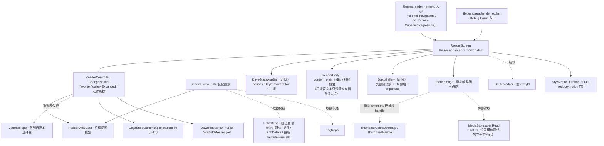

---
作者：@Ray
创建日期：2026-05-29
最后更新：2026-05-31
文档状态：草稿
---

# 设计：reader-screen

> 视觉与映射依据：[`docs/design/10-ui-restore-and-design-sync.md`](../../../docs/design/10-ui-restore-and-design-sync.md) §1（分层：本屏属屏幕层，只引下层）/§3（逐屏映射 + 红线：缩略图只异步 warmup、媒体 key 独立于主密码）/§4（②样式参数闸 + ③布局几何闸分治）/§9（W2 页面级）/§10（动 lib/ui 前红线）/§11（验收口径）；屏源真源 [`ui-design/current/pages/screens/reader.html`](../../../ui-design/current/pages/screens/reader.html)（`?state=default` / `?state=text` 两态）；版式组件 `.reader` / `.read-hero` / `.r-kicker` / `.r-meta` / `.r-body` / `.r-tags` 见 [`DESIGN-REF.md`](../../../ui-design/current/docs/DESIGN-REF.md) §3b；九宫格 `.gallery`（列数随张数 / `+N` 蒙层 / 阅读页就地展开 `.expanded`）§3、收藏星唯一 path §5、动作菜单 / 移到日记本 / 删除确认 / toast 撤销的业务编排见 `pages/assets/screen.js` 的 `openEntryMenu` / `openMoveSheet` / `confirmDelete`；HTML→Flutter 机制映射 [`PROTOTYPE-ARCH.md`](../../../ui-design/current/docs/PROTOTYPE-ARCH.md) §6。复用组件与外壳词汇来自 `ui-kit-components`（`DayzGlassAppBar` / `DayzGallery` / `DayzWeatherChip` / `DayzTag` / `DayzFavoriteStar` / `DayzToast` / `DayzSheet`（`.actions`/`.picker`/`.confirm` 工厂 + `DayzSheetItem`）/ `DayzEmptyState` / `AppLocalizations` / `dayzMotionDuration` / `components.dart` barrel / `dayz_icons.dart`）与 `ui-shell-navigation`（`Routes.*` 常量、`go_router` + `CupertinoPageRoute` 转场）；数据交付物来自 `data-layer`（`EntryRepo`/`MediaRepo`/`JournalRepo`/`TagRepo`）、`media-storage`（`MediaStore.openRead`、`DMED` 加密容器、设备媒体密钥）、`thumbnail-cache`（`ThumbnailCache.warmup`/`ThumbnailHandle`）。token / `context.dayz.*` / `AppLocalizations` / `intl` 约定来自 `design-tokens-theme`（D1/D4）。

## 技术决策

### D1 · 屏装配方式：CustomScrollView + 既有外壳，不重造顶栏 / sheet / 九宫格
- **状态：** 采纳
- **背景：** 本屏是叶子屏，顶栏（毛玻璃覆盖式）、底部 sheet（动作菜单 / 选择器 / 确认）、九宫格、收藏星、toast 都已在 `ui-kit-components` 登记为跨屏组件；方法论 §1/§3「跨屏共用外壳在组件层落一次、屏只组合」。
- **选项：** (A) 本屏自绘顶栏 / sheet / 九宫格；(B) 用 `CustomScrollView` + `DayzGlassAppBar`（sliver）+ sliver 正文，sheet/九宫格/收藏星全调 `ui-kit` 组件；(C) 普通 `Scaffold(appBar:)` 固定栏（不覆盖状态栏、不毛玻璃）。
- **选择：** B。`ReaderScreen` = `Scaffold(extendBodyBehindAppBar:true, body: CustomScrollView(slivers:[DayzGlassAppBar(...), SliverToBoxAdapter(封面+reader 版式)]))`；顶栏 `actions` 放 `DayzFavoriteStar` + ⋯ 钮；⋯ 钮 onTap → `DayzSheet.actions(...)`；九宫格用 `DayzGallery`；删除确认 / 移到日记本用 `DayzSheet.confirm`/`.picker`；toast 用 `DayzToast.show`。
- **理由：** `DayzGlassAppBar` 已封装「静止实底 / 滚动毛玻璃覆盖状态栏 / `--top-h` 让位」（PROTOTYPE-ARCH §6 `extendBodyBehindAppBar` + `SliverAppBar`）；屏只组合，零重造、与设计稿「顶栏覆盖、内容穿行」一致。
- **代价：** 强依赖 `ui-kit-components` 顶栏 / sheet / 九宫格交付物就绪；未就绪期间降级（见已知风险），但不在屏内自绘正式件。

### D2 · 数据驱动版式：ReaderViewData 视图模型 + 可空字段条件渲染
- **状态：** 采纳
- **背景：** R2 要求空字段不渲染、不留空槽；`?state=text` 纯文字篇即「无封面 / 无天气 / 无地点 / 无九宫格」。屏直接吃 Repo 行容易把「可空判定」散落各处。
- **选项：** (A) 屏直接读 entry 行各字段、内联多个 `if (x != null)`；(B) 引入屏内**只读视图模型** `ReaderViewData`（由 entry + 关联媒体 + 标签 + 心情 / 天气 / 地点装配，字段显式可空），屏按字段是否为空条件渲染；(C) 用通用 `Map`。
- **选择：** B。`ReaderViewData{ id, dateTimeLocal(用于 intl 格式化), title, bodyParagraphs/contentJson, coverThumb?, weather?, place?, mood?, tags<List>, galleryImages<List>, journalId, favorite }`，全部由「外部装配函数」从 `EntryRepo` 组合查询（entry + 媒体 + 标签，data-layer D6 由 `EntryRepo` 承担组合查询）映射得到，屏只消费视图模型、不直连 Repo 行字段名。条件渲染：`if (vd.cover != null) ...`、`if (vd.weather != null || vd.place != null || vd.mood != null) 渲染 r-meta 行`、`if (vd.tags.isNotEmpty) ...`。
- **理由：** 视图模型把「可空 / 折叠」收敛到一处、利于 widget test 用纯内存 `ReaderViewData` 独立验空字段不渲染（不必起 Drift）；屏与 Repo 行结构解耦（NF1 边界更清晰）。
- **代价：** 多一个视图模型 + 装配函数；但换来可测性与边界清晰，值。装配函数取数仍只过 `EntryRepo`（NF1）。

### D3 · 入参与导航：entryId 入参 + Routes.reader / Routes.editor
- **状态：** 采纳
- **背景：** PROTOTYPE-ARCH §6：`?state=` 多状态 → 页面入参 + 状态管理；iframe 路由栈 → `Navigator.push + CupertinoPageRoute`。`ui-shell-navigation` D2 把屏 id 收敛为 `Routes.*` 常量（含 `Routes.reader` / `Routes.editor`）。
- **选项：** (A) 直接传整个 `ReaderViewData`；(B) 传 `entryId`（稳定标识），本屏经装配函数取数；(C) 传 entry 行对象。
- **选择：** B。`Routes.reader` 携 `entryId` 入参（go_router path/extra）；屏内 `加载态/有数据态/（找不到）空态` 三态用同一 widget 按状态渲染（PROTOTYPE-ARCH §6 `?state=` 映射）。「编辑」导航 `Routes.editor` 携同一 `entryId`；返回用 `Navigator.pop`（R1）。`CupertinoPageRoute` 转场由 `ui-shell-navigation` 的 `GoRouter` 配置提供（本屏不自定义 route 类型）。
- **理由：** 传 id 而非对象避免「跨屏传过期快照」；三态同 widget 对齐设计稿多状态约定；路由名引 `Routes` 常量符合跨 spec 契约。
- **代价：** 进屏后需异步取数（短暂加载态）；可接受，加载态有占位。

### D4 · 媒体加载：异步缩略图 + 占位，禁止同步重建（NF2 红线落地）
- **状态：** 采纳
- **背景：** 方法论 §3 + thumbnail-cache D7：列表 / 阅读滚动路径**禁止**同步重建全部缩略图，缩略图模块只暴露异步 `warmup`；封面 / 九宫格图须经加密媒体链路解密（media-storage `MediaStore.openRead`，独立设备媒体密钥）。
- **选项：** (A) 构建时同步解码 / 重建缩略图（**违红线，禁止**）；(B) 用一个 `ReaderImage` 包装：优先取已就绪 `ThumbnailHandle`，未就绪则显占位 + 调 `ThumbnailCache.warmup` 异步入队、就绪后 rebuild 显图；原图按需经 `MediaStore.openRead` 流式解密。
- **选择：** B。封面与九宫格每格用 `ReaderImage`（`lib/ui/reader/reader_image.dart`），入参 = 媒体 id / rel_path + 期望尺寸；内部：① 查 `ThumbnailCache` 是否 ready → 是则用其 `ImageProvider`；② 否则显 `--accent-soft-2` 占位（DESIGN-REF §2.1 照片占位）+ 异步 `warmup`，完成后 `setState`/`FutureBuilder` 切图。`DayzGallery` 接 `ImageProvider` 列表（ui-kit D 已定其只接 provider + 回调），本屏负责把 `ReaderImage` provider 喂进去。
- **理由：** 把「异步 / 占位 / 禁同步重建」收敛到一个 `ReaderImage`，使违红线的同步路径写不出来；与 ui-kit `DayzGallery`「只接 provider」契合。
- **代价：** 首次进屏图为渐显（占位→图）；这是隐私加密媒体的固有代价，符合基调。

### D5 · 只读正文渲染：v1 纯段落，富文本后续只替换正文注入点
- **状态：** 采纳
- **背景：** entry 正文存 `content_json` + `content_plain`；AppFlowy 只读渲染器（解析 `content_json` → 富文本只读视图）归 `editor-json-contract` / 编辑屏 spec，本屏此刻不应自造富文本解析。设计稿 `.r-body p` 当前是衬线段落，阅读屏 v1 的主要价值是交付版式、媒体、菜单、收藏、软删与移本等屏内行为。
- **选项：** (A) 本屏自写 `content_json` → 富文本解析渲染（与编辑屏重复、易分叉）；(B) 本屏 v1 按 `content_plain` 渲染衬线段落（`.t-diary`），富文本只读渲染器后续只替换正文区；(C) 阻塞等编辑屏。
- **选择：** B。`ReaderBody`（`lib/ui/reader/reader_body.dart`）消费 `ReaderViewData.bodyParagraphs`（来自 `content_plain` 切段）渲染 `.t-diary` 衬线段落；保留「正文区 = 可注入 widget」的扩展点。后续接入 `editor-json-contract` 的富文本只读渲染器时，只替换该注入点，不改阅读屏的整体结构、媒体链路、顶栏 / sheet 动作或 v1 验收口径。
- **理由：** 不阻塞本屏交付、不与编辑屏抢富文本解析归属；版式 / 排版角色（衬线 1.85）本就由本屏负责，正文「内容如何解析」可后插。该边界已在 2026-05-31 经 @Ray 确认，作为正式 v1 决策记录。
- **代价：** 第一版正文为纯段落（无行内格式 / 列表 / 引用 / 行内图渲染）；这不是 reader-screen v1 的缺陷，而是后续富文本只读渲染接入范围。

### D6 · 收藏 / 删除 / 移本：乐观 UI + Repo 写入 + toast 编排（对齐 screen.js）
- **状态：** 采纳
- **背景：** screen.js 的 `openEntryMenu`/`confirmDelete`/`openMoveSheet` 定义了精确编排：收藏星与菜单项双向同步；删除走二次确认→toast 撤销→1.1s 后返回；移本走单选选择器→toast。这些是产品行为契约。
- **选项：** (A) 每个动作各自直接调 Repo 后整屏重查；(B) 一个 `ReaderController`（`ChangeNotifier`）持 `ReaderViewData` + favorite 态，动作 = 乐观更新本地态 + 调对应 Repo + 触发 toast，删除 / 移本后按 R8/R9 编排。
- **选择：** B。`ReaderController`（`lib/ui/reader/reader_controller.dart`，最小 `ChangeNotifier`，不预设全局状态库——与 tokens-theme 示例 / shell `theme_controller` 同构）：
  - `toggleFavorite()`：翻转本地 favorite → `EntryRepo` 更新 favorite → `DayzToast.show`（已收藏 fav / 已取消收藏）；顶栏星与菜单项都读同一 controller 态（R6 同步天然成立）。
  - `delete()`：`DayzSheet.confirm` 确认 → `EntryRepo.softDelete(id)` → `DayzToast.show`（已移到回收站，action「撤销」→ 撤销回调清 `deleted_at`、toast「已恢复」）→ `Navigator.pop`（R8）。
  - `moveToJournal()`：`DayzSheet.picker`（`JournalRepo` 取列表）→ `EntryRepo` 更新 journalId → toast「已移到「X」」（R9）。
  - `share()`：本 spec 仅 `DayzToast.show`（占位反馈），不接真实分享（范围外）。
- **理由：** 单一 controller 让「顶栏星 ↔ 菜单收藏项同步」「删除编排」「移本」可被 widget test 注入假 Repo 独立验证；乐观 UI 符合「即时反馈」。
- **代价：** 乐观更新后 Repo 写失败需回滚本地态（记已知风险，失败回滚 + 错误 toast）；controller 多一层，可接受。

### D7 · 九宫格就地展开归本屏状态
- **状态：** 采纳
- **背景：** R5 + DESIGN-REF §3：阅读页点 `.more`（`+N`）由 screen.js 给 `.gallery` 加 `.expanded` 露出全部（**就地展开、不导航**）；这与信息流卡片「点图直接进阅读页」不同。
- **选项：** (A) 展开态由 `DayzGallery` 组件内部自持；(B) 展开态由本屏 controller 持（`galleryExpanded` bool），传给 `DayzGallery` 的 `expanded` 入参。
- **选择：** B。`DayzGallery` 是无状态展示件（ui-kit 定其「接 provider 列表 + 回调」），展开与否是本屏阅读语境的状态 → 本屏 `ReaderController.galleryExpanded` 持有，点 `+N` 回调翻转，重建露全部。
- **理由：** 与 ui-kit「组件无业务状态」一致；展开是阅读屏专属语义，归屏。
- **代价：** 屏多管一个 bool；微小。

### D8 · Debug Home 入口（本屏 demo）
- **状态：** 采纳
- **背景：** 方法论 §10 第 5 条 / CLAUDE.md「Debug Home demo 入口模式」：每个 UI spec 末尾挂一个 Debug Home 入口、真机调试走 demo 页。`ui-shell-navigation` D7 已把 Debug Home 降为具名路由，但新 demo 仍追加到 `demo_entry.dart` 的 `demos` 末尾。
- **选择：** 新建 `lib/demo/reader_demo.dart`：用内存假 `ReaderViewData`（含 default 长篇 / text 短篇 / 加载态 / 找不到态四例 + 假占位图 provider）在设备框内 pump `ReaderScreen`，可切主题 × 明暗、点收藏星 / ⋯ 菜单 / 九宫格展开走查；在 `lib/demo/demo_entry.dart` 的 `demos` 列表**末尾追加一行**（不插中间、不改 `DemoEntry` 字段）。
- **理由：** 真外壳取数需 data-layer 就绪，demo 用假数据让本屏交互与版式可独立 pump 测试 + 真机走查（数据未就绪也能看屏）。
- **代价：** demo 与真屏略重复（假数据装配）；换来可独立验证，值。

### D9 · reduce-motion 与无障碍统一经 ui-kit 既有门
- **状态：** 采纳
- **背景：** NF3 要求点击目标 ≥44 / Semantics / reduce-motion；ui-kit 已交付 `dayzMotionDuration`（reduce-motion 门，D11）且基础件自带命中盒 ≥44 + Semantics。
- **选择：** 本屏自身的动效（九宫格展开过渡、加载渐显）经 `dayzMotionDuration` 取时长；顶栏返回 / 收藏星 / ⋯ 钮的命中盒 ≥44 与 Semantics 标签由 ui-kit 组件保证，本屏只传 `AppLocalizations` 标签；本屏不另造动效门、不在屏内硬编码 duration / 命中盒尺寸。
- **理由：** 单点收敛，杜绝逐处漏判；与 ui-kit 一致。
- **代价：** 无。

## 架构

## 文件变更

> 这是本 spec 任务「可改文件」的**唯一来源与上界**；任一任务可改文件 MUST ⊆ 本清单。新建 Dart 文件 MUST 加 MPL-2.0 头注。**不列入** `lib/ui/theme/`（tokens-theme）、`lib/ui/widgets/`·`lib/ui/shell/`（ui-kit / shell）、`lib/data/`（data-layer）、`lib/media/`·`lib/thumbnails/`（media / thumbnail）等其它 spec 拥有的文件；文案仅补 zh/en ARB 与 gen-l10n 产物。

**屏体 `lib/ui/reader/`**
- `lib/ui/reader/reader_screen.dart`          新建（屏装配：Scaffold + CustomScrollView + DayzGlassAppBar + 版式，三态渲染，D1/D3）
- `lib/ui/reader/reader_view_data.dart`        新建（只读视图模型 `ReaderViewData` + 从 `EntryRepo`/`TagRepo` 组合结果映射的装配函数，D2；**不持 Drift**，NF1）
- `lib/ui/reader/reader_controller.dart`       新建（`ChangeNotifier`：favorite / galleryExpanded + toggleFavorite/delete/moveToJournal/share 编排，D6/D7）
- `lib/ui/reader/reader_body.dart`             新建（`.r-body` 衬线段落只读正文，预留只读渲染器注入点，D5）
- `lib/ui/reader/reader_meta.dart`             新建（`.r-kicker`（日期 intl）+ `.r-meta`（weather-chip/tag/地点）+ `.r-tags`，数据驱动条件渲染，D2/R3）
- `lib/ui/reader/reader_image.dart`            新建（封面 / 九宫格格的异步缩略图 + 占位，禁同步重建，D4/NF2）

**Debug Home 入口 `lib/demo/`**
- `lib/demo/reader_demo.dart`                  新建（reader 屏 demo：四例假数据 + 主题切换走查，D8）
- `lib/demo/demo_entry.dart`                   修改（**仅末尾追加一行**，不插中间、不改 `DemoEntry` 字段）

**gen-l10n 文案**
- `lib/l10n/arb/app_zh.arb`、`lib/l10n/arb/app_en.arb`           修改（补 reader 屏 zh/en 文案条目：动作菜单各项、删除确认标题 / 说明 / 确认钮、toast 文案、Semantics 标签等）
- `lib/l10n/gen/app_localizations*.dart`                        修改（`flutter gen-l10n` 生成产物）

**测试目录（白名单 hook 对 `test/**/*_test.dart` 自动放行；非 `_test.dart` 的共享基建由任务 `验收基建` 字段预批）**
- `test/ui/reader/`                            新建（屏 / controller / 版式 / 图加载 widget test 目录）
- `test/demo/reader_demo_test.dart`            新建（demo + Debug Home 入口测试）

## 已知风险

- **跨 spec 依赖（按交付物名引用，可能尚未实现 → READY 门 / 降级）：**
  - `design-tokens-theme`（README 依赖列已登记）：`context.dayz.*`、`DayzSpacing/DayzRadii/DayzMotion`、六套 `ThemeData`、`AppLocalizations` 约定、`.t-diary`/`.t-h1` 排版角色。**强依赖**，未定稿则本屏阻塞。
  - `ui-kit-components`（已登记）：`DayzGlassAppBar`/`DayzGallery`/`DayzWeatherChip`/`DayzTag`/`DayzFavoriteStar`/`DayzToast`/`DayzSheet`（`.actions`/`.picker`/`.confirm`）/`DayzSheetItem`/`DayzEmptyState`/`dayzMotionDuration`/`dayz_icons.dart`/`components.dart` barrel。**强依赖**；2026-05-31 已按当前代码确认 `DayzGallery(images, expanded, onMoreTap)`、`DayzSheet.actions/picker/confirm`、`DayzGlassAppBar` 与 `components.dart` barrel 均存在。若后续 ui-kit API 再变更，先回填本设计与任务白名单，再改 reader 屏实现。
  - `ui-shell-navigation`（已登记）：`Routes.reader`/`Routes.editor` 常量、`go_router` 的 `CupertinoPageRoute` 转场配置。**强依赖**；路由名是跨 spec 契约，引常量不写裸字符串。本屏被某来源屏跳转（时间线 / 搜索 / 收藏 / 往年今日）= 那些屏在其元素上接 `Routes.reader` 导航（归各来源屏 spec），本 spec 只负责「进入本屏后」与「从本屏导航编辑 / 返回」。
  - `data-layer`（已登记）：`EntryRepo`（组合查询 entry+媒体+标签 D6、`softDelete`/`hardDelete` D7、更新 favorite / journalId / 时区三件套封装 D5）、`MediaRepo`（媒体元数据）、`JournalRepo`（日记本列表）、`TagRepo`。**取数唯一入口（NF1 红线）**。未就绪时本屏用内存假 `ReaderViewData` / 假 Repo（demo + 测试），真接线作为依赖就绪后的后续，**MUST NOT 为赶进度在屏内直连 Drift / 写 SQL**。
  - `media-storage`（已登记）：`MediaStore.openRead(rel_path) → Stream<List<int>>`、`DMED` 加密容器、设备媒体密钥（独立于主密码、不参与 rekey）。本屏只消费读取入口。
  - `thumbnail-cache`（已登记）：`ThumbnailCache.warmup`（异步入队）、`ThumbnailHandle`（ready 态 + `ImageProvider`）。**红线**：本屏 MUST NOT 调用任何同步重建 / 全量重建入口（thumbnail-cache 只暴露 `warmup`，本就堵死该路径）。
  - `editor-json-contract` / 编辑屏 spec（**非 README 依赖**，仅正文渲染关系）：富文本**只读渲染器**（解析 `content_json`）归彼处；本屏 D5 正式决定 v1 先按 `content_plain` 渲染衬线段落，预留注入点待后续交付物替换。该交付物名 / API 未定不阻塞 reader-screen v1；不可在本屏自造 `content_json` 解析。
  - `design-sync-automation`（**非 README 依赖**，仅验证基建关系）：参数 / 几何抽取 harness、`element-map.yaml`（reader 屏映射 + fixed/content 标签）、SSIM 兜底属其交付物；本屏的样式参数闸（②）与布局几何闸（③）用 Flutter 原生 `tester.getRect` / 解析 widget 属性自验，**不依赖 harness 就绪**；「对设计稿源屏 `reader.html` 比框 / 比像素」的部分留给 design-sync 期二，不在本 spec 重造。golden 基线归本屏 `test/ui/reader/`（任务 `验收基建` 预批）。
- **乐观 UI 写失败回滚（D6）**：收藏 / 移本乐观更新后若 Repo 写抛错，须回滚本地态并弹错误 toast；删除若 `softDelete` 失败则不返回、保留当前篇并提示。验证用注入「抛错的假 Repo」断言回滚。
- **正文为纯段落（D5）**：第一版正文不渲染行内格式 / 列表 / 引用 / 行内图，待只读渲染器接入补齐；与设计稿 `.r-body p` 的纯段落示意一致，不算还原缺陷。reader-screen v1 的验收只覆盖 `content_plain` 段落渲染与阅读版式，不覆盖 `content_json` 富文本效果。
- **ARB 合并风险**：本 spec 补 `lib/l10n/arb/app_zh.arb`、`lib/l10n/arb/app_en.arb` reader 文案 key，MUST 保持 zh/en key 集合一致并跑 `gen-l10n`；MUST NOT 新增第二套文案类或屏内 strings 常量。
- **九宫格 `+N` 与 ≤9 张布局**：列数随张数（1/2/3/4/≥5）与第 9 格 `+N` 蒙层规则由 `DayzGallery` 承载，本屏只传图列表与展开态；张数 / 列数对应关系以 DESIGN-REF §3 与 ui-kit `DayzGallery` 定稿为准，本 spec 不重写网格算法。
- **新文件加 MPL-2.0 头注**：`lib/ui/reader/*.dart`、`lib/demo/reader_demo.dart` 全部新建 Dart 文件 MUST 在顶部加 MPL-2.0 头注（模板见 README「License」/ AGENTS.md）。
- **无持久化 schema 变更**：本屏不新增 / 改 DB schema（软删除 / favorite / journalId 字段均由 data-layer 既有 schema 提供，本屏只调 Repo 方法）→ 无数据迁移 / 回滚要素。
