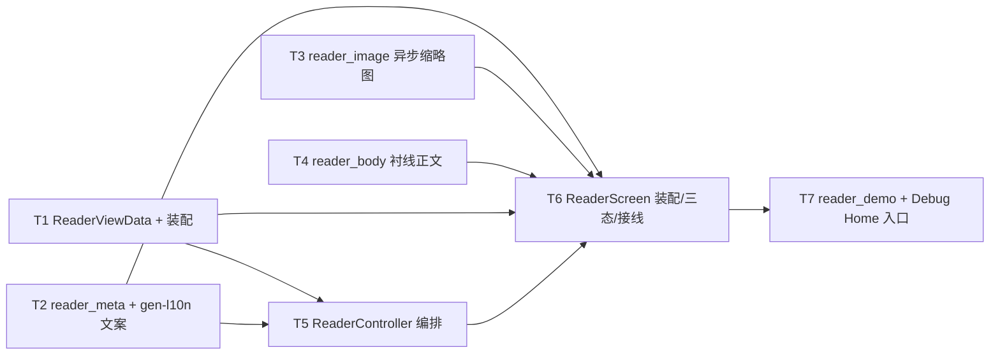

---
作者：@Ray
创建日期：2026-05-29
最后更新：2026-05-31
文档状态：草稿
---

# 任务列表：reader-screen

## 任务依赖图
> 由各任务 inline「同 spec 依赖」字段汇总，以 inline 为准。



并行组：
- Group A：T1、T2、T3、T4（彼此独立，可并行；T2 顺带建立本 spec 的 AppLocalizations 文案条目）
- Group B：T5（依赖 T1、T2）
- Group C：T6（依赖 T1/T2/T3/T4/T5）
- Group D：T7（依赖 T6）

（整屏一体、无可独立部署 / 演示的中间切点 → 不设里程碑。）

-----

- [ ] T1 · ReaderViewData 只读视图模型 + 装配函数

**同 spec 依赖：** 无 ｜ **跨 spec 依赖：** data-layer：`EntryRepo`（组合查询 entry+媒体+标签、favorite/journalId 字段）、`TagRepo` ｜ **关联需求：** R2, R3, NF1 ｜ **依据设计：** D2 ｜ **可改文件：** `lib/ui/reader/reader_view_data.dart` ｜ **验收基建：** `test/ui/reader/fakes/fake_repos.dart`（内存假 `EntryRepo`/`TagRepo`，供本 spec 多任务共用）

### 背景
定义只读视图模型 `ReaderViewData`（字段显式可空：`cover?`、`weather?`、`place?`、`mood?`、`tags`、`galleryImages`、`title`、`bodyParagraphs`、`dateTimeLocal`、`journalId`、`favorite`）+ 一个**装配函数**：入参取自 `EntryRepo` 的组合查询结果（entry + 关联媒体 + 标签，data-layer D6 由 EntryRepo 承担）映射成 `ReaderViewData`。
归属：本文件 **MUST NOT** import `lib/data` 的 Drift 句柄 / 表 / DAO（NF1）；只依赖 Repo 暴露的返回类型。data-layer 未就绪期间，装配函数针对 Repo 接口编程、用 `fake_repos.dart` 的内存假实现喂测试。

### 实施
1. 定义 `ReaderViewData`（不可变值对象，全字段显式可空 / 集合默认空）。
2. 写装配函数：从 `EntryRepo` 组合查询结果（+`TagRepo` 标签）映射；`dateTimeLocal` 保留为 `DateTime`（供 T2 用 intl 格式化，不在此拼字符串）。
3. 不直连 Drift；针对 Repo 接口编程（NF1）。

### 验收标准（做完即止）
- 喂「含全字段」的假 Repo 结果 → 视图模型各字段非空且值正确（自动）。
- 喂「纯文字篇」假结果（无 cover/weather/place/mood/gallery）→ 对应字段为 null / 空集合（自动，支撑 R2 条件渲染）。
- 视图模型层不引用任何 `lib/data/` Drift 类型（自动：测试在 `test/ui/reader/` 下编译通过且仅 import Repo 接口；见验收方式注）。

### 验收方式
- 自动：
  ```bash
  flutter test test/ui/reader/reader_view_data_test.dart
  ```
  （喂全字段 / 空字段两组假 Repo 结果，断言映射后字段值与可空性；**不** grep 源文件）

### 验收记录
```
日期：—
自动：—
人工：N/A
```

-----

- [ ] T2 · reader_meta 版式（kicker/r-meta/r-tags 条件渲染）+ gen-l10n 文案

**同 spec 依赖：** 无 ｜ **跨 spec 依赖：** design-tokens-theme：`context.dayz.*`/`DayzSpacing`/`.t-*` 排版角色/`AppLocalizations`/`intl` 约定；ui-kit-components：`DayzWeatherChip`/`DayzTag`/`dayz_icons.dart`（日历 / 地点 SVG）；`i18n-localization`：gen-l10n ｜ **关联需求：** R2, R3, NF4 ｜ **依据设计：** D2 ｜ **可改文件：** `lib/ui/reader/reader_meta.dart`、`lib/l10n/arb/app_zh.arb`、`lib/l10n/arb/app_en.arb`、`lib/l10n/gen/app_localizations.dart`、`lib/l10n/gen/app_localizations_zh.dart`、`lib/l10n/gen/app_localizations_en.dart` ｜ **验收基建：** 无

### 背景
渲染 `.r-kicker`（日历图标 + 日期）、`.r-meta`（weather-chip + tag + 地点 meta）、`.r-tags`（标签组），全部**数据驱动条件渲染**：字段为空则该元素不入 widget 树（R2）。日期经 `package:intl` 格式化（NF4），禁裸拼。
本任务负责补 reader 屏全部 zh/en 文案 key（动作菜单各项、删除确认标题 / 说明 / 确认钮、toast 文案、Semantics 标签、空态文案等），供 T5/T6 引用；不新增本屏 strings 类或静态文案常量。

### 实施
1. 在 `app_zh.arb` / `app_en.arb` 补 reader 文案 key，含占位的用 ARB placeholder / ICU 约定，不在文案里写死本名；跑 `flutter gen-l10n`。
2. `reader_meta.dart`：kicker 行（`dayz_icons` 日历 SVG + `intl` 格式化日期文本）；`r-meta` 行用 `Wrap`，按 `weather!=null`/`place!=null`/`mood!=null` 条件加 `DayzWeatherChip`/地点 meta/心情 meta；`r-tags` 按 `tags.isNotEmpty` 渲染 `DayzTag` 列表。
3. 视觉全走 token（`context.dayz.*`/`DayzSpacing`），排版角色用 caption / 次要文本；屏内禁裸中文、禁硬编码色 / 字号 / 间距。

### 验收标准（做完即止）
- 全字段视图模型 → kicker / weather-chip / tag / 地点 / 标签组都能 `find` 到（自动）。
- 空字段视图模型（无 weather/place/mood/tags）→ 对应元素 `find` 不到、`r-meta` 行不出现（自动，R2）。
- 日期文本 == `intl` 格式化结果（断言与手工拼接不同源；用 `find.text(intl 格式化期望值)`）（自动，NF4）。
- 屏内文本经 `AppLocalizations`（测试用 `find.text(l10n.xxx)` 定位，不用裸中文）（自动，NF4）。

### 验收方式
- 自动：
  ```bash
  flutter test test/ui/reader/reader_meta_test.dart
  ```
  （pump 两组视图模型，断言元素存在 / 不存在 + 日期 intl 文本 + 引 AppLocalizations）

### 验收记录
```
日期：—
自动：—
人工：N/A
```

-----

- [ ] T3 · reader_image 异步缩略图 + 占位（禁同步重建）

**同 spec 依赖：** 无 ｜ **跨 spec 依赖：** media-storage：`MediaStore.openRead`；thumbnail-cache：`ThumbnailCache.warmup`/`ThumbnailHandle`；design-tokens-theme：`context.dayz`（占位色）｜ **关联需求：** R4, NF2 ｜ **依据设计：** D4 ｜ **可改文件：** `lib/ui/reader/reader_image.dart` ｜ **验收基建：** `test/ui/reader/fakes/fake_thumbnail_cache.dart`（可断言「是否被以同步重建方式调用」的假缓存，记录 warmup 调用）

### 背景
封面 / 九宫格格用 `ReaderImage`：① 若 `ThumbnailCache` 已 ready → 用其 `ImageProvider`；② 否则显占位（`--accent-soft-2`）+ 调 `ThumbnailCache.warmup` 异步入队、就绪后切图。**禁止**在 build / 滚动路径触发同步 / 全量重建（NF2 红线）——只走 `warmup`。
归属：本组件只接「媒体 id / rel_path + 期望尺寸」入参，针对 `ThumbnailCache`/`MediaStore` 接口编程；真实链路就绪前用假缓存测。

### 实施
1. `ReaderImage`：ready → `Image(image: handle.provider)`；未 ready → 占位容器 + `warmup` 入队 + 完成回调 rebuild。
2. 渐显过渡时长经 `dayzMotionDuration`（reduce-motion 降 0）。
3. 不调用任何同步重建 / 全量重建 API（thumbnail-cache 只暴露 warmup）。

### 验收标准（做完即止）
- 未就绪 → 渲染占位、且调了 `warmup`（自动：假缓存记录 warmup 被调用、未调用任何同步重建入口）（NF2）。
- 就绪 handle → 渲染对应 `ImageProvider`（自动：`find` 到 `Image` 且 provider 等于 handle 的）（R4）。
- reduce-motion（`MediaQueryData(disableAnimations:true)`）→ 渐显时长为 0（自动，NF3 相关）。

### 验收方式
- 自动：
  ```bash
  flutter test test/ui/reader/reader_image_test.dart
  ```
  （注入假 `ThumbnailCache`：断言未就绪走占位 + warmup、就绪走 provider、且无同步重建调用；**不** grep 源文件）

### 验收记录
```
日期：—
自动：—
人工：N/A
```

-----

- [ ] T4 · reader_body 衬线正文（只读段落 + 注入点）

**同 spec 依赖：** 无 ｜ **跨 spec 依赖：** design-tokens-theme：`.t-diary` 排版角色（衬线 `height==1.85`/`leadingDistribution==even`）/`context.dayz` ｜ **关联需求：** R3 ｜ **依据设计：** D5 ｜ **可改文件：** `lib/ui/reader/reader_body.dart` ｜ **验收基建：** 无

### 背景
`.r-body` 只读正文：v1 按 `ReaderViewData.bodyParagraphs`（来自 `content_plain` 切段）渲染衬线纯文本段落（`.t-diary`）。本任务只交付并验收纯段落阅读；保留「正文区 = 可注入 widget」的接口，供后续 `editor-json-contract` 富文本只读渲染器替换（D5 决策），但本 spec 不解析 `content_json`。

### 实施
1. 段落列表 → 衬线 `Text`（`.t-diary` 角色），段间距走 `DayzSpacing`。
2. 暴露可选 `bodyBuilder` 注入点（默认走纯段落）；不自造 `content_json` 解析。

### 验收标准（做完即止）
- 多段正文 → 渲染对应段落数（自动，`find` 段落 widget 计数）。
- 段落 `TextStyle` 取自 `.t-diary` 角色（`height==1.85`、`leadingDistribution==even`、衬线字族）（自动：解析渲染后 style 断言值，对齐 tokens-theme R6）。
- v1 不验 `content_json` 行内格式 / 列表 / 引用 / 行内图效果；测试夹具只喂 `content_plain` 切出的段落（自动，D5 决策边界）。

### 验收方式
- 自动：
  ```bash
  flutter test test/ui/reader/reader_body_test.dart
  ```
  （pump 多段正文，断言段落数 + 解析后 TextStyle 的 height/leadingDistribution/字族；**不** grep 源文件）

### 验收记录
```
日期：—
自动：—
人工：N/A
```

-----

- [ ] T5 · ReaderController 动作编排（收藏 / 删除 / 移本 / 分享 / 展开）

**同 spec 依赖：** T1, T2 ｜ **跨 spec 依赖：** data-layer：`EntryRepo`（更新 favorite/journalId、`softDelete`、清 `deleted_at` 恢复）、`JournalRepo`（列表）；ui-kit-components：`DayzSheet`（`.actions`/`.picker`/`.confirm`）/`DayzSheetItem`/`DayzToast`/`AppLocalizations` ｜ **关联需求：** R5, R6, R7, R8, R9, NF1 ｜ **依据设计：** D6, D7 ｜ **可改文件：** `lib/ui/reader/reader_controller.dart` ｜ **验收基建：** `test/ui/reader/fakes/fake_repos.dart`（T1 已建，本任务补「可抛错的假 Repo」分支）

### 背景
`ReaderController extends ChangeNotifier` 持 `ReaderViewData` + `favorite` + `galleryExpanded`；编排动作（D6/D7）：
- `toggleFavorite()`：乐观翻转 → `EntryRepo` 更新 favorite → toast（已收藏 fav / 已取消收藏）；写失败回滚 + 错误 toast。
- `delete()`：`DayzSheet.confirm` → `EntryRepo.softDelete` → toast（已移到回收站 + 撤销 action → 清 deleted_at 恢复 + toast 已恢复）→ 请求返回（pop 回调）。
- `moveToJournal()`：`DayzSheet.picker`（`JournalRepo` 列表，当前本打勾）→ `EntryRepo` 更新 journalId → toast「已移到「X」」。
- `share()`：仅 toast 占位（范围外不接真实分享）。
- `toggleGalleryExpanded()`：翻转 `galleryExpanded`（R5）。
归属：编排 / 取数仅经 Repo（NF1）；动作菜单条目**顺序**对齐 screen.js `openEntryMenu`（编辑→分享→移本→收藏→分隔→删除，编辑项导航留给 T6 接线 `Routes.editor`）。

### 实施
1. 实现上述方法，取数 / 写入仅经 `EntryRepo`/`JournalRepo`。
2. 收藏 / 移本乐观更新 + 写失败回滚本地态并弹错误 toast；删除失败不请求返回。
3. `delete` 的撤销回调清 `deleted_at`（经 `EntryRepo`）恢复并 toast「已恢复」。

### 验收标准（做完即止）
- `toggleFavorite` → favorite 翻转 + `EntryRepo` 被调更新 + toast 文案正确；写失败 → 本地态回滚（自动，假 Repo + 抛错分支）（R6）。
- `delete` 确认后 → `EntryRepo.softDelete` 被调（非硬删）+ 撤销回调清 `deleted_at`（自动）（R8）。
- `moveToJournal` 选定 → `EntryRepo` 更新 journalId + toast「已移到「目标本名」」（自动）（R9）。
- `toggleGalleryExpanded` → `galleryExpanded` 翻转并 `notifyListeners`（自动）（R5）。
- controller 不引用 `lib/data/` Drift 类型，取数只经 Repo 接口（自动：测试仅注入 Repo 接口假实现即可驱动全部分支）（NF1）。

### 验收方式
- 自动：
  ```bash
  flutter test test/ui/reader/reader_controller_test.dart
  ```
  （注入假 `EntryRepo`/`JournalRepo`（含抛错分支），断言各动作的 Repo 调用 / 状态转移 / 回滚 / toast 文案；删除断言 `softDelete` 而非硬删；**不** grep 源文件）

### 验收记录
```
日期：—
自动：—
人工：N/A
```

-----

- [ ] T6 · ReaderScreen 装配 + 三态 + 顶栏 / sheet / 导航接线

**同 spec 依赖：** T1, T2, T3, T4, T5 ｜ **跨 spec 依赖：** ui-kit-components：`DayzGlassAppBar`/`DayzGallery`/`DayzFavoriteStar`/`DayzSheet`/`DayzToast`/`DayzEmptyState`/`dayzMotionDuration`/`components.dart`；ui-shell-navigation：`Routes.reader`/`Routes.editor`（go_router + CupertinoPageRoute 转场）；design-tokens-theme：`context.dayz.*` ｜ **关联需求：** R1, R2, R3, R4, R5, R6, R7, NF1, NF2, NF3, NF5 ｜ **依据设计：** D1, D3, D7, D9 ｜ **可改文件：** `lib/ui/reader/reader_screen.dart` ｜ **验收基建：** `test/ui/reader/golden/`（reader 屏 golden 基线，default/text 两态；归本屏，design-sync 期二复用）、`test/ui/reader/fakes/fake_repos.dart`（复用 T1/T5）

### 背景
装配 `ReaderScreen`：`Scaffold(extendBodyBehindAppBar:true, body: CustomScrollView(slivers:[DayzGlassAppBar(actions:[DayzFavoriteStar, ⋯钮]), SliverToBoxAdapter([可选 read-hero] + reader_meta + reader_body + [可选 DayzGallery] + r-tags)]))`（D1/R3 顺序）。三态（加载 / 有数据 / 找不到）同 widget 按状态渲染（D3）；找不到走 `DayzEmptyState`。正文区接 T4 的 `ReaderBody`，v1 只展示 `content_plain` 纯段落，不接 `content_json` 富文本渲染。接线：返回钮 / 边缘手势 → pop（R1，转场由 shell go_router 提供）；收藏星 / ⋯ 钮 → `ReaderController`；⋯ 菜单「编辑」→ `Routes.editor`（携 entryId）；九宫格 `+N` → `controller.toggleGalleryExpanded` 传 `DayzGallery.expanded`（R5/D7）。封面 / 九宫格格用 `ReaderImage`（T3）。

### 实施
1. 组装 slivers，按 R3 顺序 + R2 条件渲染（无封面 / 无 meta / 无九宫格则不入树）。
2. 顶栏 actions 接 `DayzFavoriteStar`（读 controller.favorite，点击 `toggleFavorite`）+ ⋯ 钮（`DayzSheet.actions`，条目顺序对齐 T5/screen.js，「编辑」→ `Routes.editor`）。
3. 九宫格用 `DayzGallery`（provider 来自 `ReaderImage`），`expanded` 绑 controller，`+N` 回调翻转。
4. 三态渲染；找不到态用 `DayzEmptyState`（文案引 `AppLocalizations`）。

### 验收标准（做完即止）
- 进屏（go_router 推 `Routes.reader`，带 entryId）→ 经 `CupertinoPageRoute` 转场入场、返回钮 pop（自动：widget test 断言路由进入 / pop；转场类型由 shell 提供，断言 route 为 Cupertino 系）（R1）。
- default 态 → read-hero / kicker / h1 / r-meta / r-body / 九宫格 / r-tags 顺序正确、几何不溢出（自动：`tester.getRect` 断顺序 + 包含 + 不溢出；fixed 元素（顶栏钮 / 收藏星）尺寸 ≥44）（R3, NF3）。
- r-body v1 → 渲染 `content_plain` 段落，保持在 reader 版式顺序中；不验 `content_json` 富文本效果（自动，D5 决策边界）（R3）。
- text 态（纯文字篇）→ 无 read-hero / 无 weather / 无地点 / 无九宫格元素（`find` 不到），无空槽（自动）（R2）。
- 点收藏星 → 星态切换 + toast（自动，经 controller）（R6）；点 ⋯ → 弹六项动作菜单含分隔 + 删除 danger（自动，`find` 菜单项 + 顺序）（R7）。
- 点九宫格 `+N` → 展开露全部、当前路由不变（自动：展开后图数增加 + 路由栈深度不变）（R5）。
- 收藏星 / ⋯ / 返回有 Semantics 标签、命中盒 ≥44（自动：`find.bySemanticsLabel(l10n.xxx)` + `tester.getRect` 尺寸）（NF3）。

### 验收方式
- 自动：
  ```bash
  flutter test test/ui/reader/reader_screen_test.dart
  flutter test test/ui/reader/reader_screen_golden_test.dart
  ```
  （注入假 Repo + 假缩略图，pump 两态断言顺序 / 条件渲染 / 几何 / Semantics / 命中盒 + 动作接线；golden 兜 default/text 两态栅格观感）

### 禁止
- 不自绘顶栏 / sheet / 九宫格 / 收藏星（一律用 ui-kit 组件，D1）。
- 不在屏内 import `lib/data` Drift / 写 SQL（NF1）。
- 不接真实分享 SDK（范围外）；不实现编辑 / 富文本解析（范围外）。

### 验收记录
```
日期：—
自动：—
人工：N/A
```

-----

- [ ] T7 · reader_demo + Debug Home 入口

**同 spec 依赖：** T6 ｜ **跨 spec 依赖：** 无 ｜ **关联需求：** R1, R2, NF5 ｜ **依据设计：** D8 ｜ **可改文件：** `lib/demo/reader_demo.dart`、`lib/demo/demo_entry.dart` ｜ **验收基建：** 无

### 背景
Debug Home 入口：用内存假 `ReaderViewData`（default 长篇 / text 短篇 / 加载态 / 找不到态四例 + 假占位 provider）pump `ReaderScreen`，可切主题 × 明暗、点收藏星 / ⋯ 菜单 / 九宫格展开走查（真外壳取数需 data-layer，demo 走假数据让本屏可独立看 / 测）。

### 实施
1. `reader_demo.dart`：四例切换 + 主题 × 明暗 + 设备框内 pump `ReaderScreen`。
2. `demo_entry.dart` 的 `demos` 列表**末尾追加一行**（不插中间、不改 `DemoEntry` 字段）。

### 禁止
- 不改 `DemoEntry` 字段定义；不在 `demos` 中间插入；不动既有 demo。

### 验收标准（做完即止）
- `demos` 末尾新增项指向 `reader_demo`，Debug Home 可进入（自动：构建 demo 列表 `find` 到该项并可 pump 进入）。
- demo 内 default / text 两例切换渲染正确（自动：切到 text 例无封面 / 无九宫格）（R2）。
- 既有 demo 不被破坏（自动：Debug Home 回归）。

### 验收方式
- 自动：
  ```bash
  flutter test test/demo/reader_demo_test.dart
  flutter test test/demo/debug_home_test.dart
  ```
  （前者验入口 + 两例渲染；后者回归 Debug Home 遍历未破坏）
- 人工：
  - 真机 / 模拟器进 reader demo，六套主题（3 主题 × 明暗）× 四例对照 `reader.html`（default/text）观感无偏差，@Ray 确认。

### 验收记录
```
日期：—
自动：—
人工：待确认（核查人 @Ray）
```
