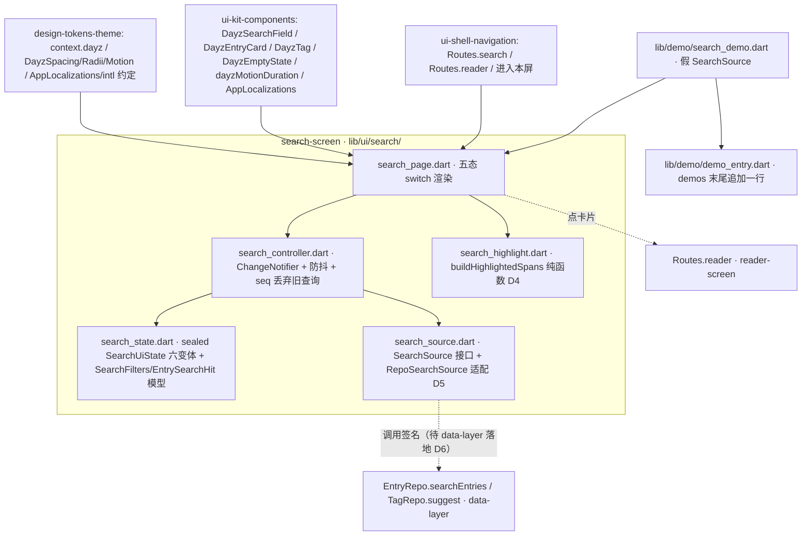

---
作者：@Ray
创建日期：2026-05-29
最后更新：2026-05-29
文档状态：草稿
---

# 设计：search-screen

> 视觉与映射依据：屏源真源 [`ui-design/current/pages/screens/search.html`](../../../ui-design/current/pages/screens/search.html)（`?state=typing|results|empty`）；组件类名/最小 HTML [`ui-design/current/docs/DESIGN-REF.md`](../../../ui-design/current/docs/DESIGN-REF.md) §3b「搜索 `.search-head`」/ §3c「搜索建议行 `.suggest-row`」「空状态 `.empty`」/ §3「标签 `.tag`」「时间线日记卡片 `.entry`」；解析后样式真源 `ui-design/current/pages/assets/spec.css`（`.search-head`/`.search-input`/`.search-cancel`/`.search-sec`/`.search-stat`/`.hl` 段，行约 826–844、919）；HTML 机制 → Flutter 映射 [`ui-design/current/docs/PROTOTYPE-ARCH.md`](../../../ui-design/current/docs/PROTOTYPE-ARCH.md) §6；还原方法论 [`docs/design/10-ui-restore-and-design-sync.md`](../../../docs/design/10-ui-restore-and-design-sync.md) §1/§3/§4/§11。token / `context.dayz.*` / `AppLocalizations` / `intl` 约定来自 `design-tokens-theme`（D1/D4）；复用组件与外壳来自 `ui-kit-components`（`DayzEntryCard`/`DayzSearchField`/`DayzTag`/`DayzEmptyState`/`dayzMotionDuration`）与 `ui-shell-navigation`（`Routes.search`/`Routes.reader`）。

## 技术决策

### D1 · 五态状态机（补 querying / error，原型只有三态）
- **状态：** 采纳
- **背景：** 设计稿 `search.html` 只有 `typing`/`results`/`empty` 三种**静态呈现**，没有「正在查」与「查询失败」——真实屏一遇异步与异常就缺态（白屏 / 崩）。R1 要求显式五态 + error。
- **选项：** (A) 沿用三态、查询期间复用 typing、出错静默；(B) 一个密封状态类 `SearchUiState`（`idle`/`typing`/`querying`/`results`/`empty`/`error`）+ 一个控制器统一持有与转移；(C) 用多个布尔标志位（loading/hasError/...）拼。
- **选择：** B。`sealed class SearchUiState` 六个变体（`idle{recent, tagSuggestions}` / `typing{query}` / `querying{query}` / `results{query, hits}` / `empty{query}` / `error{query, message}`），由 `SearchController extends ChangeNotifier` 持有 `state` 并暴露 `onQueryChanged(text)` / `retry()` / `pickSuggestion(term)` / `removeFilter(f)`；屏 widget 只 `switch (state)` 渲染对应子树。
- **理由：** sealed + switch 让「每个态都画到、缺态编译期暴露」，是 R1/R8 的结构性落点；`ChangeNotifier` 与 `ui-shell-navigation` D6 的 `theme_controller` 同构、与方法论完整示例同构，低频状态足够，不引第三方状态库。
- **代价：** 多一个状态类与控制器；但把"补缺态"做成编译期可检的结构，值。

### D2 · 防抖 + 旧查询丢弃（避免乱序覆盖）
- **状态：** 采纳
- **背景：** R2 要求连续键入只发最后一次查询，且迟到的旧结果不能覆盖新结果（异步乱序是搜索框经典 bug）。
- **选项：** (A) 每次键入立即查；(B) `Timer` 防抖（窗口内 reset）+ 每次发起查询自增一个 `requestSeq`，回调里比对 seq、过期则丢弃；(C) Rx/stream `debounceTime + switchMap`。
- **选择：** B。`SearchController` 持一个 `Timer? _debounce` 与单调递增的 `int _seq`；`onQueryChanged` 重置 `_debounce`（窗口取 `DayzMotion` 或本控制器常量，实现时对齐手感、记常量）；窗口到期后 `_seq++` 并 `await repo.searchEntries(...)`，回调里 `if (seq != _seq) return;` 丢弃过期结果。
- **理由：** 不引 Rx；`Timer` + seq 是 Flutter 社区对搜索防抖+竞态的标准最小做法，易 widget test（用 `tester.pump(Duration)` 推进防抖窗口、断言只发一次有效查询、旧结果被丢）。
- **代价：** 手写防抖+seq 比 stream 算子多几行；但零依赖、可测、显式，可接受。

### D3 · 结果列表用朴素 ListView（不套时间线复杂度）
- **状态：** 采纳
- **背景：** 设计稿 `search.html` 的 results 区用了 `.timeline > .entry` 卡片结构（与时间线同形），但搜索结果**不需要**时间线屏的吸顶月份头 / 日历跳转 / 无限滚动游标分页（那些是 `timeline-screen` 的复杂度）。范围明确要求"复用 EntryCard 但用朴素 ListView"。
- **选项：** (A) 照搬时间线的 `CustomScrollView` + `SliverPersistentHeader` 吸顶 + 无限滚动；(B) 朴素 `ListView`（结果一次性返回、`ListView.builder` 渲染 `DayzEntryCard`），顶部 `.search-stat` 计数作为列表头部一个普通项 / 列表外固定行。
- **选择：** B。结果区 = 一个 `ListView`（或 `Column` over scroll）：顶部固定 `.search-stat` 计数行 + 下面 `ListView.builder(itemBuilder: DayzEntryCard)`；**不引入 `SliverPersistentHeader` 吸顶、不引入日历面板、不做游标分页**（MVP 结果集一次性取，量大分页归后续）。
- **理由：** 守"叶子页不背时间线的复杂度"的范围红线；朴素 ListView 实现/测试都轻；几何闸只需断"卡片纵向顺序 + 不溢出"（content-driven），无吸顶 sticky 状态要验。
- **代价：** 结果极多时无分页（一次性渲染）；MVP 搜索结果通常有限，分页留后续（已知风险记一笔）。

### D4 · 命中词高亮：Text.rich + TextSpan（样式取 token，几何来自设计稿 .hl）
- **状态：** 采纳
- **背景：** R3 要在标题/摘要里把命中子串高亮。设计稿 `.hl` = `background: var(--accent-soft-2); color: var(--accent-ink); border-radius: 3px; padding: 0 2px;`（spec.css ~919）。范围口语称"直角高亮"——指**非 pill（非 `--r-full`）的方块底**，CSS 实测圆角是 3px（小圆角，非 0），以 CSS 解析后值为参数闸真源。
- **选项：** (A) `Text` 拆成多个 `Text` 横排（换行语义错）；(B) `Text.rich(TextSpan(children: [...]))` 把文本切成「非命中 span / 命中 span（`TextStyle(backgroundColor: accentSoft2, color: accentInk)`）」；(C) `RichText` + 自绘背景框（要 `WidgetSpan` 或 painter 才能做 3px 圆角 padding）。
- **选择：** B 为主：`Text.rich` 一段，命中 `TextSpan` 用 `backgroundColor: context.dayz.accentSoft2` + `color: context.dayz.accentInk`。`TextSpan.backgroundColor` 是无圆角无 padding 的纯色底——3px 圆角 + `0 2px` padding 在纯 `TextSpan` 不可得；**降级**：`backgroundColor` 直角无 padding（功能等价、像素略差），圆角/内边距差进 golden/SSIM advisory（design-sync-automation），不阻塞。若产品强需圆角高亮，后续用 `WidgetSpan` 包 `Container(decoration)` 增强（另起，不在本 spec 强求）。
- **理由：** `Text.rich` 保持单段换行语义（R3/NF3 中英混排换行正确），命中切分用 `query` 在 `title`/`excerpt` 上做大小写归一的子串定位生成 spans；样式走 token（NF4）。
- **代价：** `TextSpan.backgroundColor` 缺 3px 圆角/`0 2px` padding 的像素差（advisory，不阻塞）；切分逻辑要处理多处命中与边界，集中在一个 `buildHighlightedSpans(text, query, baseStyle, hitStyle)` 纯函数里、单测覆盖。

### D5 · 取数入口以接口签名注入（守 NF2，可假实现独立测试）
- **状态：** 采纳
- **背景：** NF2 硬红线：UI 只经 Repository、不持 Drift。但 `data-layer` 本期 EntryRepo **未暴露任何搜索 API**（D8「不暴露 FTS 查询 API」），LIKE 子串入口尚不存在（见 D6）。
- **选项：** (A) 屏直接 `EntryRepo()` 单例并调其方法；(B) `SearchController` 构造注入一个**最小取数接口**（如 `SearchSource`，方法 `Future<List<EntrySearchHit>> search(query, filters)`、`List<RecentSearch> recent()`、`List<TagSuggestion> tags()`），生产实现适配 `EntryRepo`/`TagRepo`，测试/demo 注入内存假实现。
- **选择：** B。屏与控制器只依赖 `SearchSource` 接口（定义在本屏 `lib/ui/search/`），其**唯一生产实现** `RepoSearchSource` 转调 `EntryRepo.searchEntries(...)` / `TagRepo.suggest(...)`（签名见 D6，待 data-layer 落地）。本屏 MUST NOT import `lib/data`/Drift；适配层只 import Repository 公开 API。
- **理由：** 接口注入让屏可用假数据 widget test 独立验证（执行协议友好），且把"对尚不存在的 Repo 方法的依赖"收敛到一个适配文件，data-layer 就绪后只改适配层、屏不返工；同时天然满足 NF2（屏侧无 Drift 句柄）。
- **代价：** 多一个接口 + 适配类；但这是 NF2 + 跨 spec 未就绪降级的标准做法（与 `ui-shell-navigation` D3 抽屉"接收入参不持 Repo"同构），值。

### D6 · 搜索查询交付物：依赖 data-layer 新增 LIKE 入口（远期 FTS，本期 LIKE）
- **状态：** 采纳（但**依赖待确认**）
- **背景：** 范围定「先做标题/标签/纯文本 LIKE，中文 FTS 归远期」。`data-layer` 现状：`entries_fts` 虚拟表已建但用默认 tokenizer（中文不可用）、且 **Repository 不暴露 FTS 查询 API**（data-layer D8）。即本屏需要的 `EntryRepo.searchEntries(query, filters)` LIKE 子串查询入口**当前不存在**。
- **选项：** (A) 本屏自己写 LIKE SQL —— **违反 NF2 硬红线，否决**；(B) 把"新增 `EntryRepo.searchEntries` LIKE 入口"声明为**对 data-layer 的跨 spec 依赖交付物**，按签名引用、未就绪时本屏用 `SearchSource` 假实现降级，落地后接 `RepoSearchSource`；(C) 等远期 FTS spec 一起做（阻塞本屏）。
- **选择：** B。约定交付物签名（待 data-layer 确认/微调）：`Future<List<EntrySearchHit>> EntryRepo.searchEntries({required String query, SearchFilters? filters, int limit})`——内部对 `title` / `content_plain` / 关联 tag 名做 `LIKE %query%` 子串匹配、默认过滤 `deleted_at`、按 `entry_dt_utc` 倒序、limit 截断。`EntrySearchHit` = 渲染 `DayzEntryCard` 所需最小投影（id / 标题 / 摘要 / 日期 / 首图/封面 / tag / 地点 / 心情）。**该方法属 data-layer 的可改文件，本 spec MUST NOT 实现它**，只在 `RepoSearchSource` 适配层调用其签名。
- **理由：** 既守 NF2（查询逻辑在 Repo 内），又不让本屏被远期 FTS 阻塞；中文 FTS 切换日后只换 `EntryRepo` 内部实现（LIKE→FTS），本屏与适配层签名不变。
- **代价：** 强依赖 data-layer 新增一个方法；**该方法的精确签名/归属须与 data-layer 确认**（标「待确认」，进已知风险 + openQuestions）。未就绪期间本屏只能用假数据 demo/测试（功能可验、真数据不可见）。

### D7 · 搜索头复用 ui-kit 的 DayzSearchField；屏内 .suggest-row 归本屏
- **状态：** 采纳
- **背景：** `ui-kit-components` 已把 `.search-head` 可复用搜索输入框骨架登记为 `DayzSearchField`（其 design 文件变更明确："屏内 `.topsearch`/`.suggest-row` 归各屏"）。
- **选项：** (A) 本屏自画 search-head；(B) 复用 `DayzSearchField`（输入框 `.search-input`：`--bg-2` 底 + `--r-full` 圆角 + 放大镜 + 光标），本屏只组合它 + 「取消」钮 + 各态主体；`.suggest-row`（最近搜索/建议行）是搜索屏专属，在本屏实现。
- **选择：** B。`search_page.dart` 顶部用 `DayzSearchField`（受控，回调接 `SearchController.onQueryChanged`）+ 「取消」`DayzButton`(text 变体，`--accent-ink`)；`.suggest-row` 作本屏私有 widget `_SuggestRow`（图标 + 词 + 可选 `.sub` 计数，走 token）。
- **理由：** 守"跨屏件在组件层落一次"（方法论 §3）；`.suggest-row` 是搜索专属、不跨屏，按 ui-kit design 的明确分工归本屏。
- **代价：** `DayzSearchField` 是跨 spec 依赖（ui-kit 交付物），未就绪时本屏用最小内联占位输入框（走 token）降级（已知风险）。

### D8 · 筛选 chip 只做视觉与去除交互，条件作入参（不写筛选 SQL）
- **状态：** 采纳
- **背景：** results 态顶部有筛选区（`# 家 ×` 实底可去除 + `全部日记本`/`有照片`/`2026` 描边款），设计稿是静态。真实筛选落库归 data-layer。
- **选项：** (A) 本屏拼筛选 where 子句 —— 违反 NF2，否决；(B) 本屏用 `DayzTag`/`DayzTag(outline)` 渲染筛选 chip，去除叉 `.x` 点击 → `SearchController.removeFilter(f)` 更新 `SearchFilters` 入参并重查，`SearchFilters` 作为 `searchEntries` 入参交给 Repo。
- **选择：** B。`SearchFilters`（值对象：选中 tag 集 / journal 限定 / 有照片 / 年份等，结构最小化、随需扩展）由控制器持有，渲染为 chip，改动触发重查；如何转 where 归 `EntryRepo`（D6）。
- **理由：** 守 NF2，本屏只管筛选的**呈现与编辑**，不管落库。
- **代价：** `SearchFilters` 的字段集需与 data-layer `searchEntries` 对齐（同属 D6 待确认）。

### D9 · 文案进 AppLocalizations、日期走 intl（落实 docs/design/11）
- **状态：** 采纳
- **背景：** UI 文案唯一来源是 zh/en ARB。本屏有「取消」「最近搜索」「标签」「找到」「篇 · 按时间倒序」「没有找到『…』」空态引导、error 文案、「重试」、各 Semantics 标签等。
- **选择：** 本屏所有可见文案补入 `lib/l10n/arb/app_zh.arb` 与 `app_en.arb`，运行期经 `AppLocalizations.of(context)` / `l10n.xxx` 取用；计数 N（「找到 N 篇」）、结果卡片日期段走 `package:intl` / ARB ICU，MUST NOT 自拼 `'3 篇'`/`'2026年5月'`。widget 测试用 `find.text(l10n.xxx)` 而非裸中文。
- **理由：** 单一可审计文案落点 + 测试自带"只引常量"回归护栏。
- **代价：** `app_zh.arb` / `app_en.arb` 是跨 spec 共享文件，需和其他 UI spec 合并 key；改完要跑 `gen-l10n`。

## 架构

## 文件变更

> 这是本 spec 任务「可改文件」的**唯一来源与上界**；任一任务可改文件 MUST ⊆ 本清单。新建 Dart 文件 MUST 在文件顶部加 MPL-2.0 头注。本清单主体落 `lib/ui/search/`、`lib/demo/`、`test/ui/search/`，加共享文件：`lib/demo/demo_entry.dart`（末尾追加一行）与 `lib/l10n/arb/app_zh.arb`、`lib/l10n/arb/app_en.arb`、`lib/l10n/gen/`（补 gen-l10n 文案）。除这些共享文件外，**不列入** ui-kit / shell / tokens / data 的任何交付物（顶栏/卡片/Routes/Repo 等本屏只引用、注入或调用签名，绝不改）。

**屏与状态机 `lib/ui/search/`**
- `lib/ui/search/search_page.dart`         新建（搜索屏：`DayzSearchField` + 取消钮 + 五态 `switch(state)` 渲染主体；results 用朴素 `ListView`，D1/D3/D7）
- `lib/ui/search/search_controller.dart`    新建（`ChangeNotifier` 状态机持有者 + 防抖 `Timer` + `_seq` 丢弃旧查询 + `retry`/`pickSuggestion`/`removeFilter`，D1/D2/D8）
- `lib/ui/search/search_state.dart`         新建（`sealed class SearchUiState` 六变体 + `SearchFilters` 值对象 + `EntrySearchHit`/`RecentSearch`/`TagSuggestion` 渲染模型，D1/D8）
- `lib/ui/search/search_highlight.dart`     新建（`buildHighlightedSpans(text, query, baseStyle, hitStyle)` 纯函数，命中切分 → `List<InlineSpan>`，D4）
- `lib/ui/search/search_source.dart`        新建（`abstract interface class SearchSource` + `RepoSearchSource` 适配 `EntryRepo`/`TagRepo`；适配层是唯一接触 Repository 的处，屏/控制器只依赖接口，D5/D6/NF2）

**gen-l10n 文案**
- `lib/l10n/arb/app_zh.arb`、`lib/l10n/arb/app_en.arb`         修改（补本屏 zh/en 文案与 Semantics key；两份 key 集合一致，D9）
- `lib/l10n/gen/app_localizations*.dart`        修改（`flutter gen-l10n` 生成产物）

**Debug Home 入口 `lib/demo/`**
- `lib/demo/search_demo.dart`               新建（注入内存假 `SearchSource`，可手动驱动六态走查，R9）
- `lib/demo/demo_entry.dart`                修改（**仅末尾追加一行**，不插中间、不改 `DemoEntry` 字段）

**测试目录（白名单 hook 对 `test/**/*_test.dart` 自动放行；非 `_test.dart` 的共享基建由任务 `验收基建` 字段预批）**
- `test/ui/search/`                         新建（状态机 / 防抖 / 高亮 / 五态渲染 / 几何 / 无障碍 widget test）
- `test/ui/search/fake_search_source.dart`  新建（测试用假 `SearchSource`，受控返回命中/空/抛错；共享基建，任务 `验收基建` 预批）

> **不触 `pubspec.yaml`**：本屏依赖（`flutter_svg`/`go_router`/`widgetbook`/`intl`）均已由 `design-tokens-theme`/`ui-kit-components`/`ui-shell-navigation` 引入或为 SDK 传递依赖，本 spec 不新增任何 pub 依赖；如执行中发现确需新依赖，停下回填本清单 + 复核升档再继续（spec-guide P2）。
> **不触旧文案桶**：本屏文案只进 ARB / `AppLocalizations`，不得新建 `search_strings.dart` 或追加临时静态文案。

## 已知风险

- **跨 spec 依赖未就绪的降级（按交付物名引用，可能尚未实现）：**
  - `design-tokens-theme`（README 依赖列已登记，**强依赖**）：`context.dayz.*`（含 `accentSoft2`/`accentInk`/`bg2`）、`DayzSpacing/DayzRadii/DayzMotion`、六套 `ThemeData`、`AppLocalizations`/`intl` 约定。未定稿则本屏阻塞（READY 门）。
  - `ui-kit-components`（README 依赖列已登记，**强依赖**）：`DayzSearchField`（`.search-head` 输入框）、`DayzEntryCard`（结果卡片）、`DayzTag`/`DayzTag.outline`（筛选/标签 chip）、`DayzEmptyState`（空态）、`dayzMotionDuration`（reduce-motion 门）。未就绪降级：搜索头/卡片/空态用最小内联占位（走 token），reduce-motion 暂在本屏内联判 `MediaQuery.disableAnimations`（就绪后改走门）。
  - `ui-shell-navigation`（README 依赖列已登记，**强依赖**）：`Routes.search`（进入本屏）/ `Routes.reader`（点卡片去向）。`Routes` 常量是其 D2 跨 spec 契约，本屏只引用、不改名。未就绪降级：demo 内用占位导航。
  - `data-layer`（README 依赖列已登记，但**关键方法待新增**，见 D6）：`EntryRepo.searchEntries(query, filters, limit)` LIKE 子串入口 + `EntrySearchHit` 投影 + （可选）`TagRepo.suggest()`。**该方法当前不存在**（data-layer D8 不暴露 FTS / 无 LIKE 入口）→ **本屏对它的依赖标「待确认」**：精确签名/归属须与 data-layer 协调（该方法属 data-layer 可改文件，本 spec 不实现）。未就绪期间本屏经 `SearchSource` 假实现工作，功能可 widget test 验证、真数据不可见。
  - `design-sync-automation`（**非 README 依赖**，仅验证基建关系）：参数/几何抽取 harness、`element-map.yaml`、区域化 SSIM 兜底属其交付物；本屏的样式/几何断言用 Flutter 原生 `tester.getRect` / 解析 widget 属性自验，**不依赖 harness 就绪**；需"对设计稿源屏比框"的部分留给 design-sync 期二，不在本 spec 重造。
- **中文 FTS 是远期**：MVP 仅 LIKE 子串匹配（标题/`content_plain`/标签名），中文分词/相关性排序归 data-layer 远期 FTS spec；本屏切到 FTS 时只换 `EntryRepo.searchEntries` 内部实现，`SearchSource` 签名与本屏不变（D6）。
- **高亮像素差（D4）**：`TextSpan.backgroundColor` 无 `.hl` 的 3px 圆角与 `0 2px` padding，直角无内边距是功能等价降级，圆角/padding 差进 golden/SSIM advisory（design-sync-automation 期二），不阻塞放行；强需圆角则后续 `WidgetSpan` 增强（另起）。
- **结果无分页（D3）**：MVP 结果一次性取并朴素 `ListView` 全渲染；结果极多时无游标分页（时间线那套不引入本屏）。量大分页留后续 spec，记此一笔。
- **筛选/最近搜索数据源（D8/R5）**：筛选条件如何转 where、最近搜索历史/标签建议如何持久化均归 data-layer / 后续；本屏只渲染与编辑、作入参传递，未就绪用空列表 / 假实现降级。
- **ARB 合并风险（D9）**：多个 UI spec 可能并行补 `app_zh.arb` / `app_en.arb`；合并时以 key 集合一致和 `scripts/check_arb_sync.sh` 为准，MUST NOT 用屏内 strings 文件或静态文案常量临时绕过。
- **无持久化 schema 变更**：本屏不新增/改 DB schema（查询入口的实现归 data-layer）→ 无数据迁移/回滚要素。
- **新文件加 MPL-2.0 头注**：`lib/ui/search/*.dart`、`lib/demo/search_demo.dart` 等全部新建 Dart 文件 MUST 在文件顶部加 MPL-2.0 头注（模板见 AGENTS.md / README「License」）。
</content>
