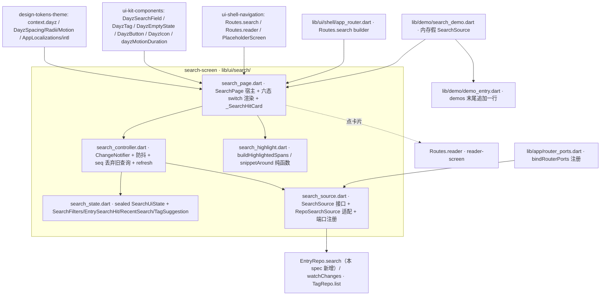

---
作者：@Ray
创建日期：2026-05-29
最后更新：2026-10-10
文档状态：定稿
---

# 设计：search-screen

> 视觉与映射依据：屏源真源 [`ui-design/current/pages/screens/search.html`](../../../ui-design/current/pages/screens/search.html)（`?state=typing|results|empty`）；组件类名/最小 HTML [`ui-design/current/docs/DESIGN-REF.md`](../../../ui-design/current/docs/DESIGN-REF.md) §3b「搜索 `.search-head`」/ §3c「搜索建议行 `.suggest-row`」「空状态 `.empty`」/ §3「标签 `.tag`」「时间线日记卡片 `.entry`」；解析后样式真源 `ui-design/current/pages/assets/spec.css`（`.search-head`/`.search-input`/`.search-cancel`/`.search-sec`/`.search-stat`/`.chips`/`.hl` 段，行约 826–844、919）与 `ui-design/current/pages/assets/screen.css`（`.empty`、`.suggest-row`，行约 127–149）；HTML 机制 → Flutter 映射 [`ui-design/current/docs/PROTOTYPE-ARCH.md`](../../../ui-design/current/docs/PROTOTYPE-ARCH.md) §6；还原方法论 [`docs/design/10-ui-restore-and-design-sync.md`](../../../docs/design/10-ui-restore-and-design-sync.md) §1/§3/§4/§11。token / `context.dayz.*` / `AppLocalizations` / `intl` 约定来自 `design-tokens-theme`；复用组件与外壳来自 `ui-kit-components`（`DayzSearchField`/`DayzTag`/`DayzEmptyState`/`DayzButton`/`DayzIcon`/`dayzMotionDuration`）与 `ui-shell-navigation`（`Routes.search`/`Routes.reader`/`PlaceholderScreen`）。分层与端口写法照 `onthisday-screen`（屏私有取数端口 + 组合根注册 + 路由 builder 读端口）。

## 技术决策

### D1 · 五态状态机（补 querying / error，原型只有三态）
- **状态：** 采纳
- **背景：** 设计稿 `search.html` 只有 `typing`/`results`/`empty` 三种**静态呈现**，没有「正在查」与「查询失败」——真实屏一遇异步与异常就缺态（白屏 / 崩）。R1 要求显式五态 + error。
- **选项：** (A) 沿用三态、查询期间复用 typing、出错静默；(B) 一个密封状态类 `SearchUiState` + 一个控制器统一持有与转移；(C) 用多个布尔标志位（loading/hasError/...）拼。
- **选择：** B。`sealed class SearchUiState` 六个变体（`SearchIdle` / `SearchTyping{query}` / `SearchQuerying{query}` / `SearchResults{query, hits}` / `SearchEmpty{query}` / `SearchError{query, message}`），由 `SearchController extends ChangeNotifier` 持有 `state`，另持 `recent` / `tags`（idle 与 typing 共用的建议数据）与 `filters`，暴露 `start()` / `onQueryChanged(text)` / `submit(text)` / `pickSuggestion(term)` / `removeFilter(kind)` / `retry()` / `refresh()`；屏 widget 只 `switch (state)` 渲染对应子树。typing 态沿用 idle 的建议内容（与设计稿 `typing` 呈现一致），querying 态显示一行静态「正在搜索…」（不用转圈动画，免 reduce-motion 分支）。
- **理由：** sealed + switch 让「每个态都画到、缺态编译期暴露」，是 R1/R8 的结构性落点；`ChangeNotifier` 与 `onthisday-screen` 的 controller 同构，不引第三方状态库。
- **代价：** 多一个状态类与控制器；但把"补缺态"做成编译期可检的结构，值。

### D2 · 防抖 + 旧查询丢弃（避免乱序覆盖）
- **状态：** 采纳
- **背景：** R2 要求连续键入只发最后一次查询，且迟到的旧结果不能覆盖新结果（异步乱序是搜索框经典 bug）。
- **选项：** (A) 每次键入立即查；(B) `Timer` 防抖（窗口内 reset）+ 每次发起查询自增一个 `_seq`，回调里比对 seq、过期则丢弃；(C) Rx/stream `debounceTime + switchMap`。
- **选择：** B。`SearchController` 持 `Timer? _debounce` 与单调递增的 `int _seq`；`onQueryChanged` 重置 `_debounce`（窗口常量 `searchDebounce = 300ms`）；窗口到期后 `_seq++` 并 `await source.search(...)`，回调里 `if (seq != _seq) return;` 丢弃过期结果。键盘「搜索」键 / 点建议 / 改筛选 / 重试**跳过防抖**立即查（同样自增 seq）。输入清空 → 取消计时器并 `_seq++`（作废在途查询）→ 回 idle。
- **理由：** 不引 Rx；`Timer` + seq 是搜索防抖+竞态的标准最小做法，易用 `tester.pump(Duration)` / `fakeAsync` 推进验证。
- **代价：** 手写防抖+seq 比 stream 算子多几行；零依赖、可测、显式，可接受。

### D3 · 结果列表用朴素 ListView + 屏私有结果卡片（与 DayzEntryCard 同形）
- **状态：** 采纳（2026-10-10 对齐现状修正：卡片不直接复用 `DayzEntryCard`）
- **背景：** 设计稿 results 区用 `.timeline > .entry` 卡片结构（与时间线同形），但搜索结果**不需要**吸顶月份头 / 日历跳转 / 游标分页。另：现状 `DayzEntryCard` 的 `title` / `summary` 只收 `String`，**没有 `InlineSpan` / builder 槽**，无法承载 R3 的命中高亮；`lib/ui/widgets` 归 ui-kit，本屏不越界改。
- **选项：** (A) 照搬时间线 `CustomScrollView` + `SliverPersistentHeader`；(B) 朴素 `ListView` + 直接用 `DayzEntryCard`（放弃高亮，违反 R3）；(C) 朴素 `ListView` + 屏私有 `_SearchHitCard`，几何与样式逐项照 `DayzEntryCard` / `.entry`（52px 日期栏 + `s3` 间距 + `surface` 底 / `hairline` 描边 / `DayzRadii.md` / `shadowSm`，`.card .body` 内边距 `s3/s4`，`h4` 17px/600/1.25 两行，`.excerpt` diary 14px/1.7 两行，`.foot .meta` 地点），标题/摘要换成 `Text.rich`。
- **选择：** C。结果区 = 一个 `ListView.builder`：[已生效筛选区（有才渲）] + `.search-stat` 计数行 + 卡片若干（`.timeline` 内边距 `s2 s4 s4`、卡片间距 `s4`）；**不引入 `SliverPersistentHeader`、日历面板、游标分页**（结果一次性取，`limit` 默认 100）。v1 卡片不渲染封面、标签、心情、收藏星（见已知风险）。
- **理由：** 守"叶子页不背时间线复杂度"的范围红线；R3 高亮在不改 ui-kit 的前提下只能落在屏私有卡片；几何照抄保证与时间线观感一致。
- **代价：** 与 `DayzEntryCard` 有一份重复的卡片骨架；登记 ui-kit 缺口「`DayzEntryCard` 增加标题/摘要富文本槽」，补齐后本屏换回组件、删私有卡片。结果极多时无分页。

### D4 · 命中词高亮：Text.rich + TextSpan（样式取 token，几何来自设计稿 .hl）
- **状态：** 采纳
- **背景：** 设计稿 `.hl` = `background: var(--accent-soft-2); color: var(--accent-ink); border-radius: 3px; padding: 0 2px;`（spec.css ~919）。"直角高亮"指非 pill 的方块底。
- **选项：** (A) 拆多个 `Text` 横排（换行语义错）；(B) `Text.rich` 切「非命中 / 命中」span；(C) `WidgetSpan` 包 `Container` 做圆角 padding。
- **选择：** B。纯函数 `buildHighlightedSpans(text, query, baseStyle, hitStyle)`：大小写归一（`toLowerCase`）定位全部非重叠出现处，生成交替 span，拼回等于原文；空 query / 无命中 → 单个 base span。命中样式由屏传 `TextStyle(backgroundColor: accentSoft2, color: accentInk)`。另一个纯函数 `snippetAround(text, query, {lead})`：命中首现位置超过 `lead`（默认 16 字）时，从命中前 `lead` 字处截起并加前缀 `…`，保证两行摘要可见命中（R3）。`TextSpan.backgroundColor` 无圆角无 padding → 3px 圆角 + `0 2px` 降级为直角无内边距（功能等价），像素差进 golden/SSIM advisory，不阻塞。
- **理由：** `Text.rich` 保持单段换行语义（R3/NF3）；两个纯函数无 BuildContext、易单测。
- **代价：** 圆角/内边距像素差（advisory）；大小写归一只对拉丁字母有意义（CJK 精确匹配），与 SQLite LIKE 的 ASCII 大小写不敏感口径一致。

### D5 · 取数入口以接口签名注入（守 NF2，可假实现独立测试）
- **状态：** 采纳（2026-10-10 签名对齐现状：建议数据改异步、补变更流）
- **背景：** NF2 硬红线：UI 只经 Repository、不持 Drift。`TagRepo.list()` 是异步的；阅读屏删除/改动后回到搜索屏需要回刷（R10）。
- **选择：** 屏与控制器只依赖屏私有接口（定义在 `lib/ui/search/search_source.dart`）：
  ```dart
  abstract interface class SearchSource {
    Future<List<EntrySearchHit>> search(String query, SearchFilters filters);
    Future<List<RecentSearch>> recent();
    Future<List<TagSuggestion>> tags();
    Stream<void> changes();
  }
  ```
  **唯一生产实现** `RepoSearchSource({required EntryRepo entryRepo, TagRepo? tagRepo})`（同文件）：`search` 转调 `EntryRepo.search(...)` 并把 `Entry` 映射为 `EntrySearchHit`（标题 = `content_plain` 首个非空行，摘要 = 其余行以空格连接，日期 = `localYear/Month/Day`，地点 = 去空白后的 `placeName`，`tags` v1 恒空）；成功查询后把 `(词, 命中数)` 记入进程内会话级最近搜索（去重、置顶、最多 5 条）；`tags()` 转调 `TagRepo.list()`（`tagRepo` 为 null → 空）；`changes()` 转调 `EntryRepo.watchChanges()`。测试 / demo 注入内存假实现。
- **理由：** 接口注入让屏可用假数据 widget test 独立验证，且把"对 Repository 的依赖"收敛到一个适配类；与 `onthisday-screen` 的 `OnThisDayRepository` + `DataLayerOnThisDayRepository` 同构。
- **代价：** 多一个接口 + 适配类；最近搜索不落库（进程重启即空），持久化归后续。

### D6 · 检索查询交付物：本 spec 给 EntryRepo 加一个 LIKE 查询方法（不改 schema、不碰 FTS）
- **状态：** 采纳（2026-10-10 对齐现状改判：原「依赖 data-layer 新增，待确认」→ 由本 spec 落地最小方法）
- **背景：** 现状 `EntryRepo` 只有 `timeline` / `countByMonth` / `entryDaysOfMonth` / `onThisDay` / `byId` / 写入方法，**无检索入口**。`entries_fts` 虚拟表默认 tokenizer（中文不可用）、无同步触发器，且 data-layer D8 不暴露 FTS。`TagRepo` 有 `list()` / `listForEntry` / `listEntriesForTag`，无批量查询。
- **选项：** (A) 屏自己写 LIKE SQL —— 违反 NF2，否决；(B) 本 spec 在 `EntryRepo` **只加一个查询方法**，查询逻辑留在 Repo 内；(C) 等远期 FTS spec（阻塞本屏）；(D) 改 schema / 修 FTS（越界，需停下另立）。
- **选择：** B。新增（仅新增方法，不改既有方法、不改 schema、不动 FTS 表）：
  ```dart
  Future<List<Entry>> search(
    String query, {
    String? journalId,
    int? year,
    int limit = 100,
  })
  ```
  语义：`query.trim()` 为空 → 返回空列表、不发 SQL；否则对 `content_plain` 做 `LIKE '%<转义后词>%' ESCAPE '\'`（`\`、`%`、`_` 先转义，字面匹配）；固定过滤 `deleted_at IS NULL`；`journalId` / `year`（`local_year`）非空时追加等值过滤；按 `entry_dt_utc DESC, id DESC` 排序；`limit < 1` 抛 `ArgumentError`（与 `timeline` 同口径）。用 Drift 查询构建器（`like(..., escapeChar:)`），不写裸 SQL 字符串。
- **理由：** 既守 NF2（LIKE 拼装在 Repo 内），又不被远期 FTS 阻塞；日后换 FTS 只换方法内部实现，签名与本屏不变。
- **代价：** LIKE 全表扫描（个人日记量级可接受）；不匹配标签名（标签批量查询 spec 并行中，v1 范围外）。

### D7 · 搜索头复用 ui-kit 的 DayzSearchField（含其内置取消钮）；屏内 .suggest-row 归本屏
- **状态：** 采纳（2026-10-10 对齐现状：取消钮用 `DayzSearchField.onCancel` 内置款）
- **背景：** 现状 `DayzSearchField` 已含 `.search-input`（`bg2` 底 + `DayzRadii.full` + 18px 放大镜 + 清除钮）和可选「取消」`TextButton`（`onCancel` 非空时渲染，`accentInk` 15px/500，`minimumSize 44×44`，文案 `l10n.cancel`）。
- **选择：** `search_page.dart` 顶部用 `DayzSearchField(controller, focusNode, hintText: l10n.searchHint, autofocus: 无初始词时, onChanged → onQueryChanged, onSubmitted → submit, onCancel → 出栈)`，外包 `Semantics(label: l10n.searchInputLabel)` 满足 NF1「输入框」标签；`.suggest-row` 作本屏私有 `_SuggestRow`（`clockPath` 18px ink3 + 词 15px ink + 可选「N 篇」12px ink3，竖向内边距 12px，命中盒 ≥44）；`.search-sec .h` 作私有 `_SectionHeader`（11px / 600 / 0.12em / 大写 / ink3）；空态插画为屏私有 path（照抄屏源 `.empty .ill` 的放大镜 + 减号，`DayzIcon` 渲染、1.8 描边）。
- **理由：** 跨屏件在组件层落一次（方法论 §3）；`.suggest-row` 搜索专属，按 ui-kit 分工归本屏。
- **代价：** `.search-head` 的 `gap: 10px` 由 `DayzSearchField` 内部定为 `s2`（8px），2px 差归 ui-kit，不在本屏修。

### D8 · 筛选 chip 只渲染已生效条件与去除交互，条件作入参（不写筛选 SQL）
- **状态：** 采纳（2026-10-10 v1 收敛字段）
- **背景：** results 态顶部有筛选区（`# 家 ×` 实底可去除 + 描边款「添加」chip），设计稿是静态。
- **选择：** `SearchFilters` 值对象 v1 只含 `journal`（`SearchJournalFilter{id, name}`，可空）与 `year`（`int?`），`isEmpty` / `without(SearchFilterKind)`；屏只在 `filters` 非空时渲染「筛选」分组，每个生效条件一枚实底 `DayzTag(onRemove)`（去除叉命中盒 44，Semantics「移除筛选：{label}」），点叉 → `removeFilter(kind)` → 以当前词立即重查；empty 态若有生效筛选也渲染该分组（便于按引导文案去掉筛选）。条件由 `SearchPage.initialFilters` 注入（v1 生产路由不传，demo 传）；标签筛选、「有照片」与描边款「添加」chip v1 不做。`journal.id` / `year` 原样交给 `EntryRepo.search`。
- **理由：** 守 NF2，本屏只管筛选的**呈现与去除**；字段收敛到 Repo 现有列即可过滤的两项。
- **代价：** v1 生产环境筛选区通常不出现（无入口）；新增入口归后续。

### D9 · 文案进 AppLocalizations、计数走 ICU、日期走 intl
- **状态：** 采纳
- **背景：** UI 文案唯一来源是 zh/en ARB。
- **选择：** 新增 key（两份 ARB 同步，`flutter gen-l10n`）：`searchInputLabel`、`searchRecent`、`searchTags`、`searchFilters`、`searchTagChip(name)`、`searchRecentCount(count)`、`searchResultStat(count)`、`searchQuerying`、`searchEmptyTitle(query)`、`searchEmptyDescription`、`searchErrorTitle`、`searchErrorDescription`、`searchRetry`、`searchOpenEntry(title)`、`searchRemoveFilter(label)`；沿用既有 `cancel`（取消钮）、`searchHint`（占位）。计数用 ICU plural；`.search-stat` 的 `<b>N</b>` 由屏在格式化后的文案里定位计数数字套 `ink2`/600 样式；日期栏月份/星期走 `DateFormat`（locale 感知）；年份筛选 chip 走 `DateFormat.y`。widget 测试用 `find.text(l10n.xxx)` 而非裸中文。
- **理由：** 单一可审计文案落点 + 测试自带"只引常量"回归护栏。
- **代价：** ARB 是跨 spec 共享文件，合并时以 key 集合一致和 `scripts/check_arb_sync.sh` 为准。

### D10 · 真路由接线：屏私有端口 + 组合根注册 + 宿主回刷
- **状态：** 采纳（2026-10-10 新增，对齐 `onthisday-screen` D8 写法）
- **背景：** `app_router.dart` 的 `Routes.search` 现为 `PlaceholderScreen`；组合根 `bindRouterPorts` 已为时间线 / 阅读 / 往年今日注册端口。外壳顶栏提交搜索时 `onNavigate(Routes.search)` 不带搜索词。
- **选择：** `search_source.dart` 暴露 `SearchSource? get searchSourcePort` + `registerSearchSource(SearchSource?)`；`router_ports.dart` 在 `bindRouterPorts` 补一行 `registerSearchSource(RepoSearchSource(entryRepo: services.entries, tagRepo: TagRepo(database)))`、在 `unbindRouterPorts` 补 `registerSearchSource(null)`（连带一条 import）；`app_router.dart` **只改** `Routes.search` 的 builder：端口未注册保持 `PlaceholderScreen`，已注册 → `SearchPage(source: 端口, initialQuery: extra is String ? extra : null)`（连带一条 import）。`SearchPage` 是宿主：持有 `SearchController` 与 `TextEditingController`，`initState` 调 `start()`（拉建议；有初始词则回填并立即查），订阅 `source.changes()` → `controller.refresh()`（仅 results / empty 态以当前词静默重查，不经 querying 闪烁），`dispose` 取消订阅与计时器。
- **理由：** 与既有端口同构，裸路由测试（未 bind）保持占位不受影响；回刷保证阅读屏删除后结果不陈旧（R10）。
- **代价：** 外壳透传搜索词仍缺（归 ui-shell）；本屏已就绪接收 `extra`。

## 架构


```mermaid
graph TD
  TOK[design-tokens-theme: context.dayz / DayzSpacing/Radii/Motion / AppLocalizations/intl] --> PAGE
  KIT[ui-kit-components: DayzSearchField / DayzTag / DayzEmptyState / DayzButton / DayzIcon / dayzMotionDuration] --> PAGE
  SHELL[ui-shell-navigation: Routes.search / Routes.reader / PlaceholderScreen] --> PAGE
  subgraph SS[search-screen · lib/ui/search/]
    PAGE[search_page.dart · SearchPage 宿主 + 六态 switch 渲染 + _SearchHitCard]
    CTRL[search_controller.dart · ChangeNotifier + 防抖 + seq 丢弃旧查询 + refresh]
    STATE[search_state.dart · sealed SearchUiState + SearchFilters/EntrySearchHit/RecentSearch/TagSuggestion]
    HL[search_highlight.dart · buildHighlightedSpans / snippetAround 纯函数]
    SRC[search_source.dart · SearchSource 接口 + RepoSearchSource 适配 + 端口注册]
    PAGE --> CTRL
    CTRL --> STATE
    PAGE --> HL
    CTRL --> SRC
  end
  SRC --> REPO[EntryRepo.search（本 spec 新增）/ watchChanges · TagRepo.list]
  PORTS[lib/app/router_ports.dart · bindRouterPorts 注册] --> SRC
  ROUTER[lib/ui/shell/app_router.dart · Routes.search builder] --> PAGE
  PAGE -. 点卡片 .-> READER[Routes.reader · reader-screen]
  DEMO[lib/demo/search_demo.dart · 内存假 SearchSource] --> PAGE
  DEMO --> DH[lib/demo/demo_entry.dart · demos 末尾追加一行]
```

## 文件变更

> 这是本 spec 任务「可改文件」的**唯一来源与上界**；任一任务可改文件 MUST ⊆ 本清单。新建 Dart 文件 MUST 在文件顶部加 MPL-2.0 头注。除下列共享文件外，**不列入** ui-kit / shell / tokens / data 的任何交付物（`lib/ui/widgets`、`lib/ui/theme`、`lib/thumbnails`、`lib/media`、其他屏目录一律不碰）。

**屏与状态机 `lib/ui/search/`**
- `lib/ui/search/search_page.dart`         新建（`SearchPage` 宿主 + `DayzSearchField` + 六态 `switch(state)` 渲染 + 私有 `_SuggestRow`/`_SectionHeader`/`_SearchHitCard`；results 用朴素 `ListView`，D1/D3/D7/D10）
- `lib/ui/search/search_controller.dart`    新建（`ChangeNotifier` 状态机持有者 + 防抖 `Timer` + `_seq` 丢弃旧查询 + `submit`/`retry`/`pickSuggestion`/`removeFilter`/`refresh`，D1/D2/D8）
- `lib/ui/search/search_state.dart`         新建（`sealed class SearchUiState` 六变体 + `SearchFilters` 值对象 + `EntrySearchHit`/`RecentSearch`/`TagSuggestion` 渲染模型，D1/D8）
- `lib/ui/search/search_highlight.dart`     新建（`buildHighlightedSpans` / `snippetAround` 纯函数，D4）
- `lib/ui/search/search_source.dart`        新建（`SearchSource` 接口 + `RepoSearchSource` 适配 `EntryRepo`/`TagRepo` + `searchSourcePort`/`registerSearchSource`；唯一接触 Repository 处，D5/D10/NF2）

**数据层查询方法（2026-10-10 补列，D6）**
- `lib/data/repositories/entry_repo.dart`   修改（**仅新增** `search(query, {journalId, year, limit})` 一个查询方法；不改既有方法、不改 schema、不动 `entries_fts`）

**外壳路由接线（2026-10-10 补列，D10；归属在 ui-shell-navigation D1 已约定「由各屏 spec 改 `app_router.dart` 对应行」）**
- `lib/ui/shell/app_router.dart`            修改（**仅** `Routes.search` 一行的 `builder`：端口未注册保持 `PlaceholderScreen`、已注册 → `SearchPage`；连带一条 import；不新增/改其它路由常量与 builder）
- `lib/app/router_ports.dart`               修改（**仅**在 `bindRouterPorts` 补 `registerSearchSource(...)`、在 `unbindRouterPorts` 补 `registerSearchSource(null)`，连带一条 import；不动其它端口）

**gen-l10n 文案**
- `lib/l10n/arb/app_zh.arb`、`lib/l10n/arb/app_en.arb`         修改（补本屏 zh/en 文案与 Semantics key；两份 key 集合一致，D9）
- `lib/l10n/gen/app_localizations*.dart`        修改（`flutter gen-l10n` 生成产物）

**Debug Home 入口 `lib/demo/`**
- `lib/demo/search_demo.dart`               新建（注入内存假 `SearchSource`，可手动驱动六态走查，R9）
- `lib/demo/demo_entry.dart`                修改（**仅末尾追加一行**，不插中间、不改 `DemoEntry` 字段）

**测试目录（白名单 hook 对 `test/**/*_test.dart` 自动放行；非 `_test.dart` 的共享基建由任务 `验收基建` 字段预批）**
- `test/ui/search/`                         新建（状态机 / 防抖 / 高亮 / 六态渲染 / 适配层 / 路由 / 几何 / 无障碍 / 边界 widget test）
- `test/ui/search/fake_search_source.dart`  新建（测试用假 `SearchSource`，受控返回命中/空/抛错/延迟；共享基建，T1 `验收基建` 预批）
- `test/data/entry_repo_search_test.dart`   新建（`EntryRepo.search` 内存库行为测试）
- `test/demo/search_demo_test.dart`         新建（demo + Debug Home 入口测试）

> **不触 `pubspec.yaml`**：本屏依赖（`flutter_svg`/`go_router`/`intl`/`drift`）均已引入，本 spec 不新增任何 pub 依赖；如执行中发现确需新依赖，停下回填本清单 + 复核升档再继续。
> **不触旧文案桶**：本屏文案只进 ARB / `AppLocalizations`，不得新建 `search_strings.dart` 或追加临时静态文案。

## 已知风险

- **跨 spec 依赖（均已在 README 依赖列登记）：**
  - `design-tokens-theme`（**强依赖**，已就绪）：`context.dayz.*`（含 `accentSoft2`/`accentInk`/`bg2`/`ink2`/`ink3`）、`DayzSpacing/DayzRadii/DayzMotion`、六套 `ThemeData`、`AppLocalizations`/`intl` 约定。
  - `ui-kit-components`（**强依赖**，已就绪）：`DayzSearchField`、`DayzTag`、`DayzEmptyState`、`DayzButton`、`DayzIcon`/`DayzIcons`、`dayzMotionDuration`。`DayzEntryCard` 因无富文本槽本屏不直接用（D3）。
  - `ui-shell-navigation`（**强依赖**，已就绪）：`Routes.search` / `Routes.reader` 常量、`PlaceholderScreen`、`app_router.dart` 接线点（D10）。`Routes.*` 改名是破坏性变更，本屏只引用。
  - `data-layer`（已就绪）：`EntryRepo`（本 spec 新增 `search` 查询方法，D6）/ `watchChanges`、`TagRepo.list`。
  - `design-sync-automation`（**非 README 依赖**，仅验证基建关系）：参数/几何抽取 harness、区域化 SSIM 属其交付物；本屏样式/几何断言用 Flutter 原生 `tester.getRect` / 解析 widget 属性自验，不依赖 harness 就绪。
- **2026-10-10 执行前登记（底层能力缺口，本屏不越界补）**：① `DayzEntryCard` 标题/摘要只收 `String`、无富文本槽 → 本屏用私有 `_SearchHitCard`（D3），待 ui-kit 补槽后换回；② `DayzSearchField` 不暴露光标参数 → 减弱动效下无法改为静止光标（NF1 降级）；③ `thumbnail-cache` 无解密 `ImageProvider` → 结果卡片无封面；④ 条目标签批量查询 spec 待立/并行 → 卡片无标签、不匹配标签名；⑤ 外壳顶栏提交搜索不透传搜索词（`app_shell.dart` 归 ui-shell）→ 从顶栏提交进入本屏时为空输入 idle 态，本屏已支持路由 `extra` 初始词，待外壳改为 `pushNamed(Routes.search, extra: 词)`；⑥ 最近搜索不落库。**v1 拍板**：不做心情 mood、不做纸色轴（只验「纯净」纸色下的六套主题）、不做筛选新增入口与「有照片」筛选。
- **中文 FTS 是远期**：v1 仅 LIKE 子串匹配 `content_plain`；中文分词/相关性排序归 data-layer 远期 FTS spec；届时只换 `EntryRepo.search` 内部实现（D6）。
- **高亮像素差（D4）**：`TextSpan.backgroundColor` 无 `.hl` 的 3px 圆角与 `0 2px` padding，直角无内边距是功能等价降级，进 golden/SSIM advisory，不阻塞放行。
- **结果无分页（D3）**：一次性取（`limit` 100）并朴素 `ListView` 渲染；量大分页留后续。
- **ARB 合并风险（D9）**：多个 UI spec 可能并行补 `app_zh.arb` / `app_en.arb`；合并时以 key 集合一致和 `scripts/check_arb_sync.sh` 为准。
- **共享文件合并**：`app_router.dart` / `router_ports.dart` / `demo_entry.dart` / 两份 arb 与其他并行 spec 共用，本 spec 只改约定的行；合回 main 冲突由后合者解。
- **无持久化 schema 变更**：只新增一个只读查询方法 → 无数据迁移/回滚要素。
- **新文件加 MPL-2.0 头注**：`lib/ui/search/*.dart`、`lib/demo/search_demo.dart` 等全部新建 Dart 文件 MUST 在文件顶部加 MPL-2.0 头注。
