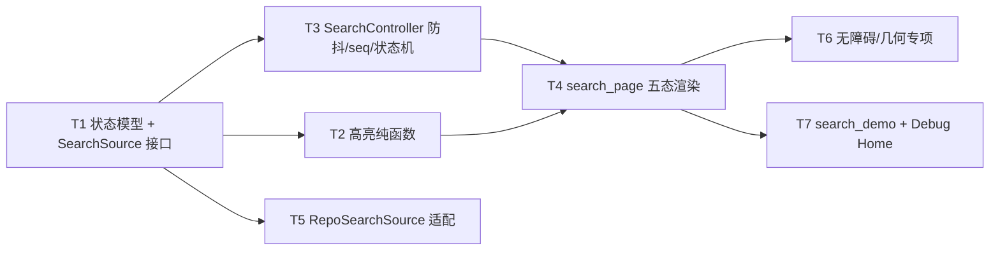

---
作者：@Ray
创建日期：2026-05-29
最后更新：2026-05-29
文档状态：草稿
---

# 任务列表：search-screen

## 任务依赖图
> 由各任务 inline「同 spec 依赖」字段汇总，以 inline 为准。



并行组：
- Group A：T1（地基）
- Group B：T2、T3、T5（均依赖 T1，可并行）
- Group C：T4（依赖 T2 + T3）
- Group D：T6、T7（依赖 T4，可并行）

（整屏一体、无可独立部署/演示的中间切点 → 不设里程碑。）

-----

- [ ] T1 · 状态模型 + SearchSource 接口（search_state.dart + search_source.dart 接口部分）

**同 spec 依赖：** 无 ｜ **跨 spec 依赖：** `ui-kit-components`：`EntrySearchHit` 渲染所需字段对齐 `DayzEntryCard` 入参（按其类型引用）；`data-layer`：`SearchFilters`/`EntrySearchHit` 字段与 `EntryRepo.searchEntries` 签名对齐（**待确认**，README 依赖列已登记） ｜ **关联需求：** R1, R8, NF2 ｜ **依据设计：** D1, D5, D6, D8 ｜ **可改文件：** `lib/ui/search/search_state.dart`、`lib/ui/search/search_source.dart` ｜ **验收基建：** `test/ui/search/fake_search_source.dart`

### 背景
全屏地基：定义状态机的数据形状与取数接口，下游 T2–T5 都引它。
归属：本任务只定义 `SearchSource` **接口** + `SearchUiState`/模型；`RepoSearchSource` **生产适配实现**归 T5（接 data-layer，可能未就绪）。`fake_search_source.dart` 是测试用假实现（受控返回命中/空/抛错），由本任务建以供下游测试复用。

### 实施
1. `search_state.dart`：`sealed class SearchUiState` 六变体（`idle{recent, tagSuggestions}` / `typing{query}` / `querying{query}` / `results{query, hits}` / `empty{query}` / `error{query, message}`）；`SearchFilters` 值对象（最小字段，随需扩展）；渲染模型 `EntrySearchHit`（id/标题/摘要/日期/封面或首图/tag/地点/心情，对齐 `DayzEntryCard` 入参）、`RecentSearch`、`TagSuggestion`。全部强类型（NF2，不用 Map/dynamic）。MPL-2.0 头注。
2. `search_source.dart`：`abstract interface class SearchSource { Future<List<EntrySearchHit>> search(String query, SearchFilters filters); List<RecentSearch> recent(); List<TagSuggestion> tags(); }`（生产实现归 T5）。MPL-2.0 头注。
3. `test/ui/search/fake_search_source.dart`：`FakeSearchSource implements SearchSource`，可配置命中列表 / 空 / 抛异常、可注入延迟（供 T3 测防抖与丢弃）。

### 验收标准（做完即止）
- `SearchUiState` 六变体均可构造，`switch` 穷尽（自动：测试对每变体构造并 switch 命中，编译期穷尽性即护栏）。
- 模型字段强类型、无 `Map`/`dynamic`（自动：构造各模型断言字段类型/取值）。
- `FakeSearchSource` 可受控返回命中 / 空 / 抛错（自动：分别配置后调 `search` 断言返回/抛出）。

### 验收方式
- 自动：
  ```bash
  flutter test test/ui/search/search_state_test.dart
  ```
  （构造六态与模型、断言字段与 switch 穷尽、断言 FakeSearchSource 三种受控行为；**不** grep 被改文件自身）

### 验收记录
```
日期：—
自动：—
人工：N/A
```

-----

- [ ] T2 · 命中词高亮纯函数（search_highlight.dart）

**同 spec 依赖：** T1 ｜ **跨 spec 依赖：** `design-tokens-theme`：`context.dayz.accentSoft2`/`accentInk`（命中 span 样式取值，按交付物名引用） ｜ **关联需求：** R3, NF4 ｜ **依据设计：** D4 ｜ **可改文件：** `lib/ui/search/search_highlight.dart` ｜ **验收基建：** `test/ui/search/search_highlight_test.dart`

### 背景
`buildHighlightedSpans(text, query, baseStyle, hitStyle)` 纯函数：把 `text` 按 `query` 子串（大小写归一）切成「非命中 / 命中」`InlineSpan` 列表，命中 span 用 `hitStyle`（调用方传入 `TextStyle(backgroundColor: accentSoft2, color: accentInk)`，样式取 token 在屏侧，函数本身只管切分与套样式）。纯函数无 BuildContext，易单测。

### 实施
1. 实现切分：定位 `query` 在 `text` 中所有出现处（不区分大小写、空 query 返回单个 baseStyle span），生成交替的非命中/命中 `TextSpan`。
2. 命中 span 套 `hitStyle`，非命中套 `baseStyle`；保持原文顺序与完整文本（拼回等于原文）。
3. 边界：空 query / 无命中 / 多处命中 / 命中在首尾 / 命中相邻。MPL-2.0 头注。

### 验收标准（做完即止）
- 拼接所有返回 span 的 text == 原文（无丢字/重复）（自动）。
- 命中子串的 span 用 `hitStyle`、其余用 `baseStyle`；空 query / 无命中 → 单个 baseStyle span（自动）。
- 多处命中 / 相邻命中 / 首尾命中均正确切分（自动）。

### 验收方式
- 自动：
  ```bash
  flutter test test/ui/search/search_highlight_test.dart
  ```
  （喂多组 (text, query)，断言返回 span 的 text 拼回原文 + 命中段套 hitStyle、非命中段套 baseStyle；样式对象由测试传入并断言被正确套用，断言行为而非源码字面）

### 验收记录
```
日期：—
自动：—
人工：N/A
```

-----

- [ ] T3 · SearchController（状态机 + 防抖 + seq 丢弃旧查询 + retry/筛选）

**同 spec 依赖：** T1 ｜ **跨 spec 依赖：** 无 ｜ **关联需求：** R1, R2, R4, R8, R5, NF2 ｜ **依据设计：** D1, D2, D5, D8 ｜ **可改文件：** `lib/ui/search/search_controller.dart` ｜ **验收基建：** `test/ui/search/fake_search_source.dart`（T1 已建，复用）

### 背景
`SearchController extends ChangeNotifier` 持 `SearchUiState state`，构造注入 `SearchSource`。实现：`onQueryChanged(text)`（防抖 → 切 typing→querying）、防抖窗口内只发最后一次查询、`_seq` 比对丢弃过期结果、按命中计数切 results/empty、捕获异常切 error、`retry()` 以同词重发、`pickSuggestion(term)` 回填触发查询、`removeFilter(f)` 改 filters 重查。空输入回 idle（取 recent/tags）。
归属：状态机转移与防抖/seq 逻辑全归本任务；UI 渲染归 T4。本任务**不** import `lib/data`/Drift（NF2，只依赖 `SearchSource` 接口）。

### 实施
1. 注入 `SearchSource`；`onQueryChanged`：空 → idle（`recent()`/`tags()`）；非空 → typing + 重置 `Timer _debounce`（窗口取常量，对齐手感，记常量值）。
2. 防抖到期：`_seq++` 记 `local = _seq` → 切 querying → `await source.search(...)` → 回调 `if (local != _seq) return;`（丢弃过期，R2）。
3. 结果回来：`hits.isEmpty` → empty(query)，否则 results(query, hits)（R4）。异常 → error(query, message)（R8）。
4. `retry()`：以当前 query 重走 querying（R8）；`pickSuggestion`/`removeFilter` 触发查询（R5/D8）。

### 验收标准（做完即止）
- 连续键入在防抖窗口内 → 只对最终词发一次 `source.search`（自动：用 `FakeSearchSource` 计数调用次数 + `tester`/`fakeAsync` 推进时间）。
- 旧查询迟到结果不覆盖新结果（自动：注入不同延迟，断言 final state.hits == 最后一次查询结果，R2）。
- count>0 → results 且 `hits` 数 == 返回数；count==0 → empty（自动，R4）。
- `source.search` 抛错 → state == error（带 message），`retry()` → 回 querying 并重发（自动，R8）。
- 空输入 → idle（自动，R5）。
- 控制器不引用 Drift / `lib/data`（自动：见 verification 静态核验；本任务内以"仅注入 SearchSource、无 data import"为实现约束）。

### 验收方式
- 自动：
  ```bash
  flutter test test/ui/search/search_controller_test.dart
  ```
  （注入 FakeSearchSource，用 `fakeAsync`/`tester.pump(Duration)` 推进防抖窗口与查询延迟，断言调用次数、最终 state 类型与 hits、error/retry 行为——断言可观测状态转移，不 grep 源码）

### 验收记录
```
日期：—
自动：—
人工：N/A
```

-----

- [ ] T4 · search_page 五态渲染（DayzSearchField + 取消 + 朴素 ListView + 高亮卡片）

**同 spec 依赖：** T2, T3 ｜ **跨 spec 依赖：** `ui-kit-components`：`DayzSearchField`/`DayzEntryCard`/`DayzTag`/`DayzEmptyState`/`dayzMotionDuration`、`AppStrings`（追加条目）；`ui-shell-navigation`：`Routes.reader`（点卡片导航）；`design-tokens-theme`：`context.dayz.*`/`DayzSpacing/Radii/Motion`、`intl`（计数/日期）。均 README 依赖列已登记 ｜ **关联需求：** R1, R3, R4, R5, R6, R7, R8, NF1, NF4 ｜ **依据设计：** D1, D3, D4, D7, D8, D9 ｜ **可改文件：** `lib/ui/search/search_page.dart`、`lib/ui/strings/app_strings.dart`（**追加**本屏文案条目，不新建——归属 ui-kit，见 D9）

### 背景
屏组合：顶部 `DayzSearchField`（受控接 `SearchController.onQueryChanged`）+ 「取消」`DayzButton`(text)；主体 `switch(controller.state)` 渲染六态——idle（最近搜索 `_SuggestRow` + 标签 `DayzTag` 列）、typing（保留 idle 或轻提示）、querying（loading 指示）、results（`.search-stat` 计数行 + 朴素 `ListView.builder` of `DayzEntryCard`，标题/摘要经 T2 高亮）、empty（`DayzEmptyState`，标题含查询词）、error（错误文案 + 重试钮接 `retry`）。点卡片 → `Routes.reader`（携 id，R7）；取消 → 出栈（R6）。文案全 `AppStrings`、计数/日期走 intl。
归属：渲染与导航接线归本任务；状态逻辑在 T3、高亮切分在 T2、几何/无障碍专项断言在 T6。`results` 列表用朴素 `ListView`，**不引入** `SliverPersistentHeader` 吸顶 / 日历（D3）。

### 实施
1. `search_page.dart`：`AnimatedBuilder`/`ListenableBuilder` 监听 `SearchController`，`switch(state)` 渲六态子树；视觉全走 token（`.search-input` 底/圆角、`.search-stat`、`.hl` 等以 spec.css 解析值标定，NF4）。MPL-2.0 头注。
2. results：固定计数行（`AppStrings` + `intl` 拼「找到 N 篇 · 按时间倒序」）+ `ListView.builder` → `DayzEntryCard`，标题/摘要用 `Text.rich(buildHighlightedSpans(...))`（命中样式取 `context.dayz.accentSoft2/accentInk`，R3/D4）。
3. empty：`DayzEmptyState`（标题「没有找到『{query}』」+ 引导文案，均 `AppStrings`/`intl`）。error：错误文案 + 「重试」`DayzButton` → `controller.retry()`。
4. 取消钮 → `context.pop()`/`Navigator.pop`（R6）；卡片 `onTap` → `Routes.reader`（R7）。
5. 向 `lib/ui/strings/app_strings.dart` **追加**本屏文案 `static const`（取消/最近搜索/标签/找到/篇·按时间倒序/没有找到/引导/重试/各 Semantics 标签）——若 ui-kit 未建该文件按 D9 ⚠️ 降级、停下协调，不抢建。
6. **无障碍渲染实现（NF1，供 T6 断言）**：取消钮/输入框/卡片/空态/重试钮挂 `Semantics` 标签（取 `AppStrings`）；取消钮、`_SuggestRow`、标签 chip、筛选去除叉 `.x`、卡片可点区命中盒 ≥44×44（必要时 `minimumSize`/`SizedBox`/`InkWell` 命中扩展）；输入光标闪烁与任何切态过渡时长经 `dayzMotionDuration(context, base)` 取（reduce-motion 下为 0），不在屏内自判 `disableAnimations`。

### 验收标准（做完即止）
- 各态渲染：idle 见最近搜索+标签分组；results 见计数行（N==卡片数）+ N 张 `DayzEntryCard`；empty 见 `DayzEmptyState` 且标题含查询词；error 见重试钮（自动，widget test 按 state 驱动 + `find.byType`/`find.text(AppStrings.xxx)`）。
- 命中词在卡片标题/摘要高亮：命中 `TextSpan` 背景 == `context.dayz.accentSoft2`、前景 == `context.dayz.accentInk`（自动，解析渲染后的 `Text.rich` span 样式，R3/NF4）。
- 点卡片 → 路由变 `Routes.reader`（自动：用测试路由断言 location，R7）；点取消 → 路由出栈（自动，R6）。
- 点重试 → controller 收到 `retry`、state 回 querying（自动，R8）。
- 屏内无裸中文：可见文案均经 `AppStrings`（自动：测试用 `find.text(AppStrings.xxx)` 命中，裸中文则 find 不到——自带"只引常量"护栏）。

### 验收方式
- 自动：
  ```bash
  flutter test test/ui/search/search_page_test.dart
  ```
  （注入 FakeSearchSource + 测试 `Routes`，pump 各态断言渲染/高亮 span 样式/导航/文案，断言可观测渲染与路由，不 grep）

### 禁止
- 不引入 `SliverPersistentHeader` 吸顶月份头 / 日历面板 / 游标分页（属 `timeline-screen`，D3 范围红线）。
- 不在屏内写 SQL/Drift、不 import `lib/data`（NF2）；不在屏内硬编码色值/字号/间距（NF4）。

### 验收记录
```
日期：—
自动：—
人工：N/A
```

-----

- [ ] T5 · RepoSearchSource 适配（接 EntryRepo/TagRepo · 唯一接触 Repository 处）

**同 spec 依赖：** T1 ｜ **跨 spec 依赖：** `data-layer`：`EntryRepo.searchEntries(query, filters, limit)` LIKE 子串入口 + `EntrySearchHit` 投影、（可选）`TagRepo.suggest()`（**待确认**——该方法当前不存在，须与 data-layer 协调签名/归属；README 依赖列已登记） ｜ **关联需求：** NF2, R4 ｜ **依据设计：** D5, D6 ｜ **可改文件：** `lib/ui/search/search_source.dart`（在 T1 接口基础上**追加** `RepoSearchSource` 实现）

### 背景
`SearchSource` 的**唯一生产实现** `RepoSearchSource`：构造注入 `EntryRepo`（及可选 `TagRepo`），`search()` 转调 `EntryRepo.searchEntries(...)` 并映射为 `EntrySearchHit`，`recent()`/`tags()` 接对应来源。**这是本屏唯一接触 Repository 的文件**——屏与控制器只依赖接口（NF2）。
⚠️ **强依赖待确认**：`EntryRepo.searchEntries` 当前在 data-layer **不存在**（其 D8 不暴露查询 API）。本任务**MUST NOT 实现该 Repo 方法**（属 data-layer 可改文件），只调用其约定签名。若 data-layer 未就绪：本任务**停下**，按执行协议升级请求 @Ray 协调 data-layer 新增该交付物，期间全屏经 `FakeSearchSource` 工作（T1/T3/T4/T6/T7 不被阻塞）。

### 实施
1. `RepoSearchSource implements SearchSource`：注入 `EntryRepo`（+ 可选 `TagRepo`）；`search` 调 `searchEntries(query, filters, limit)` → map 到 `EntrySearchHit`；`recent`/`tags` 接来源（未就绪返空列表）。MPL-2.0 头注。
2. **仅** import Repository 公开 API，**不** import Drift / `lib/data` 内部句柄（NF2）。
3. data-layer 该方法未就绪 → 停下升级（见背景），不自行写 LIKE/SQL 兜底（违反 NF2）。

### 验收标准（做完即止）
- `RepoSearchSource` 仅依赖 Repository 公开 API，无 Drift / `lib/data` import（自动：见 verification 静态核验闸）。
- 给定 `EntryRepo.searchEntries` 返回 → 正确映射为 `EntrySearchHit` 列表（自动：注入假/桩 `EntryRepo` 断言映射；若真 Repo 方法未就绪，以桩接口断言映射逻辑）。

### 验收方式
- 自动：
  ```bash
  flutter test test/ui/search/repo_search_source_test.dart
  ```
  （注入桩 `EntryRepo`（实现约定签名）断言 `search()` 的映射与转调；断言行为，不 grep）

### 禁止
- MUST NOT 实现 `EntryRepo.searchEntries`（属 data-layer）；MUST NOT 在本屏写 LIKE/FTS/SQL；MUST NOT import Drift / `lib/data` 内部。

### 验收记录
```
日期：—
自动：—
人工：N/A
```

-----

- [ ] T6 · 无障碍 / 布局几何专项

**同 spec 依赖：** T4 ｜ **跨 spec 依赖：** `design-tokens-theme`：对比度真源 `test/ui/theme/contrast_xfail.yaml`（沿用，不另立）；`ui-kit-components`：`dayzMotionDuration`（reduce-motion 门） ｜ **关联需求：** NF1, NF3 ｜ **依据设计：** D3, D4, D7 ｜ **可改文件：** `test/ui/search/search_a11y_test.dart`、`test/ui/search/search_geometry_test.dart`（均 `*_test.dart`，白名单 hook 自动放行；本任务只产无障碍/几何断言测试，不新增/不改 `lib/` 文件）

### 背景
专项验收：点击目标 ≥44、对比度 AA、Semantics 标签、reduce-motion 降级、几何（朴素列表卡片顺序/不溢出 + fixed-geometry 元素如取消钮/搜索框命中盒尺寸）。本任务**只写断言这些可观测属性的 widget test**——NF1/NF3 是 T4 渲染本就 MUST 满足的约束（已写进 T4 实施第 1–4 步与禁止段），本任务负责把它们做成独立可跑的专项断言。**若某断言红（如某命中盒 <44）→ 视为 T4 未达标的 bug，回 T4 在其可改文件内修，本任务不改 `lib/`**（避免跨任务越界改 T4 文件）。
归属：渲染本体与无障碍/几何属性的**实现**归 T4；本任务专司这些属性的**专项断言测试**。

### 实施
1. Semantics：取消钮（「取消」）/ 输入框（「搜索日记」）/ 结果卡片（含标题）/ 空态 / 重试钮均有 `Semantics` 标签（取 `AppStrings`，NF1）。
2. 命中盒 ≥44：取消钮、`_SuggestRow`、标签 chip、筛选去除叉 `.x`、卡片可点区 `tester.getSize` ≥44×44。
3. reduce-motion：`MediaQueryData(disableAnimations: true)` 下输入光标闪烁/切态过渡时长经 `dayzMotionDuration` 为 0（NF1）。
4. 几何：results 卡片纵向顺序 = hits 顺序、不溢出视口（content-driven 不硬断块高，D3/方法论 §4）；计数行在列表上方。

### 验收标准（做完即止）
- 取消/输入框/卡片/空态/重试钮均有 `Semantics` 标签，可 `find.bySemanticsLabel(AppStrings.xxx)` 命中（自动，NF1）。
- 取消钮 / 建议行 / 标签 chip / 去除叉 / 卡片可点区命中盒 ≥44×44（自动，`tester.getSize`，NF1）。
- `disableAnimations: true` 下动效时长 == 0（自动，注入 MediaQuery 断言，NF1）。
- 高亮文字（`accentInk` on `accentSoft2`）对比度核验沿用 tokens-theme `contrast_xfail.yaml`，无新阈值（自动，复用对比度断言，NF1）。
- results 卡片顺序 == hits 顺序、不溢出（自动，`tester.getRect` 断顺序/包含，D3）。

### 验收方式
- 自动：
  ```bash
  flutter test test/ui/search/search_a11y_test.dart test/ui/search/search_geometry_test.dart
  ```
  （断言 Semantics 标签 / 命中盒尺寸 / reduce-motion 时长 / 几何顺序与不溢出；对比度复用 tokens-theme 真源，不 grep）

### 验收记录
```
日期：—
自动：—
人工：N/A
```

-----

- [ ] T7 · search_demo + 挂 Debug Home

**同 spec 依赖：** T4 ｜ **跨 spec 依赖：** 无 ｜ **关联需求：** R9 ｜ **依据设计：** D1, D5 ｜ **可改文件：** `lib/demo/search_demo.dart`、`lib/demo/demo_entry.dart`

### 背景
Debug Home 入口：注入内存 `FakeSearchSource`（或 demo 专用假数据），在 demo 页可手动驱动/切换六态（idle/typing/querying/results/empty/error）走查。真 UI 外壳/真数据未就绪前，这是本屏真机被看见的入口。
归属：demo 与入口追加归本任务；`fake_search_source.dart` 已由 T1 建（测试目录），demo 可复用其思路或在 demo 内置假数据。

### 实施
1. `search_demo.dart`：构造 `SearchController(FakeSearchSource(...))` + `search_page`，提供切换六态的调试控件（或预置假数据触发各态）。MPL-2.0 头注。
2. `demo_entry.dart` 的 `demos` 列表**末尾追加一行**（不插中间、不改 `DemoEntry` 字段）。

### 禁止
- 不改 `DemoEntry` 字段定义；不在 `demos` 中间插入；不动既有 demo。

### 验收标准（做完即止）
- `demos` 末尾新增项指向 `search_demo`，Debug Home 可进入（自动，widget test：构建 demo 列表 `find` 到该项并 pump 进入）。
- demo 内可触达六态各一次（自动，widget test 驱动断言每态渲染出现）。

### 验收方式
- 自动：
  ```bash
  flutter test test/demo/search_demo_test.dart
  ```
  （pump demo、断言可进入且六态可触达；并跑 `test/demo/debug_home_test.dart` 回归确保既有 demo 未破，归 verification 回归）

### 验收记录
```
日期：—
自动：—
人工：N/A
```
</content>
