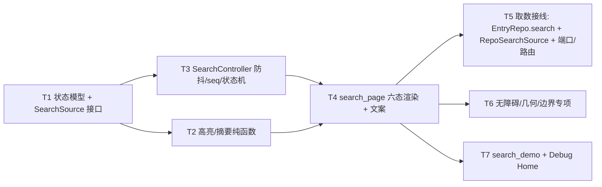

---
作者：@Ray
创建日期：2026-05-29
最后更新：2026-10-10
文档状态：定稿
---

# 任务列表：search-screen

## 任务依赖图
> 由各任务 inline「同 spec 依赖」字段汇总，以 inline 为准。


```mermaid
graph LR
  T1[T1 状态模型 + SearchSource 接口] --> T2[T2 高亮/摘要纯函数]
  T1 --> T3[T3 SearchController 防抖/seq/状态机]
  T3 --> T4[T4 search_page 六态渲染 + 文案]
  T2 --> T4
  T4 --> T5[T5 取数接线: EntryRepo.search + RepoSearchSource + 端口/路由]
  T4 --> T6[T6 无障碍/几何/边界专项]
  T4 --> T7[T7 search_demo + Debug Home]
```

并行组：
- Group A：T1（地基）
- Group B：T2、T3（均依赖 T1，可并行）
- Group C：T4（依赖 T2 + T3）
- Group D：T5、T6、T7（依赖 T4，可并行）

（整屏一体、无可独立部署/演示的中间切点 → 不设里程碑。）

-----

- [x] T1 · 状态模型 + SearchSource 接口（search_state.dart + search_source.dart 接口部分）

**同 spec 依赖：** 无 ｜ **跨 spec 依赖：** 无 ｜ **关联需求：** R1, R5, R8, NF2 ｜ **依据设计：** D1, D5, D8 ｜ **可改文件：** `lib/ui/search/search_state.dart`、`lib/ui/search/search_source.dart` ｜ **验收基建：** `test/ui/search/fake_search_source.dart`

### 背景
全屏地基：定义状态机的数据形状与取数接口，下游 T2–T7 都引它。
归属：本任务只定义 `SearchSource` **接口** + `SearchUiState`/模型；`RepoSearchSource` 生产适配与端口注册归 T5。`fake_search_source.dart` 是测试用假实现（受控返回命中/空/抛错/延迟），由本任务建以供下游测试复用。

### 实施
1. `search_state.dart`：`sealed class SearchUiState` 六变体（`SearchIdle` / `SearchTyping{query}` / `SearchQuerying{query}` / `SearchResults{query, hits}` / `SearchEmpty{query}` / `SearchError{query, message}`）；`SearchFilters`（`journal: SearchJournalFilter?`、`year: int?`、`isEmpty`、`without(SearchFilterKind)`、值相等）；渲染模型 `EntrySearchHit`（id / title / excerpt / date / place? / tags）、`RecentSearch`（term / count?）、`TagSuggestion`（id / name）。全部强类型（不用 Map/dynamic）、不可变。MPL-2.0 头注。
2. `search_source.dart`：`abstract interface class SearchSource { Future<List<EntrySearchHit>> search(String query, SearchFilters filters); Future<List<RecentSearch>> recent(); Future<List<TagSuggestion>> tags(); Stream<void> changes(); }`。MPL-2.0 头注。
3. `test/ui/search/fake_search_source.dart`：`FakeSearchSource implements SearchSource`，可按查询词配置命中 / 空 / 抛异常、可注入每次查询的延迟、记录调用（词 + 筛选）、可手动发 `changes` 事件。

### 验收标准（做完即止）
- `SearchUiState` 六变体均可构造，`switch` 穷尽（自动：测试对每变体构造并 switch 命中，编译期穷尽性即护栏）。
- `SearchFilters.without` / `isEmpty` / 值相等行为正确；模型字段强类型（自动）。
- `FakeSearchSource` 可受控返回命中 / 空 / 抛错，并记录调用（自动）。

### 验收方式
- 自动：
  ```bash
  flutter test --no-pub test/ui/search/search_state_test.dart
  ```
  （构造六态与模型、断言 switch 穷尽与 `SearchFilters` 行为、断言 FakeSearchSource 三种受控行为与调用记录；不 grep 被改文件）

### 验收记录
```
日期：2026-10-10
自动：`flutter test --no-pub test/ui/search/search_state_test.dart` 通过（5 tests：六态构造 + 穷尽 switch 描述、results hits 不可变、SearchFilters isEmpty/without/值相等、模型字段与 tags 不可变、FakeSearchSource 命中/空/抛错 + 调用记录 + recent/tags + changes 事件）。`flutter analyze --no-pub lib/ui/search test/ui/search` 无问题。
人工：N/A
```

-----

- [x] T2 · 命中词高亮 / 摘要截取纯函数（search_highlight.dart）

**同 spec 依赖：** T1 ｜ **跨 spec 依赖：** 无 ｜ **关联需求：** R3, NF4 ｜ **依据设计：** D4 ｜ **可改文件：** `lib/ui/search/search_highlight.dart`

### 背景
`buildHighlightedSpans(text, query, baseStyle, hitStyle)`：把 `text` 按 `query` 子串（大小写归一）切成「非命中 / 命中」`TextSpan` 列表；`snippetAround(text, query, {lead = 16})`：命中首现超过 `lead` 字时从命中前 `lead` 字截起并加 `…` 前缀。样式取 token 在屏侧（T4），函数只管切分与套样式。

### 实施
1. 切分：定位 `query` 在 `text` 中所有非重叠出现处（不区分大小写；空 / 纯空白 query 返回单个 baseStyle span），生成交替 `TextSpan`；拼回等于原文。
2. 边界：无命中 / 多处命中 / 首尾命中 / 相邻命中 / 大小写混合。
3. `snippetAround`：无命中或命中在 `lead` 内 → 原文；否则 `'…' + text.substring(hit - lead)`。MPL-2.0 头注。

### 验收标准（做完即止）
- 拼接返回 span 的 text == 原文（自动）。
- 命中段套 `hitStyle`、其余套 `baseStyle`；空 query / 无命中 → 单个 baseStyle span（自动）。
- 多处 / 相邻 / 首尾 / 大小写混合命中均正确切分（自动）。
- `snippetAround` 远处命中被截到前缀 `…` 且仍含命中词，近处命中原样返回（自动）。

### 验收方式
- 自动：
  ```bash
  flutter test --no-pub test/ui/search/search_highlight_test.dart
  ```
  （喂多组 (text, query)，断言 span 拼回原文 + 命中段/非命中段样式对象；断言截取结果；不 grep）

### 验收记录
```
日期：2026-10-10
自动：`flutter test --no-pub test/ui/search/search_highlight_test.dart` 通过（11 tests：空/空白 query 与无命中 → 单 base span；设计稿样例尾部命中；多处命中拼回原文且段序正确；相邻 + 首部命中；拉丁大小写不敏感且保留原大小写；query 先 trim；snippetAround 近处原样 / 远处截到命中前 lead 字加 `…` 且含命中 / 无命中原样 / 大小写不敏感）。`flutter analyze --no-pub lib/ui/search test/ui/search` 无问题。
说明：小写后长度会变的字符（如 `İ`）退回大小写敏感匹配，保证切分下标对齐。
人工：N/A
```

-----

- [x] T3 · SearchController（状态机 + 防抖 + seq 丢弃旧查询 + retry/筛选/回刷）

**同 spec 依赖：** T1 ｜ **跨 spec 依赖：** 无 ｜ **关联需求：** R1, R2, R4, R5, R8, R10, NF2 ｜ **依据设计：** D1, D2, D8, D10 ｜ **可改文件：** `lib/ui/search/search_controller.dart` ｜ **验收基建：** `test/ui/search/fake_search_source.dart`（T1 已建，复用）

### 背景
`SearchController extends ChangeNotifier` 构造注入 `SearchSource`（+ 初始筛选）。实现 D1/D2 的全部转移；本任务**不** import `lib/data`/Drift（只依赖 `SearchSource` 接口）。UI 渲染归 T4。

### 实施
1. `start()`：拉 `recent()` / `tags()` 存入 `recent` / `tags` 并通知（失败按空列表降级）。
2. `onQueryChanged(text)`：trim 空 → 取消计时器、`_seq++`、回 idle；非空 → typing + 重置 `Timer(searchDebounce)`。
3. 发查询：`_seq++` 记 `local` → querying → `await source.search(query, filters)` → `if (local != _seq || disposed) return;` → 空 → empty，否则 results；异常 → error（message 取异常类型名，不外露原文）。
4. `submit(text)` / `pickSuggestion(term)` / `retry()` / `removeFilter(kind)`：跳过防抖立即查（`removeFilter` 在无当前词时只更新筛选）。
5. `refresh()`：仅 results / empty 态以当前词静默重查（不经 querying），过期同样丢弃；`dispose` 取消计时器。

### 验收标准（做完即止）
- 连续键入在防抖窗口内 → 只对最终词发一次 `source.search`（自动：`fakeAsync` 推进 + 调用计数）。
- 旧查询迟到结果不覆盖新结果（自动：注入不同延迟，断言最终 state 为最后一次查询结果，R2）。
- count>0 → results 且 `hits` 数 == 返回数；count==0 → empty（自动，R4）。
- `search` 抛错 → error；`retry()` → querying 并以同词重发（自动，R8）。
- 空输入 → idle 且在途查询结果被作废；`start()` 后 `recent`/`tags` 有值（自动，R5）。
- `pickSuggestion` / `removeFilter` 立即以新词 / 新筛选查询（自动，R5/D8）。
- `refresh()` 在 results 态以当前词重查且不经 querying；idle 态无副作用（自动，R10）。

### 验收方式
- 自动：
  ```bash
  flutter test --no-pub test/ui/search/search_controller_test.dart
  ```
  （注入 FakeSearchSource，用 `fakeAsync` 推进防抖窗口与查询延迟，断言调用次数、状态序列、hits、error/retry/refresh 行为；不 grep）

### 验收记录
```
日期：2026-10-10
自动：`flutter test --no-pub test/ui/search/search_controller_test.dart` 通过（11 tests：防抖窗口内连键只对「梅子酱」发一次、状态序列 typing→querying→results；旧查询延迟 2s 迟到不覆盖新结果；count>0 → results 全量 hits、0 → empty；抛错 → SearchError(message=StateError)、retry 同词重发 querying→results；清空输入 → idle 且在途结果作废；start() 拉 recent/tags；pickSuggestion 跳过防抖；removeFilter 以收窄筛选重查 / 无词时只改筛选；refresh 在 results 静默重查不经 querying、idle 无副作用、结果变空 → empty；dispose 取消挂起防抖）。`flutter analyze --no-pub lib/ui/search test/ui/search` 无问题。
说明：类名避开 Material 同名 `SearchController`，落为 `SearchScreenController`（文件名不变）；防抖窗口常量 `searchDebounce = 300ms`；成功查询后重拉一次 recent（适配层会把本次词记入最近搜索）。
人工：N/A
```

-----

- [ ] T4 · search_page 六态渲染（DayzSearchField + 取消 + 朴素 ListView + 高亮卡片 + 文案）

**同 spec 依赖：** T2, T3 ｜ **跨 spec 依赖：** `ui-kit-components`：`DayzSearchField`/`DayzTag`/`DayzEmptyState`/`DayzButton`/`DayzIcon`/`dayzMotionDuration`；`ui-shell-navigation`：`Routes.reader`、`Routes.timeline`；`design-tokens-theme`：`context.dayz.*`/`DayzSpacing/Radii/Motion`、`intl` ｜ **关联需求：** R1, R3, R4, R5, R6, R7, R8, R10, NF1, NF4 ｜ **依据设计：** D1, D3, D4, D7, D8, D9, D10 ｜ **可改文件：** `lib/ui/search/search_page.dart`、`lib/l10n/arb/app_zh.arb`、`lib/l10n/arb/app_en.arb`、`lib/l10n/gen/app_localizations.dart`、`lib/l10n/gen/app_localizations_zh.dart`、`lib/l10n/gen/app_localizations_en.dart`

### 背景
`SearchPage`（宿主，D10）：持 `SearchController` + `TextEditingController` + `FocusNode`，`initState` 调 `start()`、有 `initialQuery` 则回填并 `submit`，订阅 `source.changes()` → `refresh()`。主体经 `AnimatedSwitcher(duration: dayzMotionDuration(context))` 按 `switch(state)` 渲染：idle/typing（最近搜索 `_SuggestRow` + 标签 `DayzTag`）、querying（静态「正在搜索…」）、results（筛选区? + `.search-stat` + `ListView.builder` of `_SearchHitCard`，标题/摘要经 T2 高亮）、empty（筛选区? + `DayzEmptyState`）、error（`DayzEmptyState` + 「重试」`DayzButton`）。点卡片 → `Routes.reader`（携 id，可由 `onOpenEntry` 覆盖）；取消 → 可出栈则 pop，否则 `onBack` / 回时间线。
归属：渲染、导航与宿主生命周期归本任务；状态逻辑在 T3、高亮切分在 T2、几何/无障碍专项断言在 T6、路由 builder 接线在 T5。

### 实施
1. `search_page.dart`：上述宿主与六态子树；视觉全走 token，设计稿字面量旁注 CSS 选择器（NF4）。MPL-2.0 头注。
2. results：`.search-stat` 用 `l10n.searchResultStat(n)`，在格式化文案中定位计数数字套 `ink2`/600；卡片 `_SearchHitCard` 照 D3 几何，标题 `Text.rich(buildHighlightedSpans(title…))`、摘要 `Text.rich(buildHighlightedSpans(snippetAround(excerpt…)…))`，命中样式 `accentSoft2`/`accentInk`。
3. empty / error / 筛选区 / 建议区按 D7/D8；年份筛选 chip 文案 `DateFormat.y`。
4. ARB 补 D9 列出的 key（两份一致）并跑 `flutter gen-l10n`；不得新增屏内 strings 类。
5. 无障碍渲染实现（NF1，供 T6 断言）：输入框外包 `Semantics(label: searchInputLabel)`；卡片 `Semantics(button, label: searchOpenEntry(title), onTap)`；去除叉 `Semantics` 由 `DayzTag.removeSemanticLabel = searchRemoveFilter(label)`；建议行 / 标签 chip / 卡片命中盒 ≥44。

### 验收标准（做完即止）
- 各态渲染：idle 见最近搜索 + 标签分组；typing 保留建议；querying 见「正在搜索…」；results 见计数行（N == 卡片数）+ N 张结果卡片；empty 见 `DayzEmptyState` 且标题含查询词；error 见重试钮（自动）。
- 命中词在卡片标题/摘要高亮：命中 `TextSpan` 背景 == `accentSoft2`、前景 == `accentInk`（自动，解析渲染后的 `RichText` span 样式，R3/NF4）。
- `.search-stat` 文本色 == `ink3`、计数段 == `ink2`/600（自动，NF4）。
- 点卡片 → 测试 GoRouter 推到 `Routes.reader` 且 extra == entryId（自动，R7）；点取消 → 出栈回来源页（自动，R6）。
- 点重试 → 以同词重发、成功后切 results（自动，R8）；点建议行 / 标签 chip → 回填输入框并查询（自动，R5）；点筛选叉 → 以新筛选重查（自动，D8）。
- `initialQuery` 非空 → 首帧回填并直接查询；`changes` 事件 → 静默重查（自动，R10）。
- 可见文案均经 `AppLocalizations`（自动：`find.text(l10n.xxx)` 命中）。

### 验收方式
- 自动：
  ```bash
  flutter test --no-pub test/ui/search/search_page_test.dart
  ```
  （注入 FakeSearchSource + 测试 GoRouter，pump 各态断言渲染 / 高亮 span 样式 / 导航 / 文案；不 grep）

### 禁止
- 不引入 `SliverPersistentHeader` 吸顶月份头 / 日历面板 / 游标分页（D3 范围红线）。
- 不在屏内写 SQL/Drift、不 import `lib/data`（NF2）；不在屏内硬编码色值（NF4）。

### 验收记录
```
日期：—
自动：—
人工：N/A
```

-----

- [ ] T5 · 取数接线：EntryRepo.search + RepoSearchSource + 端口注册 + 路由 builder

**同 spec 依赖：** T1, T4 ｜ **跨 spec 依赖：** `data-layer`：`EntryRepo`（本任务新增 `search`）/ `watchChanges`、`TagRepo.list`；`ui-shell-navigation`：`app_router.dart` 的 `Routes.search` builder、`PlaceholderScreen` ｜ **关联需求：** R4, R5, R10, NF2 ｜ **依据设计：** D5, D6, D10 ｜ **可改文件：** `lib/data/repositories/entry_repo.dart`、`lib/ui/search/search_source.dart`、`lib/app/router_ports.dart`、`lib/ui/shell/app_router.dart`

### 背景
生产取数全链路：`EntryRepo.search`（D6，仅新增查询方法）→ `RepoSearchSource`（D5，唯一接触 Repository 处，映射 `Entry` → `EntrySearchHit`、会话级最近搜索、`TagRepo.list` 建议、`watchChanges` 变更流）→ 端口 `searchSourcePort` / `registerSearchSource`（D10）→ `bindRouterPorts` 注册 → `Routes.search` builder 读端口渲染 `SearchPage`。

### 实施
1. `entry_repo.dart` 新增 `search(query, {journalId, year, limit = 100})`：trim 空 → `[]`；转义 `\ % _` 后 `contentPlain.like('%…%', escapeChar: r'\')` + `deletedAt.isNull()` + 可选 journal/year；`entryDtUtc DESC, id DESC`；`limit < 1` 抛 `ArgumentError`。不改其它方法与 schema。
2. `search_source.dart` 追加 `RepoSearchSource` + 端口两函数（只 import Repository 公开 API，不 import Drift）。
3. `router_ports.dart`：bind 补一行注册、unbind 补一行清空，连带 import。
4. `app_router.dart`：只改 `Routes.search` builder（端口未注册保持占位；`extra is String` 作初始词），连带 import。

### 验收标准（做完即止）
- `EntryRepo.search`：子串命中（中文 / 英文大小写不敏感）、`%`/`_` 按字面匹配、排除软删、journal/year 过滤、倒序、limit 截断、空词返回空（自动，内存库）。
- `RepoSearchSource`：映射标题/摘要/日期/地点正确，筛选透传，最近搜索去重置顶且最多 5 条，无 `TagRepo` 时 `tags()` 为空、有则返回现有标签，`changes()` 随条目写入发事件（自动，内存库）。
- 路由：未注册端口 → `Routes.search` 为占位屏；`bindRouterPorts` 后推 `Routes.search`（extra '梅子'）→ 真实搜索屏直接出 results（卡片来自内存库）；软删一条后列表自动少一张；`unbindRouterPorts` 后端口清空（自动，R10）。

### 验收方式
- 自动：
  ```bash
  flutter test --no-pub test/data/entry_repo_search_test.dart test/ui/search/repo_search_source_test.dart test/ui/search/search_route_test.dart
  ```
  （内存库造数断言查询结果与映射；真路由 pump 断言占位 / 真实屏 / 回刷；不 grep）

### 禁止
- MUST NOT 改 schema、动 `entries_fts`、改 `EntryRepo` 既有方法；MUST NOT 在屏/控制器写 LIKE/SQL；`app_router.dart` 只动 `Routes.search` 一行 builder。

### 验收记录
```
日期：—
自动：—
人工：N/A
```

-----

- [ ] T6 · 无障碍 / 布局几何 / Repository 边界专项

**同 spec 依赖：** T4 ｜ **跨 spec 依赖：** `design-tokens-theme`：对比度真源 `test/ui/theme/contrast_xfail.yaml` 与 `test/ui/theme/contrast_test.dart` 的计算函数（只读复用）；`ui-kit-components`：`dayzMotionDuration` ｜ **关联需求：** NF1, NF2, NF3 ｜ **依据设计：** D3, D4, D5, D7 ｜ **可改文件：** `test/ui/search/search_a11y_test.dart`、`test/ui/search/search_geometry_test.dart`、`test/ui/search/search_boundary_test.dart`（均 `*_test.dart`，白名单 hook 自动放行；本任务只产断言测试，不改 `lib/`）

### 背景
专项验收：Semantics 标签、命中盒 ≥44、reduce-motion、高亮对比度、几何（顺序 / 不溢出 / 计数行在列表上方 / 无吸顶）、Repository 边界（import 关系）。**若某断言红（如某命中盒 <44）→ 视为 T4 未达标，回 T4 在其可改文件内修**，本任务不改 `lib/`。

### 实施
1. Semantics：取消钮 / 输入框 / 结果卡片 / 空态 / 重试钮 `find.bySemanticsLabel(l10n.xxx)` 命中。
2. 命中盒：取消钮、建议行、标签 chip、筛选去除叉、卡片 `tester.getSize` ≥ 44×44。
3. reduce-motion：`disableAnimations: true` 下切态 `AnimatedSwitcher.duration == Duration.zero`，常态 == `DayzMotion.dur`。
4. 对比度：六套主题 `accentInk` on `accentSoft2` ≥ 4.5，除非已登记在 `contrast_xfail.yaml`（复用其解析与计算函数，不另立阈值）。
5. 几何：计数行在首张卡片上方、卡片纵向顺序 == hits 顺序、卡片不越出视口宽度；`SliverPersistentHeader` 0 命中。
6. 边界：解析 `lib/ui/search/` 各文件的 import 指令——`search_page/controller/state/highlight` 不得 import `package:drift` 或 `package:dayz/data/`；`search_source.dart` 只可 import `package:dayz/data/repositories/`，不得 import Drift / `database.dart`。

### 验收标准（做完即止）
- 上述 Semantics / 命中盒 / reduce-motion / 对比度 / 几何 / 边界断言全部通过（自动，NF1/NF2/D3）。

### 验收方式
- 自动：
  ```bash
  flutter test --no-pub test/ui/search/search_a11y_test.dart test/ui/search/search_geometry_test.dart test/ui/search/search_boundary_test.dart
  ```
  （断言 Semantics / 尺寸 / 时长 / 对比度 / 几何顺序；边界测试断言 import 依赖关系这一结构，不断言业务文本）
  （NF3 真机兼容走查是跨任务的人工项，归 verification「兼容性」，不在本卡）

### 验收记录
```
日期：—
自动：—
人工：N/A
```

-----

- [ ] T7 · search_demo + 挂 Debug Home

**同 spec 依赖：** T4 ｜ **跨 spec 依赖：** 无 ｜ **关联需求：** R9 ｜ **依据设计：** D1, D5 ｜ **可改文件：** `lib/demo/search_demo.dart`、`lib/demo/demo_entry.dart`

### 背景
Debug Home 入口：demo 内置内存假 `SearchSource`（不能 import `test/`），按模式切换「命中 / 无结果 / 出错 / 慢查询」并重建 `SearchPage`，可走查六态；带一个预置筛选以展示筛选区。

### 实施
1. `search_demo.dart`：内存假源 + 模式切换控件 + `SearchPage(onOpenEntry: demo toast/snack)`。MPL-2.0 头注。
2. `demo_entry.dart` 的 `demos` 列表**末尾追加一行**。

### 禁止
- 不改 `DemoEntry` 字段定义；不在 `demos` 中间插入；不动既有 demo。

### 验收标准（做完即止）
- `demos` 末项指向搜索 demo，Debug Home 可进入（自动）。
- demo 内可触达 idle / typing / querying / results / empty / error 各一次（自动）。

### 验收方式
- 自动：
  ```bash
  flutter test --no-pub test/demo/search_demo_test.dart test/demo/debug_home_test.dart
  ```
  （pump demo、断言可进入且六态可触达；debug_home 回归确保既有 demo 未破）
- 人工：
  - 真机经 Debug Home 进入搜索 demo 走查六态（核查人 @Ray）

### 验收记录
```
日期：—
自动：—
人工：N/A
```
