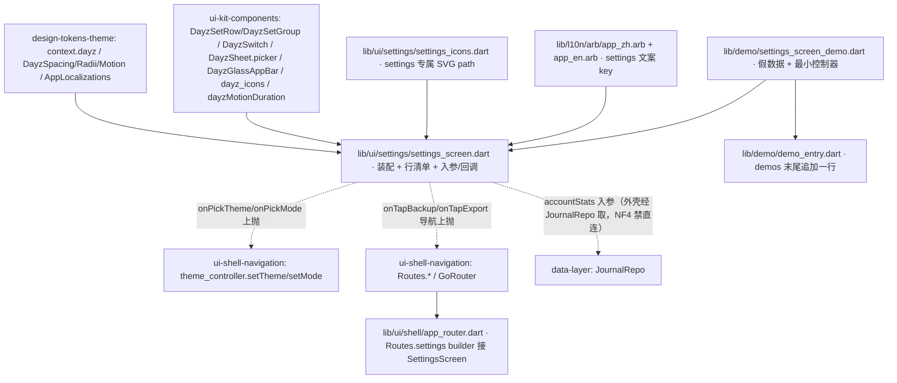

---
作者：@Ray
创建日期：2026-05-29
最后更新：2026-05-31
文档状态：定稿
---

# 设计：settings-screen

> 视觉与映射依据：[`docs/design/10-ui-restore-and-design-sync.md`](../../../docs/design/10-ui-restore-and-design-sync.md) §1（分层）/§3（跨屏外壳复用 + 媒体红线）/§4（四闸）/§9（W2 页面级）/§10（动 lib/ui 红线）/§11（验收口径）；屏源 [`ui-design/current/pages/screens/settings.html`](../../../ui-design/current/pages/screens/settings.html)；组件类名与最小 HTML 真源 [`ui-design/current/docs/DESIGN-REF.md`](../../../ui-design/current/docs/DESIGN-REF.md) §3b（`.set-*`）/§3c（`.set-row.tappable`）/§3（`.switch` / `.sheet`）/§5（图标）；HTML→Flutter 机制映射 [`ui-design/current/docs/PROTOTYPE-ARCH.md`](../../../ui-design/current/docs/PROTOTYPE-ARCH.md) §6（`showModalBottomSheet` 单选 / `settheme/setmode` → ThemeData / `SafeArea`）。token/组件/路由/换肤约定来自 `design-tokens-theme`、`ui-kit-components`、`ui-shell-navigation`，本 spec 复用其词汇、不另造同义物。

## 技术决策

### D1 · 设置屏组装：纯组合 ui-kit 组件，不新造列表件
- **状态：** 采纳
- **背景：** DESIGN-REF §3b 的 `.set-*` 列表件（`.set-account` 头卡 + `.set-group`/`.lab` + `.set-row`：`.ic` 图标徽 + `.tx` 主/次 + 右侧 `.switch`/`.val`/`.chev`）与 §3c 的 `.set-row.tappable` 已由 `ui-kit-components` 实现为 `DayzSetRow`（见其 `## 文件变更` 的 `dayz_set_row.dart`，含 `.set-row`/`.set-group`/`.lab`/账户头卡）。本屏是把它们按 settings.html 结构串起来。
- **选项：** (A) 本 spec 新造一套列表行/分组 widget；(B) 直接组合 `ui-kit-components` 的 `DayzSetRow`/`DayzSetGroup` + `DayzSwitch` + `DayzSheet` + `DayzGlassAppBar`，本屏只写「装配 + 数据/回调绑定 + 屏级文案」；(C) 用 `CupertinoListSection.insetGrouped` 自带分组。
- **选择：** B。`settings_screen.dart` 只负责：按 settings.html 顺序排账户头卡 + 四个 `DayzSetGroup`，每行喂 `DayzSetRow`（图标徽 SVG path + 主/次文案 `AppLocalizations` + 尾随件），尾随件按行类型选 `DayzSwitch`（App 锁 / 草稿恢复）、只读 `Text`（已加密）、`.val`+chev（主题色 / 外观模式 / 备份 / 导出）。**不**用 Cupertino 分组件（范围外，C 的视觉/分隔/内边距与设计稿 `.set-group` 不一致，且会绕过 token）。
- **理由：** 守方法论 §1「组件层落一次、屏只组合」与 §3「跨屏外壳/复用件不在屏里重写一份」；本屏复杂度全在装配，零新组件。
- **代价：** 强依赖 `ui-kit-components` 的 `DayzSetRow` API 已就绪；未就绪时降级见已知风险（READY 门按 README 依赖管控）。

### D2 · 设置项数据模型：屏内声明式行清单 + 入参/回调注入
- **状态：** 采纳
- **背景：** 设置行有四类尾随件（switch / 只读 val / val+chev / 不可交互），且部分行的状态（账户统计、当前主题色名、当前外观模式、开关初值）来自外部、动作是回调上抬（R6）。
- **选项：** (A) 每行硬写一段 `DayzSetRow(...)`，状态散在 build 里；(B) 定义一个屏内 `_SettingsRowSpec`（不可变值类：行类型 + 图标 path + 主/次文案 key + 尾随件类型 + 可选 onTap/onChanged），build 时 map 成 `DayzSetRow`；(C) 把行清单做成可配置数据源放到外部。
- **选择：** B。`settings_screen.dart` 内私有声明式清单（图标 path 引 `dayz_icons.dart`/本屏图标常量，文案引 `AppLocalizations`，状态/回调由 `SettingsScreen` 的构造入参注入：`accountStats`、`currentThemeName`、`currentMode`、`appLockEnabled`/`onAppLockChanged`、`draftRecoveryEnabled`/`onDraftRecoveryChanged`、`onTapBackup`/`onTapExport`、`onPickTheme`/`onPickMode`）。**数据库加密行**在清单里标记为不可交互（无 onTap/onChanged，尾随 = 只读「已加密」）。
- **理由：** 声明式清单让「行结构 == 设计稿」一目了然、widget test 易逐行断言；入参/回调注入让本屏可用假数据独立 pump（NF4：本屏不持 Repo，统计与偏好由外壳经 Repo/控制器喂入）。
- **代价：** 多一个屏内值类；但换来可测性与「结构对齐设计稿」的清晰，值。

### D3 · 主题色 / 外观模式选择器：DayzSheet.picker + 回调上抬给外壳换肤
- **状态：** 采纳
- **背景：** settings.html 的「主题色」「外观模式」行是 `.set-row.tappable`（`data-theme-picker` / `data-mode-picker`），点击在原型里由 `screen.js` 打开 `DZ.sheet` 单选选择器，选中发 `postMessage({type:'settheme'/'setmode'})` 给外壳换肤（PROTOTYPE-ARCH §4/§6）。Flutter 侧外壳换肤入口 = `ui-shell-navigation` 的 `theme_controller.setTheme/setMode`（其 D6）。
- **选项：** (A) 本屏直接改 `ThemeData`/直接持 `theme_controller` 单例并调用；(B) 本屏只暴露 `onPickTheme(themeName)` / `onPickMode(ThemeMode)` 回调，由外壳（demo/真外壳）接到 `theme_controller`；(C) 自绘选择器面板。
- **选择：** B + `DayzSheet.picker`（`ui-kit-components` D4 的命名工厂）。点「主题色」行 → `DayzSheet.picker` 列三套主题（带 `swatch` 色点、命中项打勾）→ 选中调本屏入参 `onPickTheme(themeName)`；点「外观模式」行 → picker 列 跟随系统/浅色/深色 → `onPickMode(ThemeMode)`。**本屏不持 `theme_controller`**（避免页面级 spec 与外壳耦合死、利于独立测试）；接到 `theme_controller.setTheme/setMode` 的接线在 demo 与真外壳一侧。
- **理由：** 与原型「屏内只喊、外壳换肤」（`settheme/setmode` 上抛）一一对应；回调注入让选择器交互在 widget test 里可独立验证（断言 picker 出现 + 选中触发回调 + 传值正确），不依赖真 `theme_controller` 就绪。
- **代价：** 换肤的「即时全树 rebuild」效果须在 demo/真外壳接线后才可见；本屏 widget test 只验「回调被调用 + 传值」，端到端换肤效果在 verification 经 demo 接 `theme_controller` 验。可接受（分层必然）。

### D4 · 图标徽：复用 ui-kit 的 flutter_svg 单色图标 + 屏内补缺 path
- **状态：** 采纳
- **背景：** DESIGN-REF §5 图标统一内联 SVG（`viewBox 0 0 24 24`、`fill=none`、`stroke=currentColor`、`stroke-width 2`、round cap/join、单色随父级文字色）；settings.html 各行图标徽是这类单色线性图标（锁/盾勾/备份云/导出/主题圆/外观日/文件）。`ui-kit-components` 已交付 `dayz_icons.dart`（§5 规范 path 常量集）+ `flutter_svg` 渲染路径。
- **选项：** (A) 本屏自己内联 SVG 字符串；(B) 优先引 `dayz_icons.dart` 已有 path；本屏特有、`dayz_icons.dart` 未收的 settings 图标 path，集中到本屏 `settings_icons.dart` 常量文件（仍走 `flutter_svg` + `colorFilter` currentColor）。
- **选择：** B。能复用 `dayz_icons.dart` 的复用；settings 专属图标（如「数据库加密」盾+勾、「本地备份」云、「导出」上箭头）落 `lib/ui/settings/settings_icons.dart` 的 `static const` path 常量，**不**散写在 build 里、**不**硬编码颜色（`colorFilter` 取 `context.dayz` 文字色，与 §5「单色继承父级文字色」一致）。
- **理由：** 守 §5「能用 SVG 就用 SVG、单色继承、不写死颜色」；集中 path 常量便于样式参数闸断言与日后 design-sync 比对。
- **代价：** 多一个屏内图标常量文件；但 settings 专属图标不宜污染跨端 `dayz_icons.dart`（§3c「一次性屏内件不回流设计系统」同理），归本屏更合适。

### D5 · 媒体红线文案的落点（R5）
- **状态：** 采纳
- **背景：** R5 要「主密码锁不住照片」显形，但 settings.html 当前没有独立的「主密码」行（最简范围下主密码切换 UI 归 key-management 页面级 spec）。须为这条文案选一个**当前屏就有**的可见落点，且文案进 `AppLocalizations`（D6）。
- **选项：** (A) 加一行专门的「主密码」`DayzSetRow` 并把说明放其次文案 / help；(B) 在「隐私与加密」分组底部加一条 `.set-list` 下的 help/脚注文本（`DayzSetGroup` 支持的分组脚注，若 `DayzSetGroup` 无脚注槽则用一条不可交互的说明行）承载这条说明；(C) 把说明并入「数据库加密」行的次文案。
- **选择：** B（分组脚注/说明文案），**不**在本最简 spec 造完整「主密码」切换行（那是 key-management 页面级 spec 的事，本屏只做说明显形）。文案：`l10n.settingsMediaNotLockedByPassword` = 「设置主密码不会加密照片，照片始终用设备密钥保护」。若 `ui-kit-components` 的 `DayzSetGroup` 未提供分组脚注槽，则以一条 `DayzSetRow`（无尾随件、`tappable=false`、次文案承载说明）渲染——**实现时按 `DayzSetRow`/`DayzSetGroup` 实际 API 定，记为待确认**。C 被否：并入「数据库加密」行会把 DB 加密与媒体加密两件不同的事混为一谈，误导。
- **理由：** 在不扩屏结构的前提下让红线文案显形；放「隐私与加密」分组语义最贴。
- **代价：** 落点依赖 `DayzSetGroup` 是否有脚注槽（待确认）；退路（说明行）不引入新组件，可接受。

### D6 · 屏内文案集中到 AppLocalizations（落实 docs/design/11）
- **状态：** 采纳
- **背景：** UI 文案唯一来源是 zh/en ARB。本屏有大量可见文案（分组标题、各行主/次文案、两条红线文案、选择器项名、账户副行模板）。
- **选项：** (A) 本屏新建独立文案类；(B) 在 `lib/l10n/arb/app_zh.arb` 与 `app_en.arb` 补 settings 屏文案 key（`settingsTitle` / `settingsGroupPrivacy` / `settingsDbEncryptedValue` / `settingsMediaNotLockedByPassword` / `settingsThemePurple|Amber|Sage` / `settingsModeSystem|Light|Dark` …）。
- **选择：** B。屏内**禁裸中文**，一律经 `AppLocalizations.of(context)` / `l10n.xxx` 取用；账户副行「N 篇 · 本地库 X MB」的篇数/容量走 `package:intl` / ARB ICU，MUST NOT 自拼 `'218 篇'`。widget 测试用 `find.text(l10n.xxx)` 而非裸中文。
- **理由：** 两条红线文案进 ARB → 红线文案有单一可审计落点；并满足 en locale。
- **代价：** `app_zh.arb` / `app_en.arb` 是跨 spec 共享文件，须保持 zh/en key 集合一致并跑 `gen-l10n`。

### D7 · Debug Home 入口（本 spec 自己的 demo）
- **状态：** 采纳
- **背景：** 每个 UI spec 末尾挂一个 Debug Home 入口、真机调试走 demo 页（CLAUDE.md「Debug Home demo 入口模式」、方法论 §10 第 5 条）。`ui-shell-navigation` D7 已把启动入口换成真外壳、`DebugHome` 降级为 `Routes.debugHome` 具名路由，但 demo 仍追加到 `demo_entry.dart` 的 `demos` 末尾。
- **选择：** 新建 `lib/demo/settings_screen_demo.dart`：用假 `accountStats` + 一个本地 `theme_controller`（或最小 `ChangeNotifier` 持 themeName/mode）渲染设置屏，把 `onPickTheme/onPickMode` 接到该控制器以真机看换肤、`onAppLockChanged/onDraftRecoveryChanged` 打 toast/log 观测回调；在 `lib/demo/demo_entry.dart` 的 `demos` 列表**末尾追加一行**（不插中间、不改 `DemoEntry` 字段）。
- **理由：** 满足 Debug Home 约定；真外壳/`theme_controller` 接线由 `ui-shell-navigation` 提供，demo 用最小控制器即可独立演示换肤效果。
- **代价：** demo 用假数据与最小控制器，与真外壳略重复；换来可独立 pump 测试 + 真机走查入口，值。

### D8 · 路由接入：本屏替换 `Routes.settings` 的占位 builder
- **状态：** 采纳
- **背景：** R1/R7 要求从外壳进入 `Routes.settings` 时看到真实设置屏，而当前 `ui-shell-navigation` 只交付了 `Routes.settings` 常量与 `PlaceholderScreen` builder。页面级 spec 若不替换自己那一行 builder，会出现 demo 可看、真路由仍是占位页的断层。
- **选项：** (A) 不改路由，只交付 demo；(B) 本 spec 在 `lib/ui/shell/app_router.dart` 中仅替换 `Routes.settings` 对应 builder 为 `SettingsScreen`；(C) 回到 `ui-shell-navigation` 另开返工 spec 统一接所有页面。
- **选择：** B。`settings-screen` 可改 `lib/ui/shell/app_router.dart` 的**唯一范围**是：导入 `settings_screen.dart`，把 `Routes.settings` 那一行 builder 从 `PlaceholderScreen` 换成 `SettingsScreen`，并从当前外壳主题状态 / 占位统计状态向 `SettingsScreen` 注入 `accountStats`、`currentThemeName`、`currentMode`、`onPickTheme`、`onPickMode`、开关与导航回调。导航类行未有真实目标时，回调可先进入已存在 placeholder route 或显示占位反馈，但不得静默无响应。其它 `Routes` 常量、其它屏 builder、抽屉结构均不动。
- **理由：** 路由接线是本页面“能从产品入口到达”的一部分；只改 `Routes.settings` builder 能把跨 spec 修改压到单行级别，仍保持 shell 的单一常量来源。
- **代价：** `app_router.dart` 是 shell 文件，属于跨归属接线；因此任务必须锁定只改 settings builder，并用路由测试防止误改其它屏。

### D9 · 返回行为：优先 pop，栈底回时间线
- **状态：** 采纳
- **背景：** 设计稿顶栏有 `data-nav-back`；Flutter 真路由里设置页既可能由抽屉 push 进入，也可能作为深链/冷启动目标进入。单纯 `context.pop()` 在栈底场景可能不可用。
- **选择：** 顶栏返回按钮行为集中在 `SettingsScreen`：`if (context.canPop()) context.pop(); else context.goNamed(Routes.timeline);`。demo 环境可注入替代 `onBack` 或用测试路由验证该行为。
- **理由：** 与原型 `data-nav-back` 语义一致，同时避免深链进入设置页后返回无效。
- **代价：** 屏体需要引用 `go_router` / `Routes.timeline` 或接收 `onBack` 回调；为保持可测性，优先用构造入参 `onBack` 覆盖默认行为。

## 架构

## 文件变更

> 这是本 spec 任务「可改文件」的**唯一来源与上界**；任一任务可改文件 MUST ⊆ 本清单。新建 Dart 文件 MUST 加 MPL-2.0 头注。屏体落 `lib/ui/settings/`，测试落 `test/ui/settings/` 与 `test/demo/`，不列入别的模块/别的 spec 的文件。

**屏体 `lib/ui/settings/`**
- `lib/ui/settings/settings_screen.dart`        新建（设置屏：账户头卡 + 四分组装配 + 声明式行清单 + 入参/回调，D1/D2/D3/D5）
- `lib/ui/settings/settings_icons.dart`          新建（settings 专属单色 SVG path 常量，`flutter_svg` 渲染，D4）

**gen-l10n 文案**
- `lib/l10n/arb/app_zh.arb`、`lib/l10n/arb/app_en.arb`              修改（补 settings 屏 zh/en 文案 key，D6）
- `lib/l10n/gen/app_localizations*.dart`                           修改（`flutter gen-l10n` 生成产物）

**Debug Home 入口 `lib/demo/`**
- `lib/demo/settings_screen_demo.dart`           新建（假数据 + 最小控制器演示换肤/开关回写/回调，D7）
- `lib/demo/demo_entry.dart`                     修改（**仅末尾追加一行**，不插中间、不改 `DemoEntry` 字段）

**路由接入 `lib/ui/shell/`**
- `lib/ui/shell/app_router.dart`                 修改（**仅**替换 `Routes.settings` builder 为 `SettingsScreen` 并做最小入参接线，D8/D9）
- `lib/ui/shell/theme_controller.dart`           修改（必要时新增 `ThemeControllerScope`/读取 helper，供 settings route builder 取当前主题选择并调用 `setTheme/setMode`，不改持久化策略）
- `lib/app.dart`                                 修改（必要时用 `ThemeControllerScope` 包裹 `MaterialApp.router`，让路由 builder 可读主题控制器）

**测试目录（白名单 hook 对 `test/**/*_test.dart` 自动放行；非 `_test.dart` 的共享基建由任务 `验收基建` 字段预批）**
- `test/ui/settings/`                            新建（设置屏 widget test：结构/选择器回调/只读加密行/红线文案/无障碍/几何）
- `test/ui/settings/settings_screen.golden`      新建（golden 基线兜栅格，验收基建预批）
- `test/demo/settings_screen_demo_test.dart`     新建（demo + Debug Home 入口测试）

> **不列入**：`lib/ui/widgets/`（组件归 ui-kit）、`lib/ui/shell/` 除 `app_router.dart` 的 `Routes.settings` builder 接线、`theme_controller.dart` 的控制器读取 scope、`app.dart` 的 scope 包裹外的任何文件、`lib/ui/theme/`（token 归 tokens-theme）、`lib/data`/`lib/security`（数据/密钥归底层 spec，NF4 禁连）。本屏不改 `pubspec.yaml`（`flutter_svg`/`go_router` 已由 ui-kit/shell 引入、`intl` 为 SDK 传递依赖）——**若执行时发现需新增依赖，停下回填本清单并触发跨模块复核，不擅自改 pubspec**。

## 已知风险

- **跨 spec 依赖（按交付物名引用，可能尚未实现 / READY 门管控）**：
  - `design-tokens-theme`（README 依赖列）：`context.dayz.*`、`DayzSpacing/DayzRadii/DayzMotion`、六套 `ThemeData`、`AppLocalizations` 约定、对比度判定族。**强依赖**，未定稿则本 spec 阻塞。
  - `ui-kit-components`（README 依赖列）：`DayzSetRow`/`DayzSetGroup`（账户头卡 + `.set-group`/`.lab`/`.set-row` + 右侧 switch/val/chev + tappable）、`DayzSwitch`、`DayzSheet.picker`、`DayzGlassAppBar`、`dayz_icons.dart`、`dayzMotionDuration`、`app_zh.arb` / `app_en.arb`（既有）。**强依赖**——本屏几乎全是组合它们。**待确认**：`DayzSetRow`/`DayzSetGroup` 的确切 API（尾随件槽、tappable、分组脚注槽 D5、val+chev 复合右件）以 ui-kit 定稿为准；与设计稿 `.set-*` 不符处，回 ui-kit 增量、不在本屏自造列表件。未就绪时本 spec 阻塞（不降级自造，避免与 ui-kit 撞归属）。
  - `ui-shell-navigation`（README 依赖列）：`Routes.settings`、`theme_controller.setTheme/setMode`（`settheme/setmode` 上抛换肤的接收端）、外壳脚手架/`DayzGlassAppBar` 装配。**本屏只暴露 `onPickTheme/onPickMode/onTap*` 回调**，接到 `theme_controller`/`GoRouter` 的接线在 demo 与真外壳一侧；未就绪时 demo 用最小本地控制器演示换肤（D7）。真路由接入时若 `ThemeController` 尚未有树内访问入口，本 spec 可在 `theme_controller.dart` 增加最小 `ThemeControllerScope`（InheritedNotifier）并在 `DayZApp` 包裹，供 `app_router.dart` builder 读取当前选择与回调；不得引入第三方状态库。
  - `key-management`（README 依赖列）：R4「DB 恒加密只读已加密」、R5「主密码锁不住照片」的产品行为来源（D7 `getDeviceMediaKey`、`app_password_mode`、媒体 key 独立不参与 rekey）。**本屏只渲染合规文案，不调任何密钥/ rekey 接口**（NF4）。App 锁开关在本屏只做 `onChanged` 上抬展示态，真实启停 / 生物识别授权归 key-management 页面级 spec。
  - `data-layer`（**非直接依赖、明确禁连** NF4）：账户头卡的「篇数 / 本地库大小」需 `JournalRepo`/统计查询，但本屏 MUST NOT 直连——经入参 `accountStats` 注入，取数编排归外壳；data-layer 未就绪时 demo/外壳喂假统计。
  - `backup-full-snapshot` / `auto-save-draft`：「本地备份」「导出」「恢复未完成的编辑」三项的真实业务归彼处；本屏只渲染状态 + 导航/回调上抬，**不实现备份执行 / 导出生成 / 草稿偏好落库**。
- **媒体红线文案落点待确认（D5）**：依赖 `DayzSetGroup` 是否有分组脚注槽；无则用不可交互说明行承载，实现时按 ui-kit 实际 API 定，文案 MUST 进 `AppLocalizations`、MUST 显形（不可省）。
- **换肤端到端效果分层**：本屏 widget test 只验「选择器出现 + 选中触发 `onPickTheme/onPickMode` + 传值」；真正「全树 rebuild 换肤」效果由 demo/真外壳接 `theme_controller` 后在 verification 验（经 demo 接线的端到端场景）。
- **路由接入的占位数据**：真 `Routes.settings` 初次接入时，账户统计 / App 锁 / 草稿恢复偏好若尚无外壳编排来源，允许先用显式 demo-like 占位入参或内存态；但必须保证导航行和开关有反馈，MUST NOT 直连 data/key 层绕过 NF4。后续真实统计 / 偏好持久化由对应底层或后续页面 spec 接线替换。
- **golden 跨主题**：六套主题 golden 兜栅格属 advisory（design-sync-automation 期二接 SSIM）；本 spec 先建 light/purple 一套 golden 基线作回归锁，多主题/SSIM 不在本 spec 重造 harness（依赖 design-sync-automation，非 README 依赖、仅验证基建关系）。
- **无持久化 schema 变更 → 无数据迁移/回滚要素**（本屏不碰 DB；偏好/统计经外壳与底层 spec）。
- **新文件加 MPL-2.0 头注**：`lib/ui/settings/*.dart`、`lib/demo/settings_screen_demo.dart` 等全部新建 Dart 文件 MUST 在文件顶部加 MPL-2.0 头注（模板见 AGENTS.md / README「License」）。
