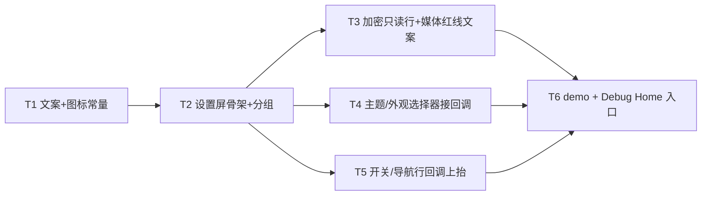

---
作者：@Ray
创建日期：2026-05-29
最后更新：2026-05-29
文档状态：草稿
---

# 任务列表：settings-screen

## 任务依赖图
> 由各任务 inline「同 spec 依赖」字段汇总，仅供速览；以 inline 为准。



并行组：
- Group A：T1
- Group B：T2（依赖 T1）
- Group C：T3、T4、T5（并行，均依赖 T2）
- Group D：T6（依赖 T3/T4/T5）

（整屏一体、无可独立部署/演示的中间切点 → 不设里程碑。）

-----

- [ ] T1 · settings 屏文案（gen-l10n）+ 专属图标 path 常量

**同 spec 依赖：** 无 ｜ **跨 spec 依赖：** `design-tokens-theme：AppLocalizations 约定`、`i18n-localization：gen-l10n`、`ui-kit-components：dayz_icons.dart（复用）` ｜ **关联需求：** R5, NF1 ｜ **依据设计：** D4, D6 ｜ **可改文件：** `lib/l10n/arb/app_zh.arb`、`lib/l10n/arb/app_en.arb`、`lib/l10n/gen/app_localizations.dart`、`lib/l10n/gen/app_localizations_zh.dart`、`lib/l10n/gen/app_localizations_en.dart`、`lib/ui/settings/settings_icons.dart`

### 背景
落地本屏全部可见文案与专属图标 path，后续任务只引用、不再写裸中文/裸 SVG。文案补入 `app_zh.arb` / `app_en.arb` 并跑 `gen-l10n`；settings 专属图标 path（DESIGN-REF §5 规范：viewBox 24、stroke=currentColor、stroke-width 2、round）归本屏 `settings_icons.dart`，能复用 `dayz_icons.dart` 既有 path 的不重复抄。

### 实施
1. 向 `lib/l10n/arb/app_zh.arb`、`lib/l10n/arb/app_en.arb` 补 key：`settingsTitle`、四个分组标题（`settingsGroupPrivacy/Backup/Appearance/Writing`）、各行主/次文案、`settingsDbEncryptedValue`（「已加密」）、**`settingsMediaNotLockedByPassword`（「设置主密码不会加密照片，照片始终用设备密钥保护」）**、选择器项名（`settingsThemePurple/Amber/Sage`、`settingsModeSystem/Light/Dark`）、Semantics 标签（返回、App 锁、草稿恢复）、账户副行模板（与 intl/ICU 配合，篇数/容量不写死，见 T2），并跑 `flutter gen-l10n`。
2. `settings_icons.dart`：settings 专属图标的 `static const String` path（盾+勾「数据库加密」、云「本地备份」、上箭头「导出」、主题圆、外观日、文件「草稿恢复」、锁「App 锁」等设计稿 settings.html 用到、`dayz_icons.dart` 未收的），均单色线性、不含颜色属性（着色由 `flutter_svg` `colorFilter` 取 `context.dayz` 文字色，T2 接）。
3. 全部新建 Dart 文件加 MPL-2.0 头注。

### 验收标准（做完即止）
- `app_zh.arb` / `app_en.arb` key 集合一致，新增 settings 条目可经 `AppLocalizations` 引用（自动：断言关键值非空，含 `settingsMediaNotLockedByPassword`、`settingsDbEncryptedValue`）。
- `settings_icons.dart` 各 path 为合法 SVG path 字符串、不含 `fill`/`stroke` 颜色字面量（自动：断言常量值匹配 path 语法、不含十六进制色值）。

### 验收方式
- 自动：
  ```bash
  flutter test test/ui/settings/settings_strings_icons_test.dart
  ```
  （import 常量、断言关键文案非空 + 红线文案存在 + 图标 path 不含写死颜色；**不** grep 被改文件源文本，而是 import 后断言值）

### 验收记录
```
日期：—
自动：—
人工：N/A
```

-----

- [ ] T2 · 设置屏骨架：账户头卡 + 四分组 + 声明式行清单装配

**同 spec 依赖：** T1 ｜ **跨 spec 依赖：** `design-tokens-theme：context.dayz/DayzSpacing/DayzRadii`、`ui-kit-components：DayzSetRow/DayzSetGroup/DayzSwitch/DayzGlassAppBar/dayz_icons + flutter_svg` ｜ **关联需求：** R1, NF1, NF3, NF4 ｜ **依据设计：** D1, D2, D4 ｜ **可改文件：** `lib/ui/settings/settings_screen.dart` ｜ **验收基建：** `test/ui/settings/settings_screen.golden`

### 背景
按 settings.html 顺序装配：`DayzGlassAppBar`（标题「设置」+ 返回钮）→ 唯一滚动区内放账户头卡（`DayzSetRow`/ui-kit 账户头卡件）+ 四个 `DayzSetGroup`（`隐私与加密`/`备份与导出`/`外观`/`书写`）。本任务先落**结构与静态渲染**（行清单 `_SettingsRowSpec` + 入参注入骨架），加密只读行细节归 T3、选择器回调归 T4、开关/导航回调归 T5（本任务把这些行先渲染出来，交互逻辑由后续任务接）。
职责边界：账户副行「N 篇 · 本地库 X MB」用 `package:intl` 的 `NumberFormat` 格式化入参 `accountStats`，MUST NOT 自拼字符串 / 写死「218 篇」。NF4：本屏不持 Repo，`accountStats` 由构造入参注入。

### 实施
1. `SettingsScreen` 构造入参：`accountStats`（姓名/头像字/篇数/库字节数）、`currentThemeName`、`currentMode`、`appLockEnabled`、`draftRecoveryEnabled` + 各回调（T4/T5 接）。
2. 定义私有 `_SettingsRowSpec`（行类型 + 图标 path + 主/次文案 key + 尾随件类型 + onTap?/onChanged?），按设计稿四分组各行声明。
3. build：`DayzGlassAppBar` + `CustomScrollView`/滚动区，map 行清单 → `DayzSetRow`（图标徽走 `flutter_svg`+`colorFilter` currentColor、文案引 `AppLocalizations`、间距走 `DayzSpacing`）。
4. 账户副行经 `intl` 格式化篇数与库大小（人类可读 MB）。
5. 全部视觉走 token（NF1），间距用 `EdgeInsetsDirectional`/`DayzSpacing`。
6. 新文件加 MPL-2.0 头注。

### 验收标准（做完即止）
- 渲染后可 `find` 到账户头卡 + 四个分组标题（`find.text(l10n.settingsGroupPrivacy)` 等）+ 设计稿各行主文案（自动，widget test）。
- 账户副行篇数/容量由 intl 格式化入参得出（喂不同 `accountStats` → 文本随之变；断言非硬编码）（自动）。
- 行图标徽用 `flutter_svg` 渲染、`colorFilter` 取 `context.dayz` 文字色，无写死颜色（自动：查 `SvgPicture`/`colorFilter` 来自 token）。
- 关键元素样式参数 == 设计稿 token（分组内边距/行高/图标徽尺寸读 `DayzSpacing`/`DayzRadii`）（自动，样式参数闸）。

### 验收方式
- 自动：
  ```bash
  flutter test test/ui/settings/settings_screen_structure_test.dart
  ```
  （pump `SettingsScreen` 喂假 `accountStats`，通过 test l10n wrapper 取 `l10n` 后 `find.text(l10n.xxx)` 断言四分组+各行；改入参断言账户副行随之变；断言图标 `colorFilter`/间距取自 token，**不** grep 屏源文本）

### 验收记录
```
日期：—
自动：—
人工：N/A
```

-----

- [ ] T3 · 数据库加密只读行 + 媒体红线文案显形

**同 spec 依赖：** T2 ｜ **跨 spec 依赖：** `key-management：DB 恒加密 / 主密码不保护照片（媒体 key 独立、不参与 rekey）的产品行为`、`media-storage：媒体 key 独立`、`ui-kit-components：DayzSetRow（不可交互态）/DayzSetGroup（脚注槽，待确认）` ｜ **关联需求：** R4, R5, NF2 ｜ **依据设计：** D5 ｜ **可改文件：** `lib/ui/settings/settings_screen.dart`

### 背景
两条合规红线在屏上显形：①「数据库加密」行右侧恒为只读「已加密」、无开关/无 chev/不可点（R4）；② 在「隐私与加密」分组承载「主密码锁不住照片」说明文案（R5，落点 D5：分组脚注或不可交互说明行）。归属：本任务只动 `settings_screen.dart` 中这两处行/文案的渲染与不可交互断言（行清单结构在 T2，本任务定其交互不可达与文案）。

### 实施
1. 「数据库加密」行：主文案/次文案引 `AppLocalizations`，尾随件 = 只读 `Text(l10n.settingsDbEncryptedValue)`（「已加密」），行清单标记 `tappable=false`、无 `onTap`/`onChanged`、无 `DayzSwitch`、无 chev。
2. 媒体红线文案：按 D5 在「隐私与加密」分组以脚注/不可交互说明行渲染 `l10n.settingsMediaNotLockedByPassword`（若 `DayzSetGroup` 无脚注槽则用 `DayzSetRow` 无尾随件、`tappable=false` 承载——按 ui-kit 实际 API 定）。
3. 两处文案的 Semantics 可被屏幕阅读器读到（NF2，加 `Semantics` 或确保 `Text` 默认语义可读）。

### 验收标准（做完即止）
- 「数据库加密」行右侧只显「已加密」文本，无 `DayzSwitch`、无 chev（自动：该行子树 `find.byType(DayzSwitch)` 为空、`find.text(l10n.settingsDbEncryptedValue)` 命中）。
- 点击「数据库加密」行不触发任何回调/导航（自动：tap 后无状态变更、无回调被调用——用 spy 回调断言零调用）。
- 「主密码锁不住照片」文案在屏上可见且可被 `find.text(l10n.settingsMediaNotLockedByPassword)` 定位（自动，R5）。
- 该说明文案有可读 Semantics（自动：`find.bySemanticsLabel` 或语义树含该文本）（NF2）。

### 验收方式
- 自动：
  ```bash
  flutter test test/ui/settings/settings_encryption_redline_test.dart
  ```
  （断言加密行无开关/无 chev/点击零回调 + 红线文案可见且语义可读；**不** grep 屏源，而是渲染后查 widget 树与回调 spy）

### 验收记录
```
日期：—
自动：—
人工：N/A
```

-----

- [ ] T4 · 主题色 / 外观模式选择器（DayzSheet.picker + 回调上抬）

**同 spec 依赖：** T2 ｜ **跨 spec 依赖：** `ui-kit-components：DayzSheet.picker（单选选择器，swatch 色点 + 选中打勾）、dayzMotionDuration`、`ui-shell-navigation：theme_controller.setTheme/setMode（接收端，本屏只上抛回调）` ｜ **关联需求：** R2, R3, NF2 ｜ **依据设计：** D3 ｜ **可改文件：** `lib/ui/settings/settings_screen.dart`

### 背景
「主题色」「外观模式」两行点击 → `DayzSheet.picker` 单选选择器 → 选中调本屏入参回调 `onPickTheme(themeName)` / `onPickMode(ThemeMode)`（屏内只喊、外壳换肤，对齐原型 `settheme/setmode` 上抛）。本屏不持 `theme_controller`、不直接改 `ThemeData`。reduce-motion 经 ui-kit 的 `dayzMotionDuration`，本屏不另写动效时长。

### 实施
1. 「主题色」行 `tappable`，右侧 `.val` = 当前主题色点（`context.dayz.accent` 或入参映射的色点）+ 名称（`l10n.settingsTheme*`）+ chev；点击 → `DayzSheet.picker` 列三套主题（`swatch` 色点、命中 `currentThemeName` 打勾）→ 选中 `onPickTheme(themeName)` + 关闭。
2. 「外观模式」行 `tappable`，右侧 `.val` 的 `.mv` = 当前模式名 + chev；点击 → picker 列 跟随系统/浅色/深色（命中 `currentMode` 打勾）→ 选中 `onPickMode(ThemeMode)` + 关闭。
3. 选择器弹出/收起动效经 `dayzMotionDuration(context, base)`（ui-kit），reduce-motion 下瞬时。

### 验收标准（做完即止）
- 点「主题色」行 → picker 出现、列三套主题、命中当前项打勾（自动，widget test）。
- 选 picker 中某主题 → `onPickTheme` 被调用且传对应 themeName、picker 关闭（自动，回调 spy）（R2）。
- 点「外观模式」行 → picker 列三模式，选某项 → `onPickMode` 被调用且传对应 `ThemeMode`、关闭（自动）（R3）。
- 两行命中区 ≥ 44px（自动，几何：`tester.getRect` 行高/命中盒 ≥ 44）（NF2）。
- reduce-motion（`MediaQueryData(disableAnimations:true)`）下选择器动效时长为 0（自动，经 `dayzMotionDuration` 门）（NF2）。

### 验收方式
- 自动：
  ```bash
  flutter test test/ui/settings/settings_pickers_test.dart
  ```
  （pump 喂 spy 回调，tap 行 → 断言 picker 出现 + 选中触发回调传值 + 关闭；注入 disableAnimations 断言动效 0；getRect 断言命中 ≥44）

### 验收记录
```
日期：—
自动：—
人工：N/A
```

-----

- [ ] T5 · 开关 / 导航类行回调上抬（不落库）

**同 spec 依赖：** T2 ｜ **跨 spec 依赖：** `ui-kit-components：DayzSwitch`、`ui-shell-navigation：Routes.*（导航上抛意图）`、`auto-save-draft / key-management / backup-full-snapshot：真实业务归彼处（本屏只回调）` ｜ **关联需求：** R6, NF2, NF4 ｜ **依据设计：** D2 ｜ **可改文件：** `lib/ui/settings/settings_screen.dart`

### 背景
开关类行（「App 锁」、「恢复未完成的编辑」用 `DayzSwitch`，展示态来自入参 `appLockEnabled`/`draftRecoveryEnabled`，切换发 `onAppLockChanged`/`onDraftRecoveryChanged` 回调）与导航类行（「本地备份」、「导出」用 chev，点击发 `onTapBackup`/`onTapExport` 导航回调）做成纯展示 + 回调上抬。本屏 MUST NOT 写 Drift/SQL、MUST NOT 触发真实备份/导出/rekey（NF4）。

### 实施
1. 「App 锁」「恢复未完成的编辑」行尾随 `DayzSwitch`，`value` 取入参、`onChanged` 调对应回调（本屏不持久化）。
2. 「本地备份」「导出」行尾随 chev、`tappable`，点击调 `onTapBackup`/`onTapExport`（指向占位/上抛导航意图，真实页面归后续 spec）。
3. 各开关有 Semantics 标签（`AppLocalizations`，含开关状态）；命中区 ≥ 44px（NF2）。

### 验收标准（做完即止）
- 拨「恢复未完成的编辑」开关 → `onDraftRecoveryChanged(true/false)` 被调用且传新值（自动，回调 spy）（R6）。
- 拨「App 锁」开关 → `onAppLockChanged` 被调用且传新值（自动）（R6）。
- 点「导出」/「本地备份」行 → `onTapExport`/`onTapBackup` 被调用（自动）（R6）。
- 开关有可定位的 Semantics 标签与状态、命中区 ≥ 44px（自动，`find.bySemanticsLabel` + getRect）（NF2）。
- 本屏不 import `lib/data`/`lib/security` 内部、不持 Drift 句柄（自动，见 verification 静态核验；本任务测试不调真实业务）（NF4）。

### 验收方式
- 自动：
  ```bash
  flutter test test/ui/settings/settings_rows_callbacks_test.dart
  ```
  （pump 喂 spy 回调，拨开关/点行断言回调被调用且传值；`find.bySemanticsLabel` + getRect 验无障碍；**不** grep 屏源）

### 验收记录
```
日期：—
自动：—
人工：N/A
```

-----

- [ ] T6 · 设置屏 demo + 挂 Debug Home 入口

**同 spec 依赖：** T3, T4, T5 ｜ **跨 spec 依赖：** `ui-shell-navigation：theme_controller（接 onPickTheme/onPickMode 演示换肤；demo 可用最小本地 ChangeNotifier 降级）` ｜ **关联需求：** R7, NF1 ｜ **依据设计：** D7 ｜ **可改文件：** `lib/demo/settings_screen_demo.dart`、`lib/demo/demo_entry.dart`

### 背景
Debug Home 入口：用假 `accountStats` + 最小控制器渲染设置屏，`onPickTheme/onPickMode` 接到控制器以真机看换肤、开关/导航回调打 toast/log 观测，两条红线文案可读。真机调试走 demo 页是项目约定（CLAUDE.md「Debug Home demo 入口模式」）。

### 实施
1. `settings_screen_demo.dart`：构造假 `accountStats`，用一个最小 `ChangeNotifier`（持 themeName/mode）接 `onPickTheme/onPickMode` → 包一层主题切换观察换肤；开关/导航回调打 toast 或 log。
2. `demo_entry.dart` 的 `demos` 列表**末尾追加一行**（不插中间、不改 `DemoEntry` 字段）。
3. 新文件加 MPL-2.0 头注。

### 禁止
- 不改 `DemoEntry` 字段定义；不在 `demos` 中间插入；不动既有 demo。
- demo 不直连 `lib/data`/`lib/security`（用假数据，NF4）。

### 验收标准（做完即止）
- `demos` 末尾新增项指向 `settings_screen_demo`，Debug Home 可进入（自动，widget test：构建 demo 列表 `find` 到该项并可 pump 进入）。
- demo 内切主题色/外观 → 经最小控制器换肤生效（自动：pump demo，tap 选择器选项后断言主题切换可观测，如 `context.dayz.accent` 变）。
- demo 内两条红线文案可见（自动：`find.text(l10n.settingsDbEncryptedValue)` + `find.text(l10n.settingsMediaNotLockedByPassword)`）。
- 六套主题/明暗下 demo 渲染人工目视符合设计稿 settings.html（人工，@Ray）。

### 验收方式
- 自动：
  ```bash
  flutter test test/demo/settings_screen_demo_test.dart
  ```
  （构建 demo 列表 find 到入口、pump 进入、tap 选择器断言换肤、find 红线文案；**不** grep 源文本）
- 人工：
  - 真机/模拟器进设置屏 demo，六套（3 主题×明暗）对照 settings.html 无明显偏差、两条红线文案清晰可读，@Ray 确认。

### 验收记录
```
日期：—
自动：—
人工：待确认（核查人 @Ray）
```
