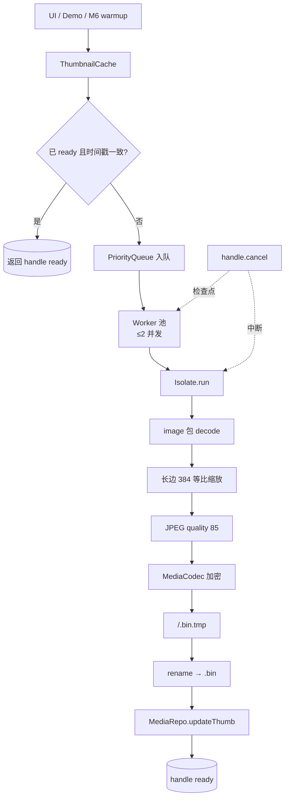

---
作者：@Ray
创建日期：2026-05-23
最后更新：2026-05-29
文档状态：草稿
---

# 设计：thumbnail-cache

## 技术决策

### D1 · 解码 / 缩放 / 编码栈
- **背景：** 需要在 isolate 内做 decode → resize → re-encode；Flutter / Dart 多个备选。
- **选项：**
  - `dart:ui` Codec + Picture → ImageStream（GPU 路径）
  - `image` 包（pure dart，CPU）
  - 平台 native via platform channel
- **选择：** **`image` 包**（pure Dart，可在 isolate 内运行；社区维护良好）。
- **理由：** `dart:ui` 必须在主 isolate；platform channel 引入跨语言；`image` 在 isolate 内畅通无阻、与 isolate 模型天然契合。
- **代价：** 性能比原生略慢；NF1 200ms 在中端机内可达；若 verification 不达标可后续替换为 native。

### D2 · 缩略图加密路径
- **背景：** 缩略图与原图同一密钥、同一文件格式即可复用；目录区分。
- **选项：** 复用 M3 MediaStore 全部 API（包括 media 表写入） / 单独写一套薄封装 / 直接调 MediaCodec + 自管路径。
- **选择：** **复用 M3 `MediaCodec` 与 `KeyProvider.getDeviceMediaKey`**，单独管理 `thumbs/` 目录与 media 表 thumb 字段更新（不走 MediaStore.put，因为 thumb 不是新 media 行）。
- **理由：** 加密一致；目录与字段不同，封装区分清晰。
- **代价：** 自管 `thumbs/` 目录的孤儿清理；放进 backup 瘦身（M6 阶段二）或单独运维任务。

### D3 · 任务队列与取消
- **背景：** R5 / NF3 要求可取消、按优先级。
- **选项：** 自实现队列 / `async/streams` + 第三方 / Stream + `cancelable_operation` 包。
- **选择：** **自实现一个最小 PriorityQueue + CancelToken**。
- **理由：** 行为可控；零依赖；测试简单。
- **代价：** 自维代码量；约 100 行。

### D4 · isolate 模型
- **背景：** R6 后台预热在 isolate；NF2 限制 ≤ 2 个 isolate。
- **选项：** 一次性 isolate spawn + 长生命周期 / 每张图 spawn 一次 / `Isolate.run` 短任务。
- **选择：** **`Isolate.run`（Flutter 3.7+ 内置）逐任务执行**，并发上限通过队列层限制（最多 2 个并发）。
- **理由：** Isolate.run 启动成本低（Flutter 已优化）；不需要管理长生命周期 worker；并发限制在 Dart 侧实现。
- **代价：** Isolate.run 偶有 5-10ms 启动开销；与 200ms 总预算相比可忽略。

### D5 · 一致性与事务边界（补偿式，非伪原子）
- **背景：** R8 要求文件与 db thumb 字段一致。注意：文件 IO 在 SQLite 事务外，「同一事务内同时改文件 + db」物理不可能（见 `docs/design/09`「约定一」），故用补偿式次序而非伪原子。
- **选项：** 文件先写 db 后写 / 反过来 / 两步原子化。
- **选择：** **「先写文件到 `.tmp` → rename → db 事务更新 thumb 字段 → db 失败则删除已写的文件」**。
- **理由：** 与 M3 D5 / `docs/design/09` 约定一一致；rename POSIX 原子；db 失败删文件避免孤儿。
- **代价：** 与 M3 一致——进程在 db 更新前崩溃留下的 `thumbs/<id>.bin`(.tmp) 孤儿由后续运维 spec 启动清扫处理。

### D6 · 失效判断「不引入独立脏标志位」
- **背景：** R4 v6 9.4 明确以时间戳比较为唯一判据。
- **选项：** 加独立 `thumb_dirty` 字段 / 用时间戳比较。
- **选择：** 时间戳比较（`thumb_src_updated_at` vs `media.updated_at`）。
- **理由：** 不会漏置位；schema 已就绪。
- **代价：** 无。

### D7 · 还原期约束
- **背景：** R7 + v6 8.4 第 5 步「禁止还原时同步全量重建」。
- **选项：** 让 M6 调 `warmup` / 让 M6 不调 / 强制规则。
- **选择：** **本里程碑只暴露 `warmup` 异步入队 API**；M6 文档约束「还原后可调 warmup 不必等」，不暴露同步全量重建接口。
- **理由：** 接口设计上就堵掉这条危险路径。
- **代价：** 无。

## 架构

## 文件变更

- `pubspec.yaml`                                修改（添加 `image` 包）
- `lib/thumbnails/thumbnail_cache.dart`         新建（公共 API）
- `lib/thumbnails/thumbnail_handle.dart`        新建
- `lib/thumbnails/priority_queue.dart`          新建（最小实现）
- `lib/thumbnails/cancel_token.dart`            新建
- `lib/thumbnails/worker_pool.dart`             新建（≤2 isolate 并发）
- `lib/thumbnails/generator.dart`               新建（isolate 内部入口：decode/resize/encode）
- `lib/thumbnails/demo.dart`                    新建
- `lib/demo/demo_entry.dart`                    修改（追加）
- `test/thumbnails/`                            新建

## 已知风险

- **`image` 包内存峰值**：解码大图后整张 raw bitmap 在内存，NF2 上限按此估算（一张 4000×3000 RGB = 36 MiB，× 2 并发 = 72 MiB；考虑解码/编码 buffer，< 250 MiB 余量足）。
- **NF1 200ms 中端机能否达标**：取决于 `image` 包性能；T2 性能测试若不过标，考虑换 native 实现，已知风险记录。
- **Isolate 启动开销**：Flutter 3.7+ Isolate.run 已优化，但极端低端机可能 50ms 起；NF1 总预算 200ms 仍有余量。
- **取消信号粒度**：image 包不支持中途打断解码；取消只能在「整张完成前」检查；NF3 100ms 在常规图上可达，超大图不一定。
