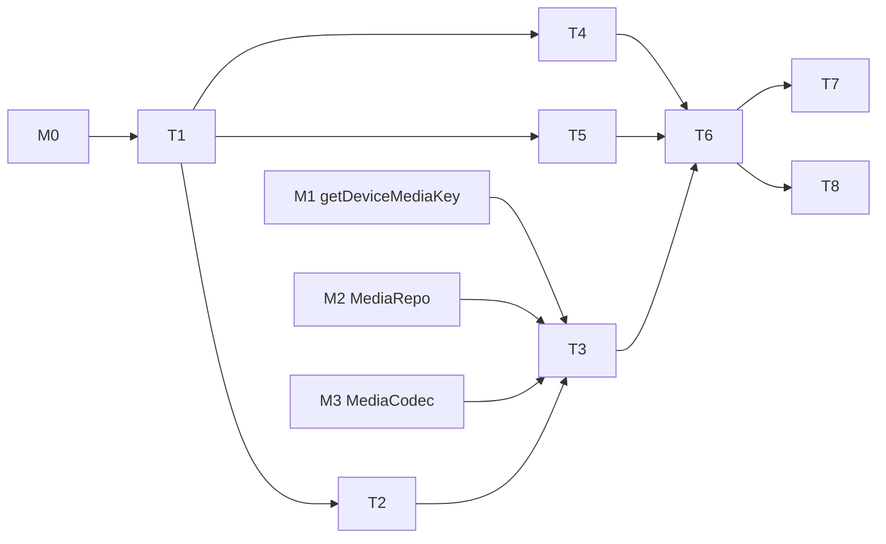

---
作者：@Ray
创建日期：2026-05-23
最后更新：2026-05-23
文档状态：草稿
---

# 任务列表：thumbnail-cache

## 任务依赖图
> 整体依赖 **M0**、**M1 设备媒体密钥**、**M2 MediaRepo.updateThumb**、**M3 MediaCodec**。


并行组：
- Group A：T2, T4, T5

里程碑：
- **M5-done**：T1-T8 完成；Debug Home「Thumbnails demo」可对 demo 图触发生成、取消、查询失效路径。

-----

- [ ] T1 · 添加 image 依赖

**依赖：** M0 ｜ **关联需求：** R1, NF1 ｜ **依据设计：** D1 ｜ **可改文件：** `pubspec.yaml`

### 实施
1. 添加 `image` 包（活跃维护版本），锁版本
2. `flutter pub get`

### 验收方式
- 自动：`flutter pub get && grep -q '^  image:' pubspec.yaml`

### 验收记录
```
日期：—
自动：—
人工：—（无）
```

-----

- [ ] T2 · CancelToken + PriorityQueue

**依赖：** T1 ｜ **关联需求：** R5, NF3 ｜ **依据设计：** D3 ｜ **可改文件：** `lib/thumbnails/cancel_token.dart`, `lib/thumbnails/priority_queue.dart`, `test/thumbnails/queue_test.dart`

### 实施
1. `CancelToken { bool isCancelled; void cancel(); Future<void> get whenCancelled; }`
2. `class PriorityQueue<T> { add(T, priority); T? pop(); remove(T); int get length; }`
3. 三种优先级：`high / normal / low`（low 给 warmup，normal 默认，high 预留 UI 视口热区）
4. 测试：优先级排序、移除、cancel 触发

### 验收方式
- 自动：`flutter test test/thumbnails/queue_test.dart`

### 验收记录
```
日期：—
自动：—
人工：—（无）
```

-----

- [ ] T3 · Generator（isolate 内 decode/resize/encode + 加密落盘 + db 更新）

**依赖：** T1, M1, M2, M3 ｜ **关联需求：** R1, R2, R8, NF1, NF4 ｜ **依据设计：** D1, D2, D5 ｜ **可改文件：** `lib/thumbnails/generator.dart`, `test/thumbnails/generator_test.dart`

### 背景
isolate 入口函数：传入 `(mediaId, srcRelPath, deviceMediaKey)`；步骤：MediaCodec 解密原图 → image 解码 → resize（长边 384）→ JPEG quality 85 编码 → MediaCodec 加密 → 写 `<thumbs>/<id>.bin.tmp` → rename → 调 MediaRepo.updateThumb。补偿式一致性见 R8 / D5 / `docs/design/09`：先文件后 db，db 事务失败则删除已写的缩略图文件。

### 实施
1. 在 isolate 内执行（用 Isolate.run 包装）
2. 主 isolate 提供 db 写入；isolate 内不直接持 db 句柄
3. 设计上：isolate 返回密文字节 + 新尺寸；主 isolate 完成「写 `.tmp` → rename → db 事务更新 thumb 字段」；**db 事务失败 MUST 删除已 rename 的缩略图文件**（补偿，避免孤儿）
4. 测试：
   - 1500×1000 → 缩略图长边 = 384、JPEG 解码后宽高准确
   - 失败原图（损坏字节）抛 `ThumbnailGenerationException`
   - 生成成功后 media.thumb_path 与 thumb_src_updated_at 都写入
   - 注入 db 更新失败 → 已写的 `<thumbs>/<id>.bin` 被删除（无孤儿）、任务报失败

### 验收方式
- 自动：`flutter test test/thumbnails/generator_test.dart`

### 验收记录
```
日期：—
自动：—
人工：—（无）
```

-----

- [ ] T4 · WorkerPool（≤2 并发 + cancel 检查点）

**依赖：** T1 ｜ **关联需求：** R5, R6, NF2, NF3 ｜ **依据设计：** D4 ｜ **可改文件：** `lib/thumbnails/worker_pool.dart`, `test/thumbnails/worker_pool_test.dart`

### 实施
1. `WorkerPool` 持有一个并发上限（默认 2）
2. `submit(task, cancelToken)`：等待空闲 slot → 执行
3. 任务执行前 / 关键边界（解码后 / 编码后）check cancelToken.isCancelled → 抛 CancelledException
4. 测试：并发 10 个任务最多 2 同时跑；cancel 立即停

### 验收方式
- 自动：`flutter test test/thumbnails/worker_pool_test.dart`

### 验收记录
```
日期：—
自动：—
人工：—（无）
```

-----

- [ ] T5 · ThumbnailHandle 数据类

**依赖：** T1 ｜ **关联需求：** R3 ｜ **依据设计：** D3 ｜ **可改文件：** `lib/thumbnails/thumbnail_handle.dart`

### 实施
1. `enum ThumbnailState { pending, ready, failed, cancelled }`
2. `class ThumbnailHandle { Future<ThumbnailResult> get future; void cancel(); ThumbnailState get state; }`
3. `class ThumbnailResult { String relPath; int w; int h; }`

### 验收方式
- 自动：`grep -q 'enum ThumbnailState' lib/thumbnails/thumbnail_handle.dart`

### 验收记录
```
日期：—
自动：—
人工：—（无）
```

-----

- [ ] T6 · ThumbnailCache 主入口（request / warmup / 失效判断）

**依赖：** T2, T3, T4, T5 ｜ **关联需求：** R3, R4, R6, R7, R8 ｜ **依据设计：** D5, D6, D7 ｜ **可改文件：** `lib/thumbnails/thumbnail_cache.dart`, `test/thumbnails/thumbnail_cache_test.dart`

### 实施
1. `request(mediaId, {priority = normal}) -> ThumbnailHandle`
2. 内部检查 media 表：thumb_path 存在且 thumb_src_updated_at == media.updated_at → 直接 ready
3. 否则入队 + 创建 handle；同 mediaId 复用第一个任务
4. `warmup(List<mediaId>)`：批量入队 low 优先级（接口异步入队，立即返回）
5. 测试：
   - cache hit 命中（已 ready 且时间戳一致）
   - 时间戳不一致 → 重建
   - 重复 request 复用 handle
   - cancel 后 handle.state = cancelled
   - warmup 不阻塞调用者
   - 还原模拟场景：一次 warmup 10 张图 → 后台逐张完成

### 验收方式
- 自动：`flutter test test/thumbnails/thumbnail_cache_test.dart`

### 验收记录
```
日期：—
自动：—
人工：—（无）
```

-----

- [ ] T7 · 性能基线

**依赖：** T6 ｜ **关联需求：** NF1, NF2 ｜ **依据设计：** D1, D4 ｜ **可改文件：** `test/thumbnails/perf_test.dart`

### 实施
1. benchmark：连续 10 张 1500×1000 原图 → request normal → 测平均耗时
2. 真机 iOS + Android 各跑一次
3. 数据写入本任务验收记录

### 验收标准（做完即止）
- 中端真机平均 < 200ms（人工）
- 峰值 RSS < 250 MiB（人工，可借 Profiler）
- 若不达标，已在验收记录中标注「触发 native 实现备选」（人工）

### 验收方式
- 自动：`flutter test test/thumbnails/perf_test.dart`
- 人工（@Ray）：iOS / Android 真机各跑一次

### 验收记录
```
日期：—
iOS 平均：— ms
Android 平均：— ms
RSS 峰值：—
是否达标：—
核查人：@Ray
```

-----

- [ ] T8 · 接入 Debug Home：Thumbnails demo

**依赖：** T6 ｜ **关联需求：** R3, R4, R5, R6 ｜ **依据设计：** D7 ｜ **可改文件：** `lib/thumbnails/demo.dart`, `lib/demo/demo_entry.dart`

### 背景
做一个 Debug Home 入口演示：
- 「插入 demo 大图」按钮：调 M3 MediaStore.put 一张资产图（与 editor-research 共用 assets/demo_image.png）
- 「生成缩略图」按钮：request → 显示 handle 状态变化
- 「显示缩略图」按钮：openRead `<thumbs>/<id>.bin` → 解密 → 渲染到 Image widget
- 「篡改原图 updated_at」按钮：手动 bump → 再次 request → 看是否重建
- 「取消生成」按钮：在 pending 状态 cancel
- 「批量预热 10 张」按钮：warmup demo 列表

### 实施
1. `class ThumbnailsDemo extends StatefulWidget`
2. 上述六个按钮 + 实时状态文本 + Image 预览
3. 注册到 demos 列表
4. iOS + Android 真机各跑一次

### 验收标准（做完即止）
- 生成 / 取消 / 失效重建 / 批量预热路径均能演示（人工）

### 验收方式
- 自动：`flutter test test/thumbnails/demo_test.dart`
- 人工（@Ray）：真机演示

### 验收记录
```
日期：—
自动：—
人工：—（核查人 @Ray）
```
