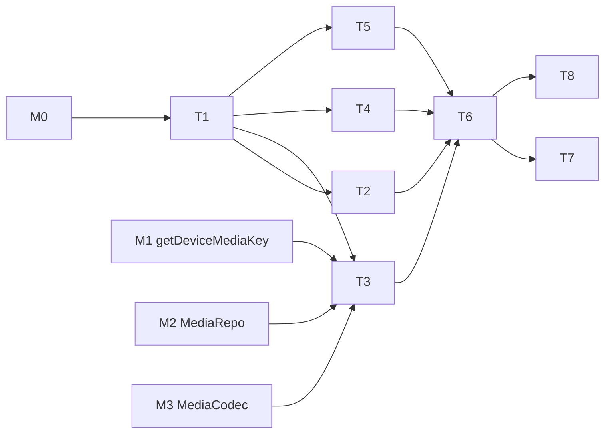

---
作者：@Ray
创建日期：2026-05-23
最后更新：2026-05-29
文档状态：草稿
---

# 任务列表：thumbnail-cache

## 任务依赖图
> M# ↔ spec 映射（只列本 spec 用到的别名）：M0 = app-scaffold，M1 = key-management，M2 = data-layer，M3 = media-storage。
> 整体依赖 **M0（app-scaffold）完成**、**M1（key-management）T10 getDeviceMediaKey**、**M2（data-layer）T9 MediaRepo.updateThumb**、**M3（media-storage）T4 MediaCodec**。


并行组：
- Group A：T2, T4, T5

里程碑：
- **M5-done**：T1-T8 完成；Debug Home「Thumbnails demo」可对 demo 图触发生成、取消、查询失效路径。

-----

- [ ] T1 · 添加 image 依赖

**同 spec 依赖：** 无 ｜ **跨 spec 依赖：** app-scaffold（M0：壳/pubspec/平台配置/Debug Home 框架就绪） ｜ **关联需求：** R1, NF1 ｜ **依据设计：** D1 ｜ **可改文件：** `pubspec.yaml`, `pubspec.lock` ｜ **验收基建：** `test/thumbnails/image_dep_test.dart`

### 实施
1. 添加 `image` 包（活跃维护版本），锁版本
2. `flutter pub get`

### 验收标准（做完即止）
- `flutter pub get` 成功解析、无版本冲突（自动）
- `image` 包真正进入已解析依赖图、且其 API 可被编译/调用（自动；断言「依赖确实可用」而非「pubspec 文本里有这行字」）

### 验收方式
- 自动：
  ```bash
  flutter pub get
  flutter test test/thumbnails/image_dep_test.dart
  ```
  解释：`image_dep_test.dart` 直接 `import 'package:image/image.dart';`，构造一张 2×2 `Image`、`encodeJpg` 再 `decodeJpg`，断言解码回来的 `width == 2 && height == 2`。该测试只有在 `image` 包被成功解析并可调用时才能编译通过，断言的是**包的可观测行为**（编解码往返结果），而非 pubspec.yaml 的字面文本——故不可被「写一行字」糊弄。`flutter pub get` 解析失败或包缺失时测试编译即失败。

### 验收记录
```
日期：—
自动：—
人工：—（无）
```

-----

- [ ] T2 · CancelToken + PriorityQueue

**同 spec 依赖：** T1 ｜ **跨 spec 依赖：** 无 ｜ **关联需求：** R5, NF3 ｜ **依据设计：** D3 ｜ **可改文件：** `lib/thumbnails/cancel_token.dart`, `lib/thumbnails/priority_queue.dart`, `test/thumbnails/queue_test.dart`

### 实施
1. `CancelToken { bool isCancelled; void cancel(); Future<void> get whenCancelled; }`
2. `class PriorityQueue<T> { add(T, priority); T? pop(); remove(T); int get length; }`
3. 两种优先级：`normal / low`（normal 默认，low 给 warmup）
4. 测试：优先级排序、移除、cancel 触发

### 验收标准（做完即止）
- `pop()` 按 normal 先于 low 出队（自动）
- `remove(T)` 后 `length` 递减、该元素不再 `pop` 出（自动）
- `CancelToken.cancel()` 后 `isCancelled == true` 且 `whenCancelled` 完成（自动）

### 验收方式
- 自动：`flutter test test/thumbnails/queue_test.dart`

### 验收记录
```
日期：—
自动：—
人工：—（无）
```

-----

- [ ] T3 · Generator（isolate 内 decode/resize/encode + 加密落盘 + db 更新）

**同 spec 依赖：** T1 ｜ **跨 spec 依赖：** key-management（getDeviceMediaKey，对应其 T10）、data-layer（MediaRepo，对应其 T9）、media-storage（MediaCodec，对应其 T4） ｜ **关联需求：** R1, R2, R8, NF1, NF4 ｜ **依据设计：** D1, D2, D5 ｜ **可改文件：** `lib/thumbnails/generator.dart`, `test/thumbnails/generator_test.dart`

### 背景
isolate 入口函数：传入 `(mediaId, srcRelPath, deviceMediaKey)`；步骤：MediaCodec 解密原图 → image 解码 → resize（长边 384）→ JPEG quality 85 编码 → MediaCodec 加密 → 写 `<thumbs>/<id>.bin.tmp` → rename → 调 MediaRepo.updateThumb。补偿式一致性见 R8 / D5 / `docs/design/09`：先文件后 db，db 事务失败则删除已写的缩略图文件。

### 实施
1. 在 isolate 内执行（用 Isolate.run 包装）
2. 主 isolate 提供 db 写入；isolate 内不直接持 db 句柄
3. 设计上：isolate 返回密文字节 + 新尺寸；主 isolate 完成「写 `.tmp` → rename → db 事务更新 thumb 字段」；**db 事务失败 MUST 删除已 rename 的缩略图文件**（补偿，避免孤儿）
4. 测试：
   - 1500×1000 → 缩略图长边 = 384、JPEG 解码后宽高准确
   - 失败原图（损坏字节）抛 `ThumbnailGenerationException`
   - 生成成功后 media.thumb_path 与 thumb_src_updated_at 都写入
   - 注入 db 更新失败 → 已写的 `<thumbs>/<id>.bin` 被删除（无孤儿）、任务报失败

### 验收标准（做完即止）
- 1500×1000 原图生成的缩略图长边 = 384、短边按比例（自动，满足 R1）
- 生成成功后 media 表 `thumb_path` / `thumb_w` / `thumb_h` / `thumb_src_updated_at` 均写入（自动，满足 R2）
- 损坏原图抛 `ThumbnailGenerationException`（自动）
- 注入 db 事务失败 → 已 rename 的 `<thumbs>/<id>.bin` 被删除、无孤儿、任务报失败（自动，满足 R8/D5）

### 验收方式
- 自动：`flutter test test/thumbnails/generator_test.dart`

### 验收记录
```
日期：—
自动：—
人工：—（无）
```

-----

- [ ] T4 · WorkerPool（≤2 并发 + cancel 检查点）

**同 spec 依赖：** T1 ｜ **跨 spec 依赖：** 无 ｜ **关联需求：** R5, R6, NF2, NF3 ｜ **依据设计：** D4 ｜ **可改文件：** `lib/thumbnails/worker_pool.dart`, `test/thumbnails/worker_pool_test.dart`

### 实施
1. `WorkerPool` 持有一个并发上限（默认 2）
2. `submit(task, cancelToken)`：等待空闲 slot → 执行
3. 任务执行前 / 关键边界（解码后 / 编码后）check cancelToken.isCancelled → 抛 CancelledException
4. 测试：并发 10 个任务最多 2 同时跑；cancel 后任务在下一个检查点（解码后 / 编码后）抛 CancelledException 停止——从 `cancel()` 到任务停止占用 slot MUST < 100ms（用 Stopwatch 断言，满足 NF3 的块边界粒度）

### 验收标准（做完即止）
- 提交 10 个任务时，任意时刻并发执行数 ≤ 2（自动，满足 NF2）
- 任务执行前及关键边界（解码后 / 编码后）check `cancelToken.isCancelled`，已取消则抛 CancelledException（自动）
- cancel 到任务释放 slot 的间隔 < 100ms（自动，满足 NF3）

### 验收方式
- 自动：`flutter test test/thumbnails/worker_pool_test.dart`

### 验收记录
```
日期：—
自动：—
人工：—（无）
```

-----

- [ ] T5 · ThumbnailHandle 数据类

**同 spec 依赖：** T1 ｜ **跨 spec 依赖：** 无 ｜ **关联需求：** R3, R5 ｜ **依据设计：** D3 ｜ **可改文件：** `lib/thumbnails/thumbnail_handle.dart`, `test/thumbnails/thumbnail_handle_test.dart`

### 实施
1. `enum ThumbnailState { pending, ready, failed, cancelled }`
2. `enum ThumbnailPriority { normal, low }`（与 R3/R5 唯一契约一致，仅两档，无 high）
3. `class ThumbnailHandle { Future<ThumbnailResult> get future; void cancel(); ThumbnailState get state; }`
4. `class ThumbnailResult { final String relPath; final int w; final int h; }`

### 验收标准（做完即止）
- `ThumbnailState` 的取值集合恰为 `{pending, ready, failed, cancelled}`（自动，断言 `ThumbnailState.values` 长度与成员，与 R3 契约一致）
- `ThumbnailPriority` 的取值集合恰为 `{normal, low}`（自动，断言无 high 档，与 R5 自洽）
- `ThumbnailHandle` 实例可读 `state`、可读 `future`、可调 `cancel()`；`ThumbnailResult(relPath, w, h)` 三字段构造后可正确读回（自动）

### 验收方式
- 自动：
  ```bash
  flutter test test/thumbnails/thumbnail_handle_test.dart
  ```
  解释：测试断言 `ThumbnailState.values` 与 `ThumbnailPriority.values` 的**枚举成员集合**（含「不含 high」），并构造一个 `ThumbnailResult(relPath:'thumbs/x.bin', w:384, h:256)` 断言三字段读回相等——验的是契约的**可观测取值/结构**，而非源文件里是否出现 `enum ThumbnailState` 字面量。

### 验收记录
```
日期：—
自动：—
人工：—（无）
```

-----

- [ ] T6 · ThumbnailCache 主入口（request / warmup / 失效判断）

**同 spec 依赖：** T2, T3, T4, T5 ｜ **跨 spec 依赖：** 无 ｜ **关联需求：** R3, R4, R6, R7, R8 ｜ **依据设计：** D5, D6, D7 ｜ **可改文件：** `lib/thumbnails/thumbnail_cache.dart`, `test/thumbnails/thumbnail_cache_test.dart`

### 实施
1. `request(mediaId, {ThumbnailPriority priority = ThumbnailPriority.normal}) -> ThumbnailHandle`（R3 唯一入口；**不**另加 `requestWithPriority`）
2. 内部检查 media 表：thumb_path 存在且 thumb_src_updated_at == media.updated_at → 直接 ready
3. 否则入队 + 创建 handle；同 mediaId 复用第一个任务
4. `warmup(List<mediaId>)`：内部对每个 id 调 `request(id, priority: ThumbnailPriority.low)` 批量入队（接口异步入队，立即返回）
5. 测试：
   - cache hit 命中（已 ready 且时间戳一致）
   - 时间戳不一致 → 重建
   - 重复 request 复用 handle
   - cancel 后 handle.state = cancelled
   - **取消响应（NF3）**：pending 状态 cancel → 从 `cancel()` 调用到 `handle.state == cancelled` 的间隔 MUST < 100ms（用 Stopwatch 断言耗时上界）
   - warmup 不阻塞调用者
   - 还原模拟场景：一次 warmup 10 张图 → 后台逐张完成

### 验收标准（做完即止）
- thumb_path 存在且时间戳一致时直接 ready、无新生成（自动，满足 R3/R4）
- `thumb_src_updated_at != media.updated_at` 时重建并更新时间戳（自动，满足 R4）
- 同一 mediaId 重复 request 复用同一 handle、仅一次生成（自动，满足 R5）
- pending 状态 cancel 后 `handle.state == cancelled`，间隔 < 100ms（自动，满足 R5/NF3）
- `warmup(List)` 立即返回不阻塞调用者，后台以 low 优先级逐张完成（自动，满足 R6/R7）

### 验收方式
- 自动：
  ```bash
  flutter test test/thumbnails/thumbnail_cache_test.dart
  ```
  解释：测试以内存 db + 假 Generator 驱动 `ThumbnailCache`，断言**可观测状态/计数**：① 时间戳一致时 `handle.state == ready` 且 Generator 调用次数 == 0（cache hit）；② bump `media.updated_at` 后再 request，Generator 被调用一次且 `thumb_src_updated_at` 更新为最新值；③ 同 mediaId 连续 request 两次，返回**同一** handle 实例且 Generator 仅触发一次；④ pending 态 `cancel()` 后用 Stopwatch 断言到 `state == cancelled` 的耗时 < 100ms；⑤ `warmup(10 ids)` 调用点同步返回（断言调用未阻塞，返回后立即可执行下一行），随后泵任务断言 10 张以 low 优先级逐张完成。断言的是行为与值，非源码文本。

### 验收记录
```
日期：—
自动：—
人工：—（无）
```

-----

- [ ] T7 · 性能基线

**同 spec 依赖：** T6 ｜ **跨 spec 依赖：** 无 ｜ **关联需求：** NF1, NF2 ｜ **依据设计：** D1, D4 ｜ **可改文件：** `test/thumbnails/perf_test.dart`

### 实施
1. benchmark：连续 10 张 1500×1000 原图 → request normal → 测平均耗时
2. 真机 iOS + Android 各跑一次
3. 数据写入本任务验收记录

### 验收标准（做完即止）
- 中端真机平均 < 200ms（人工）
- 峰值 RSS < 250 MiB（人工，可借 Profiler）
- 若不达标，已在验收记录中标注「触发 native 实现备选」（人工）

### 验收方式
- 自动：`flutter test test/thumbnails/perf_test.dart`
- 人工（@Ray）：iOS / Android 真机各跑一次

### 验收记录
```
日期：—
iOS 平均：— ms
Android 平均：— ms
RSS 峰值：—
是否达标：—
核查人：@Ray
```

-----

- [ ] T8 · 接入 Debug Home：Thumbnails demo

**同 spec 依赖：** T6 ｜ **跨 spec 依赖：** 无 ｜ **关联需求：** R3, R4, R5, R6 ｜ **依据设计：** D7 ｜ **可改文件：** `lib/thumbnails/demo.dart`, `lib/demo/demo_entry.dart`

### 背景
做一个 Debug Home 入口演示：
- 「插入 demo 大图」按钮：调 M3 MediaStore.put 一张资产图（共用唯一规范资产 `assets/editor/demo_image.png`，单一来源见 `specs/active/assets-management`）
- 「生成缩略图」按钮：request → 显示 handle 状态变化
- 「显示缩略图」按钮：openRead `<thumbs>/<id>.bin` → 解密 → 渲染到 Image widget
- 「篡改原图 updated_at」按钮：手动 bump → 再次 request → 看是否重建
- 「取消生成」按钮：在 pending 状态 cancel
- 「批量预热 10 张」按钮：warmup demo 列表

### 实施
1. `class ThumbnailsDemo extends StatefulWidget`
2. 上述六个按钮 + 实时状态文本 + Image 预览
3. 注册到 demos 列表
4. iOS + Android 真机各跑一次

### 验收标准（做完即止）
- 生成 / 取消 / 失效重建 / 批量预热路径均能演示（人工）

### 验收方式
- 自动：`flutter test test/thumbnails/demo_test.dart`
- 人工（@Ray）：真机演示

### 验收记录
```
日期：—
自动：—
人工：—（核查人 @Ray）
```
