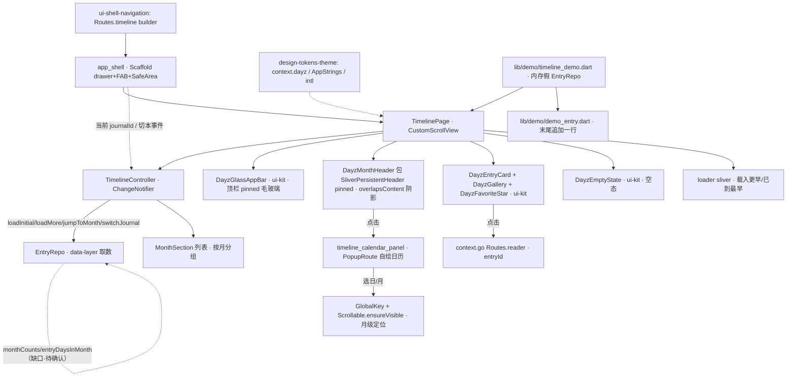

---
作者：@Ray
创建日期：2026-05-29
最后更新：2026-05-29
文档状态：草稿
---

# 设计：timeline-screen

> 视觉与映射依据：屏源真源 [`ui-design/current/pages/screens/timeline.html`](../../../ui-design/current/pages/screens/timeline.html)（+ `pages/assets/timeline.{css,js}`、多状态 `?state=default|drawer|empty`）；HTML→Flutter 机制映射 [`ui-design/current/docs/PROTOTYPE-ARCH.md`](../../../ui-design/current/docs/PROTOTYPE-ARCH.md) §6（`SliverAppBar(pinned)`/`SliverPersistentHeader(pinned)`/`BackdropFilter`/无限滚动 + 月份计数 + **pinned 头 × 跳任意项不易兼得→日历跳转降级到月级**）；组件类名与最小 HTML [`ui-design/current/docs/DESIGN-REF.md`](../../../ui-design/current/docs/DESIGN-REF.md) §3（`.entry`/`.gallery`）/§3b（`.tl-month`）/§3c（`.cal-*`/`.tl-loader`/`.pg`+`--top-h`/`.empty`）/§4（抽屉/FAB）；方法论 [`docs/design/10-ui-restore-and-design-sync.md`](../../../docs/design/10-ui-restore-and-design-sync.md) §1/§3/§4/§9（W2 页面级）/§10/§11。组件本体来自 `ui-kit-components`、外壳/路由来自 `ui-shell-navigation`、token/`AppStrings`/`intl` 约定来自 `design-tokens-theme`、取数交付物来自 `data-layer`（均按交付物名引用，见 `## 已知风险`「跨 spec 依赖」）。

## 技术决策

### D1 · 滚动骨架：单 `CustomScrollView` + 三类 sliver
- **状态：** 采纳
- **背景：** R1 要在一个滚动容器里同时实现「pinned 毛玻璃顶栏 + 每月 pinned 吸顶月份头 + 该月卡片列表 + 尾部 loader」。`timeline.html` 用一个 `.app-scroll` 承载，顶栏与吸顶月份头共用同一毛玻璃「并成一条磨砂」。
- **选项：** (A) `NestedScrollView`（外层 appbar + 内层列表）；(B) 单 `CustomScrollView` + `SliverAppBar(pinned)` + 交替的 `SliverPersistentHeader(pinned)`（月份头）与 `SliverList`（该月卡片）+ 尾部 loader sliver；(C) `ListView` 手搓 sticky header。
- **选择：** B。`TimelinePage` 持一个 `CustomScrollView(controller)`，slivers = `[DayzGlassAppBar(sliver 形态), for each month: (DayzMonthHeader 包成 SliverPersistentHeader(pinned), SliverList(该月卡片)), SliverToBoxAdapter(loader)]`。月份头与顶栏共用 `DayzGlassAppBar` 同一 `BackdropFilter` 配方（ui-kit 交付），相邻不重叠「并成一条磨砂」（PROTOTYPE-ARCH §6）。
- **理由：** §6 明确映射「固定头 = `SliverAppBar(pinned)`、月份吸顶 = `SliverPersistentHeader(pinned)`、阴影只在 `overlapsContent==true` 时给」；单 `CustomScrollView` 让 pinned 行为、状态栏让位（`SafeArea`/`MediaQuery.padding`）、`overlapsContent` 吸顶阴影全部原生，无需手算 `--top-h`。`NestedScrollView` 的内外双 controller 与「按 index 跳转」更难协同。
- **代价：** 多月时 slivers 列表较长、需按月分组构建；可接受（分组在内存中由分页结果聚合，见 D3）。

### D2 · 月份头吸顶阴影 = `overlapsContent`，不手算 `.stuck`
- **状态：** 采纳
- **背景：** `timeline.js` 的 `updateStuck()` 在滚动时手动判定哪个 `.tl-month` 真正停靠在顶栏下、给它 `.stuck` 加底部柔和投影。
- **选择：** `DayzMonthHeader` 装进 `SliverPersistentHeader(pinned:true)`，其 `delegate.build(context, shrinkOffset, overlapsContent)` 仅在 `overlapsContent==true` 时给底部 `BoxShadow`（取 `context.dayz.shadow*`），等价于原型 `.stuck` 且原生判定、无需 scroll listener 手算。
- **理由：** PROTOTYPE-ARCH §6 直接给出此映射（「阴影只在 builder 的 `overlapsContent==true` 时给 `BoxShadow`，与本原型 `.stuck` 等价，且原生判定，无需手算」）。
- **代价：** `SliverPersistentHeader` 的 `minExtent==maxExtent`（月份头定高），content-driven 行为不适用——月份头是 fixed-geometry，定高由 ui-kit 的 `DayzMonthHeader` 决定，本屏只包壳。

### D3 · 数据装载：游标分页 + 按月分组，状态在 `TimelineController`
- **状态：** 采纳
- **背景：** R2 向上无限滚动走 `EntryRepo.timeline({cursor, limit=30})`（data-layer 交付：返回页 + 下一页 cursor，按 `(entry_dt_utc, id)` 倒序）。slivers 需要「按月分组」结构，而 Repo 返回的是扁平分页页。NF1 禁止屏内直连 Drift。
- **选项：** (A) 屏 widget 直接持 `EntryRepo` 在 `initState` 里取数 + 手维护分页游标与列表；(B) 抽一个 `TimelineController`（`ChangeNotifier`，与 shell `theme_controller` 同构）持「已加载 entries（按月分组后的 `List<MonthSection>`）+ 当前 cursor + isLoading + reachedEnd + 当前 journalId」，屏只监听重建；(C) 引第三方分页库 `infinite_scroll_pagination`。
- **选择：** B。`TimelineController` 入参为 `EntryRepo`（构造注入，便于 demo/test 用内存假 Repo），方法 `loadInitial(journalId)` / `loadMore()` / `jumpToMonth(year, month)`（确保目标月已加载）/ `switchJournal(journalId)`（重置并重查，触发淡入）；内部把 `timeline()` 的扁平页**聚合成按月分组**（`MonthSection{year, month, count?, entries}`）。屏 `TimelinePage` 监听 controller 重建 slivers。**Repository 边界（NF1）在 controller 这一层把守：controller 只 import `EntryRepo`/`JournalRepo`，绝不 import `lib/data/database.dart`。**
- **理由：** 与 shell `theme_controller`（`ChangeNotifier`）一致，低频列表态用 `ChangeNotifier` 足够；注入 Repo 让 demo/widget test 喂假数据（满足 R8 与独立验证）；按月分组逻辑集中一处、可单测。`infinite_scroll_pagination` 的分页模型与「按月分组 + 跳月补载」耦合度低，自管更可控。
- **代价：** 自管分页/分组比用包多写状态转移；换来注入可测 + 边界清晰 + 跳月补载可控，值。

### D4 · 月份篇数与日历「有条目日」= 按月计数查询（**data-layer 缺口，标待确认**）
- **状态：** 采纳（接口形态采纳；交付物归属待确认）
- **背景：** 月份头显示「N 篇」、日历面板月视图显示每月篇数、月视图日格需知「哪些日有条目」（`.has`）。`timeline.js` 用内存 `MONTHS` 索引模拟，PROTOTYPE-ARCH §6 注明「月份索引 = Drift 一条 `GROUP BY ym` 计数查询，正文走游标分页」。**但 `data-layer` 现有 `EntryRepo` 交付物（`timeline`/`onThisDay`/`byId`/CRUD）中并无按月计数 / 有条目日查询**（见 `data-layer/tasks.md` T8）。
- **选项：** (A) 本屏自己 `GROUP BY` 查 Drift —— **违反 NF1，否决**；(B) 由已加载分页结果**就地累计**月份篇数与有条目日（只对已加载月份准确，未加载月份篇数留空/占位）；(C) 依赖 `data-layer` 新增 `EntryRepo.monthCounts(journalId)`（按月计数）与 `EntryRepo.entryDaysInMonth(journalId, year, month)`（有条目日集合）交付物。
- **选择：** C 为目标、B 为就绪前降级。本屏按 `EntryRepo.monthCounts(...)` / `entryDaysInMonth(...)` 的**交付物名**编码取数；这两个方法当前不在 data-layer 交付清单 → **作为对 `data-layer` 的新增依赖项登记到 README 依赖列，并标待确认**（见已知风险）。在其就绪前，月份头篇数与日历有条目日用 B（已加载分页就地累计）降级，未加载月份篇数显示「—」或不显示，日历仅对已知月给 `.has`。
- **理由：** 计数查询天然属 Repository 职责（NF1 不允许屏内 `GROUP BY`）；按交付物名编码 + 降级，既不违边界又不阻塞本屏在 data-layer 补齐前可跑。
- **代价：** data-layer 未补齐前日历对远期未加载月的「有条目」标记不完整；属分层必然，记已知风险。**这是本 spec 最需要 @Ray / data-layer owner 拍板的悬而未决依赖。**

### D5 · 日期跳转日历面板：`OverlayEntry`/`PopupRoute` 落下 + 月级定位
- **状态：** 采纳
- **背景：** R4/R5：点月份头 `.tl-month` → 日历面板从顶栏下方落下（月视图 `.cal-grid` / 年视图 `.cal-months`），选日/月后跳转；scrim 点击关闭；面板 `role=dialog` + 「跳转到日期」标签。PROTOTYPE-ARCH §6 映射「顶栏下落面板 = `OverlayEntry`/`PopupRoute` 或 `showModalBottomSheet`；日历用 `table_calendar` 或自绘 `GridView`」。
- **选项：** (A) `showModalBottomSheet`（从底部，与原型「从顶栏下落」方向不符）；(B) `OverlayEntry` 顶栏下方插面板 + 自管 scrim + 落下/收起动画；(C) `PopupRoute` 自定义 transition 从顶部下落。
- **选择：** C（`PopupRoute` 自定义）为主，面板内日历**自绘 `GridView`**（月视图 7 列日格、年视图 3 列月格），对齐 `.cal-*` 结构与态（`.has`/`.today`/`.cur`/`.pad`），不引 `table_calendar`（其默认视觉与 DESIGN-REF 不符、且年视图/有条目点的定制成本高于自绘）。落下/收起动画经 `dayzMotionDuration`（NF6）。面板视觉全走 token（`--surface`/`--hairline`/`--r-lg`/`shadow-lg`/`--accent*`）。
- **理由：** `PopupRoute` 自带 barrier（= scrim）+ 焦点/无障碍栈管理 + 路由级关闭语义，比手搓 `OverlayEntry` 少管生命周期；自绘 `GridView` 精确还原 `.cal-day`/`.cal-mo` 各态且复用本屏 token。
- **代价：** 自绘日历 + 月/年视图切换需自管 `view{year, month, mode}` 状态；换来与设计稿严格一致、无第三方依赖、可单测各态。日历面板逻辑作为本屏私有 widget（`lib/ui/timeline/timeline_calendar_panel.dart`），不进 ui-kit（DESIGN-REF §3c 明确 `.cal-*` 是「屏内专属、不进设计系统」）。

### D6 · 月级定位的滚动落点：`GlobalKey` + `Scrollable.ensureVisible`（降级方案）
- **状态：** 采纳
- **背景：** R5 + PROTOTYPE-ARCH §6 痛点：`SliverPersistentHeader(pinned)` 与 `scrollable_positioned_list`（按 index 跳任意项）不易兼得；退步方案 = 日历跳转只定位到**月**（section 头），保住完美吸顶头。`timeline.js` 用 `scrollTo(header.offsetTop - --top-h)`，且未渲染月份先 `ensureRendered` 再滚。
- **选项：** (A) `scrollable_positioned_list` 的 `ItemScrollController.scrollTo(index)`（按 index）——与 pinned `SliverPersistentHeader` 冲突，否决；(B) 每个月份头挂 `GlobalKey`，跳转时先 `TimelineController.jumpToMonth` 确保该月已加载（按需 `loadMore` 到该月）→ 下一帧 `Scrollable.ensureVisible(key.currentContext, alignment:0)` 滚到该月份头顶部（停靠到顶栏下）；(C) 手算 sliver 偏移用 `ScrollController.animateTo`。
- **选择：** B。`TimelineController.jumpToMonth(year, month)` 先保证目标月在已加载 `MonthSection` 中（不在则连续 `loadMore` 直到加载到该月或到底），完成后经回调让 `TimelinePage` 在 `addPostFrameCallback` 里对该月 `GlobalKey` 调 `Scrollable.ensureVisible`，定位精度 = 月（停靠到该月份头），与 R5 一致。
- **理由：** `GlobalKey + ensureVisible` 是 Flutter「跳到已挂载 widget」的稳妥解，且月份头一旦加载即在 sliver 树中、key 可达；与 pinned 吸顶头零冲突（不引 `scrollable_positioned_list`）。先补载再滚对齐 `timeline.js` 的 `ensureRendered`。
- **代价：** 跳很远的过去月需连续多次 `loadMore`（可能短暂多取几页）；月级精度（非精确到日）是设计已接受的降级。

### D7 · 装配进 shell，不重造外壳；卡片只接 `ImageProvider` 不触发缩略图重活
- **状态：** 采纳
- **背景：** R7 把时间线挂进 `ui-shell-navigation` 的 `app_shell`（drawer + FAB + 顶栏接线）；NF2 禁止滚动时同步重建缩略图。
- **选项：** (A) 本屏自建 Scaffold + 自接抽屉/FAB —— 与 shell 重复，否决；(B) 本屏作为 `Routes.timeline` 的 `builder` 产物，body 放进 `app_shell` 脚手架（shell 提供 drawer/FAB/SafeArea 让位），本屏只提供 `CustomScrollView` 主体 + 接收当前 journalId + 响应切本事件。
- **选择：** B。`TimelinePage` 是 `app_shell` 的 body 内容；菜单钮/搜索钮/FAB 的接线归 shell，本屏经 shell 注入的当前 journalId + 切本事件流驱动 `TimelineController.switchJournal`。卡片九宫格（`DayzGallery`）只接 `ImageProvider` 列表（缩略图未就绪用占位 `ImageProvider`），**本屏 build 路径内 MUST NOT 同步解码大图或调用缩略图生成**（NF2）；真实缩略图经 `thumbnail-cache` 的异步 `warmup`，本屏只在卡片可见时（可选）请求 warmup，不阻塞 build。
- **理由：** 守方法论 §3「跨屏共用外壳抽成组件、在组件层落一次」与 §10 红线；shell 已实现抽屉/FAB/顶栏接线，本屏复用即可。
- **代价：** 本屏依赖 shell 注入 journalId 与切本流的约定接口（shell `ShellState`）；shell 未就绪时 demo 用本屏自带最小 Scaffold 包裹（仅 demo，不进 `Routes.timeline` 生产路径），记已知风险。

### D8 · Debug Home 入口 = 内存假 `EntryRepo`
- **状态：** 采纳
- **背景：** R8 + 方法论 §10 第 5 条：每个 UI spec 末尾挂一个 Debug Home 入口、真机调试走 demo 页。
- **选择：** `lib/demo/timeline_demo.dart` 用内存假 `EntryRepo`（实现 data-layer `EntryRepo` 的取数方法签名、返回构造的假日记页）注入 `TimelineController`，在一台模拟设备框内渲染 `TimelinePage`（可滚动/开抽屉/开日历面板/切空与有内容两态）；`lib/demo/demo_entry.dart` 的 `demos` 列表**末尾追加一行**（不插中间、不改 `DemoEntry` 字段）。
- **理由：** 假 Repo 注入让 demo 与 widget test 共用同一注入点，不碰真实 DB；满足 Debug Home 约定 + R8 可独立 pump。
- **代价：** 维护一份假 `EntryRepo`（放 demo/test 共享 helper，由 `验收基建` 预批）；可接受。

### D9 · 文案集中 `AppStrings` + 日期走 `intl`（落实 tokens-theme D4 / ui-kit D10）
- **状态：** 采纳
- **背景：** NF8：屏内禁裸中文，日期/数字走 `intl`。`AppStrings` 单类由 `ui-kit-components`（D10）首建、各屏向其追加（README 已拍板归属）。
- **选择：** 本屏用到的新文案（空状态标题/引导、loader「载入更早…」/「已经到最早的一篇了」、日历「跳转到日期」/「回到今天」/星期/月名兜底、各 Semantics 标签如「打开日记」「跳转到日期」「写日记」等）**追加到 `ui-kit-components` 的 `lib/ui/strings/app_strings.dart`**（跨 spec 共享文件，归属在该 spec、本屏增补，列入本 spec 白名单时引用此归属，不新建第二个文案类）；月份头「YYYY · N 篇」、卡片日期列（日/英文月缩写 `MAY`/周几）、日历标题（「YYYY 年 M 月」）经 `package:intl`（`DateFormat`/`NumberFormat`）格式化。
- **理由：** 单一文案落点可审计；测试用 `find.text(AppStrings.xxx)` / intl 结果，自带「只引常量」回归护栏。
- **代价：** 向 ui-kit 的共享文件追加条目（跨 spec 写同一文件），归属已拍板、按段追加不冲突；可接受。

## 架构

## 文件变更

> 这是本 spec 任务「可改文件」的**唯一来源与上界**；任一任务可改文件 MUST ⊆ 本清单。新建 Dart 文件 MUST 加 MPL-2.0 头注（模板见 README「License」/ AGENTS.md）。全部业务文件落 `lib/ui/timeline/`，测试落 `test/ui/timeline/`、demo 测试落 `test/demo/`。**不列入** ui-kit（`lib/ui/widgets`/`lib/ui/shell`）、tokens（`lib/ui/theme`）、data（`lib/data`）的文件——那些经交付物名引用、不在本 spec 改。

**屏与控制器 `lib/ui/timeline/`**
- `lib/ui/timeline/timeline_page.dart`            新建（`TimelinePage`：`CustomScrollView` + 三类 sliver 编排 + 月份头 `GlobalKey` + 接 shell 注入的 journalId/切本流，D1/D2/D6/D7）
- `lib/ui/timeline/timeline_controller.dart`      新建（`TimelineController extends ChangeNotifier`：注入 `EntryRepo`，loadInitial/loadMore/jumpToMonth/switchJournal + 按月分组 `MonthSection`，**边界把守：禁 import lib/data/database**，D3/D4/D6）
- `lib/ui/timeline/timeline_month_section.dart`   新建（`MonthSection` 数据模型 + 把一段月装成 `SliverPersistentHeader(pinned, DayzMonthHeader)` + `SliverList(DayzEntryCard)` 的构建辅助，D1/D2）
- `lib/ui/timeline/timeline_calendar_panel.dart`  新建（日期跳转日历面板：`PopupRoute` 下落 + 自绘月/年视图 `GridView`（`.cal-*` 各态）+ scrim + `role=dialog`/「跳转到日期」语义，D5）
- `lib/ui/timeline/timeline_loader.dart`          新建（尾部 loader sliver：`载入更早…` 转圈 / `已经到最早的一篇了` 终态，走 token + intl 无关纯文案，D3）

**文案（向 ui-kit 共享文件追加，归属 = ui-kit-components）**
- `lib/ui/strings/app_strings.dart`               修改（**仅追加**本屏文案常量；该文件由 `ui-kit-components` 创建并拥有，本屏按段追加、不重定义已有键、不改其结构，D9）

**Debug Home `lib/demo/`**
- `lib/demo/timeline_demo.dart`                   新建（内存假 `EntryRepo` 注入 + 设备框内渲染 `TimelinePage`，D8）
- `lib/demo/demo_entry.dart`                       修改（**仅末尾追加一行**，不插中间、不改 `DemoEntry` 字段）

**测试目录（白名单 hook 对 `test/**/*_test.dart` 自动放行；非 `_test.dart` 的共享基建由任务 `验收基建` 字段预批）**
- `test/ui/timeline/`                             新建（屏 / controller / 日历面板 / loader 的 widget + 单元测试）
- `test/demo/timeline_demo_test.dart`             新建（demo + Debug Home 入口测试）
- `test/ui/timeline/fake_entry_repo.dart`         新建（**验收基建**：demo 与 widget test 共享的内存假 `EntryRepo`，非 `_test.dart` 故由任务 `验收基建` 预批）
- `test/ui/timeline/timeline_params.fixture.json`  新建（**验收基建**：从源屏 `timeline.html` 抽取的样式参数清单 fixture，供样式参数闸断言；几何/SSIM harness 归 `design-sync-automation`，本 spec 只用其产出的 fixture）
- `test/ui/timeline/goldens/`                     新建（**验收基建**：栅格观感 golden 基线，区域化 SSIM 兜底归 design-sync-automation）

> ⚠️ `lib/ui/strings/app_strings.dart` 是**跨 spec 共享文件**：由 `ui-kit-components` 创建并拥有，本 spec 仅**追加**条目。列入本 spec 白名单是为「按段追加」放行；若执行时 ui-kit 尚未创建该文件，**停下**与 ui-kit 协调归属（不抢先创建空文件、不在本屏另建第二个文案类），见已知风险。

## 已知风险

- **跨 spec 依赖（按交付物名引用，可能尚未实现 → 就绪前降级）：**
  - `design-tokens-theme`（README 依赖）：`context.dayz.*`（中性色/强调色/阴影）、`DayzSpacing/DayzRadii/DayzMotion`、六套 `ThemeData`、`AppStrings` 约定、日期走 `intl`。**强依赖**，未定稿则本屏阻塞（READY 门）。
  - `ui-kit-components`（README 依赖）：`DayzGlassAppBar`（sliver 形态 + `overlapsContent` 阴影 + 毛玻璃配方/降级）、`DayzMonthHeader`（吸顶月份头触发器 + `.tl-caret`）、`DayzEntryCard`、`DayzGallery`、`DayzFavoriteStar`、`DayzEmptyState`、`DayzToast`、`dayzMotionDuration`（reduce-motion 门，NF6）、`AppStrings` 单类落点（D9）、`components.dart` barrel。**未就绪时降级**：本屏所需组件用最小内联占位（走 token），并标 TODO 待替换——但 R8 demo 与多数 widget 测试仍可在占位上跑结构/分页逻辑。
  - `ui-shell-navigation`（README 依赖）：`app_shell`（drawer+FAB+SafeArea 让位的脚手架，D7）、`Routes.timeline/reader/editor/search/onthisday` 常量、`ShellState`（当前 journalId + 切本事件流）、FAB speed-dial。**未就绪时降级**：demo 用本屏自带最小 Scaffold 包裹（仅 demo 路径），生产 `Routes.timeline` 接线等 shell 就绪。
  - `data-layer`（README 依赖）：`EntryRepo.timeline({cursor, limit=30})`（已在 data-layer T8 交付清单，返回页 + 下一页 cursor）、`EntryRepo.byId` —— 已有；**`EntryRepo.monthCounts(journalId)`（按月计数）与 `EntryRepo.entryDaysInMonth(journalId, year, month)`（有条目日集合）= 当前 data-layer 交付清单中没有的新增依赖项（D4）**。**待确认（须 @Ray / data-layer owner 拍板）**：是否在 data-layer 补这两个交付物，还是本屏长期用「已加载分页就地累计」降级（远期未加载月的篇数/有条目标记不完整）。在其就绪前本屏按 D4 降级，月份头未加载月篇数显示「—」、日历仅对已加载月给 `.has`。
  - `thumbnail-cache` / `media-storage`（**非 README 依赖、NF2 红线相关**）：`DayzGallery` 只接 `ImageProvider` 列表 + 占位；真实缩略图经异步 `warmup`，本屏 build 路径 MUST NOT 同步重建缩略图。未就绪时一律占位灰块。
  - `design-sync-automation`（**非 README 依赖，仅验证基建关系**）：样式参数清单抽取 harness、`element-map.yaml`、区域化 SSIM 兜底属其交付物；本 spec 的几何/样式断言用 Flutter 原生 `tester.getRect` / 解析 widget 属性自验，**不依赖 harness 就绪**；`timeline_params.fixture.json` 由其抽取产出（本 spec 消费），需「对设计稿源屏比框」的部分留给它、不在本 spec 重造。
- **`AppStrings` 落点二义**：D9 向 ui-kit 的 `app_strings.dart` 追加；若执行时 ui-kit 未创建该文件，停下协调归属，不抢先建空文件、不在本屏另起第二个文案类（见 `## 文件变更` ⚠️）。
- **跳很远过去月需连续 `loadMore`（D6）**：可能短暂多取几页直到加载到目标月；月级定位（非到日）是 PROTOTYPE-ARCH §6 已接受的降级，记此不另处理。
- **毛玻璃 + 吸顶头并成一条磨砂的像素差**：`DayzGlassAppBar` 的 `saturate` 降级（无原生等价）属 ui-kit D6 已知风险，本屏只复用其配方，饱和度差进 golden/SSIM advisory（design-sync-automation），不阻塞。
- **toast 堆叠退化**：切本/分页失败提示用 `DayzToast`，其「排队 vs 同屏堆叠 3」差异属 ui-kit D3 已知风险，本屏不重复处理。
- **新文件加 MPL-2.0 头注**：`lib/ui/timeline/*.dart`、`lib/demo/timeline_demo.dart`、`test/ui/timeline/fake_entry_repo.dart` 等全部新建 Dart 文件 MUST 在顶部加 MPL-2.0 头注。
- **无持久化 schema 变更**：本屏不新增/改 DB schema（取数经 Repository、计数缺口由 data-layer 补），→ 无数据迁移/回滚要素。
