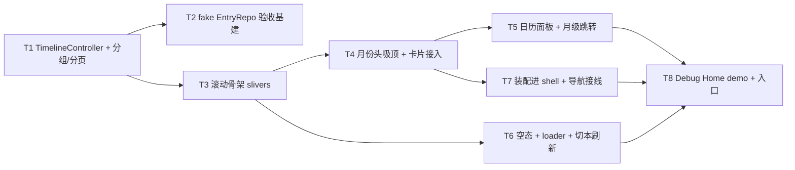

---
作者：@Ray
创建日期：2026-05-29
最后更新：2026-05-31
文档状态：定稿
---

# 任务列表：timeline-screen

## 任务依赖图
> 由各任务 inline「同 spec 依赖」字段汇总，仅供速览；以 inline 为准。


并行组：
- Group A：T1, T2（T2 仅依赖 T1 暴露的 Repo 接口形态可先并行起草）
- Group B：T3
- Group C：T4, T6
- Group D：T5, T7
- Group E：T8

（8 个任务；T8 完成即「时间线 v1 可在 Debug Home 走查」构成一个可演示切点 → 设里程碑 M1。）

里程碑：
- M1（T1–T8）：时间线主屏 v1——经 Debug Home 假数据可滚动、向上无限分页、月份头吸顶、点月份头落日历跳转（月级）、空/有内容两态、可开抽屉/FAB（装配进 shell）。

-----

- [ ] T1 · TimelineController（注入 EntryRepo + 游标分页 + 按月分组）

**同 spec 依赖：** 无 ｜ **跨 spec 依赖：** `data-layer：EntryRepo.timeline({cursor, limit=30}) / EntryRepo.byId / （新增·待确认）monthCounts / entryDaysInMonth`；`design-tokens-theme：intl 约定` ｜ **关联需求：** R2, R5, NF1 ｜ **依据设计：** D3, D4, D6 ｜ **可改文件：** `lib/ui/timeline/timeline_controller.dart`, `lib/ui/timeline/timeline_month_section.dart`

### 背景
本屏的取数与状态核心，也是 NF1（Repository 边界）的把守层：`ChangeNotifier` 持「按月分组后的 `List<MonthSection>` + 当前 cursor + isLoading + reachedEnd + 当前 journalId」，构造注入 `EntryRepo`（便于 demo/test 喂假数据）。按月分组逻辑（把 `timeline()` 扁平页聚合成 `MonthSection{year, month, count?, entries}`）归本任务。**`MonthSection` 数据模型与分组辅助归 `timeline_month_section.dart`；分页/跳月状态机归 `timeline_controller.dart`。** 月份篇数/有条目日按 D4：优先 `EntryRepo.monthCounts`/`entryDaysInMonth`（待确认交付物），就绪前用已加载分页就地累计降级。

### 实施
1. 定义 `MonthSection{int year; int month; int? count; List<TimelineEntry> entries}`（`TimelineEntry` = 卡片渲染所需的 entry 视图模型，仅含 id/标题/摘要/日期三元/标签/地点或心情/收藏/图列表，不持 Drift 行）。
2. `TimelineController({required EntryRepo repo})`：`loadInitial(String? journalId)` / `loadMore()`（带上次 cursor、isLoading 去重防并发、取尽置 reachedEnd）/ `jumpToMonth(int year, int month)`（不在已加载范围则连续 `loadMore` 直到加载到该月或到底）/ `switchJournal(String? journalId)`（重置游标列表 + 重查 + 置淡入标志）。
3. 分页结果按 `(year, month)` 聚合进 `MonthSection`；篇数取 `monthCounts` 交付物，未就绪降级为就地累计。
4. **边界**：本文件只 import `package:dayz/data/repositories/...`（Repo），**MUST NOT** import `package:dayz/data/database.dart` 或任何 Drift 类型。

### 验收标准（做完即止）
- 连续 `loadMore` 分页不重不漏、按 `(entry_dt_utc,id)` 倒序聚合月份（自动，注入假 Repo 断言 `MonthSection` 序列与条目集合）
- `loadMore` 进行中再次调用 MUST 不触发并发取页（自动，断言 repo.timeline 调用次数）
- 取尽后 `reachedEnd==true` 且后续 `loadMore` 不再调 repo（自动）
- `jumpToMonth(远期未加载月)` 后该月出现在已加载 `MonthSection` 中（自动）
- `switchJournal` 重置并以新 journalId 重查（自动，断言 repo 收到的 journalId）

### 验收方式
- 自动：
  ```bash
  flutter test test/ui/timeline/timeline_controller_test.dart
  ```
  （注入内存假 `EntryRepo`（T2），断言分页/分组/防并发/跳月补载/切本的**状态转移与 repo 调用**，非 grep 源文件）

### 验收记录
```
日期：—
自动：—
人工：N/A
```

-----

- [ ] T2 · 内存假 EntryRepo（验收基建，demo/test 共享）

**同 spec 依赖：** T1（依赖其消费的 `EntryRepo` 取数方法形态）｜ **跨 spec 依赖：** `data-layer：EntryRepo 取数方法签名` ｜ **关联需求：** R8, NF1 ｜ **依据设计：** D8 ｜ **可改文件：** `test/ui/timeline/fake_entry_repo.dart`

### 背景
demo（R8）与全部 widget/controller 测试共享的内存假 `EntryRepo`：实现 data-layer `EntryRepo` 用到的取数方法签名（`timeline`/`byId`/`monthCounts`/`entryDaysInMonth`），返回构造的假日记页（多月、跨年、含空态可配）。它不碰真实 DB，是 NF1「取数经 Repo 接口」可被独立验证的基础。**因 `fake_entry_repo.dart` 不是 `_test.dart`，属共享测试基建，由本任务 `验收基建` 字段预批。**

### 验收基建（预批共享测试文件）
- `test/ui/timeline/fake_entry_repo.dart`（本任务即创建它本身）

### 实施
1. `FakeEntryRepo implements EntryRepo`（或子集接口），可配「月数 / 每月条数 / 是否空 / 是否到底」。
2. `timeline({cursor, limit})` 返回确定性假页 + 下一页 cursor；`monthCounts`/`entryDaysInMonth` 返回与假数据一致的计数（供 T5 日历）。
3. 提供一个「空库」配置（供 R3 空态测试）。

### 验收标准（做完即止）
- 假 Repo 被 T1 controller 测试与 T8 demo 测试成功注入并驱动（自动，由引用它的测试通过间接验证）
- 同一配置多次 `timeline` 分页结果确定（不重不漏，可被 T1 断言）（自动）

### 验收方式
- 自动：
  ```bash
  flutter test test/ui/timeline/timeline_controller_test.dart
  ```
  （假 Repo 无独立测试，作为 T1/T8 的基建被其测试驱动验证；断言来自 controller/demo 行为，非 grep）

### 验收记录
```
日期：—
自动：—
人工：N/A
```

-----

- [ ] T3 · 时间线滚动骨架（CustomScrollView + 三类 sliver）

**同 spec 依赖：** T1 ｜ **跨 spec 依赖：** `ui-kit-components：DayzGlassAppBar(sliver) / DayzMonthHeader / DayzEntryCard`；`design-tokens-theme：context.dayz / DayzSpacing` ｜ **关联需求：** R1 ｜ **依据设计：** D1 ｜ **可改文件：** `lib/ui/timeline/timeline_page.dart`, `lib/ui/timeline/timeline_month_section.dart`

### 背景
搭 `TimelinePage` 的 `CustomScrollView`：slivers = `DayzGlassAppBar(pinned)` → 每个 `MonthSection`（`SliverPersistentHeader(pinned, DayzMonthHeader)` + `SliverList(DayzEntryCard)`）→ 尾部 loader 占位 sliver。本任务只搭结构与顺序（loader 文案态归 T6、吸顶阴影/卡片字段归 T4）。组件未就绪时用走 token 的最小内联占位，标 TODO 待替换（见 design 已知风险）。归属：sliver 编排在 `timeline_page.dart`；把单个月装成「持久头 + 列表」的辅助在 `timeline_month_section.dart`（与 T1 的数据模型同文件，T1 先建模型、本任务加构建辅助）。

### 实施
1. `TimelinePage(controller)` 监听 `TimelineController` 重建 slivers。
2. slivers 顺序：顶栏 sliver → for each `MonthSection`：`SliverPersistentHeader(pinned:true, delegate: 月份头)` + `SliverList(该月 DayzEntryCard)` → `SliverToBoxAdapter(loader 占位)`。
3. 每个月份头 delegate 挂一个稳定 `GlobalKey`（供 T5 跳转），`minExtent==maxExtent`（定高）。

### 验收标准（做完即止）
- 渲染后 sliver 顺序为「顶栏 → (月份头, 该月卡片)* → loader」，顶栏 pinned 滚动不离场（自动，widget test：滚动后 `find` 顶栏仍在视口顶部）
- 同一月卡片归在该月月份头之下、下一月头出现在其后（自动，`tester.getRect` 断言月份头 top < 其月卡片 top < 下一月头 top）
- 多月时任一时刻至多一个月份头停靠在顶栏正下方（自动，滚到月交界处断言 pinned 头数量与位置）

### 验收方式
- 自动：
  ```bash
  flutter test test/ui/timeline/timeline_page_skeleton_test.dart
  ```
  （pump `TimelinePage` + 假 Repo，`tester.getRect`/`find` 断言 sliver 顺序与 pinned 行为，非 grep）

### 验收记录
```
日期：—
自动：—
人工：N/A
```

-----

- [ ] T4 · 月份头吸顶阴影 + 卡片字段/收藏星/点击进阅读屏

**同 spec 依赖：** T3 ｜ **跨 spec 依赖：** `ui-kit-components：DayzMonthHeader / DayzEntryCard / DayzGallery / DayzFavoriteStar`；`ui-shell-navigation：Routes.reader`；`design-tokens-theme：context.dayz.shadow* / intl` ｜ **关联需求：** R1, R6, NF8 ｜ **依据设计：** D2, D9 ｜ **可改文件：** `lib/ui/timeline/timeline_page.dart`, `lib/ui/timeline/timeline_month_section.dart`, `lib/ui/strings/app_strings.dart`

### 背景
月份头持久头 delegate 仅在 `overlapsContent==true` 时给底部 `BoxShadow`（取 `context.dayz.shadow*`），等价原型 `.stuck`、原生判定无需 scroll listener（D2）。卡片按 entry 视图模型渲染日期列（日/英文月缩写/周几，走 intl）/标题/摘要/九宫格（`DayzGallery` 接 `ImageProvider` 占位）/标签/地点或心情 meta/收藏星（收藏时 `DayzFavoriteStar`）；整卡点击 `context.go(Routes.reader, ...)` 携 entryId（R6）。月份头「YYYY · N 篇」走 intl。本任务向 `app_strings.dart` 追加本屏文案常量（D9，见验收基建）。

### 验收基建（预批共享测试文件）
- `test/ui/timeline/timeline_params.fixture.json`（样式参数清单 fixture，供月份头/卡片样式参数闸断言；由 design-sync-automation 抽取产出，本任务消费/可补录本屏元素）

### 实施
1. 月份头持久头 delegate：`overlapsContent` 为真时叠 `context.dayz` 阴影、为假时无阴影。
2. 卡片：从 `TimelineEntry` 映射到 `DayzEntryCard`/`DayzGallery`/`DayzFavoriteStar`；日期/篇数经 `package:intl` 格式化；文案引 `AppStrings`。
3. 整卡 `onTap` → `context.go(Routes.reader, extra/path: entryId)`（shell 未就绪用占位回调，标 TODO）。
4. 向 `lib/ui/strings/app_strings.dart` 追加本屏键（**仅追加、不改既有结构**；若文件尚不存在则停下与 ui-kit 协调，见 design 已知风险）。

### 验收标准（做完即止）
- 月份头吸顶（overlapsContent）时存在底部阴影、未吸顶时无阴影（自动，pump 在吸顶/未吸顶两态断言 delegate 输出含/不含 `BoxShadow`）
- 收藏 entry 卡片渲染 `DayzFavoriteStar`、非收藏不渲染（自动，按 widget 类型 find）
- 点击卡片触发导航且携正确 entryId（自动，注入假路由/导航观察器断言收到 `Routes.reader` + entryId）
- 月份头篇数与卡片日期为 intl 格式化结果，文案用 `find.text(AppStrings.xxx)`（自动，断言 intl 输出而非裸中文）

### 禁止
- 不在卡片 build 路径内同步解码大图 / 触发缩略图重建（NF2，归 T 无——结构上由只接 `ImageProvider` 保证）

### 验收方式
- 自动：
  ```bash
  flutter test test/ui/timeline/timeline_card_header_test.dart
  ```

### 验收记录
```
日期：—
自动：—
人工：N/A
```

-----

- [ ] T5 · 日期跳转日历面板 + 月级定位

**同 spec 依赖：** T4 ｜ **跨 spec 依赖：** `ui-kit-components：dayzMotionDuration`；`design-tokens-theme：context.dayz / DayzRadii / AppStrings / intl` ｜ **关联需求：** R4, R5, NF3, NF5, NF6 ｜ **依据设计：** D5, D6 ｜ **可改文件：** `lib/ui/timeline/timeline_calendar_panel.dart`, `lib/ui/timeline/timeline_page.dart`, `lib/ui/strings/app_strings.dart`

### 背景
点月份头落下日历面板（`PopupRoute` 从顶部下落 + barrier=scrim），自绘月视图（7 列日格，`.has`/`.today`/`.pad` 态）/年视图（3 列月格，`.has`/`.cur` + 篇数），选日/月后 `TimelineController.jumpToMonth` 先补载目标月 → `addPostFrameCallback` 对该月 `GlobalKey` 调 `Scrollable.ensureVisible`（月级定位，D6）。scrim 点击或再点同一月份头关闭。面板 `role=dialog` + 「跳转到日期」语义、「回到今天」按钮（NF5）；落下/收起经 `dayzMotionDuration`（NF6）；日格/月格命中区 ≥44（NF3）。「有条目日/月」取 T1 controller 的 `entryDaysInMonth`/`monthCounts`（D4 降级口径）。

### 实施
1. `TimelineCalendarPanel`：`PopupRoute` 自定义 transition（顶部下落），barrier 半透 `context.dayz.overlay`。
2. 月视图自绘 `GridView`（星期行 + 日格），态按 controller 计数数据；年视图 3 列月格。
3. 选「有条目的日/月」→ 关闭 + `controller.jumpToMonth` → 帧后 `Scrollable.ensureVisible` 该月 `GlobalKey`（alignment 顶对齐，停靠到顶栏下）。
4. 语义/文案：dialog 标签、回到今天、星期名等走 `AppStrings`/intl；日格命中区 padding 到 ≥44。

### 验收标准（做完即止）
- 点月份头打开面板、点 scrim / 再点同月份头关闭（自动，widget test 断言面板出现/消失）
- 选远期未加载月后，该月 `MonthSection` 被补载且该月份头滚入视口顶部（停靠顶栏下）（自动，断言滚动后该月头 rect 在顶栏下方）
- 日历面板 dialog 语义可被 `find.bySemanticsLabel(AppStrings.jumpToDate)` 定位（自动，NF5）
- 日格/月格命中区 ≥ 44×44（自动，`tester.getRect` 断言尺寸，NF3）
- `MediaQueryData(disableAnimations:true)` 下面板落下时长为 0（自动，NF6）

### 验收方式
- 自动：
  ```bash
  flutter test test/ui/timeline/timeline_calendar_panel_test.dart
  ```

### 验收记录
```
日期：—
自动：—
人工：N/A
```

-----

- [ ] T6 · 空状态 + loader 文案态 + 切本刷新淡入

**同 spec 依赖：** T3 ｜ **跨 spec 依赖：** `ui-kit-components：DayzEmptyState / dayzMotionDuration`；`design-tokens-theme：context.dayz / AppStrings` ｜ **关联需求：** R3, R7（切本刷新部分）, NF6 ｜ **依据设计：** D3, D7, D9 ｜ **可改文件：** `lib/ui/timeline/timeline_loader.dart`, `lib/ui/timeline/timeline_page.dart`, `lib/ui/strings/app_strings.dart`

### 背景
三件：① 空态——当前 journalId 条目数 0 时渲染 `DayzEmptyState`（插画 + 标题 +「轻点右下角写第一页」引导），隐藏月份头/列表/loader（R3）。② loader sliver 文案态——加载中「载入更早…」转圈、取尽「已经到最早的一篇了」终态（R2 的可视部分）。③ 切本刷新——`TimelineController.switchJournal` 后列表淡入重演（`AnimatedSwitcher`/`FadeTransition`，经 `dayzMotionDuration`，reduce-motion 下瞬时，NF6）。文案均走 `AppStrings`（追加到共享文件，见 design D9/已知风险）。

### 实施
1. 空态分支：controller 报告空时渲染 `DayzEmptyState`，列表/loader sliver 不构建。
2. `timeline_loader.dart`：isLoading→转圈 + 「载入更早…」；reachedEnd→「已经到最早的一篇了」终态（文案 `AppStrings`）。
3. 切本：列表区包 `AnimatedSwitcher`（duration 经 `dayzMotionDuration`），切 journalId 时淡入。

### 验收标准（做完即止）
- 空库（假 Repo 空配置）时只渲染 `DayzEmptyState`、不渲染月份头/列表/loader（自动，按 widget 类型 find 断言存在/不存在）
- 加载中显示 loader 转圈 + `AppStrings.loadingEarlier`、reachedEnd 显示 `AppStrings.reachedOldest`（自动，`find.text`）
- 切 journalId 触发淡入；`disableAnimations:true` 时切换时长为 0（自动，NF6）

### 验收方式
- 自动：
  ```bash
  flutter test test/ui/timeline/timeline_empty_loader_test.dart
  ```

### 验收记录
```
日期：—
自动：—
人工：N/A
```

-----

- [ ] T7 · 装配进 app_shell + 顶栏/FAB/抽屉导航接线

**同 spec 依赖：** T4 ｜ **跨 spec 依赖：** `ui-shell-navigation：app_shell / Routes.timeline,search,onthisday,editor / ShellState(当前 journalId + 切本事件流) / fab_speed_dial`；`ui-kit-components：DayzGlassAppBar` ｜ **关联需求：** R7, NF1, NF7 ｜ **依据设计：** D7 ｜ **可改文件：** `lib/ui/timeline/timeline_page.dart`

### 背景
把 `TimelinePage` 作为 `Routes.timeline` 的 body 放进 `app_shell`（drawer + FAB + SafeArea 让位由 shell 提供）：顶栏菜单钮开抽屉、搜索钮→`Routes.search`、往年今日钮→`Routes.onthisday`；FAB 轻点→`Routes.editor`、长按展开（shell 的 speed-dial）；接 shell 注入的当前 journalId + 切本事件流 → `TimelineController.switchJournal`。本屏只**消费** shell 注入与 `Routes` 常量，取数仍只经 controller→Repo（NF1）。shell 未就绪时 demo 路径用最小 Scaffold 包裹（仅 demo，不进生产路径，归 T8）。

### 实施
1. `TimelinePage` 接收 shell 注入的 journalId（或经 `ShellState` 监听），变化时调 `switchJournal`。
2. 顶栏（`DayzGlassAppBar`）菜单钮→开 shell drawer；搜索钮→`context.go(Routes.search)`；往年今日钮→`context.go(Routes.onthisday)`。
3. FAB（shell speed-dial）轻点→`Routes.editor`（接线归 shell，本屏确认 body 放进 shell 脚手架且让位正确）。

### 验收标准（做完即止）
- 切本事件触发 `TimelineController.switchJournal`（自动，注入假 ShellState/事件断言 controller 收到新 journalId）
- 搜索钮/往年今日钮点击发起对应 `Routes` 导航（自动，导航观察器断言目标路由）
- 本屏不 import `lib/data/database.dart`、不含 Drift 句柄（自动，见 verification NF1 静态核验；本任务以「取数只经 controller」结构保证）

### 验收方式
- 自动：
  ```bash
  flutter test test/ui/timeline/timeline_shell_wiring_test.dart
  ```
  （注入假 ShellState + 导航观察器，断言切本/导航行为，非 grep）

### 验收记录
```
日期：—
自动：—
人工：N/A
```

-----

- [ ] T8 · Debug Home demo + 入口

**同 spec 依赖：** T5, T6, T7 ｜ **跨 spec 依赖：** 无（demo 用本屏自带最小 Scaffold + 假 Repo，不强依赖 shell 就绪）｜ **关联需求：** R8 ｜ **依据设计：** D8 ｜ **可改文件：** `lib/demo/timeline_demo.dart`, `lib/demo/demo_entry.dart`

### 背景
用内存假 `EntryRepo`（T2）注入 `TimelineController`，在一台模拟设备框内渲染 `TimelinePage`（可滚动/向上分页/开日历面板/切空与有内容两态/开抽屉与 FAB），作为真机走查与可独立 pump 的 widget 测试入口。`lib/demo/demo_entry.dart` 的 `demos` 列表**末尾追加一行**（不插中间、不改 `DemoEntry` 字段）。

### 实施
1. `lib/demo/timeline_demo.dart`：构造假 Repo（多月 + 可切空配置）→ `TimelineController` → `TimelinePage`（shell 未就绪时用最小 Scaffold 包裹，仅 demo）。
2. `demo_entry.dart`：在 `demos` 末尾追加 `DemoEntry(title: '时间线屏 demo', subtitle: '...', builder: (context) => const TimelineDemo())`。

### 验收标准（做完即止）
- demo 进入后渲染时间线、可向下滚触发 `loadMore`、可切空/有内容（自动，pump demo 断言行为）
- `demos` 末尾新增一条且指向 `TimelineDemo`、其余条目顺序不变（自动，断言 `demos.last` 标题/builder 类型，且 `demos.length` 较基线+1）

### 禁止
- 不在 `demos` 中间插入、不修改 `DemoEntry` 字段

### 验收方式
- 自动：
  ```bash
  flutter test test/demo/timeline_demo_test.dart
  ```

### 验收记录
```
日期：—
自动：—
人工：N/A
```
