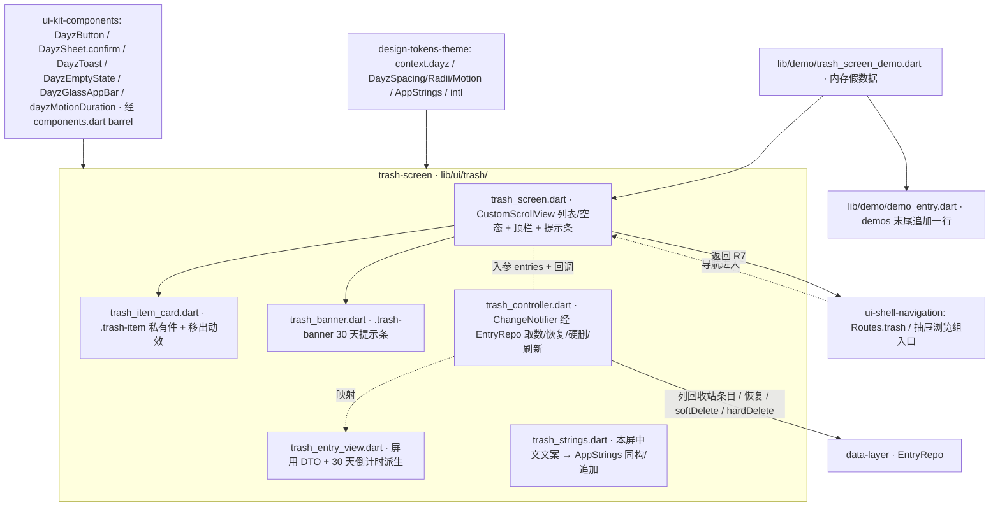

---
作者：@Ray
创建日期：2026-05-29
最后更新：2026-05-29
文档状态：草稿
---

# 设计：trash-screen

> 视觉与映射依据：源屏真源 [`ui-design/current/pages/screens/trash.html`](../../../ui-design/current/pages/screens/trash.html)（`?state=default`/`?state=empty` + 屏内 `.trash-*` 私有样式 + 恢复/彻底删/清空脚本）；组件类名与降级 [`ui-design/current/docs/DESIGN-REF.md`](../../../ui-design/current/docs/DESIGN-REF.md) §3（`.btn`/toast/sheet/`.empty`）/ §3c（屏内一次性件 `.trash-*` 不登记不复用）；HTML→Flutter 机制映射 [`ui-design/current/docs/PROTOTYPE-ARCH.md`](../../../ui-design/current/docs/PROTOTYPE-ARCH.md) §6（「回收站 `trash.html` → 按 `deleted_at` 筛选查询；恢复 = 清 `deleted_at`，彻底删 = 真 DELETE；30 天后台清理」`showModalBottomSheet`/`ScaffoldMessenger`/`CupertinoPageRoute`）；四闸验证口径 [`docs/design/10-ui-restore-and-design-sync.md`](../../../docs/design/10-ui-restore-and-design-sync.md) §4/§11。复用词汇来自 `ui-kit-components`（`DayzButton`/`DayzSheet.confirm`/`DayzToast`/`DayzEmptyState`/`DayzGlassAppBar`/`AppStrings`/`dayzMotionDuration`，经 `lib/ui/components.dart` barrel）、`ui-shell-navigation`（`Routes.trash`/`Routes.timeline`、抽屉「浏览组」入口）、`design-tokens-theme`（`context.dayz.*`/`DayzSpacing`/`DayzRadii`/`DayzMotion`/`intl`）、`data-layer`（`EntryRepo`）。

## 技术决策

### D1 · 屏目录与私有样式归属（`.trash-*` 不进 ui-kit）
- **状态：** 采纳
- **背景：** DESIGN-REF §3c 末行明确「回收站 `.trash-*` 等屏内一次性样式不登记、不复用，直接写在各自 `screens/*.html`」；`ui-kit-components` D7 也显式把 `.trash-*` 排除在组件层之外（只收跨屏的 `.empty`）。本屏需 banner / item 卡 / 元信息行 / purge 危险钮等屏内私有件。
- **选项：** (A) 把 `.trash-item` 等提进 `ui-kit-components` 当复用件；(B) 屏内私有 widget 落 `lib/ui/trash/`，仅复用 ui-kit 已登记的通用件（按钮/sheet/toast/空态）；(C) 全屏自绘、连按钮也不复用 ui-kit。
- **选择：** B。屏体与 `.trash-*` 私有件全部落 `lib/ui/trash/`（页面级 spec 的家，方法论 §1/§9）；通用件一律复用 ui-kit barrel（`DayzButton`「恢复」=`.btn-soft.btn-sm`、「彻底删除」=`.btn-text.btn-sm`+危险态；`DayzSheet.confirm` 二次确认；`DayzToast` 反馈；`DayzEmptyState` 空态；`DayzGlassAppBar` 顶栏壳）。私有件视觉值仍读 token（NF7）。
- **理由：** 严守 DESIGN-REF §3c / ui-kit D7 的「`.trash-*` 不进组件层」边界，避免把一次性件污染共享层；同时最大化复用已登记通用件，不另造同义物。
- **代价：** `.trash-item` 卡只服务本屏、不跨屏复用；与设计稿定位一致，可接受。

### D2 · 列表渲染：`CustomScrollView` + `DayzGlassAppBar` sliver
- **状态：** 采纳
- **背景：** 源屏是覆盖式固定头 `.app-top`（返回 + 标题「回收站」+「清空」）+ 唯一滚动区 `.app-scroll`（提示条 + 列表 / 空态）；PROTOTYPE-ARCH §6 把覆盖式毛玻璃顶栏映射为 `extendBodyBehindAppBar + SliverAppBar(BackdropFilter)`，顶栏壳本体归 ui-kit（`DayzGlassAppBar`，shell D9）。回收站列表中等规模、无无限滚动、无吸顶子头。
- **选项：** (A) `Scaffold(appBar: AppBar)` + `ListView`；(B) `CustomScrollView`（`DayzGlassAppBar` sliver + `SliverToBoxAdapter` 提示条 + `SliverList` 卡片）；(C) 自绘顶栏 + 普通滚动。
- **选择：** B。`CustomScrollView`：顶栏走 `DayzGlassAppBar`（leading=返回钮、title=「回收站」、actions=「清空」`DayzButton.text` 危险色）；提示条用 `SliverToBoxAdapter` 包 `_TrashBanner`；列表用 `SliverList`/`SliverChildBuilderDelegate` 渲 `_TrashItemCard`；空态用单个 sliver 居中 `DayzEmptyState`。列表态 vs 空态由状态切换（同一 widget 按 `entries.isEmpty` 渲染，对应源屏 `data-when="default"/"empty"`，呼应 PROTOTYPE-ARCH §6「`?state=` 多状态 → 同一 widget 按 state 渲染」）。
- **理由：** 复用 ui-kit 顶栏壳的覆盖式毛玻璃 + `--top-h` 让位（`SafeArea`），与项目其它屏一致；sliver 结构清晰分隔提示条 / 列表 / 空态三块，几何闸好断。
- **代价：** `CustomScrollView` 比裸 `ListView` 略繁；但与外壳一致、复用顶栏壳，净省。
- ⚠️ 若 `DayzGlassAppBar` 交付物未就绪，降级用 ui-kit 占位顶栏 / 内联最小顶栏（仅返回 + 标题 + 清空，走 token），与 shell D9 同款降级（记已知风险）。

### D3 · 删除链路闭环：本屏只消费软删结果 + 收口硬删确认
- **状态：** 采纳
- **背景：** 产品红线「删除 = 移到回收站」要求 reader/onthisday/时间线的删除是「二次确认 + 可撤销 toast → `EntryRepo.softDelete`」，条目落回收站；回收站再给恢复/硬删。PROTOTYPE-ARCH §6 把整链映射为「按 `deleted_at` 筛选查询；恢复 = 清 `deleted_at`，彻底删 = 真 DELETE」。删除发起方按钮分散在多个页面级 spec。
- **选项：** (A) 本 spec 连 reader/onthisday 的删除按钮一并实现；(B) 本 spec 只负责回收站屏自身（列出软删条目 + 恢复 + 硬删二次确认 + 清空），删除发起方按钮归各自屏 spec，删除链路语义作为跨屏约定写进 requirement R1 前提；(C) 不区分，谁先写谁实现。
- **选择：** B。本屏文件变更只含 `lib/ui/trash/`；发起方删除按钮 + 其可撤销 toast 不进本 spec（范围外显式声明）。本屏自身的「彻底删除 / 清空」二次确认走 `DayzSheet.confirm`（ui-kit D4 命名工厂），危险态文案 + 图标对齐源屏脚本（`DZ.confirm({title,desc,confirmLabel,icon,onConfirm})`）。
- **理由：** 守 spec-guide「可改文件 ⊆ 本 spec 文件变更、不列别屏文件」与方法论「每屏 task 的家 = 该屏 spec」；删除发起方与回收站出口解耦，各屏独立推进。
- **代价：** 删除链路端到端需多个 spec 协同才完整；本 spec 单独验证只能到「给定软删数据 → 列表/恢复/硬删」这一段（端到端串联记入 verification 的跨屏说明 + 已知风险），可接受。

### D4 · 移出动效 + reduce-motion 门
- **状态：** 采纳
- **背景：** 源屏 `.trash-item.removing { opacity:0; transform:translateX(28px) }` + `transition .26s var(--ease)`，移除后 280ms 真正从 DOM 摘除并 `checkEmpty()`；清空时全部卡同时加 `.removing`。NF5 要求 reduce-motion 降级为瞬时。
- **选项：** (A) `AnimatedList` + `removeItem` 动画；(B) 每卡 `AnimatedOpacity`+`AnimatedSlide`（或 `TweenAnimationBuilder`）控制移出，时长经 `dayzMotionDuration`；(C) 无动效直接 `setState` 移除。
- **选择：** B 为主（卡用透明 + 右移过渡，时长 = `dayzMotionDuration(context, DayzMotion.dur≈0.26s)`，`disableAnimations` 真时为 `Duration.zero` 瞬移），动画结束回调后从数据列表移除并触发空态判定；清空 = 全部卡并发同款过渡后整列清空。
- **理由：** 透明+位移过渡用内置动画 widget 即可精确还原源屏，无需 `AnimatedList` 的复杂索引管理；reduce-motion 统一经 ui-kit 的 `dayzMotionDuration` 门（NF5、ui-kit D11），单点可测、杜绝漏判。
- **代价：** 并发清空动效需统一时长协调；可接受。

### D5 · 状态持有：屏级最小状态 + Repo 取数在外（NF5）
- **状态：** 采纳
- **背景：** 本屏要列「全部软删条目」、做恢复/硬删后即时更新列表与空态。取数/删/恢复经 `EntryRepo`，但 NF5 硬约束「屏组件不持 Repo 句柄、不持 Drift」，且要可用假数据独立 widget test。
- **选项：** (A) 屏内直接 new EntryRepo / 持 Repo 实例；(B) 屏组件接收 `entries` 列表 + 四个回调（`onRestore(id)`/`onPurge(id)`/`onEmptyAll()`/`onBack()`）作入参，由外层（状态持有者 `TrashController`）经 `EntryRepo` 取数 + 执行 + 刷新列表；(C) 全局状态库。
- **选择：** B。`TrashScreen` 纯展示 + 发事件（接 `List<TrashEntryView>` + 回调）；`TrashController`（最小 `ChangeNotifier`，与 shell `theme_controller` 同构）经 `EntryRepo` 取「列回收站条目」、调恢复/硬删、刷新状态。`TrashEntryView` = 屏用 DTO（id / 标题 / 删除日期 / 摘要 / `deletedAt` / 派生「N 天后清除 = deletedAt+30d - now」），由 controller 从 `EntryRepo` 结果映射，**不暴露 Drift 行类型给屏**。
- **理由：** 守 NF5（取数集中在 controller 一处过 `EntryRepo`，屏不碰 Repo/Drift）；屏可用内存假 `TrashEntryView` 列表 + mock 回调做 widget test 独立验证（恢复/硬删/清空/空态全可断）。
- **代价：** 多一层 controller + DTO 映射；换来边界清晰 + 可测，值。

### D6 · 30 天倒计时与日期格式化走 `intl`（不自拼）
- **状态：** 采纳
- **背景：** 源屏元信息「5月 24 · 周六」「删除于 3 天前 · 27 天后清除」是日期 + 相对时间格式化高频区；tokens-theme D4 / ui-kit D10 拍板「日期/数字走 `package:intl`，MUST NOT 自拼 `'2026年5月'`」。30 天清除阈值 = `deletedAt + Duration(days:30)`，剩余天数 = 阈值 - now。
- **选项：** (A) 手拼字符串；(B) `intl` `DateFormat` 格式日期 + 自算剩余天数 + `AppStrings` 模板拼相对文案。
- **选择：** B。删除日期用 `DateFormat`（中文 locale，月/日/周）；「N 天前 / N 天后清除」的「N」由 `(now - deletedAt).inDays` / `(threshold - now).inDays` 计算，文案模板（「删除于 {n} 天前 · {n} 天后清除」「N 天后清除」）进 `AppStrings`（带数字插值）；30 天阈值常量 = `kTrashRetentionDays = 30`（本屏常量，**与后台清理任务的同名阈值须一致**，记已知风险/待确认）。
- **理由：** 落实「集中可验收」，避免散落硬编码日期；阈值集中常量便于与后台清理对齐。
- **代价：** 阈值在两处（本屏显示 + 后台清理）须保持一致——若 data-layer/后台清理给出权威常量则本屏引用之（待确认），否则本屏自持并标注须对齐。

### D7 · 顶栏「清空」语义与空态守卫
- **状态：** 采纳
- **背景：** 源屏脚本：点「清空」时若 `.trash-item` 数为 0 → `DZ.toast("回收站已经是空的")` 不弹 sheet；否则弹清空确认 sheet。空态下顶栏「清空」仍在位。
- **选择：** 顶栏「清空」`DayzButton.text`（危险色）始终渲染；`onEmptyAll` 回调先判 `entries.isEmpty`：空 → `DayzToast` 中性提示「回收站已经是空的」、不弹 sheet；非空 → `DayzSheet.confirm` → 确认后清空。空态屏仍显「清空」（点击走「已经是空的」分支），与源屏一致。
- **理由：** 1:1 还原源屏交互分支，避免空态把「清空」隐藏造成与原型不一致。
- **代价：** 空态下保留一个无实际删除作用的按钮；与设计稿一致，刻意为之。

## 架构

## 文件变更

> 这是本 spec 任务「可改文件」的**唯一来源与上界**；任一任务可改文件 MUST ⊆ 本清单。新建 Dart 文件 MUST 加 MPL-2.0 头注（模板见 AGENTS.md / README「License」）。全部业务文件落 `lib/ui/trash/`（页面级 spec 的家），不列入 ui-kit（`lib/ui/widgets`、`lib/ui/shell`）/ tokens（`lib/ui/theme`）/ data（`lib/data`）等别 spec 文件。

**屏体与私有件 `lib/ui/trash/`**
- `lib/ui/trash/trash_screen.dart`        新建（`CustomScrollView`：`DayzGlassAppBar`(返回/标题「回收站」/「清空」) + 提示条 + 列表/空态切换；接 `List<TrashEntryView>` + 回调，纯展示发事件，D2/D5/D7）
- `lib/ui/trash/trash_item_card.dart`      新建（`.trash-item` 私有件：日期/标题/两行截断摘要/元信息行/「恢复」`DayzButton.soft.sm`/「彻底删除」`DayzButton.text.sm`+危险态；移出动效经 `dayzMotionDuration`，D1/D4，NF2/NF4）
- `lib/ui/trash/trash_banner.dart`         新建（`.trash-banner` 30 天提示条：时钟图标 + 文案，走 token，R6/D1）
- `lib/ui/trash/trash_entry_view.dart`     新建（屏用 DTO：id/标题/删除日期/摘要/`deletedAt` + 派生「N 天后清除」；不暴露 Drift 行，D5/D6）
- `lib/ui/trash/trash_controller.dart`     新建（`ChangeNotifier`：经 `EntryRepo` 列回收站条目/恢复/硬删/清空并刷新；映射到 `TrashEntryView`，D5，NF5）
- `lib/ui/trash/trash_strings.dart`        新建（本屏中文文案集中：「回收站」「清空」「恢复」「彻底删除」「永久删除？」「清空回收站？」及 intl 模板等。**待确认**：若 `ui-kit-components` 的 `AppStrings` 单类已落地，则改为向其追加而非新建——归属随 ui-kit/shell `AppStrings` 协调，见已知风险）

**Debug Home 入口 `lib/demo/`**
- `lib/demo/trash_screen_demo.dart`        新建（内存假 `TrashEntryView` 列表 + mock 回调，可切默认态/空态，演示恢复/彻底删/清空，R8）
- `lib/demo/demo_entry.dart`               修改（**仅末尾追加一行**，不插中间、不改 `DemoEntry` 字段）

**测试目录（白名单 hook 对 `test/**/*_test.dart` 自动放行；非 `_test.dart` 共享基建由任务 `验收基建` 字段预批）**
- `test/ui/trash/`                         新建（屏 / 卡片 / 提示条 / controller / DTO 的 widget & 单元测试）
- `test/demo/trash_screen_demo_test.dart`  新建（demo + Debug Home 入口测试）

> 不触 `pubspec.yaml`：本屏所需 `flutter_svg`（提示条/危险图标）、`intl`（SDK 传递依赖）均由 `design-tokens-theme` / `ui-kit-components` 引入，本 spec 不新增依赖。若实现时发现需新增依赖（如某图标/动画包），MUST 停下回填本清单 + 请求确认（spec-guide P2 / 方法论 §10 第 7 条），不擅自改 pubspec。

## 已知风险

- **EntryRepo「恢复」与「列回收站条目」交付物缺口（跨 spec 依赖，待确认 / 阻塞门）**：`data-layer` 当前设计的 `EntryRepo` 只显式交付 `softDelete(id)` / `hardDelete(id)`，且 `timeline`/`onThisDay`/`byId` 查询**默认过滤 `deleted_at IS NULL`**——本屏所需的两件**尚未在 data-layer 设计里显式存在**：① **「列回收站条目」查询**（返回 `deleted_at` 非空、含删除时间戳，供本屏列表与倒计时）；② **「恢复」方法**（清 `deleted_at`，对应 PROTOTYPE-ARCH §6「恢复 = 清 `deleted_at`」）。处理：在 README「依赖」列登记 `data-layer`，按交付物名引用这两件；本 spec **MUST NOT 自行写 Drift/SQL 绕过 NF5** 去补这两件。执行前须**停下与 data-layer 对齐**：要么 data-layer 补这两个 `EntryRepo` 入口（推荐，归属 data-layer），要么开小 spec/在 data-layer 加任务卡。data-layer 就绪前本屏只能用内存假数据跑 demo / widget test（不接真 Repo）。
- **30 天阈值常量须与后台清理一致（D6，待确认）**：本屏显示「N 天后清除」用 `kTrashRetentionDays=30`；后台「30 天到期 `hardDelete`」清理任务（范围外，属 data-layer/后台）若给出权威阈值常量，本屏 MUST 引用之以免两处漂移（显示倒计时与实际清理时机不一致是产品 bug）。当前两处阈值均为 30 但来源未统一，标待确认。
- **删除链路端到端依赖多 spec（D3）**：reader/onthisday 等屏的删除发起按钮 + 可撤销 toast 归各自 spec；「软删 → 落回收站 → 恢复 → 回时间线」的完整闭环只有在那些 spec + 本 spec + data-layer 全就绪后才能端到端验证。本 spec 单独验证范围 = 「给定软删数据 → 列表渲染 / 恢复 / 硬删 / 清空 / 空态」；端到端串联记入 verification「跨屏说明」，不在本 spec 单任务验收强求。
- **媒体级联清理不在本屏（范围外）**：「彻底删除」只调 `EntryRepo.hardDelete(id)`；条目关联媒体文件的级联硬删 / 文件清理归 `media-storage` / 后台清理（媒体 key 独立、文件 IO 不在 DB 事务内等红线见 `docs/design/06/09`）。本屏 MUST NOT 直接删媒体文件或写媒体表。
- **跨 spec 依赖未就绪的降级（按交付物名引用，可能尚未实现）**：
  - `design-tokens-theme`（README 依赖列已登记）：`context.dayz.*`、`DayzSpacing/DayzRadii/DayzMotion`、`AppStrings` 约定、`intl`、六套主题。**强依赖**，未定稿则本屏被阻塞。
  - `ui-kit-components`（README 依赖列已登记）：`DayzButton`/`DayzSheet.confirm`/`DayzToast`/`DayzEmptyState`/`DayzGlassAppBar`/`dayzMotionDuration`/`AppStrings` 单类落点（经 `lib/ui/components.dart`）。**未就绪时降级**：sheet 用裸 `showModalBottomSheet`、toast 用裸 `ScaffoldMessenger`、顶栏用内联占位（走 token）、空态内联——但优先等其就绪以免造同义物（shell D9 同款降级思路）。
  - `ui-shell-navigation`（README 依赖列已登记）：`Routes.trash`（进入本屏的路由名）、`Routes.timeline`（恢复/返回回时间线）、抽屉「浏览组 → 回收站」入口。**未就绪时降级**：demo 直接构造本屏、返回用 `Navigator.pop`；真接线待 shell 就绪。
  - `data-layer`（README 依赖列已登记，且见上「交付物缺口」）：`EntryRepo`（列回收站条目 / 恢复 / `hardDelete`）。**未就绪时降级**：controller 用内存假数据 + mock 回调，不接真 Repo。**MUST NOT 为赶进度在屏/controller 直接写 Drift/SQL**（NF5 红线）。
  - `design-sync-automation`（**非 README 依赖**，仅验证基建关系）：参数/几何抽取 harness、`element-map.yaml`、区域化 SSIM 兜底属其交付物；本屏的样式参数 / 几何断言用 Flutter 原生 `tester.getRect` / 解析 widget 属性自验，**不依赖 harness 就绪**；需「对设计稿源屏 `trash.html` 比框 / SSIM」的部分留给 design-sync 期二，不在本 spec 重造。golden 基线本 spec 自带（任务「验收基建」预批）。
- **`AppStrings` 落点二义（D1/D6，待确认）**：tokens-theme D4 拍板「单个 `AppStrings` 类」，ui-kit D10 首建该文件。本屏文案应**向 ui-kit 的 `AppStrings` 追加**而非新建；若执行时 ui-kit `AppStrings` 已就绪，则 `trash_strings.dart` 改为「向 `lib/ui/strings/app_strings.dart` 追加本屏条目」——但**追加别 spec 的文件属白名单外**，须在 README/ui-kit 协调归属后，把该文件列入本 spec 任务白名单或由 ui-kit 侧增补。当前先以本屏 `trash_strings.dart`（同构常量类）承载，标待确认。
- **截断/行钳制须进参数闸（方法论 §4 ②）**：摘要 `.ti-ex` 是 `-webkit-line-clamp:2` + `overflow:hidden`，Flutter 对应 `maxLines:2` + `overflow: TextOverflow.ellipsis` + `softWrap:true`——这是「样式全对但该截没截」的真 bug 高发点，验收须断言这三参数（verification 样式参数闸），不只断块高。
- **无持久化 schema 变更**：本屏不新增/改 DB schema（软删字段 `deleted_at` 由 data-layer 既有 schema 提供，本屏只读/经 Repo 改），→ 无数据迁移/回滚要素。
