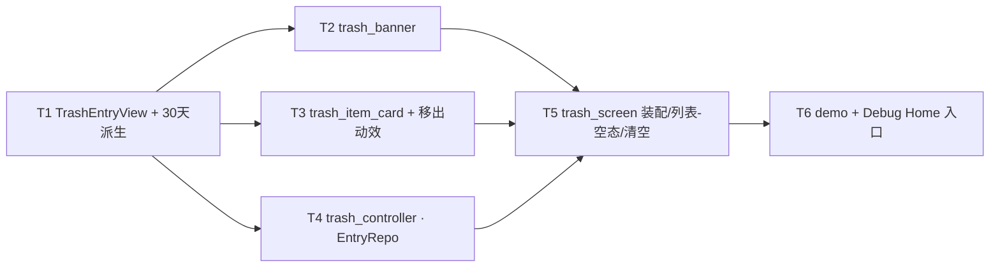

---
作者：@Ray
创建日期：2026-05-29
最后更新：2026-05-29
文档状态：草稿
---

# 任务列表：trash-screen

## 任务依赖图
> 由各任务 inline「同 spec 依赖」字段汇总，以 inline 为准。



并行组：
- Group A：T1
- Group B：T2, T3, T4（均依赖 T1，可并行）
- Group C：T5（依赖 T2+T3+T4）
- Group D：T6（依赖 T5）

（单屏一体、无可独立部署/演示的中间切点 → 不设里程碑。）

-----

- [ ] T1 · TrashEntryView 屏用 DTO + 30 天倒计时派生

**同 spec 依赖：** 无 ｜ **跨 spec 依赖：** `design-tokens-theme`：`intl`（SDK 传递依赖）、`AppLocalizations`/`DayzMotion` 约定；`i18n-localization`：gen-l10n ｜ **关联需求：** R1, R6 ｜ **依据设计：** D5, D6 ｜ **可改文件：** `lib/ui/trash/trash_entry_view.dart`、`lib/l10n/arb/app_zh.arb`、`lib/l10n/arb/app_en.arb`、`lib/l10n/gen/app_localizations.dart`、`lib/l10n/gen/app_localizations_zh.dart`、`lib/l10n/gen/app_localizations_en.dart` ｜ **验收基建：** 无（测试文件 `test/ui/trash/trash_entry_view_test.dart` 由白名单 hook 自动放行）

### 背景
屏用 DTO `TrashEntryView`（id / 标题 / 删除日期 `deletedAt` / 摘要 / 派生属性），**不暴露任何 Drift 行类型**（NF5 由 controller 映射，本任务只定义纯数据 + 派生逻辑）。30 天阈值常量 `kTrashRetentionDays=30`（D6，标注须与后台清理对齐）。本屏文案与 intl/ICU 模板（「删除于 {n} 天前 · {n} 天后清除」「N 天后清除」等带数字插值）补入 zh/en ARB，屏内禁裸中文。
归属：本任务建纯数据/派生 + 文案；controller 与 EntryRepo 取数归 T4，不在此。

### 实施
1. `TrashEntryView`：不可变字段 id / title / excerpt / deletedAt（`DateTime`）；派生 getter：`purgeAt = deletedAt + Duration(days: kTrashRetentionDays)`、`daysUntilPurge(now)`、`daysSinceDeleted(now)`。
2. 删除日期与相对时间**走 `intl`**（按当前 locale；剩余/已过天数用 `inDays` 计算），文案模板进 ARB，MUST NOT 自拼中文日期串。
3. 在 `app_zh.arb` / `app_en.arb` 录入本屏文案（顶栏「回收站」「清空」、卡片「恢复」「彻底删除」、sheet「永久删除？/这篇日记将被彻底删除，无法再恢复。/彻底删除」「清空回收站？/回收站里的所有日记将被永久删除，无法恢复。/清空回收站」、toast「『{title}』已恢复到时间线」「已永久删除」「回收站已清空」「回收站已经是空的」、空态「回收站是空的」「删除的日记会先来这里待一阵，给你反悔的时间。」、提示条「回收站里的日记在删除 30 天后自动永久清除，期间随时可以恢复。」、intl/ICU 数字插值模板），两份 key 集合一致并跑 `flutter gen-l10n`。文案值对齐源屏 `trash.html`；不得新增本屏 strings 类或静态文案常量。

### 验收标准（做完即止）
- 给定固定 `deletedAt` 与 `now`，`daysUntilPurge` / `daysSinceDeleted` / `purgeAt` 计算正确（自动，单测）。
- 删除日期与相对天数文案由 `intl` + ARB/ICU 模板产出（断言格式化结果值，非自拼）（自动）。
- `kTrashRetentionDays == 30`（自动，断言常量值；并在注释/测试说明须与后台清理阈值一致）。

### 验收方式
- 自动：
  ```bash
  flutter test test/ui/trash/trash_entry_view_test.dart
  ```
  （喂固定 `deletedAt`/`now`，断言派生天数与格式化文案的**值**；**不** grep DTO 源码自身）

### 验收记录
```
日期：—
自动：—
人工：N/A
```

-----

- [ ] T2 · trash_banner（30 天清除提示条）

**同 spec 依赖：** T1 ｜ **跨 spec 依赖：** `design-tokens-theme`：`context.dayz.*`/`DayzSpacing`/`DayzRadii`；`ui-kit-components`：`flutter_svg` + `dayz_icons`（时钟图标）、`AppLocalizations` ｜ **关联需求：** R6, NF7, NF4 ｜ **依据设计：** D1 ｜ **可改文件：** `lib/ui/trash/trash_banner.dart` ｜ **验收基建：** 无

### 背景
`.trash-banner` 屏内私有件：时钟图标（§5 单色线性 SVG）+ 文案「回收站里的日记在删除 30 天后自动永久清除，期间随时可以恢复。」。视觉对齐源屏：`--bg-2` 底、`--r-md` 圆角、`--ink-2` 文本、图标 `--ink-3`、内外间距走 `DayzSpacing`。文案引 `AppLocalizations`，禁裸中文。

### 实施
1. 行布局：图标 + 文案，间距/内边距/圆角/底色/文本色全取 token（NF7）。
2. 图标走 `flutter_svg` + §5 规范（`stroke=currentColor`、着 `--ink-3`）；提示条整体有合理语义标签（NF4）。

### 验收标准（做完即止）
- 文案 == `AppLocalizations` 对应本地化值（自动，`find.text(l10n.xxx)`）。
- 底色 == `context.dayz` 的 `--bg-2`、圆角 == `DayzRadii.md`、文本色 == `--ink-2`（自动，解析渲染样式断言；读 token、不硬编码）。
- 提示条可被语义定位（自动，`find.bySemanticsLabel` 或 Semantics 节点存在）。

### 验收方式
- 自动：
  ```bash
  flutter test test/ui/trash/trash_banner_test.dart
  ```
  （pump 于某套 ThemeData，断言文案值 + 解析样式参数 == token 取值；**不** grep banner 源码）

### 验收记录
```
日期：—
自动：—
人工：N/A
```

-----

- [ ] T3 · trash_item_card（.trash-item 私有件 + 移出动效）

**同 spec 依赖：** T1 ｜ **跨 spec 依赖：** `design-tokens-theme`：`context.dayz.*`/`DayzSpacing`/`DayzRadii`/`DayzMotion`/`intl`；`ui-kit-components`：`DayzButton`(soft.sm / text.sm + 危险态)、`dayzMotionDuration`、`AppLocalizations` ｜ **关联需求：** R1, R2, R3, NF2, NF4, NF5, NF7 ｜ **依据设计：** D1, D4 ｜ **可改文件：** `lib/ui/trash/trash_item_card.dart` ｜ **验收基建：** 无

### 背景
单条回收站卡：日期 `.ti-date`（intl）/ 标题 `.ti-h4`（衬线，取 token 排版）/ 两行摘要 `.ti-ex`（`maxLines:2` + `TextOverflow.ellipsis` + `softWrap:true`，对齐 `-webkit-line-clamp:2`）/ 元信息 `.ti-left`（intl「删除于 N 天前 · N 天后清除」）/「恢复」`DayzButton.soft.sm`（回调 `onRestore`）/「彻底删除」`DayzButton.text.sm`+危险态（回调 `onPurge`）。卡接收 `TrashEntryView` + 两回调，纯展示发事件。移出动效（透明 + 右移）经 `dayzMotionDuration`（NF5）。
归属：本任务只做单卡 + 卡内移出动效与回调；二次确认 sheet 在哪触发归 T5（屏装配），本卡只暴露 `onPurge` 回调、不自带 sheet（避免与 T5 重复确认逻辑）。

### 实施
1. 卡片视觉：`--surface` 底 + `--hairline` 描边 + `--r-md` + `--shadow-sm`，间距走 `DayzSpacing`（NF7）。
2. 摘要钳制：`maxLines:2` + `overflow: TextOverflow.ellipsis` + `softWrap:true`（对齐源屏 2 行截断，方法论 §4 ② 截断族）。
3. 两按钮复用 `DayzButton`（恢复=soft/sm、彻底删除=text/sm+危险色 `--danger`）；命中盒 ≥44（NF2，靠 `DayzButton` 内置 tap target + 必要 padding）。
4. 每按钮 Semantics 含条目标题（「恢复 {title}」「彻底删除 {title}」，NF4）。
5. 移出动效：透明 + 右移过渡，时长 = `dayzMotionDuration(context, DayzMotion.dur)`；`disableAnimations` 真时瞬时（NF5）；动画结束回调通知父级移除。

### 验收标准（做完即止）
- 摘要 Text 解析后 `maxLines==2` 且 `overflow==TextOverflow.ellipsis`（自动）。
- 卡视觉参数（底色/描边/圆角/阴影）== `context.dayz` token 取值（自动，解析样式断言）。
- 点「恢复」/「彻底删除」分别触发 `onRestore`/`onPurge` 回调一次（自动，tap + verify mock）。
- 两按钮命中区 ≥ 44×44（自动，`tester.getSize` ≥ 44，NF2）。
- 两按钮可经 `find.bySemanticsLabel`（含标题）定位（自动，NF4）。
- reduce-motion（`disableAnimations:true`）下移出动效时长为 0 / 瞬时移除（自动，NF5）。

### 验收方式
- 自动：
  ```bash
  flutter test test/ui/trash/trash_item_card_test.dart
  ```
  （pump 卡片 + mock 回调，断言截断参数 / 样式 == token / 命中盒尺寸 / 回调触发 / 语义标签 / reduce-motion 时长；**不** grep 卡片源码）

### 验收记录
```
日期：—
自动：—
人工：N/A
```

-----

- [ ] T4 · trash_controller（经 EntryRepo 取数 / 恢复 / 硬删 / 刷新）

**同 spec 依赖：** T1 ｜ **跨 spec 依赖：** `data-layer`：`EntryRepo`（**「列回收站条目」查询 + 「恢复」方法 + `hardDelete(id)`**，前两者为待确认缺口，见 design 已知风险）｜ **关联需求：** R2, R3, R4, R5, NF1 ｜ **依据设计：** D5, D6 ｜ **可改文件：** `lib/ui/trash/trash_controller.dart` ｜ **验收基建：** `test/ui/trash/fake_entry_repo.dart`（实现 EntryRepo 回收站相关接口的内存假实现，供 controller 与屏测试共用）

### 背景
`TrashController extends ChangeNotifier`：经 `EntryRepo` 抽象接口取「列回收站条目」→ 映射为 `List<TrashEntryView>`（T1）；`restore(id)`（清 `deleted_at`）/ `purge(id)`（`hardDelete`）/ `emptyAll()`（逐条 `hardDelete`）后刷新列表并 `notifyListeners()`。**MUST NOT import `lib/data` 内部、MUST NOT 持 Drift 句柄或写 SQL/Drift**（NF1）——只依赖 `EntryRepo` 抽象（构造注入），测试用 `FakeEntryRepo` 替身。
归属：本任务定义 controller 与对 `EntryRepo` 的依赖**接口形状**；屏 widget 装配与事件接线归 T5。

### 实施
1. 构造注入 `EntryRepo`（抽象/接口），不 new 具体 Drift 实现。
2. `load()` 经 `EntryRepo`「列回收站条目」取软删条目 → map 成 `TrashEntryView`。
3. `restore(id)` → `EntryRepo`「恢复」清 `deleted_at` → 从列表移除该项 → notify。
4. `purge(id)` → `EntryRepo.hardDelete(id)` → 移除 → notify。
5. `emptyAll()` → 对当前全部条目 `hardDelete` → 清空 → notify。
6. 全程不触 Drift/SQL；`EntryRepo` 缺「列回收站条目 / 恢复」入口时**停下与 data-layer 对齐**（见 design 已知风险，不自补 SQL）。

### 验收标准（做完即止）
- `load()` 把 `FakeEntryRepo` 的软删条目映射成 `TrashEntryView` 列表（自动）。
- `restore(id)` 调用 `EntryRepo` 恢复入口一次、列表移除该项、notify（自动，verify 假实现被调 + 状态变化）。
- `purge(id)` 调用 `hardDelete(id)` 一次、列表移除该项、notify（自动）。
- `emptyAll()` 对全部条目各调 `hardDelete` 一次、列表清空、notify（自动）。
- 静态核验：controller **未 import `lib/data` 内部、不含 Drift/SQL 句柄**（自动，见 verification NF1 专项；本任务测试断言其只经注入的 `EntryRepo` 抽象交互）。

### 禁止
- 不在 controller 内 new 具体 Drift Repo / 不写任何 SQL / 不 import `lib/data` 实现细节（NF1）。
- 不实现后台 30 天清理调度（范围外）。

### 验收方式
- 自动：
  ```bash
  flutter test test/ui/trash/trash_controller_test.dart
  ```
  （注入 `FakeEntryRepo`，断言四操作经 `EntryRepo` 抽象正确调用 + 列表状态转移 + notify；**不** grep controller 源码）

### 验收记录
```
日期：—
自动：—
人工：N/A
```

-----

- [ ] T5 · trash_screen 装配（列表/空态/顶栏清空 + 二次确认 + toast）

**同 spec 依赖：** T2, T3, T4 ｜ **跨 spec 依赖：** `ui-kit-components`：`DayzGlassAppBar`/`DayzButton`/`DayzSheet.confirm`/`DayzToast`/`DayzEmptyState`/`AppLocalizations`（经 `lib/ui/components.dart`）；`ui-shell-navigation`：`Routes.trash`/`Routes.timeline`/返回；`design-tokens-theme`：`context.dayz.*`/`DayzSpacing` ｜ **关联需求：** R1, R3, R4, R5, R6, R7, NF1, NF2, NF4, NF7 ｜ **依据设计：** D2, D3, D5, D7 ｜ **可改文件：** `lib/ui/trash/trash_screen.dart` ｜ **验收基建：** `test/ui/trash/fake_entry_repo.dart`（T4 已建，本任务复用，用于屏端到端）

### 背景
装配整屏：`CustomScrollView`（`DayzGlassAppBar`：返回钮 R7 + 标题「回收站」+ actions「清空」`DayzButton.text` 危险色 → `SliverToBoxAdapter(_TrashBanner)` → `SliverList(_TrashItemCard)`）；空态（`entries.isEmpty`）渲 `DayzEmptyState`（隐列表 + 提示条，R5），顶栏「清空」仍在位。交互编排：彻底删除 / 清空走 `DayzSheet.confirm` 二次确认（R3/R4），确认后经入参回调（来自 `TrashController`）执行；恢复/硬删/清空后弹 `DayzToast`（成功/ danger tone）并按结果切空态。点「清空」先判空 → 空则 toast「回收站已经是空的」不弹 sheet（D7）。
归属：二次确认 sheet 的**触发与文案**归本任务（屏装配处统一收口，T3 卡只发 `onPurge` 回调）；列表数据/恢复/硬删的真执行归 T4 controller，本屏接其回调。

### 实施
1. `CustomScrollView` 三段（顶栏 sliver / 提示条 sliver / 列表 sliver），`SafeArea`/`--top-h` 让位由 `DayzGlassAppBar` 处理（D2）。
2. 顶栏：leading=返回（R7，`Navigator.pop` / `Routes`）、title=「回收站」、actions=「清空」`DayzButton.text` 危险色。
3. 「彻底删除」：卡 `onPurge` → `DayzSheet.confirm`(永久删除？/说明/「彻底删除」/危险图标) → 确认调 controller `purge(id)` → danger toast「已永久删除」（R3）；取消则不删（R3 If 分支）。
4. 「清空」：`onEmptyAll` 先判 `entries.isEmpty` → 空则 `DayzToast`「回收站已经是空的」、不弹 sheet（D7）；非空则 `DayzSheet.confirm`(清空回收站？/说明/「清空回收站」/危险图标) → 确认调 controller `emptyAll()` + 转空态 + danger toast「回收站已清空」（R4）。
5. 「恢复」：卡 `onRestore` → controller `restore(id)` → 成功 toast「『{title}』已恢复到时间线」；列表变空则转空态（R2/R5）。
6. 空态：`entries.isEmpty` → 仅 `DayzEmptyState`（标题/说明 `AppLocalizations`），隐列表 + 提示条；顶栏「清空」仍渲染（R5/D7）。
7. 全程文案 `AppLocalizations`、视觉 token（NF7）、按钮命中盒 ≥44（NF2）、语义标签（NF4）；取数/删除全经 controller→`EntryRepo`，屏不碰 Drift（NF1）。

### 验收标准（做完即止）
- 默认态：渲染顶栏「回收站」+「清空」+ 提示条 + 每条卡（自动，`find` 顶栏标题/清空/banner/卡片）。
- 「彻底删除」→ 弹确认 sheet（标题/确认按钮文案对齐）；点确认 → controller `purge` 被调一次 + danger toast 出现；点取消 → 不调 `purge`、列表不变（自动）。
- 「清空」非空 → 弹清空确认 sheet → 确认 → `emptyAll` 被调 + 转空态 + danger toast；空态点「清空」→ 仅 toast「回收站已经是空的」、不弹 sheet（自动，D7）。
- 「恢复」→ controller `restore` 被调一次 + 成功 toast（含标题）；恢复至空 → 转空态（自动，R2/R5）。
- 空态：`entries` 为空时仅见 `DayzEmptyState` + 顶栏「清空」，列表与提示条不在树（自动，R5/R6 隐藏）。
- 返回钮点击触发出栈 / 路由返回（自动，R7）。
- 顶栏「清空」与卡内按钮命中盒 ≥44、可经 `find.bySemanticsLabel` 定位（自动，NF2/NF4）。

### 验收方式
- 自动：
  ```bash
  flutter test test/ui/trash/trash_screen_test.dart
  ```
  （pump 整屏 + `FakeEntryRepo`/`TrashController`，驱动恢复/彻底删/清空/取消/返回，断言 sheet 文案 / 回调被调 / toast 出现 / 空态切换 / 命中盒 / 语义；**不** grep 屏源码）

### 验收记录
```
日期：—
自动：—
人工：N/A
```

-----

- [ ] T6 · trash_screen_demo + Debug Home 入口

**同 spec 依赖：** T5 ｜ **跨 spec 依赖：** 无（demo 用内存假数据 + mock 回调，不接真 Repo）｜ **关联需求：** R8 ｜ **依据设计：** D5 ｜ **可改文件：** `lib/demo/trash_screen_demo.dart`、`lib/demo/demo_entry.dart` ｜ **验收基建：** `test/ui/trash/fake_entry_repo.dart`（复用 T4）

### 背景
Debug Home 入口：在模拟设备框内渲染回收站屏 demo，用内存假 `TrashEntryView` 列表 + mock 回调，可切默认态 / 空态，演示恢复 / 彻底删除（含二次确认）/ 清空交互（真外壳就绪后 Debug Home 降级为 `Routes.debugHome`，见 shell D7，本 demo 仍是真机走查入口）。

### 实施
1. `trash_screen_demo.dart`：内存假数据驱动 `TrashScreen`（经 `TrashController` + `FakeEntryRepo` 或直接假 `entries`+回调），提供默认态/空态切换开关。
2. `demo_entry.dart` 的 `demos` 列表**末尾追加一行**（不插中间、不改 `DemoEntry` 字段）。

### 禁止
- 不改 `DemoEntry` 字段定义；不在 `demos` 中间插入；不动既有 demo。
- demo 不接真 `EntryRepo`/Drift（NF1，纯内存假数据）。

### 验收标准（做完即止）
- `demos` 末尾新增项指向 `trash_screen_demo`，Debug Home 可进入（自动，widget test：构建 demo 列表 `find` 到该项并 pump 进入）。
- demo 内可切默认态/空态，恢复/彻底删/清空交互可走通（自动，抽查一两条交互 + toast/sheet 出现）。
- 既有 demo 列表未被破坏（自动，Debug Home 回归）。

### 验收方式
- 自动：
  ```bash
  flutter test test/demo/trash_screen_demo_test.dart
  ```

### 验收记录
```
日期：—
自动：—
人工：N/A
```
