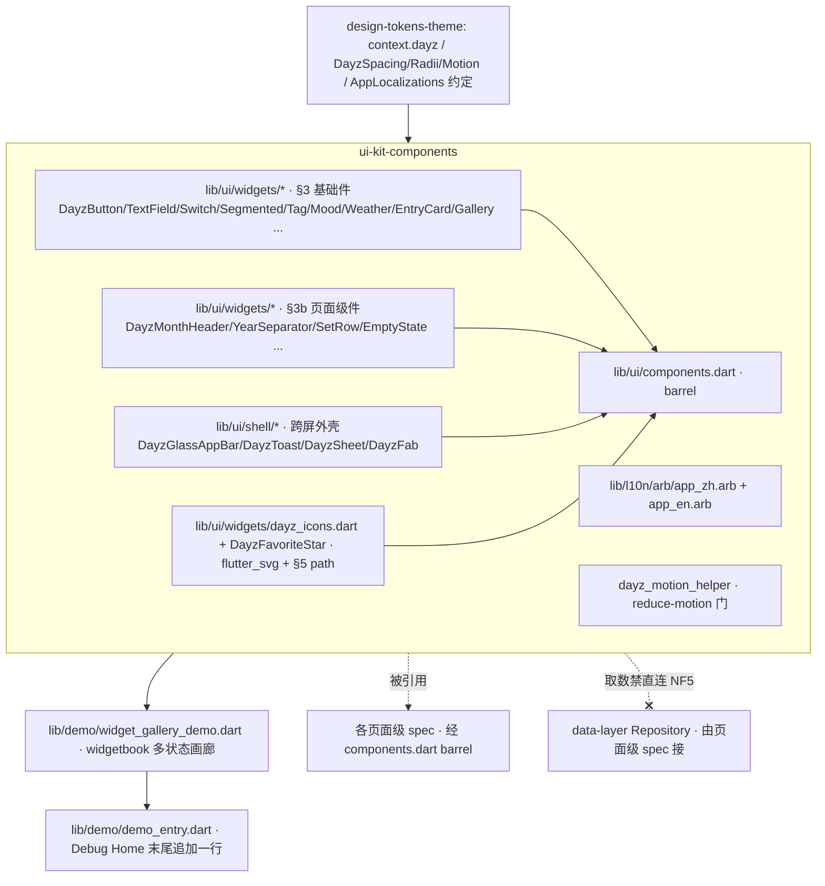

---
作者：@Ray
创建日期：2026-05-29
最后更新：2026-05-29
文档状态：草稿
---

# 设计：ui-kit-components

> 视觉与映射依据：[`docs/design/10-ui-restore-and-design-sync.md`](../../../docs/design/10-ui-restore-and-design-sync.md) §1（分层）/§3（跨屏外壳抽组件 + 网页取巧降级）/§4（四闸）/§9（W1）/§11（验收口径）；组件类名与最小 HTML 真源 [`ui-design/current/docs/DESIGN-REF.md`](../../../ui-design/current/docs/DESIGN-REF.md) §3 / §3b / §3c / §4 / §5；HTML→Flutter 机制映射 [`ui-design/current/docs/PROTOTYPE-ARCH.md`](../../../ui-design/current/docs/PROTOTYPE-ARCH.md) §6；token / `context.dayz.*` / `AppLocalizations` / `intl` 约定来自 `design-tokens-theme`（D1/D4）。

## 技术决策

### D1 · 组件层目录与命名空间
- **状态：** 采纳
- **背景：** 组件命名与 API 一旦定稿即成 10 个页面级 spec 的公共契约，求稳定、可发现；方法论 §1 把组件层产物定位在 `lib/ui/widgets/*.dart`。
- **选项：** (A) 全平铺 `lib/ui/widgets/*.dart`；(B) 按 DESIGN-REF 分节分子目录（`widgets/` 基础 + `shell/` 外壳 + `gallery/` 画廊）；(C) 一个巨型 `dayz_kit.dart` barrel。
- **选择：** B。`lib/ui/widgets/`（§3 基础件，一文件一组件或一族）、`lib/ui/shell/`（§3b/§4 跨屏外壳：`DayzGlassAppBar` / toast / sheet / FAB）、`lib/ui/components.dart`（barrel 导出，页面级 spec 单点 import）。组件类名统一 `Dayz` 前缀（`DayzButton` / `DayzTextField` / `DayzSwitch` / `DayzSegmented` / `DayzTag` / `DayzMoodChip` / `DayzWeatherChip` / `DayzEntryCard` / `DayzGallery` / `DayzMonthHeader` / `DayzYearSeparator` / `DayzEmptyState` / `DayzGlassAppBar` / `DayzFab` / `DayzToast` / `DayzSheet` / `DayzFavoriteStar` …）。
- **理由：** 外壳与基础件变化频率与维护面不同（外壳半机械、基础件参数化），分目录隔离 churn；`Dayz` 前缀避免与 Material 同名 widget 混淆、利于全局检索；barrel 给下游稳定 import 点。
- **代价：** 多一层目录与 barrel 维护；但下游 10 个 spec 受益于稳定单点引用，值。
- ⚠️ **具体组件文件个数/名以 DESIGN-REF §3/§3b 当前清单为准**，下方 `## 文件变更` 给的是按现清单一一映射的落点；DESIGN-REF 新增条目时由 `design-sync-automation` 增量补，不在本 spec 预造空文件。

### D2 · 基础件实现策略：包装 Material vs 全自绘
- **状态：** 采纳
- **背景：** 按钮/开关/输入/分段在 Material 有近似 widget，但 DESIGN-REF 的视觉（圆角/soft 底/accent-ring 聚焦光环/心情脸 SVG）与 Material 默认不同。
- **选项：** (A) 全自绘（`GestureDetector`+`Container`）；(B) 全包装 Material 并改 `ButtonStyle`/`ThemeData`；(C) 按件择优——能用 Material 主题钉死的包装、视觉独特的自绘。
- **选择：** C。`DayzButton` 包装 `FilledButton`/`OutlinedButton`/`TextButton` + 注入 `ButtonStyle`（取 token）；`DayzTextField` 包装 `TextField` + `InputDecoration`（聚焦态 = `--accent` 描边 + `--accent-ring` 光环，用 `focusedBorder` + 外层光环装饰）；`DayzSwitch` 包装 `Switch` 改色；分段/勾选/心情脸/天气 chip/标签等视觉独特或无对应件的**自绘**（`GestureDetector` + `Semantics` + token 装饰）。
- **理由：** 包装 Material 自带无障碍命中盒（≥48 默认）、键盘、焦点、语义，少造轮子；纯视觉件自绘可精确还原设计。两条路都强制走 token、强制补 NF1/NF3。
- **代价：** 两种实现风格并存，须在每个组件测试里统一断言"命中区≥44 + 有 Semantics 标签 + 样式参数==设计值"，把风格差异收敛到验收口径。

### D3 · 全局 toast：`ScaffoldMessenger` + 自定义 SnackBar 内容
- **状态：** 采纳
- **背景：** DESIGN-REF §3 toast = 底部居中、自动消失、可堆叠(≤3)、底色中性、语义靠图标点色、可带一个 action；PROTOTYPE-ARCH §6 给出映射 `ScaffoldMessenger.showSnackBar(behavior: floating) + SnackBarAction`，FAB 由 Scaffold 自动让位。
- **选项：** (A) `ScaffoldMessenger` + floating SnackBar；(B) 自建 `OverlayEntry` toast host（完全自管堆叠/位置）；(C) 第三方 toast 包。
- **选择：** A 为主——`DayzToast.show(context, text, tone, action?)` 内部构造 floating `SnackBar`，`content` 为自定义 `Row`（中性底 + `Icon` 着 tone 语义色 + 文案 + 可选 `SnackBarAction`）；堆叠上限/停留时长（有 action 4.2s 量级 / 无 action 2.6s 量级、无 action 点击关闭）按设计对齐。
- **理由：** `ScaffoldMessenger` 原生处理排队、FAB 让位、`SafeArea` 底部留白与无障碍朗读；不必自管 Overlay 生命周期。
- **代价：** `ScaffoldMessenger` 默认一次只显一条（排队而非"同屏堆叠 3"）；设计的"可堆叠最多 3"在 Flutter 退为"排队 + 上限 3"——视觉差异写入已知风险，必要时局部用 Overlay 增强（不在本 spec 范围内强求）。

### D4 · 底部 sheet：`showModalBottomSheet` 四形态工厂
- **状态：** 采纳
- **背景：** DESIGN-REF §3 一套 `DZ.sheet` 引擎覆盖动作菜单/单选选择器/轻表单三形态 + screen.js 业务里的删除确认；PROTOTYPE-ARCH §6 映射 `showModalBottomSheet`（圆角顶 + 拖拽柄 + `SafeArea` 底部留白）。
- **选项：** (A) 一个万能 `DayzSheet(items/content/...)` 巨参；(B) 命名工厂 `DayzSheet.actions / .picker / .form / .confirm`；(C) 各形态独立 widget 各自 `showModalBottomSheet`。
- **选择：** B。统一外壳（圆角顶 `--r-xl`/拖拽柄/scrim/底部留白）+ 四个命名工厂返回各自内容 widget；item 模型 `DayzSheetItem{label, desc?, icon?, swatch?, tone?, selected, keepOpen, onTap}`、分隔 `sep`。
- **理由：** 命名工厂可读、各形态参数清晰、共享外壳；对齐设计"一套引擎多形态"的意图而不堆巨参。
- **代价：** 四个工厂 + 一个 item 模型的 API 面略大；但都是页面级高频复用，稳定收益大。

### D5 · 毛玻璃顶栏 `DayzGlassAppBar`：`SliverAppBar` + `BackdropFilter`，saturate 降级
- **状态：** 采纳
- **背景：** §3c 覆盖式固定头：静止干净实底、滚动后毛玻璃浮起覆盖状态栏 + 0.5px 底分割；玻璃面实测 `color-mix(in srgb, var(--bg) 80%, …)` + `saturate(1.5) blur(20px)`（系数以 screen.css 为准、实现时查证，见 tokens-theme D 的 glassSurface 标定）。PROTOTYPE-ARCH §6：`extendBodyBehindAppBar + SliverAppBar(flexibleSpace: ClipRect(BackdropFilter(blur)))`，滚动渐显用监听 `ScrollController` 或 M3 `scrolledUnderElevation`。
- **选项：** (A) 固定 `AppBar`（不覆盖状态栏）；(B) `SliverAppBar(pinned)` + `flexibleSpace` 毛玻璃 + 滚动态切换；(C) 自建 `OverlayEntry` 顶栏。
- **选择：** B。`DayzGlassAppBar` 暴露为可放进 `CustomScrollView` 的 sliver（或带 `ScrollController` 的包装），静止态背景 = `--bg` 实底、`scrolledUnder` 时 `flexibleSpace = ClipRect(BackdropFilter(ImageFilter.blur(20)))` + 半透 `--bg`(标定不透明度) + 0.5px 底 hairline。
- **理由：** 原生 sliver 处理 pinned/状态栏让位（`SafeArea`/`MediaQuery.padding`），与 §3c `--top-h` 让位等价、无需手算；与吸顶子头（页面级的 `DayzMonthHeader` 用 `SliverPersistentHeader`）共用同一 BackdropFilter 配方即可"并成一条磨砂"。
- **代价：** `BackdropFilter` 有渲染开销且 `saturate` 无原生等价——降级见 D6。

### D6 · `saturate` 降级与玻璃系数标定（确定性）
- **状态：** 采纳
- **背景：** Flutter `ImageFilter` 无 `saturate`，硬追像素等价不可行（方法论 §3「网页取巧先查 Flutter 对应/降级」）。
- **选择：** 降级 = `ImageFilter.blur(sigmaX/Y≈ blur 20 折算)` + 半透 `--bg` 叠色（不透明度取 screen.css 玻璃面实测值，实现时由 `design-sync-automation` 参数抽取核定；本 spec 先以 tokens-theme 的 `glassSurface` helper 系数为准），**不模拟 saturate**。验收以参数断言"BackdropFilter 存在 + blur sigma 在标定区间 + 叠色不透明度==标定值"，saturate 缺失记为已知像素差、走 golden/SSIM advisory（design-sync-automation），不阻塞。
- **理由：** 把模糊面收敛到"一个不透明度系数 + 一个 blur sigma"两个可断言参数，saturate 的色彩饱和差进 advisory，符合四闸"确定性主闸 + 栅格观感软闸"。
- **代价：** 深色照片背景下饱和度略逊原型；克制取舍，可接受（NF7）。

### D7 · 空状态 `DayzEmptyState` 归本 spec（跨屏复用兜底）
- **状态：** 采纳
- **背景：** `.empty`（§3c）虽在 screen.css，但多屏（时间线空/搜索无结果/收藏空/回收站空）都要兜底插画态，是事实上的跨屏复用件；若散在各屏会各画一遍。
- **选项：** (A) 留各屏自己实现；(B) 收进组件层 `DayzEmptyState(illustration, title, message)`。
- **选择：** B。`DayzEmptyState` 接受插画（§5 单色线性 SVG 经 `flutter_svg`）+ 标题 + 说明（均 `AppLocalizations`），中性暖底圆徽。
- **理由：** 跨屏复用、统一空态观感；插画图标走 §5 规范。
- **代价：** 各屏空态文案仍各异（由各屏传 `AppLocalizations` 条目），组件只统一骨架——可接受。
- ⚠️ §3c 其余屏内一次性件（`.cal-*` 日历、`.suggest-row`、`.topsearch`、`.nj-*` 选色、`.trash-*`/`.cm-*`/`.mc` 等）**不进本 spec**，留对应页面级 spec；本 spec 只收 `.empty` 这一个明确跨屏件。

### D8 · widgetbook 多状态画廊
- **状态：** 采纳
- **背景：** 方法论 §9/§11 + R7：Debug Home 单列表只能逐 demo 进入，覆盖不了"组件 × 6 主题 × 状态"二维矩阵；PROTOTYPE-ARCH §6 末行明确"画布多状态平铺无运行时对应 → Flutter 侧用 widgetbook/storybook 看各状态"。
- **选项：** (A) 自建一个手搓的多 tab demo 页；(B) 引 `widgetbook` 包（活跃维护、Flutter 生态标准 component gallery）；(C) 用 `storybook_flutter`。
- **选择：** B。引 `widgetbook`（dev/普通依赖按其用法定，列入 `pubspec.yaml`，属白名单外共享文件，已在 `## 文件变更` 显式列出）；为每个组件登记 `WidgetbookComponent` + 多 `WidgetbookUseCase`（变体/状态），主题与明暗作为 `WidgetbookAddon`（6 套切换）。
- **理由：** widgetbook 是 Flutter 社区主流、活跃维护，原生支持 theme addon / knobs / 多 use-case，正合"组件×主题×状态矩阵"，避免自造。
- **代价：** 引入一个第三方依赖与一份 widgetbook 装配代码；但替代自搓矩阵 demo，净省。画廊本身经 Debug Home 一个入口进入（满足项目 Debug Home 约定）。

### D9 · 收藏星 / 规范图标：`flutter_svg` + §5 规范 path
- **状态：** 采纳
- **背景：** DESIGN-REF §5 给收藏星唯一规范 path（中心对称五角星，只换 fill/stroke，path 不变），图标统一内联 SVG `stroke=currentColor` 单色继承父级文字色。
- **选项：** (A) 用 Material `Icons.star`/`star_border`（几何与设计不符、易歪）；(B) `CustomPainter` 手画 path；(C) `flutter_svg` 渲染 §5 规范 path 字符串。
- **选择：** C 为主（`flutter_svg` 渲染 §5 path，`colorFilter` 着 `currentColor`/`--favorite`）；通用单色线性图标（菜单/天气/地点/箭头等）同走 `flutter_svg`（`viewBox 0 0 24 24`、`stroke=currentColor`、`stroke-width 2`、round cap/join）。`flutter_svg` 列入 `pubspec.yaml`。
- **理由：** 直接复用设计稿 path 字符串，零重绘歧义；`colorFilter`/`currentColor` 让图标随主题；与 tokens-theme「不写死颜色」一致。
- **代价：** 引 `flutter_svg` 依赖 + 维护一组 path 常量（收藏星等规范 path 集中一个 `dayz_icons.dart` 常量文件）；可接受。

### D10 · 文案集中 `AppLocalizations` 与 `intl`（落实 tokens-theme D4）
- **状态：** 采纳
- **背景：** i18n 基础设施已由 `i18n-localization` 建立；组件层用户可见文案不得再落到静态中文常量桶。
- **选择：** 本 spec 需要的组件层文案（toast 默认/撤销/查看、sheet 取消/删除/确认、空状态通用标题、收藏星/菜单等 Semantics 标签等）统一补入 `lib/l10n/arb/app_zh.arb` 与 `app_en.arb`，运行期通过 `AppLocalizations.of(context)` / `l10n.xxx` 取用；月份头/年份分隔等日期、数字、复数文案走 `package:intl` 与 ARB ICU。
- **理由：** 与 `docs/design/11` 的唯一文案真源一致；测试通过 locale wrapper 取 `l10n` 文案，自带双语与禁裸文案回归护栏。
- **代价：** 组件默认文案需要在 build/show 时拿到 `BuildContext` 或由调用方传入本地化字符串；存量静态文案引用由 `ui-i18n-migration` 迁移。

### D11 · reduce-motion 统一收敛到一个动效门
- **状态：** 采纳
- **背景：** NF4 要求 toast/sheet/FAB/顶栏动效在系统「减弱动态效果」时降级；散在各组件各判易漏。
- **选择：** 一个 helper `dayzMotionDuration(context, base)` —— `MediaQuery.of(context).disableAnimations` 为真时返回 `Duration.zero`（或近瞬时），否则返回 `base`（取 `DayzMotion.dur`）；所有带动效组件统一经它取 duration。
- **理由：** 单点判定、易测（verification 注入 `MediaQueryData(disableAnimations: true)` 断言动效时长为 0），杜绝逐组件漏判。
- **代价：** 多一个 helper；微小。

### D12 · 大图查看器 `DayzImageViewer`：`photo_view` 的 `PhotoViewGallery` + `PageController`（R9）
- **状态：** 采纳
- **背景：** R9 要全屏沉浸看图、横向翻页 + 顶部计数 + 点空白退出，对齐原型 `pages/assets/lightbox.js`（`.lbx` 横向 `scroll-snap`、`.lbx-top` 计数、点非 `IMG` 退出）与 handoff `editor.md §5(b)`（Flutter 映射明确指向 `photo_view` 的 `PhotoViewGallery.builder` + `PageController(initialPage:index)`）。本组件归 ui-kit（业务无关、零数据接入）；页面级 spec（reader / editor 只读）只在打开它前备好 `ImageProvider` 列表。
- **选择：**
  - 引 `photo_view`（README 依赖外的普通包依赖，列入 `## 文件变更` 的 `pubspec.yaml` / `pubspec.lock`，归 R9 任务白名单）。`DayzImageViewer({required List<ImageProvider> images, int initialIndex = 0, List<String?>? captions, VoidCallback? onClose})`，全屏 `Stack` + `PhotoViewGallery.builder`（每页一张，`backgroundDecoration` 取 `--media-bg` 暖近黑）+ `PageController(initialPage: initialIndex)`，`onPageChanged` 更新当前页号状态。
  - 顶部计数：仅 `images.length > 1` 时渲染 `N / 总数`（对齐 lightbox.js `multi` 判定），随 `onPageChanged` 实时更新；单张不渲染计数。
  - 关闭：左上角关闭钮（`DayzIcons` 关闭 path）触发 `onClose`；点空白（页面背景，非图片本体）触发 `onClose`——`photo_view` 经 `PhotoViewGallery` 的 `onTapUp`/背景 `GestureDetector` 实现「点图不退、点空白退」（对齐 lightbox.js `track.click` 仅在 `target ≠ IMG` 时关闭）。
  - 可选 caption：当某页有 caption 时渲染底部 `--media-scrim` 渐隐说明（对齐 `.lbx-foot`）。
  - 媒体层取色统一引 `--media-bg`/`--media-surface`/`--media-ink`/`--media-ink-2`/`--media-scrim`/`--media-chip`（DESIGN-REF §3c Token，由 design-tokens-theme 提供）；不写死颜色。命中盒 / 关闭钮 ≥44（NF1），关闭钮 / 计数有 `Semantics` 标签（NF3），入场 / 退场动效经 `dayzMotionDuration`（NF4）。
- **理由：** `photo_view` 是 handoff 钦定的 Flutter 落地件，内置缩放 / 翻页手势；ui-kit 收口这件「沉浸式媒体壳」使 reader / 编辑只读等多消费方共用一份，避免各屏自造。
- **代价：** 新增一个普通包依赖（`photo_view`）；与原型 `scroll-snap` 翻页手感存在框架级细微差异（验收以 Patrol 视觉项守手感，见任务）。

## 架构

## 文件变更

> 这是本 spec 任务「可改文件」的**唯一来源与上界**；任一任务可改文件 MUST ⊆ 本清单。新建 Dart 文件 MUST 加 MPL-2.0 头注。组件文件按 DESIGN-REF §3/§3b 现清单一一映射；DESIGN-REF 新增条目由 `design-sync-automation` 增量补，不在本 spec 预造空文件。

**基础组件（§3）`lib/ui/widgets/`**
- `lib/ui/widgets/dayz_button.dart`            新建（`.btn` 全变体/尺寸/图标钮/disabled）
- `lib/ui/widgets/dayz_text_field.dart`        新建（`.field`+`.input`+`.textarea`，聚焦光环）
- `lib/ui/widgets/dayz_switch.dart`            新建（`.switch`）
- `lib/ui/widgets/dayz_option.dart`            新建（`.opt` 勾选 `.box` / 单选 `.dot`，选中 `.on`）
- `lib/ui/widgets/dayz_segmented.dart`         新建（`.segmented`）
- `lib/ui/widgets/dayz_tag.dart`               新建（`.tag` / `.tag-outline` / 删除叉 `.x`）
- `lib/ui/widgets/dayz_mood_chip.dart`         新建（`.mood` 手绘 SVG 脸 + 选中 `.sel`）
- `lib/ui/widgets/dayz_weather_chip.dart`      新建（`.weather-chip`）
- `lib/ui/widgets/dayz_toolbar.dart`           新建（`.toolbar` 按钮条 `.tb`/`.on`/`.div`，纯外壳+回调）
- `lib/ui/widgets/dayz_dialog.dart`            新建（`.dialog` h4+p+`.acts`）
- `lib/ui/widgets/dayz_entry_card.dart`        新建（`.entry`：date 列 + card + photo/head/excerpt/foot）
- `lib/ui/widgets/dayz_gallery.dart`           新建（`.gallery` 九宫格，列数随张数 + 第9格 +N 蒙层，接 `ImageProvider` 列表 + 回调）
- `lib/ui/widgets/dayz_image_viewer.dart`      新建（`.lbx` 全屏沉浸式大图查看器 `DayzImageViewer`：`photo_view` `PhotoViewGallery` + `PageController(initialPage)`，横向滑动 + 顶部 `N / 总数` 计数（多张时）+ 关闭钮 / 点空白退出 + 暖近黑 `--media-*` 底 + 可选 caption，接 `ImageProvider` 列表 + `initialIndex` + 回调，零数据接入，R9/D12）

**页面级复用组件（§3b）+ 跨屏空态（§3c 中跨屏件）`lib/ui/widgets/`**
- `lib/ui/widgets/dayz_month_header.dart`      新建（`.tl-month` 年月吸顶头触发器 + `.tl-cal` 小日历图标，日期走 intl）
- `lib/ui/widgets/dayz_year_separator.dart`    新建（`.year-sep` 年份分隔，年份/"N 年前"走 intl）
- `lib/ui/widgets/dayz_set_row.dart`           新建（`.set-*`：`.set-row`/`.set-group`/`.lab`/账户头卡，右侧 switch/val/chev）
- `lib/ui/widgets/dayz_empty_state.dart`       新建（`.empty` 跨屏兜底插画态，D7）
- `lib/ui/widgets/dayz_search_field.dart`      新建（`.search-head` 可复用搜索输入框骨架；屏内 `.topsearch`/`.suggest-row` 归各屏）

**图标 `lib/ui/widgets/`**
- `lib/ui/widgets/dayz_icons.dart`             新建（§5 规范 SVG path 常量集，含收藏星唯一 path）
- `lib/ui/widgets/dayz_favorite_star.dart`     新建（收藏星 fill/stroke 切换，flutter_svg）

**跨屏外壳 `lib/ui/shell/`**
- `lib/ui/shell/dayz_glass_app_bar.dart`       新建（`DayzGlassAppBar`：SliverAppBar + BackdropFilter + saturate 降级，D5/D6）
- `lib/ui/shell/dayz_toast.dart`               新建（全局 toast：ScaffoldMessenger + 自定义内容，D3）
- `lib/ui/shell/dayz_sheet.dart`               新建（底部 sheet 四形态工厂 + `DayzSheetItem` 模型，D4）
- `lib/ui/shell/dayz_fab.dart`                 新建（FAB 速拨外形：轻点/长按展开/scrim/立体渐变，R6，纯外形+回调）

**支撑 `lib/ui/`**
- `lib/l10n/arb/app_zh.arb`、`lib/l10n/arb/app_en.arb`            修改（补组件层 zh/en 文案 key，D10）
- `lib/ui/util/dayz_motion.dart`               新建（`dayzMotionDuration` reduce-motion 门，D11）
- `lib/ui/components.dart`                     新建（barrel：导出全部组件 + 外壳，供页面级 spec 单点 import，D1）

**画廊与 Debug Home 入口 `lib/demo/`**
- `lib/demo/widget_gallery_demo.dart`          新建（widgetbook 多状态画廊，D8/R7）
- `lib/demo/demo_entry.dart`                   修改（**仅末尾追加一行**，不插中间、不改 `DemoEntry` 字段）

**共享依赖**
- `pubspec.yaml`                               修改（加 `flutter_svg` + `widgetbook` + `photo_view`（大图查看器 R9/D12）；`intl` 为 SDK 传递依赖不新增）
- `pubspec.lock`                               修改（`flutter pub get` 后锁定版本）

**测试目录（白名单 hook 对 `test/**/*_test.dart` 自动放行；非 `_test.dart` 的共享基建由任务 `验收基建` 字段预批）**
- `test/ui/widgets/`                           新建（各基础/页面级组件 widget test）
- `test/ui/shell/`                             新建（外壳组件 widget test）
- `test/demo/widget_gallery_demo_test.dart`    新建（画廊 + Debug Home 入口测试）
- `patrol_test/dayz_image_viewer_visual_test.dart`  新建（T9：DayzImageViewer 真机视觉截图 E2E，dependsOn e2e-harness；非 `test/**` 不走自动放行，故列本清单 + 任务可改文件）

## 已知风险

- **DESIGN-REF 是移动靶**：上面组件文件清单按当前 §3/§3b 一一映射；设计稿后续增删组件由 `design-sync-automation` 三档分流（§8）增量驱动，不在本 spec 内预判。若执行时发现 DESIGN-REF 已新增本清单未列的登记组件 → 停下回填 `## 文件变更` 再实现，不擅自造。
- **toast 堆叠退化（D3）**：`ScaffoldMessenger` 默认排队、非同屏堆叠 3；本 spec 取"排队 + 上限 3"近似，与原型"可堆叠 3"有视觉差。若产品强需同屏堆叠，后续用 `OverlayEntry` 增强（另起改动），本 spec 不强求。
- **saturate 玻璃像素差（D6/NF7）**：`BackdropFilter` 无 saturate，降级保 blur+叠色两参数确定性，饱和度差进 golden/SSIM advisory（design-sync-automation 期二），不阻塞放行。玻璃不透明度/blur sigma 的精确值待 `design-sync-automation` 参数抽取核定；本 spec 先用 tokens-theme `glassSurface` 系数，**标为待确认**。
- **跨 spec 依赖（按交付物名引用，可能尚未实现）**：
  - `design-tokens-theme`（README 依赖列已登记）：`context.dayz.*`、`DayzSpacing/DayzRadii/DayzMotion/DayzFonts`、六套 `ThemeData`、`AppLocalizations` 约定（D4）、`glassSurface`/`fabGradient` helper 与系数——本 spec 全部消费，若 tokens-theme 未定稿则本 spec 被阻塞（READY 门）。
  - `design-sync-automation`（**非 README 依赖**，仅验证基建关系）：参数/几何抽取 harness、`element-map.yaml`、SSIM 兜底属其交付物；本 spec 的几何/样式断言用 Flutter 原生 `tester.getRect` / 解析 widget 属性自验，**不依赖 harness 就绪**；需 harness 的"对设计稿源屏比框"部分留给 design-sync 期二，不在本 spec 重造。
  - `data-layer`（**非依赖、明确禁连**，NF5）：`JournalRepo/EntryRepo/MediaRepo/TagRepo/EditingSessionRepo` 是页面级 spec 的取数入口；本 spec 组件 MUST NOT import `lib/data` 或持 Drift 句柄，verification 留静态核验。
  - `editor-json-contract` / 编辑器集成页面级 spec：`.toolbar` 真实富文本能力（粗体/列表/引用/图片等命令）与只读渲染器归彼处；本 spec 的 `DayzToolbar` 只做按钮条外形 + 激活态 + 回调，**不接 AppFlowy 命令**。
  - media-picker / thumbnail-cache：`DayzGallery` 只接 `ImageProvider` 列表 + 回调；真实相册链路与缩略图（含"列表滚动禁止同步重建缩略图、只暴露异步 warmup"红线）归彼处，本 spec 不触发缩略图生成。
- **widgetbook 依赖维护活跃度**：选 `widgetbook` 因其为 Flutter 主流活跃组件画廊；若引入后与当前 stable Flutter 版本不兼容，退路是 D8 选项 A（自搓多状态 demo 页）——退路只动 `widget_gallery_demo.dart`，不影响组件层本体。**标为待确认（首次 `flutter pub get` 时核版本兼容）**。
- **`pubspec.yaml`/`pubspec.lock` 触碰**：`flutter_svg` + `widgetbook` 属白名单外共享文件，已在 `## 文件变更` 显式列出并归入引入它们的任务白名单；`pubspec.lock` 作为 pub get 副产物一并列入（避免"清单只写 pubspec.yaml 而顺手改 lock"的越界，见 spec-guide P2）。
- **无持久化 schema 变更 → 无数据迁移/回滚要素**（组件层无 DB）。
