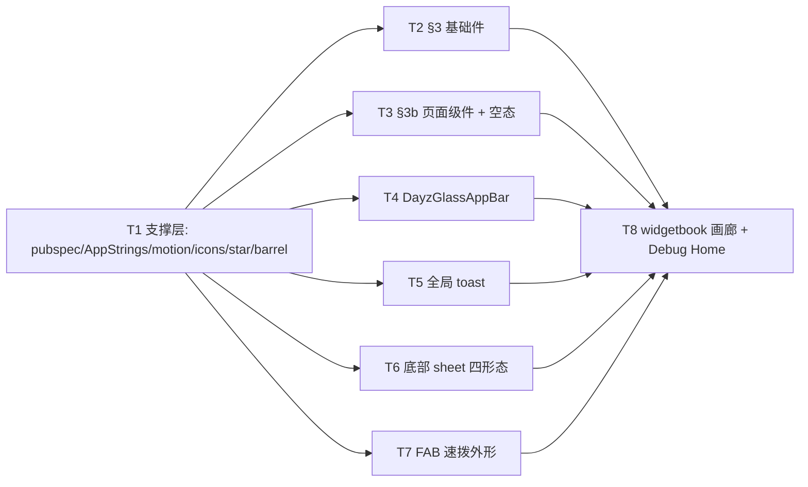

---
作者：@Ray
创建日期：2026-05-29
最后更新：2026-05-29
文档状态：草稿
---

# 任务列表：ui-kit-components

## 任务依赖图
> 由各任务 inline「同 spec 依赖」字段汇总，仅供速览；以 inline 为准。



并行组：
- Group A：T1（地基，先行）
- Group B（T1 后并行）：T2, T3, T4, T5, T6, T7
- Group C：T8（汇总全部）

（整套组件层一体、无可独立部署/演示的中间切点 → 不设里程碑；画廊是目检入口而非可交付产品。）

> 跨任务校验（六套主题×组件矩阵的对比度/语义/几何一致性、画廊聚合遍历、Repository 边界全层核验、analyze 回归）归 verification.md，不作为单任务。

-----

- [x] T1 · 支撑层：依赖 + AppStrings + reduce-motion 门 + 规范图标/收藏星 + barrel 骨架

**同 spec 依赖：** 无 ｜ **跨 spec 依赖：** design-tokens-theme（`context.dayz.*` / `DayzMotion` / `AppStrings` 约定 D4 / `glassSurface` 系数 / `DayzColors.favorite`）｜ **关联需求：** R8, NF3, NF4 ｜ **依据设计：** D1, D9, D10, D11 ｜ **可改文件：** `pubspec.yaml`、`pubspec.lock`、`lib/ui/strings/app_strings.dart`、`lib/ui/util/dayz_motion.dart`、`lib/ui/widgets/dayz_icons.dart`、`lib/ui/widgets/dayz_favorite_star.dart`、`lib/ui/components.dart` ｜ **验收基建：** `test/ui/widgets/dayz_favorite_star_test.dart`、`test/ui/util/dayz_motion_test.dart`

### 背景
本 spec 的公共地基：引入 `flutter_svg`+`widgetbook` 依赖；首建 `AppStrings`（录入组件层文案，落实 tokens-theme D4，后续各屏 spec 向同一文件追加）；`dayzMotionDuration` reduce-motion 单点门（D11）；§5 规范 SVG path 常量集（含收藏星唯一 path）与 `DayzFavoriteStar`；`components.dart` barrel 骨架（先建空 barrel，后续任务各自补 export）。
归属：`pubspec.yaml`/`pubspec.lock` 的依赖增改集中在本任务，其余任务不碰 pubspec。barrel 的 export 行各任务在自己任务内补本任务建立文件骨架。

### 实施
1. `pubspec.yaml` 加 `flutter_svg`、`widgetbook`（按其文档定 dependencies/dev_dependencies 位），跑 `flutter pub get` 锁 `pubspec.lock`；新建 Dart 文件加 MPL-2.0 头注。
2. `AppStrings`（`abstract final class` + `static const` 中文）录入组件层文案与 Semantics 标签（toast 默认/撤销/查看、sheet 取消/删除/确认、空态通用标题、收藏星「收藏」/「取消收藏」、菜单/更多等图标钮标签）。
3. `dayzMotionDuration(context, base)`：`MediaQuery.of(context).disableAnimations` 真 → `Duration.zero`，否则 `base`（默认取 `DayzMotion.dur`）。
4. `dayz_icons.dart`：§5 规范 SVG path 常量（收藏星用 DESIGN-REF §5 唯一 path 字符串，不另画）。
5. `DayzFavoriteStar`：`flutter_svg` 渲染收藏星 path，已收藏 `colorFilter` 着 `context.dayz.favorite`、未收藏描边 `currentColor`，path 不变；命中区 ≥44（NF1）、带 `Semantics` 标签（NF3）。
6. `components.dart` barrel：导出本任务建立的文件。

### 验收标准（做完即止）
- `flutter pub get` 通过、`pubspec.yaml`/`pubspec.lock` 解析无误（自动）。
- `DayzFavoriteStar` 已收藏态 fill 取 `context.dayz.favorite`、未收藏态描边 `currentColor`，两态 SVG path 相同（自动，widget test 解析渲染属性/path 串相等）。
- `dayzMotionDuration` 在 `disableAnimations:true` 下返回 `Duration.zero`、否则返回 base（自动，注入 `MediaQueryData`）。
- 收藏星命中区 ≥44×44、可由 `find.bySemanticsLabel(AppStrings.favorite)` 定位（自动）。

### 验收方式
- 自动：
  ```bash
  flutter pub get && flutter test test/ui/widgets/dayz_favorite_star_test.dart test/ui/util/dayz_motion_test.dart
  ```
  （断言渲染属性与 path 相等、duration 行为、命中区 `tester.getRect` 尺寸、`find.bySemanticsLabel`；**不** grep 被改文件自身）

### 验收记录
```
日期：2026-05-30
自动：`flutter test test/ui/widgets/dayz_favorite_star_test.dart test/ui/util/dayz_motion_test.dart` 通过；`flutter_svg` / `widgetbook` 依赖已在 pubspec 中解析。
人工：N/A
```

-----

- [x] T2 · §3 基础组件成套（按钮/输入/开关/勾选/分段/标签/心情/天气/工具栏/弹窗/EntryCard/Gallery）

**同 spec 依赖：** T1 ｜ **跨 spec 依赖：** design-tokens-theme（`context.dayz.*` / `DayzSpacing` / `DayzRadii` / 六套 ThemeData / `DayzFonts`）｜ **关联需求：** R1, NF1, NF2, NF3 ｜ **依据设计：** D1, D2, D9 ｜ **可改文件：** `lib/ui/widgets/dayz_button.dart`、`lib/ui/widgets/dayz_text_field.dart`、`lib/ui/widgets/dayz_switch.dart`、`lib/ui/widgets/dayz_option.dart`、`lib/ui/widgets/dayz_segmented.dart`、`lib/ui/widgets/dayz_tag.dart`、`lib/ui/widgets/dayz_mood_chip.dart`、`lib/ui/widgets/dayz_weather_chip.dart`、`lib/ui/widgets/dayz_toolbar.dart`、`lib/ui/widgets/dayz_dialog.dart`、`lib/ui/widgets/dayz_entry_card.dart`、`lib/ui/widgets/dayz_gallery.dart`、`lib/ui/components.dart`（补 export）、`lib/ui/strings/app_strings.dart`（仅追加本组用文案条目）｜ **验收基建：** `test/ui/widgets/`（各组件 `*_test.dart`）

### 背景
实现 DESIGN-REF §3 登记的全部基础件（清单以 §3 当前内容为准）。视觉全走 token（D2 包装/自绘择优）；图标用 T1 的 `dayz_icons`/`DayzFavoriteStar`。`DayzGallery` 只接 `ImageProvider` 列表 + 回调（NF5，不触发缩略图生成）；`DayzToolbar` 只做按钮条外形+激活态+回调（不接 AppFlowy 命令）。文案/语义标签追加到 `AppStrings`，屏内禁裸中文。
归属：本任务向 `components.dart` 补本组件的 export；`app_strings.dart` 仅**追加**本组文案条目（与 T1 建立的类同文件，T1 先建类、本任务加条目，归属点 design D10）。

### 实施
1. 按 §3 类名逐件实现（按钮全变体/尺寸/图标钮/disabled、`.field`/`.input`/`.textarea` 聚焦光环、`.switch`、`.opt` box/dot+on、`.segmented`、`.tag`/`.tag-outline`/删除叉、`.mood` 手绘 SVG 脸+sel、`.weather-chip`、`.toolbar` `.tb`/`.on`/`.div`、`.dialog`、`.entry`、`.gallery` 列数随张数+第9格 +N 蒙层）。
2. 每件：样式参数取 token；可交互件命中区 ≥44（NF1）、图标钮/无文字件补 `Semantics`（NF3）、装饰图标 `ExcludeSemantics`。
3. 文案进 `AppStrings`；删除叉/星等标签经 `AppStrings`。

### 验收标准（做完即止）
- 每件解析后样式参数（颜色/圆角/内边距/字号/阴影）等于 DESIGN-REF 对应类在当前主题下的设计值（自动，pump 在某套 ThemeData 下读 widget 渲染属性断言==token 值）。
- 按钮各变体（primary/soft/ghost/text/danger）外观各异、disabled 不可点；`.opt` on/off、`.tag`/`.tag-outline`、`.segmented` 选中态正确（自动）。
- `DayzGallery` 张数 2/3/4/≥5/1 各自列数正确、≥10 张第9格显 `+N` 蒙层且其余隐藏（自动，断言网格 crossAxisCount 与 +N 文本）。
- 可交互件命中区 ≥44×44；图标钮可经 `find.bySemanticsLabel` 定位（自动，NF1/NF3）。

### 验收方式
- 自动：
  ```bash
  flutter test test/ui/widgets/
  ```
  （pump 各组件于 ThemeData 下，`tester.getRect` 断尺寸/命中区、读解析样式属性断==设计 token 值、`find.bySemanticsLabel` 断语义；**不** grep 被改文件自身）

### 验收记录
```
日期：2026-05-30
自动：`flutter analyze lib/ui/widgets/dayz_button.dart lib/ui/widgets/dayz_text_field.dart lib/ui/widgets/dayz_switch.dart lib/ui/widgets/dayz_option.dart lib/ui/widgets/dayz_segmented.dart lib/ui/widgets/dayz_tag.dart lib/ui/widgets/dayz_mood_chip.dart lib/ui/widgets/dayz_weather_chip.dart lib/ui/widgets/dayz_toolbar.dart lib/ui/widgets/dayz_dialog.dart lib/ui/widgets/dayz_entry_card.dart lib/ui/widgets/dayz_gallery.dart` 无问题；`flutter test test/ui/widgets/dayz_button_test.dart` 与 `flutter test test/ui/widgets/` 通过。
人工：N/A
```

-----

- [x] T3 · §3b 页面级复用件 + 跨屏空态（月份头/年份分隔/设置行/EmptyState/搜索框骨架）

**同 spec 依赖：** T1 ｜ **跨 spec 依赖：** design-tokens-theme（`context.dayz.*` / 排版 `.t-*` / `AppStrings` / `intl`）｜ **关联需求：** R2, NF1, NF2, NF3 ｜ **依据设计：** D7, D9, D10 ｜ **可改文件：** `lib/ui/widgets/dayz_month_header.dart`、`lib/ui/widgets/dayz_year_separator.dart`、`lib/ui/widgets/dayz_set_row.dart`、`lib/ui/widgets/dayz_empty_state.dart`、`lib/ui/widgets/dayz_search_field.dart`、`lib/ui/components.dart`（补 export）、`lib/ui/strings/app_strings.dart`（仅追加本组用文案条目）｜ **验收基建：** `test/ui/widgets/`（各件 `*_test.dart`）

### 背景
实现 §3b 跨端复用件 + §3c 中明确跨屏的空态 `.empty`（D7）。日期/篇数/「N 年前」走 `package:intl`（MUST NOT 自拼 `'2026年5月'`/`'12 篇'`）；空态插画走 §5 单色线性 SVG（`flutter_svg`，复用 T1 `dayz_icons`）。`.topsearch`/`.suggest-row`/`.cal-*` 等屏内一次性件**不在此**，留各屏 spec。
归属：`DayzMonthHeader` 是触发器外形（`.tl-month` + `.tl-caret` 展开态），点击回调由页面级接日历跳转，本组件只暴露 `onTap`/`expanded`，不接日历面板。

### 实施
1. `DayzMonthHeader`：年月 + 篇数（`intl` 格式化）+ `.tl-caret` 旋转（`expanded`）+ `onTap` 回调；吸顶由页面级 `SliverPersistentHeader` 包，本件是其内容外形。
2. `DayzYearSeparator`：`.year-sep` 年份 + "N 年前"（`intl`/相对年差）+ 分隔线。
3. `DayzSetRow`/分组/账户头卡：`.set-row` `.ic`+`.tx`(b 主+span 次)+右侧 `.switch`/`.val`/`.chev`；可点行带命中区与语义。
4. `DayzEmptyState`：中性暖底圆徽 + §5 插画 + 标题 + 说明（`AppStrings`）。
5. `DayzSearchField`：`.search-head` 输入框骨架（图标+输入+取消），纯输入外形+回调。

### 验收标准（做完即止）
- 月份头日期/篇数经 `intl` 格式化（断言渲染文本由 `intl` 产出，非裸拼接）、`.tl-caret` 在 `expanded` 时旋转、点击触发 `onTap`（自动）。
- 年份分隔显年份 + 相对年差文案（`AppStrings`/`intl`），样式参数==设计（自动）。
- `DayzSetRow` 右侧 switch/val/chev 三型各渲染正确；可点行命中区 ≥44（自动）。
- `DayzEmptyState` 渲染插画+标题+说明，文案经 `AppStrings`（`find.text(AppStrings.xxx)`）（自动）。

### 验收方式
- 自动：
  ```bash
  flutter test test/ui/widgets/
  ```
  （断言 `intl` 格式化输出文本、caret 旋转 transform、`tester.getRect` 命中区、`find.text(AppStrings.xxx)`；**不** grep 被改文件自身）

### 验收记录
```
日期：2026-05-30
自动：`dart analyze lib/ui/widgets/dayz_month_header.dart lib/ui/widgets/dayz_year_separator.dart lib/ui/widgets/dayz_set_row.dart lib/ui/widgets/dayz_empty_state.dart lib/ui/widgets/dayz_search_field.dart` 无问题；`flutter test test/ui/widgets/dayz_page_components_test.dart` 通过（5/5）。
人工：N/A
```

-----

- [x] T4 · 跨屏外壳：DayzGlassAppBar（毛玻璃顶栏 + saturate 降级）

**同 spec 依赖：** T1 ｜ **跨 spec 依赖：** design-tokens-theme（`context.dayz.bg` / `glassSurface` 系数 / hairline）｜ **关联需求：** R3, NF4, NF6, NF7 ｜ **依据设计：** D5, D6, D11 ｜ **可改文件：** `lib/ui/shell/dayz_glass_app_bar.dart`、`lib/ui/components.dart`（补 export）｜ **验收基建：** `test/ui/shell/dayz_glass_app_bar_test.dart`

### 背景
覆盖式固定头：静止干净实底（`--bg`），滚动越阈值后 `BackdropFilter(blur)` + 半透 `--bg`(标定不透明度) + 0.5px 底 hairline 浮起覆盖状态栏（D5）。`saturate` 无原生等价 → 降级保 blur+叠色两参数确定性（D6/NF7）。动效过渡经 `dayzMotionDuration`（NF4）。
归属：本件只做顶栏外壳与滚动态切换；不接路由/抽屉/搜索业务（归 ui-shell-navigation）。

### 实施
1. `DayzGlassAppBar` 为可入 `CustomScrollView` 的 sliver（或带 `ScrollController` 包装），`extendBodyBehindAppBar` 配合。
2. 静止态背景实底；`scrolledUnder` 时 `flexibleSpace = ClipRect(BackdropFilter(ImageFilter.blur(sigma≈20 折算)))` + 半透 `--bg`(glassSurface 系数) + 0.5px 底 hairline。
3. 状态切换动效经 `dayzMotionDuration`，reduce-motion 时瞬时切。

### 验收标准（做完即止）
- 初始未滚动：无 `BackdropFilter`、背景为 `--bg` 实底（自动，widget test 查 widget 树）。
- 滚动越阈值后：出现 `BackdropFilter`、blur sigma 在标定区间、叠色不透明度==标定值、底有 0.5px 分割（自动，断言渲染属性，NF7 不追 saturate）。
- `disableAnimations:true` 时状态切换无动效时长（自动，NF4）。

### 验收方式
- 自动：
  ```bash
  flutter test test/ui/shell/dayz_glass_app_bar_test.dart
  ```
  （pump 可滚动页，初态/滚动后各断 `BackdropFilter` 有无与 blur sigma/叠色参数；注入 `disableAnimations` 断动效时长；**不** grep 被改文件自身）

### 验收记录
```
日期：2026-05-30
自动：`flutter test test/ui/shell/dayz_glass_app_bar_test.dart` 通过（4/4）。
人工：N/A
```

-----

- [x] T5 · 跨屏外壳：全局 toast（DayzToast）

**同 spec 依赖：** T1 ｜ **跨 spec 依赖：** design-tokens-theme（中性底 token / `--danger` / `--favorite` / accent）｜ **关联需求：** R4, NF3, NF4 ｜ **依据设计：** D3, D11 ｜ **可改文件：** `lib/ui/shell/dayz_toast.dart`、`lib/ui/components.dart`（补 export）、`lib/ui/strings/app_strings.dart`（仅追加 toast 文案）｜ **验收基建：** `test/ui/shell/dayz_toast_test.dart`

### 背景
全局 toast：`DayzToast.show(context, text, tone, action?)` 经 `ScaffoldMessenger` floating SnackBar，底色中性、语义靠图标点色（default/ok/info=accent、danger=`--danger`、fav=`--favorite`），可带一个 action，有 action 停留更久（4.2s 量级）、无 action 短（2.6s 量级），排队上限 3（D3 退化已记已知风险）。进出场经 `dayzMotionDuration`（NF4）。

### 实施
1. `DayzToast.show`：构造 floating `SnackBar`，`content` = 中性底 `Row`（`Icon` 着 tone 语义色 + 文案 `AppStrings` + 可选 `SnackBarAction`）。
2. tone→图标点色映射；有/无 action 停留时长分档；排队上限 3。
3. action label/无 action 点击关闭；语义标签可朗读（NF3）；动效经 `dayzMotionDuration`（NF4）。

### 验收标准（做完即止）
- 调 `show` 后显一条 toast，文案==传入（`find.text`）、tone 决定图标颜色而非整条底色（自动，断 `Icon` color==对应 token、底色中性）。
- 有 action 时暴露 action 回调并停留更久档、无 action 短档（自动，断 SnackBar duration 量级与 action 存在性）。
- 连发 >3 条时同时在场不超 3（自动）。

### 验收方式
- 自动：
  ```bash
  flutter test test/ui/shell/dayz_toast_test.dart
  ```
  （pump 带 Scaffold 的页面，调 show，断 `find.text`/`Icon` color/duration/action 回调被触发；**不** grep 被改文件自身）

### 验收记录
```
日期：2026-05-30
自动：`flutter test test/ui/shell/dayz_toast_test.dart test/ui/shell/dayz_sheet_test.dart` 通过（覆盖 T5/T6）；追加验证 `DayzSheet` 使用 root navigator 遮罩覆盖整屏、confirm/form actions 回到 `DayzButton` 体系。
人工：N/A
```

-----

- [x] T6 · 跨屏外壳：底部 sheet 四形态（DayzSheet：actions/picker/form/confirm）

**同 spec 依赖：** T1 ｜ **跨 spec 依赖：** design-tokens-theme（`--r-xl` 圆角 / 拖拽柄色 / `--danger`）｜ **关联需求：** R5, NF1, NF3, NF4 ｜ **依据设计：** D4, D11 ｜ **可改文件：** `lib/ui/shell/dayz_sheet.dart`、`lib/ui/components.dart`（补 export）、`lib/ui/strings/app_strings.dart`（仅追加 sheet 文案）｜ **验收基建：** `test/ui/shell/dayz_sheet_test.dart`

### 背景
统一底部弹层四命名工厂（D4），共享外壳（圆角顶 `--r-xl` + 拖拽柄 + scrim + `SafeArea` 底留白），经 `showModalBottomSheet`。`DayzSheetItem{label, desc?, icon?, swatch?, tone?, selected, keepOpen, onTap}` + `sep`。滑入动效经 `dayzMotionDuration`（NF4），item 命中区 ≥44（NF1），危险动作 `tone:danger`。

### 实施
1. `DayzSheet.actions(items)`：动作菜单 + 默认「取消」行（`AppStrings`）。
2. `DayzSheet.picker(items)`：单选，命中项右侧打勾。
3. `DayzSheet.form(content, primary, secondary?)`：轻表单 + 按钮。
4. `DayzSheet.confirm(...)`：危险二次确认（`tone:danger` 主动作 + 取消）。
5. 共享外壳 + item 模型；scrim/返回关闭；item 命中区 ≥44、语义标签（NF1/NF3）；动效经门（NF4）。

### 验收标准（做完即止）
- 四形态各自渲染正确：actions 含取消行、picker 命中项有勾、form 含 primary/secondary、confirm 含 danger 主动作+取消（自动）。
- 点 item 触发 `onTap`、`keepOpen=false` 关闭/`true` 保留；scrim 点击关闭（自动）。
- item 命中区 ≥44×44；可经 `find.bySemanticsLabel` 定位；`disableAnimations` 时无滑入动效（自动，NF1/NF3/NF4）。

### 验收方式
- 自动：
  ```bash
  flutter test test/ui/shell/dayz_sheet_test.dart
  ```
  （pump 触发四工厂，断结构/勾选/回调/关闭行为、`tester.getRect` 命中区、注入 `disableAnimations` 断动效；**不** grep 被改文件自身）

### 验收记录
```
日期：2026-05-30
自动：`flutter test test/ui/shell/dayz_toast_test.dart test/ui/shell/dayz_sheet_test.dart` 通过（覆盖 T5/T6）。
人工：N/A
```

-----

- [x] T7 · 跨屏外壳：FAB 速拨外形（DayzFab）

**同 spec 依赖：** T1 ｜ **跨 spec 依赖：** design-tokens-theme（`fabGradient` / `--shadow-*` 三档 / `--overlay`）｜ **关联需求：** R6, NF1, NF3, NF4 ｜ **依据设计：** D11 ｜ **可改文件：** `lib/ui/shell/dayz_fab.dart`、`lib/ui/components.dart`（补 export）、`lib/ui/strings/app_strings.dart`（仅追加 FAB 动作文案）｜ **验收基建：** `test/ui/shell/dayz_fab_test.dart`

### 背景
FAB 速拨视觉外形（R6）：轻点 `onTap` 回调 + 长按 ~0.35s 展开二级动作（入参给定 label+icon+回调）+ 全屏 scrim 压暗、立体渐变 `fabGradient` + 三层 `boxShadow` + 顶高光（顶部浅渐变或 0.5px 白半透边，无 inset 阴影）。展开动效经 `dayzMotionDuration`（NF4），命中区 ≥44（NF1），动作有 `data-label` 语义（NF3）。
归属：只提供外形与回调；轻点真"写日记"、长按真"拍照"由 ui-shell-navigation/各屏接（范围外）。

### 实施
1. `DayzFab(onTap, actions)`：`Container(decoration: BoxDecoration(gradient: fabGradient, boxShadow:[×3], shape: circle))` + 顶高光。
2. 轻点 `onTap`；`GestureDetector(onLongPress)` 展开 `fab-actions` + 全屏 scrim（`--overlay` 压暗）；点 scrim 收起。
3. 每个动作显 label（`AppStrings`）+ icon + 各自回调；命中区 ≥44、语义标签（NF1/NF3）；展开动效经门（NF4）。

### 验收标准（做完即止）
- 轻点触发 `onTap`、不展开（自动）。
- 长按展开二级动作 + 全屏 scrim，各动作显 label 且点击触发各自回调；点 scrim 收起（自动）。
- 主按钮与动作命中区 ≥44×44、动作可经 `find.bySemanticsLabel`/`find.text(AppStrings.xxx)` 定位；`disableAnimations` 时无展开动效（自动，NF1/NF3/NF4）。

### 验收方式
- 自动：
  ```bash
  flutter test test/ui/shell/dayz_fab_test.dart
  ```
  （pump FAB，模拟 tap/longPress，断回调触发、scrim 显隐、`tester.getRect` 命中区、注入 `disableAnimations` 断动效；**不** grep 被改文件自身）

### 验收记录
```
日期：2026-05-30
自动：`flutter test test/ui/shell/dayz_fab_test.dart` 通过（7/7）。
人工：N/A
```

-----

- [-] T8 · widgetbook 多状态画廊 + 挂 Debug Home

**同 spec 依赖：** T2, T3, T4, T5, T6, T7 ｜ **跨 spec 依赖：** design-tokens-theme（六套 ThemeData 供主题 addon）｜ **关联需求：** R7 ｜ **依据设计：** D8 ｜ **可改文件：** `lib/demo/widget_gallery_demo.dart`、`lib/demo/demo_entry.dart` ｜ **验收基建：** `test/demo/widget_gallery_demo_test.dart`

### 背景
widgetbook 画廊（D8）：默认首屏为可直接目检的组件总览，组件卡片旁标明设计真源（`docs/DESIGN-REF.md` / CSS / 页面原型行号）；高级矩阵仍保留为 Widgetbook（组件 × 6 主题 × 关键状态），主题/明暗为 `WidgetbookAddon`，每组件登记 `WidgetbookComponent` + 多 `WidgetbookUseCase`（含其全部变体与关键状态）。Debug Home 入口暴露此画廊，真外壳未就绪前这是组件矩阵在真机被看见的入口。

### 实施
1. `widget_gallery_demo.dart`：默认装配组件总览页，按基础控件 / 内容组件 / 页面复用件 / 跨屏外壳分组，卡片显示真源；右上角动作进入 Widgetbook 高级矩阵，主题/明暗 addon 切六套，逐组件 use-case（按钮各变体/disabled、opt on/off、entry 单图/九宫格/空摘要、sheet 四形态、toast 各 tone、glass appbar 静止/滚动、fab 收起/展开、empty 各文案等）。
2. `demo_entry.dart` 的 `demos` 暴露一行指向画廊（不改 `DemoEntry` 字段，不动既有 demo）。

### 禁止
- 不改 `DemoEntry` 字段定义；不动既有 demo。

### 验收标准（做完即止）
- `demos` 存在项指向 `widget_gallery_demo`，Debug Home 可进入（自动，widget test：构建 demo 列表 `find` 到该项并可 pump 进入）。
- 默认总览页展示组件真源标注，跨分组切换后仍可见对应来源（自动，widget test 抽查 `真源：docs/DESIGN-REF.md:*`）。
- 高级矩阵入口可打开 Widgetbook；所选组件在所选主题/状态下即时渲染（自动，widget test 抽查切主题后组件取色与对应 ThemeData 一致）。
- 每登记组件至少编目其变体/关键状态（自动，断 use-case 数量/标题存在；或人工目检矩阵覆盖）。

### 验收方式
- 自动：
  ```bash
  flutter test test/demo/widget_gallery_demo_test.dart
  ```
  （构建画廊与 demo 列表，`find` 入口、切主题 addon 断组件取色、断 use-case 编目；**不** grep 被改文件自身）
- 人工（仅矩阵观感）：
  - 真机/模拟器进画廊，六套主题 × 各组件状态目检对照设计稿无偏差，@Ray 确认。

### 验收记录
```
日期：2026-05-30
自动：`dart analyze lib/demo/widget_gallery_demo.dart test/demo/widget_gallery_demo_test.dart lib/ui/widgets/dayz_text_field.dart` 无问题；`flutter test test/demo/widget_gallery_demo_test.dart` 通过（8/8，含真源标注、选择控件交互、弹窗取消按钮描边）。
人工：待确认（核查人 @Ray）
```
