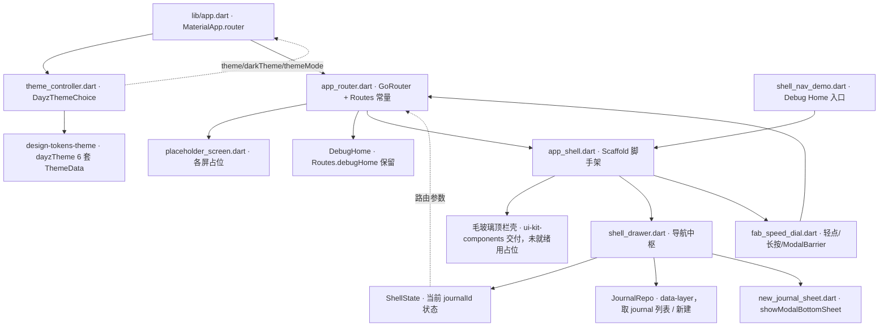

---
作者：@Ray
创建日期：2026-05-29
最后更新：2026-05-29
文档状态：草稿
---

# 设计：ui-shell-navigation

> 视觉与映射依据：[`docs/design/10-ui-restore-and-design-sync.md`](../../../docs/design/10-ui-restore-and-design-sync.md) §1/§3/§9/§10/§11、`ui-design/current/docs/DESIGN-REF.md` §4（抽屉 `.drawer-stage` / FAB `.fab-wrap`+`.fab-scrim` / 模式）、`ui-design/current/docs/PROTOTYPE-ARCH.md` §6（HTML 机制 → Flutter 映射：`go_router`/`Navigator`、`Scaffold.drawer`、`FloatingActionButton`+`GestureDetector(onLongPress)`、`showModalBottomSheet`、`ThemeMode.system`+`MediaQuery.platformBrightness`、`settheme/setmode`）。token/主题真源见 `design-tokens-theme`。

## 技术决策

### D1 · 路由方案与占位屏（go_router + placeholder）
- **状态：** 采纳
- **背景：** 本 spec 要为「当前全部屏」建路由，但屏内容归各页面级 spec、此刻尚未实现；外壳必须可独立跑通、可被页面级 spec 增量替换。
- **选项：** (A) 用 `Navigator 1.0` 命令式 + 手维护栈；(B) `go_router` 声明式路由表 + 每屏占位 Widget；(C) 直接等页面级 spec 各自注册（外壳不持路由表）。
- **选择：** B。`lib/ui/shell/app_router.dart` 持一张 `GoRouter` 路由表，屏名为 `static const` 常量（如 `Routes.timeline='/timeline'`）；每屏先指向一个统一的 `PlaceholderScreen`（显示屏名 + 「待页面级 spec 实现」），页面级 spec 后续把 `builder` 换成真实屏（只改本文件的某一行 builder 或由各屏 spec 在其文件变更里改 `app_router.dart` 的对应行——归属在 README/各屏 spec 协调）。
- **理由：** `go_router` 是 PROTOTYPE-ARCH §6 指定映射（HTML iframe 路由栈 → go_router/Navigator 2.0），声明式表对「一处登记、多处引用」最友好，`CupertinoPageRoute` 转场 + 边缘返回手势由其 `routerConfig` 经 `MaterialApp.router` 自带；占位屏让外壳此刻就能端到端跑通且不阻塞页面级 spec。
- **代价：** 引入 `go_router`（pubspec 白名单外共享依赖，已在 `## 文件变更` 列出）；路由名常量成为跨 spec 契约，改名需通知下游（记入 README 依赖与本 spec 已知风险）。

### D2 · 路由名常量 = 跨 spec 契约（稳定标识）
- **状态：** 采纳
- **背景：** 后续 10+ 个页面级 spec 都要引用「进入某屏」的路由名；命名若不稳定会引发大面积返工。
- **选项：** (A) 各屏 spec 各写裸字符串 `'/timeline'`；(B) 集中 `abstract final class Routes { static const ... }` 单一来源，屏名对齐设计稿 `screens/<id>.html` 的 id（timeline/reader/editor/onthisday/search/settings/calendar/favorites/trash/memory…）。
- **选择：** B。路由名集中、对齐设计稿屏 id（kebab/lower 与文件名一致），FAB/抽屉/各屏跳转一律引 `Routes.*` 常量、屏内禁裸路径字符串。
- **理由：** 与 D4「文案集中 AppStrings」同构——把「会被多处引用、改了易漏」的标识收敛到单一可审计落点；屏 id 直接复用设计稿真源，零额外命名争议。
- **代价：** 新增屏须先在 `Routes` 加常量（轻量）；屏 id 改名是破坏性变更，须升级通知（同 D1 代价）。

### D3 · 抽屉数据来源与导航边界
- **状态：** 采纳
- **背景：** 抽屉日记本组要列「各日记本 + 色点 + 计数」（对应 DB `journal.color`），浏览组/设置是纯导航。抽屉是 UI，取数受 Repository 边界硬约束（NF5）。
- **选项：** (A) 抽屉直接查 Drift 拿 journal 列表；(B) 抽屉经 `JournalRepo` 取 journal 列表（id/名/color/计数），浏览组/设置走 `Routes` 导航；(C) 抽屉只接收外部传入的 journal 列表、自身不取数。
- **选择：** B + C 折中：抽屉组件**接收** journal 列表作入参（由外壳/状态层经 `JournalRepo` 提供），自身不持 Repo 句柄更不持 Drift——既守 NF5、又让抽屉可被 widget test 用假数据独立验证。外壳层负责经 `JournalRepo` 取数喂给抽屉（data-layer 就绪前用内存假数据 / stub，记入已知风险）。
- **理由：** 取数集中在外壳一处过 `JournalRepo`，抽屉纯展示 + 发导航/切本事件，符合方法论 §10 第 4 条与 §3「跨屏外壳抽组件」。
- **代价：** 抽屉与取数解耦多一层入参传递；可接受，且利于测试。

### D4 · FAB 速拨：轻点 / 长按 / 遮罩的手势与展开
- **状态：** 采纳
- **背景：** 设计稿 FAB 轻点写日记、长按（原型 340ms）展开拍照/语音/纯文字，展开时 `.fab-scrim` 全屏遮罩压暗、点遮罩收起；`.fab-scrim` 是 `.fab-wrap` 的兄弟（z 低于按钮、覆盖整屏）。
- **选项：** (A) `FloatingActionButton.onPressed` + 单独长按检测，speed-dial 用第三方包；(B) `GestureDetector`（`onTap` 轻点 / `onLongPress` 展开）包裹自绘 FAB，遮罩用 `ModalBarrier`/`Overlay`，二级动作自绘 speed-dial（PROTOTYPE-ARCH §6 指定做法）；(C) 全用 `showModalBottomSheet` 当二级菜单。
- **选择：** B。`fab_speed_dial.dart`：轻点 → `Routes.editor` 导航；长按超阈值 → 经 `OverlayEntry`/`Stack` 展开二级动作并插入 `ModalBarrier`（半透 `context.dayz.overlay`）压暗背景；二级动作点击 → 收起 + 携创建意图入参导航编辑屏；点 `ModalBarrier` → 仅收起。立体感（渐变 + 多层影 + 顶高光）走 token（`fabGradient` + 三档 shadow，来自 `design-tokens-theme`），Flutter 无 inset 阴影，顶高光用顶部浅渐变 / 0.5px 半透白边（PROTOTYPE-ARCH §6）。长按阈值 = `kLongPressTimeout`（Flutter 默认 ~500ms）或显式取 ≈340ms 对齐原型，定为常量 `DayzMotion` 或本组件常量（实现时对齐设计稿 340ms，记常量）。
- **理由：** §6 明确「`FloatingActionButton` + 自定义 `GestureDetector(onLongPress)`；展开用自绘 speed-dial」；`ModalBarrier` 是 Flutter 全屏遮罩的标准件，对应 `.fab-scrim`，且 reduce-motion 下可瞬时呈现（NF4）。
- **代价：** 自绘 speed-dial 比用包多写动画与布局；换来与设计稿严格一致 + 无第三方依赖 + reduce-motion 可控，值。

### D5 · 切本与新建日记本的事件通路（不落库）
- **状态：** 采纳
- **背景：** R3 切本要让时间线刷新、R4 新建要把名+色交给落库；但数据查询/落库归 data-layer 与时间线屏 spec，本 spec 只能交付通路。
- **选项：** (A) 本 spec 直接查/写 journal 与 entries；(B) 本 spec 交付「当前日记本」状态 + 切本/新建的回调通路（经路由参数或一个轻量外壳状态持有者），落库/查询由 `JournalRepo`/`EntryRepo` 在 data-layer 与时间线屏完成。
- **选择：** B。外壳持「当前 journalId」状态（`ShellState`/简单状态持有者，本 spec 自带最小实现，不预设全局状态库）；切本 = 更新该状态并经路由参数传给时间线占位；新建 = sheet 提交回调把 `(name,color)` 交给 `JournalRepo.create`（接口归 data-layer，本 spec 调用其签名；未就绪则回调留 TODO + 内存追加，记已知风险）。**本 spec 不写任何 entries/journal 查询 SQL**（NF5）。
- **理由：** 把「外壳负责的事件编排」与「data-layer 负责的持久化」切干净，外壳可独立测试，落库就绪后只接线不返工。
- **代价：** data-layer 未就绪期间切本/新建是内存态、时间线看不到真实数据；这是分层必然，且占位屏阶段无真实列表，可接受（记已知风险）。

### D6 · 换肤控制器与偏好持久化
- **状态：** 采纳
- **背景：** R6/R7 要 `settheme`/`setmode` 驱动全树 rebuild + 跟随系统；偏好（主题色 + 外观模式 + 纸色）须跨会话记住，但加密落库归 data-layer。
- **选项：** (A) 用 `ChangeNotifier`/`ValueNotifier` 持 `(themeName, ThemeMode)`，`MaterialApp.router` 监听重建，偏好经数据层持久化；(B) 直接读写本地 KV；(C) 引第三方状态库。
- **选择：** A。`theme_controller.dart` 持 `DayzThemeChoice{ themeName: purple|amber|sage, mode: ThemeMode, paper }`，暴露 `setTheme/setMode`；`MaterialApp.router` 的 `theme`/`darkTheme` 取自 `design-tokens-theme` 的 `dayzTheme(themeName, light/dark)`，`themeMode` = 控制器 mode；`ThemeMode.system` 由 Flutter 自动按 `MediaQuery.platformBrightness` 解析（R7）。偏好持久化经数据层偏好入口（**待确认**：data-layer 是否暴露 settings/偏好 Repo；若无，先内存态，落库接线作为后续——记已知风险，不在本 spec 强行写库以免破 NF5）。
- **理由：** 二值/三值低频切换，`ChangeNotifier` 足够（与 design-tokens-theme 完整示例 D1 同构）；`ThemeMode.system` 是 Flutter 原生「跟随系统」，零额外监听。
- **代价：** 偏好落库依赖 data-layer 偏好入口就绪；未就绪期间重启不记忆，属已知风险（不阻塞外壳跑通）。

### D7 · 真外壳取代 DebugHome（Debug Home 降级为路由）
- **状态：** 采纳
- **背景：** `lib/app.dart` 现为 `home: DebugHome()`；方法论 §10 第 5 条要求真外壳取代它时同 commit 改 `lib/app.dart` 与 `CLAUDE.md`「Debug Home 入口模式」段。
- **选项：** (A) 删掉 Debug Home；(B) 把 `home:` 换成 `MaterialApp.router(routerConfig: appRouter)`，Debug Home 保留为一条具名路由 `Routes.debugHome`（仍可进，调试 demo 不丢）。
- **选择：** B。`lib/app.dart` 改用 `MaterialApp.router` + 注入 `theme_controller`；`DebugHome` 注册为 `Routes.debugHome` 占位路由（开发可达）；同 commit 更新 `CLAUDE.md`「Debug Home 入口模式」段，改写为「真外壳已接管启动入口，Debug Home 降级为具名路由 `Routes.debugHome`；新 demo 仍追加到 `demo_entry.dart` 的 `demos` 末尾」。
- **理由：** 保留 demo 调试能力（六套主题画廊等仍要看），又满足「真 UI 层取代 Debug Home」的结构性约定（CLAUDE.md 维护契约第②条触发 → 同 commit 改 CLAUDE.md）。
- **代价：** `lib/app.dart` 与 `CLAUDE.md` 是白名单外/慢变量文件，已在 `## 文件变更` 显式列出并须同 commit 落档；这是结构性变更的应有成本。

### D8 · Debug Home 入口（本 spec 自己的 demo）
- **状态：** 采纳
- **背景：** 每个基础 UI spec 末尾挂一个 Debug Home 入口、真机调试走 demo 页（方法论 §10 第 5 条、CLAUDE.md「Debug Home demo 入口模式」）。
- **选择：** 新建 `lib/demo/shell_nav_demo.dart`（在一台模拟设备框内渲染外壳：可开抽屉、切日记本、长按 FAB 看 speed-dial、换主题色/外观看全树 rebuild），并在 `lib/demo/demo_entry.dart` 的 `demos` 列表**末尾追加一行**（不插中间、不改 `DemoEntry` 字段）。即便 R8 已让真外壳成为启动入口，该 demo 仍是「外壳交互的可独立 pump 测试 + 真机走查」入口。
- **代价：** 与真外壳略有重复（demo 用假 journal 数据）；换来 widget test 可独立验证外壳交互、真机调试入口齐整，值。

### D9 · 覆盖式毛玻璃顶栏壳归属
- **状态：** 采纳
- **背景：** 覆盖式毛玻璃顶栏（滚动浮起、覆盖状态栏、`--top-h` 让位）是跨屏共用外壳（DESIGN-REF §3c / PROTOTYPE-ARCH §6 `extendBodyBehindAppBar`+`SliverAppBar`+`BackdropFilter`）。
- **选项：** (A) 本 spec 实现毛玻璃顶栏组件；(B) 顶栏视觉外观归 `ui-kit-components`，本 spec 只在外壳脚手架里**装配**它并接入抽屉钮/搜索钮/导航。
- **选择：** B。顶栏组件本体（毛玻璃配方、滚动渐显）属 `ui-kit-components`（DESIGN-REF §3 登记的跨屏外壳）；本 spec 的外壳脚手架（`app_shell.dart`）只**组合**：挂 `Scaffold(drawer:..., body:...)` + 顶栏组件 + FAB + SafeArea 让位，并接线菜单钮→开抽屉、搜索钮→导航 search。若 `ui-kit-components` 顶栏交付物未就绪，本 spec 用最小内联占位顶栏（仅菜单钮 + 标题 + 搜索钮，走 token），待其就绪替换（记已知风险）。
- **理由：** 守方法论「跨屏共用外壳抽成组件、在组件层落一次」；避免本 spec 与 ui-kit 重复实现毛玻璃。
- **代价：** 顶栏交付物未就绪期间用占位顶栏；可接受。

## 架构

## 文件变更

- `lib/ui/shell/app_router.dart`            新建（`GoRouter` 路由表 + `abstract final class Routes` 常量 + not-found 占位）
- `lib/ui/shell/app_shell.dart`             新建（`Scaffold` 脚手架：drawer + body + FAB + SafeArea 让位 + 装配顶栏壳）
- `lib/ui/shell/shell_drawer.dart`          新建（抽屉导航中枢：日记本组 + 浏览组 + 设置；接收 journal 列表入参、发导航/切本事件）
- `lib/ui/shell/fab_speed_dial.dart`        新建（FAB 轻点/长按 + `ModalBarrier` 遮罩 + 自绘 speed-dial；视觉走 token）
- `lib/ui/shell/new_journal_sheet.dart`     新建（新建日记本 `showModalBottomSheet` 表单：命名 + 选色，提交回调经 `JournalRepo`）
- `lib/ui/shell/theme_controller.dart`      新建（`ChangeNotifier` 持 `DayzThemeChoice`，`setTheme/setMode`，`ThemeMode.system` 跟随系统）
- `lib/ui/shell/shell_state.dart`           新建（外壳轻量状态：当前 journalId + 切本/新建事件通路；不持 Drift）
- `lib/ui/shell/placeholder_screen.dart`    新建（页面级 spec 就绪前的统一占位屏，显示屏名）
- `lib/ui/shell/shell_strings.dart`         新建（外壳中文文案集中到 `AppStrings`-同构常量类；屏内禁裸中文。**待确认**：若 `ui-kit-components`/tokens 已落 `AppStrings` 单类，则改为向其追加而非新建——归属在 README/ui-kit-components 协调，见已知风险）
- `lib/app.dart`                            修改（`home: DebugHome()` → `MaterialApp.router(routerConfig: appRouter)` + 注入 `theme_controller`）
- `lib/demo/shell_nav_demo.dart`            新建（外壳交互 Debug Home demo）
- `lib/demo/demo_entry.dart`                修改（**仅末尾追加一行**，不插中间、不改 `DemoEntry` 字段）
- `pubspec.yaml`                            修改（仅 `dependencies` 段加 `go_router`；白名单外共享依赖，显式列出）
- `CLAUDE.md`                               修改（「Debug Home demo 入口模式」段：说明真外壳已接管启动入口、Debug Home 降级为具名路由 `Routes.debugHome`、新 demo 仍追加 `demos` 末尾；与 R8 同 commit——CLAUDE.md 维护契约「真 UI 层取代 Debug Home」结构性约定触发）

> 全部新建文件落 `lib/ui/shell/`（外壳是跨屏共用层，非单个 feature；目录用 `shell/` 而非 `<feature>/`，符合方法论 §1「跨屏共用外壳」定位）与 `lib/demo/`。**不列入任何业务屏文件**（屏体归各页面级 spec）、**不列入** `lib/ui/widgets/`（组件归 ui-kit）、`lib/ui/theme/`（token 归 tokens-theme）。

## 已知风险

- **跨 spec 依赖未就绪的降级（W1 早于 data-layer 全就绪、ui-kit 并行）**：
  - `design-tokens-theme`：六套 `dayzTheme`/`context.dayz`/`fabGradient`/`AppStrings` 约定。**强依赖**——本 spec 换肤与视觉全建其上。若未定稿，本 spec 阻塞（应在其后启动）。
  - `ui-kit-components`：毛玻璃顶栏壳、sheet 封装、抽屉视觉件、`AppStrings` 单类落点。**未就绪时降级**：顶栏用最小内联占位（走 token）、sheet 用裸 `showModalBottomSheet`、文案先在 `shell_strings.dart` 集中（就绪后并入 ui-kit 的 `AppStrings`，归属在 README/ui-kit 协调）。
  - `data-layer`：`JournalRepo`（取 journal 列表 / 新建）、偏好入口（换肤持久化）。**未就绪时降级**：抽屉用内存假 journal 列表、切本/新建为内存态、换肤偏好不持久化（重启不记忆）。落库接线作为依赖就绪后的后续，**MUST NOT 为赶进度在外壳直接写 Drift/SQL**（NF5 红线）。
- **路由名常量是跨 spec 契约**（D2）：`Routes.*` 改名 = 破坏性变更，须在 README 依赖关系中体现、通知全部引用它的页面级 spec；本 spec 定稿后视为稳定标识。
- **FAB 长按阈值**：原型为 340ms；Flutter `onLongPress` 默认 ~500ms。实现时取显式 ≈340ms 常量对齐原型手感（记入组件常量），不直接用默认值（**实现时定值**）。
- **Android 毛玻璃降级**：`BackdropFilter` 在低端 Android 可能开销大，NF6 允许降级为半透实色 + 细分割线（与 PROTOTYPE-ARCH §6「Android 可接受降级」一致）；具体降级在顶栏组件（ui-kit）侧，本 spec 占位顶栏直接用半透实色即可。
- **`AppStrings` 落点二义**：design-tokens-theme D4 拍板「单个 `AppStrings` 类」，但明确「本 spec 只确立约定、不创建空文件」；故 `AppStrings` 实体落点应在首个有屏文案的 spec。本 spec 有外壳文案 → 暂用 `shell_strings.dart`（同构）承载，若 `ui-kit-components` 已建 `AppStrings` 单类则改为向其追加（**待确认**，归属在 README/ui-kit 协调，避免两处各建）。
- **无持久化 schema 变更**：本 spec 不新增/改 DB schema（偏好落库经 data-layer 既有入口或后续），→ 无数据迁移/回滚要素。
- **新文件加 MPL-2.0 头注**：`lib/ui/shell/*.dart`、`lib/demo/shell_nav_demo.dart` 等全部新建 Dart 文件 MUST 在文件顶部加 MPL-2.0 头注（模板见 README「License」/ AGENTS.md）。
