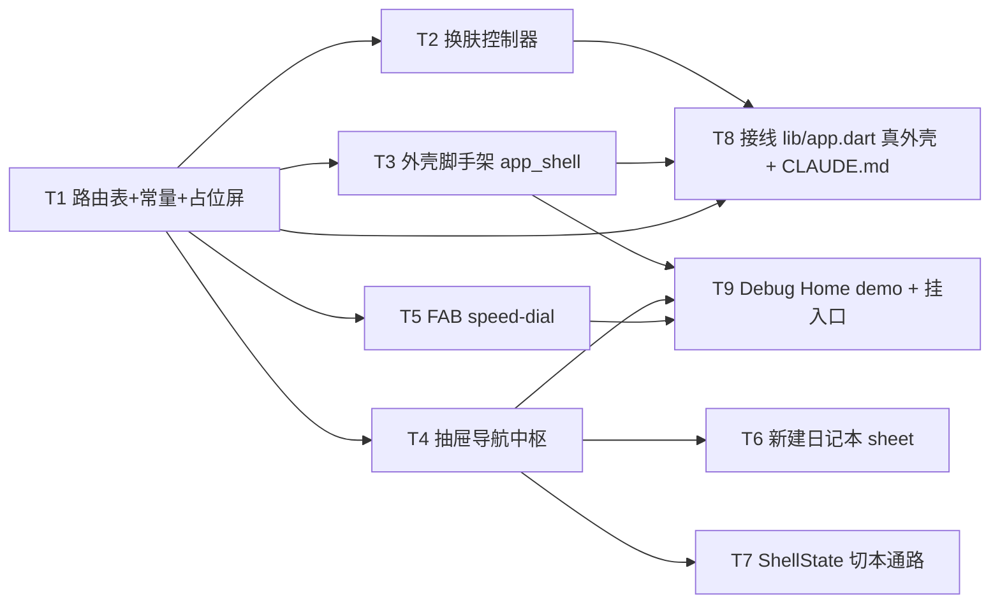

---
作者：@Ray
创建日期：2026-05-29
最后更新：2026-05-29
文档状态：草稿
---

# 任务列表：ui-shell-navigation

## 任务依赖图
> 由各任务 inline「同 spec 依赖」字段汇总，以 inline 为准。



并行组：
- Group A：T1（地基，先行）
- Group B：T2、T3、T4、T5（均依赖 T1，可并行）
- Group C：T6、T7（依赖 T4）
- Group D：T8（依赖 T1+T2+T3）、T9（依赖 T3+T4+T5）

里程碑（可选切点）：
- M1 · 可换肤的可路由空外壳（T1+T2+T3+T8）：真外壳取代 DebugHome、六套主题可切、各屏占位可达——可独立真机演示「外壳跑通」，对用户可见价值（导航骨架成形）。

-----

- [ ] T1 · go_router 路由表 + Routes 常量 + 占位屏

**同 spec 依赖：** 无 ｜ **跨 spec 依赖：** `design-tokens-theme：context.dayz / DayzSpacing / AppStrings 约定`（占位屏走 token + 文案） ｜ **关联需求：** R1 ｜ **依据设计：** D1, D2 ｜ **可改文件：** `lib/ui/shell/app_router.dart`、`lib/ui/shell/placeholder_screen.dart`、`lib/ui/shell/shell_strings.dart`、`pubspec.yaml`（仅 `dependencies` 段加 `go_router`） ｜ **验收基建：** `test/ui/shell/app_router_test.dart`

### 背景
全 spec 地基：声明式路由表 + `abstract final class Routes` 常量（屏名对齐设计稿 `ui-design/current/pages/screens/` 的 id：timeline/reader/editor/onthisday/search/settings/calendar/favorites/trash/memory，外加 `debugHome`），每屏先指向统一 `PlaceholderScreen`，并设初始路由与 not-found 占位。`shell_strings.dart` 集中本 spec 中文文案（占位屏标题等），屏内禁裸中文（D4）。归属：本任务只动 `pubspec.yaml` 的 `dependencies`（加 `go_router`），不碰 `fonts:`/dev_dependencies。

### 实施
1. `pubspec.yaml` 的 `dependencies` 加 `go_router`（活跃维护，跟随稳定版）。
2. `Routes`：每屏一个 `static const String` 路径常量 + 具名路由名；屏 id 对齐设计稿文件名。
3. `app_router.dart`：`GoRouter(routes: [...], initialLocation: Routes.timeline, errorBuilder: not-found 占位)`，每屏 `builder` 暂返 `PlaceholderScreen(title: 屏名)`。
4. `placeholder_screen.dart`：居中显示屏名 + 「待页面级 spec 实现」，颜色/间距/文字全走 `context.dayz.*`/`DayzSpacing`/`shell_strings.dart`（禁硬编码、禁裸中文）。
5. 全部新建 `.dart` 加 MPL-2.0 头注。

### 验收标准（做完即止）
- 设计稿 `screens/` 当前每屏均有对应 `Routes` 常量与一条注册路由（自动：用 `GoRouter` 配置断言每个 `Routes.*` 路径可解析到一个 builder）。
- `context.goNamed/go` 到某屏路由 → 渲染对应 `PlaceholderScreen` 且标题等于该屏名（自动，pump `MaterialApp.router` 后断言 `find.text(ShellStrings.xxx)`）。
- 未知路径 → 渲染 not-found 占位、不抛异常（自动）。
- `flutter pub get` 通过、`go_router` 可 import（自动）。

### 验收方式
- 自动：
  ```bash
  flutter pub get && flutter test test/ui/shell/app_router_test.dart
  ```
  （pump `MaterialApp.router(routerConfig: testRouter)`，逐路由导航后断言渲染的占位屏标题与 not-found 行为；**不** grep 路由文件自身）

### 验收记录
```
日期：—
自动：—
人工：N/A
```

-----

- [ ] T2 · 换肤控制器 theme_controller.dart

**同 spec 依赖：** T1 ｜ **跨 spec 依赖：** `design-tokens-theme：dayzTheme(themeName, mode) 六套 ThemeData + context.dayz` ｜ **关联需求：** R6, R7 ｜ **依据设计：** D6 ｜ **可改文件：** `lib/ui/shell/theme_controller.dart` ｜ **验收基建：** `test/ui/shell/theme_controller_test.dart`

### 背景
`ChangeNotifier` 持 `DayzThemeChoice{ themeName: purple|amber|sage, mode: ThemeMode, paper }`，暴露 `setTheme(name)`/`setMode(mode)`，供 `MaterialApp.router` 监听。偏好持久化经 data-layer 偏好入口（**待确认**，未就绪则内存态，见 design 已知风险）；本任务不写 Drift/SQL（NF5）。

### 实施
1. `DayzThemeChoice` 值对象 + `ThemeController extends ChangeNotifier`。
2. `setTheme`/`setMode` 改状态并 `notifyListeners`。
3. 提供 `materialTheme`/`materialDarkTheme`（取自 `dayzTheme(themeName, light/dark)`）与 `themeMode`（含 `ThemeMode.system`）。
4. 偏好持久化：若 data-layer 偏好入口就绪则经其读写；未就绪留接线点 + 内存态（不写 Drift）。

### 实施边界
职责只到「内存状态 + 暴露 ThemeData/themeMode」；接入 `MaterialApp` 归 T8，不在本任务挂载。

### 验收标准（做完即止）
- `setTheme('amber')` 后 `materialTheme` 的 `context.dayz.accent` == amber light 真值；`setMode(dark)` 后 `themeMode==ThemeMode.dark`（自动，widget test 经 controller 装 ThemeData 后读 extension）。
- `setMode(ThemeMode.system)` 时 `themeMode==system`，且在 `platformBrightness=dark` 的 `MediaQuery` 下渲染暗主题（自动，R7：用 `MediaQuery` 包裹断言生效的 brightness）。
- `notifyListeners` 在每次 set 后触发（自动，监听计数）。

### 验收方式
- 自动：
  ```bash
  flutter test test/ui/shell/theme_controller_test.dart
  ```

### 验收记录
```
日期：—
自动：—
人工：N/A
```

-----

- [ ] T3 · 外壳脚手架 app_shell.dart

**同 spec 依赖：** T1 ｜ **跨 spec 依赖：** `ui-kit-components：毛玻璃顶栏壳（未就绪用占位顶栏）`、`design-tokens-theme：token` ｜ **关联需求：** R2（装配抽屉入口）, R5（装配 FAB 位）, NF6 ｜ **依据设计：** D3, D9 ｜ **可改文件：** `lib/ui/shell/app_shell.dart` ｜ **验收基建：** `test/ui/shell/app_shell_test.dart`

### 背景
跨屏共用脚手架：`Scaffold(drawer: ShellDrawer, body: <子屏>, floatingActionButton: FabSpeedDial)` + SafeArea 让位 + 装配顶栏壳（ui-kit 顶栏交付物，未就绪用最小内联占位顶栏，走 token）。接线：顶栏菜单钮 → `Scaffold.openDrawer`；搜索钮 → 导航 `Routes.search`。归属：本任务只搭脚手架与接线，抽屉/FAB 本体分别归 T4/T5（脚手架引用它们的组件类型）。

### 实施
1. `AppShell({required Widget body})`：`Scaffold` 挂 drawer（T4 组件）、FAB（T5 组件）、顶栏（ui-kit 或占位）。
2. SafeArea / `extendBodyBehindAppBar` 处理状态栏/底部安全区让位（NF6）。
3. 顶栏菜单钮 `onTap` → 开抽屉（Semantics 标签「菜单」，NF3）；搜索钮 → `Routes.search`（标签「搜索」）。
4. reduce-motion：抽屉/FAB 动画在 `MediaQuery.disableAnimations` 下退化（NF4，转场本身由 go_router/Scaffold 提供，本任务确保不强加额外动画）。

### 验收标准（做完即止）
- 渲染 `AppShell` → 存在 `Scaffold` 且可 `openDrawer`（自动，widget test：触发菜单钮后抽屉出现）。
- 菜单钮、搜索钮命中区 ≥ 44px（自动，`tester.getSize` 断言 ≥ 44，NF1）。
- 菜单/搜索钮有 Semantics 标签「菜单」「搜索」（自动，`find.bySemanticsLabel(ShellStrings.menu)` 等，NF3）。
- 搜索钮点击导航到 `Routes.search`（自动，断言当前路由变为 search 占位）。

### 验收方式
- 自动：
  ```bash
  flutter test test/ui/shell/app_shell_test.dart
  ```

### 验收记录
```
日期：—
自动：—
人工：N/A
```

-----

- [ ] T4 · 抽屉导航中枢 shell_drawer.dart

**同 spec 依赖：** T1 ｜ **跨 spec 依赖：** `data-layer：JournalRepo（journal 列表 id/名/color/计数；未就绪用内存假数据入参）`、`design-tokens-theme：token` ｜ **关联需求：** R2, R3（发切本事件）, NF1, NF3 ｜ **依据设计：** D3 ｜ **可改文件：** `lib/ui/shell/shell_drawer.dart` ｜ **验收基建：** `test/ui/shell/shell_drawer_test.dart`

### 背景
取代标签栏的导航抽屉：日记本组（全部日记 + 各 journal 带 `.dw-dot` 色点 + 计数）、浏览组（往年今日/收藏/日历/回收站）、底部设置；**搜索不入抽屉**。抽屉**接收 journal 列表作入参**（外壳经 `JournalRepo` 提供，本任务不持 Repo/Drift，NF5），点导航项发 `Routes.*` 导航、点日记本发切本回调（R3，真实刷新归时间线屏；本任务只发事件）。归属：journal 数据的真实查询归 data-layer，本任务用入参 + 回调，禁止任何 SQL/Drift。

### 实施
1. `ShellDrawer({required List<JournalSummary> journals, required currentJournalId, required onSelectJournal, required onNavigate, required onNewJournal})`（入参/回调皆外部注入）。
2. 三分区布局：日记本组（色点用 journal.color，唯一彩色例外，DESIGN-REF §5）、浏览组、底部设置。
3. 点浏览组/设置 → `onNavigate(Routes.xxx)`；点日记本 → `onSelectJournal(id)`（选中态 `.on`，R3）；点「新建日记本」→ `onNewJournal()`（R4 通路，sheet 实现归 T6）。
4. 每行命中区 ≥ 44px（NF1）；每项 Semantics 标签为项名（NF3）；视觉走 token（NF7）。

### 验收标准（做完即止）
- 给定假 journal 列表 → 抽屉渲染对应条目数 + 各色点 + 计数（自动，按 journal 数断言行数）。
- 点浏览组某项（如收藏）→ `onNavigate` 收到 `Routes.favorites`（自动，回调捕获断言）。
- 点某日记本 → `onSelectJournal` 收到其 id 且该项呈选中态（自动）。
- 抽屉项命中区 ≥ 44px、各项有 Semantics 标签（自动，NF1/NF3）。
- 抽屉内不含「搜索」入口（自动，断言无搜索项 / 搜索走顶栏）。
- 抽屉代码不 import drift / 不含 SQL（人工，@Ray 复核 NF5；自动侧由 verification 静态核验兜底）。

### 验收方式
- 自动：
  ```bash
  flutter test test/ui/shell/shell_drawer_test.dart
  ```
- 人工：
  - @Ray 复核 `shell_drawer.dart` 经 `JournalRepo` 入参取数、无 Drift 句柄（NF5 边界）。

### 验收记录
```
日期：—
自动：—
人工：待确认（核查人 @Ray）
```

-----

- [ ] T5 · FAB speed-dial fab_speed_dial.dart

**同 spec 依赖：** T1 ｜ **跨 spec 依赖：** `design-tokens-theme：fabGradient / 三档 shadow / overlay token` ｜ **关联需求：** R5, NF1, NF3, NF4 ｜ **依据设计：** D4 ｜ **可改文件：** `lib/ui/shell/fab_speed_dial.dart` ｜ **验收基建：** `test/ui/shell/fab_speed_dial_test.dart`

### 背景
FAB：轻点 → `Routes.editor`；长按（≈340ms 对齐原型，常量）→ 展开二级动作（拍照/语音/纯文字）并插 `ModalBarrier`（半透 `context.dayz.overlay`）；二级动作点击 → 收起 + 携创建意图导航编辑屏；点 `ModalBarrier` → 仅收起。立体走 token（`fabGradient` + 多层影 + 顶高光），无 inset 阴影。

### 实施
1. `GestureDetector(onTap: 导航 editor, onLongPress: 展开)` 包自绘 FAB；长按阈值取显式 ≈340ms 常量。
2. 展开：`Overlay`/`Stack` 放二级动作 + `ModalBarrier(color: overlay)`；reduce-motion 下瞬时呈现（NF4）。
3. 二级动作各带 `data-label` 对应文案（拍照/语音/纯文字，经 `ShellStrings`）与 Semantics 标签（NF3）；点击 → 收起 + 导航 editor（携意图入参）。
4. FAB 主键与二级键命中区 ≥ 44px（NF1）；视觉走 token（NF7）；点 `ModalBarrier` 收起、不导航。

### 验收标准（做完即止）
- 轻点 FAB → 导航 `Routes.editor`（自动，断言路由变化或导航回调被调）。
- 长按超阈值 → 二级动作（三项）出现且有 `ModalBarrier`（自动，`find.byType(ModalBarrier)` + 找到三动作）。
- 点 `ModalBarrier` → 二级动作收起、未发生导航（自动）。
- 点某二级动作 → 收起 + 导航 editor（自动）。
- reduce-motion（`MediaQuery(disableAnimations:true)`）下展开为即时态、无过渡动画（自动，pump 一帧即到终态，NF4）。
- FAB 主键 + 二级键命中区 ≥ 44px、各有 Semantics 标签（自动，NF1/NF3）。

### 验收方式
- 自动：
  ```bash
  flutter test test/ui/shell/fab_speed_dial_test.dart
  ```

### 验收记录
```
日期：—
自动：—
人工：N/A
```

-----

- [ ] T6 · 新建日记本 sheet new_journal_sheet.dart

**同 spec 依赖：** T4 ｜ **跨 spec 依赖：** `data-layer：JournalRepo.create(name,color)（未就绪留接线点）`、`design-tokens-theme：token`、`ui-kit-components：sheet 封装（未就绪用裸 showModalBottomSheet）` ｜ **关联需求：** R4, NF1, NF3 ｜ **依据设计：** D5 ｜ **可改文件：** `lib/ui/shell/new_journal_sheet.dart` ｜ **验收基建：** `test/ui/shell/new_journal_sheet_test.dart`

### 背景
`showModalBottomSheet` 轻表单：命名输入 + 六色选色（`.nj-*`：三主题色 + 三扩展色，选中态外环+白勾）。确认 → 把 `(name, color)` 交提交回调（经 `JournalRepo.create`，落库归 data-layer，本任务调用其签名 / 未就绪留 TODO 回调，禁写 SQL）。取消/确认后 sheet 关闭。

### 实施
1. `Future<JournalDraft?> showNewJournalSheet(context)` 或 `onSubmit(name,color)` 回调式；圆角顶 + 拖拽柄 + `SafeArea` 底部留白（PROTOTYPE-ARCH §6）。
2. 命名 `TextField`（文案经 `ShellStrings`）+ 六色选色钮（选中态可观测）。
3. 确认按钮在名非空时可用；提交把 `(name,color)` 经回调交 `JournalRepo`（未就绪留接线点，不写 Drift）。
4. 选色钮命中区 ≥ 44px（NF1）；各钮 Semantics 标签（NF3）；视觉走 token（NF7）。

### 验收标准（做完即止）
- 打开 sheet → 含命名输入 + 六个选色钮（自动，按数断言）。
- 选某色 → 该色呈选中态（外环/勾，自动）。
- 名非空 + 确认 → 提交回调收到 `(name, 选中 color)` 且 sheet 关闭（自动，回调捕获）。
- 取消 → sheet 关闭、回调未提交（自动）。
- 选色钮命中区 ≥ 44px、有 Semantics 标签（自动，NF1/NF3）。

### 验收方式
- 自动：
  ```bash
  flutter test test/ui/shell/new_journal_sheet_test.dart
  ```

### 验收记录
```
日期：—
自动：—
人工：N/A
```

-----

- [ ] T7 · ShellState 切本通路 shell_state.dart

**同 spec 依赖：** T4 ｜ **跨 spec 依赖：** `data-layer：JournalRepo（journal 列表来源；未就绪内存假数据）` ｜ **关联需求：** R3 ｜ **依据设计：** D5 ｜ **可改文件：** `lib/ui/shell/shell_state.dart` ｜ **验收基建：** `test/ui/shell/shell_state_test.dart`

### 背景
外壳轻量状态：持「当前 journalId」（含「全部日记」哨兵），暴露 `selectJournal(id)` 切本并通知；切本结果经路由参数/状态传给时间线占位（真实刷新归时间线屏，本任务只交付通路）。journal 列表来源经 `JournalRepo`（外壳取数喂入），本任务不持 Drift（NF5）。归属：与 T4 的关系——T4 抽屉发 `onSelectJournal` 事件，本任务的 `ShellState` 是该事件的接收/持有方；切本后「时间线如何刷新查询」归时间线屏 spec。

### 实施
1. `ShellState extends ChangeNotifier`：`currentJournalId`（默认全部日记哨兵）、`selectJournal(id)`、journal 列表入参/getter。
2. `selectJournal` 改状态 + `notifyListeners`；提供「当前 journalId」给路由/时间线占位读取。
3. 不查询 entries、不写 SQL（NF5）。

### 验收标准（做完即止）
- `selectJournal(id)` 后 `currentJournalId==id` 且 `notifyListeners` 触发（自动）。
- 默认值为「全部日记」哨兵（自动）。
- `ShellState` 代码不 import drift（人工，@Ray 复核 NF5；verification 静态核验兜底）。

### 验收方式
- 自动：
  ```bash
  flutter test test/ui/shell/shell_state_test.dart
  ```
- 人工：
  - @Ray 复核 `shell_state.dart` 无 Drift 句柄、journal 来源经 `JournalRepo`（NF5）。

### 验收记录
```
日期：—
自动：—
人工：待确认（核查人 @Ray）
```

-----

- [ ] T8 · 接线真外壳：lib/app.dart + CLAUDE.md

**同 spec 依赖：** T1, T2, T3 ｜ **跨 spec 依赖：** `design-tokens-theme：dayzTheme 六套` ｜ **关联需求：** R6, R7, R8 ｜ **依据设计：** D6, D7 ｜ **可改文件：** `lib/app.dart`、`CLAUDE.md`（仅「Debug Home demo 入口模式」段） ｜ **验收基建：** `test/app_router_mount_test.dart`

### 背景
把 `lib/app.dart` 的 `home: DebugHome()` 换成 `MaterialApp.router(routerConfig: appRouter)`，注入 `ThemeController`（`theme`/`darkTheme`/`themeMode` 取自 T2），`DebugHome` 降级为 `Routes.debugHome` 具名路由（T1 已注册或本任务补注册）。同 commit 更新 `CLAUDE.md`「Debug Home demo 入口模式」段（真外壳已接管启动入口、Debug Home 降级具名路由、新 demo 仍追加 `demos` 末尾）——CLAUDE.md 维护契约「真 UI 层取代 Debug Home」结构性约定触发，须同 commit 落档（活先例 design-tokens-theme T1 的命令同 commit）。

### 实施
1. `lib/app.dart`：`MaterialApp.router(routerConfig: appRouter, theme: controller.materialTheme, darkTheme: controller.materialDarkTheme, themeMode: controller.themeMode)`，监听 `ThemeController` 重建。
2. 确保 `DebugHome` 经 `Routes.debugHome` 可达（开发入口不丢）。
3. 改 `CLAUDE.md`「Debug Home demo 入口模式」段（按段落定位、勿用行号）：说明启动入口已由真外壳接管、Debug Home 为具名路由、新 demo 追加 `demos` 末尾不变。

### 验收标准（做完即止）
- App 冷启动 → 进入初始路由（时间线占位）而非 `DebugHome`（自动，pump `DayZApp` 后断言渲染时间线占位、`find` 不到 DebugHome 为 home）。
- 经 `ThemeController.setTheme/setMode` → 全树渲染切换到目标主题×模式（自动，pump 后改 controller、断言 `context.dayz.accent`/brightness 变化，R6/R7）。
- `Routes.debugHome` 仍可导航进入 DebugHome（自动）。
- `CLAUDE.md`「Debug Home demo 入口模式」段已更新（人工，@Ray 复核文案准确、未删 demo 追加约定）。

### 验收方式
- 自动：
  ```bash
  flutter test test/app_router_mount_test.dart
  ```
  （pump `DayZApp` 断言启动落点 + 换肤全树 rebuild + debugHome 可达；**不** grep app.dart/CLAUDE.md 自身）
- 人工：
  - @Ray 复核 `CLAUDE.md`「Debug Home demo 入口模式」段更新无误。

### 验收记录
```
日期：—
自动：—
人工：待确认（核查人 @Ray）
```

-----

- [ ] T9 · 外壳交互 Debug Home demo + 挂入口

**同 spec 依赖：** T3, T4, T5 ｜ **跨 spec 依赖：** 无 ｜ **关联需求：** R2, R3, R5, R6 ｜ **依据设计：** D8 ｜ **可改文件：** `lib/demo/shell_nav_demo.dart`、`lib/demo/demo_entry.dart` ｜ **验收基建：** `test/demo/shell_nav_demo_test.dart`

### 背景
Debug Home 入口：在 demo 里用假 journal 数据渲染完整外壳，可开抽屉、切本、长按 FAB 看 speed-dial、换主题色/外观看全树 rebuild。`demo_entry.dart` 的 `demos` 列表**末尾追加一行**（不插中间、不改 `DemoEntry` 字段）。

### 实施
1. `shell_nav_demo.dart`：`AppShell` + 假 journal 列表 + `ThemeController`，提供切主题/外观的调试触发。
2. `demo_entry.dart` 末尾追加一行 `DemoEntry(...)` 指向 `ShellNavDemo`。

### 禁止
- 不改 `DemoEntry` 字段定义；不在 `demos` 中间插入；不动既有 demo；不在 demo 里写真实 Drift 查询（用假数据）。

### 验收标准（做完即止）
- `demos` 末尾新增项指向 `shell_nav_demo`，Debug Home 可进入（自动，widget test：构建 demo 列表 `find` 到该项并 pump 进入）。
- demo 内可开抽屉、长按 FAB 出二级动作（自动，复用 T3/T4/T5 交互断言抽样）。
- 切主题色后取色随之变化（自动，抽查 `context.dayz.accent`）。
- 既有 demo 不受影响（自动，Debug Home 列表回归）。
- 真机/模拟器外壳交互（抽屉/FAB/换肤/SafeArea 让位）人工走查（人工，@Ray，多端 NF6 走查并入此项）。

### 验收方式
- 自动：
  ```bash
  flutter test test/demo/shell_nav_demo_test.dart test/demo/debug_home_test.dart
  ```
- 人工：
  - @Ray 真机走查外壳交互（抽屉滑入/切本/FAB 长按/换肤即时/iOS 与 Android SafeArea 与返回手势）。

### 验收记录
```
日期：—
自动：—
人工：待确认（核查人 @Ray）
```
